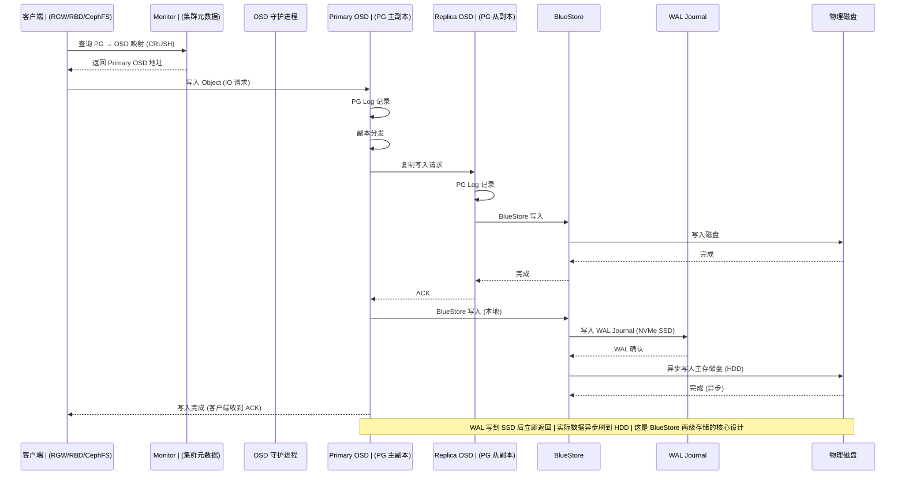
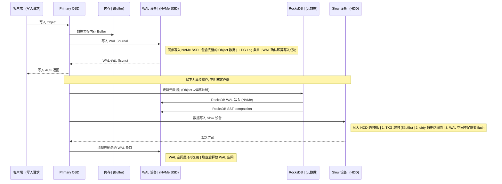
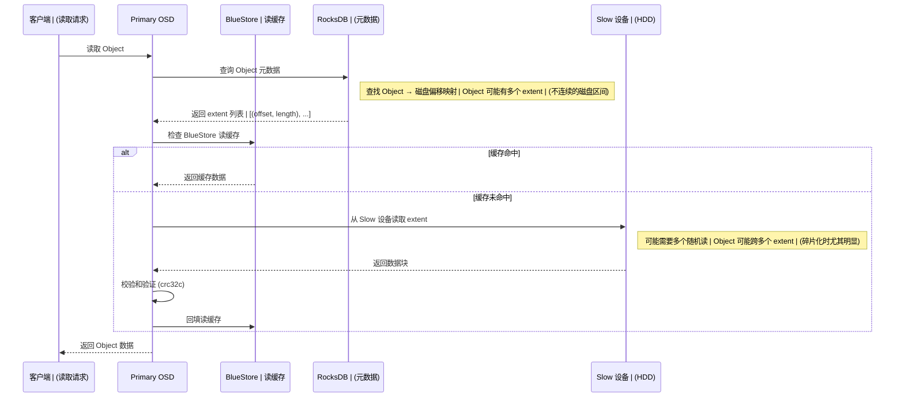

# Ceph OSD 存储模型与 BlueFS 元数据分析

---

## 1. Ceph 存储架构总览

Ceph 采用统一的分布式对象存储架构 RADOS (Reliable Autonomic Distributed Object Store)，所有上层接口最终都转化为 RADOS 对象存储到 OSD 上：

```
┌─────────────────────────────────────────────────────────────┐
│                      客户端接口层                             │
│  ┌──────────┐  ┌──────────┐  ┌──────────┐  ┌────────────┐  │
│  │   RGW    │  │   RBD    │  │  CephFS  │  │  librados  │  │
│  │(S3/Swift)│  │(块设备)  │  │(POSIX FS)│  │ (原生API)  │  │
│  └────┬─────┘  └────┬─────┘  └────┬─────┘  └─────┬──────┘  │
│       └──────────────┴──────────────┴───────────────┘        │
│                         │                                    │
│                     librados                                  │
└─────────────────────────┼────────────────────────────────────┘
                          │
                          ▼
┌─────────────────────────────────────────────────────────────┐
│                      RADOS 对象层                            │
│                                                              │
│  Object → PG (Placement Group) → OSD (CRUSH 算法寻址)       │
│  三副本默认, PG 保证数据分布和恢复的粒度                      │
└─────────────────────────┼────────────────────────────────────┘
                          │
              ┌───────────┼───────────┐
              ▼           ▼           ▼
        ┌──────────┐ ┌──────────┐ ┌──────────┐
        │  OSD 0   │ │  OSD 1   │ │  OSD 2   │
        │BlueStore │ │BlueStore │ │BlueStore │
        └──────────┘ └──────────┘ └──────────┘
```

**关键点**: 不管客户端用什么接口 (对象/块/文件), 数据最终都以 RADOS Object 的形式存储在 OSD 的 BlueStore 中。

---

## 2. OSD I/O 路径



---

## 3. BlueStore 架构详解

### 3.1 整体结构

```
┌─────────────────────────────────────────────────────────────┐
│                     OSD 守护进程                              │
│                                                              │
│  ┌──────────────────────────────────────────────────────┐   │
│  │                    BlueStore                          │   │
│  │                                                       │   │
│  │  ┌────────────────────────────────────────────────┐   │   │
│  │  │              RocksDB (元数据引擎)                │   │   │
│  │  │  存储内容:                                      │   │   │
│  │  │  - Object → 磁盘偏移映射 (omap)                 │   │   │
│  │  │  - PG Log (写日志)                              │   │   │
│  │  │  - Object 属性 (extents, attrs)                 │   │   │
│  │  │  - BlueFS 自身元数据 (inode, file info)         │   │   │
│  │  └────────────────────┬───────────────────────────┘   │   │
│  │                       │                                │   │
│  │  ┌────────────────────▼───────────────────────────┐   │   │
│  │  │              BlueFS (轻量文件系统)               │   │   │
│  │  │  职责: 管理 RocksDB 的 WAL 和 SST 文件          │   │   │
│  │  │  特点: 直接操作裸块, 不需要传统 FS              │   │   │
│  │  │  逻辑: file_id → (offset, size, on_which_bdev)  │   │   │
│  │  └────────────────────┬───────────────────────────┘   │   │
│  │                       │                                │   │
│  │  ┌────────────────────▼───────────────────────────┐   │   │
│  │  │         BlockDevice 层 (裸块设备管理)           │   │   │
│  │  │  支持多设备:                                    │   │   │
│  │  │  - BDEV_WAL:  高速设备 (NVMe, 存WAL)           │   │   │
│  │  │  - BDEV_DB:   高速设备 (SSD, 存DB元数据)       │   │   │
│  │  │  - BDEV_SLOW: 大容量设备 (HDD, 存用户数据)     │   │   │
│  │  └────────────────────┬───────────────────────────┘   │   │
│  └───────────────────────┼────────────────────────────────┘   │
│                          │                                    │
└──────────────────────────┼────────────────────────────────────┘
                           │
              ┌────────────┼────────────┐
              ▼            ▼            ▼
         ┌────────┐  ┌────────┐  ┌──────────┐
         │  WAL   │  │   DB   │  │  Slow    │
         │(NVMe)  │  │ (SSD)  │  │  (HDD)   │
         │RocksDB  │  │RocksDB │  │用户数据   │
         │WAL日志  │  │SST文件 │  │Object数据 │
         └────────┘  └────────┘  └──────────┘
```

### 3.2 数据分布策略

| 区域 | 存储设备 | 存放内容 | 性能要求 |
|------|---------|---------|---------|
| **WAL** | NVMe SSD | RocksDB WAL (预写日志) | 极低延迟 |
| **DB** | SSD | RocksDB SST 文件 + BlueFS 元数据 | 中等延迟 |
| **Slow/主** | HDD | 用户 Object 数据 (实际数据块) | 大容量 |

---

## 4. BlueFS 自身元数据的"鸡生蛋"问题

### 4.1 问题本质

BlueFS 的职责是管理 RocksDB 的文件 (WAL、SST)，但 BlueFS 自身也有元数据 (inode、文件大小、磁盘偏移等)。这些元数据存在哪里？

```
BlueFS 管理 RocksDB 的文件
       ↕  互相依赖
RocksDB 存储 BlueFS 的元数据

问题: 启动时谁先加载?
  → 打开 RocksDB 需要 BlueFS 管理其文件
  → 加载 BlueFS 元数据需要先打开 RocksDB
  → 死锁!
```

### 4.2 解决方案: Superblock 打破循环

```
┌─────────────────────────────────────────────────────────────┐
│                   BlueFS 启动引导流程                         │
│                                                              │
│  ┌──────────────────────────────────────────────────────┐   │
│  │  Step 1: 读取 Superblock (裸块设备固定偏移)           │   │
│  │                                                       │   │
│  │  位置: WAL 设备偏移 0x1000 (4096 字节)                │   │
│  │                                                       │   │
│  │  ┌─────────────────────────────────────────┐          │   │
│  │  │ struct bluefs_superblock_t {            │          │   │
│  │  │   magic: "bluefs superblock"            │          │   │
│  │  │   uuid: <RocksDB 的 UUID>               │          │   │
│  │  │   osd_uuid: <OSD UUID>                  │          │   │
│  │  │   ctime: <创建时间>                     │          │   │
│  │  │   bluefs_files: [                       │          │   │
│  │  │     {id: 1, size: ..., offset: ...},    │          │   │
│  │  │     {id: 2, size: ..., offset: ...},    │          │   │
│  │  │     {id: 3, size: ..., offset: ...},    │          │   │
│  │  │   ]                                      │          │   │
│  │  │ }                                        │          │   │
│  │  └─────────────────────────────────────────┘          │   │
│  │                                                       │   │
│  │  作用: 提供最小元数据, 知道 RocksDB 文件的位置和大小   │   │
│  └────────────────────┬─────────────────────────────────┘   │
│                         │                                    │
│  ┌─────────────────────▼─────────────────────────────────┐   │
│  │  Step 2: 用 Superblock 信息打开 RocksDB               │   │
│  │                                                       │   │
│  │  BlueFS 根据 Superblock 中记录的文件偏移和大小,         │   │
│  │  读取 RocksDB 的 WAL 和 SST 文件, 成功打开 RocksDB     │   │
│  └────────────────────┬─────────────────────────────────┘   │
│                         │                                    │
│  ┌─────────────────────▼─────────────────────────────────┐   │
│  │  Step 3: 从 RocksDB 读取完整 BlueFS 元数据             │   │
│  │                                                       │   │
│  │  RocksDB 中存储的 BlueFS 元数据 (Key-Value):           │   │
│  │                                                       │   │
│  │  ┌──────────────────────────────────────────┐          │   │
│  │  │ Prefix "B" (BlueFS 专属列):              │          │   │
│  │  │                                          │          │   │
│  │  │ Key: B\0\0files\0<file_id>               │          │   │
│  │  │ Value: {                                 │          │   │
│  │  │   "inode": {                             │          │   │
│  │  │     "fnode": {                           │          │   │
│  │  │       "ino": <file_id>,                 │          │   │
│  │  │       "size": <文件逻辑大小>,             │          │   │
│  │  │       "mtime": <修改时间>,               │          │   │
│  │  │       "stored_size": <磁盘占用大小>,     │          │   │
│  │  │       "stored_offset": <磁盘起始偏移>,   │          │   │
│  │  │       "bdev": <设备类型: WAL/DB/SLOW>    │          │   │
│  │  │     }                                    │          │   │
│  │  │   }                                      │          │   │
│  │  │ }                                        │          │   │
│  │  │                                          │          │   │
│  │  │ Key: B\0\0journal\0<offset>               │          │   │
│  │  │ Value: journal 条目 (分配/释放记录)       │          │   │
│  │  └──────────────────────────────────────────┘          │   │
│  └────────────────────┬─────────────────────────────────┘   │
│                         │                                    │
│  ┌─────────────────────▼─────────────────────────────────┐   │
│  │  Step 4: BlueFS 完全就绪                               │   │
│  │                                                       │   │
│  │  现在拥有完整的 inode/dentry/文件信息                   │   │
│  │  可以正常管理 RocksDB 的所有文件 (分配/回收空间)       │   │
│  │  后续 RocksDB 的 SST 文件变化也会通过 journal 记录    │   │
│  └──────────────────────────────────────────────────────┘   │
└─────────────────────────────────────────────────────────────┘
```

### 4.3 元数据存储总结

| 数据类型 | 存储位置 | 用途 |
|---------|---------|------|
| **BlueFS Superblock** | 裸块设备固定偏移 (WAL 盘 0x1000) | 启动引导, 包含最小文件列表 |
| **BlueFS inode/文件信息** | RocksDB (Key: `B\0\0files\0<id>`) | 完整的文件元数据 (大小/偏移/设备) |
| **BlueFS Journal** | RocksDB (Key: `B\0\0journal\0...`) | 空间分配/释放日志 |
| **RocksDB WAL** | BlueFS 管理的 WAL 文件 (NVMe) | RocksDB 预写日志 |
| **RocksDB SST** | BlueFS 管理的 DB 文件 (SSD) | RocksDB 数据文件 |
| **用户 Object 数据** | BlueStore 直接写 Slow 设备 (HDD) | 实际数据块 |

---

## 5. BlueStore 写入 I/O 完整路径



---

## 6. BlueStore 读取 I/O 完整路径



---

## 7. FileStore vs BlueStore 对比

Ceph 早期使用 FileStore (基于传统文件系统 XFS/ext4), Luminous (v12) 后 BlueStore 成为默认:

| 维度 | FileStore (已废弃) | BlueStore (当前默认) |
|------|-------------------|---------------------|
| **底层存储** | XFS/ext4 文件系统 | 直接管理裸块设备 |
| **元数据** | 文件系统 journal | RocksDB (嵌入式 KV) |
| **写放大** | 高 (FS journal + Ceph journal 双写) | 低 (单层 WAL) |
| **随机写性能** | 差 (FS 碎片化) | 好 (直管裸块, 空间分配优化) |
| **I/O 路径** | 客户端 → OSD → FileStore → XFS → 磁盘 | 客户端 → OSD → BlueStore → 磁盘 |
| **元数据管理** | 依赖文件系统 | 自主管理 (RocksDB) |
| **多设备支持** | 仅单设备 | WAL/DB/Slow 三级设备 |
| **校验和** | 可选 | 强制 (每个 Object block) |

### FileStore 的 I/O 路径 (对比)

```
FileStore (已废弃):
  Object → FileStore → XFS journal (元数据日志)
                      → XFS data (数据文件)
                      → 两层 journal 导致写放大

BlueStore (当前):
  Object → BlueStore WAL (NVMe, 一次性写入)
          → BlueStore 直接写 HDD (异步)
          → RocksDB 管理元数据 (单层)
```

---

## 8. 总结

### 关键结论

1. **客户端接口与存储后端正交**: RGW/RBD/CephFS 只是访问语义不同, 最终都变成 RADOS Object 存到 BlueStore

2. **BlueStore 直接管理裸块**: 不依赖传统文件系统 (XFS/ext4), 减少了 I/O 路径层次

3. **BlueFS 是 BlueStore 的"内部文件系统"**: 专门服务 RocksDB, 管理其 WAL 和 SST 文件

4. **BlueFS 元数据存在 RocksDB 中, 靠 Superblock 打破启动循环**:
   - Superblock (裸块固定偏移) → 最小元数据 → 打开 RocksDB → 读取完整元数据
   - 这是一个经典的"自举"(bootstrap)设计模式

5. **三级存储分层**: WAL (NVMe) → DB (SSD) → Slow (HDD), 通过设备性能分层优化整体 I/O 成本

6. **写路径核心**: WAL 同步写 NVMe → 立即返回客户端 → 异步刷盘到 HDD, 实现低延迟写入
