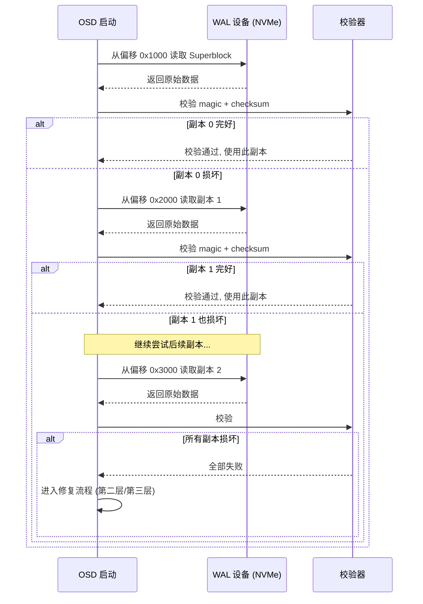
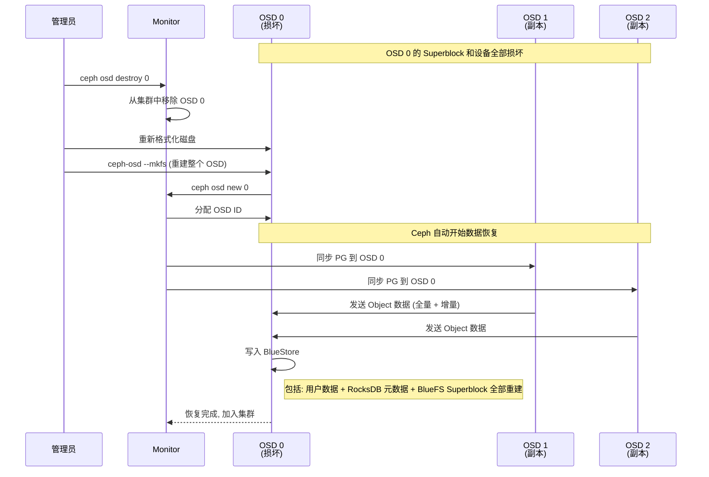

# BlueFS Superblock 损坏与恢复机制分析

---

## 1. 问题背景

BlueFS 的元数据存储在 RocksDB 中，启动时依赖 Superblock（裸块固定偏移处）来引导打开 RocksDB。如果 Superblock 损坏，BlueFS 将无法定位 RocksDB 文件的位置，导致 OSD 无法启动。

```
正常启动链:
  Superblock (最小元数据) → 打开 RocksDB → 读取完整 BlueFS 元数据 → 就绪

Superblock 损坏:
  无法读取 → 不知道 RocksDB 文件在哪 → 启动失败
```

---

## 2. Ceph 的三层防护机制

```
┌─────────────────────────────────────────────────────────────────┐
│                    Superblock 损坏防护                           │
│                                                                  │
│  ┌──────────────────────────────────────────────────────────┐   │
│  │  第一层: 多副本 Superblock (自动恢复)                     │   │
│  │                                                          │   │
│  │  同一设备上存储多个 Superblock 副本                       │   │
│  │  启动时逐个尝试, 只要有一个完好即可                        │   │
│  │                                                          │   │
│  │  防御: 单个扇区/区块损坏                                  │   │
│  └──────────────────────────────────────────────────────────┘   │
│                                                                  │
│  ┌──────────────────────────────────────────────────────────┐   │
│  │  第二层: ceph-bluestore-tool 手动修复                      │   │
│  │                                                          │   │
│  │  扫描裸块设备, 通过 magic bytes 识别文件                  │   │
│  │  重建 BlueFS 元数据和 Superblock                          │   │
│  │                                                          │   │
│  │  防御: 所有 Superblock 副本损坏                           │   │
│  └──────────────────────────────────────────────────────────┘   │
│                                                                  │
│  ┌──────────────────────────────────────────────────────────┐   │
│  │  第三层: Ceph 分布式副本 (自动恢复)                       │   │
│  │                                                          │   │
│  │  数据在其他 OSD 上有副本                                  │   │
│  │  销毁并重建 OSD, 从副本全量同步                            │   │
│  │                                                          │   │
│  │  防御: 整盘/整 OSD 丢失                                  │   │
│  └──────────────────────────────────────────────────────────┘   │
└─────────────────────────────────────────────────────────────────┘
```

---

## 3. 第一层: 多副本 Superblock

### 3.1 存储方式

```
WAL 设备 (NVMe SSD):
  偏移 0x1000 (4KB)   → Superblock 副本 0
  偏移 0x2000 (8KB)   → Superblock 副本 1
  偏移 0x3000 (12KB)  → Superblock 副本 2
  偏移 0x4000 (16KB)  → Superblock 副本 3
  ...

每个副本包含:
  - magic: "bluefs" (魔数, 用于快速识别)
  - uuid: RocksDB 的 UUID
  - version: 版本号
  - osd_uuid: OSD 的 UUID
  - ctime: 创建时间戳
  - bluefs_files: 最小文件列表 (id, offset, size)
  - checksum: 校验和 (CRC32C, 验证数据完整性)
```

### 3.2 启动读取流程



---

## 4. 第二层: ceph-bluestore-tool 手动修复

当所有 Superblock 副本都损坏时，使用 `ceph-bluestore-tool` 扫描裸设备重建。

### 4.1 修复原理

```
┌─────────────────────────────────────────────────────────────┐
│              ceph-bluestore-tool fsck 修复流程                │
│                                                              │
│  ┌────────────────────────────────────────────────────┐     │
│  │  Step 1: 扫描所有块设备 (WAL/DB/Slow)              │     │
│  │                                                    │     │
│  │  逐块扫描, 查找已知 magic bytes:                    │     │
│  │  - RocksDB WAL 文件 magic                           │     │
│  │  - RocksDB SST 文件 magic                           │     │
│  │  - BlueStore 对象数据 magic                         │     │
│  │  - 已知的文件头特征                                  │     │
│  └────────────────────┬───────────────────────────────┘     │
│                       │                                      │
│  ┌────────────────────▼───────────────────────────────┐     │
│  │  Step 2: 重建文件映射                               │     │
│  │                                                    │     │
│  │  根据扫描结果, 重建:                                 │     │
│  │  - RocksDB WAL 文件 → (offset, size, device)       │     │
│  │  - RocksDB SST 文件 → (offset, size, device)       │     │
│  │  - BlueFS journal → (offset, size, device)         │     │
│  └────────────────────┬───────────────────────────────┘     │
│                       │                                      │
│  ┌────────────────────▼───────────────────────────────┐     │
│  │  Step 3: 尝试打开 RocksDB                           │     │
│  │                                                    │     │
│  │  用重建的文件映射打开 RocksDB                        │     │
│  │  验证 RocksDB 内部数据一致性                         │     │
│  │  读取完整的 BlueFS 元数据                            │     │
│  └────────────────────┬───────────────────────────────┘     │
│                       │                                      │
│  ┌────────────────────▼───────────────────────────────┐     │
│  │  Step 4: 重写 Superblock                           │     │
│  │                                                    │     │
│  │  用重建的完整元数据, 重新写入所有 Superblock 副本    │     │
│  │  OSD 可以正常启动                                    │     │
│  └────────────────────────────────────────────────────┘     │
└─────────────────────────────────────────────────────────────┘
```

### 4.2 常用命令

```bash
# 检查并修复 BlueStore 元数据
ceph-bluestore-tool fsck \
  --path /var/lib/ceph/osd/ceph-0 \
  --devs /dev/nvme0n1 /dev/sda

# 查看 BlueFS 文件布局
ceph-bluestore-tool bluefs-bdev-new \
  --path /var/lib/ceph/osd/ceph-0

# 查看 BlueFS journal 状态
ceph-bluestore-tool bluefs-journal-info \
  --path /var/lib/ceph/osd/ceph-0 \
  --devs /dev/nvme0n1 /dev/sda
```

---

## 5. 第三层: Ceph 分布式副本恢复

当整个 OSD 不可恢复时，依赖 Ceph 的副本机制从其他 OSD 恢复。



---

## 6. 各级别存储损坏场景分析

```
┌─────────────────────────────────────────────────────────────────┐
│                      损坏场景与恢复策略                           │
│                                                                  │
│  场景 1: 单个 Superblock 扇区损坏                                │
│  ├── 影响: 无 (自动跳过损坏副本)                                  │
│  └── 恢复: 第一层 (多副本轮询)                                     │
│                                                                  │
│  场景 2: 所有 Superblock 副本损坏 (WAL盘部分区域)                  │
│  ├── 影响: OSD 无法启动                                          │
│  └── 恢复: 第二层 (ceph-bluestore-tool fsck)                     │
│                                                                  │
│  场景 3: WAL 设备整盘损坏 (NVMe SSD 故障)                         │
│  ├── 影响: RocksDB 元数据丢失                                     │
│  ├── WAL 中的数据可从 Slow 设备重放                                │
│  ├── 如果 WAL 未刷盘的数据丢失, 从 OSD 副本恢复                     │
│  └── 恢复: 第二层 + 第三层                                         │
│                                                                  │
│  场景 4: DB 设备损坏 (SSD 上的 RocksDB SST)                       │
│  ├── 影响: 元数据部分丢失                                         │
│  ├── 可从 WAL 重放重建                                            │
│  └── 恢复: 第二层 (fsck + WAL replay)                             │
│                                                                  │
│  场景 5: Slow 设备损坏 (HDD, 用户数据)                            │
│  ├── 影响: 用户 Object 数据丢失                                   │
│  ├── 元数据 (RocksDB) 可能仍完好                                  │
│  └── 恢复: 第三层 (从副本 OSD 全量同步)                            │
│                                                                  │
│  场景 6: 所有设备损坏 + 无可用副本                                  │
│  ├── 影响: 数据永久丢失                                           │
│  └── 恢复: 不可恢复 (需要从备份恢复)                               │
│                                                                  │
└─────────────────────────────────────────────────────────────────┘
```

---

## 7. Superblock 设计的启示

BlueFS Superblock 的设计本质是一个经典的**自举 (bootstrap)** 模式:

| 设计原则 | 在 BlueFS 中的体现 |
|---------|-------------------|
| **最小信任集** | Superblock 只包含"刚好够打开 RocksDB"的最小信息 |
| **多副本冗余** | 同一设备多个副本, 防止单点损坏 |
| **校验和保护** | CRC32C 校验和, 检测静默数据损坏 |
| **可重建性** | 内容不包含不可再生信息, 可通过 fsck 扫描重建 |
| **分层依赖** | 原始数据在分布式副本中, 本地元数据损坏可远程恢复 |

这与很多系统的引导设计类似:

- **Linux 引导**: BIOS → MBR/GPT (最小引导程序) → 内核 → 完整文件系统
- **ZFS 池导入**:uberblock (固定位置) → MOS (元数据对象集) → 完整池状态
- **BlueFS**: Superblock (固定偏移) → RocksDB (完整元数据) → 完整文件系统

所有这些设计的共同点是: **用一个极小的、固定位置的引导块来打破循环依赖**。
