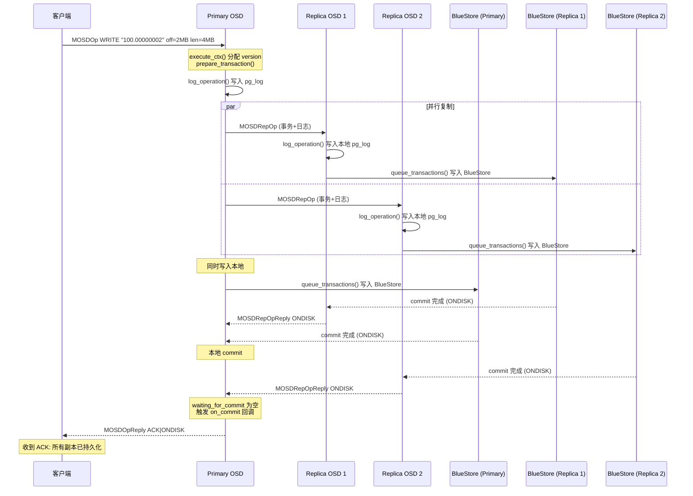
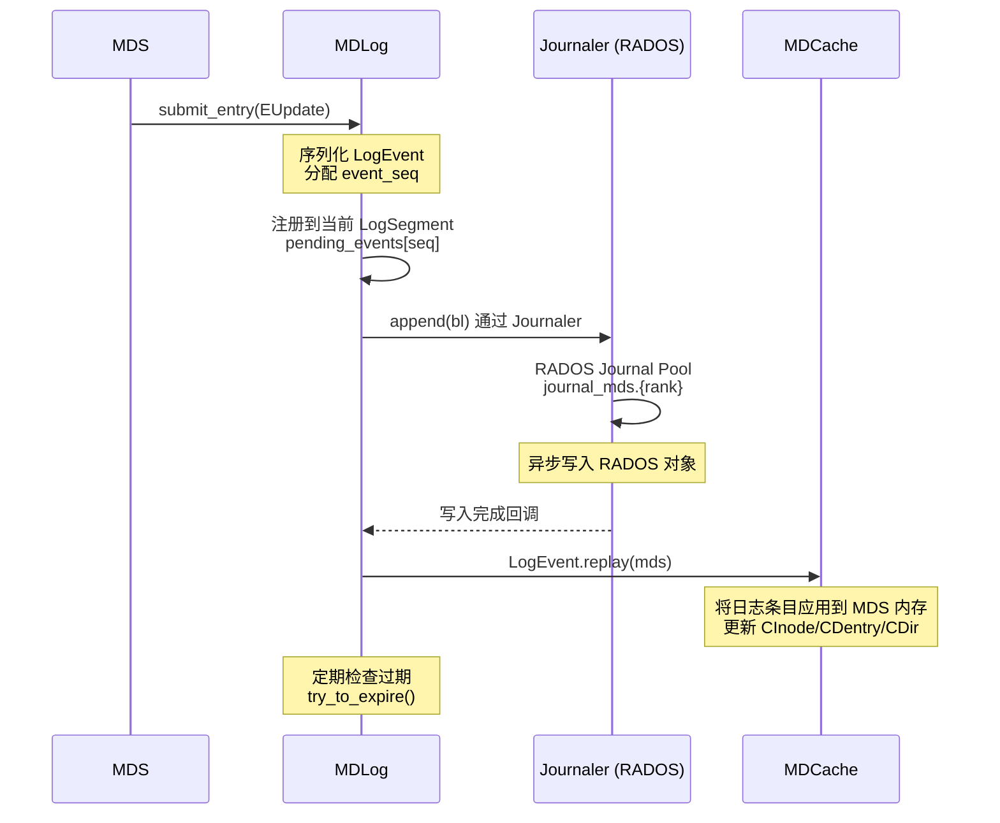
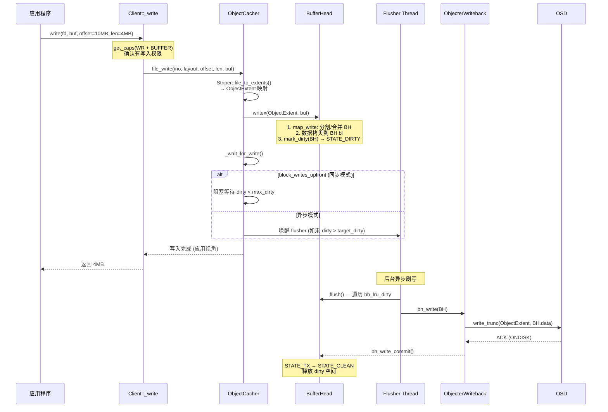
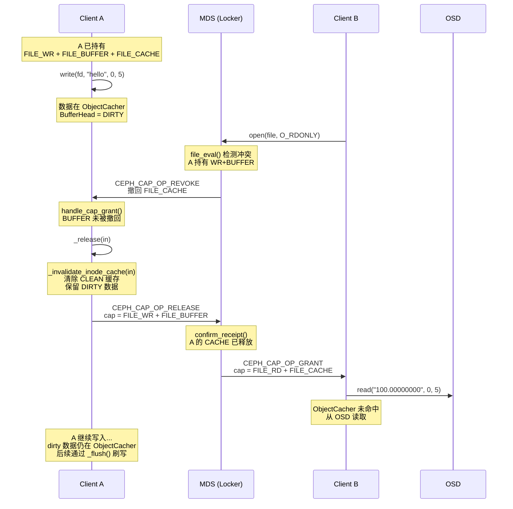
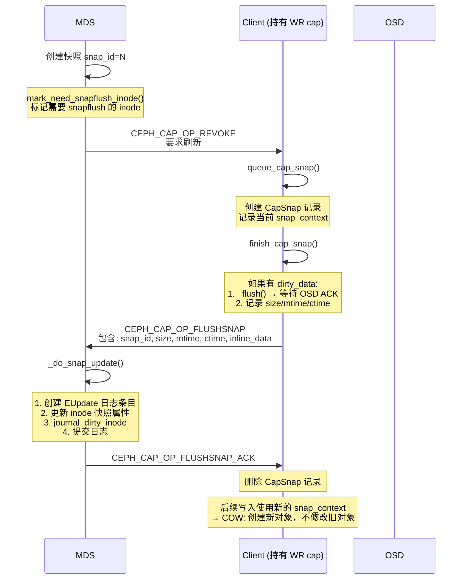
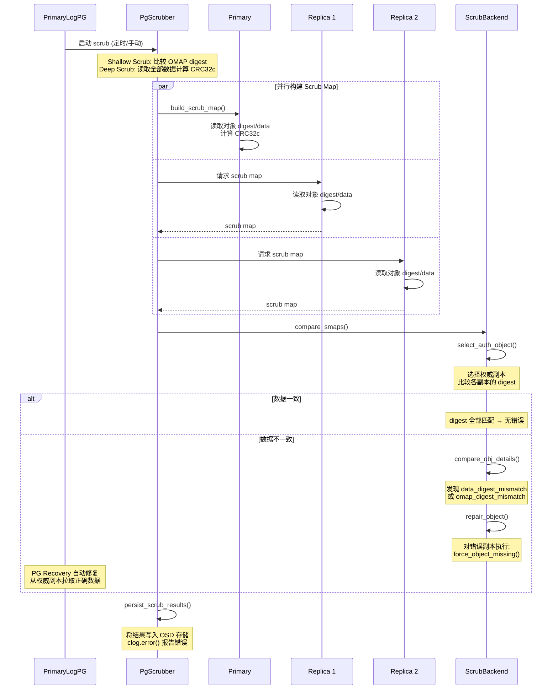

# CephFS 数据一致性分析

---

## 目录

1. [一致性模型总览](#1-一致性模型总览)
2. [Capability 机制（MDS 授权）](#2-capability-机制mds-授权)
3. [OSD 副本写入一致性](#3-osd-副本写入一致性)
4. [BlueStore 事务原子性](#4-bluestore-事务原子性)
5. [MDS 日志与崩溃一致性](#5-mds-日志与崩溃一致性)
6. [客户端缓存一致性](#6-客户端缓存一致性)
7. [ObjectCacher Writeback 一致性](#7-objectcacher-writeback-一致性)
8. [多客户端读写一致性](#8-多客户端读写一致性)
9. [快照一致性](#9-快照一致性)
10. [崩溃客户端检测与恢复](#10-崩溃客户端检测与恢复)
11. [PG 日志与 Peering 一致性](#11-pg-日志与-peering-一致性)
12. [Scrub 数据校验与自愈](#12-scrub-数据校验与自愈)
13. [一致性保证总结](#13-一致性保证总结)
14. [与 JuiceFS、Lustre 一致性机制对比](#14-与-juicefslustre-一致性机制对比)
15. [关键源码索引](#15-关键源码索引)

---

## 1. 一致性模型总览

CephFS 通过分层的一致性机制保证数据正确性：

```
┌──────────────────────────────────────────────────────────────────┐
│                     CephFS 一致性分层                             │
├──────────────────────────────────────────────────────────────────┤
│                                                                  │
│  Layer 5: Scrub 定期校验 + 自愈                                   │
│  ├── CRC32c 跨副本比对                                           │
│  └── 标记缺失 → PG Recovery 自动修复                             │
│                                                                  │
│  Layer 4: MDS 元数据一致性                                        │
│  ├── RADOS Journal (WAL) — 崩溃后日志重放                        │
│  ├── COW (Copy-on-Write) — 快照时保护旧数据                      │
│  ├── Log Segment 过期 — 已持久化后截断                            │
│  └── Multi-MDS — Cap 导入/导出保证状态迁移                       │
│                                                                  │
│  Layer 3: 客户端缓存一致性                                        │
│  ├── Capability 授权/撤回 — MDS 协调多客户端                      │
│  ├── ObjectCacher — BufferHead 状态机 (DIRTY/TX/CLEAN)           │
│  ├── fsync → flush_set → 等待 OSD ACK                           │
│  └── 读己之写 — Dirty/TX BufferHead 作为缓存命中                  │
│                                                                  │
│  Layer 2: OSD 副本一致性                                          │
│  ├── Primary-Replica 协议 — 全部 ONDISK 后 ACK 客户端             │
│  ├── PG Log — 操作全序 + 发散条目处理                             │
│  └── Peering — OSD Map 变更后日志合并                             │
│                                                                  │
│  Layer 1: BlueStore 事务原子性                                    │
│  ├── 两阶段提交: AIO 数据写入 → bdev flush → RocksDB WAL sync    │
│  ├── OpSequencer — 同 PG 事务串行化                              │
│  └── BlueRocksEnv — RocksDB WAL 通过 BlueFS 持久化               │
└──────────────────────────────────────────────────────────────────┘
```

---

## 2. Capability 机制（MDS 授权）

### 2.1 Capability 状态模型

```
MDS 端 (Capability.h:75-389):
  Capability
  ├── _pending   — MDS 已通知客户端可持有的 cap 位
  ├── _issued    — _pending | 正在撤回中的 cap 位
  ├── _revokes   — 撤回历史记录列表 [(before, seq, last_issue)]
  ├── _wanted    — 客户端请求的 cap 位
  └── cap_gen    — 会话代数（stale 时递增，使旧 cap 失效）

Client 端 (Client.cc):
  Cap
  ├── issued       — 客户端当前持有的 cap 位
  ├── implemented  — issued | used（实际需要的最大集合）
  ├── wanted       — 客户端想要的 cap 位
  └── gen          — 与 MDS 端 cap_gen 对应
```

### 2.2 Cap 授权流程

```
Client 打开文件 → MDS 授予 Capability

示例: Client A 以读写模式打开文件

  Client → MDS: CEPH_MDS_OP_OPEN (flags=O_RDWR)
  MDS → Locker::try_eval()
    → file_eval() 评估锁状态
    → 如果是 loner（唯一客户端）:
        allowed = LONER_ALLOWED = EXCL | WR | BUFFER | CACHE | RD | LAZYIO
    → 如果有其他客户端:
        allowed = ALL_ALLOWED = SHARED | RD | CACHE
  MDS → Client: CEPH_CAP_OP_GRANT
    caps = FILE_SHARED | FILE_RD | FILE_CACHE | FILE_WR | FILE_BUFFER
```

### 2.3 Cap 撤回流程

```
冲突发生 → MDS 撤回其他客户端的 Cap

示例: Client A 持有 RD+CACHE，Client B 请求 WR+BUFFER

                    MDS
                   /    \
        撤回 A      授予 B
    CACHE cap     WR+BUFFER
         |              |
         ▼              ▼
    Client A        Client B
    清除缓存        获得写权限
    释放 cap
         |
         ▼
    MDS 收到 A 的
    cap 释放
```

**MDS 端撤回逻辑**（Locker.cc:2573-2699）：

```cpp
// Locker::issue_caps() — 决定授予还是撤回
if ((pending & ~allowed) ||          // 需要撤回不允许的 cap
    ((wanted & allowed) & ~pending) || // 有新 cap 需要授予
    !cap->is_valid()) {               // cap 已失效（stale 后恢复）
    // 记录撤回前的 cap 状态
    before = cap->_pending;
    cap->_pending = (wanted|likes) & allowed & pending;
    // 撤回时不再授予新 cap
    op = CEPH_CAP_OP_REVOKE;
}
```

**Client 端撤回处理**（Client.cc:6134-6159）：

```cpp
case CEPH_CAP_OP_REVOKE:
    if (revoked & (CEPH_CAP_FILE_BUFFER | CEPH_CAP_FILE_LAZYIO)) {
        // 有脏数据 → 先刷写到 OSD
        _flush(in, new C_Client_FlushComplete(this, in));
    } else if (revoked & (CEPH_CAP_FILE_CACHE | CEPH_CAP_FILE_LAZYIO)) {
        // 有缓存 → 释放缓存
        _release(in);  // → _invalidate_inode_cache(in)
    } else {
        cap->wanted = 0;
        check_caps(in, CHECK_CAPS_NODELAY);
    }
```

### 2.4 文件锁状态机与 Cap 映射

```
锁状态转换 (Locker.cc:5681-5780):

  LOCK_EXCL (loner)
    │ 一个客户端持有 WR+BUFFER
    │
    ├── 另一个客户端请求 RD → LOCK_MIX
    │
    ▼
  LOCK_MIX
    │ 多个客户端: 一个写 + 多个读
    │
    ├── 没有客户端需要写 → LOCK_SYNC
    │
    ▼
  LOCK_SYNC
    │ 所有客户端共享读
    │
    ├── 出现 loner → LOCK_EXCL
    ├── 多个写者 → LOCK_MIX
    └── 客户端释放 → 清理
```

---

## 3. OSD 副本写入一致性

### 3.1 Primary-Replica 写入协议



**关键代码**（ReplicatedBackend.cc）：

```cpp
// submit_transaction() — line 580
op->waiting_for_commit = ALL acting shards;  // line 627
issue_op();                                  // line 631 — 发送到副本
parent->log_operation();                     // line 648 — 写入 pg_log
parent->queue_transactions();                // line 664 — 提交本地 BlueStore

// op_commit() — line 670
op->waiting_for_commit.erase(whoami_shard);
if (op->waiting_for_commit.empty()) {
    op->on_commit->complete(0);  // line 689 — 所有副本确认
}

// execute_ctx() — line 4402
ctx->register_on_commit([m, ctx, this](){
    reply->add_flags(CEPH_OSD_FLAG_ACK | CEPH_OSD_FLAG_ONDISK);
    osd->send_message_osd_client(reply, m->get_connection());
});
// 客户端 ACK 仅在所有副本 ONDISK 后发送
```

### 3.2 一致性保证

```
OSD 写入一致性保证:

  1. 全副本确认
     客户端收到 ACK = 所有副本 BlueStore 已提交
     任何副本失败 → Primary 不会发送 ACK

  2. PG Log 全序
     每个操作分配单调递增的 eversion_t
     同一 PG 内的操作严格有序

  3. 副本日志同步
     ReplicatedBackend::do_repop() 中:
       副本收到操作 → 写入本地 pg_log → 提交本地 BlueStore → 回复 ONDISK
     副本和 Primary 持有相同的操作日志

  4. Peering 时日志合并
     OSD Map 变更 → 新 Acting Set 形成 → PG 交换日志
     merge_log() 处理发散条目:
       可回滚 → 撤销
       不可回滚 → 标记对象缺失 → Recovery 拉取正确数据
```

---

## 4. BlueStore 事务原子性

### 4.1 两阶段提交

```
BlueStore 事务状态机 (BlueStore.cc:14401):

  ┌────────────┐
  │ PREPARE    │ ← queue_transactions() 入口
  └─────┬──────┘
        │ 有待处理 AIO?
        ├── 否 ───────────────────────────────┐
        │                                     │
        ▼ 是                                  │
  ┌────────────┐                              │
  │ AIO_WAIT   │ ← 等待 AIO 完成              │
  └─────┬──────┘                              │
        │                                     │
        ▼                                     │
  ┌────────────┐                              │
  │ IO_DONE    │ ← _txc_finish_io()           │
  └─────┬──────┘   OpSequencer 保证顺序        │
        │                                     │
        ▼                                     │
  ┌────────────┐                              │
  │ KV_SUBMITTED │ ← RocksDB 事务提交          │
  └─────┬──────┘   (submit_transaction_sync)  │
        │                                     │
        ▼                                     │
  ┌────────────┐                              │
  │ KV_DONE    │ ← 触发 oncommit 回调          │
  └─────┬──────┘   → 通知 PG 层               │
        │                                     │
        ▼                                     │
  ┌────────────┐                              │
  │ FINISHING  │ ← 清理资源                    │
  └────────────┘                              │
```

### 4.2 KV Sync Thread 保证持久化

```
_kv_sync_thread() (BlueStore.cc:15057):

  1. 收集所有 KV_SUBMITTED 状态的事务
  2. 如果有未完成的 AIO:
     → bdev->flush()   // 确保数据写入稳定
  3. db->submit_transaction_sync(synct)
     → RocksDB WAL sync
     → BlueRocksEnv: WAL 通过 BlueFS → fsync 到块设备
  4. 所有事务持久化完成 → 触发 oncommit → 通知 PG 层
```

**BlueRocksEnv**（BlueRocksEnv.cc:177-295）确保 RocksDB WAL 的持久性：

```cpp
// Append() — line 198: 写入 BlueFS
fs->append_try_flush();

// Sync() — line 233: fsync 确保落盘
fs->fsync(h);

// Close() — line 223: 关闭前 fsync
fs->fsync(h);
```

### 4.3 崩溃一致性

```
场景 1: OSD 崩溃在 AIO 完成后、KV 提交前
  → 磁盘上有新数据，但 onode 元数据未更新
  → 重启后: 旧 onode 仍然指向旧数据 → 写入"丢失"
  → 但 pg_log 中记录了该操作 → Peering/Recovery 重新应用
  → 最终一致性

场景 2: OSD 崩溃在 KV 提交后
  → 数据和元数据都已持久化
  → 重启后: pg_log + onode 都是最新的
  → 完全一致

场景 3: Primary 崩溃，Replica 正常
  → 新 Primary 从副本的 pg_log 恢复
  → merge_log() 确保操作全序
  → 所有副本数据一致
```

---

## 5. MDS 日志与崩溃一致性

### 5.1 日志写入流程



**日志提交**（MDLog.cc:393-424）：

```cpp
void MDLog::_submit_entry(LogEvent *le) {
    le->set_seq(++event_seq);
    // 注册到当前段
    pending_events[ls->seq].push_back(le);
    // 异步写入 RADOS
    journaler->append(bl);
}
```

### 5.2 日志重放

```
MDS 重启 → _replay_thread() (MDLog.cc:1417-1595):

  1. 读取 JournalPointer 对象 → 定位日志文件
  2. 循环读取日志条目:
     while (read_pos < write_pos) {
         le = LogEvent::decode_event(bl);
         le->replay(mds);  // 重建内存状态
     }

  重放的 LogEvent 类型:
  ├── EMetaBlob::replay()  — 重建 inode/dentry/目录统计
  ├── ESession::replay()   — 重建客户端会话
  ├── ESnap::replay()      — 重建快照
  ├── EUpdate::replay()    — 重建单 inode 更新
  └── EOpen::replay()      — 重建文件打开表
```

### 5.3 COW (Copy-on-Write)

```cpp
// Mutation.cc:242-279
void add_cow_inode(CInode *in);   // 标记 inode 为 COW
void add_cow_dentry(CDentry *dn); // 标记 dentry 为 COW

void apply() {
    // 将 projected inode 变为当前 inode
    for (auto& obj : projected_nodes) {
        in->pop_and_dirty_projected_inode(ls, nullptr);
    }
    // 标记脏 inode（等待日志持久化）
    for (const auto& in : dirty_cow_inodes)
        in->_mark_dirty(ls);
}
```

### 5.4 日志段过期

```
LogSegment::try_to_expire() (journal.cc:125-200):

  段可以过期当且仅当:
  ├── 所有 dirty dirfrag 已提交到 RADOS 元数据存储
  ├── 所有未提交的 leader/peer 操作已完成
  ├── 所有未提交的 fragment 操作已完成
  └── 所有 scatterlocks 已 gather

  过期 = 截断日志，释放 RADOS 空间
  安全性: 日志内容已持久化到 RADOS 元数据存储
```

---

## 6. 客户端缓存一致性

### 6.1 ObjectCacher BufferHead 状态机

```
BufferHead 状态转换 (ObjectCacher.h:107-116):

  ┌─────────┐  read()   ┌──────┐  完成   ┌───────┐
  │ MISSING │ ────────→ │  RX  │ ──────→ │ CLEAN │
  └─────────┘           └──────┘         └───────┘
       ↑                  │ error           ↑  │
       │                  ▼                 │  │ write()
       │             ┌────────┐            │  │
       │             │ ERROR  │            │  │
       │             └────────┘            │  ▼
       │                                  │ ┌───────┐
       │                                  └→│ DIRTY │
       │                                    └───┬───┘
       │                                        │ flush()
       │                                        ▼
       │                                    ┌───────┐
       └────────────────────────────────────│  TX   │
          ACK 成功 → CLEAN                   └───┬───┘
          ACK 失败 → DIRTY (重试)               │
                                              ▼
                                          OSD 确认/重试
```

### 6.2 读己之写一致性

```
场景: Client A 写入 offset [10MB, 14MB)，然后立即读取同一范围

  1. write(10MB, 4MB)
     → ObjectCacher::writex()
     → BufferHead 状态: MISSING → DIRTY
     → 数据在内存中，尚未到达 OSD

  2. read(10MB, 4MB)
     → ObjectCacher::_readx() → map_read()
     → 检查 BufferHead: is_dirty() == true → 缓存命中!
     → 直接从内存返回数据，无需访问 OSD

关键代码 (ObjectCacher.cc:356-360):
  if (e->is_clean() || e->is_dirty() || e->is_tx() || e->is_zero()) {
      hits[cur] = e;  // DIRTY 和 TX 状态的 BH 也是缓存命中
  }
```

### 6.3 O_RSYNC 保证

```
当文件以 O_RSYNC 打开时 (Client.cc:11659-11661):

  read(offset, len)
    → if (f->flags & O_RSYNC) {
          _flush_range(in, offset, len);  // 先刷写重叠范围
      }
    → 然后执行读取

  保证: 读取的数据已经至少被 Primary OSD 确认
```

### 6.4 fsync 持久性保证

```
fsync() 路径 (Client.cc:13266-13333):

  ┌─────────────────────────────────────────────┐
  │ fsync(in)                                   │
  │                                             │
  │ 并行执行:                                   │
  │   ① 数据刷写:                               │
  │     _flush(in, completion)                   │
  │     → objectcacher->flush_set(&in->oset)   │
  │     → 遍历所有 DIRTY BH → bh_write()        │
  │     → ObjecterWriteback::write() → OSD      │
  │     → 等待所有 OSD ONDISK 回复              │
  │                                             │
  │   ② 元数据刷写:                             │
  │     check_caps(in, SYNCHRONOUS)             │
  │     → send_cap(CEPH_CAP_OP_UPDATE)         │
  │     → 将 size/mtime/ctime 发送给 MDS       │
  │     → MDS 写入日志                          │
  │                                             │
  │ 等待: completion.wait()                     │
  │ 返回: 0 (成功)                              │
  └─────────────────────────────────────────────┘

  fsync 返回 = 数据已在所有副本持久化 + 元数据已记录到 MDS 日志
```

---

## 7. ObjectCacher Writeback 一致性

### 7.1 写入缓冲流程



### 7.2 背压机制

```
ObjectCacher 背压控制:

  max_dirty     — 脏数据上限（超过则阻塞/减速写入）
  target_dirty  — 目标脏数据量（超过则唤醒 flusher）
  max_dirty_age — 脏数据最大存活时间（超时则强制刷写）

  _wait_for_write() (ObjectCacher.cc:1873-1957):
    ├── stat_dirty > max_dirty
    │     ├── block_writes_upfront=true: 阻塞等待
    │     └── block_writes_upfront=false: 排队等待回调
    └── stat_dirty <= max_dirty: 继续写入

  Flusher 线程 (ObjectCacher.cc:1969-2057):
    ├── dirty > target_dirty: 刷写到 target_dirty
    ├── dirty BH 数量过多: 批量刷写
    └── 脏数据超龄: 从 LRU 尾部清理
```

### 7.3 Scatter Write 优化

```
bh_write_scattered() (ObjectCacher.cc:1088-1139):

  将相邻的多个 DIRTY BH 合并为一次 OSD 操作:
  ┌────────┬────────┬────────┐
  │ BH 0   │ BH 1   │ BH 2   │  ← 相邻的脏 BH
  │ 4MiB   │ 4MiB   │ 4MiB   │
  └───┬────┴───┬────┴───┬────┘
      │        │        │
      ▼        ▼        ▼
  ┌─────────────────────────┐
  │ 单次 OSD WRITE          │
  │ io_vec: [(off0,bl0),    │
  │          (off1,bl1),    │
  │          (off2,bl2)]    │
  └─────────────────────────┘

  减少 OSD 请求次数，提高吞吐
```

---

## 8. 多客户端读写一致性

### 8.1 写-读冲突场景



### 8.2 写-写冲突场景

```
场景: Client A 和 Client B 同时写同一文件的不同区域

  T1: A 持有 WR+BUFFER (loner mode)
      B 请求打开文件写

  T2: MDS file_eval():
      LOCK_EXCL → LOCK_MIX
      A 保持 WR+BUFFER
      B 获得一个受限的 cap（或者等待）

  T3: 如果 B 获得了 WR cap:
      MDS 不再保证 A 和 B 的独占写入
      B 可以写入不同的区域
      但通过 BUFFER cap 保证数据最终到达 OSD

  T4: A close() → _flush() → 数据到 OSD → 释放 cap
      MDS 重新评估: LOCK_MIX → LOCK_EXCL (B 成为 loner)

关键: CephFS 不提供字节范围锁，多个客户端写同一文件时
     通过 Cap 机制协调，但不阻止并发的不同区域写入
```

### 8.3 Cap 消息类型

```c
// src/include/ceph_fs.h:897-911
#define CEPH_CAP_OP_GRANT      1   // 授予 cap
#define CEPH_CAP_OP_REVOKE     2   // 撤回 cap
#define CEPH_CAP_OP_RELEASE    3   // 客户端主动释放
#define CEPH_CAP_OP_FLUSH      4   // 刷写脏元数据
#define CEPH_CAP_OP_FLUSH_ACK  5   // 刷写确认
#define CEPH_CAP_OP_FLUSHSNAP  6   // 刷写快照数据
#define CEPH_CAP_OP_FLUSHSNAP_ACK 7
#define CEPH_CAP_OP_UPDATE     8   // 客户端报告脏元数据
#define CEPH_CAP_OP_TRUNC      9   // MDS 通知截断
```

### 8.4 元数据一致性流程

```
Client 写入文件后报告元数据更新:

  Client: _write_success()
    → 更新 inode 的 size, mtime, ctime
    → mark_caps_dirty(CEPH_CAP_FILE_WR)
    → check_caps() → send_cap()

  send_cap() (Client.cc:4045-4172):
    → 构造 MClientCaps (CEPH_CAP_OP_UPDATE)
    → 包含: size, mtime, atime, ctime, max_size
    → 发送到 MDS

  MDS: handle_client_caps() (Locker.cc:3370-3682)
    → dirty && is_auth():
      → 写入 MDS 日志 (journal_dirty_inode)
      → 发送 CEPH_CAP_OP_FLUSH_ACK

  Client: handle_cap_flush_ack() (Client.cc:5840-5904)
    → 清除 flushing_caps
    → 唤醒 sync_cond (fsync 可能在此等待)
```

---

## 9. 快照一致性

### 9.1 快照创建时的一致性保护



### 9.2 快照 COW 机制

```
快照后的写入:

  T1: 创建快照 snap_id=100
      文件当前的 RADOS 对象: "100.00000000" (v1)

  T2: Client 写入 offset 0
      → snap_context = {100}  (包含快照 ID)
      → Filer::write_trunc() → OSD WRITE with snap_context
      → BlueStore 检测到 snap_context:
        旧数据 "100.00000000" 被 clone
        新数据写入新对象 "100.00000000" (v2)

  T3: 读取当前版本
      → snapid = CEPH_NOSNAP → 读取 v2

  T4: 读取快照 100
      → snapid = 100 → 读取 v1 (clone 的对象)

  COW 保证: 旧数据不被修改，快照是只读的
```

---

## 10. 崩溃客户端检测与恢复

### 10.1 会话超时检测

```
MDS 定期检查 (Server.cc:1203-1351):

  find_idle_sessions():
    cutoff = queue_max_age + session_timeout

    对每个 session:
      last_cap_renew_span = now - session->last_cap_renew

      if (span >= session_autoclose):
          立即驱逐 → 加入 laggy_clients → OSD 黑名单
      else if (span >= cutoff):
          标记 STATE_STALE
          发送 CEPH_SESSION_STALE 给客户端

  Stale 后的处理 (Locker.cc:2762-2827):
    revoke_stale_caps():
      session->inc_cap_gen()  // 使所有 cap 失效
      for each cap:
        if (revoking & CEPH_CAP_ANY_WR):
            // 有脏数据 → 不能安全恢复 → 驱逐客户端
            evict_client()
        else:
            cap->revoke()
            try_eval()  // 重新评估锁，可能授予其他客户端
```

### 10.2 Cap 撤回超时驱逐

```
evict_cap_revoke_non_responders() (Server.cc:1353-1389):

  如果客户端在 mds_cap_revoke_eviction_timeout 内
  没有响应 cap 撤回:

    → 获取所有超时的客户端
    → evict_client(client, blocklist=true)
       → journal_close_session() — 记录到 MDS 日志
       → OSD 黑名单 — 防止客户端继续操作
       → 释放所有 cap — 其他客户端可以获得访问权限
```

### 10.3 会话关闭与日志记录

```
kill_session() (Server.cc:1464-1552):

  1. journal_close_session(session, STATE_KILLING)
     → 创建 ESession 日志条目 (open=false)
     → 记录所有委托的 inode
     → 提交到 MDS 日志

  2. C_MDS_session_finish 回调:
     → 移除所有 cap
     → 清理所有请求
     → 关闭会话

  日志保证: MDS 崩溃重启后，可以恢复会话关闭状态
  安全保证: 驱逐后客户端无法访问 OSD（blocklist）
```

---

## 11. PG 日志与 Peering 一致性

### 11.1 PG Log 结构

```
PGLog (PGLog.cc):

  IndexedLog:
  ├── tail    — 日志最早条目的版本
  ├── head    — 日志最新条目的版本
  ├── complete_to — 已确认所有副本都有此版本
  ├── dups    — 已裁剪条目的去重记录
  └── entries — 有序的 pg_log_entry_t 列表

  每个条目: pg_log_entry_t
  ├── version (eversion_t) — PG 内单调递增
  ├── reqid   — 客户端请求 ID（去重用）
  ├── soid    — 对象标识
  └── op      — 操作类型和参数
```

### 11.2 Peering 时的日志合并

```
OSD Map 变更 (PeeringState.cc:698):
  start_peering_interval():
    → 检测 Acting Set 变化
    → 如果 Primary/Acting Set 改变:
        same_interval_since = current epoch
    → on_new_interval(): 特性协商 + 状态重置

activate() (PeeringState.cc:2910):
    → 计算 last_complete (基于 missing set)
    → 发送 MOSDPGLog 给副本 (需要的日志条目)
    → 开始 Recovery (如果有缺失对象)

merge_log() (PGLog.cc:388-538):
  副本收到 Primary 的日志后:
    1. 尾部扩展: 如果新日志 tail 更低
    2. 发散处理: 如果本地有超出 merge point 的条目
       → rewind_divergent_log()
       → 可回滚 → 撤销
       → 不可回滚 → 标记对象 missing
    3. 头部扩展: 追加新条目
```

### 11.3 Recovery

```
ReplicatedBackend (ReplicatedBackend.cc:137-199):

  recover_object():
    ├── 对象缺失 → prepare_pull() — 从有数据的副本拉取
    ├── 对象多余 → 删除
    └── 属性不一致 → 修复属性

  数据来源选择:
    → 优先从 up OSD 拉取
    → 其次从 acting OSD 拉取
    → 如果所有副本都缺失 → 从其他 PG 迁移
```

---

## 12. Scrub 数据校验与自愈

### 12.1 Scrub 流程



### 12.2 Deep Scrub 数据校验

```
be_deep_scrub() (ReplicatedBackend.cc:777-940):

  对每个对象:
    1. 按 osd_deep_scrub_stride 分块读取数据
    2. 计算滚动 CRC32c:
       pos.data_hash << bl  (line 814)
    3. 读取 OMAP header，计算 CRC32c
    4. 读取 OMAP keys，计算 CRC32c
    5. 设置 smap_object.digest = 最终 CRC32c

  compare_obj_details() (scrub_backend.cc:1489-1583):
    比较 auth 与 candidate:
    ├── data_digest 不一致 → data_digest_mismatch
    ├── omap_digest 不一致 → omap_digest_mismatch
    ├── object_info 不一致 → OI_ATTR 不匹配
    └── size 不一致 → 大小错误
```

### 12.3 自愈修复

```
repair_object() (scrub_backend.cc:390-425):

  1. 选择权威副本 (select_auth_object)
  2. 对每个错误的副本:
     force_object_missing(peer, object)
  3. PG Recovery 自动从权威副本拉取正确数据

  修复是自动的（如果配置了 repair flag）:
    scrub:     只检测不修复（报告错误）
    deep-scrub: 只检测不修复
    scrub repair / deep-scrub repair: 检测 + 自动修复
```

---

## 13. 一致性保证总结

| 场景 | 一致性保证 | 机制 |
|------|-----------|------|
| **单客户端写后读** | 始终可见 | DIRTY/TX BufferHead 作为缓存命中 |
| **单客户端 fsync** | 所有副本持久化 | flush_set → 等待所有 OSD ONDISK |
| **多客户端写-读** | 读取最新数据 | MDS 撤回 CACHE cap → 客户端失效缓存 → 重新从 OSD 读取 |
| **多客户端写-写** | 最终一致 | Cap 协调（不提供字节范围锁） |
| **快照一致性** | 只读快照 | COW + snap_context + CapSnap 刷写协议 |
| **OSD 崩溃** | 数据不丢失 | Primary-Replica 全副本确认 + pg_log |
| **MDS 崩溃** | 元数据不丢失 | RADOS Journal + 日志重放 |
| **客户端崩溃** | 自动恢复 | 会话超时 → Stale → 驱逐 → cap 释放 |
| **BlueStore 崩溃** | 事务原子性 | AIO → bdev flush → RocksDB WAL sync |
| **PG 成员变更** | 数据一致 | Peering + merge_log + Recovery |
| **数据损坏** | 检测 + 自愈 | Scrub (CRC32c) + force_object_missing + Recovery |
| **close 文件** | 数据刷写 | _release_fh → _flush + check_caps |

---

## 14. 与 JuiceFS、Lustre 一致性机制对比

| 维度 | CephFS | JuiceFS | Lustre |
|------|--------|---------|--------|
| **写一致性** | OSD 全副本 ONDISK 后 ACK | 对象存储 PUT 原子性 | RDMA BRW_WRITE + 等待确认 |
| **客户端缓存** | ObjectCacher (BufferHead 状态机) | 内存 Page + 磁盘 Block | OSC Page Cache |
| **缓存失效** | MDS Cap 撤回 → 主动失效 | 写入后主动 invalidate sliceReader | LDLM AST 回调 → 主动失效 |
| **多客户端协调** | Capability (文件级) | 无数据锁（Slice 追加） | LDLM (字节范围锁) |
| **元数据持久化** | RADOS Journal (WAL) | DB 事务 (Redis/SQL/TiKV) | MDT jbd2 事务 |
| **崩溃恢复** | 日志重放 + pg_log 重放 | DB 重放 + Slice GC | LDLM 锁恢复 + MDT 重放 |
| **客户端崩溃** | 会话超时 → 驱逐 → OSD blocklist | DB 锁超时释放 | LDLM 锁超时 + lru_cancel |
| **快照一致性** | COW + CapSnap + snap_context | 无原生快照 | 无原生快照 |
| **数据校验** | Scrub (CRC32c 跨副本) | CRC32c (写/读时) | 无内建校验 |
| **副本修复** | Scrub → missing → Recovery | 无副本（依赖对象存储） | RAID/ZFS (OSD 级) |
| **写入模型** | 直写 RADOS 对象（可缓冲） | Slice 追加（Copy-on-Write） | 直写 OST（条带化） |

### 14.1 核心设计差异

```
CephFS: "Cap 驱动的主动一致性"
  ├── MDS 作为一致性协调者
  ├── Cap 撤回是主动的、即时的
  ├── 客户端缓存数据是"借来的"（可随时被撤回）
  ├── 多层保证: OSD 副本 + pg_log + MDS 日志 + Scrub
  └── 强一致性: fsync 后数据一定持久化

JuiceFS: "追加式最终一致性"
  ├── 无中央协调者（无 MDS）
  ├── Slice 追加天然避免写冲突
  ├── 客户端缓存通过写后失效保证一致性
  ├── 单层保证: 对象存储 + CRC32c
  └── 最终一致性: 异步上传 + TTL 失效

Lustre: "锁驱动的强一致性"
  ├── LDLM 提供细粒度字节范围锁
  ├── AST 回调保证锁的快速传递
  ├── RDMA 直连提供低延迟
  ├── 两层保证: LDLM + MDT 日志
  └── 强一致性: 锁持有期间数据受保护
```

---

## 15. 关键源码索引

| 模块 | 文件 | 关键内容 |
|------|------|---------|
| **Cap 定义** | `src/include/ceph_fs.h:804-911` | Cap 位定义 + 操作类型 |
| **Cap 状态** | `src/mds/Capability.h:75-389` | `_pending`, `_issued`, `_revokes`, `is_valid()` |
| **Cap 确认** | `src/mds/Capability.cc:192-230` | `confirm_receipt()` |
| **Cap 授予/撤回** | `src/mds/Locker.cc:2573-2699` | `issue_caps()` |
| **锁状态机** | `src/mds/Locker.cc:5681-5780` | `file_eval()` (EXCL/MIX/SYNC) |
| **Cap 消息处理** | `src/mds/Locker.cc:3370-3682` | `handle_client_caps()` |
| **Stale Cap** | `src/mds/Locker.cc:2762-2827` | `revoke_stale_caps()` |
| **Cap 释放** | `src/mds/Locker.cc:4242-4320` | `handle_client_cap_release()` |
| **客户端 Cap 处理** | `src/client/Client.cc:6033-6199` | `handle_cap_grant()` |
| **客户端 Cap 检查** | `src/client/Client.cc:4226-4360` | `check_caps()` |
| **客户端 Cap 发送** | `src/client/Client.cc:4045-4172` | `send_cap()` |
| **Flush ACK** | `src/client/Client.cc:5840-5904` | `handle_cap_flush_ack()` |
| **OSD 操作入口** | `src/osd/PrimaryLogPG.cc:2002-2151` | `do_op()` |
| **OSD 事务执行** | `src/osd/PrimaryLogPG.cc:4219-4418` | `execute_ctx()` |
| **OSD 副本协议** | `src/osd/ReplicatedBackend.cc:580-668` | `submit_transaction()` |
| **OSD 副本发送** | `src/osd/ReplicatedBackend.cc:1199-1252` | `issue_op()`, `generate_subop()` |
| **OSD 副本处理** | `src/osd/ReplicatedBackend.cc:1255-1389` | `do_repop()`, `repop_commit()` |
| **OSD 提交确认** | `src/osd/ReplicatedBackend.cc:670-729` | `op_commit()`, `do_repop_reply()` |
| **PG 日志合并** | `src/osd/PGLog.cc:388-538` | `merge_log()` |
| **PG 发散处理** | `src/osd/PGLog.cc:339-382` | `rewind_divergent_log()` |
| **Peering 入口** | `src/osd/PeeringState.cc:698-809` | `start_peering_interval()` |
| **PG 激活** | `src/osd/PeeringState.cc:2910-3060` | `activate()` |
| **BlueStore 事务** | `src/os/bluestore/BlueStore.cc:15747` | `queue_transactions()` |
| **BlueStore 状态机** | `src/os/bluestore/BlueStore.cc:14401-14517` | `_txc_state_proc()` |
| **BlueStore IO 排序** | `src/os/bluestore/BlueStore.cc:14520-14554` | `_txc_finish_io()` |
| **KV Sync** | `src/os/bluestore/BlueStore.cc:15057-15284` | `_kv_sync_thread()` |
| **BlueRocksEnv** | `src/os/bluestore/BlueRocksEnv.cc:177-295` | `Append()`, `Sync()`, `Flush()` |
| **MDS 日志提交** | `src/mds/MDLog.cc:393-424` | `_submit_entry()` |
| **MDS 日志重放** | `src/mds/MDLog.cc:1417-1595` | `_replay_thread()` |
| **COW** | `src/mds/Mutation.cc:242-279` | `add_cow_inode()`, `apply()` |
| **日志段过期** | `src/mds/journal.cc:125-200` | `try_to_expire()` |
| **BufferHead 状态** | `src/osdc/ObjectCacher.h:107-116` | `STATE_DIRTY`, `STATE_TX` 等 |
| **ObjectCacher 写入** | `src/osdc/ObjectCacher.cc:1749-1851` | `writex()` |
| **ObjectCacher 刷写** | `src/osdc/ObjectCacher.cc:1088-1287` | `bh_write()`, `bh_write_commit()` |
| **ObjectCacher 读取** | `src/osdc/ObjectCacher.cc:317-402` | `map_read()` (DIRTY=命中) |
| **Flusher 线程** | `src/osdc/ObjectCacher.cc:1969-2057` | `flusher_entry()` |
| **ObjecterWriteback** | `src/client/ObjecterWriteback.h:10-69` | `read()`, `write()` |
| **fsync** | `src/client/Client.cc:13266-13333` | `_fsync()` |
| **文件关闭** | `src/client/Client.cc:10913-10956` | `_release_fh()` |
| **缓存失效** | `src/client/Client.cc:4615-4651` | `_invalidate_inode_cache()`, `_release()` |
| **快照 CapSnap** | `src/client/Client.cc:4363-4513` | `queue_cap_snap()`, `finish_cap_snap()` |
| **MDS 快照更新** | `src/mds/Locker.cc:3863-3960` | `_do_snap_update()` |
| **会话超时检测** | `src/mds/Server.cc:1203-1351` | `find_idle_sessions()` |
| **Cap 撤回超时** | `src/mds/Server.cc:1353-1389` | `evict_cap_revoke_non_responders()` |
| **会话关闭** | `src/mds/Server.cc:1464-1552` | `kill_session()` |
| **Scrub 构建** | `src/osd/scrubber/pg_scrubber.cc:1443` | `build_scrub_map_chunk()` |
| **Deep Scrub 读取** | `src/osd/ReplicatedBackend.cc:777-940` | `be_deep_scrub()`, `be_deep_scrub_read_data()` |
| **Scrub 比较** | `src/osd/scrubber/scrub_backend.cc:796-1583` | `compare_smaps()`, `compare_obj_details()` |
| **Scrub 修复** | `src/osd/scrubber/scrub_backend.cc:346-425` | `repair_object()`, `force_object_missing()` |
