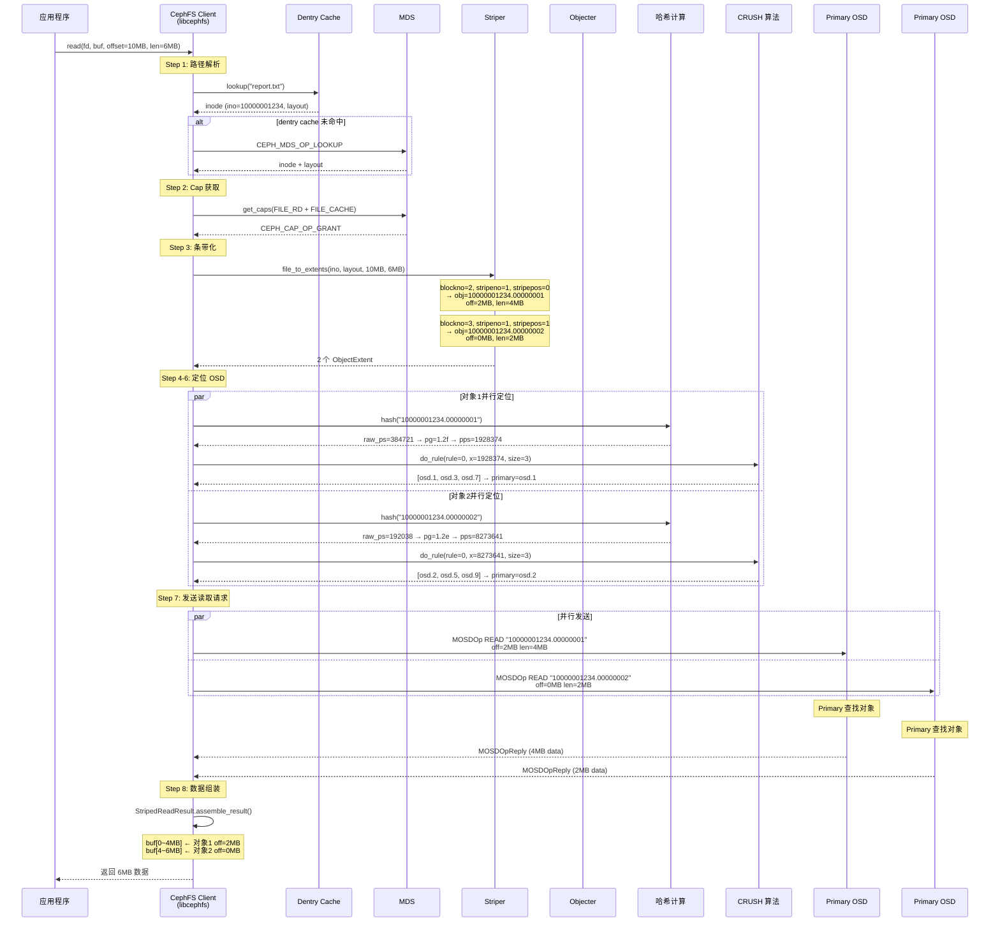

# CephFS 文件读取寻址全链路分析

---

## 目录

1. [寻址全链路总览](#1-寻址全链路总览)
2. [路径解析：文件路径 → Inode](#2-路径解析文件路径--inode)
3. [布局获取：Inode → file_layout_t](#3-布局获取inode--file_layout_t)
4. [条带化：文件偏移 → 对象列表](#4-条带化文件偏移--对象列表)
5. [对象哈希：对象名 → PG](#5-对象哈希对象名--pg)
6. [CRUSH 映射：PG → OSD 集合](#6-crush-映射pg--osd-集合)
7. [完整读取时序图](#7-完整读取时序图)
8. [数据组装：多对象 → 连续缓冲区](#8-数据组装多对象--连续缓冲区)
9. [端到端示例计算](#9-端到端示例计算)
10. [关键源码索引](#10-关键源码索引)

---

## 1. 寻址全链路总览

```
读取文件 "/data/project1/report.txt" 的 offset=10MB, len=6MB

  ┌─────────────────────────────────────────────────────────────┐
  │  Step 1: 路径解析                                            │
  │  "/data/project1/report.txt"                                │
  │  → dentry cache → _lookup() → MDS (如缓存未命中)             │
  │  → 得到 Inode (ino=10000001234)                              │
  └───────────────────────────┬─────────────────────────────────┘
                              │
  ┌───────────────────────────▼─────────────────────────────────┐
  │  Step 2: 获取布局                                            │
  │  Inode.layout = {su=4MB, sc=2, os=8MB, pool=2}             │
  │                                                              │
  │  su=stripe_unit=4MB   — 每条带单元大小                       │
  │  sc=stripe_count=2    — 每轮循环 2 个条带                     │
  │  os=object_size=8MB   — 对象最大大小                         │
  │  pool=2               — RADOS 存储池                        │
  └───────────────────────────┬─────────────────────────────────┘
                              │
  ┌───────────────────────────▼─────────────────────────────────┐
  │  Step 3: 条带化 (Striper)                                    │
  │                                                              │
  │  file_to_extents(ino=10000001234, off=10MB, len=6MB)        │
  │                                                              │
  │  ObjectExtent 1:                                            │
  │    obj = "10000001234.00000002"  off=2MB  len=4MB           │
  │  ObjectExtent 2:                                            │
  │    obj = "10000001234.00000003"  off=0MB  len=2MB           │
  └───────────────────────────┬─────────────────────────────────┘
                              │
  ┌───────────────────────────▼─────────────────────────────────┐
  │  Step 4: 对象 → PG                                          │
  │                                                              │
  │  "10000001234.00000002"                                     │
  │  → ceph_str_hash_linux(name) → raw_ps = 384721             │
  │  → ceph_stable_mod(384721, 1024, 2047) → pg_t = 1.2f       │
  │                                                              │
  │  "10000001234.00000003"                                     │
  │  → ceph_str_hash_linux(name) → raw_ps = 192038             │
  │  → ceph_stable_mod(192038, 1024, 2047) → pg_t = 1.2e       │
  └───────────────────────────┬─────────────────────────────────┘
                              │
  ┌───────────────────────────▼─────────────────────────────────┐
  │  Step 5: PG → OSD (CRUSH)                                   │
  │                                                              │
  │  pg 1.2f → crush_hash32_2(ps, pool) → pps                  │
  │  → crush_do_rule(rule=0, pps) → [osd.1, osd.3, osd.7]      │
  │  → primary = osd.1                                          │
  │                                                              │
  │  pg 1.2e → crush_do_rule(rule=0, pps) → [osd.2, osd.5, osd.9]│
  │  → primary = osd.2                                          │
  └───────────────────────────┬─────────────────────────────────┘
                              │
  ┌───────────────────────────▼─────────────────────────────────┐
  │  Step 6: 发送 OSD 读取请求                                   │
  │                                                              │
  │  MOSDOp READ "10000001234.00000002" off=2MB len=4MB → osd.1 │
  │  MOSDOp READ "10000001234.00000003" off=0MB len=2MB → osd.2 │
  │  (并行发送)                                                  │
  └───────────────────────────┬─────────────────────────────────┘
                              │
  ┌───────────────────────────▼─────────────────────────────────┐
  │  Step 7: 数据组装                                            │
  │                                                              │
  │  根据 buffer_extents 拼装:                                    │
  │  buf[0~4MB]  ← 对象2 的 off=2MB~6MB                        │
  │  buf[4~6MB]  ← 对象3 的 off=0MB~2MB                        │
  │  → 返回给应用 6MB 连续数据                                   │
  └─────────────────────────────────────────────────────────────┘
```

---

## 2. 路径解析：文件路径 → Inode

### 2.1 路径解析流程

```
path_walk("/data/project1/report.txt") (Client.cc:7904-8060):

  第1轮: diri = root, dname = "data"
    ├── 检查 dentry cache: root->dir->dentries["data"] → 命中!
    └── diri = inode(data)

  第2轮: diri = data, dname = "project1"
    ├── 检查 dentry cache: data->dir->dentries["project1"] → 命中!
    └── diri = inode(project1)

  第3轮: diri = project1, dname = "report.txt"
    ├── 检查 dentry cache: project1->dir->dentries["report.txt"]
    ├── 如果命中且有有效 lease → 返回 inode(report.txt)
    ├── 如果 SHARED cap 且 shared_gen 匹配 → 返回 inode
    └── 如果未命中 → _do_lookup() → 发送 CEPH_MDS_OP_LOOKUP 到 MDS

  返回: Inode (ino=10000001234)
```

### 2.2 Dentry 缓存验证

```
_dentry_valid(dn) (Client.cc:7796-7808):

  三级缓存验证:

  1. Lease 有效: dn->lease_mds 有 TTL → TTL 内有效
  2. Shared Cap: dir->caps_issued(FILE_SHARED) && dn->cap_shared_gen == dir->shared_gen
  3. Negative Cache: dir 有 I_COMPLETE 标志 + SHARED cap + dentry 不存在 → ENOENT

  任何验证通过 → 直接使用缓存，无需访问 MDS
  全部失败 → 发送 LOOKUP 请求到 MDS
```

---

## 3. 布局获取：Inode → file_layout_t

### 3.1 Inode 中的 Layout

```cpp
// src/client/Inode.h:126-324
struct Inode {
    inodeno_t ino;           // 10000001234
    file_layout_t layout;    // 文件条带布局
    uint64_t   size;         // 文件大小
    ObjectCacher::ObjectSet oset;  // 客户端对象缓存
    // ...
};
```

### 3.2 file_layout_t 结构

```cpp
// src/include/fs_types.h:107-143
struct file_layout_t {
    uint32_t stripe_unit;   // 条带单元大小 (默认 4MB)
    uint32_t stripe_count;  // 每轮循环的条带数 (默认 1)
    uint32_t object_size;   // 单个对象最大大小 (默认 4MB)
    int64_t  pool_id;       // RADOS 存储池 ID
    std::string pool_ns;    // 存储池命名空间

    get_period() = stripe_count * object_size  // 一个完整周期的大小
};

默认: file_layout_t(1<<22, 1, 1<<22) = (4MB, 1, 4MB)
```

### 3.3 Layout 来源

```
Layout 从哪来?

  1. 文件创建时:
     Client::_create() → MDS 分配默认 layout 或使用指定 layout
     MDS 回复中携带 layout → 存入 Inode::layout

  2. 文件打开时:
     Client::ll_open() → MDS 回复中确认 layout

  3. Cap 更新时:
     send_cap() / handle_cap_grant() → MDS 可能更新 layout

  4. 一旦确定，整个文件生命周期内 layout 不变
```

---

## 4. 条带化：文件偏移 → 对象列表

### 4.1 核心算法

```cpp
// src/osdc/Striper.cc:182-271
void Striper::file_to_extents(layout, offset, len, extents) {
    uint32_t su = layout->stripe_unit;         // 条带单元
    uint32_t sc = layout->stripe_count;        // 条带数
    uint32_t os = layout->object_size;         // 对象大小
    uint64_t stripes_per_object = os / su;     // 每个对象的条带数

    while (left > 0) {
        uint64_t blockno     = cur / su;                  // 第几个条带块
        uint64_t stripeno    = blockno / sc;               // 第几轮横向条带 (Y)
        uint64_t stripepos   = blockno % sc;               // 在横向条带中的位置 (X)
        uint64_t objectsetno = stripeno / stripes_per_object; // 第几组对象
        uint64_t objectno    = objectsetno * sc + stripepos;  // 对象编号

        uint64_t block_start = (stripeno % stripes_per_object) * su; // 对象内起始偏移
        uint64_t block_off   = cur % su;              // 条带内偏移
        uint64_t x_offset    = block_start + block_off; // 对象内实际偏移
        uint64_t x_len       = min(left, su - block_off); // 本次读取长度
    }
}
```

### 4.2 条带化图示

```
例: stripe_unit=4MB, stripe_count=2, object_size=8MB
    读取 offset=5MB, len=10MB (覆盖到 15MB)

  文件布局:
  ┌────────────────┬────────────────┬────────────────┬────────────────┐
  │   Object 0     │   Object 1     │   Object 2     │   Object 3     │
  │  (ino.00000000)│  (ino.00000001)│  (ino.00000002)│  (ino.00000003)│
  ├────────┬───────┤────────┬───────┤────────┬───────┤────────┬───────┤
  │ strip 0│strip 1│strip 2 │strip 3│strip 4 │strip 5│strip 6 │strip 7│
  │  4MB   │ 4MB   │ 4MB    │ 4MB   │ 4MB    │ 4MB   │ 4MB    │ 4MB   │
  │ 0~4MB  │ 4~8MB │ 8~12MB │12~16MB│16~20MB │20~24MB│24~28MB│28~32MB│
  └────────┴───────┴────────┴───────┴────────┴───────┴────────┴───────┘

  条带映射:
    offset 0~4MB   → blockno=0, stripeno=0, stripepos=0 → object 0, off=0
    offset 4~8MB   → blockno=1, stripeno=0, stripepos=1 → object 1, off=0
    offset 8~12MB  → blockno=2, stripeno=1, stripepos=0 → object 0, off=4MB
    offset 12~16MB → blockno=3, stripeno=1, stripepos=1 → object 1, off=4MB

  读取 offset=5MB, len=10MB (5MB~15MB):
    5~8MB   → object 1, off=1MB, len=3MB
    8~12MB  → object 0, off=4MB, len=4MB
    12~15MB → object 1, off=4MB, len=3MB

  结果: 3 个 ObjectExtent (注意跨对象但不跨对象大小的读取)
```

### 4.3 对象命名

```
命名格式 (object.cc:46-50):
  snprintf(buf, "%llx.%08llx", ino, bno);

  例:
    ino=10000001234, objectno=0 → "10000001234.00000000"
    ino=10000001234, objectno=2 → "10000001234.00000002"

  inode 用十六进制，objectno 用 8 位十六进制
```

---

## 5. 对象哈希：对象名 → PG

### 5.1 哈希过程

```
对象名 → PG 的计算步骤:

  1. hash_key() (osd_types.cc:1819-1830):
     input = namespace + '\037' + object_name
     (如果 namespace 为空，只用 object_name)
     output = ceph_str_hash_linux(input)

  2. ceph_str_hash_linux() (ceph_hash.cc:83-92):
     hash = 0
     for each byte c:
       hash = (hash + (c<<4) + (c>>4)) * 11
     return hash  → raw_ps (原始放置种子)

  3. ceph_stable_mod() (rados.h:96-102):
     ps = ceph_stable_mod(raw_ps, pg_num, pg_num_mask)
     → 归一化到 [0, pg_num) 范围

  4. pg_t(ps, pool_id):
     → PG 标识 = (ps, pool)

  5. raw_pg_to_pps() (osd_types.cc:1851-1858):
     pps = crush_hash32_2(RJENKINS1, ps, pool_id)
     → 放置种子 (CRUSH 算法的输入)
```

### 5.2 ceph_stable_mod 为什么需要

```
问题: pg_num 可能不是 2 的幂 (如 1024, 800, 300)

  如果直接 hash % pg_num:
    pg_num 从 1024 变成 800 时
    原来属于 PG 900 的对象会跳到不同位置
    → 大规模数据迁移

  ceph_stable_mod 解决:
    bmask = 下一个 2^N >= pg_num - 1 (如 pg_num=800, bmask=1023)

    if ((x & bmask) < pg_num):
        return x & bmask        // 在范围内, 直接取低位
    else:
        return x & (bmask >> 1) // 超出范围, 折叠到前半

  效果: pg_num 变化时, 只有超出新 pg_num 的 PG 需要迁移
  例: pg_num 从 1024 降到 800
    → PG 0~799 不变
    → PG 800~1023 重新映射到 0~223
  → 减少 ~80% 的迁移量
```

### 5.3 两种哈希函数

```
CephFS 在寻址过程中使用了两种不同的哈希函数:

  1. ceph_str_hash_linux (ceph_hash.cc:83)
     用于: 对象名 → raw_ps
     特点: 简单的乘加运算
     输入: 对象名字符串

  2. crush_hash32_rjenkins1 (crush/hash.c:12)
     用于: (ps, pool) → pps (CRUSH 输入)
     特点: Robert Jenkins 32-bit mixing, 更好的分布性
     输入: 两个 32 位整数

  为什么用两种?
    linux hash: 快速, 用于将对象名空间映射到 PG 编号空间
    rjenkins1: 更好的均匀分布, 用于 CRUSH 内部选择 OSD
```

---

## 6. CRUSH 映射：PG → OSD 集合

### 6.1 CRUSH 算法输入输出

```
输入:
  rule_no  — CRUSH 规则编号 (存储池关联的规则)
  x (pps)  — 放置种子 (由 raw_pg_to_pps 计算)
  size     — 副本数 (存储池的 size)

输出:
  osds[]   — OSD 编号列表 [osd.1, osd.3, osd.7]

CRUSH 规则示例 (默认 replicated_rule):
  step 1: take default         → 从 root 节点开始
  step 2: chooseleaf firstn 3 type host  → 选择 3 个不同 host
  step 3: emit                  → 输出结果
```

### 6.2 完整 PG 解析

```cpp
// OSDMap.cc:3143-3191
_pg_to_up_acting_osds(pg, &up, &up_primary, &acting, &acting_primary):

  1. _pg_to_raw_osds(pool, pg, &raw, &pps)
     → crush->do_rule(ruleno, pps, raw, size)
     → raw = [osd.1, osd.3, osd.7]

  2. _apply_upmap(pool, pg, &raw)
     → 应用管理员手动 PG 映射调整 (如果有)

  3. _raw_to_up_osds(pool, raw, &up)
     → 过滤掉 DOWN 的 OSD
     → up = [osd.1, osd.7]  (osd.3 宕机了)

  4. _pick_primary(up)
     → up[0] = osd.1 → primary = osd.1

  5. 如果有 pg_temp (Peering 临时映射):
     → acting 可能与 up 不同

  最终: primary=osd.1, acting=[osd.1, osd.7]
```

### 6.3 Primary 选择

```cpp
// OSDMap.cc:2799-2807
_pick_primary(osds):
    for (osd in osds):
        if (osd != CRUSH_ITEM_NONE):
            return osd;   // 第一个有效 OSD 就是 Primary
    return -1;

  Primary 不是选举出来的, 而是约定俗成:
  CRUSH 输出的第一个就是 Primary
  所有客户端和 OSD 用相同的 CRUSH 算法 → 自然得到相同的 Primary
```

---

## 7. 完整读取时序图



---

## 8. 数据组装：多对象 → 连续缓冲区

### 8.1 并行读取调度

```cpp
// Objecter.h:3988-4007
sg_read_trunc(extents):
    if (extents.size() == 1):
        // 单对象: 直接读取
        read_trunc(extents[0].oid, ..., &bl, onfinish)
    else:
        // 多对象: 并行读取 + 收集
        for each extent:
            read_trunc(extent.oid, ..., &resultbl[i], gather.new_sub())
        gather.set_finisher(C_SGRead)
        gather.activate()
```

### 8.2 数据拼装

```
StripedReadResult (Striper.cc:388-485):

  add_partial_result(data, buffer_extents):
    for each (buf_offset, length) in buffer_extents:
        partial[buf_offset] = data 的前 length 字节

  assemble_result(bl):
    for (buf_offset, data) in partial (按 offset 排序):
        if (有间隔) bl.append_zero(间隔大小)  // 填充空洞
        bl.claim_append(data)

  buffer_extents 的作用:
    记录每个对象的数据应该放到读取缓冲区的哪个位置

    例:
      ObjectExtent 1: buffer_extents = [(0, 4MB)]  → 放到 buf[0~4MB]
      ObjectExtent 2: buffer_extents = [(4MB, 2MB)] → 放到 buf[4~6MB]

    即使两个请求乱序返回，也能正确拼装
```

---

## 9. 端到端示例计算

### 9.1 场景

```
文件: /data/report.csv (ino=0x100, 大小=20MB)
布局: stripe_unit=4MB, stripe_count=2, object_size=8MB, pool=2
读取: offset=6MB, len=6MB (6MB~12MB)
```

### 9.2 Step 3: 条带化计算

```
cur = 6MB, left = 6MB, su=4MB, sc=2, os=8MB, stripes_per_obj = os/su = 2

  ── 第1次循环 ──
  blockno     = 6MB / 4MB = 1
  stripeno    = 1 / 2 = 0
  stripepos   = 1 % 2 = 1
  objectsetno = 0 / 2 = 0
  objectno    = 0 * 2 + 1 = 1
  block_start = (0 % 2) * 4MB = 0
  block_off   = 6MB % 4MB = 2MB
  x_offset    = 0 + 2MB = 2MB
  x_len       = min(6MB, 4MB - 2MB) = 2MB
  → ObjectExtent: obj=100.00000001, off=2MB, len=2MB, buf_off=0
  cur = 8MB, left = 4MB

  ── 第2次循环 ──
  blockno     = 8MB / 4MB = 2
  stripeno    = 2 / 2 = 1
  stripepos   = 2 % 2 = 0
  objectsetno = 1 / 2 = 0
  objectno    = 0 * 2 + 0 = 0
  block_start = (1 % 2) * 4MB = 4MB
  block_off   = 8MB % 4MB = 0
  x_offset    = 4MB + 0 = 4MB
  x_len       = min(4MB, 4MB - 0) = 4MB
  → ObjectExtent: obj=100.00000000, off=4MB, len=4MB, buf_off=2MB
  cur = 12MB, left = 0 → 结束
```

### 9.3 Step 4-5: PG 计算 (简化)

```
对象 "100.00000001":
  1. hash_key("100.00000001") → raw_ps = 假设 1234567
  2. ceph_stable_mod(1234567, 1024, 2047):
     1234567 & 2047 = 1031
     1031 >= 1024 → 1031 & 1023 = 7
     → ps = 7
  3. pg_t(7, 2) → pg 2.7

  4. raw_pg_to_pps(pg=2.7):
     pps = crush_hash32_2(RJENKINS1, 7, 2) = 假设 54321

对象 "100.00000000":
  同理 → pg 2.3 → pps = 假设 98765
```

### 9.4 Step 6: CRUSH 计算 (简化)

```
pg 2.7, pps=54321:
  crush_do_rule(rule=0, x=54321, size=3):
    step "take default" → root
    step "chooseleaf firstn 3 type host":
      straw2(bucket=root, x=54321) → host=rack1
      straw2(bucket=rack1, x=54321) → host=h1
      straw2(bucket=h1, x=54321) → osd.1
      straw2(bucket=root, x=54322) → host=rack2
      ... → osd.3, osd.7
    → [osd.1, osd.3, osd.7], primary = osd.1

pg 2.3, pps=98765:
  → [osd.2, osd.5, osd.9], primary = osd.2
```

### 9.5 最终结果

```
读取 /data/report.csv offset=6MB len=6MB:

  ┌──────────────────┬──────────┬──────────┬──────────┬──────────┐
  │ ObjectExtent     │ 对象名   │ 对象偏移  │ PG       │ Primary  │
  ├──────────────────┼──────────┼──────────┼──────────┼──────────┤
  │ #1 (buf[0~2MB])  │ 100.01   │ off=2MB  │ 2.7      │ osd.1    │
  │ #2 (buf[2~6MB])  │ 100.00   │ off=4MB  │ 2.3      │ osd.2    │
  └──────────────────┴──────────┴──────────┴──────────┴──────────┘

  并行发送:
    MOSDOp READ "100.00000001" off=2MB len=2MB → osd.1
    MOSDOp READ "100.00000000" off=4MB len=4MB → osd.2

  拼装:
    buf[0~2MB]  ← osd.1 返回的 2MB
    buf[2~6MB]  ← osd.2 返回的 4MB
    → 返回应用 6MB 连续数据
```

---

## 10. 关键源码索引

| 模块 | 文件 | 关键内容 |
|------|------|---------|
| **路径解析** | `src/client/Client.cc:7904-8060` | `path_walk()` |
| **Dentry 缓存** | `src/client/Client.cc:7725-7870` | `_lookup()` dentry cache 三级验证 |
| **FUSE lookup** | `src/client/Client.cc:14324-14364` | `ll_lookup()` |
| **Layout 结构** | `src/include/fs_types.h:107-143` | `file_layout_t` 默认值 |
| **Inode 结构** | `src/client/Inode.h:126-324` | `Inode::layout`, `Inode::oset` |
| **条带化算法** | `src/osdc/Striper.cc:182-271` | `file_to_extents()` 核心数学 |
| **对象命名** | `src/include/object.cc:46-50` | `file_object_t::c_str()` 格式 |
| **ObjectExtent** | `src/osd/StriperTypes.h:19-32` | `LightweightObjectExtent` |
| **ObjectExtent** | `src/osd/osd_types.h:5715-5749` | `ObjectExtent` 完整版 |
| **PG 计算** | `src/osdc/Objecter.cc:2959-3047` | `_calc_target()` |
| **对象哈希** | `src/osd/OSDMap.cc:2710-2741` | `object_locator_to_pg()`, `map_to_pg()` |
| **hash_key** | `src/osd/osd_types.cc:1819-1830` | `pg_pool_t::hash_key()` |
| **Linux 哈希** | `src/common/ceph_hash.cc:83-92` | `ceph_str_hash_linux()` |
| **PG 归一化** | `src/include/rados.h:96-102` | `ceph_stable_mod()` |
| **PG 到 PPS** | `src/osd/osd_types.cc:1851-1858` | `raw_pg_to_pps()` |
| **CRUSH 入口** | `src/osd/OSDMap.cc:2779-2797` | `_pg_to_raw_osds()` |
| **CRUSH 规则** | `src/crush/mapper.c:2017-2053` | `crush_do_rule()` |
| **PG 完整解析** | `src/osd/OSDMap.cc:3143-3191` | `_pg_to_up_acting_osds()` |
| **Primary 选择** | `src/osd/OSDMap.cc:2799-2807` | `_pick_primary()` |
| **CRUSH Wrapper** | `src/crush/CrushWrapper.h:1602-1618` | `do_rule()` |
| **RJenkins 哈希** | `src/crush/hash.c:12-90` | `crush_hash32_rjenkins1` |
| **Filer 读取** | `src/osdc/Filer.cc:64-81` | `read_trunc()` 调用 Striper |
| **Objecter 并行读** | `src/osdc/Objecter.h:3988-4007` | `sg_read_trunc()` |
| **Objecter 单次读** | `src/osdc/Objecter.h:3415-3435` | `read_trunc()` 构造 MOSDOp |
| **数据拼装** | `src/osdc/Objecter.cc:4701-4730` | `_sg_read_finish()` |
| **拼装算法** | `src/osdc/Striper.cc:388-485` | `StripedReadResult` |
| **客户端读入口** | `src/client/Client.cc:11552` | `_read()` |
| **异步读** | `src/client/Client.cc:11831` | `_read_async()` via ObjectCacher |
| **同步读** | `src/client/Client.cc:11965` | `_read_sync()` via Filer |
