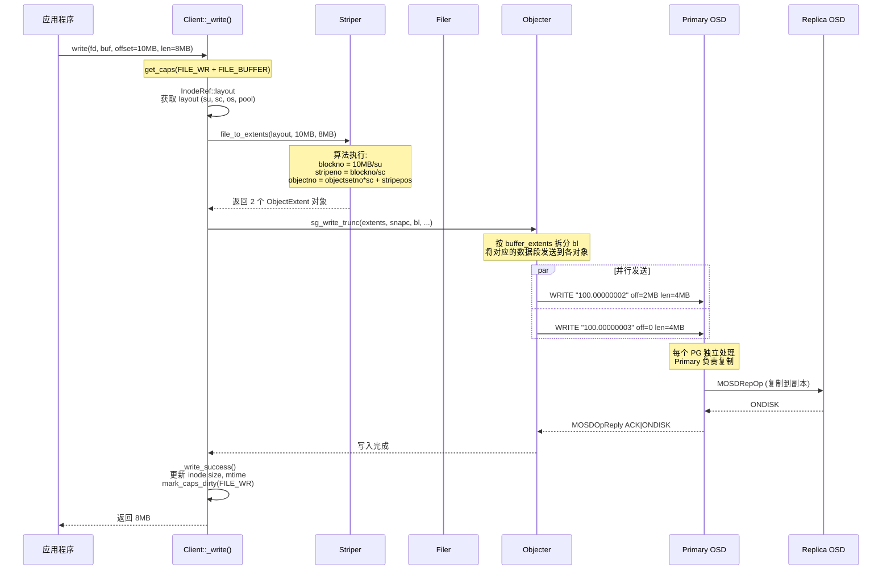
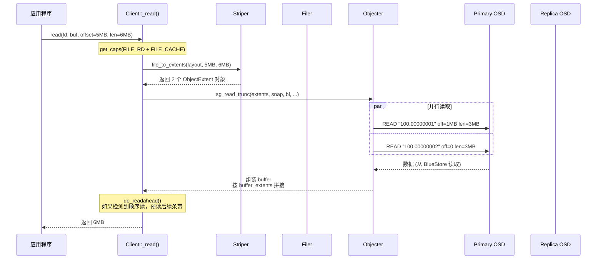

# CephFS 条带化机制分析

---

## 目录

1. [条带化概述](#1-条带化概述)
2. [Layout 参数与约束](#2-layout-参数与约束)
3. [核心算法：file_to_extents](#3-核心算法file_to_extents)
4. [条带化写入流程](#4-条带化写入流程)
5. [条带化读取流程](#5-条带化读取流程)
6. [Layout 继承机制](#6-layout-继承机制)
7. [对象命名规则](#7-对象命名规则)
8. [ObjectCacher 与条带化](#8-objectcacher-与条带化)
9. [截断与条带化](#9-截断与条带化)
10. [EC 池的条带化](#10-ec-池的条带化)
11. [条带化配置示例](#11-条带化配置示例)
12. [与 JuiceFS、Lustre 条带化对比](#12-与-juicefslustre-条带化对比)
13. [关键源码索引](#13-关键源码索引)

---

## 1. 条带化概述

### 1.1 为什么需要条带化

```
问题: 一个大文件（如 100GB）不能存为单个 RADOS 对象
  ├── osd_max_object_size = 128MB（默认上限）
  ├── 单对象无并发 — 只能由一个 OSD 处理
  └── 单对象单 PG — 负载不均衡

解决: 条带化将文件切成多个对象
  ├── 每个对象独立存储、独立复制
  ├── 不同对象可能在不同 PG → 不同 OSD
  └── 客户端可以并行读写多个对象
```

### 1.2 执行位置

```
条带化完全在客户端执行:

  CephFS Client (libcephfs.so)
  │
  │  Client::_write() / Client::_read()
  │    → Filer::write_trunc() / Filer::read_trunc()
  │      → Striper::file_to_extents()    ← 条带化在这里
  │        输入: (layout, file_offset, len)
  │        输出: vector<ObjectExtent>
  │      → Objecter::sg_write_trunc()    ← 直接发 OSD
  │
  ▼ TCP
  OSD — 只看到独立对象操作，不知道文件/条带概念
```

---

## 2. Layout 参数与约束

### 2.1 Layout 结构

```cpp
// src/include/fs_types.h:107-143
struct file_layout_t {
  uint32_t stripe_unit;    // 条带单元大小
  uint32_t stripe_count;   // 条带跨多少个对象
  uint32_t object_size;    // 单个对象大小
  int64_t  pool_id;        // 存储池 ID

  static file_layout_t get_default() {
    return file_layout_t(1<<22, 1, 1<<22);  // su=4MB, sc=1, os=4MB
  }
};
```

### 2.2 参数约束

```cpp
// src/common/fs_types.cc:44-58
bool file_layout_t::is_valid() const {
  stripe_unit 必须非零且 64KB 对齐;     // CEPH_MIN_STRIPE_UNIT = 65536
  object_size 必须非零且 64KB 对齐;
  object_size >= stripe_unit;
  object_size % stripe_unit == 0;
  stripe_count 必须非零;
}
```

### 2.3 三个参数的关系

```
stripe_unit (su)  — 每个条带单元的大小
stripe_count (sc) — 一轮条带跨越多少个对象
object_size (os)  — 单个对象容纳多少数据

layout_period = stripe_count × object_size

例: su=64KB, sc=4, os=1MB
  period = 4 × 1MB = 4MB
  stripes_per_object = 1MB / 64KB = 16
  每 4MB 一个完整周期，包含 4 个对象，每个对象 16 个条带单元
```

---

## 3. 核心算法：file_to_extents

### 3.1 算法伪代码

```cpp
// src/osdc/Striper.cc:182-270
void Striper::file_to_extents(layout, offset, len, ...) {
    object_size  = layout->object_size;     // 如 1MB
    su           = layout->stripe_unit;      // 如 64KB
    stripe_count = layout->stripe_count;     // 如 4

    // 特殊优化: stripe_count=1 时，su 直接等于 object_size
    if (stripe_count == 1) su = object_size;

    stripes_per_object = object_size / su;   // 1MB / 64KB = 16

    for (cur = offset; cur < offset + len; ) {
        // 步骤1: 计算 2D 条带坐标
        blockno      = cur / su;                    // 第几个条带单元（序号）
        stripeno     = blockno / stripe_count;      // 第几行（Y轴）
        stripepos    = blockno % stripe_count;      // 第几列（X轴）
        objectsetno  = stripeno / stripes_per_object; // 第几组
        objectno     = objectsetno * stripe_count + stripepos; // 目标对象号

        // 步骤2: 计算对象内偏移
        block_start  = (stripeno % stripes_per_object) * su;
        block_off    = cur % su;
        x_offset     = block_start + block_off;      // 对象内起始偏移
        x_len        = min(su - block_off, left);    // 本次写入长度

        // 步骤3: 合并或创建 extent
        if (与同对象的上一段连续) {
            扩展上一段 extent 的 length;
        } else {
            创建新 LightweightObjectExtent;
        }

        // 步骤4: 记录 buffer 映射
        ex->buffer_extents.emplace_back(cur - offset + buffer_offset, x_len);

        cur += x_len;
        left -= x_len;
    }
}
```

### 3.2 条带化映射图解

```
例: stripe_unit=64KB, stripe_count=3, object_size=1MB

文件字节流:
|-------su0-------|-------su1-------|-------su2-------|-------su3-------|-------su4-------|-------su5-------|
    64KB              64KB              64KB              64KB              64KB              64KB

映射结果:
Object 0:  [  su0  ]              [       su3       ]              [  su6  ]
            ↗ 64KB                ↗ 64KB                ↗ 64KB
Object 1:        [  su1  ]                [       su4       ]
                  ↗ 64KB                  ↗ 64KB
Object 2:              [  su2  ]                [       su5       ]
                        ↗ 64KB                  ↗ 64KB

→ stripe_count=3, 所以数据轮转分布在 3 个对象上
→ stripes_per_object = 1MB/64KB = 16, 所以每个对象填满 16 个条带后轮转到下一组
```

### 3.3 默认 Layout（无条带化）

```
默认: stripe_unit=4MB, stripe_count=1, object_size=4MB

  文件 (16MB)
  ├── 对象 0: [0MB ~ 4MB]      ← 一个对象 = 一个条带 = 4MB
  ├── 对象 1: [4MB ~ 8MB]
  ├── 对象 2: [8MB ~ 12MB]
  └── 对象 3: [12MB ~ 16MB]

  stripe_count=1 → 没有轮转，纯顺序分块
  相当于: 每个对象就是文件的一个 4MB 块
```

### 3.4 数据结构

```cpp
// src/osdc/StriperTypes.h:19-32
struct LightweightObjectExtent {
  uint64_t object_no;     // 对象序号
  uint64_t offset;        // 对象内偏移
  uint64_t length;        // 对象内长度
  uint64_t truncate_size; // 截断大小
  LightweightBufferExtents buffer_extents;  // [(buffer_offset, len)] 映射
};

// 每个 extent 的 buffer_extents 告诉调用者:
// "要组装完整的文件 buffer，从对象读 x_offset~x_offset+x_len，
//  放到 buffer 的 buffer_offset 位置"
```

---

## 4. 条带化写入流程



### 4.1 Filer 的角色

```cpp
// src/osdc/Filer.cc:98-115
void Filer::write_trunc(ino, layout, snapc, offset, len, bl, ...) {
  std::vector<ObjectExtent> extents;
  Striper::file_to_extents(cct, ino, layout, offset, len, truncate_size, extents);
  objecter->sg_write_trunc(extents, snapc, bl, ...);
}
```

Filer 是 Striper 和 Objecter 之间的桥梁：
```
Client → Filer → Striper (映射) → Objecter (发送)
```

---

## 5. 条带化读取流程



### 5.1 缓冲区组装

```
读取 offset=5MB, len=6MB 的结果:

  对象 "100.00000001": off=1MB, len=3MB → 放入 buf[0~3MB]
  对象 "100.00000002": off=0,   len=3MB → 放入 buf[3MB~6MB]

  buffer_extents 的作用:
    [(buf_offset=0, len=3MB), (buf_offset=3MB, len=3MB)]

  → Objecter 按 buffer_extents 从各对象读取的数据
    拼接到一个连续的 buffer 中返回给应用
```

---

## 6. Layout 继承机制

### 6.1 三级 Layout 解析

```
文件创建时的 Layout 决策:

  ① 客户端指定?
     Client::_create() 传入 stripe_unit, stripe_count, object_size
     → 如果非零，覆盖继承值

  ② 父目录有 Layout?
     MDS 在 path_walk 时检查父目录 inode:
       if (parent->has_layout())
           layout = parent->layout;  // 继承

  ③ 都没有 → 集群默认
     MDCache::default_file_layout
       = file_layout_t(1<<22, 1, 1<<22)  // 4MB/1/4MB
       pool_id = mdsmap.get_first_data_pool()
```

### 6.2 MDS 端的 Layout 处理

```cpp
// src/mds/Server.cc:4881-4920
// 设置 layout
if (mdr->dir_layout != file_layout_t())
  layout = mdr->dir_layout;              // 继承父目录
else
  layout = mdcache->default_file_layout;  // 集群默认

// 客户端参数覆盖
if (req->head.args.open.stripe_unit)   layout.stripe_unit = req->...;
if (req->head.args.open.stripe_count)  layout.stripe_count = req->...;
if (req->head.args.open.object_size)   layout.object_size = req->...;
if (req->head.args.open.pool >= 0)     layout.pool_id = req->...;
```

### 6.3 Layout 继承状态

```cpp
// src/mds/Server.cc:7281-7306 (get_inherited_layout lambda)

三种状态:
  SET       — 在此 inode 上显式设置（通过 setfattr 或创建标志）
  INHERITED — 从祖先目录继承
  DEFAULT   — 等于集群默认值
```

### 6.4 Layout 继承流程图

```
目录 /data 设置了 layout: su=1MB, sc=4, os=4MB

  mkdir /data
  setfattr -n ceph.dir.layout -v "stripe_unit=1048576 stripe_count=4 ..." /data

  touch /data/file1
  │
  ▼ Client::_create() (无自定义参数)
  │
  ▼ MDS: handle_client_open()
  │  path_walk → /data inode has_layout() == true
  │  mdr->dir_layout = /data's layout
  │
  ▼ Server.cc:4882
  │  layout = mdr->dir_layout  (su=1MB, sc=4, os=4MB)
  │
  ▼ file1 继承了 /data 的 layout
  │  file1 的 stripe_unit=1MB, stripe_count=4, object_size=4MB
```

---

## 7. 对象命名规则

### 7.1 命名格式

```cpp
// src/include/object.cc:46-49
const char *file_object_t::c_str() const {
  snprintf(buf, sizeof(buf), "%llx.%08llx", ino, bno);
}
```

格式：`<16进制inode号>.<8位16进制对象序号>`

```
例: inode=0x100, 对象序号=3 → "100.00000003"
    inode=0x10000000001, 对象序号=15 → "10000000001.0000000f"
```

### 7.2 对象序号与条带的关系

```
stripe_count=4, object_size=1MB, stripe_unit=64KB

对象号分配:
  第一组 (objectsetno=0):
    objectno 0 → 条带列 0 (stripepos=0)
    objectno 1 → 条带列 1 (stripepos=1)
    objectno 2 → 条带列 2 (stripepos=2)
    objectno 3 → 条带列 3 (stripepos=3)

  每个对象填满后 (stripes_per_object=16 个条带单元):
  第二组 (objectsetno=1):
    objectno 4 → 条带列 0
    objectno 5 → 条带列 1
    objectno 6 → 条带列 2
    objectno 7 → 条带列 3

  公式: objectno = objectsetno × stripe_count + stripepos
```

---

## 8. ObjectCacher 与条带化

ObjectCacher（客户端缓存）也使用 Striper 进行文件-对象映射：

```cpp
// src/osdc/ObjectCacher.h:707-744

file_write(oset, layout, snapc, offset, len, bl, ...)
  → Striper::file_to_extents(cct, oset->ino, layout, offset, len, ...)
  → writex(wr, oset, ...)  // 写入 BufferHead 缓存

file_read(oset, layout, snapid, offset, len, bl, ...)
  → Striper::file_to_extents(cct, oset->ino, layout, offset, len, ...)
  → readx(rd, oset, ...)   // 从 BufferHead 缓存或 OSD 读取

file_flush(oset, layout, snapc, offset, len, ...)
  → Striper::file_to_extents(cct, oset->ino, layout, offset, len, ...)
  → flush_set(oset, extents, ...)  // 刷写 DIRTY BufferHead 到 OSD

is_cached(oset, layout, snapid, offset, len)
  → Striper::file_to_extents(...)
  → is_cached(oset, extents, snapid)  // 检查是否全部在缓存中
```

---

## 9. 截断与条带化

### 9.1 截断时的条带处理

```cpp
// src/osdc/Striper.cc:310-348
// object_truncate_size(): 计算截断后每个对象的有效大小

例: 文件 10MB, truncate to 5MB

  对象 0 (0~4MB): truncate_size = 4MB  (完整)
  对象 1 (4MB~8MB): truncate_size = 1MB  (部分有效，只保留 4~5MB)
  对象 2 (8MB~12MB): 整个对象被删除

  → Filer 传递 truncate_size 给 OSD
  → OSD 读写时只操作有效部分
```

### 9.2 Filer 的 trunc 变体

```
Filer::write_trunc() vs Filer::write():
  write_trunc 额外传递 truncate_size 和 truncate_seq
  → OSD 知道文件被截断，不会读/写超过有效范围的数据

Filer::read_trunc() vs Filer::read():
  同理，读取时也传递截断信息
```

---

## 10. EC 池的条带化

### 10.1 CephFS 条带化与 EC 无关

**CephFS 的条带化算法与池类型（副本池/EC池）完全无关。**

```
Striper::file_to_extents() 对所有池类型使用相同算法:
  输入: (layout, offset, len)
  输出: vector<ObjectExtent>
  → 不关心 pool 是 replicated 还是 erasure-coded

EC 编码在 OSD 内部透明处理:
  客户端 → Striper → Objecter → Primary OSD → EC 编码/解码 → 副本 OSD
```

### 10.2 两层条带化

```
文件条带化 (CephFS 层):
  文件 → 条带 → RADOS 对象
  控制参数: stripe_unit, stripe_count, object_size

EC 条带化 (RADOS 层):
  RADOS 对象 → 数据块 + 校验块
  控制参数: EC profile (k+m), ec_stripe_unit

两层独立，互不感知。
```

---

## 11. 条带化配置示例

### 11.1 不同场景的 Layout 配置

| 场景 | stripe_unit | stripe_count | object_size | 说明 |
|------|------------|-------------|-------------|------|
| 默认 | 4MB | 1 | 4MB | 无条带化，纯顺序分块 |
| 大文件高并发 | 64KB | 4 | 1MB | 4 路并行，适合流式读写 |
| 大文件顺序读 | 1MB | 1 | 1MB | 顺序分块，减少对象数 |
| 小文件 | 64KB | 1 | 64KB | 单对象=文件大小，减少元数据 |

### 11.2 条带化对并发的影响

```
默认 (sc=1): 16MB 文件 → 4 个对象 → 最多 4 个 OSD 并行

sc=4: 16MB 文件 → 约 16 个对象 → 最多 16 个 OSD 并行
  但每个 OSD 只处理 1/4 的数据段
  适合: 多客户端同时读同一文件的不同区域

sc=1 vs sc=4 的取舍:
  sc=1: 单流吞吐好（大块连续写入），并发低
  sc=4: 并发高（多对象多 OSD），但增加小 I/O 开销
```

---

## 12. 与 JuiceFS、Lustre 条带化对比

| 维度 | CephFS | JuiceFS | Lustre |
|------|--------|---------|--------|
| 切分单元 | stripe_unit（默认 4MB） | Slice（默认 4MB） | stripe_unit（可配置） |
| 跨对象分布 | stripe_count | 无（Slice 纯顺序） | stripe_count (OST 数) |
| 对象命名 | `inode.对象序号` | `volume/chunk-slice` | 不暴露给用户 |
| 切分位置 | 客户端（Striper） | 客户端（chunkStore） | 客户端（OSC） |
| Layout 继承 | 目录 → 子文件 | 无（全局配置） | 目录 → 子文件 |
| Layout 可配 | su/sc/os/pool 均可配 | chunk 大小可配 | su/sc/pool 可配 |
| 对象可变大小 | 固定 object_size | 固定 Slice 大小 | 固定 stripe_unit |
| 写入方式 | 原地覆盖 | 只追加（新 Slice） | 原地覆盖 |
| EC 支持 | 池级别（透明） | 无（依赖对象存储） | 无原生支持 |

---

## 13. 关键源码索引

| 模块 | 文件 | 关键内容 |
|------|------|---------|
| **条带算法** | `src/osdc/Striper.cc:182-270` | `file_to_extents()` 核心算法 |
| **条带包装** | `src/osdc/Striper.cc:122-179` | 4 个重载（Lightweight/Map/Vector/Ino） |
| **条带声明** | `src/osdc/Striper.h:36-69` | 公共接口声明 |
| **Extent 结构** | `src/osdc/StriperTypes.h:19-32` | `LightweightObjectExtent` |
| **截断大小** | `src/osdc/Striper.cc:310-348` | `object_truncate_size()` |
| **对象命名** | `src/include/object.cc:46-49` | `file_object_t::c_str()` `"%llx.%08llx"` |
| **对象命名结构** | `src/include/object.h:79-92` | `file_object_t` (ino, bno) |
| **Layout 内存** | `src/include/fs_types.h:107-143` | `file_layout_t` 结构体 |
| **Layout 默认值** | `src/include/fs_types.h:130` | `get_default()` = 4MB/1/4MB |
| **Layout 校验** | `src/common/fs_types.cc:44-58` | `is_valid()` |
| **Layout 磁盘格式** | `src/include/ceph_fs.h:67-82` | `ceph_file_layout` (packed) |
| **Inode Layout** | `src/include/cephfs/types.h:912` | `inode_t::layout` |
| **客户端创建** | `src/client/Client.cc:15958-16014` | `_create()` 传递 stripe 参数 |
| **MDS Layout 继承** | `src/mds/Server.cc:4881-4920` | 继承父目录 + 客户端覆盖 |
| **MDS Layout 解析** | `src/mds/Server.cc:7281-7306` | `get_inherited_layout` 三级状态 |
| **MDS 默认 Layout** | `src/mds/MDCache.cc:420-442` | `gen_default_file_layout()` |
| **Filer 写入** | `src/osdc/Filer.cc:98-115` | `write_trunc()` |
| **Filer 读取** | `src/osdc/Filer.cc:64-81` | `read_trunc()` |
| **Filer 声明** | `src/osdc/Filer.h:20-28` | "stripe file ranges onto objects" |
| **ObjectCacher 写入** | `src/osdc/ObjectCacher.h:726-734` | `file_write()` |
| **ObjectCacher 读取** | `src/osdc/ObjectCacher.h:707-714` | `file_read()` |
| **ObjectCacher 刷写** | `src/osdc/ObjectCacher.h:736-744` | `file_flush()` |
| **ObjectCacher 缓存检查** | `src/osdc/ObjectCacher.h:700-705` | `is_cached()` |
