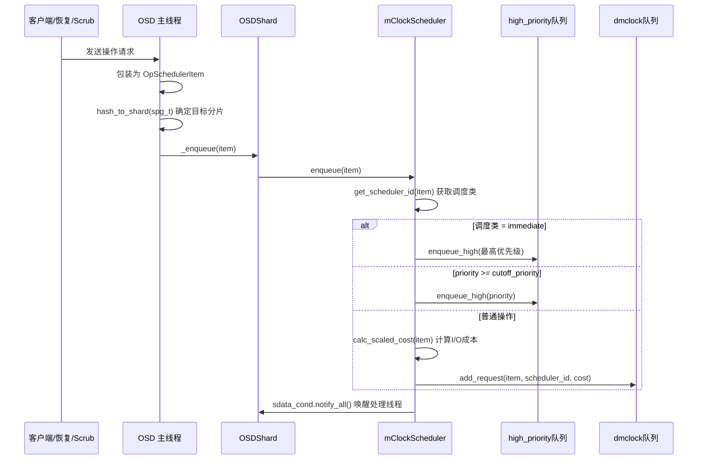
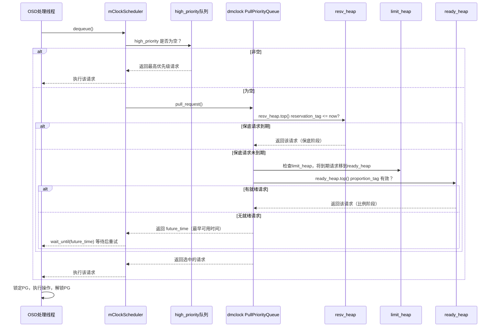

# CephFS/Ceph 中 dmclock 调度机制分析

## 1. 一句话概括

dmclock 是 Ceph OSD 的默认 I/O 调度器，基于 mClock 算法为不同类型的操作（客户端读写、恢复、Scrub 等）提供 QoS 保障，通过 reservation（保底）、weight（按比例分配）、limit（上限）三维度实现公平且高效的 I/O 调度。

## 2. dmclock 解决什么问题

```
问题: OSD 同时处理多种类型的请求，资源竞争激烈

  客户端读写 ←──┐
  PG 恢复    ←──┼──→ 同一个 OSD 竞争磁盘 I/O
  Scrub 扫描  ←──┤
  Snap Trim  ←──┘

  没有 QoS 调度时:
    恢复操作耗尽磁盘带宽 → 客户端读写延迟飙升
    Scrub 扫描占用大量 I/O → 业务请求被饿死

  有 dmclock 调度时:
    客户端读写: 保证最低 50% 带宽
    PG 恢复:    保证最低 50% 带宽
    Scrub/Trim: 不保底，但限制最高 90%（避免饿死其他操作）
    → 业务和后台操作和谐共存
```

## 3. 核心算法: mClock 三维度调度

### 3.1 三个 QoS 参数

每个"客户端"（实际上是操作类型）有三个参数:

| 参数 | 含义 | 类比 |
|---|---|---|
| **reservation** | 最低保障比例 | 你至少能分到这么多蛋糕 |
| **weight** | 剩余容量按权重分配 | 蛋糕有剩余时，按权重比例分 |
| **limit** | 最高上限比例 | 你最多只能拿这么多蛋糕 |

### 3.2 调度算法流程

```
┌─────────────────────────────────────────────────────────────┐
│                  dmclock 调度决策流程                         │
├─────────────────────────────────────────────────────────────┤
│                                                             │
│  请求到达，加入队列                                          │
│         │                                                   │
│         ▼                                                   │
│  ┌──────────────────┐                                      │
│  │ Step 1: 检查     │ reservation_heap                      │
│  │ Reservation 堆   │ 是否有到期请求？                       │
│  │ （保底优先）      │ reservation_tag <= now?               │
│  └───────┬──────────┘                                      │
│          │ 是 → 执行该请求（保底阶段）                         │
│          │ 否                                               │
│          ▼                                                  │
│  ┌──────────────────┐                                      │
│  │ Step 2: 检查     │ limit_heap                            │
│  │ Limit 堆         │ 将已到达 limit 的请求移到 ready 堆      │
│  │ （超限降权）      │ limit_tag <= now?                     │
│  └───────┬──────────┘                                      │
│          │                                                  │
│          ▼                                                  │
│  ┌──────────────────┐                                      │
│  │ Step 3: 检查     │ ready_heap                            │
│  │ Ready 堆         │ 按比例标签调度                         │
│  │ （按比例分配）    │ proportion_tag 最小的优先               │
│  └───────┬──────────┘                                      │
│          │ 有就绪请求 → 执行（比例阶段）                       │
│          │ 没有 → 返回最早可用时间，等待                       │
│                                                             │
└─────────────────────────────────────────────────────────────┘

核心原则: Reservation（保底） > Proportion（比例） > Limit（上限）
  1. 先满足所有保底需求
  2. 剩余容量按 weight 比例分配
  3. 超过 limit 的请求被排除在比例分配之外
```

### 3.3 Tag 计算方式

```
每个请求有三个 tag 值，tag 越小优先级越高:

Reservation Tag:
  tag = prev_tag + (1 / reservation) * (rho + cost)
  rho = 自上次请求以来的保底响应数

Proportion Tag:
  tag = prev_tag + (1 / weight) * (delta + cost)
  delta = 自上次请求以来的所有响应数

Limit Tag:
  tag = prev_tag + (1 / limit) * (delta + cost)

含义:
  reservation 越大 → reservation_tag 增长越慢 → 更容易被调度
  weight 越大 → proportion_tag 增长越慢 → 比例阶段更优先
  limit 越小 → limit_tag 增长越快 → 更快达到上限被降权
```

## 4. Ceph OSD 中的操作分类

### 4.1 四种调度类

| 调度类 | 值 | 说明 | 对应操作 |
|---|---|---|---|
| **client** | 3 | 客户端 I/O | 客户端读写请求、OSD_OP |
| **background_recovery** | 0 | 后台恢复 | PG 恢复（DEGRADED 级别及以上） |
| **background_best_effort** | 1 | 最佳努力后台 | Scrub、SnapTrim、Delete、低优先级恢复 |
| **immediate** | 2 | 立即执行 | PG Peering、内部消息 |

### 4.2 操作到调度类的映射

```
┌───────────────────────────────────────────────────────────────┐
│              操作类型 → 调度类映射                               │
├───────────────────────────────────────────────────────────────┤
│                                                               │
│  PGOpItem（客户端操作）                                         │
│    CEPH_MSG_OSD_OP / OSD_BACKOFF → client                    │
│    其他 → immediate                                           │
│                                                               │
│  PGPeeringItem（PG 协商）                                      │
│    → immediate（始终优先）                                      │
│                                                               │
│  PGRecovery / PGRecoveryMsg（恢复）                             │
│    priority >= CEPH_MSG_PRIO_HIGH → immediate                 │
│    priority >= DEGRADED(10) → background_recovery             │
│    priority = BEST_EFFORT(5) → background_best_effort         │
│                                                               │
│  PGSnapTrim / PGScrub / PGDelete                              │
│    → background_best_effort（始终最低优先级）                    │
│                                                               │
├───────────────────────────────────────────────────────────────┤
│  恢复优先级:                                                   │
│    FORCED(20) > UNDERSIZED(15) > DEGRADED(10) > BEST_EFFORT(5)│
│                                                               │
└───────────────────────────────────────────────────────────────┘
```

## 5. 两级队列架构

mClockScheduler 使用两级队列:

```
┌────────────────────────────────────────────────────────────────┐
│                    mClockScheduler 两级队列                      │
├────────────────────────────────────────────────────────────────┤
│                                                                │
│  Level 1: high_priority（严格优先级队列）                         │
│  ┌──────────────────────────────────────┐                     │
│  │ immediate 类操作                     │                     │
│  │ priority >= cutoff 的操作            │                     │
│  │                                      │                     │
│  │ std::map 排序，始终先出队             │                     │
│  │ 不经过 mClock 算法                   │                     │
│  └──────────────┬───────────────────────┘                     │
│                 │ 始终先消费                                   │
│                 ▼                                              │
│  Level 2: dmclock PullPriorityQueue（公平调度队列）              │
│  ┌──────────────────────────────────────┐                     │
│  │ 三个内部堆:                           │                     │
│  │   resv_heap   → 保底调度              │                     │
│  │   limit_heap  → 超限检测              │                     │
│  │   ready_heap  → 比例调度              │                     │
│  │                                      │                     │
│  │ client / recovery / best_effort 类    │                     │
│  │ 经过 mClock 算法调度                  │                     │
│  └──────────────────────────────────────┘                     │
│                                                                │
└────────────────────────────────────────────────────────────────┘
```

## 6. 入队和出队时序流程

### 6.1 请求入队流程



### 6.2 请求出队流程



## 7. 三种预置 Profile

### 7.1 Profile 对比

| Profile | 场景 | client (res/wgt/lim) | recovery (res/wgt/lim) | best_effort (res/wgt/lim) |
|---|---|---|---|---|
| **balanced**（默认） | 日常运行 | 50% / 1 / 无限 | 50% / 1 / 无限 | 0% / 1 / 90% |
| **high_client_ops** | 业务高峰 | 60% / 2 / 无限 | 40% / 1 / 无限 | 0% / 1 / 70% |
| **high_recovery_ops** | 集群恢复 | 30% / 1 / 无限 | 70% / 2 / 无限 | 0% / 1 / 无限 |

### 7.2 Profile 参数含义解读（以 balanced 为例）

```
balanced 模式:

  client:              res=50%, wgt=1, lim=无限
  → 客户端操作保证拿到至少 50% 的 OSD 带宽
  → 剩余带宽按 weight=1 等比例分配（与 recovery 1:1）
  → 没有上限限制

  background_recovery: res=50%, wgt=1, lim=无限
  → PG 恢复也保证至少 50% 的带宽
  → 与客户端操作等权重竞争剩余带宽
  → 没有上限限制

  background_best_effort: res=0%, wgt=1, lim=90%
  → Scrub/Trim 没有保底（空闲时才执行）
  → 剩余带宽按 weight=1 分配
  → 最高只能用 90% 的带宽（至少留 10% 给 client/recovery）

高负载场景下的调度效果:
  ┌────────────────────────────────────────┐
  │  OSD 带宽 100%                         │
  │                                        │
  │  client:      ██████████████ (50%保底)  │
  │  recovery:    ██████████████ (50%保底)  │
  │  best_effort: ██ (剩余部分，限制90%)    │
  └────────────────────────────────────────┘

低负载场景下（无恢复）:
  ┌────────────────────────────────────────┐
  │  OSD 带宽 100%                         │
  │                                        │
  │  client:      ██████████████████ (全部) │
  │  recovery:    （无请求）                │
  │  best_effort: ██████（按weight分，限90%）│
  └────────────────────────────────────────┘
```

## 8. 容量计算与成本归一化

### 8.1 OSD 容量基准

```
OSD 启动时自动基准测试（或使用配置值）:

  HDD 默认: max_bandwidth=150MB/s, max_iops=315
  SSD 默认: max_bandwidth=1200MB/s, max_iops=21500

  每个 shard 的容量:
    capacity_per_shard = total_bandwidth / num_shards

  每个 I/O 的成本:
    cost_per_io = max_bandwidth / max_iops
    HDD: 150MB / 315 = ~476KB per IO
    SSD: 1200MB / 21500 = ~56KB per IO

  小 I/O（< cost_per_io）: 成本放大为 cost_per_io
  大 I/O（> cost_per_io）: 成本 = 实际字节数

  目的: 将不同大小的 I/O 归一化为统一成本单位
       一个 4MB 写入的成本 ≈ 一个 4MB 恢复请求
       确保调度公平性
```

### 8.2 容量配置参数

| 参数 | HDD 默认值 | SSD 默认值 | 说明 |
|---|---|---|---|
| osd_mclock_max_sequential_bandwidth | 150 MB/s | 1200 MB/s | 顺序读写带宽 |
| osd_mclock_max_capacity_iops | 315 | 21500 | 最大 IOPS |

## 9. OSD Sharding 与 dmclock

```
┌────────────────────────────────────────────────────────────────┐
│              OSD Sharding 与 dmclock 的关系                     │
├────────────────────────────────────────────────────────────────┤
│                                                                │
│  OSD 进程                                                      │
│  ┌──────────────────────────────────────────────────────┐     │
│  │ Shard 0                  Shard 1    ...   Shard N     │     │
│  │ ┌──────────────────┐   ┌──────────────┐              │     │
│  │ │ mClockScheduler  │   │ mClockSched  │              │     │
│  │ │                  │   │              │              │     │
│  │ │ high_priority    │   │ high_prio    │              │     │
│  │ │ dmclock queue    │   │ dmclock q    │              │     │
│  │ │                  │   │              │              │     │
│  │ │ capacity =       │   │ capacity =   │              │     │
│  │ │ total/N          │   │ total/N      │              │     │
│  │ └──────────────────┘   └──────────────┘              │     │
│  └──────────────────────────────────────────────────────┘     │
│                                                                │
│  Op 路由: hash(spg_t) % num_shards → 目标 shard                │
│  每个 shard 独立调度，互不影响                                    │
│  每个 shard 的 dmclock 容量 = OSD 总容量 / num_shards           │
│                                                                │
└────────────────────────────────────────────────────────────────┘
```

## 10. dmclock 在 RGW 中的使用

RGW（RADOS Gateway）也使用 dmclock 做请求调度:

```
RGW 的 dmclock 客户端分类:

  client_id:
    admin     → /admin 管理接口
    auth      → Swift 认证、STS
    data      → PutObj、GetObj（数据操作）
    metadata  → Bucket 操作、对象元数据

  配置: rgw_scheduler_type = dmclock | throttler | none

  与 OSD 的区别:
    OSD: 按操作类型分（client/recovery/scrub）
    RGW: 按接口类型分（admin/auth/data/metadata）
```

## 11. dmclock 未使用的场景

```
dmclock 使用的模块:
  - OSD（默认调度器，主要使用场景）
  - RGW（请求调度/限流）
  - Crimson OSD（Seastar 版本的 OSD）

dmclock 未使用的模块:
  - MDS（元数据服务器）: 不使用 dmclock，有自己的请求队列
  - BlueStore: 不使用 dmclock，有自己的 IO 调度器
  - Monitor: 不使用 dmclock，基于 Paxos 不需要 QoS 调度
```

## 12. 性能监控

### 12.1 Per-Shard 队列长度计数器

| 计数器名 | 含义 |
|---|---|
| mclock_immediate_queue_len | high_priority 队列中的操作数 |
| mclock_client_queue_len | client 类操作排队数 |
| mclock_recovery_queue_len | recovery 类操作排队数 |
| mclock_best_effort_queue_len | best_effort 类操作排队数 |
| mclock_all_type_queue_len | 所有类型操作总数 |

### 12.2 Admin Socket 查看调度状态

```
ceph tell osd.N ops dump

输出:
  queue_sizes: 高优先级队列大小、dmclock 请求总数
  mClockClients: 客户端数量和配置（res, wgt, lim）
  mClockQueues: 保底堆、限制堆、就绪堆的排队情况
  HighPriorityQueue: 各优先级级别的排队情况
```

## 13. 关键配置参数汇总

| 参数 | 默认值 | 说明 |
|---|---|---|
| osd_op_queue | mclock_scheduler | 调度器选择 |
| osd_op_queue_cut_off | high | 高优先级阈值 |
| osd_mclock_profile | balanced | 预置 profile |
| osd_mclock_max_sequential_bandwidth_hdd | 150 MB/s | HDD 带宽基准 |
| osd_mclock_max_sequential_bandwidth_ssd | 1200 MB/s | SSD 带宽基准 |
| osd_mclock_max_capacity_iops_hdd | 315 | HDD IOPS 基准 |
| osd_mclock_max_capacity_iops_ssd | 21500 | SSD IOPS 基准 |
| osd_mclock_force_run_benchmark_on_init | false | 强制启动时跑基准测试 |
| osd_mclock_skip_benchmark | false | 跳过基准测试 |
| osd_mclock_scheduler_anticipation_timeout | 0 | 保底预支超时（秒） |
| osd_mclock_override_recovery_settings | false | 手动覆盖恢复设置 |
| osd_op_num_shards_hdd | 8 | HDD OSD 分片数 |
| osd_op_num_shards_ssd | 12 | SSD OSD 分片数 |

## 14. 源码索引

| 模块 | 关键文件 | 说明 |
|---|---|---|
| dmclock 核心算法 | [dmclock_server.h](ceph-main/src/dmclock/src/dmclock_server.h) | PriorityQueueBase, ClientInfo, RequestTag, do_next_request |
| dmclock 客户端追踪 | [dmclock_client.h](ceph-main/src/dmclock/src/dmclock_client.h) | ServiceTracker, ReqParams |
| dmclock 数据类型 | [dmclock_recs.h](ceph-main/src/dmclock/src/dmclock_recs.h) | PhaseType, ReqParams |
| 公共配置 | [mclock_common.h](ceph-main/src/common/mclock_common.h) | SchedulerClass, ClientRegistry, Profile 定义 |
| 公共配置实现 | [mclock_common.cc](ceph-main/src/common/mclock_common.cc) | 容量计算、ClientInfo 更新、性能计数器 |
| mClock 调度器 | [mClockScheduler.h](ceph-main/src/osd/scheduler/mClockScheduler.h) | mClockScheduler 类定义 |
| mClock 调度器实现 | [mClockScheduler.cc](ceph-main/src/osd/scheduler/mClockScheduler.cc) | enqueue/dequeue 逻辑 |
| 操作类型定义 | [OpSchedulerItem.h](ceph-main/src/osd/scheduler/OpSchedulerItem.h) | 所有 OpQueueable 子类、调度类映射 |
| 调度器工厂 | [OpScheduler.cc](ceph-main/src/osd/scheduler/OpScheduler.cc) | make_scheduler 工厂函数 |
| OSD 集成 | [OSD.cc](ceph-main/src/osd/OSD.cc) | ShardedOpWQ、shard 创建、基准测试 |
| 恢复优先级 | [PeeringState.h](ceph-main/src/osd/PeeringState.h:1651) | recovery_msg_priority_t |
| RGW 集成 | [rgw_dmclock.h](ceph-main/src/rgw/rgw_dmclock.h) | RGW client_id 定义、scheduler_t |
| RGW 异步调度 | [rgw_dmclock_async_scheduler.h](ceph-main/src/rgw/rgw_dmclock_async_scheduler.h) | AsyncScheduler |
| 配置选项 | [osd.yaml.in](ceph-main/src/common/options/osd.yaml.in) | 所有 osd_mclock_* 配置 |

## 15. 总结

```
dmclock 在 Ceph 中的角色:

  ┌──────────────────────────────────────────────────────┐
  │              dmclock 核心价值                         │
  ├──────────────────────────────────────────────────────┤
  │                                                      │
  │  1. 隔离业务与后台                                     │
  │     恢复和 Scrub 不会饿死客户端读写                     │
  │                                                      │
  │  2. 可配置的优先级策略                                 │
  │     balanced / high_client_ops / high_recovery_ops    │
  │     根据集群状态动态切换                               │
  │                                                      │
  │  3. 精细的成本归一化                                  │
  │     大小不同的 I/O 转换为统一的调度成本                   │
  │     确保调度公平性                                     │
  │                                                      │
  │  4. 运行时热更新                                      │
  │     修改 profile 或 custom 参数无需重启 OSD             │
  │     MclockConfig 监听配置变化，自动更新 ClientRegistry   │
  │                                                      │
  │  5. 每分片独立调度                                     │
  │     多个 shard 并行处理，容量均分                       │
  │     充分利用多核 CPU                                   │
  │                                                      │
└──────────────────────────────────────────────────────┘
```
