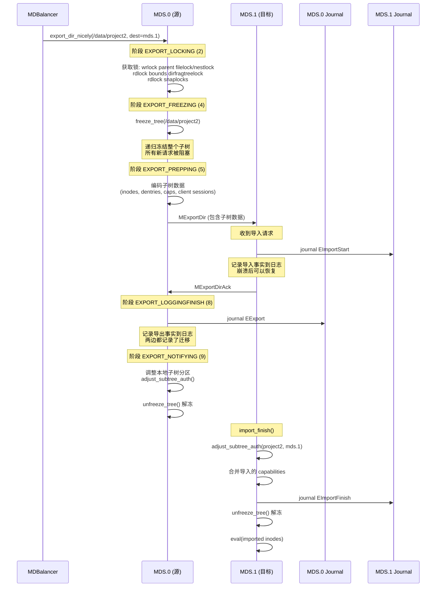
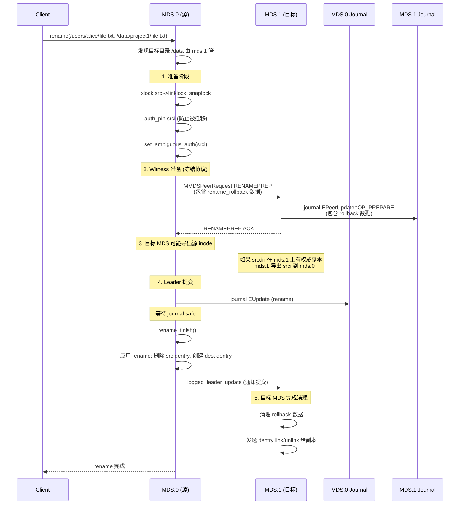
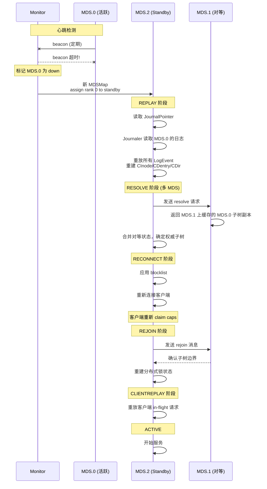
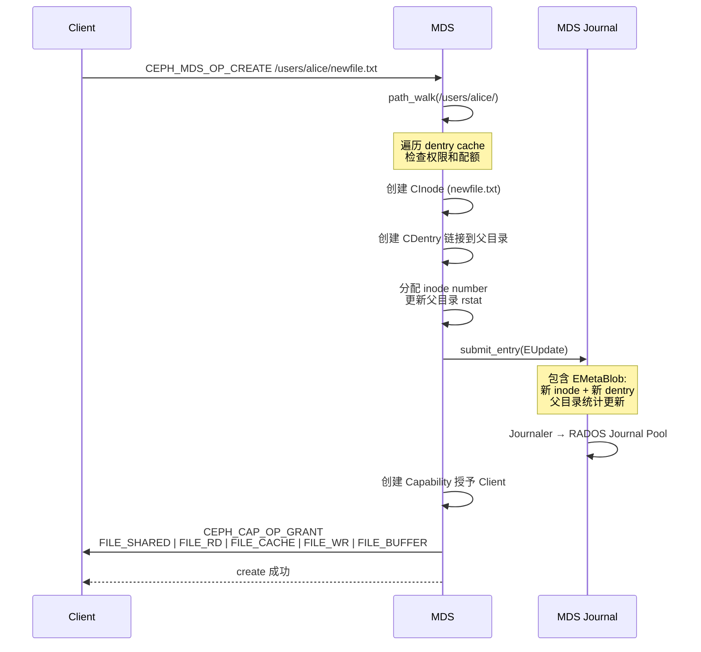
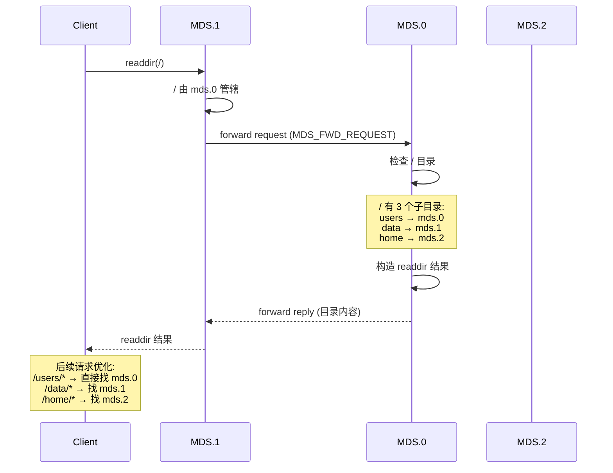

# CephFS MDS 架构：为什么不需要 Paxos

---

## 目录

1. [核心问题：MDS 为什么不需要共识协议](#1-核心问题mds-为什么不需要共识协议)
2. [Monitor vs MDS 的本质区别](#2-monitor-vs-mds-的本质区别)
3. [子树分区机制](#3-子树分区机制)
4. [MDS 分布式锁](#4-mds-分布式锁)
5. [子树迁移协议](#5-子树迁移协议)
6. [跨 MDS Rename](#6-跨-mds-rename)
7. [Capability 跨 MDS 协调](#7-capability-跨-mds-协调)
8. [MDS 故障恢复](#8-mds-故障恢复)
9. [MDS 元数据操作时序图](#9-mds-元数据操作时序图)
10. [关键源码索引](#10-关键源码索引)

---

## 1. 核心问题：MDS 为什么不需要共识协议

### 1.1 一句话回答

**MDS 通过"分治"而非"共识"来保证一致性——每个 MDS 独立管理文件系统的不同子树，天然没有写冲突，所以不需要 Paxos 这种多数派投票协议。**

### 1.2 分治 vs 共识

```
Monitor 集群: 共识模型
  ┌──────────────────────────────────────────┐
  │   所有 Monitor 管理同一份数据              │
  │                                          │
  │   mon.0 ←→ mon.1 ←→ mon.2               │
  │     ↑       ↑       ↑                    │
  │     └───────┴───────┘                    │
  │         同一份数据                        │
  │         需要达成共识                       │
  │         → Paxos 多数派投票                 │
  └──────────────────────────────────────────┘

MDS 集群: 分治模型
  ┌──────────────────────────────────────────┐
  │   每个 MDS 管理不同的子树                  │
  │                                          │
  │   mds.0     mds.1     mds.2              │
  │     ↑         ↑         ↑                │
  │     │         │         │                │
  │   /users    /data     /home             │
  │     │         │         │                │
  │   不同数据   不同数据   不同数据            │
  │   无写冲突   无写冲突   无写冲突            │
  │   → 不需要共识，各自独立                   │
  └──────────────────────────────────────────┘
```

### 1.3 设计哲学

| 维度 | Monitor (共识) | MDS (分治) |
|------|---------------|-----------|
| 数据范围 | 全局唯一（OSDMap/CRUSH Map） | 分区独立（不同子树） |
| 写冲突 | 有（多个节点写同一份数据） | 无（每个节点写不同数据） |
| 一致性协议 | Paxos（多数派投票） | 不需要 |
| 持久化 | Paxos Log (本地 RocksDB) | MDS Journal (RADOS) |
| 故障恢复 | Quorum 协商后继续 | Standby 接管 + Journal 重放 |
| 扩展方式 | 固定 3~5 个节点 | 多 rank 水平扩展 |
| 跨节点协调 | 每次 proposal 都需要 | 仅 rename 等少数操作 |

---

## 2. Monitor vs MDS 的本质区别

### 2.1 Monitor 必须用 Paxos 的原因

```
场景: OSD.5 宕机，三个 Monitor 需要更新 OSDMap

  mon.0: "OSD.5 已宕机，需要标记 down"
  mon.1: "OSD.5 还活着，我刚刚收到 beacon"
  mon.2: "我同意 mon.0 的判断"

  问题: 三个 Monitor 对同一个事实有不同看法
  解决: Paxos → 多数派投票 → 最终只有一个结果生效

  如果没有 Paxos → 可能出现 split-brain:
    mon.0 和 mon.1 各自认为自己的 OSDMap 是对的
    → 客户端收到矛盾的 OSDMap → 数据不一致
```

### 2.2 MDS 不需要 Paxos 的原因

```
场景: 两个客户端分别操作不同目录

  Client A: create /users/alice/file.txt  → mds.0 处理
  Client B: create /data/project1/doc    → mds.1 处理

  mds.0 管理的是 /users 子树
  mds.1 管理的是 /data 子树
  两个操作修改完全不同的元数据 → 天然无冲突 → 不需要协调
```

---

## 3. 子树分区机制

### 3.1 子树 (Subtree) 概念

```
文件系统目录树:

  /                          ← dir_auth = (0, -1) → mds.0 管辖
  ├── users/                 ← dir_auth = (0, -1) → mds.0 管辖
  │   ├── alice/             ← dir_auth = (0, -1) → mds.0 管辖
  │   └── bob/               ← dir_auth = (0, -1) → mds.0 管辖
  ├── data/                  ← dir_auth = (1, -1) → mds.1 管辖
  │   ├── project1/          ← dir_auth = (1, -1) → mds.1 管辖
  │   └── project2/          ← dir_auth = (1, -1) → mds.1 管辖
  └── home/                  ← dir_auth = (2, -1) → mds.2 管辖
      ├── alice/             ← dir_auth = (2, -1) → mds.2 管辖
      └── bob/               ← dir_auth = (2, -1) → mds.2 管辖

  dir_auth = (mds_rank, peer_rank)
    (-1, -1) = CDIR_AUTH_DEFAULT — 非子树根，从父目录继承
    (0, -1)  = mds.0 独占管辖
    (0, 1)   = mds.0 和 mds.1 正在迁移（ambiguous）
```

### 3.2 子树根判定

```cpp
// src/mds/CDir.h:431-433
bool is_subtree_root() const {
    return dir_auth != CDIR_AUTH_DEFAULT;  // dir_auth 不等于默认值即为子树根
}

// src/mds/CDir.h:417-429
bool is_full_dir_auth() const {
    return is_auth() && !is_ambiguous_dir_auth();    // 完全管辖（非迁移中）
}
bool is_full_dir_nonauth() const {
    return !is_auth() && !is_ambiguous_dir_auth();   // 完全不管辖
}
bool is_ambiguous_dir_auth() const {
    return dir_auth.second != CDIR_AUTH_UNKNOWN;     // 迁移中（两个 MDS 都声称管辖）
}
```

### 3.3 子树分区数据结构

```cpp
// src/mds/MDCache.h:1368-1369
// 子树 → 该子树内嵌套的子树列表（bounds）
std::map<CDir*, std::set<CDir*>> subtrees;

// 例: subtrees = {
//   [/]           → {[/users], [/data], [/home]},
//   [/users]      → {},
//   [/data]       → {},
//   [/home]       → {},
// }

// 查找子树根 — 向上遍历直到找到子树根 (MDCache.cc:1345-1355)
CDir* get_subtree_root(CDir *dir) {
    while (true) {
        if (dir->is_subtree_root()) return dir;
        dir = dir->get_inode()->get_parent_dir();
        if (!dir) return 0;
    }
}
```

### 3.4 调整子树管辖权

```cpp
// src/mds/MDCache.cc:981-1045
void adjust_subtree_auth(CDir *dir, mds_authority_t auth) {
    // 1. 如果已是子树根 → 直接更新 dir_auth
    if (dir->is_subtree_root()) {
        dir->dir_auth = auth;
        return;
    }
    // 2. 创建新子树
    subtrees[dir] = {};           // 插入 subtrees map
    dir->dir_auth = auth;         // 设置管辖权
    // 3. 从父子树中声明嵌套的子树
    parent_bounds = subtrees[parent_dir];
    for (auto& bound : parent_bounds) {
        if (bound 是 dir 的后代) subtrees[dir].insert(bound);
    }
    // 4. 将 dir 添加为父子树的 bound
    subtrees[parent_dir].insert(dir);
}
```

---

## 4. MDS 分布式锁

### 4.1 为什么需要分布式锁

虽然 MDS 之间没有 Paxos，但它们共享一些元数据。例如 `/` 目录的 `nlink`（链接数）和 `rstat`（递归统计）需要反映所有子树的变化。

```
  / 目录的统计数据:
    nlink = 子目录数 + 子文件数
    rbytes = 递归总字节数
    rfiles = 递归总文件数

  当 mds.0 在 /users/alice/ 下创建文件:
    → / 的 rfiles 需要增加
    → /users 的 rfiles 也需要增加
    → 但 / 由 mds.0 管，/users 也由 mds.0 管 → 本地更新即可

  当 mds.1 在 /data/project1/ 下创建文件:
    → / 的 rfiles 需要增加
    → 但 / 由 mds.0 管，/data 由 mds.1 管 → 跨 MDS 更新
    → 需要 ScatterLock 协调
```

### 4.2 锁类型

```
每个 CInode 上的锁 (CInode.h:1125-1148):

  SimpleLock authlock;         — IAUTH: 访问权限锁
  SimpleLock linklock;         — ILINK: 链接数锁 (nlink)
  ScatterLock dirfragtreelock; — IDFT: 目录分片树锁
  ScatterLock filelock;        — IFILE: 文件属性锁 (size, mtime, ctime)
  ScatterLock nestlock;        — INEST: 嵌套统计锁 (rstat, rbytes, rfiles)
  SimpleLock xattrlock;        — IXATTR: 扩展属性锁
  SimpleLock snaplock;         — ISNAP: 快照锁
  SimpleLock flocklock;        — IFLOCK: flock 锁
  SimpleLock policylock;       — IPOLICY: 策略锁

关键: filelock 和 nestlock 是 ScatterLock 类型
  → 允许跨 MDS 分散更新统计数据
```

### 4.3 ScatterLock 状态机

```
ScatterLock 状态转换 (locks.h + locks.c):

  LOCK_SYNC (同步)
  │  所有 MDS 的副本看到一致的数据
  │  Auth MDS 持有权威副本
  │
  ├── 需要分散更新 → LOCK_MIX
  │
  ▼
  LOCK_MIX (混合/分散)
  │  Auth MDS 和 Replica MDS 都可以独立更新
  │  每个 MDS 累积本地变更（dirty）
  │  适合目录统计数据频繁变化的场景
  │
  ├── 需要收集汇总 → LOCK_LOCK → LOCK_SYNC
  │
  ▼
  LOCK_LOCK (锁定/收集)
  │  Auth MDS 收集所有 Replica 的 dirty 数据
  │  合并成一致的完整状态
  │
  ▼
  LOCK_SYNC (同步)
     完成收集，数据一致

适用场景:
  nestlock (INEST) — 目录递归统计: 各 MDS 独立更新 rstat → 定期 gather 合并
  dirfragtreelock (IDFT) — 目录分片树: 控制分片委托
  filelock (IFILE) — 文件属性: 同一文件被多个 MDS 缓存时
```

### 4.4 scatter_eval — 锁评估

```cpp
// src/mds/Locker.cc:5307-5359
void scatter_eval(CInode *in, int type) {
    // 1. 冻结中 → 不操作 (迁移进行中)
    if (parent is freezing/frozen) return;
    // 2. 只读文件系统 → 强制 SYNC
    if (read_only_fs) force_sync();
    // 3. 需要 scatter 且无读锁 → 转 MIX
    if (scatter_wanted && !rdlocks) scatter_mix();
    // 4. INEST 特殊: 如果有副本，保持 MIX (允许分散更新)
    // 5. 非子树根 → 保持 SYNC (没有子 MDS 需要分散)
    if (!is_subtree_root) keep_sync();
}
```

### 4.5 file_eval — 文件锁评估

```cpp
// src/mds/Locker.cc:5681-5785
void file_eval(CInode *in) {
    // LOCK_EXCL → 降级?
    if (state == LOCK_EXCL) {
        if (loner 不再需要写 || 另一个客户端要写)
            goto MIX or SYNC;
    }
    // → LOCK_EXCL?
    if (存在 loner 客户端 && 无读锁) goto EXCL;
    // → LOCK_MIX?
    if (scatter_wanted || (!loner && WR wanted)) goto MIX;
    // → LOCK_SYNC?
    if (!WR wanted && !wrlocks) goto SYNC;
}
```

---

## 5. 子树迁移协议

### 5.1 迁移触发

```
MDBalancer (src/mds/MDBalancer.cc):

  1. 每个 MDS 定期通过心跳交换负载统计 (MHeartbeat → Monitor)
  2. prep_rebalance() 计算目标负载:
     target_load = total_load / num_mdss
  3. 分类:
     exporter — 负载 > target
     importer — 负载 < target
  4. try_rebalance() 选择要迁移的子树:
     ├── 优先归还之前导入的子树
     ├── 然后选择负载最低的子树
     └── find_exports() 在大子树内搜索合适的子目录

  例: mds.0 负载高, mds.1 负载低
  → MDBalancer 将 /data/project2 从 mds.0 迁移到 mds.1
```

### 5.2 迁移流程



### 5.3 三阶段日志保证

```
为什么需要三阶段日志?

  场景1: M0 在发送 MExportDir 之前崩溃
    → M0 Journal 没有 EExport
    → 重启后 /data/project2 仍属于 M0 → 正确

  场景2: M0 在发送 MExportDir 之后, M1 在 journal EImportStart 之前崩溃
    → M1 Journal 没有 EImportStart
    → M1 重启后不知道这次迁移 → M0 超时重试 → 正确

  场景3: M1 journal 了 EImportStart, M0 在 journal EExport 之前崩溃
    → M1 Journal 有 EImportStart → M1 认为自己已接管
    → M0 重启后没有 EExport → M0 仍认为拥有子树
    → RESOLVE 阶段协商: M1 的 EImportStart 权威 → M0 放弃 → 正确

  场景4: 两边都 journal 了, M1 在 EImportFinish 之前崩溃
    → M1 重启后 EImportStart 在 journal → 继续 import_finish() → 正确

  三阶段 = 两边日志互补, 任何崩溃场景都能恢复到一致状态
  不需要 Paxos 投票, 因为迁移是单向的 (源 → 目标)
```

---

## 6. 跨 MDS Rename

### 6.1 为什么 rename 需要特殊处理

```
rename /users/alice/file.txt → /data/project1/file.txt

  /users 由 mds.0 管
  /data 由 mds.1 管

  操作涉及两个 MDS 的元数据:
  ├── mds.0: 删除 /users/alice/file.txt 的 dentry
  └── mds.1: 创建 /data/project1/file.txt 的 dentry

  不能简单地各做各的 → 需要原子性保证
  但仍然不是 Paxos → 使用冻结/解冻协议
```

### 6.2 跨 MDS Rename 流程



### 6.3 Rename 回滚

```
如果 M0 在 journal 之后、通知 M1 之前崩溃:

  M1 重放 Journal:
    发现 EPeerUpdate::OP_PREPARE 但没有收到 logged_leader_update
    → 调用 do_rename_rollback()
    → 从 rollback 数据恢复 dentry 到原始状态
    → 正确!

关键: rollback 数据在 M1 的 Journal 中，不依赖 M0 的存活
  → 不需要 Paxos 投票来决定是否提交
  → Leader 的 Journal 是唯一的真相来源
```

---

## 7. Capability 跨 MDS 协调

### 7.1 Cap 导出 (子树迁移时)

```
迁移 /data/project2 从 mds.0 到 mds.1:

  mds.0 上的状态:
    inode=100 (project2/) → Client A 持有 FILE_RD|FILE_CACHE cap

  步骤:
    1. mds.0 export_dir() → 编码 inode caps → 发送给 mds.1
    2. mds.0 export_caps() → 发送 CEPH_CAP_OP_EXPORT 给 Client A
       "你的 cap 现在由 mds.1 管理 (peer cap_id=X, mseq=Y)"
    3. Client A 收到 EXPORT → 更新本地 cap 的 peer 信息
    4. 后续请求直接发往 mds.1
```

### 7.2 Cap 导入

```
mds.1 收到导入:

  1. handle_export_caps() → 解码 cap 信息
  2. prepare_force_open_sessions() → 打开 client session
  3. journal ESessions → 持久化 session 信息
  4. logged_import_caps() → 创建 Capability 对象
  5. do_cap_import() → 发送 CEPH_CAP_OP_IMPORT 给 Client A
     "你现在由 mds.1 管理 (cap_id=Z, pending=...)"
  6. Client A 收到 IMPORT → 确认新 authority = mds.1
```

### 7.3 Client 如何发现正确的 MDS

```
路径解析时的转发 (MDCache.cc:8715-8968):

  Client → mds.1: lookup(/users/alice/file.txt)
  mds.1: 遍历路径
    / → dir_auth = (0, -1) → 非我管辖
    → request_forward(client, mds.0)  // 转发到 mds.0

  mds.0: 处理请求 → 回复 Client
  Client: 学习到 /users 由 mds.0 管 → 后续直接找 mds.0

  或者通过 cap IMPORT/EXPORT 消息:
  Client 收到 CEPH_CAP_OP_IMPORT → 知道新 authority = mds.1
  → 后续该 inode 的请求直接发往 mds.1
```

---

## 8. MDS 故障恢复

### 8.1 MDS 状态机

```
MDS 状态转换 (MDSRank.cc:2285-2452):

  STANDBY → REPLAY → RESOLVE → RECONNECT → REJOIN → CLIENTREPLAY → ACTIVE
                                                                   → STOPPING

  单 MDS 集群:
    REPLAY → 跳过 RESOLVE → RECONNECT → REJOIN → ACTIVE

  多 MDS 集群:
    REPLAY → RESOLVE → RECONNECT → REJOIN → CLIENTREPLAY → ACTIVE
```

### 8.2 故障检测与 Standby 接管



### 8.3 各阶段详解

```
REPLAY (日志重放):
  ├── 读取 JournalPointer → 定位日志文件
  ├── 循环读取 LogEvent → decode_event() → replay(mds)
  ├── ESubtreeMap: 重建子树分区图
  ├── EUpdate: 重建 inode/dentry
  ├── ESession: 重建会话
  └── 单 MDS 可跳过后续阶段

RESOLVE (对等协商):
  ├── calc_recovery_set() — 确定需要协商的对等 MDS
  ├── 向每个对等 MDS 发送 resolve 请求
  ├── 对等 MDS 返回它缓存的子树副本状态
  └── 合并结果，确定每个子树的权威归属

RECONNECT (客户端重连):
  ├── 应用 OSD blocklist (防止旧 MDS 残留请求)
  ├── server->reconnect_clients() — 通知客户端重连
  └── 客户端重新 claim caps (CEPH_CAP_OP_RENEW)

REJOIN (重新加入):
  ├── 向所有对等 MDS 发送 rejoin
  ├── 对等 MDS 确认子树边界
  ├── 重建分布式锁 (filelock/nestlock 的 SYNC/MIX 状态)
  └── 确认 ScatterLock 的 dirty 状态

CLIENTREPLAY (客户端请求重放):
  ├── 重放 MDS 崩溃时客户端 in-flight 的请求
  └── 处理完毕后进入 ACTIVE
```

### 8.4 Standby-Replay 模式

```
standby-replay MDS (MDSRank.h:222):

  ├── 持续读取 active MDS 的 Journal
  ├── 定时重放 (mds_replay_interval)
  ├── 保持内存状态与 active MDS 同步
  └── 当 active MDS 故障时:
      → 跳过大部分 REPLAY (已经重放过了)
      → 直接 RESOLVE → RECONNECT → ACTIVE
      → 故障恢复时间大幅缩短
```

---

## 9. MDS 元数据操作时序图

### 9.1 创建文件 (单 MDS)



### 9.2 读取目录 (跨 MDS 转发)



### 9.3 子树迁移

```
(参见第 5 节的 Mermaid 时序图)
```

### 9.4 跨 MDS Rename

```
(参见第 6 节的 Mermaid 时序图)
```

### 9.5 ScatterLock 收集 (nestlock gather)

```mermaid
sequenceDiagram
    participant M0 as MDS.0 (Auth)
    participant M1 as MDS.1 (Replica)
    participant M2 as MDS.2 (Replica)

    Note over M0: / 的 nestlock 当前在 MIX 状态<br/>各 MDS 独立更新 rstat

    Note over M1: mds.1 在 /data 下创建了文件<br/>本地 rstat.dirty = true

    Note over M2: mds.2 在 /home 下删除了文件<br/>本地 rstat.dirty = true

    Note over M0: 触发 gather (scatter_nudge 或 trim 需要)

    M0->>M0: MIX → LOCK → SYNC
    M0->>M1: LOCK_AC_LOCK (请求收集)
    M0->>M2: LOCK_AC_LOCK (请求收集)

    M1->>M0: 发送本地 dirty rstat 数据
    M2->>M0: 发送本地 dirty rstat 数据

    M0->>M0: 合并所有 rstat<br/>/ 的统计数据现在一致

    M0->>M0: 根据需要决定:
    M0->>M0: SYNC (数据已同步, 无需分散)
    或者
    M0->>M1: LOCK_AC_MIX (重新分散)
    M0->>M2: LOCK_AC_MIX (重新分散)
```

---

## 10. 关键源码索引

| 模块 | 文件 | 关键内容 |
|------|------|---------|
| **子树根判定** | `src/mds/CDir.h:431-433` | `is_subtree_root()` |
| **管辖权状态** | `src/mds/CDir.h:417-429` | `is_full_dir_auth()`, `is_ambiguous_dir_auth()` |
| **冻结机制** | `src/mds/CDir.h:545-604` | `freeze_tree()`, `unfreeze_tree()` |
| **子树分区 map** | `src/mds/MDCache.h:1368-1369` | `subtrees` 数据结构 |
| **查找子树根** | `src/mds/MDCache.cc:1345-1355` | `get_subtree_root()` |
| **调整管辖权** | `src/mds/MDCache.cc:981-1045` | `adjust_subtree_auth()` |
| **CInode 锁** | `src/mds/CInode.h:1125-1148` | `filelock`, `nestlock`, `dirfragtreelock` |
| **锁状态机定义** | `src/mds/locks.h:45-101` | SYNC/MIX/LOCK/EXCL 等状态 |
| **锁类型映射** | `src/mds/SimpleLock.h:46-77` | 锁类型 → 状态机映射 |
| **ScatterLock** | `src/mds/ScatterLock.h:94-137` | `is_dirty()`, `mark_dirty()` |
| **scatter 评估** | `src/mds/Locker.cc:5307-5359` | `scatter_eval()` |
| **file 评估** | `src/mds/Locker.cc:5681-5785` | `file_eval()` |
| **scatter 转换** | `src/mds/Locker.cc:5789-5880` | `scatter_mix()` |
| **scatter nudge** | `src/mds/Locker.cc:5388-5499` | `scatter_nudge()` |
| **迁移阶段** | `src/mds/Migrator.h:56-68` | EXPORT_LOCKING ~ EXPORT_NOTIFYING |
| **迁移入口** | `src/mds/Migrator.cc:920` | `export_dir()` |
| **迁移排队** | `src/mds/Migrator.cc:819-826` | `export_dir_nicely()` |
| **迁移完成** | `src/mds/Migrator.cc:3262-3369` | `import_finish()` |
| **负载均衡** | `src/mds/MDBalancer.cc:754` | `prep_rebalance()` |
| **均衡执行** | `src/mds/MDBalancer.cc:976` | `try_rebalance()` |
| **搜索可导出子树** | `src/mds/MDBalancer.cc:1146` | `find_exports()` |
| **ESubtreeMap** | `src/mds/events/ESubtreeMap.h` | 段边界子树分区记录 |
| **EExport** | `src/mds/events/EExport.h` | 导出日志事件 |
| **EImportStart** | `src/mds/events/EImportStart.h` | 导入开始日志事件 |
| **EImportFinish** | `src/mds/events/EImportFinish.h` | 导入完成日志事件 |
| **Cap 导出** | `src/mds/Migrator.cc:3823-3876` | `export_caps()` |
| **Cap 导入** | `src/mds/Migrator.cc:3907` | `handle_export_caps()` |
| **Cap 导入完成** | `src/mds/Migrator.cc:3943` | `logged_import_caps()` |
| **Cap import 通知** | `src/mds/MDCache.cc:6073-6092` | `do_cap_import()` |
| **请求转发** | `src/mds/MDCache.cc:10071-10093` | `request_forward()` |
| **Rename 处理** | `src/mds/Server.cc:9448` | `handle_client_rename()` |
| **Rename Witness** | `src/mds/Server.cc:9836-9878` | `_rename_prepare_witness()` |
| **Rename Rollback** | `src/mds/Server.cc:11483` | `do_rename_rollback()` |
| **MDS 状态机** | `src/mds/MDSRank.cc:2285-2452` | `handle_mds_map()` |
| **故障处理** | `src/mds/MDSRank.cc:2364-2371` | `handle_mds_failure()` |
| **RESOLVE 阶段** | `src/mds/MDSRank.cc:1972` | `resolve_start()` |
| **RECONNECT 阶段** | `src/mds/MDSRank.cc:2003` | `reconnect_start()` |
| **REJOIN 阶段** | `src/mds/MDSRank.cc:2038` | `rejoin_start()` |
| **Standby-Replay** | `src/mds/MDSRank.h:222` | `is_standby_replay()` |
