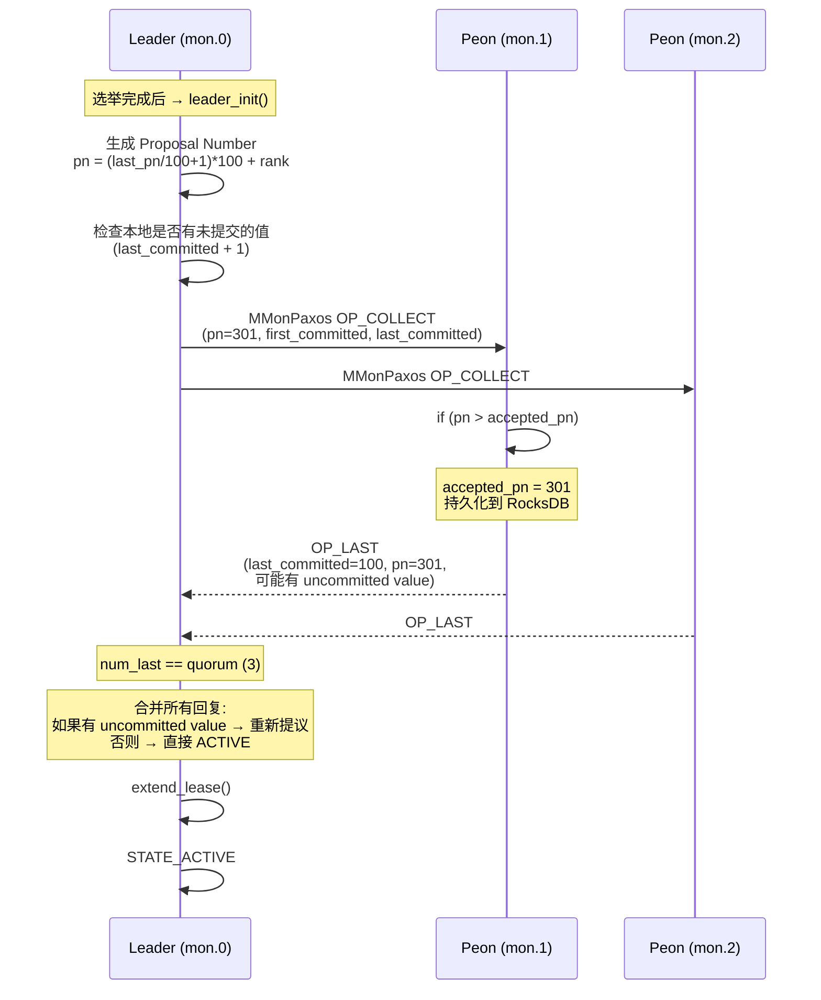
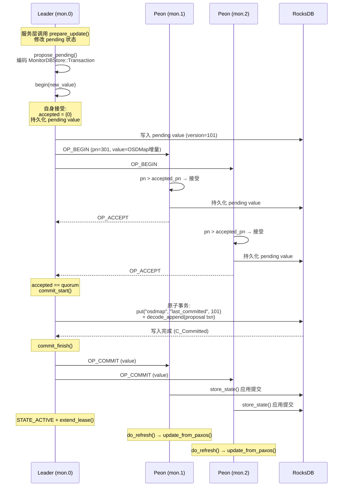
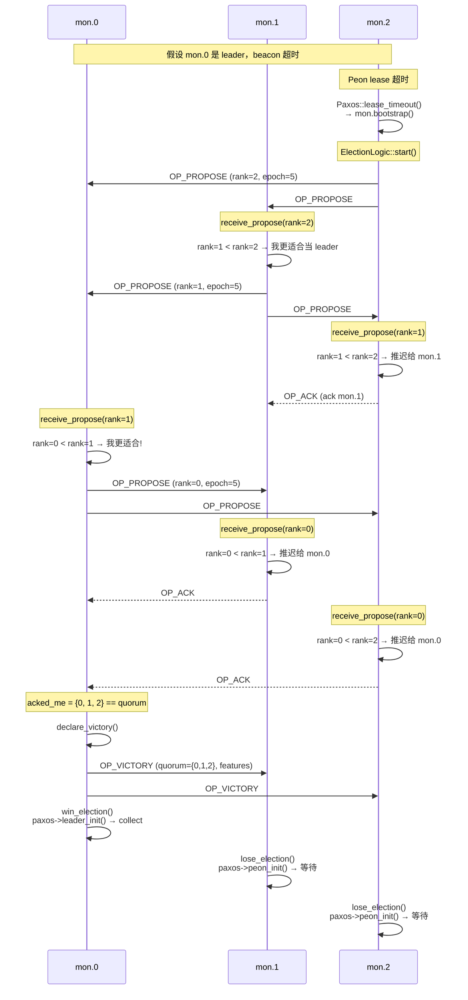
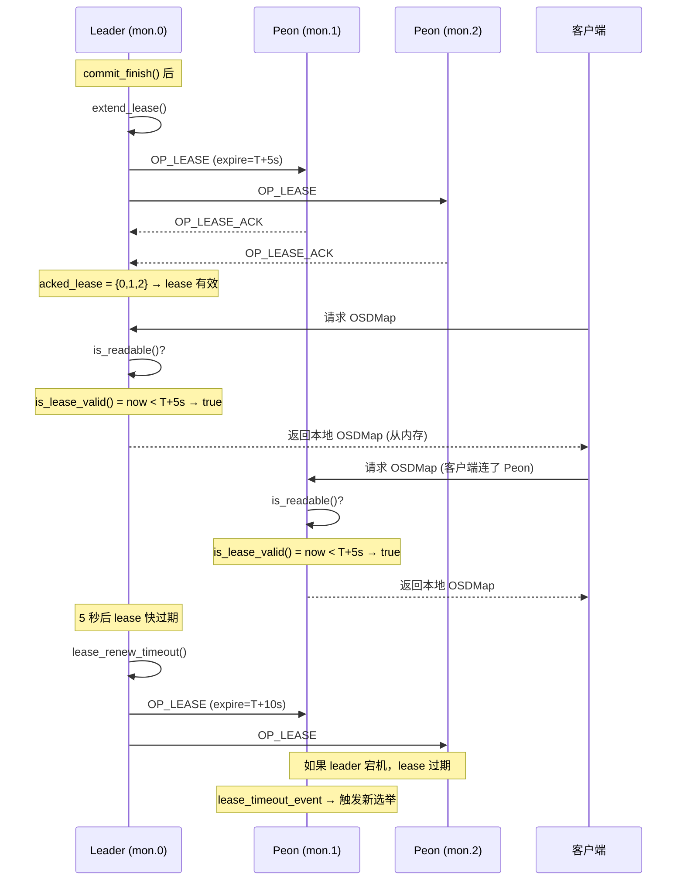
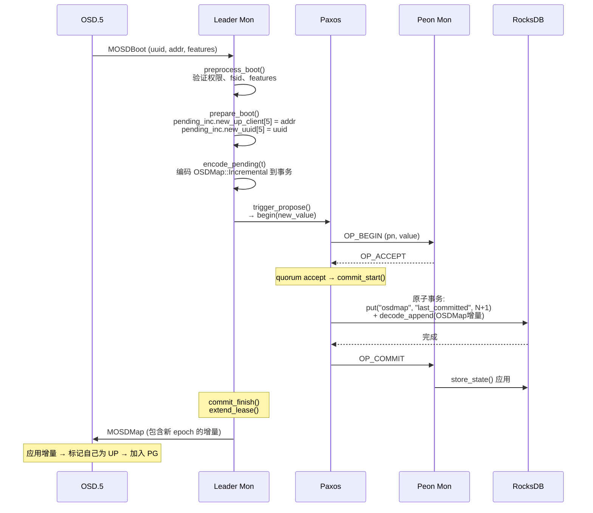
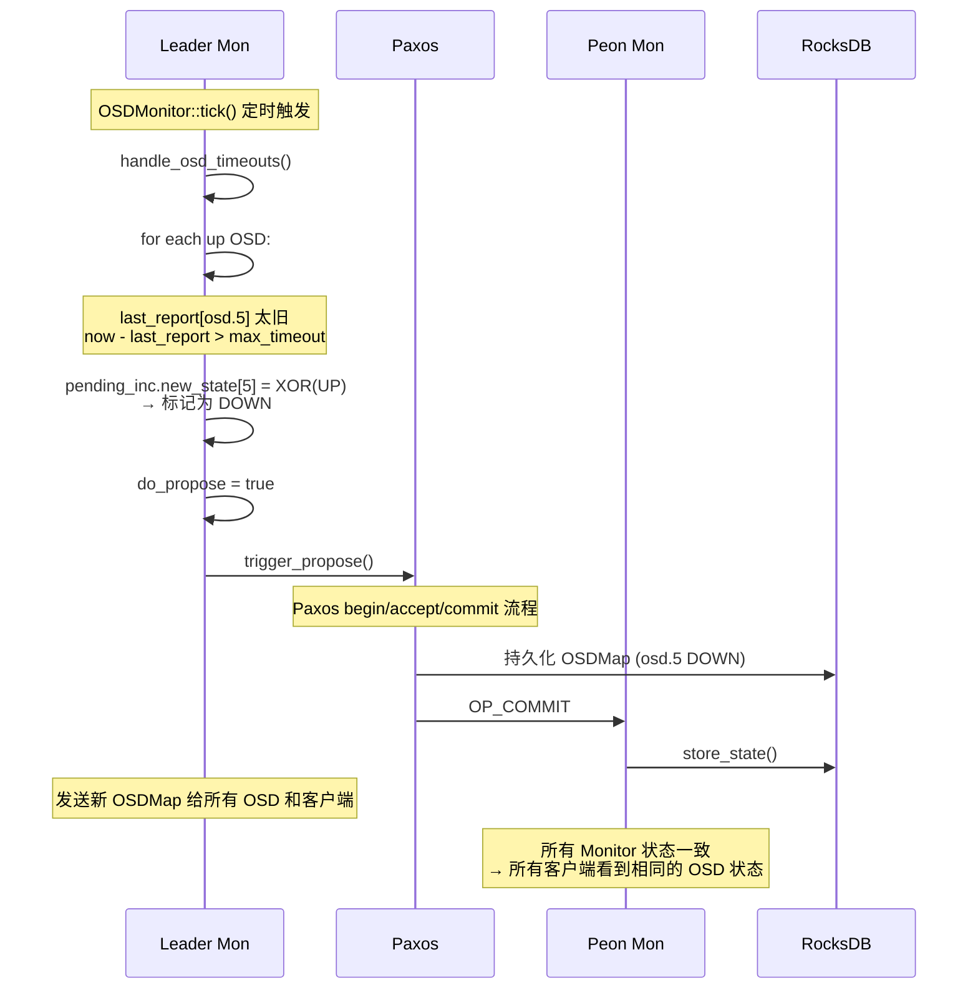
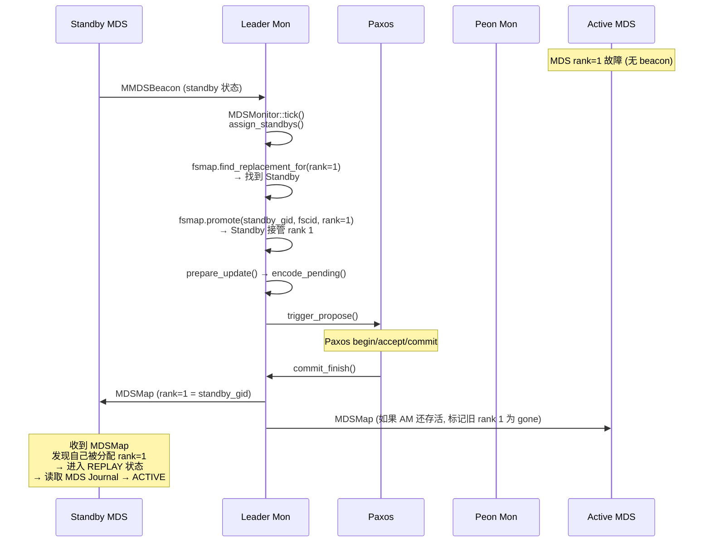
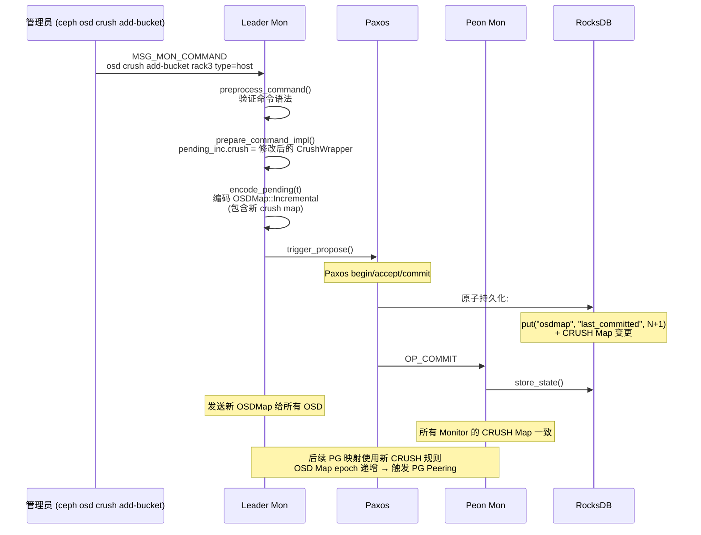
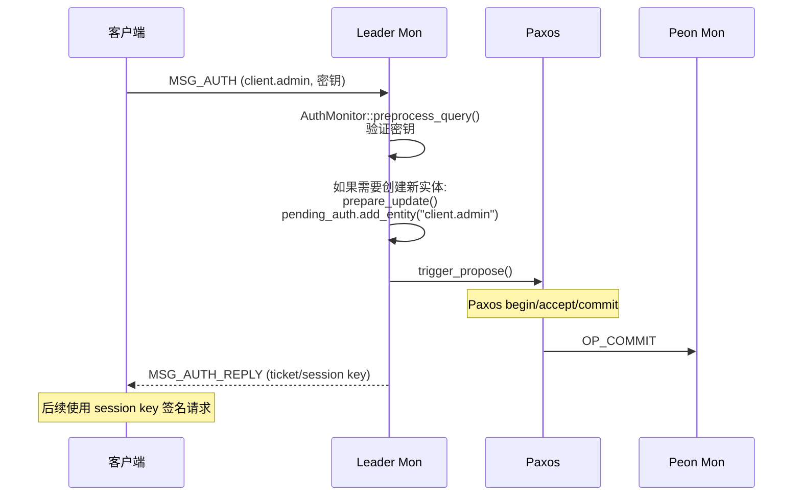
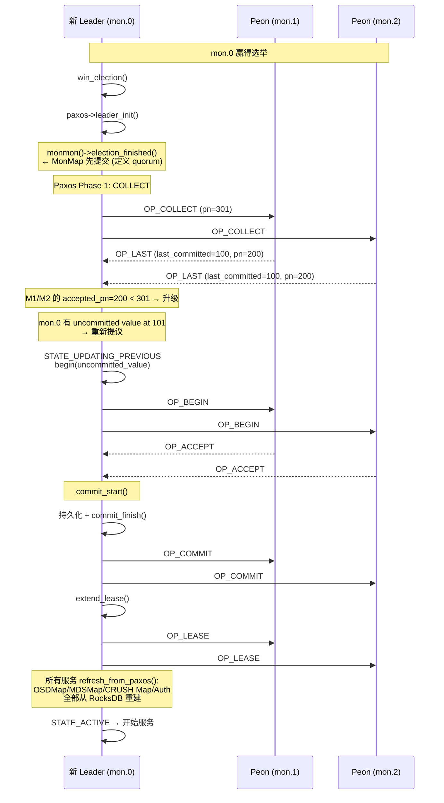

# CephFS Monitor Paxos 机制分析

---

## 目录

1. [为什么 Monitor 需要 Paxos](#1-为什么-monitor-需要-paxos)
2. [Paxos 协议实现](#2-paxos-协议实现)
3. [Leader 选举](#3-leader-选举)
4. [Lease 读优化](#4-lease-读优化)
5. [Paxos 服务与元数据管理](#5-paxos-服务与元数据管理)
6. [元数据操作时序图](#6-元数据操作时序图)
7. [数据存储结构](#7-数据存储结构)
8. [关键源码索引](#8-关键源码索引)

---

## 1. 为什么 Monitor 需要 Paxos

### 1.1 核心原因

```
Monitor 管理的是集群的"全局真理"(Single Source of Truth):

  ┌──────────────────────────────────────────────────┐
  │  mon.0  mon.1  mon.2                              │
  │    │      │      │                                │
  │    └──────┼──────┘                                │
  │           │                                        │
  │    同一份 OSDMap                                   │
  │    同一份 CRUSH Map                               │
  │    同一份 MDSMap                                  │
  │    同一份 MonMap                                  │
  │           │                                        │
  │    如果不一致:                                     │
  │    ├── OSD 不知道该连接谁                          │
  │    ├── 数据放置位置矛盾                            │
  │    └── 客户端路由错误 → 数据不一致                 │
  │                                                    │
  │    → 必须用共识协议保证所有 Monitor 状态一致         │
  └──────────────────────────────────────────────────┘
```

### 1.2 Monitor 管理的元数据

| 元数据 | 内容 | 变更频率 | 影响范围 |
|--------|------|---------|---------|
| **MonMap** | Monitor 成员列表、选举策略 | 极低（扩缩容时） | Monitor 集群自身 |
| **OSDMap** | OSD 状态 (up/down)、权重、地址 | 高（每个 OSD 心跳） | 所有 OSD 和客户端 |
| **MDSMap** | MDS rank 分配、standby 状态 | 低（MDS 故障/扩容时） | 所有 MDS 和客户端 |
| **CRUSH Map** | 数据放置规则、设备拓扑 | 低（运维操作时） | 所有 OSD |
| **Auth** | 客户端/OSD 认证密钥 | 低（创建用户时） | 客户端/OSD |
| **MgrMap** | Manager 守护进程状态 | 低 | Manager 守护进程 |
| **Config** | 集群配置项 | 低（配置变更时） | 全集群 |

### 1.3 不用 Paxos 会怎样

```
场景: 没有 Paxos，各 Monitor 独立处理 OSDMap 更新

  T1: OSD.5 发送 beacon 给 mon.0 → mon.0 标记 OSD.5 为 up
  T2: OSD.5 心跳超时 → mon.1 标记 OSD.5 为 down
  T3: 客户端问 mon.0 → "OSD.5 is up"
  T4: 客户端问 mon.1 → "OSD.5 is down"
  T5: 客户端困惑 → 可能向已宕机的 OSD 发请求 → 数据丢失

  Paxos 保证: 所有 Monitor 看到完全相同的 OSDMap
  → 客户端无论问哪个 Monitor，得到的答案一致
```

---

## 2. Paxos 协议实现

### 2.1 状态机

```
Paxos 状态转换 (Paxos.h:207-237):

  ┌─────────────┐
  │ RECOVERING  │ ← Leader: collect 阶段 (Phase 1)
  │             │   Peon: 等待 leader collect
  └──────┬──────┘
         │ Leader: 收集到 quorum 回复
         │ Peon: 收到 leader BEGIN
         ▼
  ┌─────────────┐     提议新值     ┌─────────────┐
  │   ACTIVE    │ ──────────────→  │  UPDATING   │ ← Phase 2: begin/accept
  │   (空闲)    │                  │             │
  └──────┬──────┘                  └──────┬──────┘
         │                                │ quorum 全部 accept
         │                                ▼
         │                         ┌─────────────┐
         │    commit 完成          │   WRITING   │ ← 持久化到 RocksDB
         │ ←────────────────────── └──────┬──────┘
         │                                │
         ▼                                ▼
  ┌─────────────┐    刷新状态     ┌─────────────┐
  │   REFRESH   │ ──────────→    │   ACTIVE    │
  │             │                │             │
  └─────────────┘                └─────────────┘
```

### 2.2 Phase 1: Collect (恢复阶段)



### 2.3 Phase 2: Begin / Accept / Commit (提议阶段)



### 2.4 关键设计：Proposal 值就是事务

```
Paxos Proposal 的 value 不是简单的数据，而是一个编码后的 MonitorDBStore::Transaction:

  commit_start() (Paxos.cc:854):
    t->put("osdmap", "last_committed", 101);  // 元操作: 递增版本号
    decode_append_transaction(t, new_value);    // 解码并合并 proposal 中的事务

  proposal value 包含:
    ├── OSDMap::Incremental (OSD 状态变更)
    ├── 或 FSMap 变更 (MDS rank 分配)
    ├── 或 CrushWrapper 变更 (CRUSH 规则)
    └── 或 Auth 变更 (密钥更新)

  事务是原子的:
    所有操作要么全部应用，要么全部不应用
    → 保证元数据变更的一致性
```

---

## 3. Leader 选举

### 3.1 选举策略

```
ElectionLogic (ElectionLogic.h:194-199):

  CLASSIC (1):     rank 最低的 Monitor 胜出
  DISALLOW (2):    排除指定 rank 后，rank 最低的胜出
  CONNECTIVITY (3): 网络连通性最好的胜出，相同则按 rank

  策略存储在 MonMap.strategy 中，集群创建时可配置
```

### 3.2 选举流程



### 3.3 选举超时触发

```
触发新一轮选举的条件:

  1. Peon lease 超时 (Paxos.cc:1222)
     → lease_timeout_event 到期
     → mon.bootstrap() → elector.start()

  2. Leader lease ack 超时 (Paxos.cc:1198)
     → 不是所有 peon 都 ack 了 lease
     → 可能自己已经不是合法 leader
     → mon.bootstrap()

  3. Collect 超时 (Paxos.cc:609)
     → Phase 1 collect 没收齐回复
     → mon.bootstrap()

  4. Accept 超时 (Paxos.cc:821)
     → Phase 2 accept 没收齐
     → mon.bootstrap()
```

---

## 4. Lease 读优化

### 4.1 为什么需要 Lease

```
没有 Lease:
  读取 OSDMap → 每次都需要走 Paxos 确认
  → 即使数据没变也要 quorum 通信
  → Monitor 是热点 (所有 OSD 和客户端都来读)

有 Lease:
  读取 OSDMap → 只要 lease 有效 → 直接从本地 RocksDB 读取
  → 零网络开销
  → 大幅降低 Monitor 负载
```

### 4.2 Lease 工作原理



### 4.3 读/写判定

```
is_readable() (Paxos.cc:1488):
  requested_version <= last_committed
  && (is_leader || is_peon)
  && is_active || is_updating || is_writing
  && last_committed > 0
  && is_lease_valid()

is_writeable() (Paxos.cc:1529):
  is_leader()
  && is_active()
  && is_lease_valid()
```

---

## 5. Paxos 服务与元数据管理

### 5.1 服务架构

```
所有 Paxos 服务共享一个 Paxos 实例:

  ┌─────────────────────────────────────────────────┐
  │                  Monitor 进程                     │
  │                                                   │
  │  ┌──────────────┐                                │
  │  │   Paxos      │ ← 单实例，7 个状态              │
  │  │  (共识引擎)   │                                │
  │  └──────┬───────┘                                │
  │         │                                         │
  │  ┌──────┼──────┬──────┬──────┬──────┐            │
  │  │      │      │      │      │      │            │
  │  ▼      ▼      ▼      ▼      ▼      ▼            │
  │ OSD   MDS  MonMap Auth   Mgr  Config            │
  │ Mon   Mon   Mon   Mon   Mon   Mon               │
  │                    Monitor                      │
  │                                                   │
  │  每个服务:                                        │
  │  ├── preprocess_query() — 只读查询                │
  │  ├── prepare_update()   — 修改 pending 状态      │
  │  ├── encode_pending()   — 编码为 Paxos 事务      │
  │  └── update_from_paxos() — 提交后刷新内存        │
  └─────────────────────────────────────────────────┘
```

### 5.2 服务注册

```cpp
// Monitor.cc:293-303
paxos_service[PAXOS_MDSMAP].reset(new MDSMonitor(*this, *paxos, "mdsmap"));
paxos_service[PAXOS_MONMAP].reset(new MonmapMonitor(*this, *paxos, "monmap"));
paxos_service[PAXOS_OSDMAP].reset(new OSDMonitor(cct, *this, *paxos, "osdmap"));
paxos_service[PAXOS_AUTH].reset(new AuthMonitor(*this, *paxos, "auth"));
paxos_service[PAXOS_MGR].reset(new MgrMonitor(*this, *paxos, "mgr"));
paxos_service[PAXOS_CONFIG].reset(new ConfigMonitor(*this, *paxos, "config"));
paxos_service[PAXOS_HEALTH].reset(new HealthMonitor(*this, *paxos, "health"));
paxos_service[PAXOS_KV].reset(new KVMonitor(*this, *paxos, "kv"));
```

### 5.3 请求分发流程

```
PaxosService::dispatch() (PaxosService.cc:47-151):

  1. 检查 is_readable() → 不满足则排队等待
  2. 调用 preprocess_query() → 如果是只读查询，直接返回
  3. 如果不是 leader → 转发到 leader
  4. 检查 is_writeable() → 不满足则排队等待
  5. 调用 prepare_update() → 修改 pending 状态
  6. should_propose() → propose_pending()
     → encode_pending() → 编码事务
     → paxos.trigger_propose() → 走 Paxos 流程
```

---

## 6. 元数据操作时序图

### 6.1 OSD Boot (OSD 上线)



### 6.2 OSD Mark Down (心跳超时)



### 6.3 MDS Rank 分配 (Standby 接管)



### 6.4 CRUSH Map 更新



### 6.5 客户端/OSD 认证 (Auth)



### 6.6 Monitor Leader 选举后恢复



---

## 7. 数据存储结构

### 7.1 RocksDB 存储布局

```
Monitor 数据目录 (如 /var/lib/ceph/mon/mon.0/store.db/):

  ┌──────────────────────────────────────────────────────────┐
  │  Paxos 数据 (每个服务一个命名空间)                         │
  │                                                          │
  │  osdmap/first_committed  → "1"                           │
  │  osdmap/last_committed   → "542"                         │
  │  osdmap/last_pn          → "30100"                       │
  │  osdmap/accepted_pn      → "30100"                       │
  │  osdmap/1                → encode(OSDMap增量 epoch=1)    │
  │  osdmap/2                → encode(OSDMap增量 epoch=2)    │
  │  ...                                                    │
  │  osdmap/542              → encode(OSDMap增量 epoch=542)  │
  │  osdmap/full_latest      → "500" (最新全量快照版本)       │
  │  osdmap/full_500         → encode(完整 OSDMap epoch=500) │
  │                                                          │
  │  mdsmap/first_committed  → "1"                           │
  │  mdsmap/last_committed   → "23"                          │
  │  mdsmap/1~23             → encode(FSMap增量)             │
  │                                                          │
  │  monmap/first_committed  → "1"                           │
  │  monmap/last_committed   → "8"                           │
  │  monmap/1~8              → encode(MonMap增量)            │
  │                                                          │
  │  auth/first_committed    → "1"                           │
  │  auth/last_committed     → "15"                          │
  │  auth/1~15               → encode(Auth 增量)             │
  │                                                          │
  │  ┌────────────────────────────────────────────────┐      │
  │  │  全量快照 vs 增量                                │      │
  │  │                                                │      │
  │  │  增量: 每个版本存储变更部分 (小, 快)            │      │
  │  │  全量: 每 N 个版本存储一次完整快照 (大, 慢)     │      │
  │  │                                                │      │
  │  │  重建时: 先读最新全量 → 应用后续增量 → 当前状态 │      │
  │  └────────────────────────────────────────────────┘      │
  │                                                          │
  │  其他前缀:                                               │
  │  osd_pg_creating/...     → 创建中的 PG 列表             │
  │  osd_metadata/...        → OSD 元数据 (class, etc.)     │
  │  mds_metadata/...        → MDS 元数据                    │
  │  mds_health/...          → MDS 健康状态                  │
  └──────────────────────────────────────────────────────────┘
```

### 7.2 各服务的存储前缀

| 服务 | Paxos 前缀 | 额外前缀 |
|------|-----------|---------|
| OSDMonitor | `"osdmap"` | `"osd_pg_creating"`, `"osd_metadata"`, `"osd_snap"` |
| MDSMonitor | `"mdsmap"` | `"mds_metadata"`, `"mds_health"` |
| MonmapMonitor | `"monmap"` | — |
| AuthMonitor | `"auth"` | — |
| MgrMonitor | `"mgr"` | — |
| ConfigMonitor | `"config"` | — |
| HealthMonitor | `"health"` | — |
| LogMonitor | `"logm"` | — |

### 7.3 增量 vs 全量

```
OSDMonitor::update_from_paxos():

  1. 读取 full_latest → 找到最新全量快照版本
  2. 读取 full_500 → 解码为完整 OSDMap (epoch=500)
  3. 循环应用增量:
     for v = 501 to last_committed (542):
         读取 osdmap/v → OSDMap::Incremental
         应用到 OSDMap → epoch++
  4. 内存中得到 epoch=542 的完整 OSDMap

  全量快照频率: paxos_service_trim_interval 触发 trim 时
  优点: 增量小、写入快; 全量用于加速重建
```

---

## 8. 关键源码索引

| 模块 | 文件 | 关键内容 |
|------|------|---------|
| **Paxos 状态机** | `src/mon/Paxos.h:207-237` | 7 个状态定义 |
| **Paxos 数据成员** | `src/mon/Paxos.h:330-601` | Leader/Peon 共享字段 |
| **Paxos 初始化** | `src/mon/Paxos.cc:85-99` | `init()` 从 RocksDB 加载 |
| **Collect (Phase 1)** | `src/mon/Paxos.cc:161-226` | `collect()` Leader 发起 |
| **处理 Collect** | `src/mon/Paxos.cc:230-331` | `handle_collect()` Peon 响应 |
| **处理 Last** | `src/mon/Paxos.cc:474-607` | `handle_last()` Leader 汇总 |
| **Begin (Phase 2)** | `src/mon/Paxos.cc:620-716` | `begin()` Leader 提议 |
| **处理 Begin** | `src/mon/Paxos.cc:719-776` | `handle_begin()` Peon 接受 |
| **处理 Accept** | `src/mon/Paxos.cc:779-819` | `handle_accept()` Leader 收集 |
| **Commit Start** | `src/mon/Paxos.cc:854-895` | `commit_start()` 原子提交 |
| **Commit Finish** | `src/mon/Paxos.cc:897-958` | `commit_finish()` 发送 OP_COMMIT |
| **处理 Commit** | `src/mon/Paxos.cc:961-979` | `handle_commit()` Peon 应用 |
| **Proposal Number** | `src/mon/Paxos.cc:1271-1302` | `get_new_proposal_number()` |
| **Paxos 裁剪** | `src/mon/Paxos.cc:1241-1266` | `trim()` |
| **Lease 扩展** | `src/mon/Paxos.cc:981-1030` | `extend_lease()` |
| **处理 Lease** | `src/mon/Paxos.cc:1109-1157` | `handle_lease()` Peon |
| **读判定** | `src/mon/Paxos.cc:1488-1525` | `is_readable()` |
| **写判定** | `src/mon/Paxos.cc:1529-1535` | `is_writeable()` |
| **Leader Init** | `src/mon/Paxos.cc:1355-1376` | `leader_init()` |
| **Peon Init** | `src/mon/Paxos.cc:1378-1398` | `peon_init()` |
| **选举策略** | `src/mon/ElectionLogic.h:194-199` | CLASSIC/DISALLOW/CONNECTIVITY |
| **选举开始** | `src/mon/ElectionLogic.cc:138-166` | `start()` |
| **选举提议** | `src/mon/ElectionLogic.cc:245-266` | `receive_propose()` |
| **选举策略处理** | `src/mon/ElectionLogic.cc:306` | `propose_classic_handler()` |
| **选举胜利** | `src/mon/ElectionLogic.cc:208-222` | `declare_victory()` |
| **选举消息** | `src/mon/Elector.cc:232-274` | `message_victory()` |
| **赢得选举** | `src/mon/Monitor.cc:2326-2411` | `win_election()` |
| **输掉选举** | `src/mon/Monitor.cc:2413` | `lose_election()` |
| **服务注册** | `src/mon/Monitor.cc:293-303` | 9 个 PaxosService 注册 |
| **服务分发** | `src/mon/PaxosService.cc:47-151` | `dispatch()` |
| **OSD Boot** | `src/mon/OSDMonitor.cc:3602` | `prepare_boot()` |
| **OSD 超时** | `src/mon/OSDMonitor.cc:5306` | `handle_osd_timeouts()` |
| **OSD Beacon** | `src/mon/OSDMonitor.cc:4405` | `prepare_beacon()` |
| **CRUSH 更新** | `src/mon/OSDMonitor.cc:10519` | `prepare_command_impl()` |
| **OSDMap 编码** | `src/mon/OSDMonitor.cc:1544` | `encode_pending()` |
| **OSDMap 刷新** | `src/mon/OSDMonitor.cc:722` | `update_from_paxos()` |
| **MDS Beacon** | `src/mon/MDSMonitor.cc:632` | `prepare_beacon()` |
| **MDS Rank 分配** | `src/mon/MDSMonitor.cc:2420` | `assign_standbys()` |
| **MDSMap 编码** | `src/mon/MDSMonitor.cc:174` | `create_pending()` |
| **MonMap** | `src/mon/MonMap.h:101-167` | epoch, fsid, mon_info, strategy |
| **MonitorDBStore** | `src/mon/MonitorDBStore.h:40-120` | 事务操作 (PUT/ERASE/COMPACT) |
| **Paxos 存储** | `src/mon/Paxos.cc:37-107` | 存储格式注释 |
