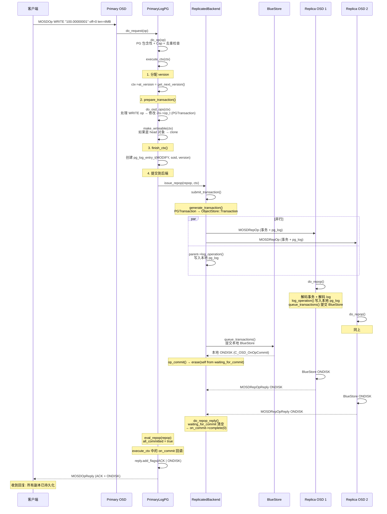
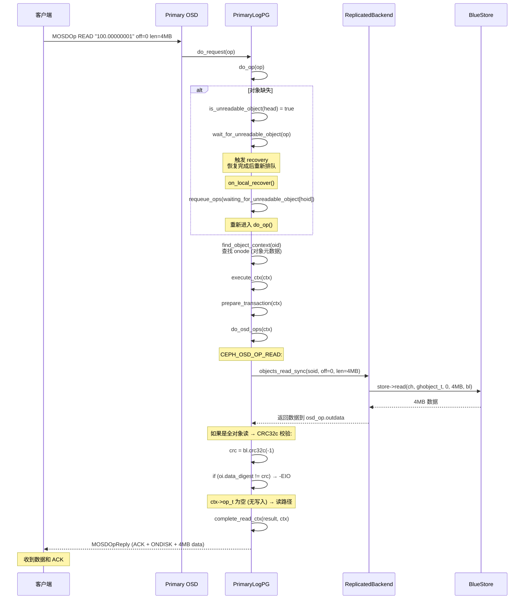
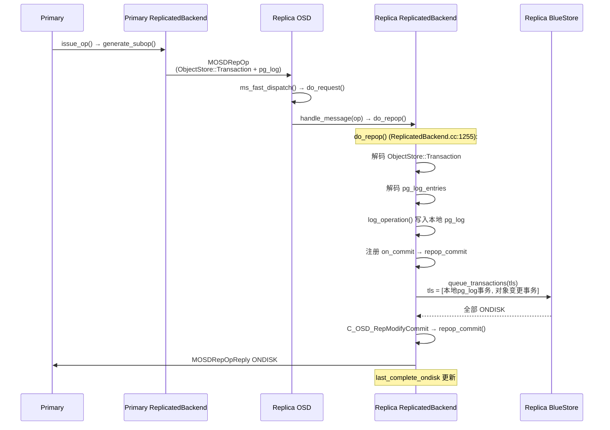

# CephFS OSD 对象读写过程分析

---

## 目录

1. [OSD 读写总览](#1-osd-读写总览)
2. [请求接收与调度](#2-请求接收与调度)
3. [PG 级请求分发](#3-pg-级请求分发)
4. [写入完整流程](#4-写入完整流程)
5. [读取完整流程](#5-读取完整流程)
6. [副本复制协议](#6-副本复制协议)
7. [BlueStore 读写](#7-bluestore-读写)
8. [缺失对象与恢复](#8-缺失对象与恢复)
9. [读写流程对比](#9-读写流程对比)
10. [关键源码索引](#10-关键源码索引)

---

## 1. OSD 读写总览

### 1.1 读写路径差异

```
┌─────────────────────────────────────────────────────────────┐
│                    读取 vs 写入 关键差异                       │
├─────────────────────────────────────────────────────────────┤
│                                                              │
│  写入 (必须经过副本协议):                                     │
│  客户端 → Primary → 所有 Replica → 全部 ONDISK → 回复客户端   │
│                                                              │
│  读取 (直接从本地存储):                                       │
│  客户端 → Primary → BlueStore.read() → 回复客户端            │
│  (副本池的读取不需要和其他副本通信)                            │
│                                                              │
├─────────────────────────────────────────────────────────────┤
│  写入: 需要 pg_log + 副本复制 + 等待全部 ONDISK              │
│  读取: 只需要 BlueStore 本地读取，无副本协调                  │
│                                                              │
└─────────────────────────────────────────────────────────────┘
```

### 1.2 写入 vs 读取 对比

| 维度 | 写入 | 读取 |
|------|------|------|
| 是否需要 Primary | 是 | 是（副本池） |
| 是否需要副本参与 | 是，全部副本 | 否 |
| 是否写 pg_log | 是 | 否 |
| 是否经过 BlueStore 事务 | 是 | 否（直接 read） |
| 返回时机 | 全部副本 ONDISK 后 | BlueStore read 完成后 |
| 涉及 ReplicatedBackend | 是 | 否 |
| 涉及 ObjectStore::Transaction | 是 | 否 |

---

## 2. 请求接收与调度

### 2.1 请求接收链路

```
客户端发送 MOSDOp (读/写请求):
  │
  ▼
Messenger::ms_fast_dispatch() (OSD.cc:7663)
  │ 提取 priority, cost, epoch, spg_t
  │ 创建 OpRequest
  │
  ▼
OSD::enqueue_op() (OSD.cc:9877)
  │ 放入 op_shardedwq (分片工作队列)
  │ 按 priority + cost + mClock 排队
  │
  ▼
OSD::dequeue_op() (OSD.cc:9935)  ← 工作线程池取出
  │
  ▼
pg->do_request(op)  → PrimaryLogPG::do_request()
```

### 2.2 mClock 调度器

```
op_shardedwq (OSD.cc:2445):

  分片: 按 PG shard 分片，减少锁竞争
  调度: mClock 算法
    ├── Weight: 每个客户端的权重 (QoS)
    ├── Reservation: 保留带宽 (最低保证)
    └── Limit: 上限 (防止饿死其他客户端)

  OSD 操作优先级:
    ├── 高: 恢复操作 (recovery)
    ├── 中: 客户端读写
    ├── 中: 副本操作 (repop)
    └── 低: Scrub
```

---

## 3. PG 级请求分发

### 3.1 do_request() 守门逻辑

```cpp
// PrimaryLogPG.cc:1836-1949
do_request(op):
  1. 等待 OSDMap 就绪
  2. PG 退化/非活跃 → 加 backoff 或排队等待
  3. PG 未 peered → 只有 PG_PULL 可以处理，其余排队
  4. PG 非 active → 排队等待
  5. 后端消息 (repop/repopreply) → pgbackend->handle_message()
  6. 客户端 OSD_OP → 必须 active → do_op()
```

### 3.2 do_op() 校验逻辑

```
do_op() (PrimaryLogPG.cc:2002-2566):

  1. PG 包含性检查: 对象哈希到本 PG
  2. Session backoff: 客户端级限流
  3. Capability 检查: op_has_sufficient_caps()
  4. 读请求路由:
     ├── CEPH_OSD_FLAG_BALANCE_READS → 可从副本读
     └── 默认: 必须从 Primary 读
  5. 缺失对象检查: is_unreadable_object()
     ├── 可 backoff → add_backoff() + maybe_kick_recovery()
     └── 否则 → wait_for_unreadable_object() 排队等待恢复
  6. 退化对象检查 (写): is_degraded_or_backfilling_object()
  7. 去重: check_in_progress_op()
  8. 查找对象上下文: find_object_context()
  9. Snap/Clone 解析
  10. execute_ctx(ctx)  ← 进入执行
```

---

## 4. 写入完整流程

### 4.1 写入时序图



### 4.2 execute_ctx() 核心分支

```cpp
// PrimaryLogPG.cc:4219-4443
execute_ctx(ctx):
  ctx->at_version = get_next_version();      // 分配版本号

  prepare_transaction(ctx);
    do_osd_ops(ctx);                          // 执行具体操作 (WRITE/SETATTR/...)
    finish_ctx(ctx);                          // 创建 pg_log_entry_t

  // 关键分支:
  if (ctx->op_t->empty() && !ctx->update_log_only):
      complete_read_ctx(result, ctx);         // ← 读路径: 直接回复
      return;

  // 写路径:
  issue_repop(repop, ctx);                   // 发送到 ReplicatedBackend
  eval_repop(repop);                         // 检查是否全部完成
```

### 4.3 pg_log_entry_t 创建

```
finish_ctx() (PrimaryLogPG.cc:9078-9154):

  为每次写入创建 pg_log_entry_t:
  {
    op:     MODIFY (或 DELETE),
    soid:   "100.00000001",
    version: eversion_t(epoch, 100),  // PG 内单调递增
    prior_version: 99,
    user_version: 42,                 // 客户端可见版本
    reqid:  client_request_id,        // 用于去重
    mtime:  请求时间戳
  }

  该条目会:
  1. 添加到 projected_log
  2. 发送给所有副本 (MOSDRepOp.logbl)
  3. 持久化到本地 BlueStore (pgmeta omap)
  4. 用于后续 Peering/Recovery
```

---

## 5. 读取完整流程

### 5.1 读取时序图



### 5.2 读取关键特点

```
副本池读取特点:

  1. 不写 pg_log — 读取不修改任何状态
  2. 不通知副本 — 只从 Primary 本地 BlueStore 读取
  3. 不经过 ObjectStore::Transaction — 直接 store->read()
  4. 支持 CRC 校验 — 全对象读取时验证数据完整性
  5. 缺失对象 → 触发恢复 → 等待恢复完成 → 重新执行

  例外:副本读 (CEPH_OSD_FLAG_BALANCE_READS)
    → 可以从非 Primary 副本读取
    → 减轻 Primary 负载
    → 但只在该对象在副本上存在且无不稳定写入时
```

---

## 6. 副本复制协议

### 6.1 ReplicatedBackend 提交流程

```
ReplicatedBackend::submit_transaction() (ReplicatedBackend.cc:580-668):

  1. generate_transaction()
     PGTransaction → ObjectStore::Transaction
     ├── OP_CREATE → t->create(coll, goid)
     ├── OP_WRITE → t->write(coll, goid, off, len, bl)
     ├── OP_SETATTR → t->setattr(coll, goid, attrs)
     ├── OP_OMAP_SET → t->omap_setkeys(coll, goid, attrs)
     └── OP_REMOVE → t->remove(coll, goid)

  2. 创建 InProgressOp:
     waiting_for_commit = {self, replica1, replica2}

  3. issue_op() — 并行发送给所有副本:
     for each replica:
       generate_subop() → MOSDRepOp (事务 + pg_log)
       send_message_osd_cluster(replica)

  4. log_operation() — 本地 pg_log

  5. queue_transactions() — 提交本地 BlueStore

  6. 注册 on_commit 回调
```

### 6.2 副本处理流程



### 6.3 InProgressOp 完成判定

```
InProgressOp (ReplicatedBackend.h:336):

  waiting_for_commit = {osd.0, osd.1, osd.3}  // 3 个副本

  每个 ONDISK 回复 → erase 该副本:
    op_commit(self)  → erase(osd.0) → {osd.1, osd.3}
    do_repop_reply(osd.3) → erase(osd.3) → {osd.1}
    do_repop_reply(osd.1) → erase(osd.1) → {} 空集

  集合为空 → on_commit->complete(0) → 发送客户端回复
```

---

## 7. BlueStore 读写

### 7.1 BlueStore 写入

```
BlueStore::queue_transactions() (BlueStore.cc:15747):

  1. 创建 TransContext (txc)
  2. _txc_add_transaction(txc, t):
     OP_WRITE → 写入数据到 BlobManager
     OP_SETATTR → 更新 omap (RocksDB)
     OP_OMAP_SET → 更新 omap (RocksDB)
     OP_CREATE → 创建 onode (RocksDB)
     OP_REMOVE → 标记删除
  3. _txc_calc_cost(txc) — 计算 IO 成本
  4. _txc_write_nodes(txc) — 准备写入数据
  5. _txc_finalize_kv(txc) — 序列化 KV
  6. throttle — 限流
  7. _txc_state_proc(txc) — 状态机处理:
     PREPARE → AIO_WAIT → KV_SUBMITTED → KV_DONE → FINISHING

  数据写入路径:
    大对象数据 → BlockDev (AIO 异步写入裸设备)
    小对象/元数据 → RocksDB ( omap/onode )
    两者通过 _kv_sync_thread() 两阶段提交保证原子性
```

### 7.2 BlueStore 读取

```
BlueStore::read() → _do_read() (BlueStore.cc:12971):

  1. 查找 onode: c->get_onode(oid)
     → onode 不存在 → -ENOENT
  2. 边界检查: offset >= onode.size → 返回 0
  3. 加载 extent map:
     o->extent_map.fault_range(db, offset, length)
     → 从 RocksDB 加载 blob → offset 映射
  4. 检查 BlueStore 读缓存 (BlueCache)
  5. 准备 IO:
     _prepare_read_ioc(blobs2read, &ioc)
  6. 异步 IO:
     bdev->aio_submit(&ioc) → aio_wait()
  7. 生成结果:
     _generate_read_result_bl()
  8. CRC 校验:
     如果开启 bluestore_csum → 校验每个 blob
     如果校验失败 → retry (最多 bluestore_retry_disk_reads 次)
```

---

## 8. 缺失对象与恢复

### 8.1 读取时的缺失处理

```
do_op() 中检查 (PrimaryLogPG.cc:2223):

  is_unreadable_object(head):
    ├── 可 backoff:
    │     add_backoff(session, head)   → 客户端等待后重试
    │     maybe_kick_recovery(head)    → 触发恢复
    └── 不可 backoff:
          wait_for_unreadable_object(head, op) → 排队等待

  恢复完成后 (on_local_recover, line 478):
    if (!is_unreadable_object(hoid)):
        requeue_ops(waiting_for_unreadable_object[hoid])
        release_backoffs(hoid)

  写入时的缺失处理 (更严格):
  is_degraded_or_backfilling_object(head):
    → wait_for_degraded_object(head, op) → 等待所有副本有该对象
    → 因为写入必须保证全副本持久化
```

### 8.2 PG 状态与请求处理

```
PG 状态 → 请求处理策略:

  down/incomplete:
    → add_pg_backoff() → 客户端全 PG 退避

  peering:
    → add_pg_backoff() 或等待

  peered but not active:
    → waiting_for_active 排队

  active+degraded:
    ├── 读取: 如果对象在本地 → 正常处理
    │         如果对象缺失 → 等待恢复
    └── 写入: 如果对象退化 → 等待恢复 (更严格)

  active+clean:
    → 正常处理所有读写
```

---

## 9. 读写流程对比

### 9.1 数据流对比图

```
写入数据流:
  Client → OSD.ms_fast_dispatch → op_shardedwq → dequeue_op
  → pg->do_request → do_op → execute_ctx
  → prepare_transaction (do_osd_ops → finish_ctx)
  → issue_repop → ReplicatedBackend.submit_transaction
  → issue_op (发 MOSDRepOp 给副本)
  → queue_transactions (本地 BlueStore)
  → 等待: 本地 ONDISK + 副本 ONDISK
  → eval_repop → reply 客户端

  路径长度: Client → Primary → [Primary BlueStore + Replica BlueStore] → Client

读取数据流:
  Client → OSD.ms_fast_dispatch → op_shardedwq → dequeue_op
  → pg->do_request → do_op → execute_ctx
  → prepare_transaction (do_osd_ops: objects_read_sync)
  → [如果对象缺失: 等待恢复 → 重试]
  → complete_read_ctx → reply 客户端

  路径长度: Client → Primary → Primary BlueStore → Client
```

### 9.2 延迟对比

```
写入延迟:
  = 网络延迟(Client→Primary)
  + 队列等待 (mClock)
  + do_op 校验
  + prepare_transaction
  + 网络延迟(Primary→Replica) × 1 (并行)
  + Replica BlueStore 写入
  + Primary BlueStore 写入
  + 网络延迟(Replica→Primary ONDISK reply) × N
  + eval_repop
  + 网络延迟(Primary→Client reply)
  ≈ 4~5 次网络往返 (最坏情况)

读取延迟:
  = 网络延迟(Client→Primary)
  + 队列等待 (mClock)
  + do_op 校验
  + BlueStore 读取 (磁盘 IO)
  + 网络延迟(Primary→Client reply)
  ≈ 1 次网络往返 (最好情况)
```

---

## 10. 关键源码索引

| 模块 | 文件 | 关键内容 |
|------|------|---------|
| **消息接收** | `src/osd/OSD.cc:7663` | `ms_fast_dispatch()` |
| **入队** | `src/osd/OSD.cc:9877` | `enqueue_op()` |
| **出队** | `src/osd/OSD.cc:9935` | `dequeue_op()` |
| **PG 分发** | `src/osd/PrimaryLogPG.cc:1836` | `do_request()` |
| **操作入口** | `src/osd/PrimaryLogPG.cc:2002` | `do_op()` 校验链 |
| **执行入口** | `src/osd/PrimaryLogPG.cc:4219` | `execute_ctx()` |
| **事务准备** | `src/osd/PrimaryLogPG.cc:9012` | `prepare_transaction()` |
| **操作执行** | `src/osd/PrimaryLogPG.cc:6060` | `do_osd_ops()` |
| **上下文完成** | `src/osd/PrimaryLogPG.cc:9078` | `finish_ctx()` |
| **读取完成** | `src/osd/PrimaryLogPG.cc:9216` | `complete_read_ctx()` |
| **发送副本** | `src/osd/PrimaryLogPG.cc:11528` | `issue_repop()` |
| **评估完成** | `src/osd/PrimaryLogPG.cc:11479` | `eval_repop()` |
| **副本提交** | `src/osd/PrimaryLogPG.cc:4402` | on_commit 回调 |
| **后端选择** | `src/osd/PGBackend.cc:770` | `build_pg_backend()` |
| **提交事务** | `src/osd/ReplicatedBackend.cc:580` | `submit_transaction()` |
| **生成事务** | `src/osd/ReplicatedBackend.cc:353` | `generate_transaction()` |
| **发送子操作** | `src/osd/ReplicatedBackend.cc:1199` | `issue_op()` |
| **构造子操作** | `src/osd/ReplicatedBackend.cc:1139` | `generate_subop()` |
| **副本处理** | `src/osd/ReplicatedBackend.cc:1255` | `do_repop()` |
| **副本提交回复** | `src/osd/ReplicatedBackend.cc:1358` | `repop_commit()` |
| **主回复处理** | `src/osd/ReplicatedBackend.cc:695` | `do_repop_reply()` |
| **本地提交** | `src/osd/ReplicatedBackend.cc:670` | `op_commit()` |
| **进行中操作** | `src/osd/ReplicatedBackend.h:336` | `InProgressOp` |
| **BlueStore 写** | `src/os/bluestore/BlueStore.cc:15747` | `queue_transactions()` |
| **BlueStore 读** | `src/os/bluestore/BlueStore.cc:12644` | `read()` |
| **BlueStore 读细节** | `src/os/bluestore/BlueStore.cc:12971` | `_do_read()` |
| **缺失等待** | `src/osd/PrimaryLogPG.cc:2223` | `wait_for_unreadable_object()` |
| **恢复后重试** | `src/osd/PrimaryLogPG.cc:478` | `on_local_recover()` |
| **退化写入等待** | `src/osd/PrimaryLogPG.cc:2244` | `wait_for_degraded_object()` |
| **同步读取** | `src/osd/ReplicatedBackend.cc:279` | `objects_read_sync()` |
| **OSD Op 结构** | `src/osd/osd_types.h:4316` | `OSDOp` |
| **pg_log 条目** | `src/osd/osd_types.h:4475` | `pg_log_entry_t` |
