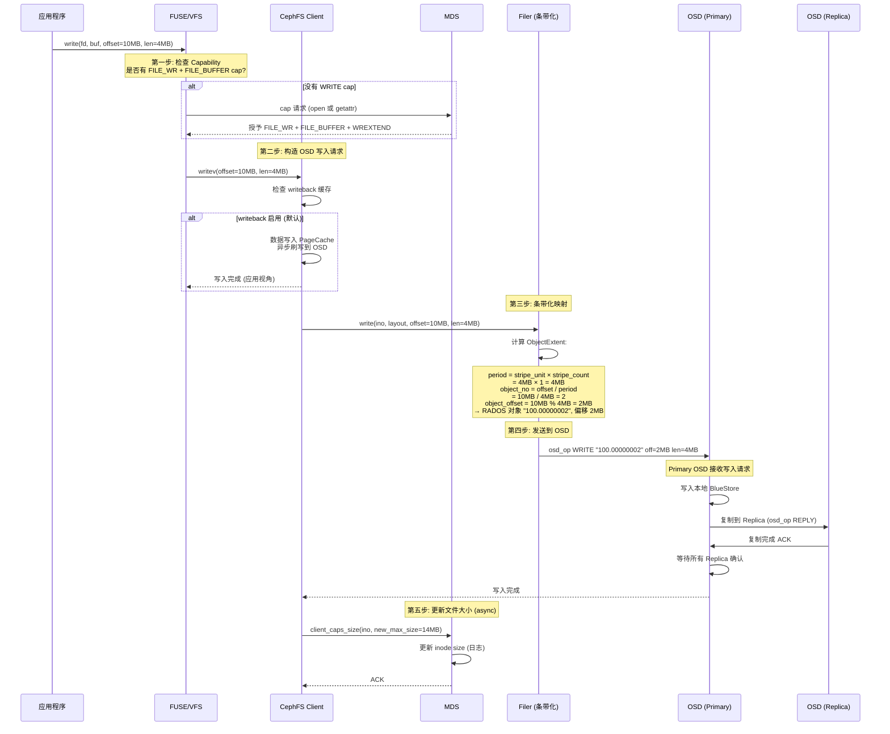
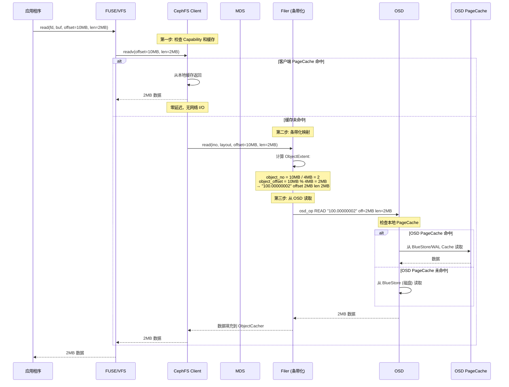

# CephFS 存储模型详解

---

## 目录

1. [核心架构概述](#1-核心架构概述)
2. [存储模型总览：文件 → 对象映射](#2-存储模型总览文件--对象映射)
3. [元数据存储：MDS 架构](#3-元数据存储mds-架构)
4. [数据存储：RADOS/OSD 架构](#4-数据存储radososd-架构)
5. [CRUSH 算法与数据放置](#5-crush-算法与数据放置)
6. [Capability 机制（MDS 授权）](#6-capability-机制mds-授权)
7. [写入全流程与时序图](#7-写入全流程与时序图)
8. [读取全流程与时序图](#8-读取全流程与时序图)
9. [写入回写（Writeback）机制](#9-写入回写writeback机制)
10. [缓存一致性机制](#10-缓存一致性机制)
11. [快照机制](#11-快照机制)
12. [目录分片（Fragment）](#12-目录分片fragment)
13. [与 JuiceFS、Lustre 的架构对比](#13-与-juicefslustre-的架构对比)
14. [关键源码索引](#14-关键源码索引)

---

## 1. 核心架构概述

CephFS 是 Ceph 分布式存储系统中的 POSIX 兼容文件系统，构建在 RADOS（Reliable Autonomic Distributed Object Store）之上。

```
┌──────────────────────────────────────────────────────────────┐
│                     CephFS Client                            │
│  ┌─────────────┐  ┌──────────┐  ┌──────────────────────┐    │
│  │ FUSE / VFS  │  │ Filer    │  │ ObjectCacher         │    │
│  │ (用户态)    │→│ (条带化) │→│ (读写缓存)           │    │
│  └──────┬──────┘  └────┬─────┘  └──────────┬───────────┘    │
└─────────┼──────────────┼──────────────────┼────────────────┘
          │              │                  │
    ┌─────▼──────┐ ┌────▼─────┐    ┌───────▼──────┐
    │    MDS     │ │          │    │     OSD      │
    │ (元数据)   │ │ librados │→  │  (数据存储)   │
    │ 多活/热备  │ │ (客户端) │    │  BlueStore    │
    └──────┬─────┘ └──────────┘    └──────┬───────┘
           │                                │
    ┌──────▼────────────────────────────────▼───────┐
    │                RADOS 集群                      │
    │  Monitor + OSD + CRUSH + BlueStore            │
    └──────────────────────────────────────────────┘
```

### 1.1 核心组件

| 组件 | 位置 | 职责 |
|---|---|---|
| **Client** | `src/client/` | FUSE 挂载、缓存管理、条带化、与 MDS/OSD 通信 |
| **MDS** | `src/mds/` | 元数据管理（inode/dentry）、Capability 授权、日志 |
| **OSD** | `src/osd/` | 数据存储、副本复制、EC、恢复 |
| **Monitor** | `src/mon/` | 集群状态、OSD Map、MDS Map |
| **Filer** | `src/osdc/Filer.cc` | 文件到 RADOS 对象的条带化映射 |
| **Objecter** | `src/osdc/Objecter.cc` | RADOS 客户端（发送 OSD 请求） |

---

## 2. 存储模型总览：文件 → 对象映射

### 2.1 文件布局（FileLayout）

CephFS 将文件切分为条带（stripe），存储到 RADOS 对象中：

```c
// src/include/ceph_fs.h:67-82
struct ceph_file_layout {
    /* file → object mapping */
    __le32 fl_stripe_unit;     // 条带单元大小（字节），必须是页大小的倍数
    __le32 fl_stripe_count;    // 条带跨越的对象数
    __le32 fl_object_size;     // 每个对象的大小，达到后切换到新对象
    __le32 fl_cas_hash;        // 未使用

    /* pg → disk layout */
    __le32 fl_object_stripe_unit; // 未使用

    /* object → pg layout */
    __le32 fl_unused;         // 未使用
    __le32 fl_pg_pool;        // 存储池 ID（决定 CRUSH 规则和副本数）
} __attribute__ ((packed));
```

### 2.2 条带化映射算法

```
文件布局参数（默认值，`src/include/fs_types.h:107`）:
  stripe_unit = 4 MiB (1<<22)     — 每个条带的大小
  stripe_count = 1                 — 条带跨越的对象数
  object_size = 4 MiB (1<<22)    — 每个对象的大小

条带化算法由 `Striper::file_to_extents()` 实现（[src/osdc/Striper.cc:182-270](src/osdc/Striper.cc#L182-L270)）：

```cpp
while (left > 0) {
    blockno = cur / stripe_unit;
    stripeno = blockno / stripe_count;          // 水平条带编号
    stripepos = blockno % stripe_count;          // 条带内位置（哪个对象）
    stripes_per_object = object_size / stripe_unit;
    objectsetno = stripeno / stripes_per_object; // 对象集合编号
    objectno = objectsetno * stripe_count + stripepos;

    block_start = (stripeno % stripes_per_object) * stripe_unit;
    block_off = cur % stripe_unit;
    x_offset = block_start + block_off;          // 对象内偏移
}
```

```
示例 (stripe_unit=64K, stripe_count=4, object_size=4M):
  文件 0-64K     → 对象 0, 偏移 0
  文件 64K-128K   → 对象 1, 偏移 0
  文件 128K-192K  → 对象 2, 偏移 0
  文件 192K-256K  → 对象 3, 偏移 0
  文件 256K-320K  → 对象 0, 偏移 64K  (对象 0 尚未满)
  ...
  文件 4M-4M+64K  → 对象 4, 偏移 0   (对象 0 已满，滚动到对象 4)
```

### 2.3 对象命名

```
RADOS 对象命名（src/include/object.h:79 — file_object_t）:
  格式: "%llx.%08llx" → "inode号.对象号"

示例:
  inode 100 的第 0 个对象 → "100.00000000"
  inode 100 的第 1 个对象 → "100.00000001"
  inode 100 的第 2 个对象 → "100.00000002"
```

### 2.4 目录布局


```c
// src/include/ceph_fs.h:86-92
struct ceph_dir_layout {
    __u8   dl_dir_hash;   // 目录项哈希算法（如 rjenkins, sha256）
    __u8   dl_unused;
    __le32 dl_dir_frag;   // 目录分片编号
};
```

---

## 3. 元数据存储：MDS 架构

### 3.1 MDS 核心数据结构

**CInode（内存中的 Inode）**：`src/mds/CInode.h`

```
CInode
├── inode_t            // 磁盘上的 inode 元数据
│   ├── ino            // inode 号
│   ├── mode           // 文件类型和权限
│   ├── uid, gid       // 所有者
│   ├── size           // 文件大小
│   ├── mtime, atime   // 时间戳
│   ├── nlink          // 硬链接数
│   ├── layout         // file_layout_t（条带参数）
│   ├── dir_layout     // ceph_dir_layout（目录分片）
│   ├── inline_data    // 内联数据（小文件）
│   └── max_size_ever  // 文件历史最大大小
├── CDentry 父链       // 硬链接到父目录项
├── 状态锁             //Capability 授权状态
└── 脏标志             // 是否需要回写日志
```

**CDentry（目录项）**：`src/mds/CDentry.h`

```
CDentry
├── name              // 文件名
├── inode (CInode*)   // 指向的 inode
├── state             // 状态（DIRTY, COMPLETE, etc.）
└── lease             // 目录项租约
```

**CDir（目录）**：`src/mds/CDir.h`

```
CDir
├── frag_t            // 分片编号（fragtree 中的节点）
├── CDentry 集合      // 目录下所有条目
├── inode (CInode*)   // 目录自身的 inode
└── 状态              // 是否已加载/完整
```

### 3.2 MDS 日志（Journal）

MDS 将所有元数据修改持久化到 RADOS 日志中，确保持久性和崩溃一致性：

```
MDS Journal:
  ┌─────────────────────────────────────────┐
  │ LogSegment (存储在 RADOS)               │
  │  ├── 事务 1: mkdir /foo                │
  │  ├── 事务 2: create /foo/bar            │
  │  ├── 事务 3: setattr /foo/bar size=100 │
  │  └── ...                               │
  └─────────────────────────────────────────┘

Journal 特点:
  ├── 前缀日志（journal_prezero） — 预分配空间
  ├── 异步回写 — MDS 内存中的修改先记录日志
  ├── 定期截断 — 已应用的日志段被删除
  └── 崩溃恢复 — 重放未提交的日志
```

### 3.3 MDS 元数据在 RADOS 中的存储

```
RADOS Pool (cephfs_metadata):
  ├── journal_mds.0    → MDS 0 的日志
  ├── journal_mds.1    → MDS 1 的日志
  ├── mdlog_0.0        → MDS 0 的元数据日志
  └── ...
```

---

## 4. 数据存储：RADOS/OSD 架构

### 4.1 RADOS 存储层次

```
CephFS File
    │
    ▼ Filer (条带化)
RADOS Objects (inode.object_no)
    │
    ▼ CRUSH Algorithm
PG (Placement Group)
    │
    ▼ Replication / EC
OSD 0 (Primary)   ← 处理客户端请求
OSD 1 (Replica)    ← 异步复制
OSD 2 (Replica)    ← 异步复制
    │
    ▼ BlueStore
本地磁盘 (rocksdb + block device)
```

### 4.2 PG（Placement Group）

```
存储池 (Pool):
  ├── PG 0.0  → OSD [0, 1, 2]     (副本集)
  ├── PG 0.1  → OSD [3, 4, 5]
  ├── PG 0.2  → OSD [0, 2, 3]
  └── ...

PG 的作用:
  ├── 对象映射的基本单元（CRUSH 决定 PG → OSD）
  ├── 数据分布的粒度（不是对象级别映射）
  ├── 数据恢复的单元（PG 级别 Peering）
  └── 副本管理的单元（Primary + Replica）
```

### 4.3 BlueStore

```
BlueStore:
  ├── RocksDB (WAL + 元数据)
  │   ├── 对象元数据（size, attrs, omap）
  │   └── 对象映射表（extent → 磁盘位置）
  ├── BlueRocksEnv
  │   └── 嵌入式 RocksDB 实例
  ├── BlockDevice
  │   ├── Primary (数据块设备)
  │   ├── WAL (预写日志设备)
  │   └── DB (RocksDB 设备)
  └── FreelistManager
      └── 空间分配器（位图/分配器）
```

---

## 5. CRUSH 算法与数据放置

### 5.1 CRUSH 层次

```
CRUSH Map 层次:
  root (type=root)
  ├── datacenter (type=datacenter)
  │   ├── room (type=room)
  │   │   ├── row (type=row)
  │   │   │   ├── rack (type=rack)
  │   │   │   │   ├── host (type=host)
  │   │   │   │   │   ├── osd.0
  │   │   │   │   │   ├── osd.1
  │   │   │   │   │   └── osd.2
  │   │   │   │   └── rack (type=rack)
  │   │   │   │       └── ...
  │   │   │   └── ...
  │   │   └── ...
  │   └── ...
  └── datacenter (type=datacenter)
      └── ...
```

### 5.2 数据放置流程

```
对象 → PG → CRUSH → OSD 的映射:

  1. 对象 → PG:
     pgid = hash(object_name) % pg_num
     例: hash("100.00000000") % 256 = pg 0.42

  2. PG → OSD:
     CRUSH(pg_id) → [primary, replica1, replica2]
     - 基于权重选择 OSD
     - 考虑故障域隔离（不同 host/rack/rack）
     - 结果确定性（相同输入始终返回相同结果）

  3. Primary OSD 处理客户端请求:
     - 客户端只与 Primary 通信
     - Primary 负责副本复制
     - 副本完成后向客户端 ACK
```

### 5.3 副本 vs 纠删码

```
副本池 (Replicated Pool):
  数据 → [副本1, 副本2, 副本3]  (默认 3 副本)
  ├── 优点: 读写性能好
  ├── 缺点: 存储开销 3x
  └── 适用: 高性能场景

纠删码池 (EC Pool):
  数据 → [数据块1..k] + [校验块1..m]  (如 4+2)
  ├── 优点: 存储开销 1.5x (4+2)
  ├── 缺点: 写性能差（需计算校验），读性能较差
  └── 适用: 冷数据/归档场景
```

---

## 6. Capability 机制（MDS 授权）

### 6.1 Capability 定义

```c
// src/include/ceph_fs.h:808-841
#define CEPH_CAP_GSHARED     1   // 可以读取
#define CEPH_CAP_GEXCL       2   // 可以读取和更新
#define CEPH_CAP_GCACHE      4   // 可以缓存读取
#define CEPH_CAP_GRD         8   // 可以读取
#define CEPH_CAP_GWR        16   // 可以写入
#define CEPH_CAP_GBUFFER    32   // 可以缓冲写入
#define CEPH_CAP_GWREXTEND  64   // 可以扩展 EOF
#define CEPH_CAP_GLAZYIO   128   // 可以执行延迟 I/O

/* 文件 Capability（左移 CEPH_CAP_SFILE=8 位） */
#define CEPH_CAP_FILE_SHARED   (CEPH_CAP_GSHARED   << 8)
#define CEPH_CAP_FILE_EXCL     (CEPH_CAP_GEXCL     << 8)
#define CEPH_CAP_FILE_CACHE    (CEPH_CAP_GCACHE    << 8)  // 0x400
#define CEPH_CAP_FILE_RD       (CEPH_CAP_GRD       << 8)  // 0x800
#define CEPH_CAP_FILE_WR       (CEPH_CAP_GWR       << 8)  // 0x1000
#define CEPH_CAP_FILE_BUFFER   (CEPH_CAP_GBUFFER    << 8)  // 0x2000
#define CEPH_CAP_FILE_WREXTEND (CEPH_CAP_GWREXTEND << 8)  // 0x4000
#define CEPH_CAP_FILE_LAZYIO   (CEPH_CAP_GLAZYIO   << 8)  // 0x8000
```

### 6.2 Capability 工作流程

```
                    ┌──────────────┐
                    │     MDS      │
                    │              │
                    │ Capability   │
                    │  管理器      │
                    └──────┬───────┘
                           │
           ┌───────────────┼───────────────┐
           │               │               │
    ┌──────▼──────┐ ┌─────▼──────┐ ┌──────▼──────┐
    │  Client A   │ │  Client B  │ │  Client C   │
    │  SHARED RD  │ │  EXCL WR   │ │  SHARED RD  │
    │  + CACHE    │ │  + BUFFER  │ │  + CACHE    │
    └─────────────┘ └────────────┘ └─────────────┘

Capability 的作用:
  ├── 授权: MDS 授予客户端特定权限
  ├── 缓存: 持有 cap 的客户端可以缓存数据
  ├── 一致性: MDS 撤回 cap 时通知客户端刷新缓存
  └── 并发: SHARED cap 允许多个客户端并发读取
```

### 6.3 Capability 撤回

```
Client A (持有 SHARED RD+CACHE) 写入文件:
  → MDS 撤回所有其他客户端的 RD+CACHE cap
  → Client B 收到 cap 撤回消息
  → Client B 清除本地缓存
  → Client B 可以在后续重新请求 cap
```

---

## 7. 写入全流程与时序图



### 7.1 Writeback 机制

```
CephFS 写入路径:
  应用 write() → PageCache → [异步] → ObjectCacher → OSD

Writeback 的特点:
  ├── 应用 write 立即返回（写入 PageCache）
  ├── 脏页通过 ObjectCacher 异步刷写到 OSD
  ├── 持有 FILE_BUFFER cap 时可以延迟刷写
  ├── fsync() 强制刷写所有脏页到 OSD
  └── MDS 可以通过 cap 撤回强制刷写
```

---

## 8. 读取全流程与时序图



### 8.1 客户端缓存层次

```
CephFS 读取缓存:
  1. Client PageCache (内核或用户态)
     ├── 命中 → 零延迟返回
     └── 未命中 ↓

  2. ObjectCacher (client 端对象缓存)
     ├── 持有 FILE_CACHE cap 时可用
     ├── 命中 → 直接返回
     └── 未命中 ↓

  3. OSD PageCache (服务端)
     ├── 命中 → 返回数据
     └── 未命中 ↓

  4. BlueStore (磁盘)
     └── 读取数据返回
```

---

## 9. 写入回写（Writeback）机制

### 9.1 ObjectCacher

```
ObjectCacher (src/client/ObjectCacher.h):
  ├── 缓存 RADOS 对象到本地
  ├── 支持 writeback 模式
  ├── 脏对象异步刷写到 OSD
  └── 由 MDS cap 机制协调一致性

工作流程:
  写入 → ObjectCacher 缓存 → 脏标记
  → 定期/按需刷写到 OSD
  → 刷写完成后清除脏标记

触发刷写的条件:
  ├── fsync() — 强制刷写
  ├── MDS 要求 (cap 撤回) — 被动刷写
  ├── 脏数据达到阈值 — 自动刷写
  └── 内存不足 — 回收缓存
```

### 9.2 数据完整性与日志

```
BlueStore 事务日志:
  ┌───────────────────────────────┐
  │ RocksDB WAL                   │
  │ ├── 事务: 写入对象 100.00000002 │
  │ ├── 事务: 更新 freelist         │
  │ └── ...                       │
  └───────────────────────────────┘

写入流程:
  1. 写入 RocksDB WAL (预写日志)
  2. 更新内存中的 B-tree
  3. 异步刷写到 BlueStore 数据设备
  4. 完成后清理 WAL
```

---

## 10. 缓存一致性机制

### 10.1 Capability 与缓存一致性

```
CephFS 的缓存一致性依赖 Capability:

┌──────────────────────────────────────────────────┐
│ 场景: Client A 写入，Client B 读取同一文件      │
│                                                    │
│ T1: B 持有 FILE_RD + FILE_CACHE cap              │
│     B 缓存了文件的旧数据                          │
│                                                    │
│ T2: A 请求 FILE_WR + FILE_BUFFER cap              │
│     MDS 撤回 B 的 FILE_CACHE cap                  │
│     → B 收到 cap 撤回消息                         │
│     → B 清除本地缓存                              │
│     → B 后续读取重新从 OSD 获取                   │
│                                                    │
│ T3: A 写入完成                                    │
│     A 释放 cap 或 MDS 重新分配                    │
│                                                    │
│ T4: B 重新请求 FILE_CACHE cap                     │
│     B 读取文件的最新数据                          │
└──────────────────────────────────────────────────┘
```

### 10.2 OSD 层缓存一致性

```
OSD 层:
  ├── Primary OSD 负责协调副本
  ├── 写入必须等所有 Replica 确认
  ├── 读取可以从任意 Replica 提供（Read 尾随）
  └── 对象版本号 (version) 保证一致性
```

---

## 11. 快照机制

```
CephFS 快照:
  ├── 基于快照域 (SnapRealm) 的快照
  ├── 快照是 COW（Copy-on-Write）
  ├── 每个快照域有唯一的 snapid
  └── 对象使用 clone 机制

创建快照:
  MDS 创建 snapid → 标记所有 inode 的 snap context
  → 后续写入创建新对象（不修改旧对象）
  → 旧对象通过 snapid 引用

读取快照:
  Client 指定 snapid → Filer 使用旧对象
  → 从 OSD 读取快照时的数据
```

---

## 12. 目录分片（Fragment）

```
目录分片:
  ├── 大目录可以分成多个 Fragment
  ├── 每个 Fragment 由 frag_t 标识
  ├── 每个 Fragment 有独立的 CDir
  ├── Fragment 由 MDS 自动管理
  └── 可以分布在不同 MDS 上（多活 MDS）

目录分片布局:
  / (inode 1)
  ├── frag 0x100000000 → MDS 0  (包含 a-k 的条目)
  ├── frag 0x200000000 → MDS 1  (包含 l-z 的条目)
  └── frag 0x300000000 → MDS 2  (包含 0-9 的条目)

分片决策:
  ├── 目录条目数超过阈值
  ├── MDS 负载均衡需要
  └── 管理员手动设置
```

---

## 13. 与 JuiceFS、Lustre 的架构对比

| 维度 | CephFS | JuiceFS | Lustre |
|---|---|---|---|
| **架构** | MDS + OSD + Monitor | 元数据引擎 + 对象存储 | MDT + OSS + MGS |
| **元数据** | MDS 内存 + RADOS 日志 | Redis/SQL/TiKV | MDT 内存 + LDLM |
| **数据存储** | RADOS (BlueStore) | 对象存储 (S3/OSS) | OSS (ldiskfs) |
| **文件→对象映射** | 条带化 (stripe_unit/count/object_size) | Chunk(64M) + Slice + Block(4M) | 条带化 (stripe_size/count) |
| **数据路径** | Client → Filer → OSD (直连) | Client → HTTP → 对象存储 | Client → OSC → OST (RDMA) |
| **网络** | Messenger (TCP/MSGR2/RDMA) | HTTP (对象存储 API) | LNet (RDMA/IB/TCP) |
| **副本** | RADOS 副本 / EC | 对象存储自身 | RAID/ZFS (OSD 级别) |
| **客户端缓存** | PageCache + ObjectCacher | 内存 Page + 磁盘缓存 | OSC Page Cache |
| **一致性** | Capability + cap 撤回 | TTL + 主动失效 | LDLM + AST 回调 |
| **分布式锁** | MDS Capability（文件级） | DB 事务 | LDLM（字节范围锁） |
| **快照** | COW + SnapRealm | 无 | 无（依赖外部） |
| **目录分片** | 支持（自动+手动） | 所有目录同引擎 | LMV 多 MDT 分布式目录 |
| **部署复杂度** | 高（专用集群） | 低（单进程+云服务） | 高（专用集群+IB） |
| **扩展方式** | 加 OSD + 加 MDS | 加客户端 + 扩展对象存储 | 加 OSS + 加 MDT |

### 13.1 核心设计哲学对比

```
CephFS: "统一的分布式存储平台"
  ├── MDS 管理 POSIX 元数据
  ├── OSD 提供统一的 RADOS 对象存储
  ├── CRUSH 实现确定性的数据放置
  ├── 同一集群支持块存储 (RBD)、对象存储 (RGW) 和文件系统 (CephFS)
  └── 存储池隔离不同场景

JuiceFS: "云原生存储网关"
  ├── 元数据-数据分离（复用云服务）
  ├── 对象存储作为数据后端（低成本）
  ├── Slice 追加式写入（对象存储友好）
  ├── 无专用集群，单进程部署
  └── 强调弹性和易用性

Lustre: "HPC 极致性能"
  ├── 条带化并行 I/O（单文件跨多 OST）
  ├── RDMA 零拷贝直传
  ├── 字节范围锁（并发精细化控制）
  ├── 专用硬件（IB 网络、高性能磁盘）
  └── 单文件极致吞吐
```

---

## 14. 关键源码索引

| 模块 | 文件 | 关键内容 |
|---|---|---|
| **FileLayout** | `src/include/ceph_fs.h:67-82` | `ceph_file_layout` 结构（stripe_unit/count/object_size） |
| **DirLayout** | `src/include/ceph_fs.h:86-92` | `ceph_dir_layout` 结构 |
| **Capability 定义** | `src/include/ceph_fs.h:808-841` | `CEPH_CAP_GSHARED` 等权限位定义 |
| **Inode 元数据** | `src/include/cephfs/types.h:700-950` | `inode_t` 结构（size, mode, layout, inline_data 等） |
| **MDS Client** | `src/client/Client.h` | CephFS 客户端主类 |
| **Client Read** | `src/client/Client.cc` | `Client::ll_readv`, `_read_sync`, read callback |
| **Client Write** | `src/client/Client.cc` | `Client::ll_write`, writeback flush |
| **Filer** | `src/osdc/Filer.h` | 文件到 RADOS 对象的条带化映射 |
| **Filer Read** | `src/osdc/Filer.cc` | `Filer::read()` — 条带化读取 |
| **Objecter** | `src/osdc/Objecter.cc` | RADOS 客户端（发送 OSD 请求） |
| **ObjectCacher** | `src/client/ObjectCacher.h` | 客户端对象缓存和 writeback |
| **MDS Server** | `src/mds/Server.h` | MDS 服务器主类 |
| **CInode** | `src/mds/CInode.h` | MDS 内存中的 inode |
| **CDentry** | `src/mds/CDentry.h` | MDS 内存中的目录项 |
| **CDir** | `src/mds/CDir.h` | MDS 内存中的目录 |
| **Capability** | `src/mds/Capability.cc` | MDS Capability 管理 |
| **MDS Journal** | `src/mds/JournalPointer.h` | MDS 日志指针管理 |
| **OSD** | `src/osd/OSD.h` | OSD 主类 |
| **BlueStore** | `src/os/BlueStore.h` | BlueStore 存储后端 |
| **CRUSH** | `src/crush/CrushWrapper.h` | CRUSH 算法封装 |
| **FUSE 挂载** | `src/client/fuse_ll.cc` | CephFS FUSE 低级接口 |
| **libcephfs** | `src/include/cephfs/libcephfs.h` | CephFS 用户态库 API |
| ** stripe 常量** | `src/include/ceph_fs.h:84` | `CEPH_MIN_STRIPE_UNIT = 65536 (64KB)` |
