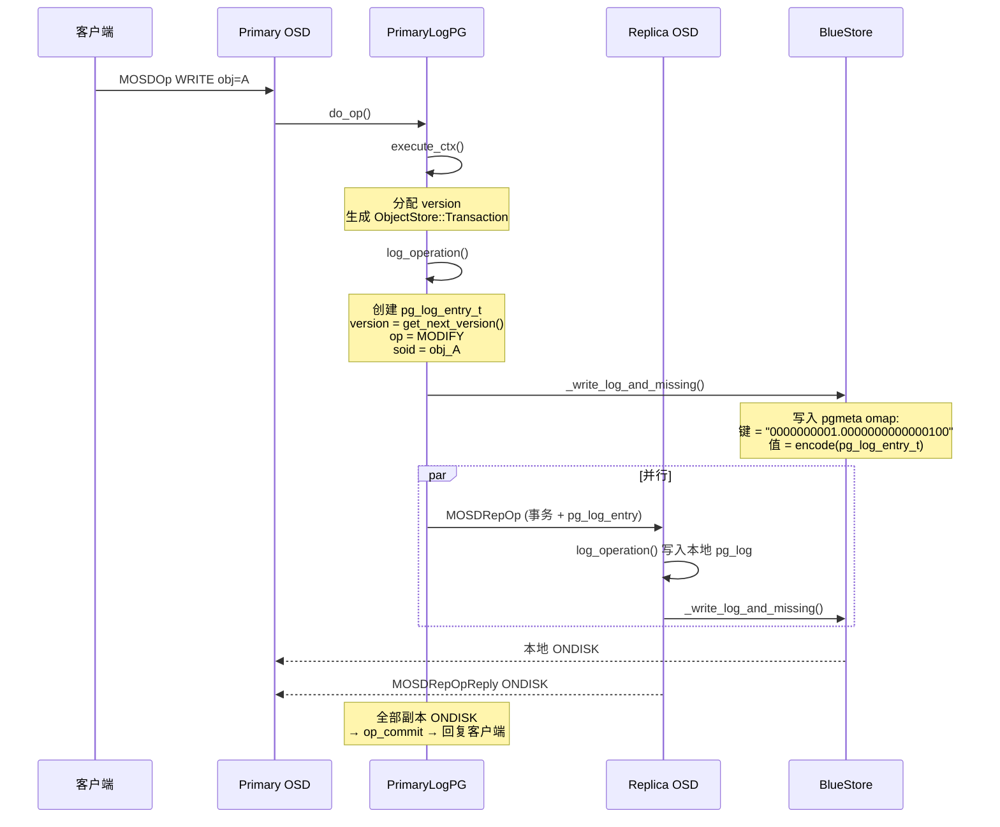
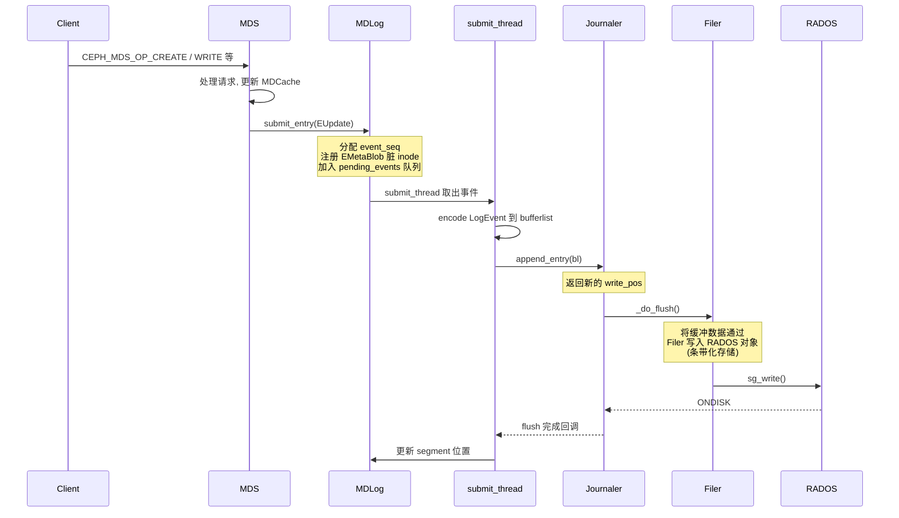
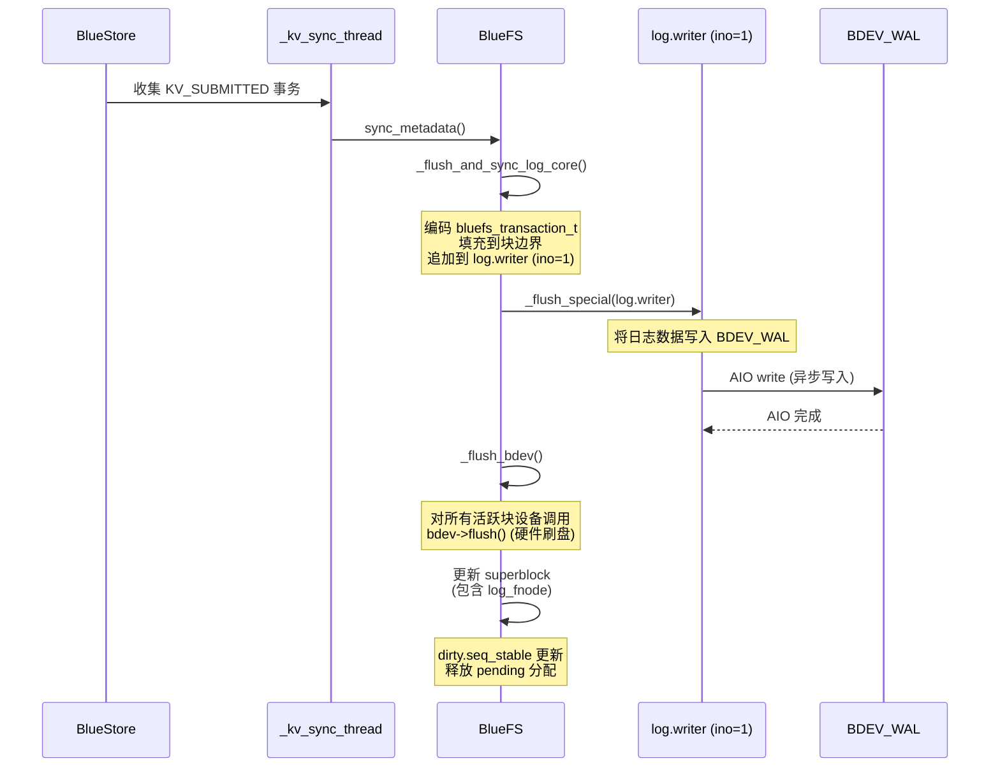
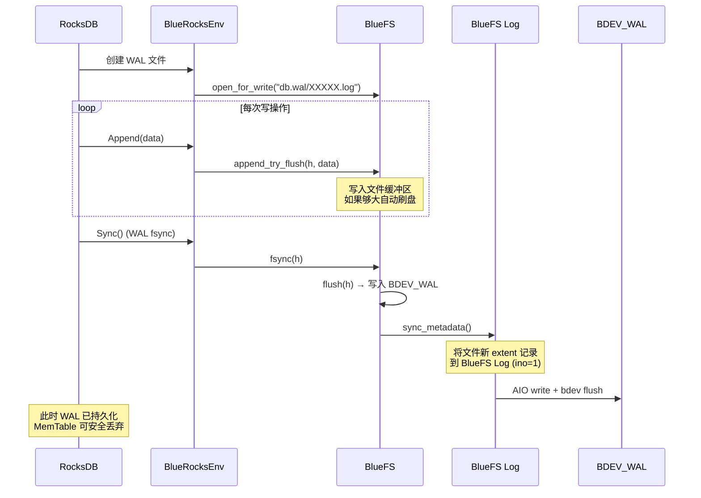
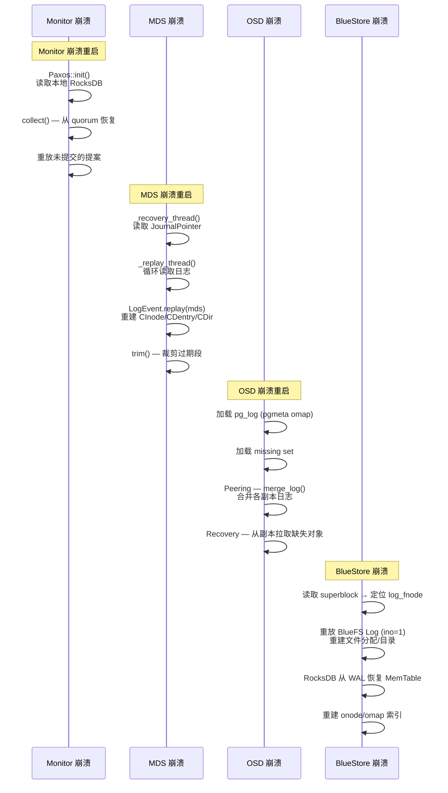

# CephFS 日志体系详解

---

## 目录

1. [日志体系总览](#1-日志体系总览)
2. [pg_log — PG 操作日志](#2-pg_log--pg-操作日志)
3. [MDS Journal — 元数据日志](#3-mds-journal--元数据日志)
4. [BlueFS Log — 存储引擎元数据日志](#4-bluefs-log--存储引擎元数据日志)
5. [RocksDB WAL — 键值库预写日志](#5-rocksdb-wal--键值库预写日志)
6. [Monitor Paxos Log — 集群共识日志](#6-monitor-paxos-log--集群共识日志)
7. [日志间的协作关系](#7-日志间的协作关系)
8. [日志裁剪策略](#8-日志裁剪策略)
9. [崩溃恢复全景](#9-崩溃恢复全景)
10. [关键源码索引](#10-关键源码索引)

---

## 1. 日志体系总览

Ceph 使用 5 种日志，各司其职，形成分层的持久性保障：

```
┌─────────────────────────────────────────────────────────────────┐
│                     Ceph 日志分层                                 │
├─────────────────────────────────────────────────────────────────┤
│                                                                  │
│  Layer 5: Monitor Paxos Log                                      │
│  ├── 保护: 集群地图 (OSDMap/PGMap/CRUSH Map/MDSMap)            │
│  ├── 位置: Monitor 本地 RocksDB                                  │
│  └── 作用: 多 Monitor 间的分布式共识                             │
│                                                                  │
│  Layer 4: MDS Journal                                            │
│  ├── 保护: CephFS 元数据 (inode/dentry/目录统计)                │
│  ├── 位置: RADOS Journal Pool (journal_mds.{rank})               │
│  └── 作用: MDS 崩溃后重建内存状态                                │
│                                                                  │
│  Layer 3: pg_log                                                 │
│  ├── 保护: 对象操作 (MODIFY/DELETE/CLONE/PROMOTE)               │
│  ├── 位置: OSD BlueStore RocksDB (pgmeta omap)                   │
│  └── 作用: Peering 日志合并 + 去重 + 崩溃恢复                    │
│                                                                  │
│  Layer 2: BlueFS Log                                             │
│  ├── 保护: BlueFS 文件系统元数据 (文件分配/目录结构)             │
│  ├── 位置: BDEV_WAL 裸设备 (BlueFS 专用日志文件, ino=1)         │
│  └── 作用: BlueFS 崩溃后重建文件系统结构                         │
│                                                                  │
│  Layer 1: RocksDB WAL (via BlueRocksEnv)                        │
│  ├── 保护: RocksDB MemTable (onode/omap/pg_log omap)            │
│  ├── 位置: BlueFS 管理的 db.wal 目录                             │
│  └── 作用: RocksDB 崩溃后恢复 MemTable                           │
│                                                                  │
└─────────────────────────────────────────────────────────────────┘
```

### 1.1 日志特性对比

| 日志 | 保护对象 | 存储位置 | 持久化方式 | 裁剪策略 |
|------|---------|---------|-----------|---------|
| pg_log | 对象操作 | OSD RocksDB omap | BlueStore 事务 | Peering 状态驱动 |
| MDS Journal | 元数据变更 | RADOS 对象 | Journaler → Filer → OSD | 段过期 (max_segments) |
| BlueFS Log | 存储引擎元数据 | BDEV_WAL 裸设备 | 直接 AIO 写入 | 日志压缩 (compact) |
| RocksDB WAL | RocksDB MemTable | BlueFS db.wal 目录 | BlueFS → BDEV_WAL | RocksDB 内部轮转 |
| Paxos Log | 集群地图 | Monitor RocksDB | RocksDB 事务 | paxos_min / paxos_trim_max |

---

## 2. pg_log — PG 操作日志

### 2.1 概述

pg_log 记录单个 PG 内所有对象操作，用于崩溃恢复、Peering 日志合并和操作去重。

### 2.2 数据结构

```cpp
// src/osd/osd_types.h:4475-4596
struct pg_log_entry_t {
  enum {
    MODIFY = 1,       // 对象修改
    CLONE = 2,        // 对象克隆 (快照 COW)
    DELETE = 3,       // 对象删除
    LOST_REVERT = 5,  // 丢失恢复 (回退到旧版本)
    LOST_DELETE = 6,  // 丢失删除
    LOST_MARK = 7,    // 丢失标记 (EIO)
    PROMOTE = 8,      // 对象提升 (分层存储)
    CLEAN = 9,        // 标记清理
    ERROR = 10,       // 写入错误 (用于去重)
  };

  hobject_t  soid;          // 对象标识
  osd_reqid_t reqid;         // 客户端请求 ID (去重用)
  eversion_t version;        // PG 内单调递增版本号
  eversion_t prior_version;  // 前一版本
  utime_t mtime;
  int32_t return_code;       // 错误码 (ERROR 类型)
};

// src/osd/PGLog.h:169-300
struct IndexedLog : public pg_log_t {
  std::unordered_map<hobject_t, pg_log_entry_t*> objects;    // 对象 → 最新日志
  std::unordered_map<osd_reqid_t, pg_log_entry_t*> caller_ops; // 请求ID → 日志
  std::list<pg_log_entry_t::iterator complete_to;            // 已确认完成的指针
};
```

### 2.3 存储位置

```
pg_log 存储在 BlueStore 的 RocksDB omap 中:

  对象: pgid.make_pgmeta_oid()  (PG 的元数据对象)
  键格式: eversion → "%010u.%020llu" (epoch.version, 31字符)
  值: 编码后的 pg_log_entry_t (带 checksum)

  特殊键:
    "divergent_priors"          — 发散条目列表
    "can_rollback_to"           — 可回滚点
    "rollback_info_trimmed_to"  — 回滚信息裁剪点

  去重记录:
    键格式: "dup_" + eversion (35字符)
    值: pg_log_dup_t (精简版，只保留 reqid/version)
```

### 2.4 写入流程



### 2.5 日志合并 (Peering)

```
场景: OSD Map 变更, 新 Acting Set 形成, Primary 和 Replica 的 pg_log 需要合并

  merge_log() (PGLog.cc:388-548):

    情况1: 对方日志 tail 更早 → 扩展本地日志的头部
    情况2: 对方日志 head 更新 → 回退本地日志头部, 追加新条目
    情况3: 有发散条目 → rewind_divergent_log()
      ├── 可回滚的 → 撤销操作
      └── 不可回滚的 → 标记对象 missing → 后续 Recovery 拉取

  保证: 合并后所有副本的 pg_log 完全一致
```

---

## 3. MDS Journal — 元数据日志

### 3.1 概述

MDS Journal 记录所有 CephFS 元数据变更，是 MDS 崩溃恢复的唯一保障。日志通过 Journaler 条带化存储在 RADOS 对象中。

### 3.2 Journaler 架构

```
Journaler (src/osdc/Journaler.h):

  四个逻辑指针:
    trimmed_pos ≤ expire_pos ≤ read_pos ≤ write_pos

  日志流格式:
    JOURNAL_FORMAT_RESILIENT = 1
    每条记录: [uint64_t 哨兵 (0x3141592653589793)] [uint32_t size] [LogEvent blob] [uint64_t 起始指针]

  存储映射:
    file_layout_t 定义字节流到 RADOS 对象的映射
    layout.period() 字节后开始实际日志
```

### 3.3 写入流程



### 3.4 日志重放

```
MDS 重启 → _replay_thread() (MDLog.cc:1417-1595):

  1. _recovery_thread() — 读取 JournalPointer → 定位日志文件 → 创建 Journaler
  2. _replay_thread() — 循环读取:
     while (read_pos < write_pos) {
         le = LogEvent::decode_event(bl);
         le->replay(mds);  // 每种 LogEvent 有自己的 replay 方法
     }

  LogEvent 类型 (src/mds/LogEvent.h:19-47):
  ├── EUpdate      (20) — 元数据变更 (inode/dentry)
  ├── ESession     (10) — 会话打开/关闭
  ├── ESubtreeMap  (2)  — 子树映射
  ├── EOpen        (22) — 文件打开表
  ├── EFragment    (6)  — 目录分片
  ├── EExport      (3)  — inode 导出 (多 MDS 迁移)
  ├── EImportStart (4)  — 导入开始
  ├── EImportFinish(5)  — 导入完成
  ├── ETableClient (42) — 表客户端操作
  ├── ETableServer (43) — 表服务端操作
  ├── ESegment     (100)— 段边界
  └── ENoOp        (51) — 空操作
```

### 3.5 段管理

```
日志分段 (LogSegment):

  ├── events_per_segment — 每段的事件数 (mds_log_events_per_segment)
  ├── max_segments — 最大段数 (mds_log_max_segments)
  ├── max_events — 最大事件数 (mds_log_max_events)
  └── minor_segments_per_major_segment — 主段频率

  段过期 (try_to_expire, journal.cc:125-200):
    条件:
    ├── 所有 dirty dirfrag 已提交到 RADOS 元数据存储
    ├── 所有未完成的 leader/peer 操作已结束
    ├── 所有未完成的 fragment 操作已结束
    └── 所有 scatterlocks 已 gather

    过期后 → _trim() → 截断日志 → 释放 RADOS 空间
```

---

## 4. BlueFS Log — 存储引擎元数据日志

### 4.1 概述

BlueFS 是 BlueStore 内置的极简文件系统，管理 RocksDB 的 WAL 和 DB 文件。BlueFS 有**自己的日志**来保护文件系统元数据（文件分配、目录结构）。

### 4.2 BlueFS 事务结构

```cpp
// src/os/bluestore/bluefs_types.h:347-362
struct bluefs_transaction_t {
  enum op_t {
    OP_INIT = 0,          // 初始化文件系统
    OP_ALLOC_ADD,         // 添加空闲块 (已废弃)
    OP_ALLOC_RM,          // 释放空闲块 (已废弃)
    OP_DIR_LINK,          // 创建/更新目录项
    OP_DIR_UNLINK,        // 删除目录项
    OP_DIR_CREATE,        // 创建目录
    OP_DIR_REMOVE,        // 删除目录
    OP_FILE_UPDATE,       // 更新文件元数据 (大小/分配)
    OP_FILE_REMOVE,       // 删除文件
    OP_JUMP,              // 跳转 seq 和 offset
    OP_JUMP_SEQ,          // 跳转 seq
    OP_FILE_UPDATE_INC,   // 增量更新文件元数据
  };

  uuid_d uuid;
  uint64_t seq;
  bufferlist op_bl;  // 编码后的操作列表
};
```

### 4.3 写入流程



### 4.4 日志文件

```
BlueFS 日志文件:
  inode = 1 (特殊文件)
  设备 = BDEV_WAL (db.wal 裸设备)
  fnode 跟踪在 super.log_fnode

Superblock (bluefs_types.h:316-341):
  uuid, osd_uuid, seq, block_size
  log_fnode — 指向日志文件在磁盘上的物理位置
  memorized_layout — BlueStore 设备布局

日志压缩:
  日志增长到阈值后触发 compact
  _compact_log_sync/async — 重写整个日志 (只保留当前有效元数据)
  压缩后更新 superblock
```

---

## 5. RocksDB WAL — 键值库预写日志

### 5.1 概述

RocksDB 自身的 WAL，通过 BlueRocksEnv 适配层将 I/O 路由到 BlueFS。

### 5.2 BlueRocksEnv 适配

```cpp
// src/os/bluestore/BlueRocksEnv.cc:177-295
class BlueRocksWritableFile : public rocksdb::WritableFile {
  BlueFS *fs;
  BlueFS::FileWriter *h;

  Append(data):  fs->append_try_flush(h, data)   // 写入 BlueFS 文件缓冲
  Flush():       fs->flush(h)                     // 刷到 BlueFS
  Sync():        fs->fsync(h)                     // fsync → 硬件刷盘
  RangeSync():   fs->flush_range(h, off, len)     // 范围刷
};

class BlueRocksDirectory : public rocksdb::Directory {
  Fsync():  fs->sync_metadata(false)  // 刷 BlueFS 日志
};
```

### 5.3 数据流



### 5.4 关键关系

```
RocksDB WAL ≠ BlueFS Log:
  RocksDB WAL  — RocksDB 的 MemTable 持久化, 内容是 onode/omap 数据
  BlueFS Log   — BlueFS 的文件系统元数据持久化, 内容是文件分配/目录操作

两者通过 BlueRocksEnv 连接:
  RocksDB WAL 文件本身就是 BlueFS 管理的文件
  RocksDB Sync() → BlueFS fsync() → BlueFS Log 更新 → BDEV_WAL 刷盘
```

---

## 6. Monitor Paxos Log — 集群共识日志

### 6.1 概述

Monitor 使用 Paxos 协议在多个 Monitor 间达成共识，每个提案版本作为一条日志存储。

### 6.2 存储结构

```
Paxos 存储 (RocksDB):

  paxos:
    first_committed -> 1     // 最早保留的版本
    last_committed  -> 4     // 最新提交的版本
    1 -> value_1              // 版本1的提案内容
    2 -> value_2
    3 -> value_3
    4 -> value_4

  每个版本的 value = MonitorDBStore::Transaction
  包含: OSDMap 更新 / PGMap 更新 / CRUSH Map 变更 等
```

### 6.3 Paxos 状态机

```
Paxos::commit_start():
  1. 构造 Transaction: put("last_committed", last_committed + 1)
  2. 解码并追加提案内容到 Transaction

Paxos::collect():
  1. 恢复阶段: 从 quorum 收集
  2. 找到未提交的值
  3. 选择新的 proposal number

Paxos::trim():
  1. end = min(version - paxos_min, first_committed + paxos_trim_max)
  2. 删除 first_committed ~ end 的旧版本
  3. 可选: compact_range 压缩空间
```

### 6.4 各 Monitor 的职责

```
Monitor 管理的 Paxos 服务:

  paxos/monmap    — Monitor 成员地图
  paxos/osdmap    — OSD 地图
  paxos/pgmap     — PG 地图
  paxos/mgr       — MGR 服务状态
  paxos/mdsmap    — MDS 地图
  paxos/auth      — 认证信息

  每个 Monitor 节点存储完整的 paxos 历史
  通过 quorum (majority) 保证一致性
```

---

## 7. 日志间的协作关系

### 7.1 写入链路

```
一次完整的 CephFS 写入涉及的日志:

  T1: Client::_write()
      → Filer::write_trunc() → Objecter → OSD
      → Primary OSD: execute_ctx() → log_operation()
        → pg_log 记录 MODIFY 条目
        → ReplicatedBackend → 副本复制

  T2: Primary OSD: BlueStore queue_transactions()
      → BlockDev AIO 写入对象数据
      → bdev->flush() 确保数据落盘
      → RocksDB WAL (via BlueRocksEnv)
        → BlueFS 文件写入
        → BlueFS Log 更新元数据

  T3: BlueStore 两阶段提交
      → BlueFS Log 写入 BDEV_WAL
      → BlueFS superblock 更新
      → RocksDB WAL sync 完成

  T4: 客户端收到 ACK (所有副本 ONDISK)

  T5: Client::_write_success()
      → 更新 inode size, mtime
      → mark_caps_dirty(FILE_WR)
      → check_caps() → send_cap(CEPH_CAP_OP_UPDATE)

  T6: MDS 收到 UPDATE
      → MDCache 更新 inode
      → MDLog::submit_entry(EUpdate)
      → Journaler → RADOS Journal 对象

  T7: Monitor (如有 OSD Map 变更)
      → Paxos commit → MonitorDBStore
```

### 7.2 日志层次关系

```
                    应用写入
                       │
         ┌─────────────┼─────────────┐
         │ MDS Journal  │ pg_log       │
         │ (元数据)     │ (对象操作)    │
         │             │              │
         │     ┌───────┘              │
         │     │ BlueFS Log           │
         │     │ (文件系统元数据)       │
         │     │                      │
         │     │ ┌────────────────────┘
         │     │ │ RocksDB WAL
         │     │ │ (onode/omap MemTable)
         │     │ │
         ▼     ▼ ▼ ▼
       物理磁盘 (fsync)
```

---

## 8. 日志裁剪策略

### 8.1 裁剪触发与条件

| 日志 | 裁剪触发 | 条件 | 代码 |
|------|---------|------|------|
| **pg_log** | Peering 完成 | `calc_trim_to_aggressive()` 计算安全点 | `PGLog.cc:56-161` |
| **MDS Journal** | `log_trim_upkeep` 线程 | 段内所有 dirty dirfrag 已持久化 + scatterlock 已 gather | `journal.cc:125-200` |
| **BlueFS Log** | 日志大小超过阈值 | `_should_start_compact_log_L_N()` | `BlueFS.cc:3244+` |
| **RocksDB WAL** | MemTable 刷盘 | RocksDB 内部 WAL 轮转机制 | RocksDB 内部 |
| **Paxos Log** | `trim()` 调用 | `version - paxos_min > first_committed` | `Paxos.cc:1241-1262` |

### 8.2 pg_log 裁剪细节

```
IndexedLog::trim() (PGLog.cc:56-161):

  1. 不能裁剪超过 can_rollback_to (回滚点)
  2. 裁剪旧条目时:
     ├── 从 objects/caller_ops 索引中移除
     ├── 如果条目版本 ≥ earliest_dup_version → 转为 pg_log_dup_t 保留去重记录
     └── 如果版本 < earliest_dup_version → 彻底删除
  3. 每次最多裁剪 osd_pg_log_trim_max 条 (避免大事务)
  4. 更新 tail 指针
```

---

## 9. 崩溃恢复全景

### 9.1 各组件崩溃恢复



### 9.2 恢复顺序

```
OSD 启动顺序:
  1. BlueStore 初始化
     ├── 读取 superblock
     ├── BlueFS Log 重放 → 重建文件系统结构
     ├── RocksDB 打开 → WAL 重放 → 恢复 MemTable
     └── pg_log 和 onode 都可用

  2. PG 初始化
     ├── 从 pgmeta omap 加载 pg_log
     ├── Peering: merge_log() 合并副本日志
     ├── Recovery: 拉取缺失对象
     └── PG active+clean

  3. OSD 就绪
     接收客户端请求

MDS 启动顺序:
  1. 连接 Monitor → 获取 MDSMap
  2. MDLog::replay() → 重放日志 → 重建 MDCache
  3. MDS 就绪 → 接收客户端元数据请求

Monitor 启动顺序:
  1. Paxos::init() → 读取本地存储
  2. Paxos::collect() → quorum 协商
  3. Monitor 就绪 → 提供 OSDMap/CRUSH Map
```

---

## 10. 关键源码索引

| 模块 | 文件 | 关键内容 |
|------|------|---------|
| **pg_log 条目** | `src/osd/osd_types.h:4475-4596` | `pg_log_entry_t` 操作类型定义 |
| **pg_log 索引** | `src/osd/PGLog.h:169-300` | `IndexedLog` 内存索引结构 |
| **pg_log 裁剪** | `src/osd/PGLog.cc:56-161` | `IndexedLog::trim()` |
| **pg_log 合并** | `src/osd/PGLog.cc:388-548` | `merge_log()` |
| **pg_log 回退** | `src/osd/PGLog.cc:339-386` | `rewind_divergent_log()` |
| **pg_log 持久化** | `src/osd/PGLog.cc:749-877` | `_write_log_and_missing_wo_missing()` |
| **pg_log 键格式** | `src/osd/osd_types.cc:1300-1306` | `eversion_t::get_key_name()` |
| **MDS 日志提交** | `src/mds/MDLog.cc:393-424` | `_submit_entry()` |
| **MDS 日志重放** | `src/mds/MDLog.cc:1417-1595` | `_replay_thread()` |
| **MDS 日志恢复** | `src/mds/MDLog.cc:1076-1130` | `_recovery_thread()` |
| **MDS 日志初始化** | `src/mds/MDLog.cc:306-355` | `open()`, `append()` |
| **MDS 日志段管理** | `src/mds/journal.cc:125-200` | `LogSegment::try_to_expire()` |
| **Journaler** | `src/osdc/Journaler.h:129-236` | Header, 四个指针, 流格式 |
| **Journaler 写入** | `src/osdc/Journaler.h:476` | `append_entry()` |
| **Journaler 裁剪** | `src/osdc/Journaler.h:275-493` | `_trim()`, `trim()` |
| **LogEvent 类型** | `src/mds/LogEvent.h:19-47` | 17 种事件类型常量 |
| **BlueFS 事务** | `src/os/bluestore/bluefs_types.h:347-362` | `bluefs_transaction_t` 操作类型 |
| **BlueFS Superblock** | `src/os/bluestore/bluefs_types.h:316-341` | `bluefs_super_t` + log_fnode |
| **BlueFS Log 写入** | `src/os/bluestore/BlueFS.cc:3660-3691` | `_flush_and_sync_log_core()` |
| **BlueFS Log 同步** | `src/os/bluestore/BlueFS.cc:3748+` | `_flush_and_sync_log_LD()` |
| **BlueFS 硬件刷盘** | `src/os/bluestore/BlueFS.cc:4384-4395` | `_flush_bdev()` |
| **BlueFS 日志压缩** | `src/os/bluestore/BlueFS.cc:3244+` | `_compact_log_sync/async()` |
| **BlueFS 元数据同步** | `src/os/bluestore/BlueFS.cc:4582-4605` | `sync_metadata()` |
| **BlueRocksEnv 写** | `src/os/bluestore/BlueRocksEnv.cc:177-295` | `BlueRocksWritableFile::Append()` |
| **BlueRocksEnv Sync** | `src/os/bluestore/BlueRocksEnv.cc:233-234` | `BlueRocksWritableFile::Sync()` |
| **BlueRocksEnv 目录** | `src/os/bluestore/BlueRocksEnv.cc:306-314` | `BlueRocksDirectory::Fsync()` |
| **Paxos 状态机** | `src/mon/Paxos.h:207-237` | 8 个 Paxos 状态 |
| **Paxos 提交** | `src/mon/Paxos.cc:854` | `commit_start()` |
| **Paxos 裁剪** | `src/mon/Paxos.cc:1241-1262` | `trim()` |
| **Paxos 存储** | `src/mon/MonitorDBStore.h:40-120` | MonitorDBStore (RocksDB 后端) |
