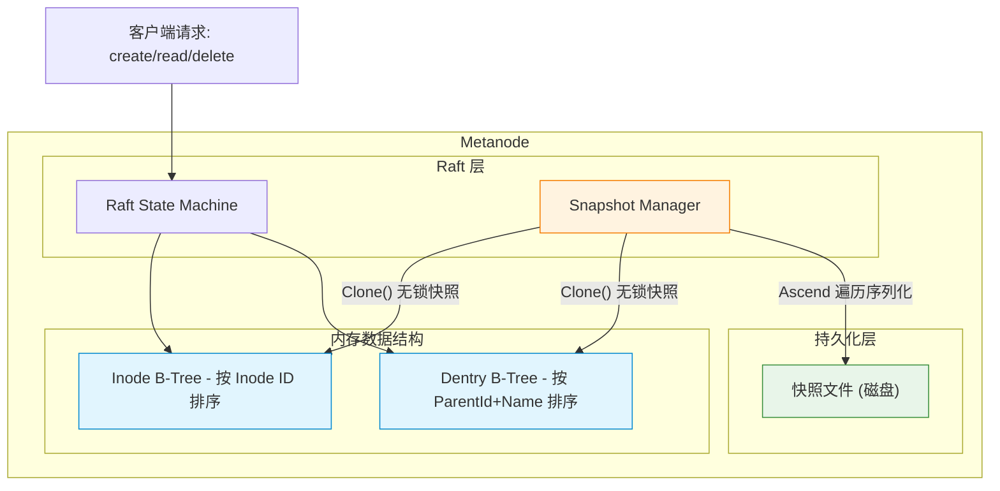
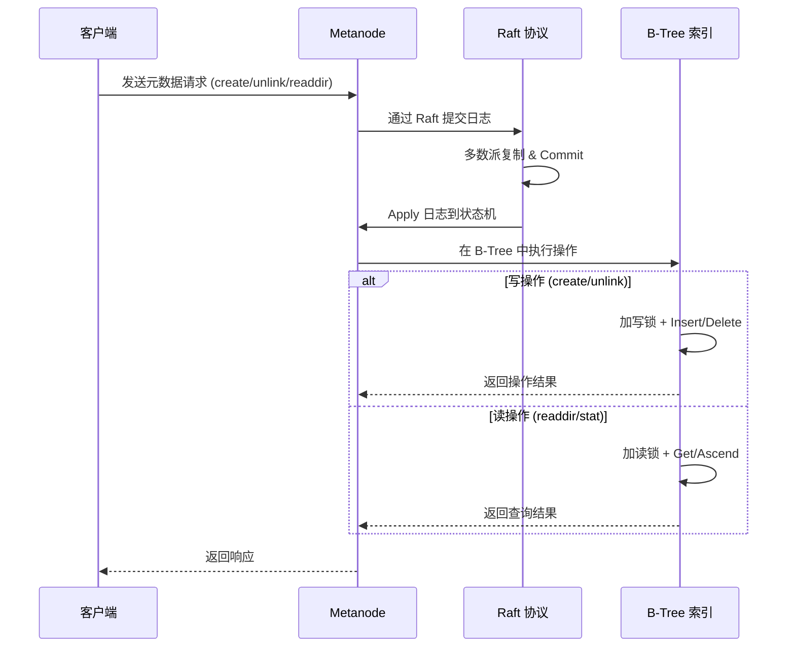
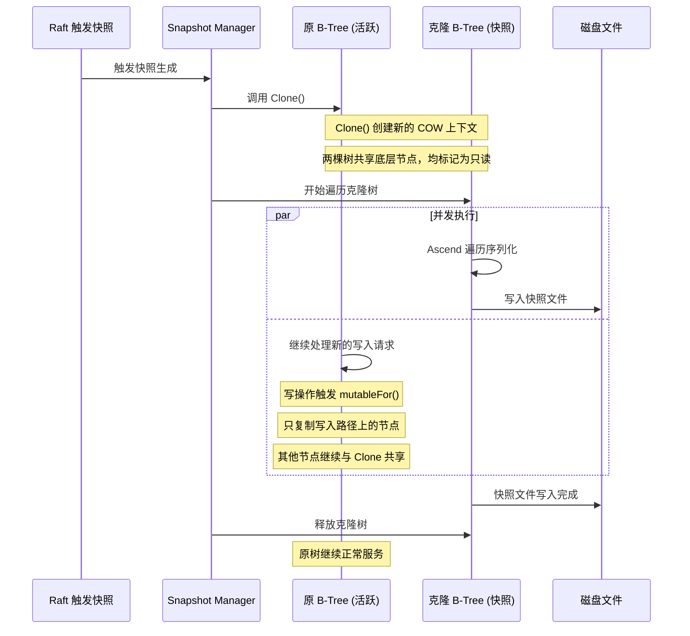

# CubeFS 使用 B-Tree 作为内存索引的原因分析

## 1. 实现概述

CubeFS 在 metanode 中使用基于 Google btree 的内存索引（`util/btree/btree.go`），管理 inode 和 dentry 数据：

### 1.1 Inode 索引

**文件**：`metanode/inode.go:539-591`

按 `Inode ID` 排序，`Copy()` 方法实现深拷贝（包括 extents、multiSnap 等复杂字段）。

```go
// Less 按 Inode ID 排序
func (i *Inode) Less(than BtreeItem) bool {
    ino, ok := than.(*Inode)
    return ok && i.Inode < ino.Inode
}

// Copy 实现写时复制
func (i *Inode) Copy() BtreeItem {
    newIno := NewInode(i.Inode, i.Type)
    i.RLock()
    newIno.Uid = i.Uid
    newIno.Gid = i.Gid
    newIno.Size = i.Size
    // ... 复制所有字段，包括 extents、multiSnap 等 ...
    i.RUnlock()
    return newIno
}
```

### 1.2 Dentry 索引

**文件**：`metanode/dentry.go:698-710`

按 `(ParentId, Name)` 复合键排序，支持目录内项的高效查找。

```go
// Less 按 (ParentId, Name) 复合键排序
func (d *Dentry) Less(than BtreeItem) (less bool) {
    dentry, ok := than.(*Dentry)
    less = ok && ((d.ParentId < dentry.ParentId) || 
                  ((d.ParentId == dentry.ParentId) && (d.Name < dentry.Name)))
}

func (d *Dentry) Copy() BtreeItem {
    newDentry := *d
    if d.multiSnap != nil {
        newDentry.multiSnap = &DentryMultiSnap{
            VerSeq:     d.multiSnap.VerSeq,
            dentryList: d.multiSnap.dentryList,
        }
    }
    return &newDentry
}
```

---

## 2. B-Tree 在 CubeFS 元数据管理中的作用

### 2.0 整体架构：B-Tree 在 Metanode 中的位置



### 2.0.1 元数据操作的 B-Tree 交互流程



---

## 3. 使用 B-Tree 的优势

### 3.1 有序性支持范围查询（核心优势之一）

B-Tree 天然有序，支持高效的范围遍历接口：

```go
func (t *BTree) AscendRange(greaterOrEqual, lessThan Item, iterator ItemIterator)
func (t *BTree) AscendGreaterOrEqual(pivot Item, iterator ItemIterator)
func (t *BTree) AscendLessThan(pivot Item, iterator ItemIterator)
func (t *BTree) DescendRange(lessOrEqual, greaterThan Item, iterator ItemIterator)
```

这在元数据操作中非常重要，例如：

- **目录列举**（readdir）：需要按 ParentId 范围遍历 dentry
- **快照存储**：在 `partition_store.go` 中，通过 `Ascend` 遍历所有 inode/dentry 进行持久化
- **批量删除**：按 inode ID 范围批量处理

### 2.2 写时复制（COW）支持并发快照（最关键原因）

这是 CubeFS 选择 btree 的**最关键原因**。btree 实现了 `Clone()` 方法：

```go
// Clone clones the btree, lazily.
func (t *BTree) Clone() (t2 *BTree) {
    // 创建新的 cow context，共享底层节点结构
    cow1, cow2 := *t.cow, *t.cow
    out := *t
    t.cow = &cow1
    out.cow = &cow2
    return &out
}
```

通过 `copyOnWriteContext` 机制实现节点所有权控制：

```go
func (n *node) mutableFor(cow *copyOnWriteContext) *node {
    if n.cow == cow {
        return n  // 自己拥有，可直接修改
    }
    // 不拥有，需要复制节点
    out := cow.newNode()
    copy(out.items, n.items.copy())
    copy(out.children, n.children)
    return out
}
```

这使得 CubeFS 能够：

- **无锁快照**：Clone 后的树可以并发读取，不影响原树写入
- **Raft 快照**：在生成 Raft 快照时，Clone 一份 btree 进行序列化，同时原树可继续处理写入
- **事务处理**：支持事务中的隔离读取

**COW 的工作原理**：

1. `Clone()` 创建两个新的 `copyOnWriteContext`，原树和新树各持一个
2. 底层节点结构被共享，但标记为只读
3. 当任一树需要写入时，`mutableFor()` 检查节点所有权
4. 只有拥有节点的树才能直接修改；否则复制该节点
5. 只有从根到修改点的路径上的节点会被复制，其他节点继续共享

**COW 快照生成流程**：



**关键点**：快照生成期间，原 B-Tree 可以继续处理读写请求，不会阻塞业务。这是 CubeFS 选择 btree 的最核心原因。

### 2.3 更好的缓存局部性

B-Tree 相比红黑树等二叉树有更扁平的结构：

```
红黑树: O(log₂ n) 高度
B-Tree: O(logₘ n) 高度 (m = degree, 通常远大于 2)
```

每个节点包含多个 items（`degree*2-1` 个），这意味着：

- **更少的节点层级**：减少内存指针跳转
- **更好的 CPU 缓存命中**：同一节点的多个 items 在内存中连续
- **特别适合元数据场景**：inode/dentry 访问通常有局部性

btree.go 注释中提到：

> It has a flatter structure than an equivalent red-black or other binary tree,
> which in some cases yields better memory usage and/or performance.

### 2.4 FreeList 减少内存分配

```go
type FreeList struct {
    mu       sync.Mutex
    freelist []*node
}

func (f *FreeList) newNode() (n *node) {
    // 复用已释放的节点
    index := len(f.freelist) - 1
    if index < 0 {
        return new(node)
    }
    n = f.freelist[index]
    f.freelist[index] = nil
    f.freelist = f.freelist[:index]
    return
}
```

在元数据频繁增删的场景下，FreeList 显著减少了 GC 压力。

### 2.5 CopyGet 支持读时复制

```go
func (t *BTree) CopyGet(key Item) Item {
    if t.root == nil {
        return nil
    }
    t.root = t.root.mutableFor(t.cow)  // 确保根节点可写
    item := t.root.copyGet(key, t.cow)
    return item
}
```

这个方法在读取的同时确保节点归属正确，用于需要修改返回值的场景。

---

## 3. 使用 B-Tree 的劣势

### 3.1 内存开销较大

```go
type node struct {
    items    items    // []Item - slice 有额外开销
    children children // []*node - 指针数组
    cow      *copyOnWriteContext
}
```

- **Interface 开销**：每个 Item 是接口类型，Go 中接口需要 2 个 word（类型指针 + 值指针）
- **Slice 开销**：`items` 和 `children` 是 slice，有底层数组指针、长度、容量三个字段
- **对比 C++ 实现**：btree.go 注释中提到，相比 C++ 模板实现，Go 版本内存使用更高，缓存命中率更低

btree.go 注释：

> Due to the overhead of storing values as interfaces (each value needs to be 
> stored as the value itself, then 2 words for the interface pointing to that 
> value and its type), resulting in higher memory use.
> Since interfaces can point to values anywhere in memory, values are most 
> likely not stored in contiguous blocks, resulting in a higher number of 
> cache misses.

### 3.2 并发写性能受限

```go
// BTree 注释明确说明：
// Write operations are not safe for concurrent mutation by multiple
// goroutines, but Read operations are.
```

- **写操作需要外部加锁**：CubeFS 需要在 metanode 层面用 `sync.RWMutex` 保护 btree
- **无法利用多核并行写入**：即使有多个 CPU，写操作也只能串行执行
- **对比 ConcurrentHashMap 等结构**：无法实现细粒度锁并行写入

### 3.3 COW 在高写入场景下的额外开销

```go
func (n *node) mutableFor(cow *copyOnWriteContext) *node {
    if n.cow == cow {
        return n
    }
    // 需要复制节点
    out := cow.newNode()
    copy(out.items, n.items.copy())  // 深拷贝 items
    copy(out.children, n.children)   // 浅拷贝 children
    return out
}
```

- **Clone 后首次写入慢**：Clone 之后，第一次写入需要复制从根到叶的路径上的所有节点
- **items.copy() 深拷贝**：每次 COW 都需要调用 `Copy()` 深拷贝 inode/dentry，包括 extents 等复杂结构
- **内存碎片**：频繁 COW 会导致内存碎片化

### 3.4 不支持持久化

btree.go 注释明确说明：

```go
// It is not meant for persistent storage solutions.
```

- **需要额外序列化**：CubeFS 必须通过 `Ascend` 遍历整个树来生成快照文件
- **恢复成本高**：重启时需要从文件重建整个 btree，耗时与数据量成正比
- **对比 LSM-Tree**：RocksDB 等 LSM-Tree 引擎原生支持持久化和快速恢复

### 3.5 单机容量限制

- **全内存存储**：所有 inode/dentry 必须在内存中，单 metanode 内存容量成为瓶颈
- **无法处理超大规模**：当单个 partition 的元数据量超过内存限制时，无法处理
- **对比 RocksDB**：后者可以使用磁盘存储，内存只缓存热数据

---

## 4. 设计权衡总结

CubeFS 选择 btree 是基于元数据管理场景的综合考虑：

| 考虑因素 | B-Tree 的契合度 | 说明 |
|---------|---------------|------|
| 元数据需要有序存储 | ✅ 天然有序 | inode/dentry 需要按 ID 有序管理 |
| 需要范围查询（目录列举） | ✅ 高效范围遍历 | AscendRange/DescendRange 等接口 |
| Raft 快照需要一致性视图 | ✅ COW Clone 实现无锁快照 | 最关键原因 |
| 元数据操作延迟敏感 | ✅ 内存操作，O(log n) | 低延迟访问 |
| 需要减少内存分配 | ✅ FreeList 复用节点 | 减少 GC 压力 |
| 超大规模数据持久化 | ❌ 全内存，不支持持久化 | 需额外序列化 |
| 高并发写入 | ❌ 写操作需外部加锁 | 无法并行写入 |

---

## 5. 核心结论

CubeFS 使用 btree 作为 inode 和 dentry 的内存索引，**核心原因是 COW 特性支持的并发快照机制**，这对于 Raft 一致性协议下的元数据管理至关重要。B-Tree 的有序性也完美契合了文件系统元数据的访问模式（如目录遍历）。

然而，这种选择的代价是较高的内存开销和单机容量限制，这要求 CubeFS 通过合理的 partition 分片来控制单个 metanode 的元数据规模。这种设计在中等规模的元数据管理场景下表现优异，但在超大规模场景下可能需要考虑混合存储方案（如内存 btree + 磁盘 LSM-Tree）。

---

## 参考资料

- `util/btree/btree.go`：B-Tree 核心实现，包括 Clone、COW、FreeList
- `metanode/inode.go`：Inode 的 Less 和 Copy 实现
- `metanode/dentry.go`：Dentry 的 Less 和 Copy 实现
- `metanode/partition_store.go`：快照存储和加载逻辑