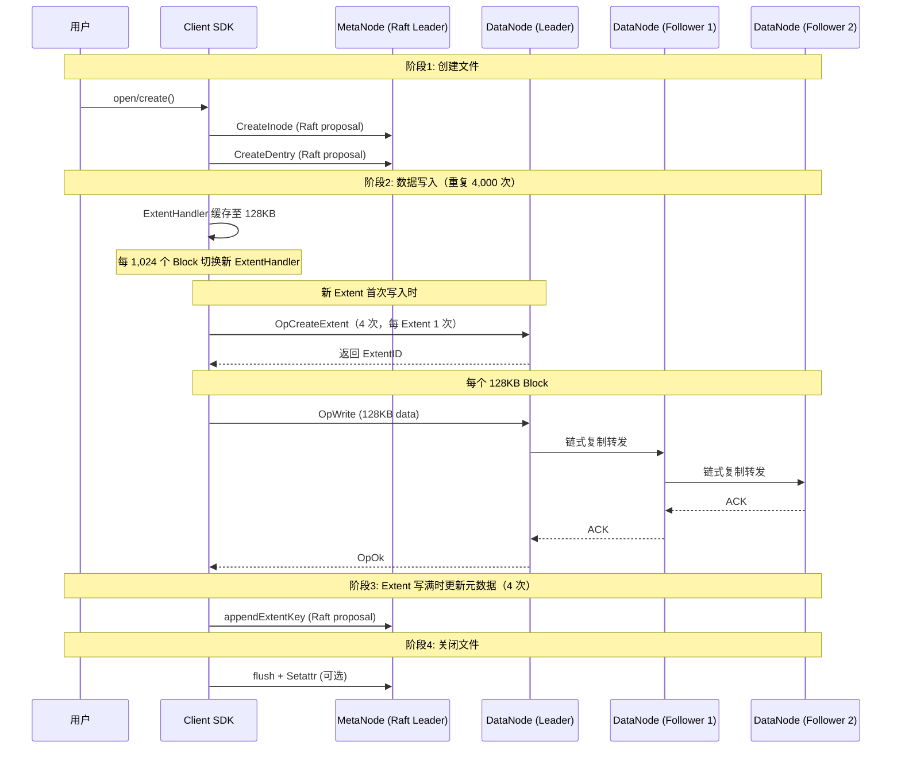

# CubeFS 写入 500MB 文件的 RPC、元数据、内存与 IO 放大分析

> 基于 CubeFS 源码（`sdk/data/stream/`、`sdk/meta/`、`datanode/`、`metanode/`、`util/unit.go`）深度分析写入 500MB 文件时的 RPC 次数、元数据操作次数、元数据内存开销及 IO 放大情况。

---

## 目录

1. [关键常量与前提](#1-关键常量与前提)
2. [写入流程回顾](#2-写入流程回顾)
3. [RPC 次数分析](#3-rpc-次数分析)
4. [元数据操作次数分析](#4-元数据操作次数分析)
5. [元数据内存开销分析](#5-元数据内存开销分析)
6. [IO 放大分析](#6-io-放大分析)
7. [综合汇总](#7-综合汇总)

---

## 1. 关键常量与前提

### 1.1 核心常量（`util/unit.go`）

```go
const (
    BlockCount = 1024                    // 每个 Extent 包含的 Block 数
    BlockSize  = 65536 * 2              // = 131,072 bytes = 128 KB（单个写入 packet 大小）
    ExtentSize = BlockCount * BlockSize // = 1024 × 128KB = 128 MB（单个 Extent 上限）
    PerBlockCrcSize  = 4                // 每个 Block 的 CRC 校验占 4 字节
    BlockHeaderSize  = 4096             // CRC 文件 header 大小
    DefaultTinySizeLimit = 1 * MB       // Tiny Extent 上限（小文件，本场景不涉及）
)
```

### 1.2 分析前提

| 参数 | 值 | 说明 |
|------|----|------|
| 文件大小 | **500 MB** = 524,288,000 bytes | 顺序写入，新建文件 |
| 存储模式 | Normal Extent（非 Tiny） | 大文件使用 Normal Extent |
| 副本数 | **3 副本** | 默认多副本链式复制 |
| MetaNode 副本数 | 3 | 元数据 Raft 组 |
| 写入模式 | 顺序追加写（`OpWrite`） | 非 `OpRandomWrite`，不走 DataNode Raft |
| 快照/版本 | 无 | 不触发版本更新额外 RPC |

### 1.3 基础计算

```
文件大小:           500 MB = 512,000 KB = 524,288,000 bytes
BlockSize:          128 KB = 131,072 bytes
ExtentSize:         128 MB = 131,072 KB

写入 Block 数:      500 MB / 128 KB = 4,000 个 Block（恰好整除）
Extent 数:          ⌈500 MB / 128 MB⌉ = 4 个 Extent
  - 3 个完整 Extent: 3 × 128 MB = 384 MB（各含 1,024 个 Block）
  - 1 个部分 Extent: 500 MB - 384 MB = 116 MB（含 928 个 Block）
```

---

## 2. 写入流程回顾



### 关键机制

1. **客户端写入聚合**：`ExtentHandler.write()` 将用户数据缓存在本地 packet 中，达到 `BlockSize`（128KB）后才发送到 DataNode，**大幅减少 RPC 次数**。
2. **延迟分配**：写入返回的 `ExtentKey` 初始 `PartitionId=0, ExtentId=0`，extent 在 sender goroutine 中按需分配。
3. **Extent 复用**：同一个 `ExtentHandler` 持续写入同一个 extent，直到达到 `ExtentSize`（128MB）或写入不连续。
4. **链式复制**：`OpWrite` 通过 `RemainingFollowers` + `Arg`（副本地址列表）实现 chain replication，不走 DataNode Raft。
5. **元数据批量更新**：`appendExtentKey` 在 `ExtentHandler.flush()` 时调用，每个 extent 1 次，**不是每个 block 1 次**。

---

## 3. RPC 次数分析

### 3.1 客户端视角 RPC 明细

| 阶段 | RPC 类型 | 目标 | 次数 | 计算依据 |
|------|----------|------|------|----------|
| **创建文件** | `CreateInode` | MetaNode | 1 | 分配 Inode ID + Raft 提议 |
| | `CreateDentry` | MetaNode | 1 | 创建目录项 + Raft 提议 |
| **数据写入** | `OpCreateExtent` | DataNode | 4 | 每 Extent 1 次（`allocateExtent → createExtent`） |
| | `OpWrite` | DataNode | **4,000** | 500MB / 128KB = 4,000 个 Block |
| **元数据更新** | `appendExtentKey` | MetaNode | 4 | 每 Extent flush 时 1 次（`ExtentHandler.flush → appendExtentKey`） |
| **关闭文件** | `Setattr`（可选） | MetaNode | 0-1 | 更新 mtime/size，部分场景触发 |
| **合计** | | | **~4,011** | |

### 3.2 集群网络视角 RPC 明细（含副本复制）

#### DataNode 链式复制（3 副本）

```
Client → Leader → Follower1 → Follower2
```

| 网络跳数 | RPC 类型 | 次数 | 说明 |
|----------|----------|------|------|
| Client → Leader | `OpCreateExtent` | 4 | 仅发往 Leader，Follower 懒创建 |
| Client → Leader | `OpWrite` | 4,000 | 每个数据 Block |
| Leader → Follower1 | `OpWrite`（转发） | 4,000 | 链式复制第 1 跳 |
| Follower1 → Follower2 | `OpWrite`（转发） | 4,000 | 链式复制第 2 跳 |
| **DataNode 小计** | | **12,004** | |

#### MetaNode Raft 复制（3 副本）

| 网络跳数 | 操作 | 次数 | 说明 |
|----------|------|------|------|
| Client → Leader | CreateInode + CreateDentry + appendExtentKey ×4 | 7 | 客户端发起 |
| Leader → Follower1 | Raft AppendEntries | 7 | Raft 日志复制 |
| Leader → Follower2 | Raft AppendEntries | 7 | Raft 日志复制 |
| **MetaNode 小计** | | **21** | |

#### Master（后台，非每次文件写入）

| RPC | 次数 | 说明 |
|-----|------|------|
| `GetVolume` | ~1（已缓存） | 客户端启动时获取 VolumeView，后续缓存命中 |

### 3.3 RPC 汇总

```
┌──────────────────────────────────────────────────────┐
│                  RPC 次数汇总                         │
├──────────────────┬──────────┬──────────┬──────────────┤
│     维度          │ MetaNode │ DataNode │    合计      │
├──────────────────┼──────────┼──────────┼──────────────┤
│ 客户端感知 RPC    │    7     │  4,004   │   ~4,011     │
│ 集群网络 RPC     │   21     │ 12,004   │  ~12,025     │
│ (含副本复制)      │ (Raft)   │ (Chain)  │             │
└──────────────────┴──────────┴──────────┴──────────────┘
```

### 3.4 关键观察

1. **数据 RPC 占绝对主体**：4,000 次 `OpWrite` 占客户端总 RPC 的 **99.8%**。
2. **元数据 RPC 极少**：仅 7 次（1 CreateInode + 1 CreateDentry + 4 appendExtentKey + 0-1 Setattr），占比 **0.17%**。
3. **客户端写入聚合效果**：若不聚合，每次 `write()` 系统调用都发 RPC，假设 4KB/次写入则需 128,000 次 RPC；聚合后仅 4,000 次，**降低 32 倍**。
4. **链式复制网络放大**：3 副本下 DataNode 网络 RPC 是客户端的 **3 倍**（12,004 vs 4,004）。

---

## 4. 元数据操作次数分析

### 4.1 MetaNode Raft 提议与 FSM Apply

| 操作 | Raft Op | FSM 方法 | BTree 操作 | 次数 |
|------|---------|----------|-----------|------|
| 创建 Inode | `opFSMCreateInode` | `fsmCreateInode` | `inodeTree.ReplaceOrInsert` | 1 |
| 创建 Dentry | `opFSMCreateDentry` | `fsmCreateDentry` | `dentryTree.ReplaceOrInsert` + 父目录 Inode NLink 更新 | 1 |
| 追加 ExtentKey | `opFSMExtentsAdd` | `fsmAppendExtents` | `inodeTree` 查找 + 更新 Inode 的 Extent 列表 | 4 |
| 设置属性 | `opFSMSetAttr` | `fsmSetAttr` | `inodeTree` 查找 + 更新 | 0-1 |
| **合计** | | | | **6-7** |

### 4.2 BTree 操作明细（每个 MetaNode 副本）

| BTree | Insert | Update | Delete | 查找 | 合计 |
|-------|--------|--------|--------|------|------|
| `inodeTree` | 1 (CreateInode) | 4+1 (appendExtentKey + Setattr) | 0 | 5 | 6 |
| `dentryTree` | 1 (CreateDentry) | 0 | 0 | 0 | 1 |
| `extendTree` | 0 | 0 | 0 | 0 | 0 |
| **合计** | **2** | **5** | **0** | **5** | **7** |

### 4.3 全集群元数据操作（3 副本）

```
每个 Raft 提议 → 3 副本各 Apply 1 次

Raft 提议总数:       7 次
FSM Apply 总数:      7 × 3 = 21 次
BTree 操作总数:      7 × 3 = 21 次
Raft 日志条目:       7 × 3 = 21 条（3 副本各持久化 7 条）
```

### 4.4 关键观察

1. **元数据操作极少**：500MB 文件仅触发 **7 次** Raft 提议，元数据操作开销可忽略。
2. **appendExtentKey 粒度是 Extent 而非 Block**：4 个 Extent → 4 次元数据更新，而非 4,000 次。这是 CubeFS 元数据高效的核心设计。
3. **Inode 内联 Extent 列表**：ExtentKey 存储在 Inode 的 MarshaledExtents 字段中，appendExtentKey 是"读 Inode → 追加 ExtentKey → 写回"，不涉及额外数据结构。

---

## 5. 元数据内存开销分析

### 5.1 MetaNode 内存开销

#### 5.1.1 Inode 结构（`metanode/inode.go`）

```
Inode 内存结构:
┌──────────────────────────────────────────────────────────┐
│ 8-byte 字段 (8 × 8 = 64 bytes)                           │
│   Inode, Size, Generation, CreateTime, AccessTime,       │
│   ModifyTime, Reserved, LeaseExpireTime                  │
├──────────────────────────────────────────────────────────┤
│ 4-byte 字段 (7 × 4 = 28 bytes)                           │
│   Type, Uid, Gid, NLink, Flag, StorageClass, ClientID   │
├──────────────────────────────────────────────────────────┤
│ 指针字段 (~48 bytes)                                      │
│   LinkTarget []byte, multiSnap, HybridCloudExtents,     │
│   HybridCloudExtentsMigration                           │
├──────────────────────────────────────────────────────────┤
│ Inode 基础大小: ~140 bytes                               │
└──────────────────────────────────────────────────────────┘
```

#### 5.1.2 ExtentKey 结构（`proto/extents.go`）

```go
type ExtentKey struct {
    FileOffset   uint64  // 8 bytes
    PartitionId  uint64  // 8 bytes
    ExtentId     uint64  // 8 bytes
    ExtentOffset uint64  // 8 bytes
    Size         uint32  // 4 bytes
    SnapInfo     *ExtSnapInfo  // 8 bytes (指针)
}
// 内存对齐后: ~44 bytes/ExtentKey
// 序列化后: ~36-40 bytes/ExtentKey
```

#### 5.1.3 500MB 文件元数据内存计算

| 元素 | 单项大小 | 数量 | 小计 |
|------|----------|------|------|
| Inode 基础结构 | ~140 bytes | 1 | 140 B |
| ExtentKey（内存） | ~44 bytes | 4 | 176 B |
| ExtentKey（SnapInfo 指针） | ~16 bytes | 4 | 64 B |
| Dentry 结构 | ~48 bytes | 1 | 48 B |
| BTree 节点均摊 | ~50 bytes | ~2 | 100 B |
| **MetaNode 内存合计** | | | **~528 bytes** |

```
500MB 文件在 MetaNode 上仅占约 528 bytes 内存
平均每 GB 数据的元数据内存: 528 / 500 ≈ 1.06 bytes/MB ≈ 1.06 KB/GB
```

#### 5.1.4 持久化大小（快照文件）

| 元素 | 序列化大小 | 数量 | 小计 |
|------|-----------|------|------|
| Inode（含 ExtentKey 列表） | ~180 bytes | 1 | 180 B |
| Dentry | ~24 bytes | 1 | 24 B |
| 长度前缀 + KV 格式开销 | ~16 bytes | 2 | 32 B |
| CRC32 校验 | 4 bytes | 2 | 8 B |
| **磁盘持久化合计** | | | **~244 bytes** |

### 5.2 DataNode 内存开销

| 元素 | 单项大小 | 数量 | 小计 | 说明 |
|------|----------|------|------|------|
| Extent 对象（内存） | ~4 KB | 4 | 16 KB | 含 header（4096B）+ 元数据 |
| ExtentInfo（map 条目） | ~200 bytes | 4 | 800 B | `extentInfoMap` 中的条目 |
| Block CRC 内存 | 4 KB | 4 | 16 KB | 每个 Extent 的 `e.header` |
| DataPartition 结构 | ~1 KB | 1 | 1 KB | 分区元数据 |
| **DataNode 内存合计** | | | **~34 KB** | |

### 5.3 Client SDK 内存开销

| 元素 | 单项大小 | 数量 | 小计 | 说明 |
|------|----------|------|------|------|
| ExtentHandler 结构 | ~500 bytes | 1-4 | 0.5-2 KB | 并发活跃的 handler 数 |
| Packet 数据缓冲 | 128 KB | 1-4 | 128-512 KB | `eh.packet.Data`（从 buffer pool 分配） |
| Streamer 结构 | ~2 KB | 1 | 2 KB | 含 extent 缓存 |
| 请求/回复 channel | ~8 KB | 1 | 8 KB | `request` chan（cap=10240）|
| **Client 内存合计** | | | **~140-525 KB** | |

### 5.4 内存开销汇总

```
┌───────────────────────────────────────────────────────┐
│               元数据/内存开销汇总                       │
├───────────────┬────────────┬───────────────────────────┤
│   组件         │  内存开销   │        说明               │
├───────────────┼────────────┼───────────────────────────┤
│ MetaNode      │   ~528 B   │ 持久，BTree 中常驻        │
│ DataNode      │   ~34 KB   │ 持久，Extent cache 中常驻 │
│ Client        │ ~140-525KB │ 临时，写入完成后释放      │
├───────────────┼────────────┼───────────────────────────┤
│ 磁盘持久化     │   ~244 B   │ MetaNode 快照文件         │
│ (元数据)       │   ~16 KB   │ DataNode CRC 文件         │
└───────────────┴────────────┴───────────────────────────┘
```

**结论**：500MB 文件的元数据内存开销极小（MetaNode 仅 ~528 bytes），平均每 TB 数据的元数据内存约 **1.06 MB**，远低于传统文件系统。

---

## 6. IO 放大分析

### 6.1 数据写入放大

#### 6.1.1 客户端层放大

| 项目 | 大小 | 说明 |
|------|------|------|
| 用户写入数据 | 500 MB | 用户实际 write() 的数据量 |
| 客户端发送数据 | 500 MB | 聚合后按 128KB 发送，数据量不变 |
| Packet 头开销 | 4,000 × 69 B = **263 KB** | `PacketHeaderProtoVerSize` = 69 bytes/packet |
| Packet Arg 开销 | 4,000 × ~60 B = **234 KB** | 副本地址列表（3 副本 × ~20 bytes） |
| **客户端放大** | **~500.5 MB** | 放大率: **1.001×**（可忽略） |

#### 6.1.2 DataNode 层放大（单副本）

| 项目 | 大小 | 说明 |
|------|------|------|
| 接收数据 | 500 MB | 来自客户端 |
| 写入 Extent 文件 | 500 MB | `file.WriteAt` 顺序写 |
| CRC 文件写入 | 4 × 4 KB = **16 KB** | 每个 Extent 的 `verifyExtentFp`，1024 blocks × 4B = 4KB |
| Extent 稀疏文件预分配 | 4 × 128 MB = 512 MB | 稀疏文件，实际仅占用写入的 500MB 磁盘块 |
| fsync 开销 | — | 每个 `OpWrite` 调用 `file.Sync()`（同步写路径） |
| **单副本磁盘写入** | **~500 MB + 16 KB** | 放大率: **~1.0×** |

#### 6.1.3 多副本放大（3 副本）

| 项目 | 大小 | 说明 |
|------|------|------|
| 副本 1（Leader）磁盘 | 500 MB + 16 KB | 本地写入 |
| 副本 2（Follower1）磁盘 | 500 MB + 16 KB | 链式复制 |
| 副本 3（Follower2）磁盘 | 500 MB + 16 KB | 链式复制 |
| **3 副本磁盘总写入** | **~1,500 MB + 48 KB** | 放大率: **3.0×** |

### 6.2 网络放大

| 链路 | 数据量 | 说明 |
|------|--------|------|
| Client → DataNode Leader | 500 MB + 0.5 MB | 数据 + Packet 头 |
| Leader → Follower1 | 500 MB | 链式复制转发（仅数据 + 极小 header） |
| Follower1 → Follower2 | 500 MB | 链式复制转发 |
| Client ↔ MetaNode | ~3.5 KB | 7 次 RPC × ~500 bytes |
| MetaNode Raft 复制 | ~10.5 KB | 7 × ~500B × 3 |
| **网络总传输** | **~1,501 MB** | 放大率: **3.0×**（由副本数决定） |

### 6.3 元数据 IO 放大

| 项目 | 大小 | 说明 |
|------|------|------|
| Raft 日志（3 MetaNode 副本） | 7 × ~500 B × 3 = **~10.5 KB** | 7 条日志，3 副本各持久化 |
| 快照文件 | ~244 B | 定期落盘，均摊后可忽略 |
| DataNode Raft 日志 | **0** | Append 写路径不走 DataNode Raft |
| **元数据 IO 合计** | **~10.7 KB** | 相对 500MB 数据可忽略 |

### 6.4 空间放大

| 项目 | 磁盘占用 | 说明 |
|------|----------|------|
| Extent 数据文件 | 500 MB | 4 个稀疏文件，仅实际写入部分占磁盘块 |
| CRC 校验文件 | 4 × 4 KB = 16 KB | `ExtCrcHeaderFileName` |
| Raft 日志（DataNode） | 0 | Append 路径无 Raft 日志 |
| Raft 日志（MetaNode） | ~10.5 KB | 7 条日志 × 3 副本 |
| 快照文件（MetaNode） | ~244 B | 定期快照 |
| **单副本空间占用** | **~500 MB + 16 KB** | 空间放大率: **~1.0×** |
| **3 副本空间占用** | **~1,500 MB + 48 KB** | 空间放大率: **3.0×** |

### 6.5 IO 放大汇总

```
┌────────────────────────────────────────────────────────────────┐
│                    IO 放大汇总（3 副本）                        │
├────────────────┬────────────┬──────────────┬────────────────────┤
│    放大类型     │  放大倍率  │  绝对增量    │      说明          │
├────────────────┼────────────┼──────────────┼────────────────────┤
│ 数据写入放大    │   3.0×     │ +1,000 MB    │ 3 副本各写一份     │
│ (磁盘)          │            │              │                    │
├────────────────┼────────────┼──────────────┼────────────────────┤
│ 网络传输放大    │   3.0×     │ +1,000 MB    │ 链式复制 2 跳      │
├────────────────┼────────────┼──────────────┼────────────────────┤
│ 元数据 IO 放大  │  ~0%       │ ~10.7 KB     │ 7 次 Raft 提议     │
├────────────────┼────────────┼──────────────┼────────────────────┤
│ 空间放大       │   3.0×     │ +1,000 MB    │ 3 副本存储         │
│ (含 CRC)        │  ~1.0×     │ +48 KB       │ CRC 文件（单副本） │
├────────────────┼────────────┼──────────────┼────────────────────┤
│ 协议头放大      │  ~0.1%     │ ~497 KB      │ Packet header/arg  │
├────────────────┼────────────┼──────────────┼────────────────────┤
│ 元数据内存放大  │  ~0%       │ ~528 bytes   │ MetaNode BTree     │
└────────────────┴────────────┴──────────────┴────────────────────┘
```

### 6.6 与其他系统对比

| 放大类型 | CubeFS (3副本) | HDFS (3副本) | Ceph (3副本, EC) | 说明 |
|----------|---------------|-------------|-------------------|------|
| 数据写入放大 | 3.0× | 3.0× | 3.0× | 多副本固有开销 |
| 元数据 RPC | ~7 次 | ~1 次 | ~10+ 次 | CubeFS 每 Extent 1 次 |
| 数据 RPC | 4,000 次 | ~4,000 次 | ~4,000+ 次 | 按 Block 粒度 |
| 元数据内存 | ~528 B | ~300 B | ~1-2 KB | Inode + Extent 列表 |
| 空间放大 | ~1.0× | ~1.0× | ~1.0× | 稀疏文件 |

---

## 7. 综合汇总

### 7.1 核心指标一览

| 指标 | 值 | 说明 |
|------|----|------|
| **客户端感知 RPC** | **~4,011 次** | 7 MetaNode + 4,004 DataNode |
| **集群网络 RPC** | **~12,025 次** | 含副本复制（Raft + Chain） |
| **MetaNode Raft 提议** | **7 次** | 1 CreateInode + 1 CreateDentry + 4 appendExtentKey + 0-1 Setattr |
| **MetaNode BTree 操作** | **7 次/副本** | 2 Insert + 5 Update |
| **DataNode 磁盘写入** | **1,500 MB + 48 KB** | 3 副本 × (500MB + 16KB CRC) |
| **元数据内存** | **~528 bytes** | MetaNode 上 BTree 常驻 |
| **元数据磁盘** | **~244 bytes** | 快照序列化 |
| **数据 IO 放大** | **3.0×** | 由副本数决定 |
| **元数据 IO 放大** | **~0%** | 10.7 KB vs 500 MB |
| **协议开销** | **~0.1%** | Packet header/Arg |

### 7.2 RPC 分布图

```
客户端感知 RPC 分布（~4,011 次）
━━━━━━━━━━━━━━━━━━━━━━━━━━━━━━━━━━━━━━━━━━━━━━━━
OpWrite (DataNode)    ████████████████████████████████  4,000 (99.8%)
OpCreateExtent        █                                    4 (0.1%)
CreateInode           ▏                                    1 (0.02%)
CreateDentry          ▏                                    1 (0.02%)
appendExtentKey       █                                    4 (0.1%)
Setattr               ▏                                   0-1 (0.02%)
━━━━━━━━━━━━━━━━━━━━━━━━━━━━━━━━━━━━━━━━━━━━━━━━
```

### 7.3 关键结论

1. **RPC 次数**：写入 500MB 文件，客户端感知 **~4,011 次 RPC**，其中 **99.8% 是数据写入 RPC**（4,000 次 `OpWrite`），元数据 RPC 仅 7 次。集群网络层面（含副本复制）约 **12,025 次**。

2. **元数据操作**：仅 **7 次 Raft 提议**（3 副本共 21 次 FSM Apply），BTree 操作每副本 7 次。元数据操作粒度是 **Extent（128MB）** 而非 Block（128KB），这是 CubeFS 元数据高效的关键。

3. **元数据内存开销**：MetaNode 上仅 **~528 bytes**（Inode 140B + 4×ExtentKey 240B + Dentry 48B + BTree 开销 100B），平均 **~1 KB/GB** 数据。DataNode 内存开销约 34 KB（Extent cache + CRC header）。

4. **IO 放大**：
   - **数据写入放大 3.0×**：由 3 副本决定，与 HDFS 等系统持平
   - **元数据 IO 放大 ~0%**：10.7 KB Raft 日志 vs 500 MB 数据
   - **协议开销 ~0.1%**：Packet header 共 ~497 KB
   - **空间放大 ~1.0×**：稀疏文件，无额外空间浪费

5. **设计优势**：
   - **写入聚合**：客户端将用户写入聚合为 128KB Block，减少 32 倍 RPC（vs 4KB/次）
   - **Extent 级元数据更新**：每 128MB 数据仅 1 次元数据 RPC，而非每 128KB 一次
   - **Append 不走 Raft**：DataNode 写入路径用链式复制替代 Raft，降低延迟
   - **稀疏文件**：Extent 文件预分配 128MB 但稀疏存储，无空间浪费

---
