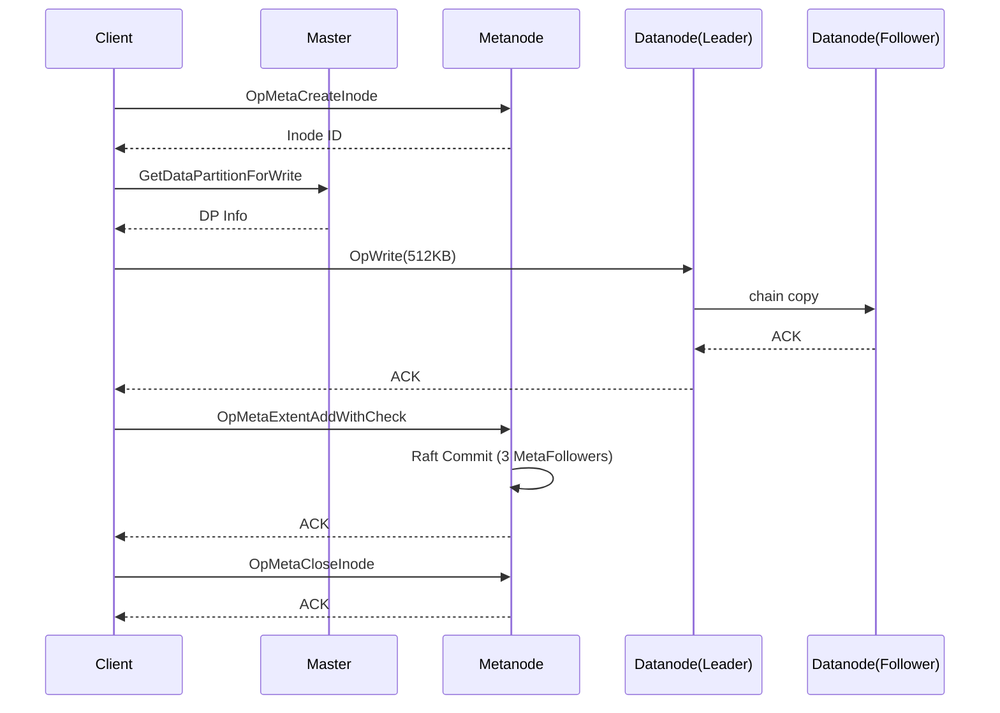
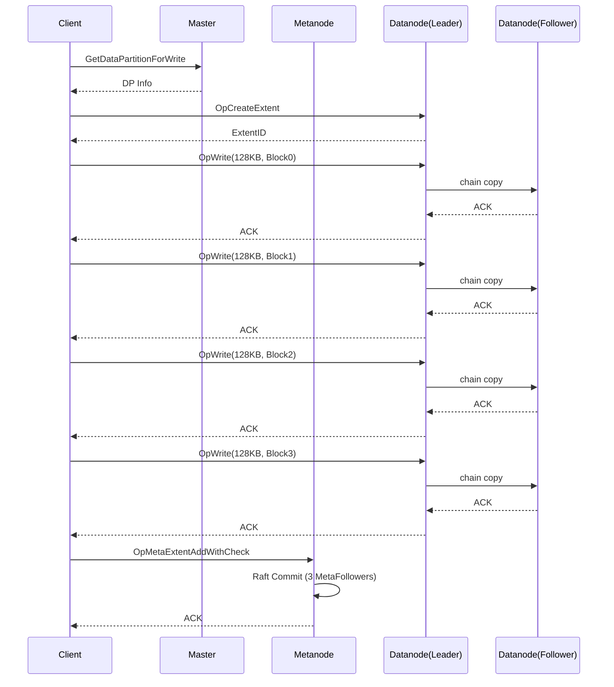

# CubeFS 写 512KB 文件深度分析

## 1. 关键常量与数据结构

### 1.1 核心常量（源码: `util/unit.go`, `master/config.go`）

| 常量 | 值 | 说明 |
|------|-----|------|
| `BlockSize` | 128KB (65536×2) | Normal Extent 的写入块大小 |
| `BlockCount` | 1024 | 每个 Extent 的块数 |
| `ExtentSize` | 128MB (1024×128KB) | Normal Extent 总大小 |
| `DefaultTinySizeLimit` | 1MB | Tiny Extent 大小上限 |
| `defaultReplicaNum` | 3 | 默认副本数 |

### 1.2 核心数据结构内存开销

#### ExtentKey 结构体（源码: `proto/extent_key.go`）

```go
type ExtentKey struct {
    FileOffset   uint64        // 8 bytes
    PartitionId  uint64        // 8 bytes
    ExtentId     uint64        // 8 bytes
    ExtentOffset uint64        // 8 bytes
    Size         uint32        // 4 bytes
    CRC          uint32        // 4 bytes
    SnapInfo     *ExtSnapInfo  // 8 bytes (指针)
}
// 结构体本身: 48 bytes
```

```go
type ExtSnapInfo struct {
    VerSeq  uint64  // 8 bytes
    IsSplit bool    // 1 byte (对齐到 8 bytes)
    ModGen  uint64  // 8 bytes
}
// SnapInfo: 24 bytes (含对齐填充)
```

| 场景 | 内存开销 |
|------|---------|
| ExtentKey（无 SnapInfo） | 48 bytes |
| ExtentKey（含 SnapInfo） | 48 + 24 = **72 bytes** |
| ExtentKey 序列化（V2） | **48 bytes** (4 header + 40 data + 4 checksum) |
| ExtentKey 序列化（V3） | **57 bytes** (4 + 40 + 4 + 9 ver fields) |

#### SortedExtents 结构体（源码: `metanode/sorted_extents.go`）

```go
type SortedExtents struct {
    sync.RWMutex          // ~24 bytes (锁开销)
    eks []proto.ExtentKey // 24 bytes (slice header) + N × 72 bytes
}
```

| 组件 | 内存 |
|------|------|
| SortedExtents 基础开销 | ~48 bytes |
| 每个 ExtentKey | ~72 bytes |

---

## 2. 写入路径分析

### 2.1 存储模式选择

CubeFS 的 `Streamer` 根据写入偏移和大小选择存储模式：

- **TinyExtentType（小文件模式）**: 当 `offset + size <= 1MB`（`tinySizeLimit`）时使用
- **NormalExtentType（普通模式）**: 当 `offset + size > 1MB` 时使用

**512KB 写入判定**: `0 + 512KB ≤ 1MB` → 走 **TinyExtentType** 路径

> 注：若向已有文件追加 512KB 且追加后总大小 > 1MB，则走 NormalExtentType。下文分两种场景分析。

### 2.2 场景 A: 新文件写入 512KB（TinyExtent 路径）

#### 写入流程

```
Client Write(512KB)
  │
  ├─① Open/Create Inode → Metanode (OpMetaCreateInode)
  │   └─ RPC #1: Client → Metanode
  │
  ├─② GetDataPartitionForWrite → Master (可能走缓存)
  │   └─ RPC #2: Client → Master (若无缓存)
  │
  ├─③ ExtentHandler.write()
  │   ├─ blksize = tinySizeLimit = 1MB
  │   ├─ 512KB < 1MB → 全部数据填入 1 个 Packet
  │   └─ flushPacket() → 发送到 sender goroutine
  │
  ├─④ allocateExtent (TinyExtent 无需 createExtent)
  │   ├─ GetDataPartitionForWrite 获取 DP
  │   ├─ GetConnect 获取连接
  │   └─ 无需 OpCreateExtent RPC（Tiny Extent 预分配）
  │
  ├─⑤ Packet 写入 Datanode
  │   ├─ RPC #3: Client → Datanode Leader (OpWrite)
  │   │   └─ Datanode Leader → Follower1 → Follower2 (链式复制)
  │   └─ 读取 Reply
  │
  ├─⑥ appendExtentKey → Metanode
  │   ├─ RPC #4: Client → Metanode (OpMetaExtentAddWithCheck)
  │   └─ Metanode 内部 Raft 共识 + RocksDB 持久化
  │
  └─⑦ Close/Flush
      └─ RPC #5: Client → Metanode (OpMetaCloseInode/Evict)
```

#### RPC 统计

| 序号 | RPC 类型 | 目标 | 说明 |
|------|---------|------|------|
| 1 | OpMetaCreateInode | Metanode | 创建 Inode |
| 2 | GetDataPartition | Master | 获取数据分区（首次，可能缓存） |
| 3 | OpWrite | Datanode | 写入 512KB 数据（含链式复制） |
| 4 | OpMetaExtentAddWithCheck | Metanode | 追加 ExtentKey |
| 5 | OpMetaCloseInode | Metanode | 关闭文件/ Evict Inode |

**总 RPC 次数: 5 次**（外部 RPC）

#### 元数据操作统计

| 操作 | 次数 | 说明 |
|------|------|------|
| Create Inode | 1 | 创建文件 inode |
| Append ExtentKey | 1 | 1 个 ExtentKey（512KB 数据在 1 个 Tiny Extent） |
| Update Inode Size | 1 | 更新文件大小 |
| Close/Evict Inode | 1 | 关闭文件 |
| Raft Log Append | 1×3 | 3 个 Metanode 副本各写 1 条 Raft Log |
| RocksDB Write | 1×3 | 3 个 Metanode 副本各写 1 次 RocksDB |

**元数据操作总计: 4 次逻辑操作，12 次物理操作（含副本）**

### 2.3 场景 B: NormalExtent 路径（追加写入 > 1MB 文件）

#### 写入流程

```
Client Write(512KB, offset > 0, offset+size > 1MB)
  │
  ├─① ExtentHandler.write()
  │   ├─ blksize = BlockSize = 128KB
  │   ├─ 512KB / 128KB = 4 个 Packet
  │   └─ 每个 128KB Packet 满后 flushPacket()
  │
  ├─② allocateExtent (NormalExtent 需要 createExtent)
  │   ├─ RPC #1: Client → Master (GetDataPartition, 首次)
  │   ├─ RPC #2: Client → Datanode (OpCreateExtent)
  │   └─ 获取 128MB 的 Extent
  │
  ├─③ 4 个 Packet 顺序写入同一 Datanode 连接
  │   ├─ RPC #3: OpWrite (Block 0: 0-128KB)
  │   ├─ RPC #4: OpWrite (Block 1: 128-256KB)
  │   ├─ RPC #5: OpWrite (Block 2: 256-384KB)
  │   └─ RPC #6: OpWrite (Block 3: 384-512KB)
  │       每次写入链式复制到 2 个 Follower
  │
  ├─④ flush() → waitForFlush() → appendExtentKey()
  │   └─ RPC #7: Client → Metanode (OpMetaExtentAddWithCheck)
  │       └─ 1 个 ExtentKey (Size=512KB, 4 个 Block 合并)
  │
  └─⑤ 无需单独 Close（文件已打开）
```

#### RPC 统计

| 序号 | RPC 类型 | 目标 | 说明 |
|------|---------|------|------|
| 1 | GetDataPartition | Master | 获取数据分区（首次，可能缓存） |
| 2 | OpCreateExtent | Datanode | 创建 128MB Extent |
| 3 | OpWrite | Datanode | 写 Block 0 (128KB) |
| 4 | OpWrite | Datanode | 写 Block 1 (128KB) |
| 5 | OpWrite | Datanode | 写 Block 2 (128KB) |
| 6 | OpWrite | Datanode | 写 Block 3 (128KB) |
| 7 | OpMetaExtentAddWithCheck | Metanode | 追加 ExtentKey |

**总 RPC 次数: 7 次**（外部 RPC，不含 Open/Close）

#### 元数据操作统计

| 操作 | 次数 | 说明 |
|------|------|------|
| Append ExtentKey | 1 | 1 个 ExtentKey（4 个 Block 合并为 1 个 Key，Size=512KB） |
| Update Inode Size | 1 | 更新文件大小 |
| Raft Log Append | 1×3 | 3 个 Metanode 副本 |
| RocksDB Write | 1×3 | 3 个 Metanode 副本 |

**元数据操作总计: 2 次逻辑操作，6 次物理操作（含副本）**

---

## 3. 元数据内存开销详细分析

### 3.1 场景 A: TinyExtent（512KB，1 个 ExtentKey）

| 组件 | 数量 | 单价 | 总内存 |
|------|------|------|--------|
| Inode | 1 | ~256-512 bytes | ~512 bytes |
| SortedExtents 基础 | 1 | 48 bytes | 48 bytes |
| ExtentKey（含 SnapInfo） | 1 | 72 bytes | 72 bytes |
| ExtentKey 序列化（持久化） | 1 | 57 bytes (V3) | 57 bytes |
| **总计（内存）** | | | **~632 bytes** |

### 3.2 场景 B: NormalExtent（512KB，1 个 ExtentKey）

| 组件 | 数量 | 单价 | 总内存 |
|------|------|------|--------|
| Inode | 1 | ~256-512 bytes | ~512 bytes |
| SortedExtents 基础 | 1 | 48 bytes | 48 bytes |
| ExtentKey（含 SnapInfo） | 1 | 72 bytes | 72 bytes |
| ExtentKey 序列化（持久化） | 1 | 57 bytes (V3) | 57 bytes |
| **总计（内存）** | | | **~632 bytes** |

> 注：NormalExtent 中 4 个 128KB Block 在同一 Extent 内连续写入，最终合并为 1 个 ExtentKey（Size=512KB），元数据开销与 TinyExtent 相同。

### 3.3 对比：如果不合并（理论最坏情况）

| 场景 | ExtentKey 数量 | 内存 |
|------|---------------|------|
| 理想合并 | 1 | 72 bytes |
| 每 Block 一个 Key | 4 | 288 bytes |
| 每 4KB 一个 Key | 128 | 9,216 bytes |

CubeFS 的设计通过 Block 合并（同一 Extent 内连续写入的 Block 在 `processReply` 中通过 `eh.key.Size += packet.Size` 合并），有效减少了 ExtentKey 数量。

---

## 4. IO 放大分析

### 4.1 场景 A: TinyExtent 路径

#### 写放大

| 层级 | 数据量 | 说明 |
|------|--------|------|
| 用户写入 | 512KB | 应用层数据 |
| Client Packet | 512KB | 1 个 Packet，无填充 |
| Datanode Leader 写盘 | 512KB | 精确写入 |
| Datanode Follower1 写盘 | 512KB | 链式复制 |
| Datanode Follower2 写盘 | 512KB | 链式复制 |
| **总磁盘写入** | **1.5MB** | 512KB × 3 副本 |

**写放大倍数 = 1.5MB / 512KB = 3x**（纯副本放大，无对齐填充）

#### 元数据 IO 放大

| 层级 | 写入量 | 说明 |
|------|--------|------|
| ExtentKey 序列化 | 57 bytes | 1 个 V3 格式 ExtentKey |
| Raft Log（3 副本） | ~200-300 bytes | 含 Raft 协议开销 |
| RocksDB Write（3 副本） | ~57 bytes × 3 | LSM-tree 写入 |
| **元数据总写入** | **~500-800 bytes** | |

**元数据写放大 = ~800 bytes / 512KB ≈ 0.15%**（极低）

#### Tiny Extent 空间放大

| 项目 | 大小 | 说明 |
|------|------|------|
| Tiny Extent 容量 | 1MB | `DefaultTinySizeLimit` |
| 实际使用 | 512KB | 用户数据 |
| **空间浪费** | **512KB (50%)** | Tiny Extent 内部碎片 |

> 注：Tiny Extent 的设计是多个小文件共享同一个 1MB 的 Tiny Extent，实际碎片率取决于负载。单个 512KB 文件占用半个 Tiny Extent。

### 4.2 场景 B: NormalExtent 路径

#### 写放大

| 层级 | 数据量 | 说明 |
|------|--------|------|
| 用户写入 | 512KB | 应用层数据 |
| Client Packets | 512KB | 4 × 128KB Packet，无填充 |
| Datanode Leader 写盘 | 512KB | 4 个 Block 写入 |
| Datanode Follower1 写盘 | 512KB | 链式复制 |
| Datanode Follower2 写盘 | 512KB | 链式复制 |
| **总磁盘写入** | **1.5MB** | 512KB × 3 副本 |

**写放大倍数 = 1.5MB / 512KB = 3x**（纯副本放大）

#### Normal Extent 空间放大

| 项目 | 大小 | 说明 |
|------|------|------|
| Extent 容量 | 128MB | `ExtentSize` |
| 实际使用 | 512KB | 用户数据 |
| **表观空间浪费** | **127.5MB** | 但 Extent 文件是稀疏的 |

> 注：CubeFS 的 Extent 文件采用稀疏分配，未写入的 Block 不会实际占用磁盘空间。`createExtent` 只是创建了文件元信息，实际磁盘占用仅 512KB × 3 = 1.5MB。

### 4.3 IO 放大对比总结

| 指标 | TinyExtent | NormalExtent |
|------|-----------|-------------|
| 写放大（副本） | 3x | 3x |
| 写放大（对齐） | 1x（无填充） | 1x（Block 对齐） |
| 总写放大 | **3x** | **3x** |
| 元数据 IO 放大 | ~0.15% | ~0.15% |
| 空间放大 | 50%（单文件，实际共享） | ~0（稀疏分配） |
| RPC 次数 | 5 | 7 |
| 元数据操作 | 4 逻辑 / 12 物理 | 2 逻辑 / 6 物理 |

---

## 5. 完整 RPC 时序图

### 5.1 TinyExtent 路径（512KB 新文件）



**RPC 总数: 5**

### 5.2 NormalExtent 路径（追加 512KB）



**RPC 总数: 7**

---

## 6. 综合结论

### 6.1 512KB 写入核心指标

| 指标 | TinyExtent（新文件） | NormalExtent（追加） |
|------|---------------------|---------------------|
| **RPC 次数** | **5 次** | **7 次** |
| **元数据逻辑操作** | **4 次** | **2 次** |
| **元数据物理操作（含副本）** | **12 次** | **6 次** |
| **元数据内存开销** | **~632 bytes** | **~632 bytes** |
| **ExtentKey 数量** | **1 个** | **1 个**（4 Block 合并） |
| **IO 写放大** | **3x**（副本） | **3x**（副本） |
| **元数据 IO 放大** | **~0.15%** | **~0.15%** |
| **空间放大** | 50%（单文件） | ~0%（稀疏分配） |

### 6.2 关键设计优势

1. **Block 合并机制**: NormalExtent 模式下，同一 Extent 内连续写入的 Block 在 `processReply` 中通过 `eh.key.Size += packet.Size` 合并为 1 个 ExtentKey，大幅减少元数据量
2. **TinyExtent 优化**: 小文件（<1MB）走 TinyExtent 路径，避免 CreateExtent RPC，减少 1 次 Datanode 交互
3. **稀疏分配**: NormalExtent 的 128MB Extent 采用稀疏文件，未写入部分不占磁盘空间
4. **链式复制**: 写入采用链式复制（Leader → Follower1 → Follower2），相比主从复制减少 Leader 网络压力

### 6.3 潜在优化方向

1. **批量 AppendExtentKey**: 多次小写入可批量提交 ExtentKey，减少 Metanode RPC
2. **EC 模式**: 使用纠删码替代 3 副本，可将写放大从 3x 降低到 ~1.5x（4+2 EC）
3. **Tiny Extent 共享**: 多个小文件共享同一 Tiny Extent，降低空间碎片率
4. **异步 Flush**: `enableAsyncFlush` 模式下 appendExtentKey 可异步执行，降低写入延迟

---

## 附录: 源码引用

| 文件 | 关键代码 |
|------|---------|
| `util/unit.go:40-46` | BlockSize=128KB, ExtentSize=128MB |
| `util/unit.go:79` | DefaultTinySizeLimit=1MB |
| `master/config.go:129` | defaultReplicaNum=3 |
| `proto/extent_key.go:58-67` | ExtentKey 结构体定义 |
| `metanode/sorted_extents.go:13-16` | SortedExtents 结构体 |
| `sdk/data/stream/extent_handler.go:231-290` | ExtentHandler.write() 分块逻辑 |
| `sdk/data/stream/extent_handler.go:739-818` | allocateExtent() 分配逻辑 |
| `sdk/data/stream/extent_handler.go:564-660` | appendExtentKey() 元数据提交 |
| `sdk/data/stream/packet.go:56-69` | NewWritePacket() Packet 创建 |
| `sdk/meta/operation.go:1211-1260` | appendExtentKey RPC 实现 |