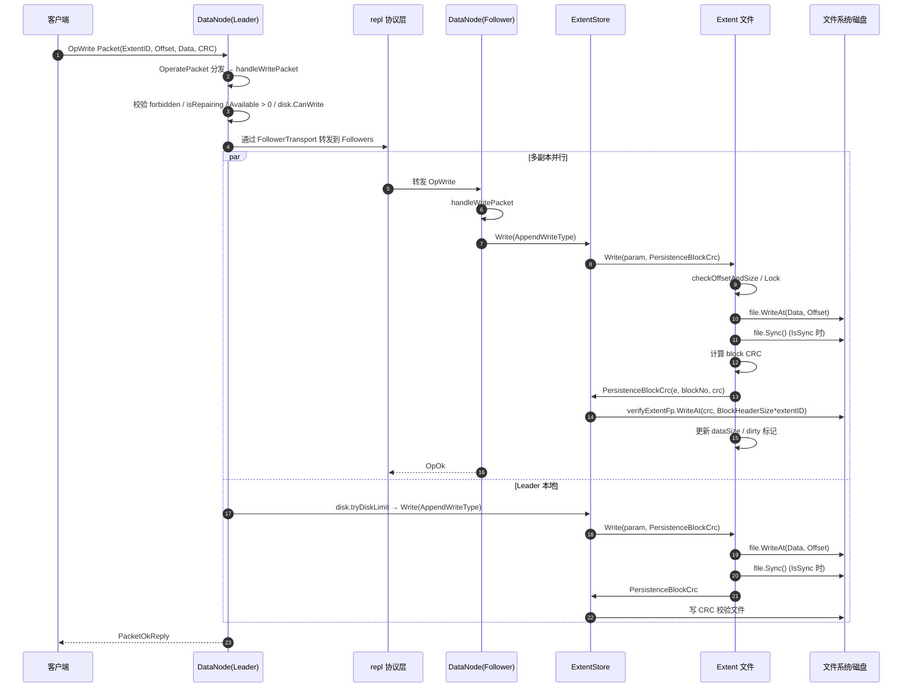
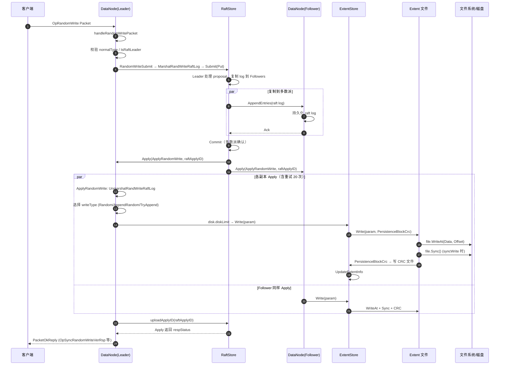
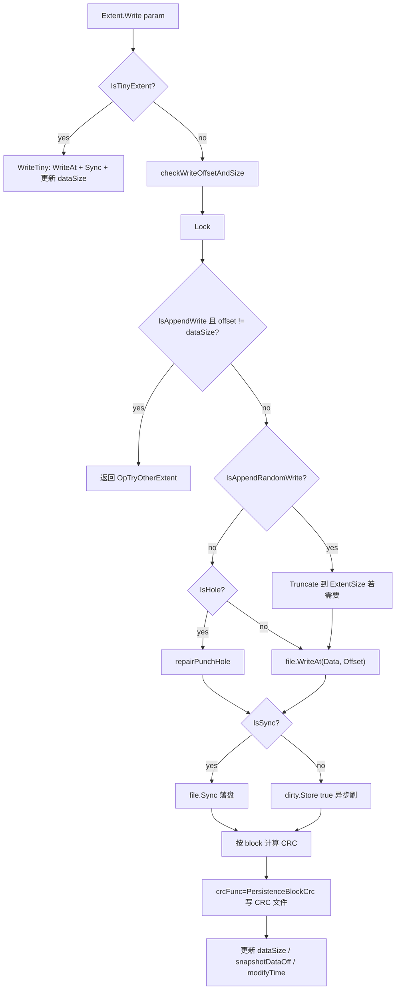
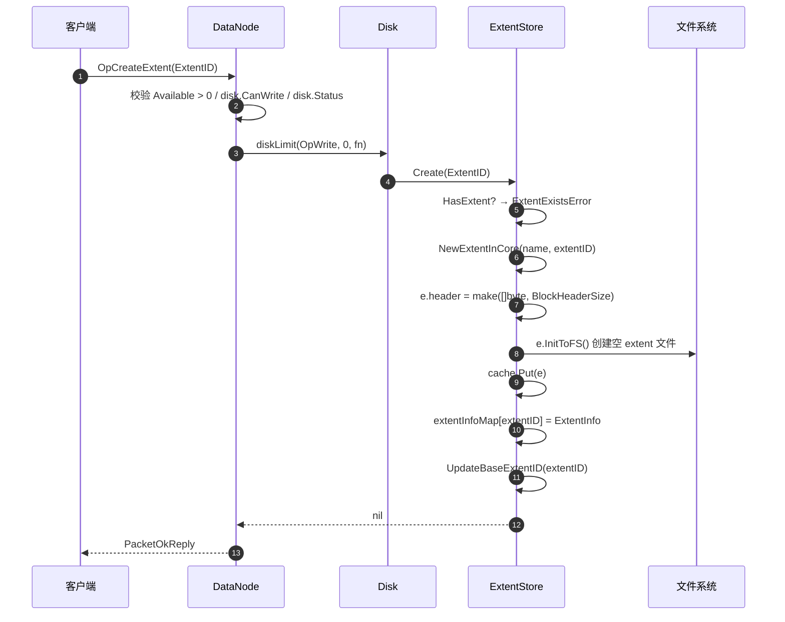

# CubeFS DataNode IO 数据持久化分析

## 一、结论

CubeFS DataNode 的 IO 数据持久化以 **Extent（区段）文件** 为基本单位，采用 **Append-Only 顺序写为主、Raft 强一致随机写为辅** 的双轨制设计：

- **Append 写路径**（`OpWrite` / `OpSyncWrite` / `OpBackupWrite`）：客户端直接写 Leader，Leader 通过 `repl` 协议把数据转发给 Follower 副本，各副本独立调用 `ExtentStore.Write → Extent.Write`，最终通过 `file.WriteAt + file.Sync` 落盘。**不经过 Raft**，靠复制协议保证多副本。
- **Random 写路径**（`OpRandomWrite` / `OpRandomWriteAppend` 等）：必须经过 **Raft 提议（Proposal）**，Leader 把写请求序列化为 raft log 复制到多数派后，在各副本的 `ApplyRandomWrite` 回调中统一调用 `ExtentStore.Write` 落盘，保证随机写的强一致性。

> **一句话总结**：DataNode 持久化 = `OperatePacket 分发` +（`repl 复制` 或 `Raft 复制`）+ `ExtentStore.Write` + `Extent.WriteAt/Sync` + `PersistenceBlockCrc`。

---

## 二、核心数据结构

| 结构 | 文件 | 职责 |
|------|------|------|
| `Disk` | `datanode/disk.go` | 物理磁盘抽象，做 QoS 限速（`diskLimit`/`tryDiskLimit`）、状态管理 |
| `DataPartition` | `datanode/partition.go` | 数据分区，持有 `ExtentStore`、Raft 实例、版本信息 |
| `ExtentStore` | `datanode/storage/extent_store.go` | 分区存储引擎，管理所有 Extent、CRC 校验文件、元数据文件 |
| `Extent` | `datanode/storage/extent.go` | 单个区段文件（数据 + header），封装 `WriteAt`/`Sync`/`Read` |
| `Packet` | `datanode/repl/packet.go` | 网络数据包，承载 Op 编码、ExtentID、Offset、Data、CRC |

关键常量（`extent_store.go`）：
```go
RandomWriteType       = 2
AppendWriteType       = 1
AppendRandomWriteType = 4
```

Extent 文件布局：
- 数据部分：`util.BlockCount * util.BlockSize`（默认 128MB，每 block 64KB）
- Header 部分：存放每个 block 的 CRC（`util.PerBlockCrcSize`），由独立的 `verifyExtentFp`（CRC 文件）保存

---

## 三、IO 分发总览

入口函数 `DataNode.OperatePacket`（`wrap_operator.go:88`）根据 `p.Opcode` 分发：

```go
switch p.Opcode {
case proto.OpCreateExtent:
    s.handlePacketToCreateExtent(p)          // 创建空 extent 文件
case proto.OpWrite, proto.OpSyncWrite, proto.OpBackupWrite:
    s.handleWritePacket(p)                   // Append 写，不走 raft
case proto.OpRandomWrite, proto.OpSyncRandomWrite,
     proto.OpRandomWriteAppend, proto.OpSyncRandomWriteAppend,
     proto.OpTryWriteAppend, proto.OpSyncTryWriteAppend,
     proto.OpRandomWriteVer, proto.OpSyncRandomWriteVer:
    s.handleRandomWritePacket(p)             // 随机写，走 raft
case proto.OpMarkDelete, proto.OpSplitMarkDelete:
    s.handleMarkDeletePacket(p, c)           // 标记删除
case proto.OpStreamRead, proto.OpBackupRead:
    s.handleStreamReadPacket(p, c, StreamRead) // 读
...
}
```

---

## 四、Append 写持久化时序图

`handleWritePacket`（`wrap_operator.go:912`）流程：

1. 校验分区未禁止写、磁盘可写、有空间
2. 按 `util.BlockSize`（64KB）分块循环写
3. `partition.disk.tryDiskLimit` 做 QoS 限速
4. 构造 `WriteParam`（`WriteType=AppendWriteType`）
5. `store.Write(param)` → `Extent.Write` → `file.WriteAt` + `file.Sync`
6. 多副本由上层 `repl` 协议（`FollowerTransport`）转发



**TinyExtent 分支**：当 `proto.IsTinyExtentType(p.ExtentType)` 为真时走 `Extent.WriteTiny`（`extent.go:468`），同样是 `WriteAt + Sync`，但 offset 必须等于 `dataSize`（严格 append），用于小文件合并存储。

---

## 五、Random 写持久化时序图（Raft 路径）

`handleRandomWritePacket`（`wrap_operator.go:1058`）→ `RandomWriteSubmit`（`partition_op_by_raft.go:321`）→ Raft `Submit` → `ApplyRandomWrite`（`partition_op_by_raft.go:224`）。

随机写必须满足：
- 分区是 normal 类型（支持 raft）
- 当前节点是 Raft Leader



`ApplyRandomWrite` 的关键容错：
- 出现 `ErrStoreAlreadyClosed` → 返回 `OpStoreClosed`，不 panic
- 出现磁盘错误 → `panic(newRaftApplyError(err))`，触发 raft 状态机重放
- 出现 `ExtentNotFoundError` → 静默返回
- 普通错误 → 重试最多 20 次

---

## 六、Extent 文件落盘细节

### 6.1 Extent.Write（`extent.go:499`）



核心落盘两步：
1. **数据落盘**：`e.file.WriteAt(param.Data[:param.Size], int64(param.Offset))`
2. **强制刷盘**：`if param.IsSync { e.file.Sync() }`（`fdatasync`/`fsync` 语义）

`IsSync` 由 op 决定：`OpSyncWrite`/`OpSyncRandomWrite`/`OpSyncRandomWriteAppend` 等带 `Sync` 的为同步写，立即 fsync；否则只 `WriteAt`，由 `dirty` 标记 + 后台异步刷。

### 6.2 CRC 持久化（`persistence_crc.go`）

`PersistenceBlockCrc(e, blockNo, blockCrc)`：
- 仅对 normal DP 生效
- 计算文件索引 `fIdx = blockNo * PerBlockCrcSize / BlockHeaderSize`
- 写入位置 `verifyStart = startIdx + BlockHeaderSize*extentID`
- 更新内存 `e.header` 并 `fp.WriteAt` 到 CRC 校验文件（`ExtCrcHeaderFileName`）

CRC 文件与数据文件分离存储，用于启动时校验 extent 数据完整性。

---

## 七、CreateExtent 流程

`handlePacketToCreateExtent`（`wrap_operator.go:243`）→ `ExtentStore.Create`（`extent_store.go:365`）：



`InitToFS` 创建固定大小（`ExtentSize`，128MB）的稀疏文件并写入 header。

---

## 八、MarkDelete 流程

`handleMarkDeletePacket`（`wrap_operator.go:763`）/ `handleBatchMarkDeletePacket`（`wrap_operator.go:805`）：

- **TinyExtent / Snapshot 删除**：`store.MarkDelete(extentID, offset, size)` → `punchDelete` 用 `fallocate(FALLOC_FL_PUNCH_HOLE)` 打洞 + 记录到 `RecordTinyDelete` 删除日志
- **NormalExtent 删除**：`store.MarkDelete(extentID, 0, 0)` → 整 extent 标记删除，后续由 GC 回收
- 即使分区 forbidden 也允许 mark delete，避免产生 orphan extents

---

## 九、关键设计要点

1. **写不经过 Raft（Append 路径）**：CubeFS 的主写路径靠 `repl` 协议的多副本复制，不强制走 raft，降低延迟；只有需要强一致性的随机写才走 raft。
2. **分块写**：`handleWritePacket` 把大请求按 `util.BlockSize`（64KB）切分，每块独立 `WriteAt`，便于限速和 CRC 计算。
3. **同步 vs 异步刷盘**：通过 op 中的 `Sync` 标志区分，同步写立即 `file.Sync()`，异步写靠 `dirty` 标记 + 后台 flush。
4. **CRC 与数据分离**：每个 block 的 CRC 单独存到 `verifyExtentFp` 文件，启动时 `CheckBaseExtentCrc` 校验，保证静默损坏可发现。
5. **磁盘 QoS**：`disk.diskLimit`（阻塞）/ `tryDiskLimit`（非阻塞返回 `LimitedIoError`）对每张盘做 IOPS/流量限速，防止单盘打满影响其他分区。
6. **Raft Apply 容错**：`ApplyRandomWrite` 对磁盘错误 panic 触发重放，对 store closed / extent not found 静默处理，对普通错误重试 20 次。
7. **Extent 文件模型**：一个 extent = 一个文件，`ExtentSize` 128MB，append 写严格递增 offset，随机写在 `modAppend` 分区才允许（`AppendRandomWriteType`）。

---

## 十、关键代码索引

| 功能 | 文件:行 |
|------|---------|
| Packet 分发 | `datanode/wrap_operator.go:88` `OperatePacket` |
| Append 写处理 | `datanode/wrap_operator.go:912` `handleWritePacket` |
| Random 写处理 | `datanode/wrap_operator.go:1058` `handleRandomWritePacket` |
| CreateExtent 处理 | `datanode/wrap_operator.go:243` `handlePacketToCreateExtent` |
| MarkDelete 处理 | `datanode/wrap_operator.go:763` `handleMarkDeletePacket` |
| Raft 随机写提交 | `datanode/partition_op_by_raft.go:321` `RandomWriteSubmit` |
| Raft Apply 回调 | `datanode/partition_op_by_raft.go:224` `ApplyRandomWrite` |
| 存储引擎 Write | `datanode/storage/extent_store.go:665` `ExtentStore.Write` |
| Extent 落盘 | `datanode/storage/extent.go:499` `Extent.Write` |
| TinyExtent 写 | `datanode/storage/extent.go:468` `Extent.WriteTiny` |
| CRC 持久化 | `datanode/storage/persistence_crc.go` `PersistenceBlockCrc` |
| Extent 创建 | `datanode/storage/extent_store.go:365` `ExtentStore.Create` |
| 磁盘 QoS | `datanode/disk.go:376` `Disk.diskLimit` / `:394` `tryDiskLimit` |
| repl 复制协议 | `datanode/repl/repl_protocol.go` `ReplProtocol` |