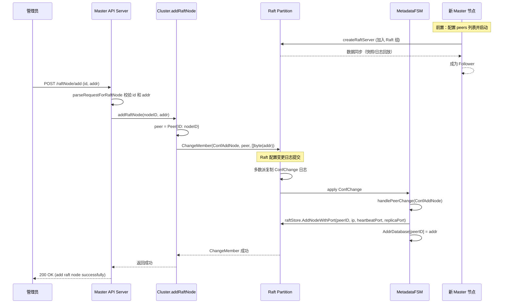
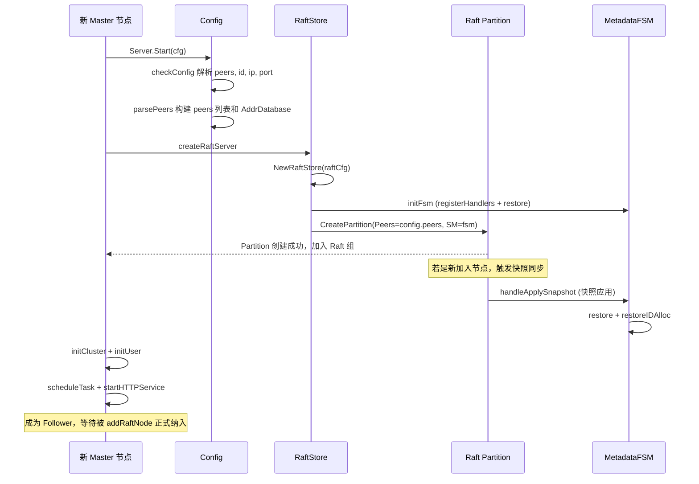
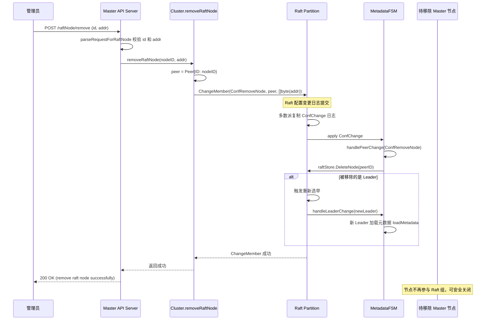
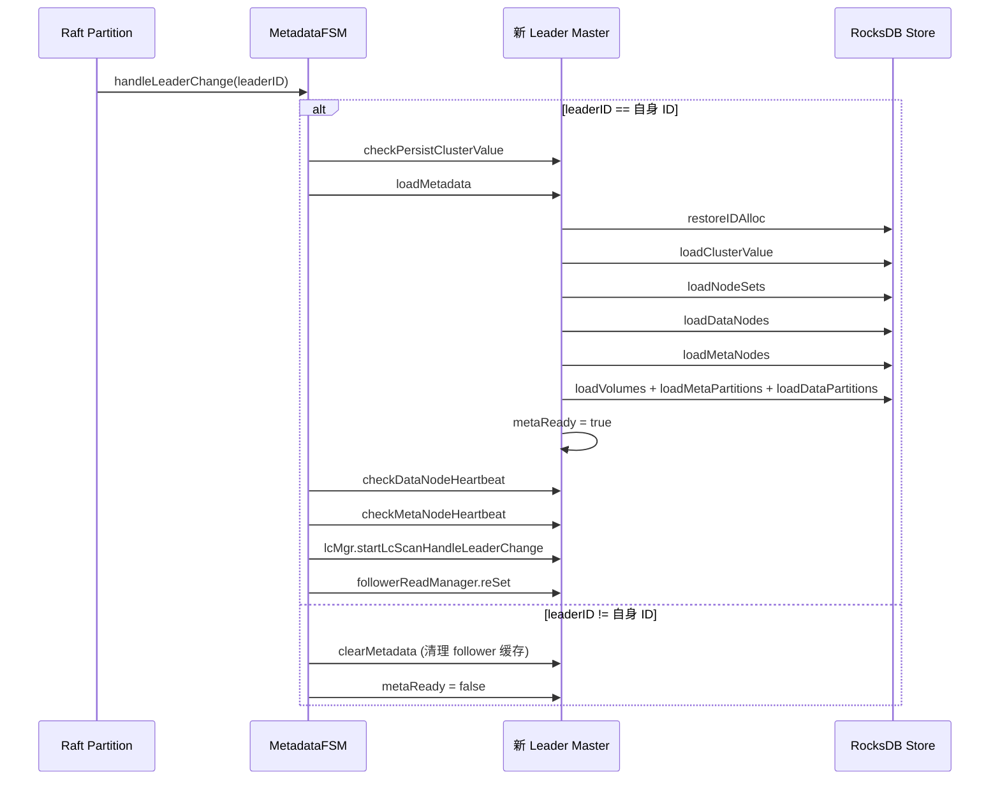

# CubeFS MasterNode 扩容与缩容流程分析

本文档基于 CubeFS master 模块源码（`master/server.go`、`master/config.go`、`master/api_service.go`、`master/api_args_parse.go`、`master/metadata_fsm_op.go`、`master/master_manager.go`）分析 Master 节点的扩容（添加节点）与缩容（移除节点）流程，并以 Mermaid 时序图形式呈现。

---

## 一、术语与关键数据结构

| 术语 | 说明 |
| --- | --- |
| Master Node | CubeFS 主节点，通过 Raft 多副本保证元数据一致性，负责集群调度 |
| Raft Group | Master 节点组成的 Raft 一致性组，默认 3 副本 |
| Raft Partition | Raft 组实例，由 `raftstore.CreatePartition` 创建，ID 为 `GroupID` |
| ConfChange | Raft 配置变更，包括 `ConfAddNode` 和 `ConfRemoveNode` |
| Leader/Follower | Raft 组中的主/从角色，只有 Leader 处理写请求 |
| `AddrDatabase` | 全局 map，维护 `peerID -> addr` 映射，用于寻址 |
| `clusterConfig.peers` | 启动配置中解析的初始 Raft 成员列表 |
| 扩容 | 动态向 Master Raft 组添加新成员节点 |
| 缩容 | 动态从 Master Raft 组移除成员节点 |

关键源码位置：
- 启动入口：`server.go: Server.Start` → `createRaftServer` → `initCluster`
- 配置解析：`config.go: parsePeers`，`server.go: checkConfig`
- 扩容 API：`api_service.go: addRaftNode` → `metadata_fsm_op.go: Cluster.addRaftNode`
- 缩容 API：`api_service.go: removeRaftNode` → `metadata_fsm_op.go: Cluster.removeRaftNode`
- 成员变更回调：`master_manager.go: handlePeerChange`
- Leader 切换回调：`master_manager.go: handleLeaderChange`

---

## 二、MasterNode 扩容流程

### 2.1 流程概述

Master 节点扩容指动态向 Master Raft 组添加新的成员节点。与 MetaNode/DataNode 扩容不同，Master 扩容直接操作 Raft 层的配置变更，而非通过上层拓扑管理。

调用链：`HTTP /raftNode/add` → `Server.addRaftNode` → `Cluster.addRaftNode` → `Raft Partition.ChangeMember`。

主要步骤：
1. **参数校验**：`parseRequestForRaftNode` 解析 `id` 和 `addr`，校验地址格式。
2. **Raft 配置变更**：`Cluster.addRaftNode` 构造 `raftProto.Peer{ID: nodeID}`，调用 `c.partition.ChangeMember(ConfAddNode, peer, []byte(addr))`。
3. **Raft 提交与复制**：ChangeMember 作为 Raft 日志提交，经多数派复制后 apply。
4. **成员变更回调**：`handlePeerChange` 处理 `ConfAddNode`，调用 `m.raftStore.AddNodeWithPort` 将新节点注册到 Raft 网络，并更新 `AddrDatabase`。
5. **新节点加入**：新节点需提前以配置文件中的 `peers` 列表启动，完成 Raft 数据同步后成为 Follower。

### 2.2 前置条件

新 Master 节点加入前必须完成以下准备工作：
1. **配置 `peers` 列表**：配置文件中 `peers` 需包含所有节点（含新节点）的 `id:ip:port`，逗号分隔。
2. **配置 `id`**：新节点需配置唯一的 `id`，与 `peers` 中声明一致。
3. **启动 Raft 服务**：新节点调用 `createRaftServer` 创建 RaftStore 和 Partition，以 Follower 身份加入。
4. **数据同步**：新节点通过 Raft 快照或日志回放同步集群元数据。

### 2.3 扩容时序图

### 2.4 新节点启动初始化流程

---

## 三、MasterNode 缩容流程

### 3.1 流程概述

Master 节点缩容指动态从 Master Raft 组移除成员节点。与扩容对称，通过 `ConfRemoveNode` 实现。

调用链：`HTTP /raftNode/remove` → `Server.removeRaftNode` → `Cluster.removeRaftNode` → `Raft Partition.ChangeMember`。

主要步骤：
1. **参数校验**：`parseRequestForRaftNode` 解析 `id` 和 `addr`。
2. **Raft 配置变更**：`Cluster.removeRaftNode` 构造 `raftProto.Peer{ID: nodeID}`，调用 `c.partition.ChangeMember(ConfRemoveNode, peer, []byte(addr))`。
3. **Raft 提交与复制**：ChangeMember 日志经多数派复制后 apply。
4. **成员变更回调**：`handlePeerChange` 处理 `ConfRemoveNode`，调用 `m.raftStore.DeleteNode` 从 Raft 网络中移除节点。
5. **节点下线**：被移除的节点不再参与 Raft 组，可安全关闭。

### 3.2 注意事项

- **多数派保证**：缩容后剩余节点数必须满足 Raft 多数派（`n/2+1`），否则集群不可用。3 节点缩容到 2 节点后仍可用，但容错性降低。
- **Leader 缩容**：若移除的是 Leader 节点，Raft 会触发重新选举。
- **配置文件更新**：缩容后需更新所有存活节点的 `peers` 配置，防止重启时使用旧配置。
- **建议顺序**：建议先添加新节点、确认数据同步完成后再移除旧节点。

### 3.3 缩容时序图

---

## 四、Leader 切换与元数据加载

Master 扩缩容可能触发 Leader 切换。`handleLeaderChange` 是 Raft 层的回调，在新 Leader 产生时执行关键初始化。

---

## 五、关键机制对比

| 维度 | 扩容（addRaftNode） | 缩容（removeRaftNode） |
| --- | --- | --- |
| API 路径 | `POST /raftNode/add` | `POST /raftNode/remove` |
| Raft 操作 | `ConfAddNode` | `ConfRemoveNode` |
| 回调处理 | `raftStore.AddNodeWithPort` | `raftStore.DeleteNode` |
| AddrDatabase | 新增 `peerID -> addr` 映射 | 无显式删除（节点已不可达） |
| 前置条件 | 新节点需配置 peers 并启动 | 无（在线移除） |
| 后置操作 | 无需更新配置（动态生效） | 建议更新存活节点 peers 配置 |
| 多数派影响 | 增加副本，提高容错 | 减少副本，需保证多数派存活 |
| Leader 影响 | 无 | 若移除 Leader 则触发重新选举 |
| 数据同步 | 新节点通过快照/日志同步 | 无（被移除节点直接退出） |

---

## 六、与 MetaNode/DataNode 扩缩容的区别

| 维度 | Master Node | MetaNode/DataNode |
| --- | --- | --- |
| 扩缩容层级 | Raft 组成员变更（底层） | 上层拓扑管理（Zone/NodeSet） |
| 数据迁移 | Raft 自动同步（快照+日志） | 主动迁移每个 MP/DP 副本 |
| 操作接口 | `addRaftNode` / `removeRaftNode` | `addMetaNode` / `decommissionMetaNode` / `migrateMetaNode` |
| 持久化 | Raft 日志（FSM apply） | `syncAddMetaNode` / `syncDeleteMetaNode` 等 |
| 复杂度 | 简单（单一 Raft 配置变更） | 复杂（涉及副本选择、校验、并发控制） |
| 触发方式 | 手动 API 调用 | 手动 API 或自动调度 |

---

## 七、风险与注意事项

1. **多数派风险**：缩容后必须保证 `存活节点数 >= floor(总节点数/2) + 1`。3 节点缩容到 1 节点会导致集群不可用。
2. **配置一致性**：扩缩容后需同步更新所有节点的 `peers` 配置文件，否则重启后可能使用过期配置。
3. **Leader 缩容**：移除 Leader 会触发选举，期间集群短暂不可写（通常秒级恢复）。
4. **新节点数据同步**：新节点加入后需完成数据同步才能正常参与 Raft，大集群快照传输可能耗时较长。
5. **网络分区**：扩缩容期间若发生网络分区，可能导致配置变更失败或脑裂，需监控 Raft 状态。
6. **滚动升级场景**：建议采用"先加后删"策略——先加入新节点确认稳定，再移除旧节点，保证可用性。
7. **`AddrDatabase` 全局状态**：`handlePeerChange` 更新全局 `AddrDatabase`，影响 Leader 寻址，需确保变更及时生效。

---

## 八、附录：源码索引

| 功能 | 文件 | 函数 |
| --- | --- | --- |
| Master 启动 | `server.go` | `Server.Start` |
| Raft 服务创建 | `server.go` | `Server.createRaftServer` |
| 配置校验 | `server.go` | `Server.checkConfig` |
| Peers 解析 | `config.go` | `clusterConfig.parsePeers` |
| 集群初始化 | `server.go` | `Server.initCluster` |
| 添加 Raft 节点 API | `api_service.go` | `Server.addRaftNode` |
| 移除 Raft 节点 API | `api_service.go` | `Server.removeRaftNode` |
| 请求参数解析 | `api_args_parse.go` | `parseRequestForRaftNode` |
| 添加 Raft 节点实现 | `metadata_fsm_op.go` | `Cluster.addRaftNode` |
| 移除 Raft 节点实现 | `metadata_fsm_op.go` | `Cluster.removeRaftNode` |
| 成员变更回调 | `master_manager.go` | `Server.handlePeerChange` |
| Leader 切换回调 | `master_manager.go` | `Server.handleLeaderChange` |
| 元数据加载 | `master_manager.go` | `Server.loadMetadata` |
| FSM 初始化 | `server.go` | `Server.initFsm` |
| GraphQL 接口 | `gapi_cluster.go` | `ClusterService.addRaftNode` / `ClusterService.removeRaftNode` |