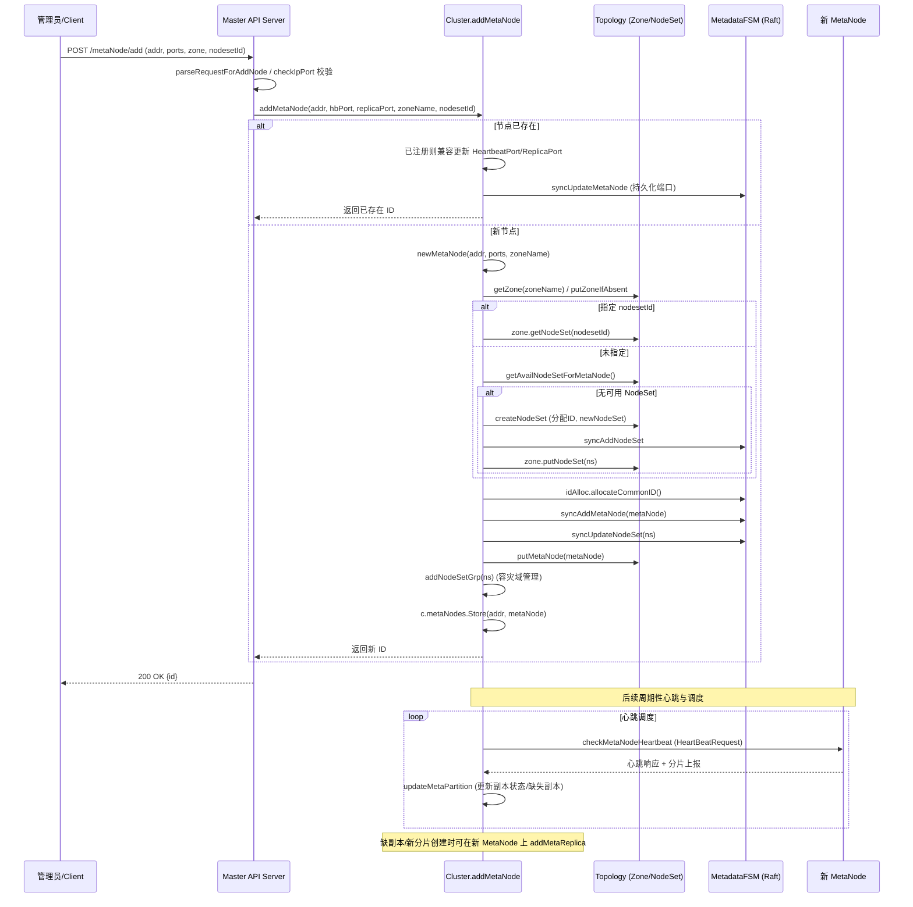
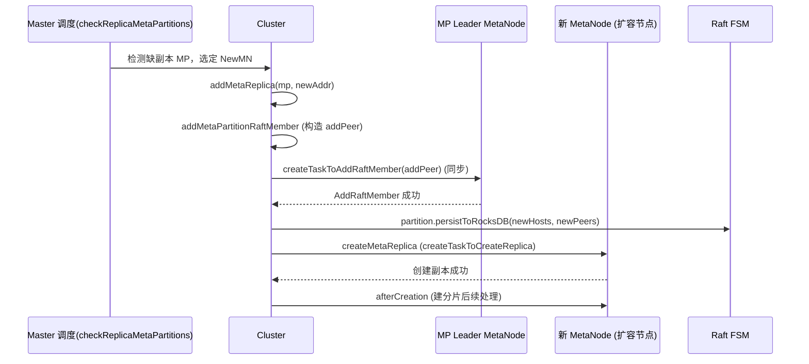
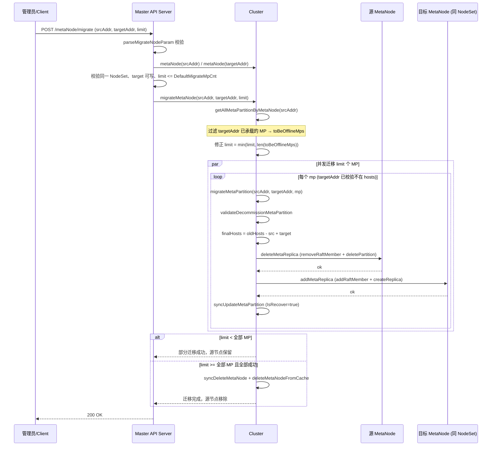
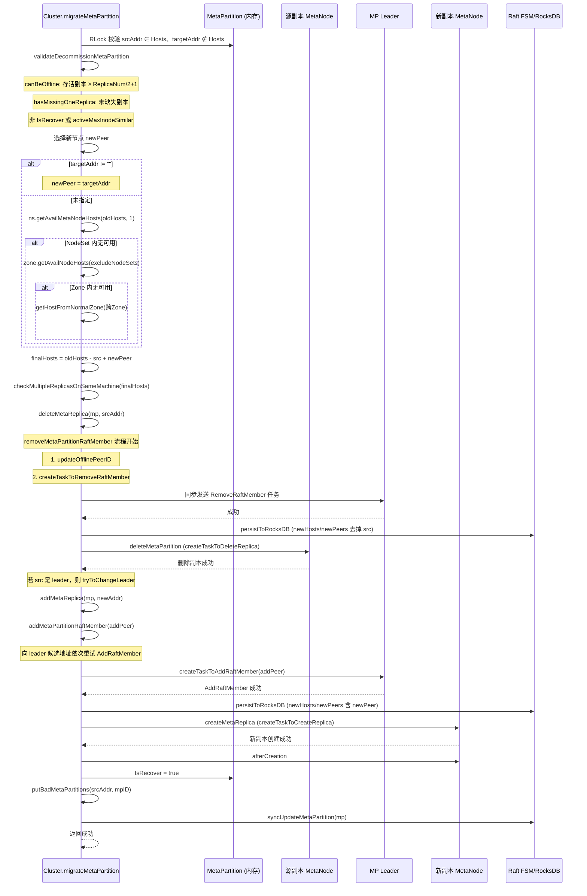

# CubeFS MetaNode 扩容与缩容流程分析

本文档基于 CubeFS master 模块源码（`master/cluster.go`、`master/cluster_task.go`、`master/api_service.go`、`master/meta_partition.go`、`master/topology.go`）分析 MetaNode 的扩容（添加节点）与缩容（下线/迁移节点）流程，并以 Mermaid 时序图形式呈现。

---

## 一、术语与关键数据结构

| 术语 | 说明 |
| --- | --- |
| MetaNode | 元数据节点，承载 MetaPartition（元数据分片）副本 |
| MetaPartition (MP) | 元数据分片，基于 Raft 多副本一致性 |
| Zone | 可用区，集群顶层拓扑单元 |
| NodeSet | Zone 下的节点集合，容量由 `nodeSetCapacity` 配置 |
| Raft Member | MP 的 Raft 组成员，对应一个 MetaNode 上的副本 |
| Decommission（缩容/下线） | 将某 MetaNode 上的 MP 副本迁移到其他节点后，从集群移除该节点 |
| Migrate（迁移） | 将某 MetaNode 上的部分 MP 副本迁移到指定目标节点（可带 limit） |
| 扩容 | 新增 MetaNode 到集群，后续 MP/副本可被调度到新节点 |

关键源码位置：
- 扩容入口：`api_service.go: addMetaNode` → `cluster.go: Cluster.addMetaNode`
- 迁移入口：`api_service.go: migrateMetaNodeHandler` → `cluster.go: Cluster.migrateMetaNode`
- 下线入口：`api_service.go: decommissionMetaNode` → `cluster.go: Cluster.decommissionMetaNode`
- 分片迁移：`cluster_task.go: migrateMetaPartition / decommissionMetaPartition`
- 副本操作：`cluster_task.go: addMetaReplica / deleteMetaReplica / addMetaPartitionRaftMember / removeMetaPartitionRaftMember`

---

## 二、MetaNode 扩容流程

### 2.1 流程概述

扩容指将新的 MetaNode 加入集群，使其可承载新的 MetaPartition 副本。扩容本身不立即迁移已有分片，而是把节点纳入拓扑（Zone/NodeSet），由后续创建卷、创建分片、补副本等调度自动使用。

调用链：`HTTP /metaNode/add` → `Server.addMetaNode` → `Cluster.addMetaNode`。

主要步骤：
1. 参数校验（地址合法性、端口、是否启用 raftPartitionCanUseDifferentPort）。
2. 若节点已存在，兼容更新心跳/副本端口后返回。
3. 创建 `MetaNode` 对象，确定所属 Zone（不存在则创建）。
4. 确定 NodeSet：指定则校验；未指定则选可用 NodeSet，无可用则创建新 NodeSet。
5. 分配节点 ID（`idAlloc.allocateCommonID`）。
6. 通过 Raft 持久化：`syncAddMetaNode` + `syncUpdateNodeSet`。
7. 更新内存拓扑：`c.t.putMetaNode`、加入 NodeSetGrp（容灾域管理）、`c.metaNodes.Store`。
8. 后续心跳与调度：master 周期性心跳、检查 MP 副本数，缺副本时会在新节点上创建副本。

### 2.2 扩容时序图



### 2.3 扩容后副本补全机制

扩容后，新节点并不会立即承接已有 MP。触发在新节点上创建副本的路径主要有：
- **创建新卷/新 MP**：`vol.addMetaPartitions` → 选择 hosts 时调用 `getAvailMetaNodeHosts`，可能命中新节点。
- **副本缺失补全**：`checkReplicaMetaPartitions` 检测到 `lackReplicaMetaPartitions`，由调度逻辑调用 `addMetaReplica` 在新节点上创建副本。
- `addMetaReplica` 流程：构造 `addPeer` → `addMetaPartitionRaftMember`（向 leader 发送 AddRaftMember 任务）→ `persistToRocksDB` → `createMetaReplica`（向新节点发送创建副本任务）→ `afterCreation`。



---

## 三、MetaNode 缩容流程

### 3.1 流程概述

缩容包含两种操作：
- **Decommission（下线）**：`Cluster.decommissionMetaNode(metaNode)` 等价于 `migrateMetaNode(metaNode.Addr, "", 0)`，即不指定目标节点、迁移全部 MP 后删除节点。
- **Migrate（迁移）**：`migrateMetaNode(srcAddr, targetAddr, limit)`，可指定目标节点和迁移数量上限；当迁移完所有 MP（limit >= 全部）时，会删除源节点。

缩容核心是对源节点上的每个 MetaPartition 执行 `migrateMetaPartition`：
1. `getAllMetaPartitionByMetaNode(srcAddr)`：获取源节点所有 MP。
2. 过滤掉目标节点已承载的 MP（迁移场景）。
3. 并发（受 `limit` 控制）对每个 MP 调用 `migrateMetaPartition(srcAddr, targetAddr, mp)`。
4. 全部迁移完成后，`syncDeleteMetaNode` + `deleteMetaNodeFromCache` 删除源节点。

`migrateMetaPartition` 单个分片流程：
1. 校验源地址在 MP.Hosts 中、目标地址不在。
2. `validateDecommissionMetaPartition`：
   - `canBeOffline`：下线后存活副本数需 ≥ `ReplicaNum/2+1`（多数派）。
   - `hasMissingOneReplica`：已缺失副本则禁止再下线。
   - 若 `IsRecover` 且 `activeMaxInodeSimilar` 不满足，禁止下线。
3. 选择新节点（targetAddr 优先；否则在 NodeSet → Zone → 跨 Zone 逐级选）。
4. 计算 `finalHosts`（去掉 src，加上新节点），校验同机多副本。
5. `deleteMetaReplica(mp, srcAddr)`：先移除 Raft 成员，再发送删除副本任务。
6. `addMetaReplica(mp, newAddr)`：添加 Raft 成员并创建副本。
7. 设置 `IsRecover=true`，加入 bad MP 集合，`syncUpdateMetaPartition` 持久化。

### 3.2 缩容（下线）总体时序图

```mermaid
sequenceDiagram
    participant Admin as 管理员/Client
    participant API as Master API Server
    participant C as Cluster
    participant SrcMN as 源 MetaNode (待下线)
    participant NewMN as 目标/新 MetaNode
    participant FSM as Raft FSM

    Admin->>API: POST /metaNode/decommission (offLineAddr, limit)
    API->>API: parseDecomNodeReq 校验
    API->>C: metaNode(offLineAddr) 校验存在
    API->>C: decommissionMetaNode(metaNode)
    C->>C: migrateMetaNode(srcAddr, "", limit)

    C->>C: 检查 ForbidMpDecommission 开关
    C->>C: metaNode.MigrateLock.Lock()
    C->>C: getAllMetaPartitionByMetaNode(srcAddr)
    Note over C: 获取待下线 MP 列表 toBeOfflineMps
    C->>C: metaNode.ToBeOffline = true; MaxMemAvailWeight = 1

    par 并发迁移 (limit 控制)
        loop 每个 mp
            C->>C: migrateMetaPartition(srcAddr, "", mp)
            C->>C: validateDecommissionMetaPartition(mp, srcAddr)
            C->>C: 选择新节点 (NodeSet→Zone→跨Zone)
            C->>SrcMN: deleteMetaReplica: removeMetaPartitionRaftMember
            SrcMN-->>C: 移除 Raft 成员成功
            C->>SrcMN: deleteMetaPartition (createTaskToDeleteReplica)
            SrcMN-->>C: 删除旧副本成功
            C->>NewMN: addMetaReplica: addMetaPartitionRaftMember
            NewMN-->>C: 添加 Raft 成员成功
            C->>FSM: persistToRocksDB (newHosts/newPeers)
            C->>NewMN: createMetaReplica (创建副本)
            NewMN-->>C: 新副本创建成功
            C->>FSM: syncUpdateMetaPartition (IsRecover=true)
        end
    end

    alt limit < 全部 MP
        C-->>API: 返回部分迁移成功（节点保留）
    else 全部迁移完成
        C->>FSM: syncDeleteMetaNode(metaNode)
        C->>C: deleteMetaNodeFromCache(metaNode)
        Note over C: c.metaNodes.Delete + c.t.deleteMetaNode + metaNode.clean()
        C-->>API: 下线成功
    end

    API-->>Admin: 200 OK
```

### 3.3 迁移（指定目标节点）时序图

迁移与下线共用 `migrateMetaNode`，区别在于：
- 指定 `targetAddr`，且 API 层校验源/目标必须在同一 NodeSet、目标可写且未超分片数限制。
- `limit` 控制迁移数量；若 `limit < 全部 MP`，迁移后节点保留，不删除源节点。



### 3.4 单个 MetaPartition 迁移详细时序图

下图为 `migrateMetaPartition` 内部的详细交互，适用于下线和迁移场景。



---

## 四、关键校验与并发控制

| 机制 | 说明 |
| --- | --- |
| `ForbidMpDecommission` | 集群级开关，禁止 MP 下线/迁移 |
| `MigrateLock` | MetaNode 级迁移锁，保证同一节点同一时刻只有一个迁移/下线任务 |
| `canBeOffline` | 下线后存活副本数需 ≥ `ReplicaNum/2+1`，避免丢失多数派 |
| `hasMissingOneReplica` | 已缺失副本时禁止再下线 |
| `IsRecover` + `activeMaxInodeSimilar` | 恢复中且 inode 不一致时禁止下线 |
| `CheckLastDelReplicaTime` | 删除副本间隔需 ≥ 5 分钟，防止频繁下线 |
| `checkMultipleReplicasOnSameMachine` | 禁止同一物理机出现多个副本 |
| `limit` | 并发迁移 MP 数量上限，`DefaultMigrateMpCnt` 为上限值 |
| `offlineMutex` | MP 级别串行化 Raft 成员移除，避免并发改组 |
| API 层校验（migrate） | 源/目标同 NodeSet、目标可写、目标未超 `PartitionCntLimited` |

---

## 五、扩容与缩容对比

| 维度 | 扩容（addMetaNode） | 缩容（decommission/migrate） |
| --- | --- | --- |
| 触发方式 | `POST /metaNode/add` | `POST /metaNode/decommission` 或 `/metaNode/migrate` |
| 即时效果 | 节点加入拓扑，不立即迁移已有分片 | 立即迁移/删除源节点上的 MP 副本 |
| 数据移动 | 无（被动承接新副本/新分片） | 主动迁移每个 MP 的 Raft 成员与副本 |
| 节点删除 | 否 | 是（全部 MP 迁完后 `syncDeleteMetaNode`） |
| Raft 操作 | 仅后续补副本时 AddRaftMember | RemoveRaftMember + AddRaftMember |
| 持久化 | `syncAddMetaNode` + `syncUpdateNodeSet` | `persistToRocksDB` + `syncUpdateMetaPartition` + `syncDeleteMetaNode` |
| 校验重点 | 地址/端口/Zone/NodeSet 容量 | 多数派存活、副本缺失、恢复状态、同机多副本 |

---

## 六、风险与注意事项

1. **下线前确保多数派**：`canBeOffline` 仅校验存活副本数，下线过程中若同时有副本不可用，可能触发 MP 不可用。
2. **目标节点容量**：迁移 API 校验目标可写和分片数限制，但下线（不指定目标）由调度选节点，需关注集群整体容量。
3. **跨 NodeSet/Zone 选择**：下线时若 NodeSet 内无可用节点，会逐级扩大到 Zone、跨 Zone，可能影响故障域隔离。
4. `ForbidMpDecommission` 开关会同时阻断下线和迁移。
5. **部分迁移**：migrate 时若 `limit < 全部 MP`，节点保留在集群中，需后续再次调用完成全部迁移。
6. **删除副本间隔**：`CheckLastDelReplicaTime` 限制 5 分钟内只能删一个副本，大节点下线可能耗时较长。

---

## 七、附录：源码索引

| 功能 | 文件 | 函数 |
| --- | --- | --- |
| 添加 MetaNode | `cluster.go` | `Cluster.addMetaNode` |
| 创建 NodeSet | `topology.go` | `Zone.createNodeSet` |
| 选可用 NodeSet | `topology.go` | `Zone.getAvailNodeSetForMetaNode` |
| 迁移/下线 MetaNode | `cluster.go` | `Cluster.migrateMetaNode` / `Cluster.decommissionMetaNode` |
| 获取节点所有 MP | `cluster.go` | `Cluster.getAllMetaPartitionByMetaNode` |
| 迁移单个 MP | `cluster_task.go` | `Cluster.migrateMetaPartition` |
| 下线单个 MP | `cluster_task.go` | `Cluster.decommissionMetaPartition` |
| 校验可下线 | `cluster_task.go` | `Cluster.validateDecommissionMetaPartition` |
| 副本可下线 | `meta_partition.go` | `MetaPartition.canBeOffline` |
| 添加副本 | `cluster_task.go` | `Cluster.addMetaReplica` / `addMetaPartitionRaftMember` / `createMetaReplica` |
| 删除副本 | `cluster_task.go` | `Cluster.deleteMetaReplica` / `removeMetaPartitionRaftMember` / `deleteMetaPartition` |
| 心跳上报更新 | `meta_partition.go` | `MetaPartition.updateMetaPartition` |
| API 入口 | `api_service.go` | `addMetaNode` / `decommissionMetaNode` / `migrateMetaNodeHandler` / `decommissionMetaPartition` |