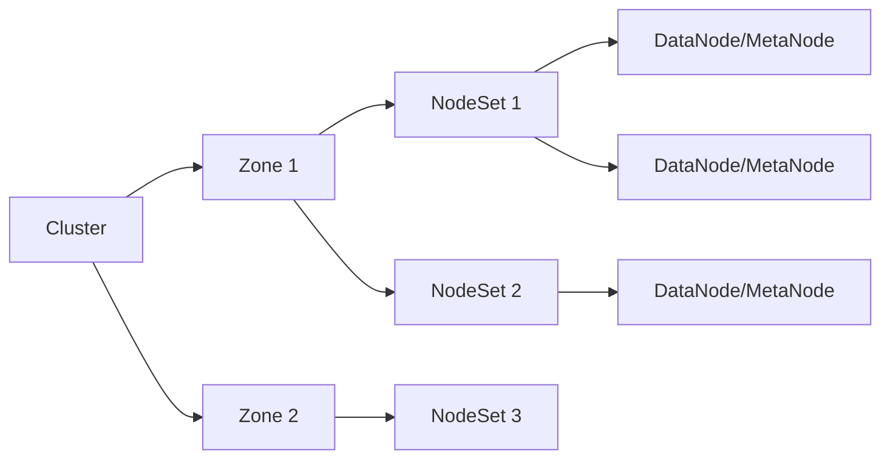
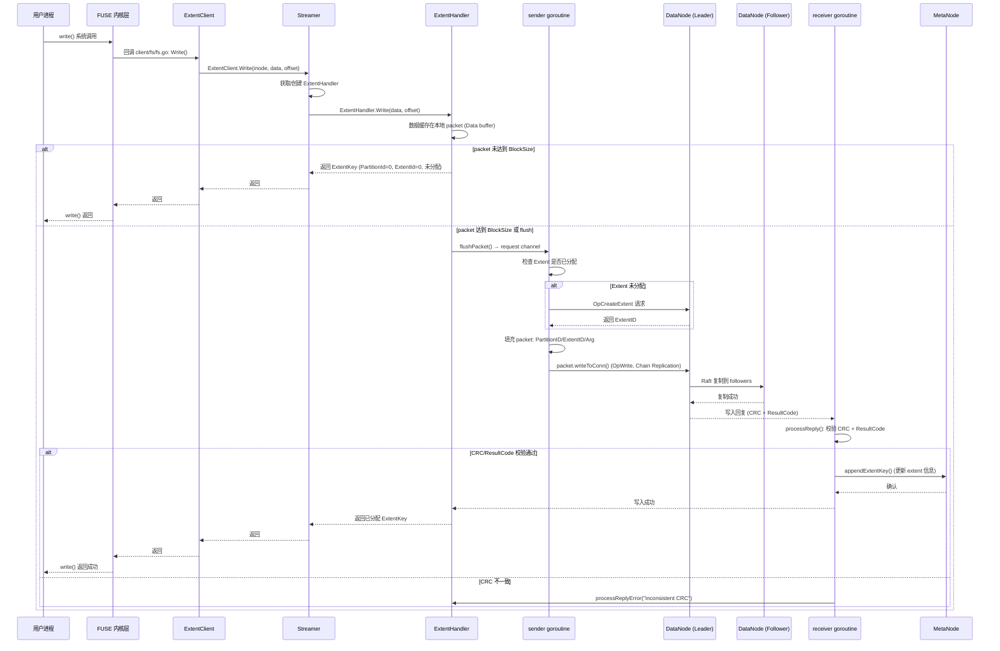
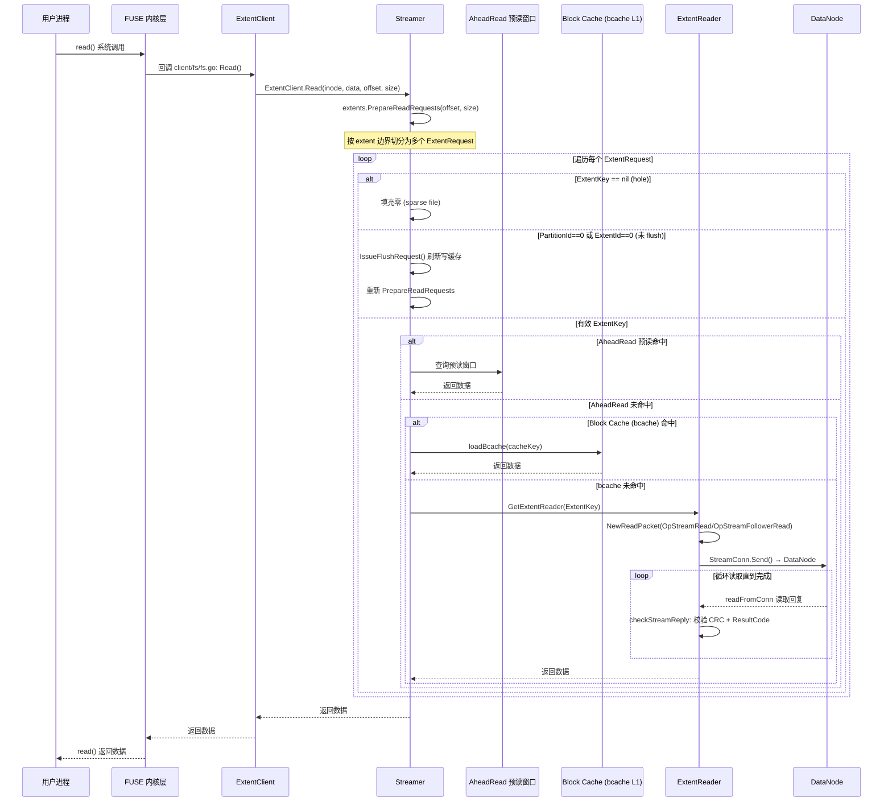
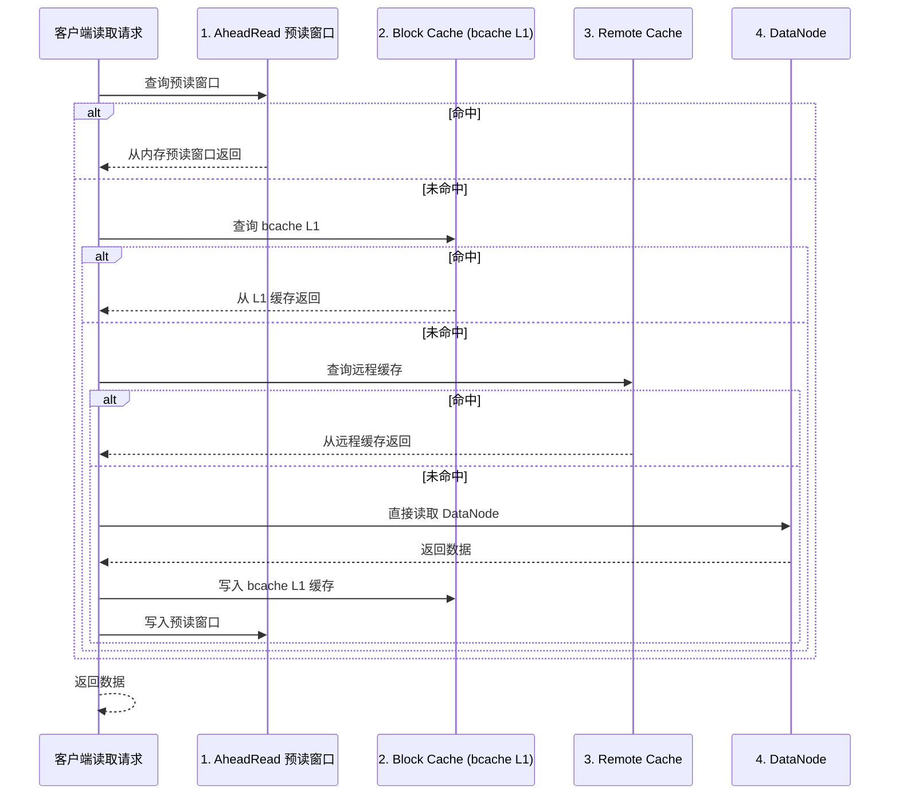

# CubeFS client io流程分析

## 目录

1. [目录结构与模块划分](#1-目录结构与模块划分)
2. [核心组件详解](#2-核心组件详解)
3. [数据写入与读取流程（代码级追踪）](#3-数据写入与读取流程代码级追踪)
   - 3.1 [客户端写入 IO 完整代码路径](#31-客户端写入-io-完整代码路径)
   - 3.2 [客户端读取 IO 完整代码路径](#32-客户端读取-io-完整代码路径)
   - 3.3 [Packet 协议与构造](#33-packet-协议与构造)
   - 3.4 [客户端多级缓存机制](#34-客户端多级缓存机制)
4. [关键数据结构](#4-关键数据结构)
5. [技术栈与依赖](#5-技术栈与依赖)
6. [总结](#6-总结)

---

## 1. 目录结构与模块划分

```
cubefs/
├── master/          # Master 节点：集群管理、分区调度、Raft FSM
├── metanode/        # MetaNode 节点：元数据存储（inode/dentry），BTree + Raft
├── datanode/        # DataNode 节点：数据存储（extent），多副本 Raft
│   └── repl/        #   副本间通信层
│   └── storage/     #   底层存储引擎
├── blobstore/       # 纠删码存储子系统
├── client/          # FUSE 文件系统客户端
├── sdk/             # Go SDK
│   └── data/        #   数据通道 SDK
│       └── stream/  #     流式读写核心
│   └── meta/        #   元数据 SDK
│   └── master/      #   Master 客户端
├── java/            # Java SDK
├── objectnode/      # S3 协议网关
├── authnode/        # 认证节点（密钥管理）
├── lcnode/          # 生命周期管理节点
├── raftstore/       # Raft 共识库封装
├── proto/           # 通信协议定义（Packet、Opcode、ExtentKey 等）
├── console/         # 管理控制台
├── cli/             # 命令行工具
├── shell/           # 交互式 shell
├── tool/            # 运维工具集
├── util/            # 公共工具库
├── vendor/          # Go 依赖
├── depends/         # 本地依赖替换（fuse, cobra）
├── deploy/          # 部署脚本
├── docker/          # Docker 镜像
├── docs/            # 英文文档
├── docs-zh/         # 中文文档
└── test/            # 集成测试
```

---

## 2. 核心组件详解

### 2.1 Master

**职责**：集群的"大脑"，管理所有元数据和资源的调度分配。

**关键文件**：

| 文件 | 职责 |
|------|------|
| `cluster.go` | 集群核心逻辑：节点管理、分区创建/迁移/下线 |
| `metadata_fsm.go` | Raft 状态机：Apply 日志、状态恢复 |
| `metadata_snapshot.go` | Raft 快照管理 |
| `cluster_task.go` | 副本迁移任务（Meta/Data Partition 迁移、下线） |
| `api_service.go` | HTTP API 接口 |
| `gapi_cluster.go` | gRPC 接口 |
| `data_partition.go` | DataPartition 数据结构管理 |
| `meta_partition.go` | MetaPartition 数据结构管理 |
| `data_node.go` / `meta_node.go` | 节点管理 |
| `topology.go` | 拓扑管理（Zone → NodeSet → Node） |

**拓扑模型**：



- **Zone**：故障域（通常对应机房或机架）
- **NodeSet**：节点集合，副本分配的基本单元
- 副本分配策略：优先在同一个 NodeSet 内分配，不足时跨 NodeSet，再不足跨 Zone

### 2.2 MetaNode

**职责**：存储文件系统元数据（inode、dentry、extend 属性）。

**关键文件**：

| 文件 | 职责 |
|------|------|
| `manager.go` | MetaPartition 生命周期管理 |
| `partition.go` | MetaPartition 核心：Raft 启动、命令处理 |
| `inode.go` | Inode 管理（BTree 存储） |
| `dentry.go` | Dentry 管理（BTree 存储） |
| `extend.go` | 扩展属性管理 |
| `btree.go` | BTree 实现 |
| `manager_op.go` | 分区创建/删除操作 |
| `partition_delete_extents.go` | 数据 extent 删除 |

**元数据存储**：使用内存 BTree 存储 inode 和 dentry，通过 Raft 日志保证一致性，定期快照持久化到磁盘。

### 2.3 DataNode

**职责**：存储文件数据（extent），支持多副本一致性。

**关键文件**：

| 文件 | 职责 |
|------|------|
| `server.go` | DataNode 服务入口，使用 `smux` 多路复用连接 |
| `server_handler.go` | 请求分发处理 |
| `space_manager.go` | 磁盘/空间管理 |
| `disk.go` | 磁盘管理 |
| `partition.go` | DataPartition 核心 |
| `partition_raft.go` | DataPartition Raft 封装 |
| `partition_raftfsm.go` | Raft FSM 实现 |
| `partition_op_by_raft.go` | 通过 Raft 执行的操作 |
| `data_partition_repair.go` | **Extent 修复机制** |
| `repl/` | 副本间通信 |
| `storage/` | 底层存储引擎 |

**数据存储模型**：

```
DataNode
├── Disk 1 (diskPath)
│   ├── DataPartition_1/
│   │   ├── extent_0001   (Normal Extent, 最大 128MB)
│   │   ├── extent_0002
│   │   └── ...
│   └── DataPartition_2/
│       ├── tiny_extent_0001  (Tiny Extent, 用于小文件)
│       └── ...
├── Disk 2
└── ...
```

- **Normal Extent**：固定上限（128MB），用于大文件顺序写入
- **Tiny Extent**：用于小文件追加写入，需要特殊的修复逻辑

### 2.4 Client / SDK

**Client**（`client/`）：FUSE 文件系统客户端，挂载后可像本地文件系统一样访问。

**SDK**（`sdk/`）：Go SDK，提供编程接口。

**客户端 SDK 分层**：

```
sdk/
├── data/                    # 数据通道
│   ├── extent_client.go     # ExtentClient：对外接口层
│   └── stream/              # 流式读写核心
│       ├── streamer.go      # Streamer：每个 inode 的读写管理器
│       ├── stream_reader.go # 读取逻辑
│       ├── extent_handler.go# 写入逻辑（ExtentHandler）
│       ├── extent_reader.go # Extent 读取器
│       ├── packet.go        # Packet 构造（读/写/创建包）
│       ├── stream_conn.go   # DataNode 连接管理
│       └── wrapper/         # DataPartition 包装器
├── meta/                    # 元数据通道
│   ├── api.go               # 元数据 API
│   ├── operation.go         # 元数据操作
│   ├── inode_cache.go       # Inode 缓存
│   └── view.go              # 分区路由视图
└── master/                  # Master 客户端
```

---

## 3. 数据写入与读取流程（代码级追踪）

### 3.1 客户端写入 IO 完整代码路径

以下是写入 IO 从用户系统调用到 DataNode RPC 的完整代码路径：



**关键代码路径详解**：

#### 步骤 1: FUSE 入口 → ExtentClient

用户写入先经过 FUSE 层进入 `ExtentClient.Write()`，该方法根据 `inode` 获取或创建对应的 `Streamer` 对象：

```
sdk/data/extent_client.go: ExtentClient.Write(inode, data, offset)
  → 获取/创建 Streamer(inode)
  → Streamer.Write(data, offset)
```

#### 步骤 2: Streamer.Write → ExtentHandler

`Streamer` 是每个 inode 对应的读写管理器。写入时，它获取或创建 `ExtentHandler`：

```go
// sdk/data/stream/streamer.go
func (s *Streamer) Write(data []byte, offset int) (total int, err error) {
    // 获取或创建 ExtentHandler
    eh := s.getExtentHandler(...)
    // 调用 ExtentHandler.Write
    total, err = eh.Write(data, offset)
}
```

#### 步骤 3: ExtentHandler.Write — 本地缓存 + 批量发送

`ExtentHandler` 是写入的核心。它**先将数据缓存在本地 packet 中**，达到 `BlockSize` 后才发送到 DataNode：

```go
// sdk/data/stream/extent_handler.go
func (eh *ExtentHandler) Write(data []byte, offset int) (total int, ek *proto.ExtentKey, err error) {
    for total < size {
        if eh.packet == nil {
            eh.packet = NewWritePacket(eh.inode, offset+total, eh.storeMode)
        }
        packsize := int(eh.packet.Size)
        write = util.Min(size-total, blksize-packsize)
        copy(eh.packet.Data[packsize:packsize+write], data[total:total+write])
        eh.packet.Size += uint32(write)

        if int(eh.packet.Size) >= blksize {
            eh.flushPacket()  // 发送到 request channel
        }
    }
    // 返回未分配的 ExtentKey（PartitionId=0, ExtentId=0）
    ek = &proto.ExtentKey{FileOffset: uint64(eh.fileOffset), Size: uint32(eh.size)}
}
```

**关键设计**：返回的 `ExtentKey` 此时 `PartitionId=0` 和 `ExtentId=0`，表示 extent 尚未真正分配。这在读取路径中会触发 flush。

#### 步骤 4: sender goroutine — 分配 extent 并发送

`sender` goroutine 从 `request` channel 接收 packet，分配 extent，然后发送到 DataNode：

```go
func (eh *ExtentHandler) sender() {
    for {
        select {
        case packet := <-eh.request:
            // 1. 分配 extent（如果尚未分配）
            if eh.dp == nil {
                eh.allocateExtent()  // → 向 DataNode 请求 OpCreateExtent
            }
            // 2. 填充 packet 元数据
            packet.PartitionID = eh.dp.PartitionID
            packet.ExtentType = uint8(eh.storeMode) | proto.PacketProtocolVersionFlag
            packet.ExtentID = uint64(eh.extID)
            packet.ExtentOffset = int64(extOffset)
            packet.Arg = ([]byte)(eh.dp.GetAllAddrs())  // 所有副本地址
            packet.ArgLen = uint32(len(packet.Arg))
            packet.RemainingFollowers = uint8(len(eh.dp.Hosts) - 1)

            // 3. 写入 TCP 连接（Chain Replication 模式）
            packet.writeToConn(eh.conn)  // → DataNode
            eh.reply <- packet           // 交给 receiver 处理回复
        }
    }
}
```

#### 步骤 5: receiver — 处理 DataNode 回复

`receiver` goroutine 读取 DataNode 的回复，校验 CRC 和结果码，成功后更新 extent key：

```go
func (eh *ExtentHandler) processReply(packet *Packet) {
    reply := NewReply(packet.ReqID, packet.PartitionID, packet.ExtentID)
    reply.ReadFromConnWithVer(eh.conn, proto.ReadDeadlineTime)

    // 校验版本
    if reply.VerSeq > atomic.LoadUint64(&eh.stream.verSeq) {
        eh.stream.client.UpdateLatestVer(...)
        eh.appendExtentKey()  // → 更新 MetaNode 上的 extent 信息
    }

    // 校验 CRC
    if reply.CRC != packet.CRC {
        eh.processReplyError(packet, "inconsistent CRC")
    }
}
```

### 3.2 客户端读取 IO 完整代码路径



**关键代码路径详解**：

#### 步骤 1: PrepareReadRequests — 切分读请求

`Streamer.read()` 首先调用 `extents.PrepareReadRequests()` 将用户请求按 extent 边界切分为多个 `ExtentRequest`：

```go
// sdk/data/stream/stream_reader.go
func (s *Streamer) read(data []byte, offset int, size int, storageClass uint32) (total int, err error) {
    requests = s.extents.PrepareReadRequests(offset, size, data)
    // ...
}
```

每个 `ExtentRequest` 包含：
- `ExtentKey`：指向哪个 extent（可能为 nil 表示 hole）
- `FileOffset`：文件内偏移
- `Size`：读取大小
- `Data`：目标 buffer

#### 步骤 2: 处理未 flush 的写缓存

如果某个请求的 `ExtentKey.PartitionId == 0` 或 `ExtentId == 0`，说明有数据还在客户端写缓存中未 flush：

```go
for _, req := range requests {
    if req.ExtentKey == nil { continue }
    if req.ExtentKey.PartitionId == 0 || req.ExtentKey.ExtentId == 0 {
        s.writeLock.Lock()
        s.IssueFlushRequest()  // 强制 flush 写缓存
        revisedRequests = s.extents.PrepareReadRequests(offset, size, data)
        s.writeLock.Unlock()
        break
    }
}
```

#### 步骤 3: 多级缓存查询

对于有效的 `ExtentKey`，读取按以下顺序查询缓存：

```go
for _, req := range requests {
    if req.ExtentKey == nil {
        // hole: 填充零
        zeros := make([]byte, len(req.Data))
        copy(req.Data, zeros)
        continue
    }

    // 1. AheadRead 预读窗口（内存）
    if s.aheadReadEnable && filesize > s.minReadAheadSize {
        readBytes, err = s.aheadRead(req, storageClass)
        if err == nil && readBytes == req.Size {
            total += readBytes
            continue  // 预读命中
        }
    }

    // 2. Block Cache (bcache L1 缓存)
    if s.client.bcacheEnable && s.needBCache && filesize <= bcache.MaxFileSize {
        cacheKey := util.GenerateRepVolKey(...)
        readBytes, err = s.client.loadBcache(s.client.volumeName, cacheKey, req.Data, ...)
        if err == nil && readBytes == req.Size {
            total += req.Size
            continue  // bcache 命中
        }
    }

    // 3. ExtentReader — 从 DataNode 读取
    reader, err = s.GetExtentReader(req.ExtentKey, storageClass)
    readBytes, err = reader.Read(req)
}
```

#### 步骤 4: ExtentReader.Read — DataNode RPC

`ExtentReader` 构造读 packet 并通过 `StreamConn` 发送到 DataNode：

```go
// sdk/data/stream/extent_reader.go
func (reader *ExtentReader) Read(req *ExtentRequest) (readBytes int, err error) {
    offset := req.FileOffset - int(reader.key.FileOffset) + int(reader.key.ExtentOffset)
    size := req.Size

    // 构造读请求 packet
    reqPacket := NewReadPacket(reader.key, offset, size, reader.inode, req.FileOffset, reader.followerRead)
    sc := NewStreamConn(reader.dp, reader.followerRead, reader.maxRetryTimeout)

    err = sc.Send(&reader.retryRead, reqPacket, func(conn *net.TCPConn) (error, bool) {
        readBytes = 0
        for readBytes < size {
            replyPacket := NewReply(reqPacket.ReqID, reader.dp.PartitionID, reqPacket.ExtentID)
            bufSize := util.Min(util.ReadBlockSize, size-readBytes)
            replyPacket.Data = req.Data[readBytes : readBytes+bufSize]
            e := replyPacket.readFromConn(conn, proto.ReadDeadlineTime)

            // 错误处理
            if e != nil { return TryOtherAddrError, false }
            if replyPacket.ResultCode == proto.OpAgain { return nil, true }
            if replyPacket.ResultCode == proto.OpLimitedIoErr { return LimitedIoError, true }

            // 校验回复
            e = reader.checkStreamReply(reqPacket, replyPacket)
            readBytes += int(replyPacket.Size)
        }
        return nil, false
    })
}
```

#### 步骤 5: CRC 校验

```go
func (reader *ExtentReader) checkStreamReply(request *Packet, reply *Packet) (err error) {
    if reply.ResultCode == proto.OpTryOtherAddr { return TryOtherAddrError }
    if reply.ResultCode != proto.OpOk { return ... }
    if !request.isValidReadReply(reply) { return ... }
    // CRC 校验
    expectCrc := crc32.ChecksumIEEE(reply.Data[:reply.Size])
    if reply.CRC != expectCrc { return ... }
    return nil
}
```

### 3.3 Packet 协议与构造

CubeFS 客户端与 DataNode 之间使用自定义二进制协议。核心数据结构是 `Packet`：

#### Packet 结构（`proto/packet.go`）

```go
type Packet struct {
    Magic              uint8    // 魔数标识
    ExtentType         uint8    // extent 类型（Tiny/Normal）+ 协议版本标志位
    Opcode             uint8    // 操作码（OpWrite/OpStreamRead/OpCreateExtent 等）
    ResultCode         uint8    // 结果码（OpOk/OpAgain/OpLimitedIoErr 等）
    RemainingFollowers uint8    // 剩余需要复制的 follower 数
    CRC                uint32   // 数据 CRC32 校验
    Size               uint32   // 数据长度
    ArgLen             uint32   // Arg 字段长度
    KernelOffset       uint64   // 文件内偏移（内核偏移）
    PartitionID        uint64   // 数据分区 ID
    ExtentID           uint64   // Extent ID
    ExtentOffset       int64    // Extent 内偏移
    ReqID              int64    // 请求唯一 ID
    Arg                []byte   // 附加参数（如副本地址列表）
    Data               []byte   // 数据 payload
    StartT             int64    // 开始时间戳
    VerSeq             uint64   // 版本序列号（多版本控制）
    VerList            []*VolVersionInfo // 版本列表
    ProtoVersion       uint32   // 协议版本
}
```

#### 主要 Packet 构造函数（`sdk/data/stream/packet.go`）

| 构造函数 | Opcode | 用途 |
|----------|--------|------|
| `NewWritePacket` | `OpWrite` | 标准写请求 |
| `NewOverwritePacket` | `OpRandomWrite` / `OpRandomWriteVer` | 随机覆盖写（支持快照版本） |
| `NewOverwriteByAppendPacket` | `OpRandomWriteAppend` / `OpTryWriteAppend` | 追加方式覆盖写 |
| `NewReadPacket` | `OpStreamRead` / `OpStreamFollowerRead` | 读请求（Leader 读 / Follower 读） |
| `NewCreateExtentPacket` | `OpCreateExtent` | 创建新 Extent |
| `NewWriteTinyDirectly` | `OpWrite` | 小文件直接写 Tiny Extent |

#### 写入 Packet 构造示例

```go
func NewWritePacket(inode uint64, fileOffset, storeMode int) *Packet {
    p := new(Packet)
    p.ReqID = proto.GenerateRequestID()
    p.Magic = proto.ProtoMagic
    p.Opcode = proto.OpWrite
    p.inode = inode
    p.KernelOffset = uint64(fileOffset)
    if storeMode == proto.TinyExtentType {
        p.Data, _ = proto.Buffers.Get(util.DefaultTinySizeLimit)
    } else {
        p.Data, _ = proto.Buffers.Get(util.BlockSize)
    }
    return p
}
```

#### 读取 Packet 构造示例

```go
func NewReadPacket(key *proto.ExtentKey, extentOffset, size int, inode uint64, fileOffset int, followerRead bool) *Packet {
    p := new(Packet)
    p.ExtentID = key.ExtentId
    p.PartitionID = key.PartitionId
    p.Magic = proto.ProtoMagic
    p.ExtentOffset = int64(extentOffset)
    p.Size = uint32(size)
    if followerRead {
        p.Opcode = proto.OpStreamFollowerRead
    } else {
        p.Opcode = proto.OpStreamRead
    }
    p.ExtentType = proto.NormalExtentType
    p.ReqID = proto.GenerateRequestID()
    p.RemainingFollowers = 0
    return p
}
```

#### Packet 读写到连接

**写入连接**（发送请求时计算 CRC）：

```go
func (p *Packet) writeToConn(conn net.Conn) error {
    p.CRC = crc32.ChecksumIEEE(p.Data[:p.Size])
    return p.WriteToConn(conn)
}
```

**从连接读取**（读取回复）：

```go
func (p *Packet) readFromConn(c net.Conn, deadlineTime time.Duration) (err error) {
    c.SetReadDeadline(time.Now().Add(deadlineTime * time.Second))
    header, _ := proto.Buffers.Get(util.PacketHeaderSize)
    defer proto.Buffers.Put(header)
    io.ReadFull(c, header)          // 读 header
    p.UnmarshalHeader(header)        // 解析 header
    p.TryReadExtraFieldsFromConn(c)  // 读额外字段（版本信息）
    if p.ArgLen > 0 {
        readToBuffer(c, &p.Arg, int(p.ArgLen))
    }
    io.ReadFull(c, p.Data[:size])   // 读数据
}
```

### 3.4 客户端多级缓存机制

CubeFS 客户端实现了多级缓存以加速读取：



| 缓存层 | 位置 | 触发条件 | 说明 |
|--------|------|----------|------|
| AheadRead | 客户端内存 | `aheadReadEnable && filesize > minReadAheadSize` | 预读窗口，顺序读时提前加载 |
| bcache (L1) | 客户端本地磁盘 | `bcacheEnable && needBCache && filesize <= MaxFileSize` | 块级缓存，支持 SSD/HDD 策略 |
| RemoteCache | 远程缓存节点 | 配置 `remotecache` | 多客户端共享的缓存层 |
| DataNode | DataNode 内存/磁盘 | 默认 | 最终数据来源 |

**bcache 智能策略**：

```go
// 仅对非 SSD 存储类的数据启用 bcache（可选）
if !s.client.bcacheOnlyForNotSSD ||
   (s.client.bcacheOnlyForNotSSD && inodeInfo.StorageClass != proto.StorageClass_Replica_SSD) {
    readBytes, err = s.client.loadBcache(s.client.volumeName, cacheKey, req.Data, ...)
}
```

---

## 4. 关键数据结构

### Packet（通信协议包）

```go
// proto/packet.go
type Packet struct {
    Magic              uint8
    ExtentType         uint8   // Tiny/Normal + 版本标志位
    Opcode             uint8   // 操作码
    ResultCode         uint8   // 结果码
    RemainingFollowers uint8   // 链式复制剩余 follower 数
    CRC                uint32  // 数据校验
    Size               uint32  // 数据长度
    ArgLen             uint32  // 附加参数长度
    KernelOffset       uint64  // 文件内偏移
    PartitionID        uint64  // 数据分区 ID
    ExtentID           uint64  // Extent ID
    ExtentOffset       int64   // Extent 内偏移
    ReqID              int64   // 请求 ID
    Arg                []byte  // 附加参数（副本地址列表等）
    Data               []byte  // 数据 payload
    VerSeq             uint64  // 版本序列号
    VerList            []*VolVersionInfo
    ProtoVersion       uint32  // 协议版本
}
```

### ExtentKey（Extent 定位信息）

```go
// proto/extents.go
type ExtentKey struct {
    FileOffset   uint64  // 文件内偏移
    PartitionId  uint64  // 数据分区 ID
    ExtentId     uint64  // Extent ID
    ExtentOffset uint64  // Extent 内偏移
    Size         uint32  // Extent 大小
}
```

### ExtentHandler（客户端写入处理器）

```go
// sdk/data/stream/extent_handler.go
type ExtentHandler struct {
    inode       uint64
    fileOffset  int
    stream      *Streamer
    dp          *wrapper.DataPartition  // 数据分区
    extID       uint64                   // Extent ID
    key         *proto.ExtentKey         // 已分配的 extent key
    packet      *Packet                  // 当前缓存的写 packet
    request     chan *Packet             // 发送 channel
    reply       chan *Packet             // 回复 channel
    conn        net.Conn                 // DataNode 连接
    inflight    int32                    // 在途请求数
    status      int32                    // 状态（正常/恢复/错误）
}
```

### ExtentReader（客户端读取器）

```go
// sdk/data/stream/extent_reader.go
type ExtentReader struct {
    inode           uint64
    key             *proto.ExtentKey
    dp              *wrapper.DataPartition
    followerRead    bool            // 是否 follower 读
    retryRead       bool            // 是否重试读
    maxRetryTimeout time.Duration
}
```

### Volume / DataPartition / MetaPartition

```go
// master 中
type Vol struct {
    Name             string
    ID               uint64
    dpReplicaNum     int    // 数据副本数
    mpReplicaNum     int    // 元数据副本数
    dataPartitionSize uint64
}

type DataPartition struct {
    PartitionID       uint64
    ReplicaNum        int
    Hosts             []string
    Peers             []proto.Peer
    Status            int
    isRecover         bool
    DecommissionStatus int
}
```

---

## 5. 技术栈与依赖

| 类别 | 技术 |
|------|------|
| 语言 | Go 1.18 |
| Raft 共识 | `github.com/hashicorp/raft` |
| 持久化存储 | RocksDB (通过 `gorocksdb`) |
| FUSE | `github.com/jacobsa/fuse` (本地替换) |
| S3 SDK | `github.com/aws/aws-sdk-go` |
| 命令行 | `github.com/spf13/cobra` (本地替换) |
| 多路复用 | `github.com/xtaci/smux` (DataNode 连接复用) |
| 序列化 | JSON + 自定义二进制协议（Packet） |
| 监控 | Prometheus metrics |
| 容器化 | Docker + Kubernetes (Helm) |
| CI/CD | GitHub Actions, Travis CI, GitLab CI |

---

## 6. 总结

CubeFS 是一个设计成熟的分布式存储系统，其核心设计亮点包括：

### 架构设计

1. **元数据与数据分离**：MetaNode 专管元数据，DataNode 专管数据，各自独立扩展
2. **多级 Raft**：Master、MetaPartition、DataPartition 各自独立 Raft 组，避免单点瓶颈
3. **拓扑感知**：Zone → NodeSet → Node 三级拓扑，副本分配考虑故障域隔离

### IO 路径设计

1. **写入聚合**：`ExtentHandler` 在客户端缓存数据，达到 `BlockSize` 后才发送，减少 RPC 次数
2. **延迟分配**：写入返回的 `ExtentKey` 初始 `PartitionId=0`，读取时检测到未 flush 会触发 `IssueFlushRequest`
3. **链式复制**：写入通过 `RemainingFollowers` 和 `Arg`（副本地址列表）实现 chain replication
4. **多级缓存**：AheadRead 预读 → bcache L1 → RemoteCache → DataNode，逐级降级读取
5. **Follower 读**：支持 `OpStreamFollowerRead`，允许从 follower 读取以分担 Leader 压力

### 故障恢复

1. **分层恢复**：Master Leader 切换 → 节点级下线 → 分区级迁移 → Extent 级修复
2. **特殊副本处理**：对 1/2 副本场景有专门的下线流程（`decommissionSingleDp`），先加后删
3. **Leader 切换容错**：下线过程支持 Leader 切换后断点续传
4. **Extent 修复**：Leader 定期收集副本信息，对比后自动修复不一致的 extent

### 存储优化

1. **大小文件分离**：Normal Extent（大文件）和 Tiny Extent（小文件）不同处理
2. **多协议支持**：POSIX、HDFS、S3 统一后端
3. **混合存储**：多副本（热数据）+ 纠删码（冷数据）灵活策略

---
