```markdown
# CubeFS 读写 IO 流程详解

## 一、概述

CubeFS 采用**分离架构**设计，将元数据和数据存储分开，客户端通过三个不同的组件完成完整的 IO 操作：

1. **MetaNode**：元数据操作(文件创建、查询、删除等)
2. **DataNode**：数据存储和读写
3. **Master**：集群管理和资源调度

---

## 二、整体 IO 架构

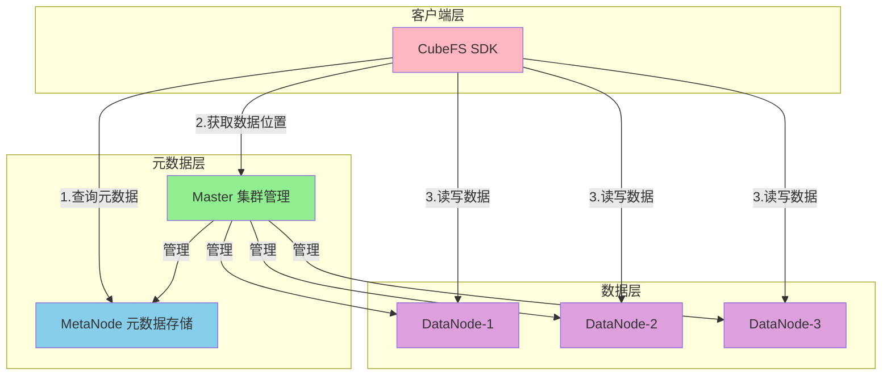
```mermaid
graph TB
    subgraph Client["客户端层"]
        SDK["CubeFS SDK"]
    end
    
    subgraph MetaLayer["元数据层"]
        Master["Master 集群管理"]
        MetaNode["MetaNode 元数据存储"]
    end
    
    subgraph DataLayer["数据层"]
        DN1["DataNode-1"]
        DN2["DataNode-2"]
        DN3["DataNode-3"]
    end
    
    SDK -->|1.查询元数据| MetaNode
    SDK -->|2.获取数据位置| Master
    SDK -->|3.读写数据| DN1
    SDK -->|3.读写数据| DN2
    SDK -->|3.读写数据| DN3
    Master -->|管理| MetaNode
    Master -->|管理| DN1
    Master -->|管理| DN2
    Master -->|管理| DN3
    
    style SDK fill:#FFB6C1
    style Master fill:#90EE90
    style MetaNode fill:#87CEEB
    style DN1 fill:#DDA0DD
    style DN2 fill:#DDA0DD
    style DN3 fill:#DDA0DD
```

---

## 三、文件写入流程

### 3.1 完整写入流程概览

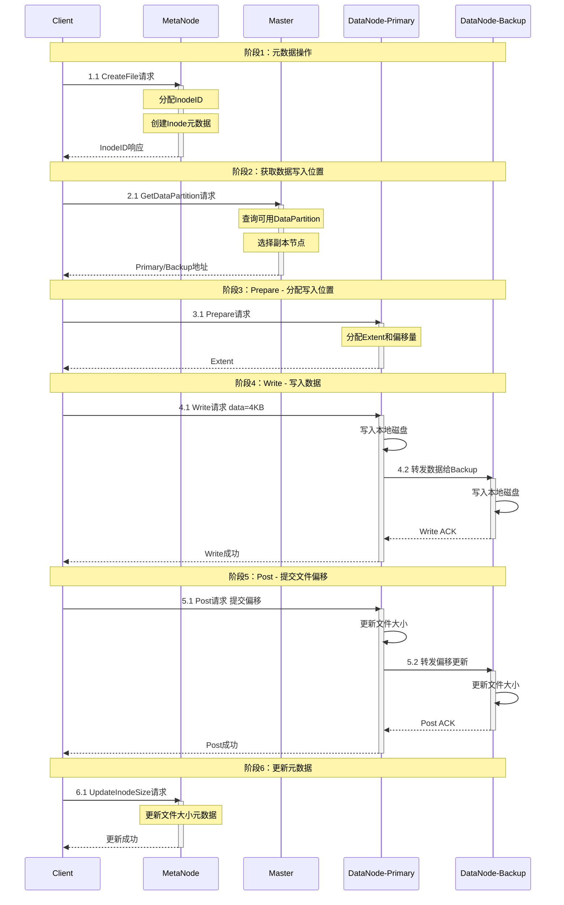
```mermaid
sequenceDiagram
    participant Client
    participant MetaNode as MetaNode
    participant Master as Master
    participant Primary as DataNode-Primary
    participant Backup as DataNode-Backup

    Note over Client,Backup: 阶段1：元数据操作

    Client->>MetaNode: 1.1 CreateFile请求
    activate MetaNode
    Note over MetaNode: 分配InodeID
    Note over MetaNode: 创建Inode元数据
    MetaNode-->>Client: InodeID响应
    deactivate MetaNode

    Note over Client,Backup: 阶段2：获取数据写入位置

    Client->>Master: 2.1 GetDataPartition请求
    activate Master
    Note over Master: 查询可用DataPartition
    Note over Master: 选择副本节点
    Master-->>Client: Primary/Backup地址
    deactivate Master

    Note over Client,Backup: 阶段3：Prepare - 分配写入位置

    Client->>Primary: 3.1 Prepare请求
    activate Primary
    Note over Primary: 分配Extent和偏移量
    Primary-->>Client: Extent#1, Offset#0
    deactivate Primary

    Note over Client,Backup: 阶段4：Write - 写入数据

    Client->>Primary: 4.1 Write请求 data=4KB
    activate Primary
    Primary->>Primary: 写入本地磁盘
    Primary->>Backup: 4.2 转发数据给Backup
    activate Backup
    Backup->>Backup: 写入本地磁盘
    Backup-->>Primary: Write ACK
    deactivate Backup
    Primary-->>Client: Write成功
    deactivate Primary

    Note over Client,Backup: 阶段5：Post - 提交文件偏移

    Client->>Primary: 5.1 Post请求 提交偏移
    activate Primary
    Primary->>Primary: 更新文件大小
    Primary->>Backup: 5.2 转发偏移更新
    activate Backup
    Backup->>Backup: 更新文件大小
    Backup-->>Primary: Post ACK
    deactivate Backup
    Primary-->>Client: Post成功
    deactivate Primary

    Note over Client,Backup: 阶段6：更新元数据

    Client->>MetaNode: 6.1 UpdateInodeSize请求
    activate MetaNode
    Note over MetaNode: 更新文件大小元数据
    MetaNode-->>Client: 更新成功
    deactivate MetaNode
```

### 3.2 顺序写流程详解

顺序写适用于新建文件或追加写入场景，使用主备复制协议：

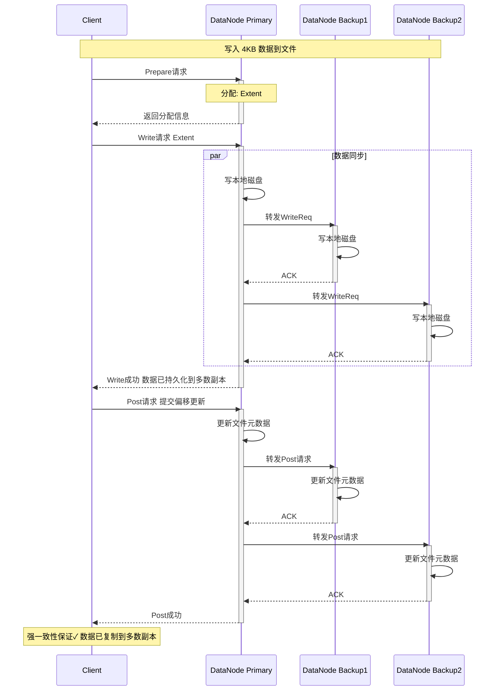
```mermaid
sequenceDiagram
    participant Client
    participant Primary as DataNode Primary
    participant Backup1 as DataNode Backup1
    participant Backup2 as DataNode Backup2

    Note over Client,Backup2: 写入 4KB 数据到文件

    Client->>Primary: Prepare请求
    activate Primary
    Note over Primary: 分配: Extent#10 Offset: 0KB Size: 4KB
    Primary-->>Client: 返回分配信息
    deactivate Primary

    Client->>Primary: Write请求 Extent#10 offset=0 size=4KB data=XXX
    
    activate Primary
    par 数据同步
        Primary->>Primary: 写本地磁盘
        Primary->>Backup1: 转发WriteReq
        activate Backup1
        Backup1->>Backup1: 写本地磁盘
        Backup1-->>Primary: ACK
        deactivate Backup1
        
        Primary->>Backup2: 转发WriteReq
        activate Backup2
        Backup2->>Backup2: 写本地磁盘
        Backup2-->>Primary: ACK
        deactivate Backup2
    end
    
    Primary-->>Client: Write成功 数据已持久化到多数副本
    deactivate Primary

    Client->>Primary: Post请求 提交偏移更新
    activate Primary
    Primary->>Primary: 更新文件元数据
    Primary->>Backup1: 转发Post请求
    activate Backup1
    Backup1->>Backup1: 更新文件元数据
    Backup1-->>Primary: ACK
    deactivate Backup1
    
    Primary->>Backup2: 转发Post请求
    activate Backup2
    Backup2->>Backup2: 更新文件元数据
    Backup2-->>Primary: ACK
    deactivate Backup2
    
    Primary-->>Client: Post成功
    deactivate Primary

    Note over Client: 强一致性保证✓ 数据已复制到多数副本
```

### 3.3 随机写流程详解

随机写适用于覆盖或修改已有数据，使用 Multi-Raft 协议：

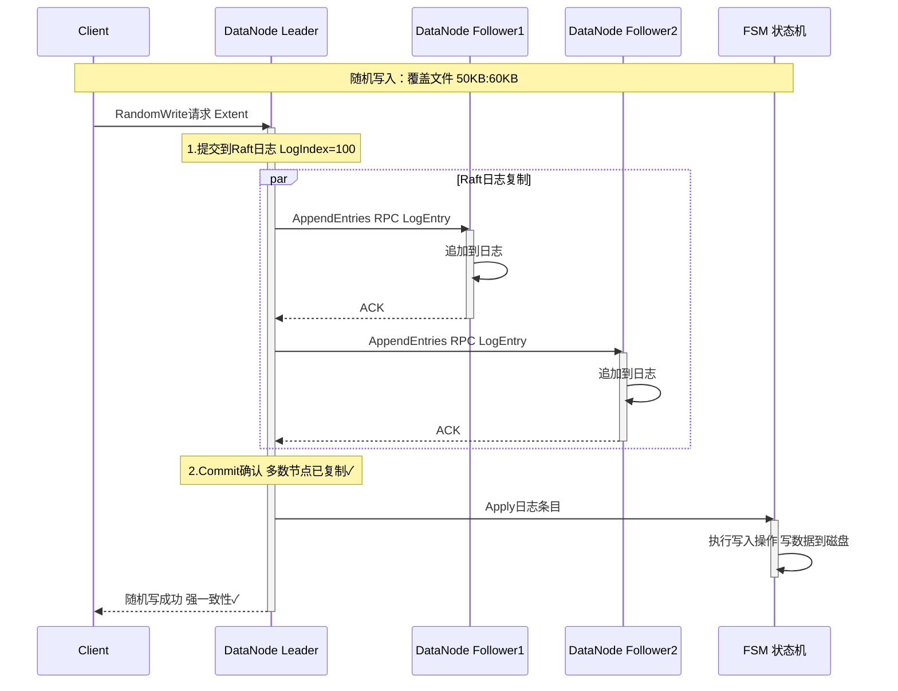
```mermaid
sequenceDiagram
    participant Client
    participant Leader as DataNode Leader
    participant Follower1 as DataNode Follower1
    participant Follower2 as DataNode Follower2
    participant FSM as FSM 状态机

    Note over Client,FSM: 随机写入：覆盖文件 50KB:60KB

    Client->>Leader: RandomWrite请求 Extent#10 offset=50KB size=10KB data=YYY

    activate Leader
    Note over Leader: 1.提交到Raft日志 LogIndex=100

    par Raft日志复制
        Leader->>Follower1: AppendEntries RPC LogEntry#100
        activate Follower1
        Follower1->>Follower1: 追加到日志
        Follower1-->>Leader: ACK
        deactivate Follower1

        Leader->>Follower2: AppendEntries RPC LogEntry#100
        activate Follower2
        Follower2->>Follower2: 追加到日志
        Follower2-->>Leader: ACK
        deactivate Follower2
    end

    Note over Leader: 2.Commit确认 多数节点已复制✓

    Leader->>FSM: Apply日志条目
    activate FSM
    FSM->>FSM: 执行写入操作 写数据到磁盘
    deactivate FSM

    Leader-->>Client: 随机写成功 强一致性✓
    deactivate Leader
```

### 3.4 写入流程状态机

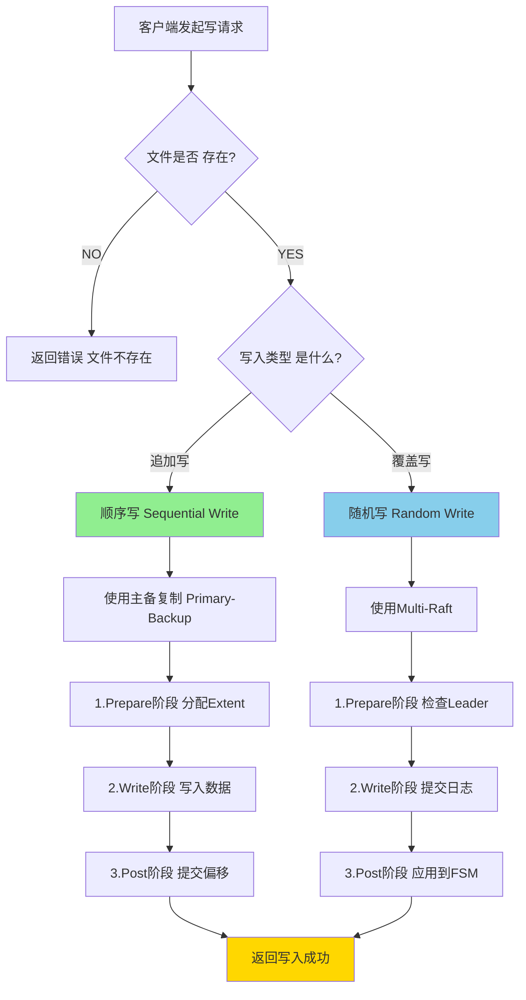
```mermaid
flowchart TD
    A["客户端发起写请求"]
    B{"文件是否 存在?"}
    C["返回错误 文件不存在"]
    D{"写入类型 是什么?"}
    E["顺序写 Sequential Write"]
    F["随机写 Random Write"]
    G["使用主备复制 Primary-Backup"]
    H["使用Multi-Raft"]
    I["1.Prepare阶段 分配Extent"]
    J["1.Prepare阶段 检查Leader"]
    K["2.Write阶段 写入数据"]
    L["2.Write阶段 提交日志"]
    M["3.Post阶段 提交偏移"]
    N["3.Post阶段 应用到FSM"]
    O["返回写入成功"]
    
    A --> B
    B -->|NO| C
    B -->|YES| D
    D -->|追加写| E
    D -->|覆盖写| F
    E --> G
    F --> H
    G --> I
    H --> J
    I --> K
    J --> L
    K --> M
    L --> N
    M --> O
    N --> O
    
    style E fill:#90EE90
    style F fill:#87CEEB
    style O fill:#FFD700
```

---

## 四、文件读取流程

### 4.1 完整读取流程概览

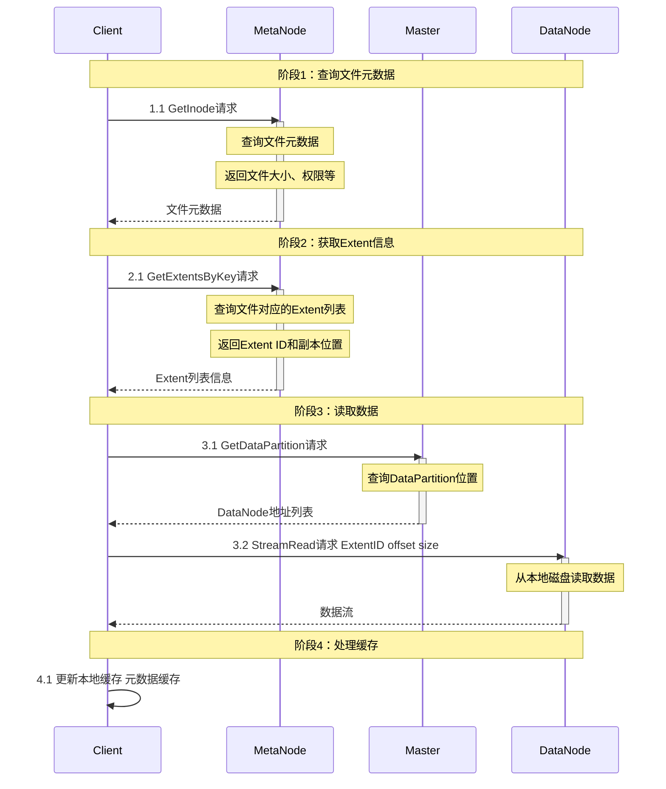
```mermaid
sequenceDiagram
    participant Client
    participant MetaNode as MetaNode
    participant Master as Master
    participant DataNode as DataNode

    Note over Client,DataNode: 阶段1：查询文件元数据

    Client->>MetaNode: 1.1 GetInode请求
    activate MetaNode
    Note over MetaNode: 查询文件元数据
    Note over MetaNode: 返回文件大小、权限等
    MetaNode-->>Client: 文件元数据
    deactivate MetaNode

    Note over Client,DataNode: 阶段2：获取Extent信息

    Client->>MetaNode: 2.1 GetExtentsByKey请求
    activate MetaNode
    Note over MetaNode: 查询文件对应的Extent列表
    Note over MetaNode: 返回Extent ID和副本位置
    MetaNode-->>Client: Extent列表信息
    deactivate MetaNode

    Note over Client,DataNode: 阶段3：读取数据

    Client->>Master: 3.1 GetDataPartition请求
    activate Master
    Note over Master: 查询DataPartition位置
    Master-->>Client: DataNode地址列表
    deactivate Master

    Client->>DataNode: 3.2 StreamRead请求 ExtentID offset size
    activate DataNode
    Note over DataNode: 从本地磁盘读取数据
    DataNode-->>Client: 数据流
    deactivate DataNode

    Note over Client,DataNode: 阶段4：处理缓存

    Client->>Client: 4.1 更新本地缓存 元数据缓存
```

### 4.2 读取数据详细流程

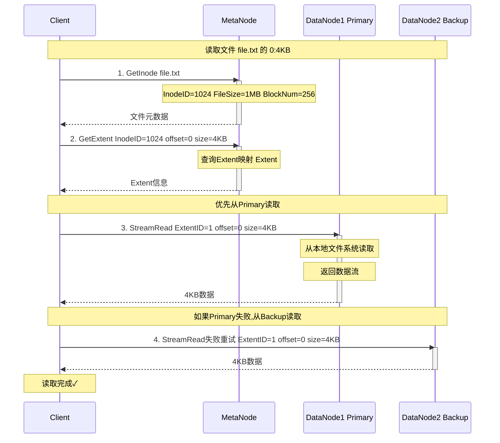
```mermaid
sequenceDiagram
    participant Client
    participant MetaNode as MetaNode
    participant DataNode1 as DataNode1 Primary
    participant DataNode2 as DataNode2 Backup

    Note over Client,DataNode2: 读取文件 file.txt 的 0:4KB

    Client->>MetaNode: 1. GetInode file.txt
    activate MetaNode
    Note over MetaNode: InodeID=1024 FileSize=1MB BlockNum=256
    MetaNode-->>Client: 文件元数据
    deactivate MetaNode

    Client->>MetaNode: 2. GetExtent InodeID=1024 offset=0 size=4KB
    activate MetaNode
    Note over MetaNode: 查询Extent映射 Extent#1 副本: DN1,DN2,DN3
    MetaNode-->>Client: Extent信息
    deactivate MetaNode

    Note over Client,DataNode2: 优先从Primary读取

    Client->>DataNode1: 3. StreamRead ExtentID=1 offset=0 size=4KB
    activate DataNode1
    Note over DataNode1: 从本地文件系统读取
    Note over DataNode1: 返回数据流
    DataNode1-->>Client: 4KB数据
    deactivate DataNode1

    Note over Client,DataNode2: 如果Primary失败,从Backup读取

    Client->>DataNode2: 4. StreamRead失败重试 ExtentID=1 offset=0 size=4KB
    activate DataNode2
    DataNode2-->>Client: 4KB数据
    deactivate DataNode2

    Note over Client: 读取完成✓
```

### 4.3 读取流程 - 失败恢复

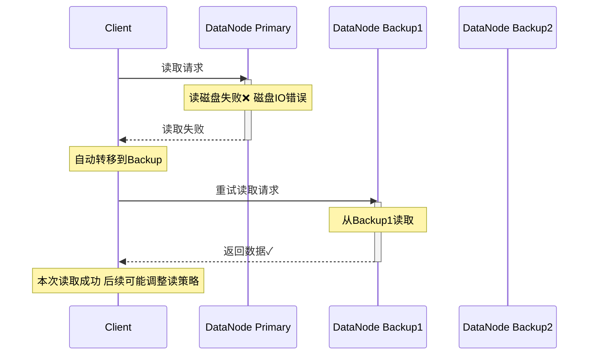
```mermaid
sequenceDiagram
    participant Client
    participant Primary as DataNode Primary
    participant Backup1 as DataNode Backup1
    participant Backup2 as DataNode Backup2

    Client->>Primary: 读取请求
    activate Primary
    Note over Primary: 读磁盘失败❌ 磁盘IO错误
    Primary-->>Client: 读取失败
    deactivate Primary

    Note over Client: 自动转移到Backup

    Client->>Backup1: 重试读取请求
    activate Backup1
    Note over Backup1: 从Backup1读取
    Backup1-->>Client: 返回数据✓
    deactivate Backup1

    Note over Client: 本次读取成功 后续可能调整读策略
```

### 4.4 缓存策略

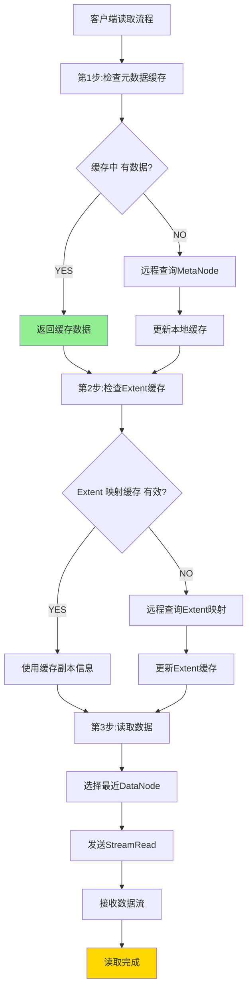
```mermaid
graph TB
    A["客户端读取流程"]
    
    B["第1步:检查元数据缓存"]
    C{"缓存中 有数据?"}
    D["返回缓存数据"]
    E["远程查询MetaNode"]
    F["更新本地缓存"]
    
    G["第2步:检查Extent缓存"]
    H{"Extent 映射缓存 有效?"}
    I["使用缓存副本信息"]
    J["远程查询Extent映射"]
    K["更新Extent缓存"]
    
    L["第3步:读取数据"]
    M["选择最近DataNode"]
    N["发送StreamRead"]
    O["接收数据流"]
    
    P["读取完成"]
    
    A --> B
    B --> C
    C -->|YES| D
    C -->|NO| E
    E --> F
    D --> G
    F --> G
    G --> H
    H -->|YES| I
    H -->|NO| J
    I --> L
    J --> K
    K --> L
    L --> M
    M --> N
    N --> O
    O --> P
    
    style D fill:#90EE90
    style P fill:#FFD700
```

---

## 五、元数据操作流程

### 5.1 创建文件流程

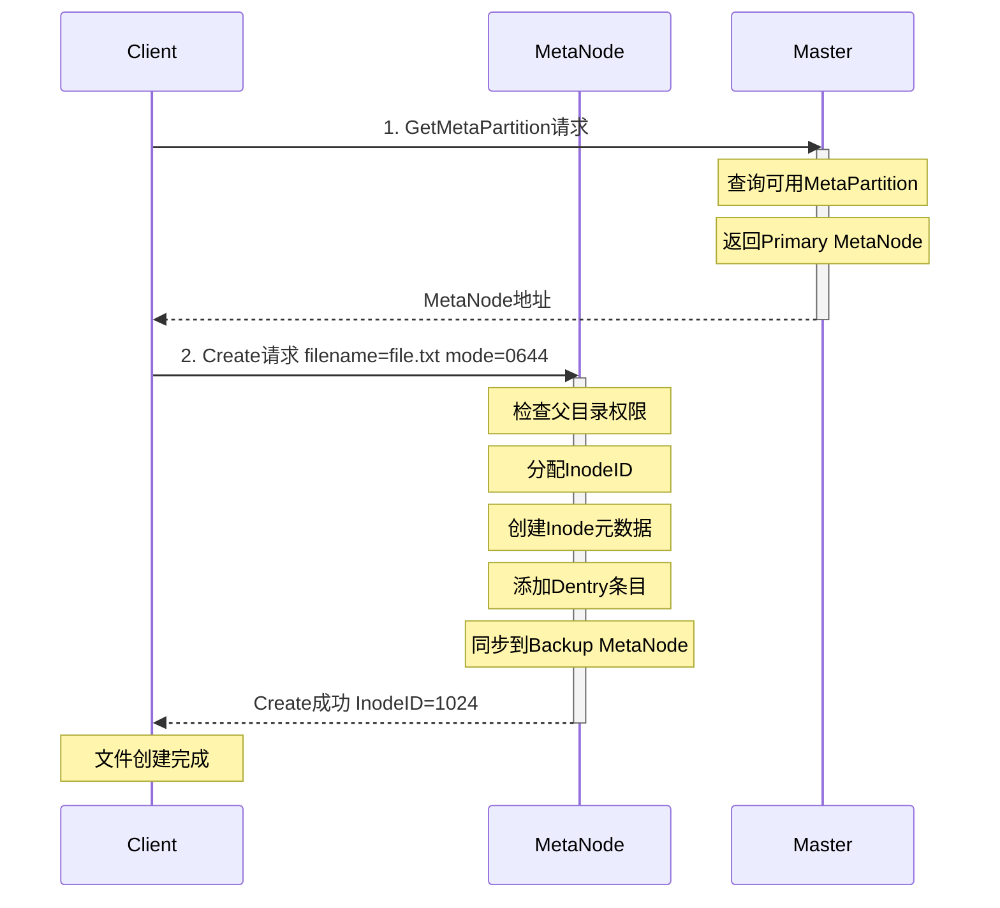
```mermaid
sequenceDiagram
    participant Client
    participant MetaNode as MetaNode
    participant Master as Master

    Client->>Master: 1. GetMetaPartition请求
    activate Master
    Note over Master: 查询可用MetaPartition
    Note over Master: 返回Primary MetaNode
    Master-->>Client: MetaNode地址
    deactivate Master

    Client->>MetaNode: 2. Create请求 filename=file.txt mode=0644
    activate MetaNode
    Note over MetaNode: 检查父目录权限
    Note over MetaNode: 分配InodeID
    Note over MetaNode: 创建Inode元数据
    Note over MetaNode: 添加Dentry条目
    Note over MetaNode: 同步到Backup MetaNode
    MetaNode-->>Client: Create成功 InodeID=1024
    deactivate MetaNode

    Note over Client: 文件创建完成
```

### 5.2 删除文件流程

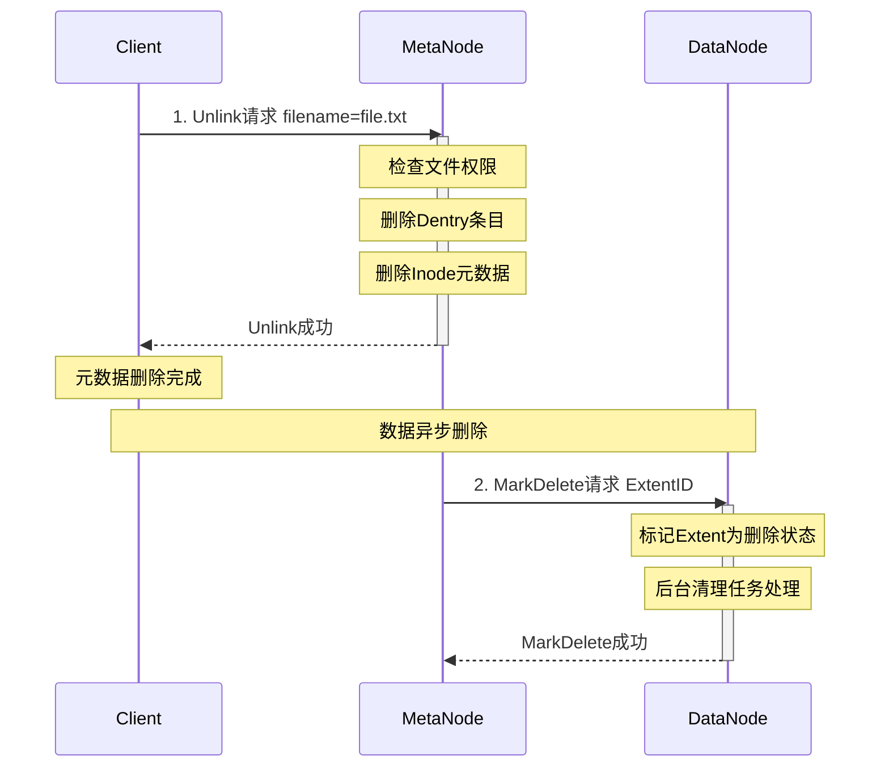
```mermaid
sequenceDiagram
    participant Client
    participant MetaNode as MetaNode
    participant DataNode as DataNode

    Client->>MetaNode: 1. Unlink请求 filename=file.txt
    activate MetaNode
    Note over MetaNode: 检查文件权限
    Note over MetaNode: 删除Dentry条目
    Note over MetaNode: 删除Inode元数据
    MetaNode-->>Client: Unlink成功
    deactivate MetaNode

    Note over Client: 元数据删除完成

    Note over Client,DataNode: 数据异步删除

    MetaNode->>DataNode: 2. MarkDelete请求 ExtentID
    activate DataNode
    Note over DataNode: 标记Extent为删除状态
    Note over DataNode: 后台清理任务处理
    DataNode-->>MetaNode: MarkDelete成功
    deactivate DataNode
```

### 5.3 目录操作流程

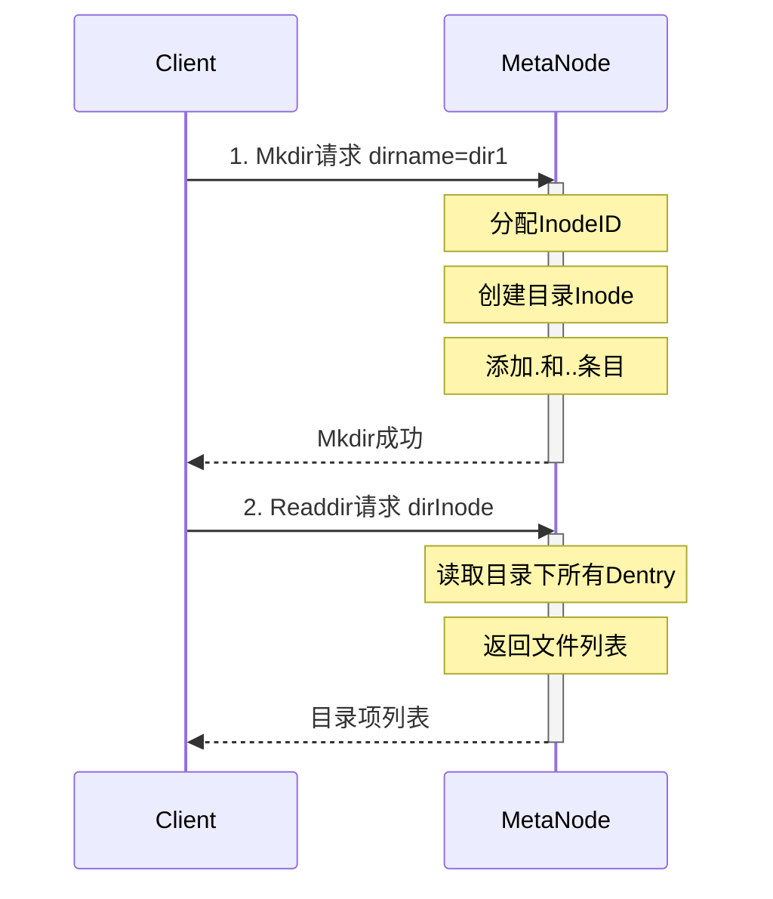
```mermaid
sequenceDiagram
    participant Client
    participant MetaNode as MetaNode

    Client->>MetaNode: 1. Mkdir请求 dirname=dir1
    activate MetaNode
    Note over MetaNode: 分配InodeID
    Note over MetaNode: 创建目录Inode
    Note over MetaNode: 添加.和..条目
    MetaNode-->>Client: Mkdir成功
    deactivate MetaNode

    Client->>MetaNode: 2. Readdir请求 dirInode
    activate MetaNode
    Note over MetaNode: 读取目录下所有Dentry
    Note over MetaNode: 返回文件列表
    MetaNode-->>Client: 目录项列表
    deactivate MetaNode
```

---

## 六、IO 性能优化

### 6.1 预读策略

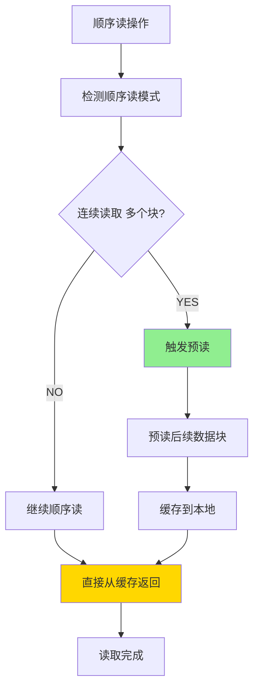
```mermaid
graph TB
    A["顺序读操作"]
    B["检测顺序读模式"]
    C{"连续读取 多个块?"}
    D["触发预读"]
    E["预读后续数据块"]
    F["缓存到本地"]
    G["继续顺序读"]
    H["直接从缓存返回"]
    I["读取完成"]
    
    A --> B
    B --> C
    C -->|YES| D
    C -->|NO| G
    D --> E
    E --> F
    G --> H
    F --> H
    H --> I
    
    style D fill:#90EE90
    style H fill:#FFD700
```

### 6.2 写入缓冲

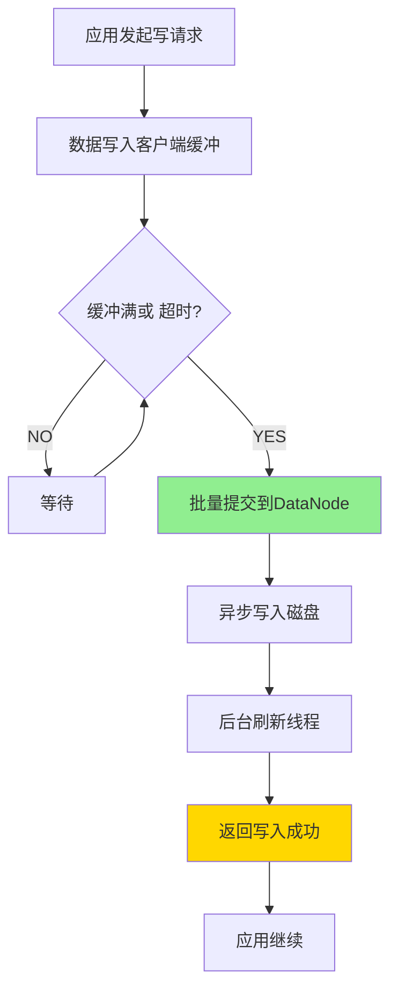
```mermaid
graph TB
    A["应用发起写请求"]
    B["数据写入客户端缓冲"]
    C{"缓冲满或 超时?"}
    D["等待"]
    E["批量提交到DataNode"]
    F["异步写入磁盘"]
    G["后台刷新线程"]
    H["返回写入成功"]
    I["应用继续"]
    
    A --> B
    B --> C
    C -->|NO| D
    C -->|YES| E
    D --> C
    E --> F
    F --> G
    G --> H
    H --> I
    
    style E fill:#90EE90
    style H fill:#FFD700
```

### 6.3 副本选择策略

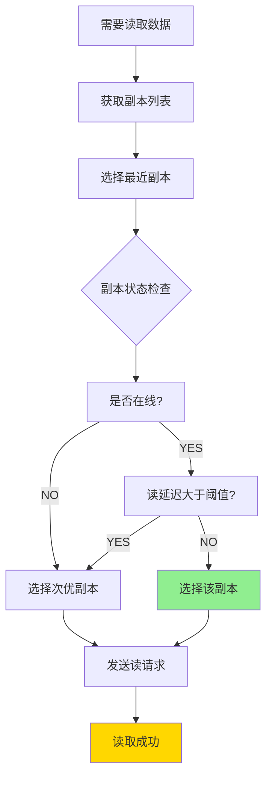
```mermaid
graph TD
    A["需要读取数据"]
    B["获取副本列表"]
    C["选择最近副本"]
    D{"副本状态检查"}
    E["是否在线?"]
    F["读延迟大于阈值?"]
    G["选择该副本"]
    H["选择次优副本"]
    I["发送读请求"]
    J["读取成功"]
    
    A --> B
    B --> C
    C --> D
    D --> E
    E -->|NO| H
    E -->|YES| F
    F -->|YES| H
    F -->|NO| G
    G --> I
    H --> I
    I --> J
    
    style G fill:#90EE90
    style J fill:#FFD700
```

---

## 七、并发控制

### 7.1 元数据并发控制

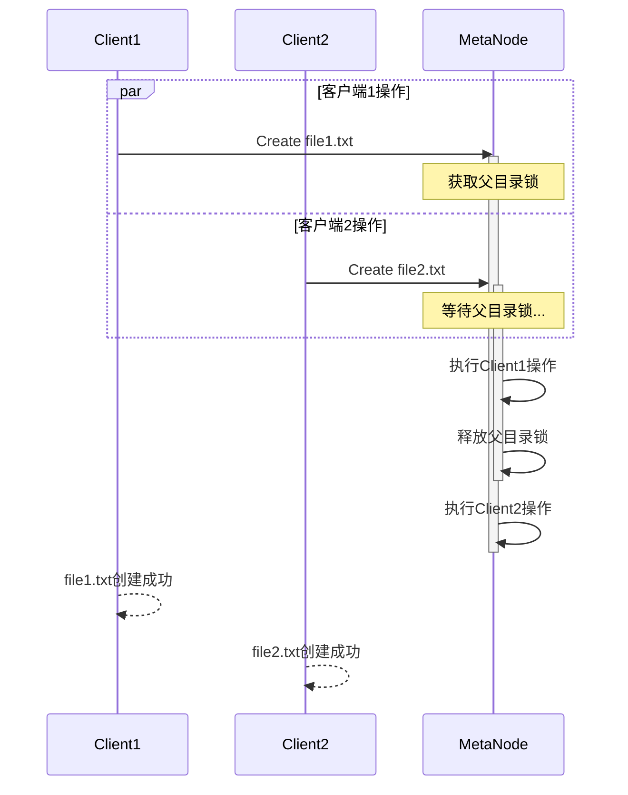
```mermaid
sequenceDiagram
    participant Client1
    participant Client2
    participant MetaNode as MetaNode

    par 客户端1操作
        Client1->>MetaNode: Create file1.txt
        activate MetaNode
        Note over MetaNode: 获取父目录锁
    and 客户端2操作
        Client2->>MetaNode: Create file2.txt
        activate MetaNode
        Note over MetaNode: 等待父目录锁...
    end

    MetaNode->>MetaNode: 执行Client1操作
    MetaNode->>MetaNode: 释放父目录锁
    deactivate MetaNode

    MetaNode->>MetaNode: 执行Client2操作
    deactivate MetaNode

    Client1-->>Client1: file1.txt创建成功
    Client2-->>Client2: file2.txt创建成功
```

### 7.2 数据并发控制

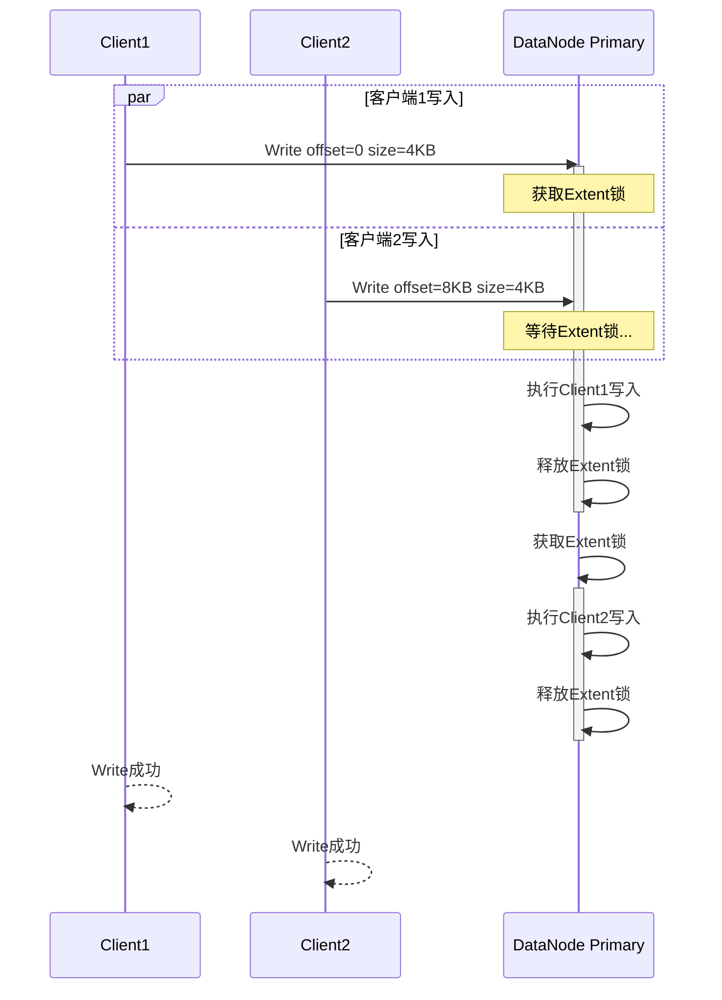
```mermaid
sequenceDiagram
    participant Client1
    participant Client2
    participant DN as DataNode Primary

    par 客户端1写入
        Client1->>DN: Write offset=0 size=4KB
        activate DN
        Note over DN: 获取Extent锁
    and 客户端2写入
        Client2->>DN: Write offset=8KB size=4KB
        Note over DN: 等待Extent锁...
    end

    DN->>DN: 执行Client1写入
    DN->>DN: 释放Extent锁
    deactivate DN

    DN->>DN: 获取Extent锁
    activate DN
    DN->>DN: 执行Client2写入
    DN->>DN: 释放Extent锁
    deactivate DN

    Client1-->>Client1: Write成功
    Client2-->>Client2: Write成功
```

---

## 八、完整 IO 时间线示例

### 8.1 顺序写时间线(4KB)

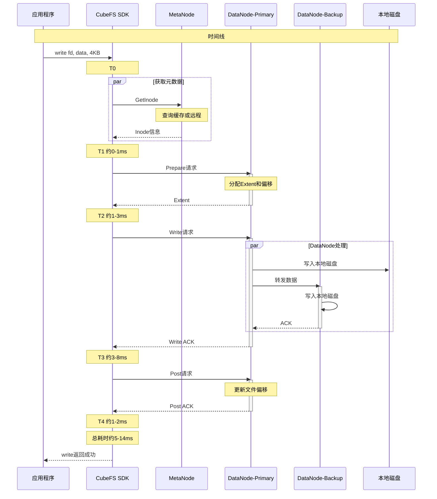
```mermaid
sequenceDiagram
    participant App as 应用程序
    participant SDK as CubeFS SDK
    participant MN as MetaNode
    participant DP as DataNode-Primary
    participant DB as DataNode-Backup
    participant Disk as 本地磁盘

    Note over App,Disk: 时间线

    App->>SDK: write fd, data, 4KB
    Note over SDK: T0

    par 获取元数据
        SDK->>MN: GetInode
        Note over MN: 查询缓存或远程
        MN-->>SDK: Inode信息
    end
    Note over SDK: T1 约0-1ms

    SDK->>DP: Prepare请求
    activate DP
    Note over DP: 分配Extent和偏移
    DP-->>SDK: Extent#1, Offset#0
    deactivate DP
    Note over SDK: T2 约1-3ms

    SDK->>DP: Write请求
    activate DP
    par DataNode处理
        DP->>Disk: 写入本地磁盘
        DP->>DB: 转发数据
        activate DB
        DB->>DB: 写入本地磁盘
        DB-->>DP: ACK
        deactivate DB
    end
    DP-->>SDK: Write ACK
    deactivate DP
    Note over SDK: T3 约3-8ms

    SDK->>DP: Post请求
    activate DP
    Note over DP: 更新文件偏移
    DP-->>SDK: Post ACK
    deactivate DP
    Note over SDK: T4 约1-2ms

    Note over SDK: 总耗时约5-14ms

    SDK-->>App: write返回成功
```

### 8.2 顺序读时间线(4KB)

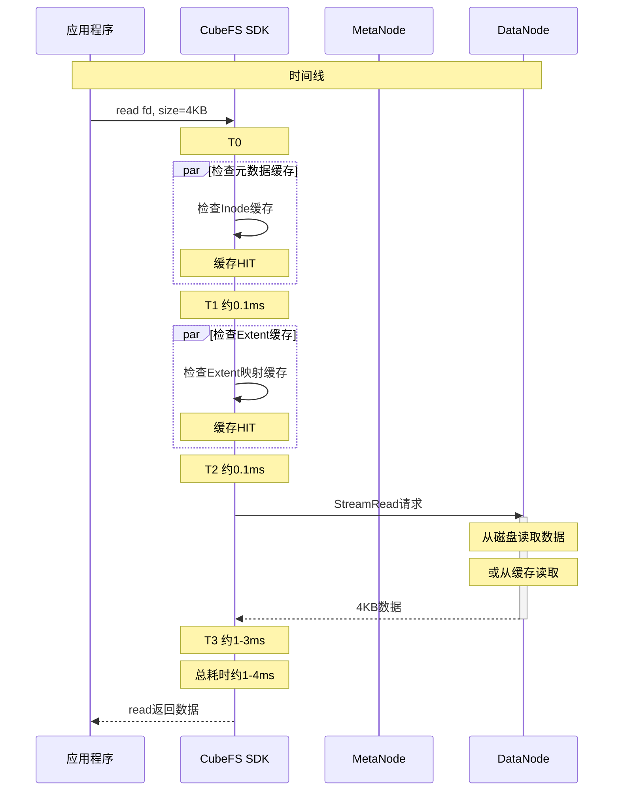
```mermaid
sequenceDiagram
    participant App as 应用程序
    participant SDK as CubeFS SDK
    participant MN as MetaNode
    participant DN as DataNode

    Note over App,DN: 时间线

    App->>SDK: read fd, size=4KB
    Note over SDK: T0

    par 检查元数据缓存
        SDK->>SDK: 检查Inode缓存
        Note over SDK: 缓存HIT
    end
    Note over SDK: T1 约0.1ms

    par 检查Extent缓存
        SDK->>SDK: 检查Extent映射缓存
        Note over SDK: 缓存HIT
    end
    Note over SDK: T2 约0.1ms

    SDK->>DN: StreamRead请求
    activate DN
    Note over DN: 从磁盘读取数据
    Note over DN: 或从缓存读取
    DN-->>SDK: 4KB数据
    deactivate DN
    Note over SDK: T3 约1-3ms

    Note over SDK: 总耗时约1-4ms

    SDK-->>App: read返回数据
```

---

## 九、故障处理流程

### 9.1 写入失败恢复

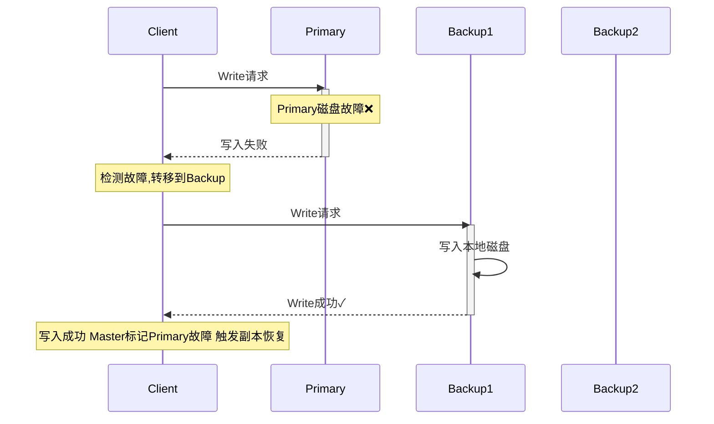
```mermaid
sequenceDiagram
    participant Client
    participant Primary as Primary
    participant Backup1 as Backup1
    participant Backup2 as Backup2

    Client->>Primary: Write请求
    activate Primary
    Note over Primary: Primary磁盘故障❌
    Primary-->>Client: 写入失败
    deactivate Primary

    Note over Client: 检测故障,转移到Backup

    Client->>Backup1: Write请求
    activate Backup1
    Backup1->>Backup1: 写入本地磁盘
    Backup1-->>Client: Write成功✓
    deactivate Backup1

    Note over Client: 写入成功 Master标记Primary故障 触发副本恢复
```

### 9.2 读取失败恢复

```mermaid
sequenceDiagram
    participant Client
    participant Primary as Primary
    participant Backup as Backup

    Client->>Primary: StreamRead请求
    activate Primary
    Note over Primary: 读磁盘失败❌ IO错误
    Primary-->>Client: 读失败
    deactivate Primary

    Note over Client: 自动重试Backup

    Client->>Backup: StreamRead请求
    activate Backup
    Note over Backup: 从Backup读取
    Backup-->>Client: 返回数据✓
    deactivate Backup

    Note over Client: 读取成功 Master增加Primary故障计数 触发故障转移
```

---

## 十、性能指标

### 10.1 典型 IO 延迟(本地集群)

| 操作类型 | 缓存HIT | 缓存MISS | 说明 |
|---------|--------|---------|------|
| **单次写入(4KB)** | 3-8ms | 5-14ms | 包含Prepare/Write/Post三阶段 |
| **单次读取(4KB)** | 0.5-2ms | 1-5ms | 缓存命中延迟极低 |
| **顺序写(预热)** | 2-5ms | 3-8ms | 批量提交优化 |
| **顺序读(预读)** | 0.2-1ms | 0.5-2ms | 预读缓存命中 |
| **元数据查询** | 0.1-0.5ms | 1-3ms | Inode/Dentry查询 |
| **目录遍历** | 1-5ms | 5-20ms | 取决于目录文件数 |

### 10.2 典型吞吐量(集群环境)

| 场景 | 单客户端 | 10客户端 | 100客户端 |
|-----|--------|---------|----------|
| **顺序写** | 200-300MB/s | 2-4GB/s | 10-20GB/s |
| **顺序读** | 300-500MB/s | 3-6GB/s | 15-30GB/s |
| **随机写** | 50-100MB/s | 500MB-1GB/s | 5-10GB/s |
| **随机读** | 100-200MB/s | 1-3GB/s | 10-20GB/s |
| **元数据操作** | 1000-5000ops | 10k-50kops | 50k-100kops |

---

## 十一、最佳实践

### 11.1 写入优化

```yaml
# 客户端配置优化

# 开启写缓冲
write_buffer_enabled: true
write_buffer_size: 64MB

# 批量提交优化
batch_write_enabled: true
batch_write_threshold: 16KB

# 异步写入
async_write_enabled: true
async_write_threads: 4

# 副本确认模式
write_ack_mode: "multi-replica"  # 等待多副本ACK
```

### 11.2 读取优化

```yaml
# 客户端配置优化

# 预读
read_ahead_enabled: true
read_ahead_size: 1MB

# 缓存策略
cache_enabled: true
cache_size: 100MB

# 连接复用
connection_pool_enabled: true
connection_pool_size: 32

# 读重试策略
read_retry_count: 3
read_retry_timeout: 5000  # ms
```

### 11.3 并发控制

```yaml
# 并发参数

# 客户端并发
concurrent_io: 128

# 连接并发
concurrent_connections: 64

# 元数据操作并发
meta_concurrent_ops: 256

# 数据操作并发
data_concurrent_ops: 512
```

---

## 十二、故障排查

### 12.1 常见问题

| 问题 | 症状 | 排查步骤 |
|-----|------|---------|
| **写入卡顿** | Write延迟大于 1秒 | 1.检查DataNode磁盘 2.检查网络 3.检查Master |
| **读取失败** | 读操作返回错误 | 1.检查副本状态 2.检查MetaNode 3.检查网络 |
| **元数据一致性错误** | ENOENT或文件不存在 | 1.检查MetaNode日志 2.修复副本 3.重建索引 |
| **性能下降** | 吞吐量从10GB/s降到1GB/s | 1.检查硬件 2.检查热点分片 3.检查网络 |

### 12.2 监控指标

```
关键监控指标：

IO操作指标：
  - 读取延迟P50/P90/P99
  - 写入延迟P50/P90/P99
  - 单位时间内操作数IOPS
  - 吞吐量Throughput

错误指标：
  - 读取失败率
  - 写入失败率
  - 副本不一致数量
  - 超时请求数

系统指标：
  - DataNode磁盘利用率
  - DataNode内存使用
  - 网络带宽使用
  - CPU使用率
```

---

## 十三、总结

CubeFS 的 IO 流程特点：

### 写入流程

✓ **三阶段设计**：Prepare(分配) → Write(写入) → Post(提交)
✓ **主备复制**：顺序写使用主备，随机写使用 Raft
✓ **强一致性**：多副本同步保证数据安全
✓ **高性能**：批量处理和异步优化

### 读取流程

✓ **多层缓存**：元数据缓存、Extent缓存、数据缓存
✓ **智能副本选择**：优先选择最近副本
✓ **自动故障转移**：读失败自动重试
✓ **预读优化**：顺序读预读提升性能

### 元数据操作

✓ **原子性**：Inode 和 Dentry 原子创建删除
✓ **并发控制**：细粒度锁保证一致性
✓ **高可用**：多副本同步

---

## 参考资源

- CubeFS 官方文档：https://cubefs.io/docs/master/overview/introduction.html
- CubeFS GitHub：https://github.com/cubefs/cubefs
- 分布式存储设计：https://ti.alibaba-inc.com/
```
