# CubeFS 一致性机制详解

## 一、概述

CubeFS采用**多层一致性保证机制**，在不同的存储层次使用不同的协议：

| 层级 | 组件 | 一致性协议 | 说明 |
|-----|------|----------|------|
| **控制平面** | Master Server | Raft (etcd/raft v3) | 元数据一致性 |
| **元数据平面** | MetaNode | Raft 副本同步 | Inode/Dentry 一致性 |
| **数据平面** | DataNode | 主备复制 + Multi-Raft | 数据副本一致性 |

---

## 二、Master 层的一致性机制（元数据管理）

### 2.1 架构概览

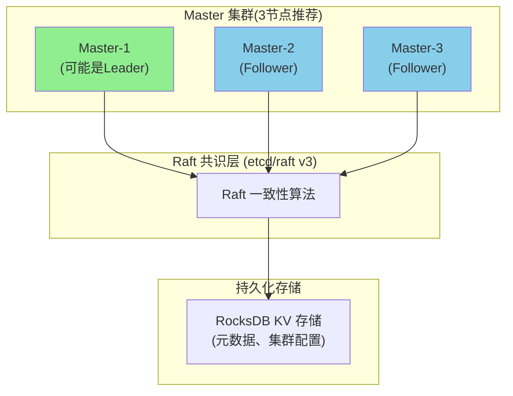
```mermaid
graph TB
    subgraph MasterCluster["Master 集群(3节点推荐)"]
        M1["Master-1\n(可能是Leader)"]
        M2["Master-2\n(Follower)"]
        M3["Master-3\n(Follower)"]
    end
    
    subgraph RaftLayer["Raft 共识层 (etcd/raft v3)"]
        Raft["Raft 一致性算法"]
    end
    
    subgraph StorageLayer["持久化存储"]
        RocksDB["RocksDB KV 存储\n(元数据、集群配置)"]
    end
    
    M1 --> Raft
    M2 --> Raft
    M3 --> Raft
    Raft --> RocksDB
    
    style M1 fill:#90EE90
    style M2 fill:#87CEEB
    style M3 fill:#87CEEB
```

### 2.2 Raft 一致性协议 - 三阶段流程

#### 阶段1：命令提交到 Raft 日志

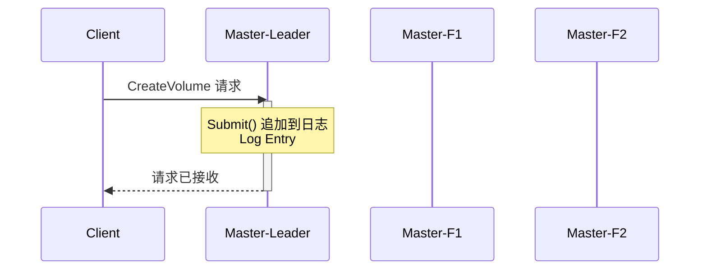
```mermaid
sequenceDiagram
    participant Client
    participant Leader as Master-Leader
    participant Follower1 as Master-F1
    participant Follower2 as Master-F2

    Client->>Leader: CreateVolume 请求
    activate Leader
    Note over Leader: Submit() 追加到日志<br/>Log Entry #100<br/>索引: 100<br/>状态: UNCOMMITTED
    Leader-->>Client: 请求已接收
    deactivate Leader
```

#### 阶段2：Leader 复制日志条目到 Followers

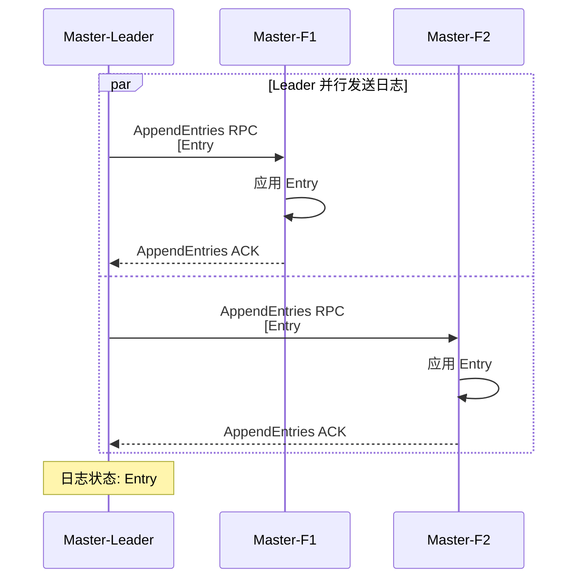
```mermaid
sequenceDiagram
    participant Leader as Master-Leader
    participant F1 as Master-F1
    participant F2 as Master-F2

    par Leader 并行发送日志
        Leader->>F1: AppendEntries RPC<br/>[Entry #100]
        F1->>F1: 应用 Entry #100<br/>追加到本地日志
        F1-->>Leader: AppendEntries ACK
    and
        Leader->>F2: AppendEntries RPC<br/>[Entry #100]
        F2->>F2: 应用 Entry #100<br/>追加到本地日志
        F2-->>Leader: AppendEntries ACK
    end
    
    Note over Leader: 日志状态: Entry #100<br/>已复制到多数节点 ✓
```

#### 阶段3：Leader 提交日志条目到状态机

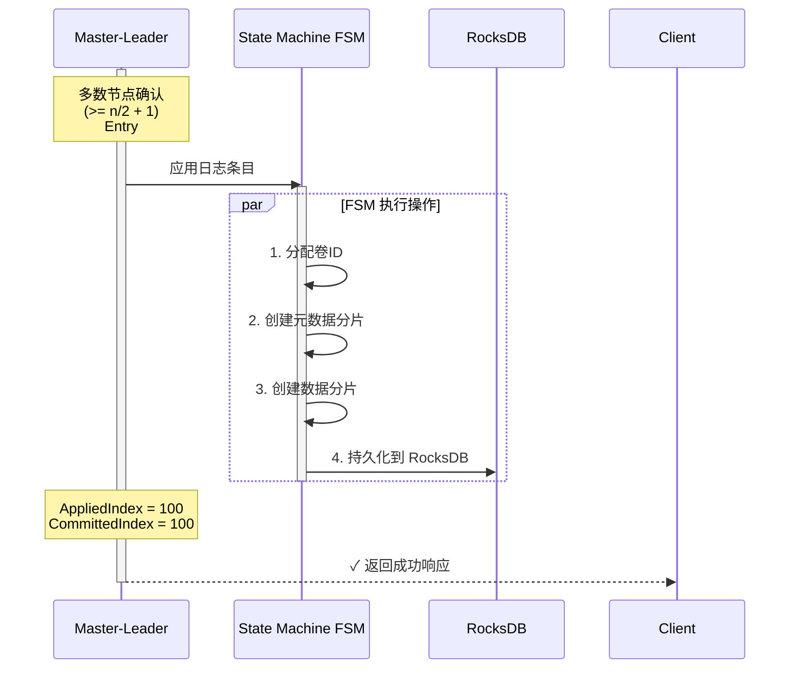
```mermaid
sequenceDiagram
    participant Leader as Master-Leader
    participant FSM as State Machine FSM
    participant RocksDB as RocksDB
    participant Client

    activate Leader
    Note over Leader: 多数节点确认<br/>(>= n/2 + 1)<br/>Entry#100 可以提交
    
    Leader->>FSM: 应用日志条目
    activate FSM
    
    par FSM 执行操作
        FSM->>FSM: 1. 分配卷ID
        FSM->>FSM: 2. 创建元数据分片
        FSM->>FSM: 3. 创建数据分片
        FSM->>RocksDB: 4. 持久化到 RocksDB
    end
    
    deactivate FSM
    
    Note over Leader: AppliedIndex = 100<br/>CommittedIndex = 100
    
    Leader-->>Client: ✓ 返回成功响应
    deactivate Leader
```

### 2.3 强一致性保证

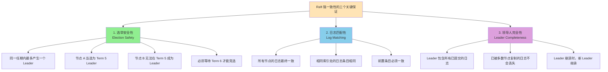
```mermaid
graph TD
    A["Raft 强一致性的三个关键保证"]
    
    A --> B["1. 选举安全性<br/>Election Safety"]
    B --> B1["同一任期内最多产生一个 Leader"]
    B --> B2["节点 A 当选为 Term 5 Leader"]
    B --> B3["节点 B 无法在 Term 5 成为 Leader"]
    B --> B4["必须等待 Term 6 才能竞选"]
    
    A --> C["2. 日志匹配性<br/>Log Matching"]
    C --> C1["所有节点的日志最终一致"]
    C --> C2["相同索引处的日志条目相同"]
    C --> C3["前置条目必须一致"]
    
    A --> D["3. 领导人完全性<br/>Leader Completeness"]
    D --> D1["Leader 包含所有已提交的日志"]
    D --> D2["已被多数节点复制的日志不会丢失"]
    D --> D3["Leader 崩溃时，新 Leader 继承"]
    
    style A fill:#FFE4B5
    style B fill:#90EE90
    style C fill:#87CEEB
    style D fill:#DDA0DD
```

---

## 三、MetaNode 层的一致性机制

### 3.1 元数据分片副本一致性

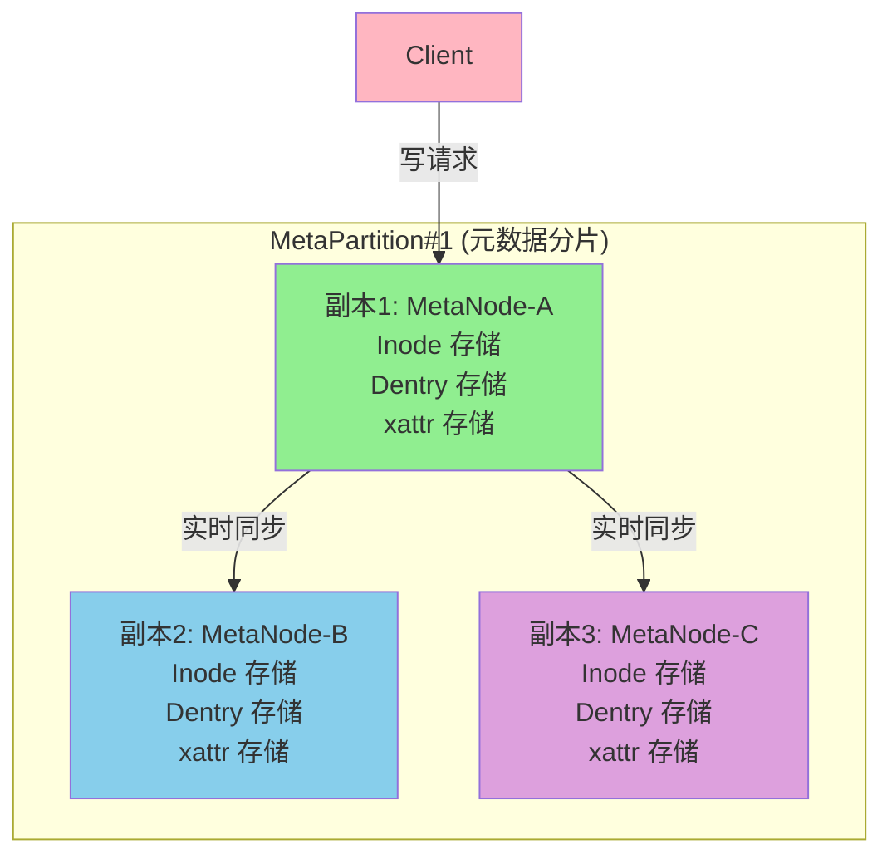
```mermaid
graph TB
    subgraph MP["MetaPartition#1 (元数据分片)"]
        R1["副本1: MetaNode-A<br/>Inode 存储<br/>Dentry 存储<br/>xattr 存储"]
        R2["副本2: MetaNode-B<br/>Inode 存储<br/>Dentry 存储<br/>xattr 存储"]
        R3["副本3: MetaNode-C<br/>Inode 存储<br/>Dentry 存储<br/>xattr 存储"]
    end
    
    Client["Client"]
    
    Client -->|写请求| R1
    R1 -->|实时同步| R2
    R1 -->|实时同步| R3
    
    style Client fill:#FFB6C1
    style R1 fill:#90EE90
    style R2 fill:#87CEEB
    style R3 fill:#DDA0DD
```

### 3.2 元数据写操作流程（创建文件为例）

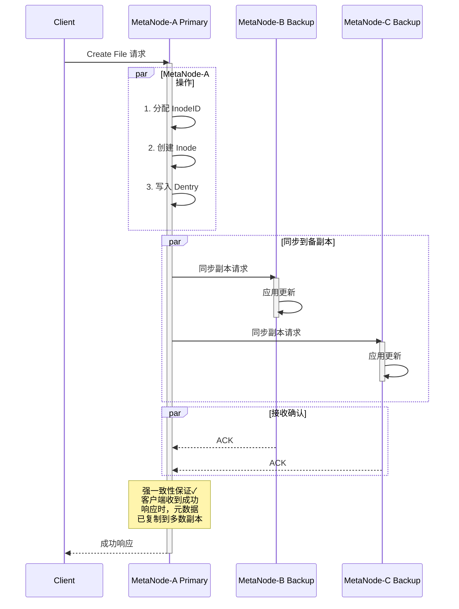
```mermaid
sequenceDiagram
    participant Client
    participant MA as MetaNode-A Primary
    participant MB as MetaNode-B Backup
    participant MC as MetaNode-C Backup

    Client->>MA: Create File 请求
    activate MA
    
    par MetaNode-A 操作
        MA->>MA: 1. 分配 InodeID
        MA->>MA: 2. 创建 Inode
        MA->>MA: 3. 写入 Dentry
    end
    
    par 同步到备副本
        MA->>MB: 同步副本请求
        activate MB
        MB->>MB: 应用更新
        deactivate MB
        
        MA->>MC: 同步副本请求
        activate MC
        MC->>MC: 应用更新
        deactivate MC
    end
    
    par 接收确认
        MB-->>MA: ACK
        MC-->>MA: ACK
    end
    
    Note over MA: 强一致性保证✓<br/>客户端收到成功<br/>响应时，元数据<br/>已复制到多数副本
    
    MA-->>Client: 成功响应
    deactivate MA
```

---

## 四、DataNode 层的一致性机制(核心创新)

CubeFS 在数据层使用**两种不同的复制协议**，根据写入模式自适应选择：

### 4.1 协议对比

| 特性 | 顺序写(Sequential Write) | 随机写(Random Write) |
|------|--------------------------|----------------------|
| **复制协议** | 主备复制(Primary-Backup) | Multi-Raft |
| **一致性级别** | 强一致性 | 强一致性 |
| **性能** | 高吞吐 | 中等 |
| **适用场景** | 新建文件顺序追加 | 文件覆盖/修改 |
| **通信开销** | 低 | 中等 |

### 4.2 顺序写 - 主备复制协议

#### Prepare 阶段

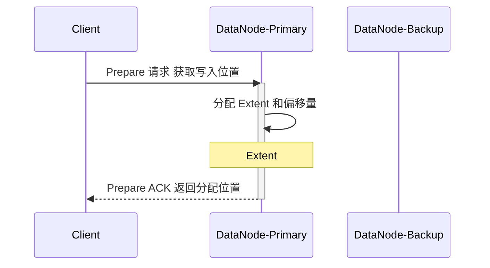
```mermaid
sequenceDiagram
    participant Client
    participant Primary as DataNode-Primary
    participant Backup as DataNode-Backup

    Client->>Primary: Prepare 请求 获取写入位置
    activate Primary
    
    Primary->>Primary: 分配 Extent 和偏移量
    
    Note over Primary: Extent#1, Offset#0
    
    Primary-->>Client: Prepare ACK 返回分配位置
    deactivate Primary
```

#### Write 阶段

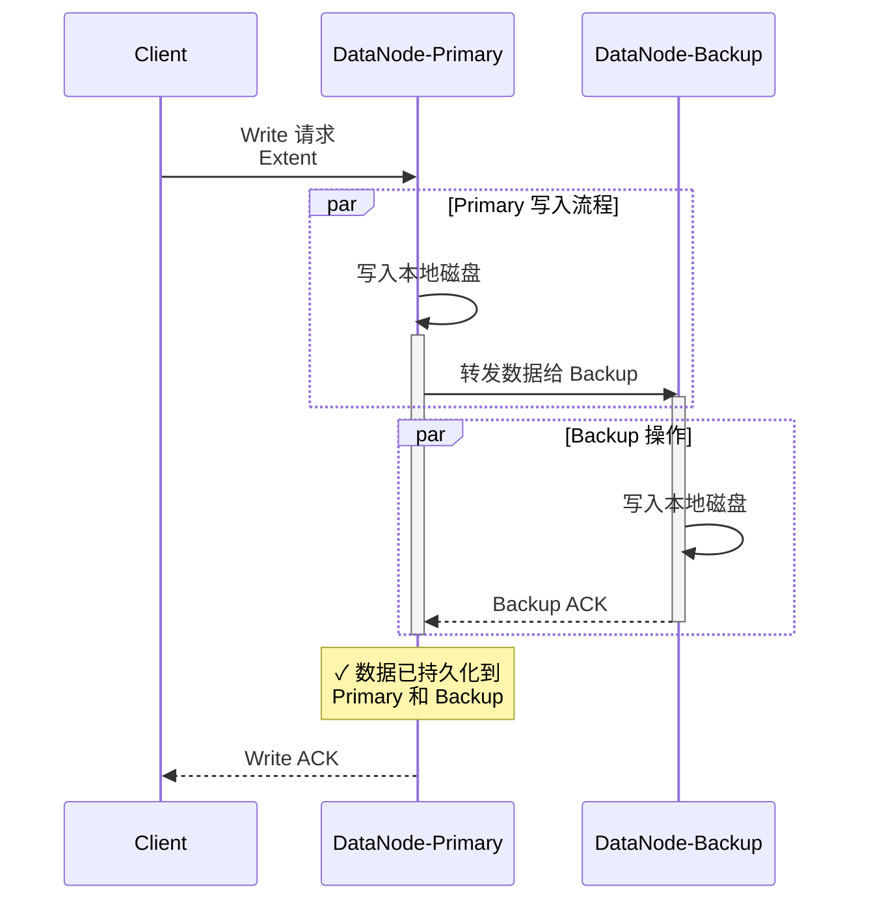
```mermaid
sequenceDiagram
    participant Client
    participant Primary as DataNode-Primary
    participant Backup as DataNode-Backup

    Client->>Primary: Write 请求<br/>Extent#1, Offset#0, Data

    par Primary 写入流程
        Primary->>Primary: 写入本地磁盘
        activate Primary
        Primary->>Backup: 转发数据给 Backup
        activate Backup
    end

    par Backup 操作
        Backup->>Backup: 写入本地磁盘
        Backup-->>Primary: Backup ACK
        deactivate Backup
    end

    deactivate Primary
    
    Note over Primary: ✓ 数据已持久化到<br/>Primary 和 Backup
    
    Primary-->>Client: Write ACK
```

#### Post 阶段

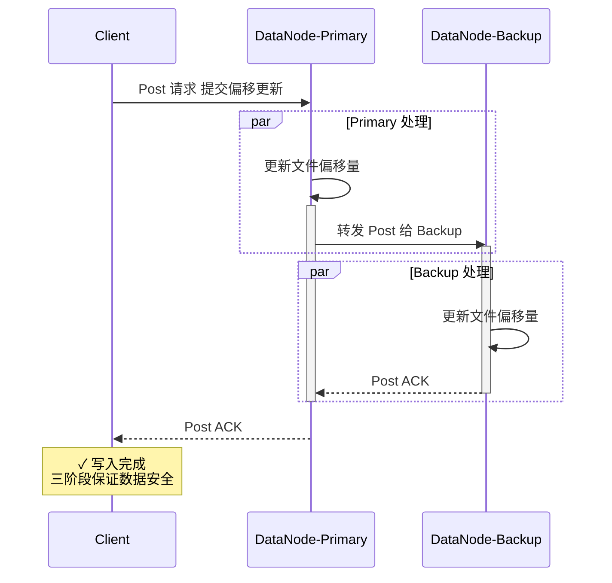
```mermaid
sequenceDiagram
    participant Client
    participant Primary as DataNode-Primary
    participant Backup as DataNode-Backup

    Client->>Primary: Post 请求 提交偏移更新

    par Primary 处理
        Primary->>Primary: 更新文件偏移量
        activate Primary
        Primary->>Backup: 转发 Post 给 Backup
        activate Backup
    end

    par Backup 处理
        Backup->>Backup: 更新文件偏移量
        Backup-->>Primary: Post ACK
        deactivate Backup
    end

    deactivate Primary

    Primary-->>Client: Post ACK
    
    Note over Client: ✓ 写入完成<br/>三阶段保证数据安全
```

#### 完整流程总览

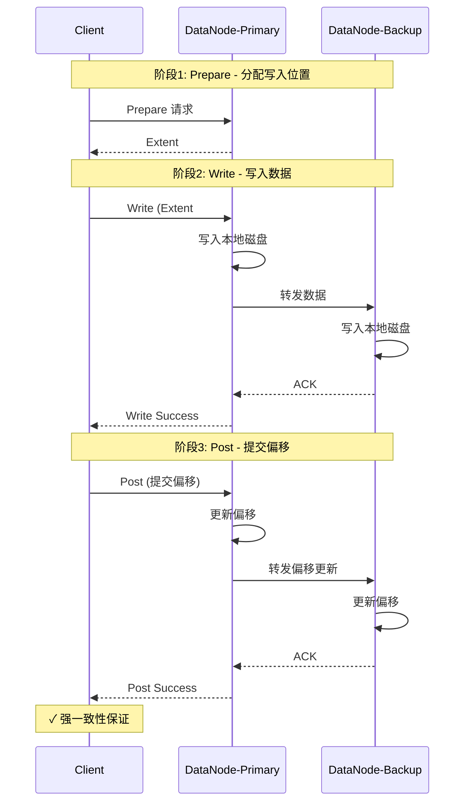
```mermaid
sequenceDiagram
    participant Client
    participant Primary as DataNode-Primary
    participant Backup as DataNode-Backup

    Note over Client,Backup: 阶段1: Prepare - 分配写入位置
    Client->>Primary: Prepare 请求
    Primary-->>Client: Extent#1, Offset#0
    
    Note over Client,Backup: 阶段2: Write - 写入数据
    Client->>Primary: Write (Extent#1, Data)
    Primary->>Primary: 写入本地磁盘
    Primary->>Backup: 转发数据
    Backup->>Backup: 写入本地磁盘
    Backup-->>Primary: ACK
    Primary-->>Client: Write Success

    Note over Client,Backup: 阶段3: Post - 提交偏移
    Client->>Primary: Post (提交偏移)
    Primary->>Primary: 更新偏移
    Primary->>Backup: 转发偏移更新
    Backup->>Backup: 更新偏移
    Backup-->>Primary: ACK
    Primary-->>Client: Post Success
    
    Note over Client: ✓ 强一致性保证
```

### 4.3 随机写 - Multi-Raft 复制协议

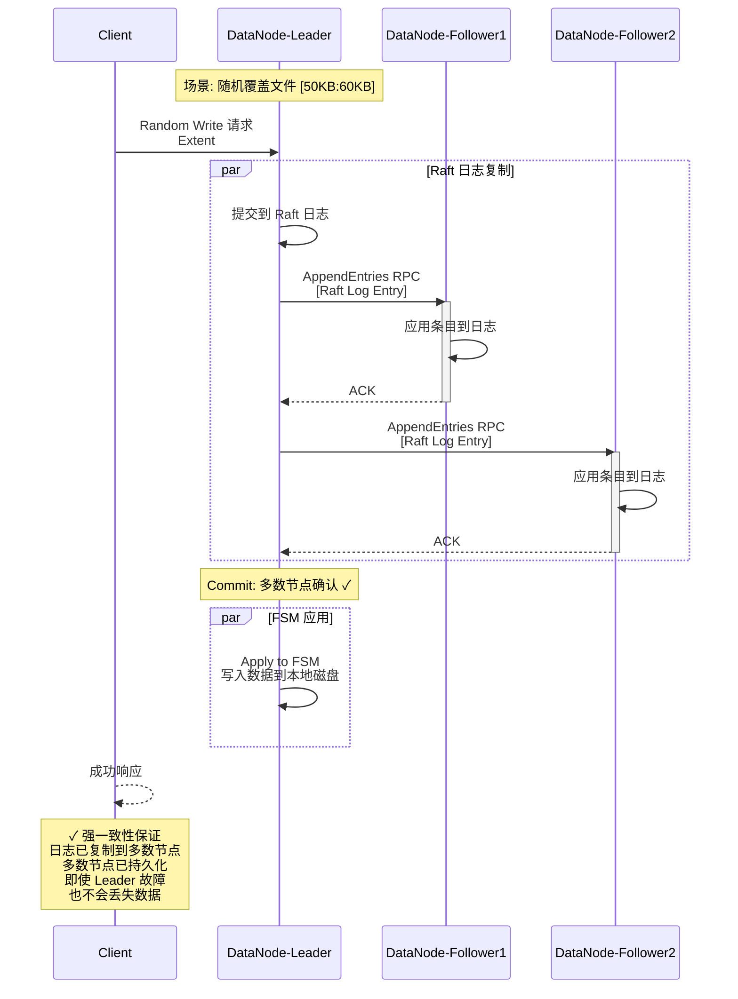
```mermaid
sequenceDiagram
    participant Client
    participant Leader as DataNode-Leader
    participant F1 as DataNode-Follower1
    participant F2 as DataNode-Follower2

    Note over Leader: 场景: 随机覆盖文件 [50KB:60KB]
    
    Client->>Leader: Random Write 请求<br/>Extent#1, Offset#50KB, Data

    par Raft 日志复制
        Leader->>Leader: 提交到 Raft 日志
        Leader->>F1: AppendEntries RPC<br/>[Raft Log Entry]
        activate F1
        F1->>F1: 应用条目到日志
        F1-->>Leader: ACK
        deactivate F1

        Leader->>F2: AppendEntries RPC<br/>[Raft Log Entry]
        activate F2
        F2->>F2: 应用条目到日志
        F2-->>Leader: ACK
        deactivate F2
    end

    Note over Leader: Commit: 多数节点确认 ✓

    par FSM 应用
        Leader->>Leader: Apply to FSM<br/>写入数据到本地磁盘
    end

    Client-->>Client: 成功响应
    
    Note over Client: ✓ 强一致性保证<br/>日志已复制到多数节点<br/>多数节点已持久化<br/>即使 Leader 故障<br/>也不会丢失数据
```

### 4.4 两种协议的自适应选择

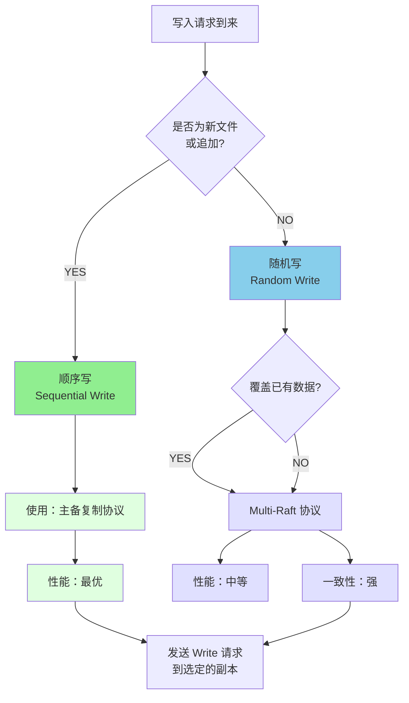
```mermaid
flowchart TD
    A["写入请求到来"]
    B{"是否为新文件<br/>或追加?"}
    C["顺序写<br/>Sequential Write"]
    D["使用：主备复制协议"]
    E["性能：最优"]
    F["随机写<br/>Random Write"]
    G{"覆盖已有数据?"}
    H["Multi-Raft 协议"]
    I["性能：中等"]
    J["一致性：强"]
    K["发送 Write 请求<br/>到选定的副本"]
    
    A --> B
    B -->|YES| C
    C --> D
    D --> E
    B -->|NO| F
    F --> G
    G -->|YES| H
    H --> I
    H --> J
    G -->|NO| H
    E --> K
    J --> K
    
    style C fill:#90EE90
    style D fill:#E0FFE0
    style E fill:#E0FFE0
    style F fill:#87CEEB
    style H fill:#E0E0FF
    style I fill:#E0E0FF
    style J fill:#E0E0FF
```

---

## 五、故障恢复机制

### 5.1 故障检测

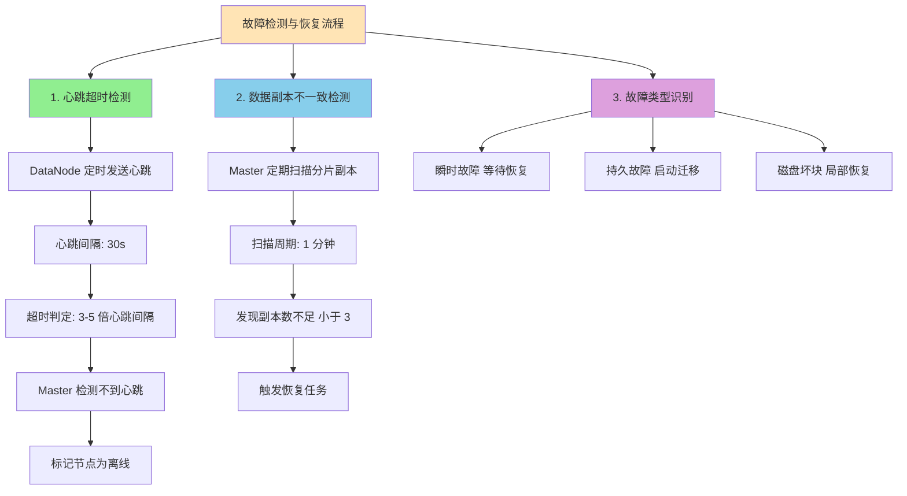
```mermaid
graph TB
    A["故障检测与恢复流程"]
    
    A --> B["1. 心跳超时检测"]
    B --> B1["DataNode 定时发送心跳"]
    B1 --> B2["心跳间隔: 30s"]
    B2 --> B3["超时判定: 3-5 倍心跳间隔"]
    B3 --> B4["Master 检测不到心跳"]
    B4 --> B5["标记节点为离线"]
    
    A --> C["2. 数据副本不一致检测"]
    C --> C1["Master 定期扫描分片副本"]
    C1 --> C2["扫描周期: 1 分钟"]
    C2 --> C3["发现副本数不足 小于 3"]
    C3 --> C4["触发恢复任务"]
    
    A --> D["3. 故障类型识别"]
    D --> D1["瞬时故障 等待恢复"]
    D --> D2["持久故障 启动迁移"]
    D --> D3["磁盘坏块 局部恢复"]
    
    style A fill:#FFE4B5
    style B fill:#90EE90
    style C fill:#87CEEB
    style D fill:#DDA0DD
```

### 5.2 顺序写后的副本恢复(Primary-Backup)

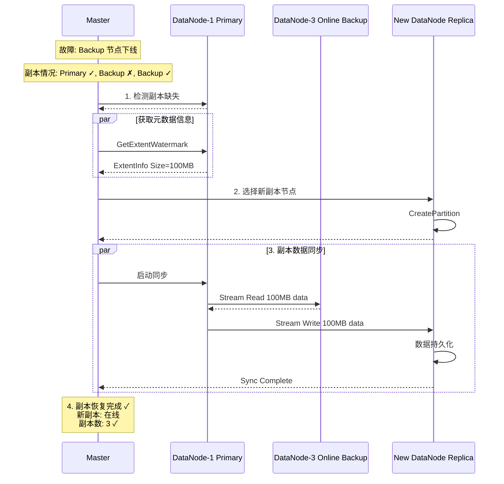
```mermaid
sequenceDiagram
    participant Master
    participant DN1 as DataNode-1 Primary
    participant DN3 as DataNode-3 Online Backup
    participant NewDN as New DataNode Replica

    Note over Master: 故障: Backup 节点下线
    Note over Master: 副本情况: Primary ✓, Backup ✗, Backup ✓

    Master->>DN1: 1. 检测副本缺失
    DN1-->>Master: 

    par 获取元数据信息
        Master->>DN1: GetExtentWatermark
        DN1-->>Master: ExtentInfo Size=100MB
    end

    Master->>NewDN: 2. 选择新副本节点

    NewDN->>NewDN: CreatePartition
    NewDN-->>Master: 

    par 3. 副本数据同步
        Master->>DN1: 启动同步
        DN1->>DN3: Stream Read 100MB data
        DN3-->>DN1: 
        DN1->>NewDN: Stream Write 100MB data
        NewDN->>NewDN: 数据持久化
        NewDN-->>Master: Sync Complete
    end

    Note over Master: 4. 副本恢复完成 ✓<br/>新副本: 在线<br/>副本数: 3 ✓
```

### 5.3 随机写后的一致性恢复(Multi-Raft)

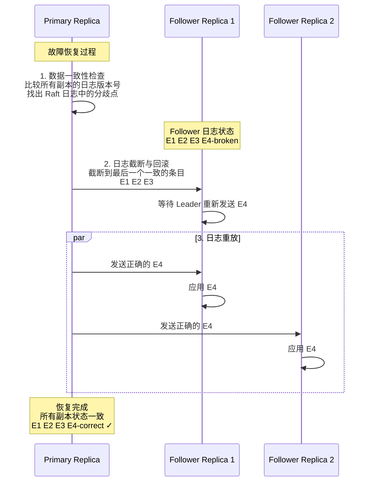
```mermaid
sequenceDiagram
    participant Primary as Primary Replica
    participant Backup1 as Follower Replica 1
    participant Backup2 as Follower Replica 2

    Note over Primary: 故障恢复过程

    Primary->>Primary: 1. 数据一致性检查<br/>比较所有副本的日志版本号<br/>找出 Raft 日志中的分歧点

    Note over Backup1: Follower 日志状态<br/>E1 E2 E3 E4-broken

    Primary->>Backup1: 2. 日志截断与回滚<br/>截断到最后一个一致的条目<br/>E1 E2 E3

    Backup1->>Backup1: 等待 Leader 重新发送 E4

    par 3. 日志重放
        Primary->>Backup1: 发送正确的 E4
        Backup1->>Backup1: 应用 E4
        Primary->>Backup2: 发送正确的 E4
        Backup2->>Backup2: 应用 E4
    end

    Note over Primary: 恢复完成<br/>所有副本状态一致<br/>E1 E2 E3 E4-correct ✓
```

---

## 六、一致性保证总结

### 6.1 三层一致性模型

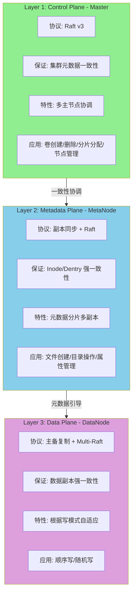
```mermaid
graph TB
    subgraph Layer1["Layer 1: Control Plane - Master"]
        MA["协议: Raft v3"]
        MB["保证: 集群元数据一致性"]
        MC["特性: 多主节点协调"]
        MD["应用: 卷创建/删除/分片分配/节点管理"]
    end
    
    subgraph Layer2["Layer 2: Metadata Plane - MetaNode"]
        NA["协议: 副本同步 + Raft"]
        NB["保证: Inode/Dentry 强一致性"]
        NC["特性: 元数据分片多副本"]
        ND["应用: 文件创建/目录操作/属性管理"]
    end
    
    subgraph Layer3["Layer 3: Data Plane - DataNode"]
        DA["协议: 主备复制 + Multi-Raft"]
        DB["保证: 数据副本强一致性"]
        DC["特性: 根据写模式自适应"]
        DD["应用: 顺序写/随机写"]
    end
    
    Layer1 --> |一致性协调| Layer2
    Layer2 --> |元数据引导| Layer3
    
    style Layer1 fill:#90EE90
    style Layer2 fill:#87CEEB
    style Layer3 fill:#DDA0DD
```

### 6.2 一致性类型

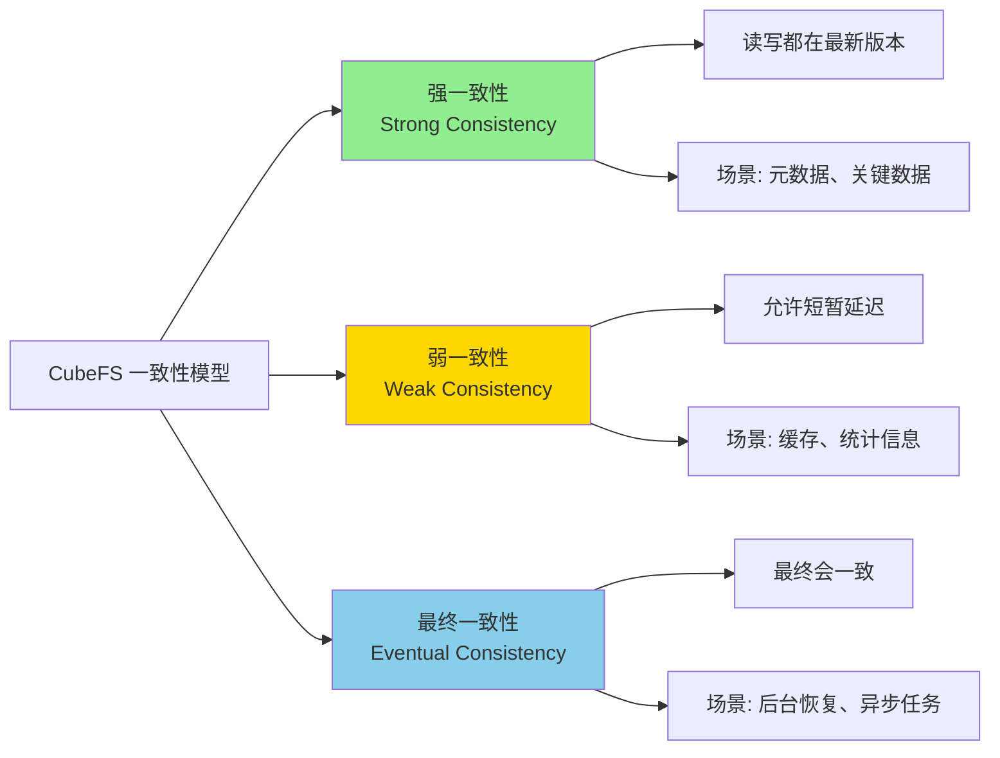
```mermaid
graph LR
    A["CubeFS 一致性模型"]
    
    A --> B["强一致性<br/>Strong Consistency"]
    B --> B1["读写都在最新版本"]
    B --> B2["场景: 元数据、关键数据"]
    
    A --> C["弱一致性<br/>Weak Consistency"]
    C --> C1["允许短暂延迟"]
    C --> C2["场景: 缓存、统计信息"]
    
    A --> D["最终一致性<br/>Eventual Consistency"]
    D --> D1["最终会一致"]
    D --> D2["场景: 后台恢复、异步任务"]
    
    style B fill:#90EE90
    style C fill:#FFD700
    style D fill:#87CEEB
```

### 6.3 故障场景下的保证

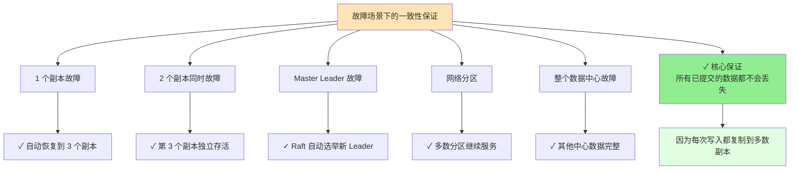
```mermaid
graph TB
    A["故障场景下的一致性保证"]
    
    A --> B["1 个副本故障"]
    B --> B1["✓ 自动恢复到 3 个副本"]
    
    A --> C["2 个副本同时故障"]
    C --> C1["✓ 第 3 个副本独立存活"]
    
    A --> D["Master Leader 故障"]
    D --> D1["✓ Raft 自动选举新 Leader"]
    
    A --> E["网络分区"]
    E --> E1["✓ 多数分区继续服务"]
    
    A --> F["整个数据中心故障"]
    F --> F1["✓ 其他中心数据完整"]
    
    A --> G["✓ 核心保证<br/>所有已提交的数据都不会丢失"]
    G --> G1["因为每次写入都复制到多数副本"]
    
    style A fill:#FFE4B5
    style G fill:#90EE90
    style G1 fill:#E0FFE0
```

---

## 七、性能优化

### 7.1 批处理优化

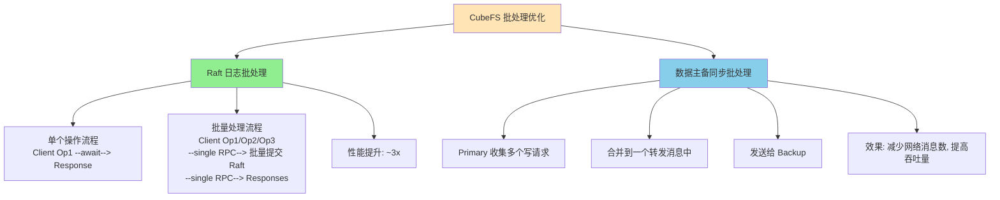
```mermaid
graph TB
    A["CubeFS 批处理优化"]
    
    A --> B["Raft 日志批处理"]
    B --> B1["单个操作流程<br/>Client Op1 --await--> Response"]
    B --> B2["批量处理流程<br/>Client Op1/Op2/Op3<br/>--single RPC--> 批量提交 Raft<br/>--single RPC--> Responses"]
    B --> B3["性能提升: ~3x"]
    
    A --> C["数据主备同步批处理"]
    C --> C1["Primary 收集多个写请求"]
    C --> C2["合并到一个转发消息中"]
    C --> C3["发送给 Backup"]
    C --> C4["效果: 减少网络消息数, 提高吞吐量"]
    
    style A fill:#FFE4B5
    style B fill:#90EE90
    style C fill:#87CEEB
```

### 7.2 异步确认模式

```mermaid
graph TD
    A["Write 操作的异步流程"]
    
    A --> B["Sync Write 同步模式"]
    B --> B1["Client 等待所有副本 ACK"]
    B --> B2["强一致性"]
    B --> B3["延迟高"]
    
    A --> C["Async Write 异步模式"]
    C --> C1["Client 收到 Primary ACK 即返回"]
    C --> C2["吞吐高"]
    C --> C3["延迟低"]
    C --> C4["需应用层处理故障"]
    
    A --> D["CubeFS 支持两种模式配置"]
    
    style B fill:#90EE90
    style C fill:#87CEEB
```

---

## 八、关键代码路径

### 8.1 Master Raft 提交

```go
// raftstore/partition.go
func (p *partition) Submit(cmd []byte) (resp interface{}, err error) {
    if !p.IsRaftLeader() {
        err = raft.ErrNotLeader
        return
    }
    // 提交到 Raft
    future := p.raft.Submit(p.id, cmd)
    
    // 阻塞等待 Raft 应用完成
    resp, err = future.Response()
    return
}
```

### 8.2 DataNode 主备写入

```go
// datanode 主要操作流程(伪代码)
func (dn *DataNode) HandleWrite(packet *Packet) {
    if dn.IsPrimary(packet) {
        // 1. Prepare: 分配 Extent
        extent := dn.prepareWrite(packet)
        
        // 2. Write: 写入本地 + 转发 Backup
        dn.writeLocal(extent, packet.Data)
        dn.syncToBackup(extent, packet.Data)
        
        // 3. Post: 更新元数据
        dn.postWrite(extent)
        
        packet.Reply(Success)
    }
}
```

### 8.3 随机写 Raft

```go
// datanode 随机写流程
func (dn *DataNode) HandleRandomWrite(packet *Packet) {
    if dn.IsRaftLeader(partition) {
        // 1. 提交到 Raft 日志
        entry := createLogEntry(packet)
        future := dn.partition.Submit(entry)
        
        // 2. 等待日志被复制到多数副本
        resp, err := future.Response()
        
        // 3. FSM 应用：写入数据
        if err == nil {
            dn.applyWrite(entry)
            packet.Reply(Success)
        }
    }
}
```

---

## 九、最佳实践

### 9.1 配置建议

```yaml
# CubeFS 一致性相关配置

# Master 配置
master:
  # Raft 心跳间隔(毫秒)
  tickInterval: 500
  
  # Raft 选举超时(ticks)
  electionTick: 5
  
  # 保留的 Raft 日志数
  retainLogs: 20000

# DataNode 配置  
datanode:
  # 副本数(推荐 3)
  replicaNum: 3
  
  # 心跳间隔
  heartbeat: 30s
  
  # 数据同步超时
  syncTimeout: 5s
```

### 9.2 监控指标

```
关键监控指标：

1. Master Raft 相关：
   - Leader 任期(term)变化频率
   - 日志复制延迟
   - 提交索引 vs 应用索引差值

2. 数据副本相关：
   - 副本缺失数量
   - 副本不一致数量
   - 恢复进度

3. 写入一致性：
   - 同步写延迟分布
   - 异步写丢失率(应为 0)
   - 主备同步失败率
```

---

## 十、总结

CubeFS 采用**分层一致性架构**：

| 层级 | 机制 | 优势 |
|-----|------|------|
| **Master** | Raft 多副本 | 元数据高可用 |
| **MetaNode** | 副本同步 | Inode/Dentry 强一致 |
| **DataNode** | 主备 + Raft | 根据场景优化性能 |

### 关键特点：

✓ **强一致性保证**：所有已确认写入都不会丢失
✓ **高可用性**：故障自动转移，无单点问题
✓ **性能优化**：不同场景选择最优协议
✓ **故障恢复**：自动检测与修复
✓ **可观测性**：完整的日志与指标支持

---

## 参考资源

- CubeFS 官方文档：https://cubefs.io/docs/master/overview/introduction.html
- Raft 论文：https://raft.github.io/raft.pdf
- CubeFS GitHub：https://github.com/cubefs/cubefs
```

---
