# CubeFS 元数据布局与时序流程分析

> 基于 `cubefs/metanode` 源码分析，梳理 MetaPartition 的内存布局、持久化结构以及关键操作的 Raft 共识时序。

---

## 目录

1. [总体架构](#1-总体架构)
2. [MetaPartition 内存布局](#2-metapartition-内存布局)
3. [核心数据结构](#3-核心数据结构)
4. [持久化文件布局](#4-持久化文件布局)
5. [Raft 共识与 FSM 机制](#5-raft-共识与-fsm-机制)
6. [关键时序流程图](#6-关键时序流程图)
7. [快照与恢复机制](#7-快照与恢复机制)
8. [总结](#8-总结)

---

## 1. 总体架构

CubeFS 的元数据子系统由 **MetaNode** 进程组成，每个 MetaNode 上运行多个 **MetaPartition** 实例。每个 MetaPartition 通过 **Raft** 协议在多个副本间实现强一致性，负责管理一段连续的 Inode ID 范围 `[Start, End)`。

```
┌─────────────────────────────────────────────────┐
│                   MetaNode                       │
│  ┌─────────────┐ ┌─────────────┐ ┌───────────┐ │
│  │ MetaPartition│ │ MetaPartition│ │   ...     │ │
│  │   (Raft     │ │   (Raft     │ │           │ │
│  │   Group 1)  │ │   Group 2)  │ │           │ │
│  └─────────────┘ └─────────────┘ └───────────┘ │
│         │              │                         │
│  ┌──────┴──────────────┴──────────────────┐     │
│  │         metadataManager                 │     │
│  └─────────────────────────────────────────┘     │
└─────────────────────────────────────────────────┘
```

### 核心组件关系

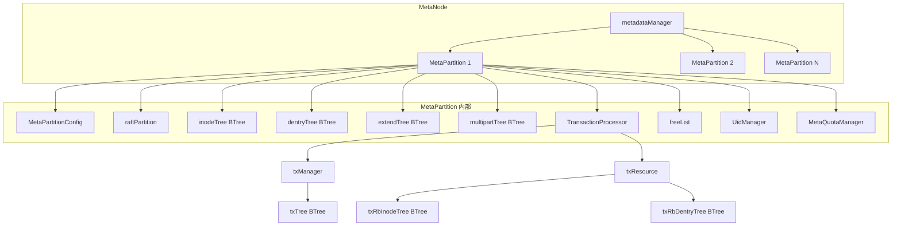

---

## 2. MetaPartition 内存布局

`metaPartition` 结构体（`partition.go`）维护了以下核心内存数据结构：

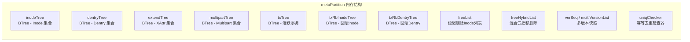

### 状态字段

| 字段 | 类型 | 说明 |
|------|------|------|
| `applyID` | `uint64` | 已应用的 Raft 日志索引（Inode/Dentry 最大 applyID） |
| `storedApplyId` | `uint64` | 已持久化到磁盘快照的 applyID |
| `size` | `uint64` | 分区内所有文件总大小 |
| `verSeq` | `uint64` | 当前版本序列号（快照功能） |
| `state` | `uint32` | 分区状态：Standby → Start → Running → Shutdown → Stopped |

### 状态机流转

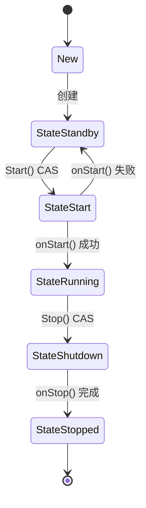

---

## 3. 核心数据结构

### 3.1 Inode（索引节点）

`Inode` 结构（`inode.go`）表示文件系统中的文件/目录元数据。

#### 内存结构

```
Inode {
    // 8-byte 字段
    Inode           uint64   // Inode ID
    Size            uint64   // 文件大小
    Generation      uint64   // 世代号
    CreateTime      int64    // 创建时间
    AccessTime      int64    // 访问时间
    ModifyTime      int64    // 修改时间
    Reserved        uint64   // 保留位（含标志位）
    LeaseExpireTime uint64   // 租约过期时间

    // 4-byte 字段
    Type            uint32   // 文件类型
    Uid             uint32   // 用户 ID
    Gid             uint32   // 组 ID
    NLink           uint32   // 硬链接计数
    Flag            int32    // 标志位
    StorageClass    uint32   // 存储类别
    ClientID        uint32   // 客户端 ID

    // 指针字段
    LinkTarget      []byte   // 符号链接目标
    multiSnap       *InodeMultiSnap          // 多版本快照
    HybridCloudExtents          *SortedHybridCloudExtents          // 混合云 Extents
    HybridCloudExtentsMigration *SortedHybridCloudExtentsMigration // 迁移 Extents
}
```

#### 序列化格式

```
Marshal Key:
  +-------+-------+
  | item  | Inode |
  +-------+-------+
  | bytes |   8   |
  +-------+-------+

Marshal Value:
  +-------+------+------+-----+----+----+----+--------+------------------+
  | item  | Type | Size | Gen | CT | AT | MT | ExtLen | MarshaledExtents |
  +-------+------+------+-----+----+----+----+--------+------------------+
  | bytes |  4   |  8   |  8  | 8  | 8  | 8  |   4    |      ExtLen      |
  +-------+------+------+-----+----+----+----+--------+------------------+

Marshal Entity (KV 对):
  +-------+-----------+--------------+-----------+--------------+
  | item  | KeyLength | MarshaledKey | ValLength | MarshaledVal |
  +-------+-----------+--------------+-----------+--------------+
  | bytes |     4     |   KeyLength  |     4     |   ValLength  |
  +-------+-----------+--------------+-----------+--------------+
```

#### Reserved 标志位

| 标志 | 值 | 说明 |
|------|------|------|
| `V2EnableEbsFlag` | `0x02` | 启用 EBS（BlobStore）对象 Extents |
| `V3EnableSnapInodeFlag` | `0x04` | 启用 Inode 快照 |
| `V4EnableHybridCloud` | `0x08` | 启用混合云 |
| `V4MigrationExtentsFlag` | `0x40` | 启用迁移 Extents |

### 3.2 Dentry（目录项）

`Dentry` 结构（`dentry.go`）表示目录中的条目，关联父目录与子 Inode。

#### 内存结构

```
Dentry {
    ParentId  uint64            // 父目录 Inode ID
    Inode     uint64            // 当前 Inode ID
    Name      string            // 名称
    Type      uint32            // 类型
    multiSnap *DentryMultiSnap  // 多版本快照
}
```

#### 序列化格式

```
Marshal Key:
  +-------+----------+------+
  | item  | ParentId | Name |
  +-------+----------+------+
  | bytes |    8     | rest |
  +-------+----------+------+

Marshal Value:
  +-------+-------+------+
  | item  | Inode | Type |
  +-------+-------+------+
  | bytes |   8   |   4  |
  +-------+-------+------+
```

#### BTree 排序规则

```go
func (d *Dentry) Less(than BtreeItem) bool {
    // 先按 ParentId 排序，相同则按 Name 排序
    return (d.ParentId < dentry.ParentId) ||
           (d.ParentId == dentry.ParentId && d.Name < dentry.Name)
}
```

### 3.3 其他数据结构

| 结构 | BTree | 说明 |
|------|-------|------|
| `Extend` | `extendTree` | 扩展属性（XAttr），Key 为 Inode ID |
| `Multipart` | `multipartTree` | Multipart 上传管理 |
| `TransactionInfo` | `txTree` | 活跃事务信息 |
| `TxRollbackInode` | `txRbInodeTree` | 事务回滚 Inode 记录 |
| `TxRollbackDentry` | `txRbDentryTree` | 事务回滚 Dentry 记录 |

---

## 4. 持久化文件布局

MetaPartition 的持久化数据存储在 `config.RootDir` 目录下，分为 **元数据文件** 和 **快照文件** 两部分。

### 4.1 目录结构

```
{RootDir}/
├── meta                          # MetaPartitionConfig (JSON)
├── snapshot/                     # 快照目录
│   ├── inode                     # Inode 快照
│   ├── dentry                    # Dentry 快照
│   ├── extend                    # Extend (XAttr) 快照
│   ├── multipart                 # Multipart 快照
│   ├── tx_info                   # 事务信息快照
│   ├── tx_rb_inode               # 事务回滚 Inode 快照
│   ├── tx_rb_dentry              # 事务回滚 Dentry 快照
│   ├── apply                     # ApplyID 文件
│   ├── transactionID             # 事务 ID 分配器
│   ├── uniqID                    # 唯一 ID 分配器
│   ├── uniqChecker               # 幂等检查器快照
│   ├── multiVer                  # 多版本列表
│   └── .sign                     # CRC 签名
└── .snapshot/                    # 临时快照写入目录
```

### 4.2 快照文件格式

#### Inode/Dentry/Tx 文件（长度前缀格式）

```
┌──────────┬───────────────────┬──────────┬───────────────────┬───┐
│ Len (4B) │ MarshaledData     │ Len (4B) │ MarshaledData     │...│
│  uint32  │    (Len bytes)    │  uint32  │    (Len bytes)    │   │
└──────────┴───────────────────┴──────────┴───────────────────┴───┘
```

每个记录由 4 字节长度头 + 变长数据体组成，整个文件末尾通过 CRC32 校验。

#### Extend/Multipart 文件（Varint 长度格式）

```
┌─────────────┬──────────────┬──────────────┬───────────────────┬───┐
│ Count (var) │ Len1 (var)   │ Data1 (Len1) │ Len2 (var)        │...│
│  记录总数   │ 第1条长度    │ 第1条数据    │ 第2条长度        │   │
└─────────────┴──────────────┴──────────────┴───────────────────┴───┘
```

#### ApplyID / TxID / UniqID 文件（纯文本格式）

```
# apply 文件
{applyID}|{cursor}

# transactionID 文件
{txID}

# uniqID 文件
{uniqId}
```

#### 多版本文件（multiVer）

```
{applyID}|{verListJSON}
```

### 4.3 快照文件常量定义

```go
const (
    snapshotDir         = "snapshot"
    snapshotDirTmp      = ".snapshot"
    inodeFile           = "inode"
    dentryFile          = "dentry"
    extendFile          = "extend"
    multipartFile       = "multipart"
    txInfoFile          = "tx_info"
    txRbInodeFile       = "tx_rb_inode"
    txRbDentryFile      = "tx_rb_dentry"
    applyIDFile         = "apply"
    TxIDFile            = "transactionID"
    uniqIDFile          = "uniqID"
    uniqCheckerFile     = "uniqChecker"
    verdataFile         = "multiVer"
    SnapshotSign        = ".sign"
    metadataFile        = "meta"
)
```

---

## 5. Raft 共识与 FSM 机制

### 5.1 写操作流程

所有写操作（CreateInode、UnlinkInode、CreateDentry 等）都必须通过 Raft 共识：

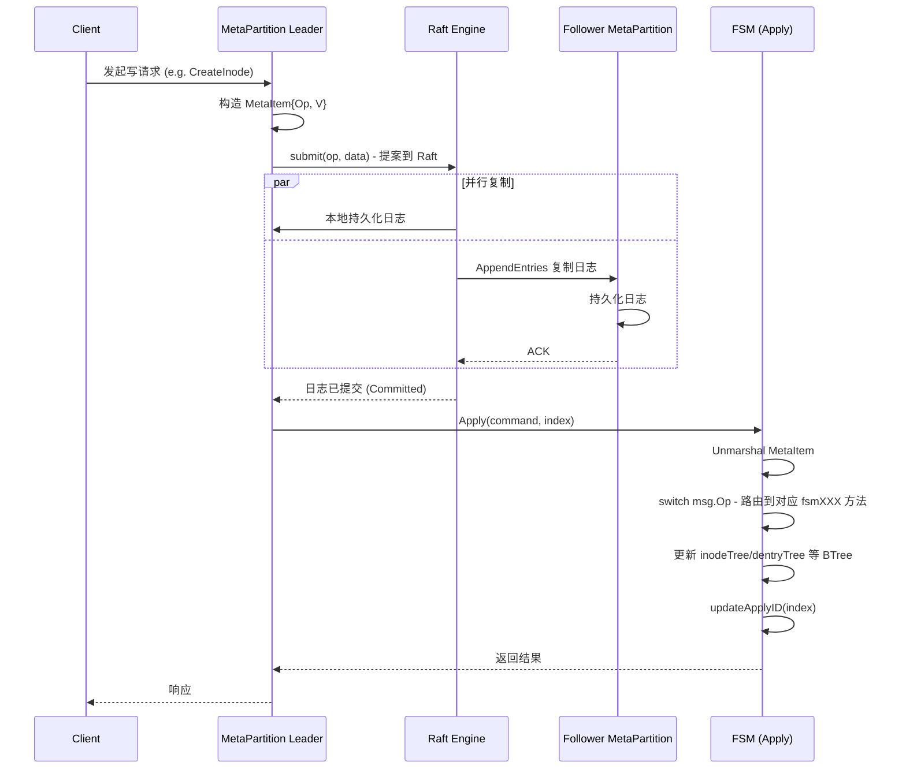

### 5.2 FSM 操作类型

`partition_fsm.go` 中的 `Apply` 方法支持以下操作类型：

#### Inode 操作

| Op | 方法 | 说明 |
|----|------|------|
| `opFSMCreateInode` | `fsmCreateInode` | 创建 Inode |
| `opFSMCreateInodeQuota` | `fsmCreateInode` + `setInodeQuota` | 创建带配额的 Inode |
| `opFSMUnlinkInode` | `fsmUnlinkInode` | 删除 Inode 链接 |
| `opFSMUnlinkInodeOnce` | `fsmUnlinkInode` (带 UniqID) | 幂等删除 Inode |
| `opFSMCreateLinkInode` | `fsmCreateLinkInode` | 创建硬链接 |
| `opFSMEvictInode` | `fsmEvictInode` | 驱逐 Inode |
| `opFSMSetAttr` | `fsmSetAttr` | 设置属性 |
| `opFSMExtentTruncate` | `fsmExtentsTruncate` | 截断 Extents |
| `opFSMExtentsAdd` | `fsmAppendExtents` | 追加 Extents |
| `opFSMObjExtentsAdd` | `fsmAppendObjExtents` | 追加对象 Extents |

#### Dentry 操作

| Op | 方法 | 说明 |
|----|------|------|
| `opFSMCreateDentry` | `fsmCreateDentry` | 创建目录项 |
| `opFSMDeleteDentry` | `fsmDeleteDentry` | 删除目录项 |
| `opFSMUpdateDentry` | `fsmUpdateDentry` | 更新目录项 (rename) |

#### 事务操作

| Op | 方法 | 说明 |
|----|------|------|
| `opFSMTxInit` | `fsmTxInit` | 初始化事务 |
| `opFSMTxCreateInode` | `fsmTxCreateInode` | 事务内创建 Inode |
| `opFSMTxCreateDentry` | `fsmTxCreateDentry` | 事务内创建 Dentry |
| `opFSMTxCommit` | `fsmTxCommit` | 提交事务 |
| `opFSMTxRollback` | `fsmTxRollback` | 回滚事务 |
| `opFSMTxCommitRM` | `fsmTxCommitRM` | RM 阶段提交 |
| `opFSMTxRollbackRM` | `fsmTxRollbackRM` | RM 阶段回滚 |

#### 其他操作

| Op | 方法 | 说明 |
|----|------|------|
| `opFSMStoreTick` | 发送到 storeChan | 触发快照持久化 |
| `opFSMSetXAttr` | `fsmSetXAttr` | 设置扩展属性 |
| `opFSMCreateMultipart` | `fsmCreateMultipart` | 创建 Multipart |
| `opFSMSyncCursor` | 更新 Cursor | 同步 Cursor |
| `opFSMVersionOp` | `fsmVersionOp` | 多版本操作 |
| `opFSMUniqID` | `fsmUniqID` | 分配唯一 ID |

---

## 6. 关键时序流程图

### 6.1 MetaPartition 启动流程

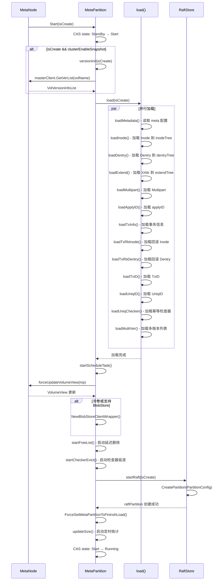

### 6.2 创建文件（CreateInode）完整时序

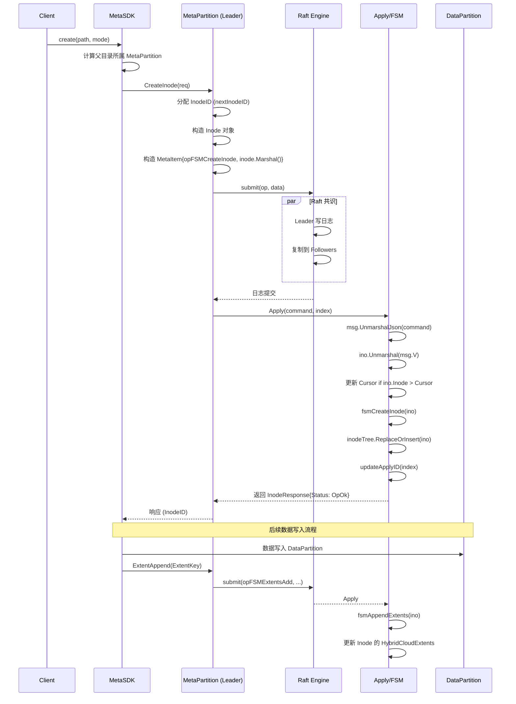

### 6.3 创建目录项（CreateDentry）时序

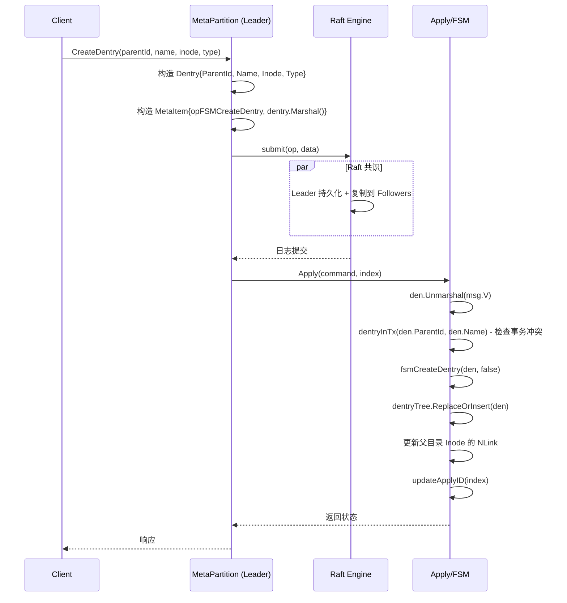

### 6.4 快照持久化时序（StoreTick）

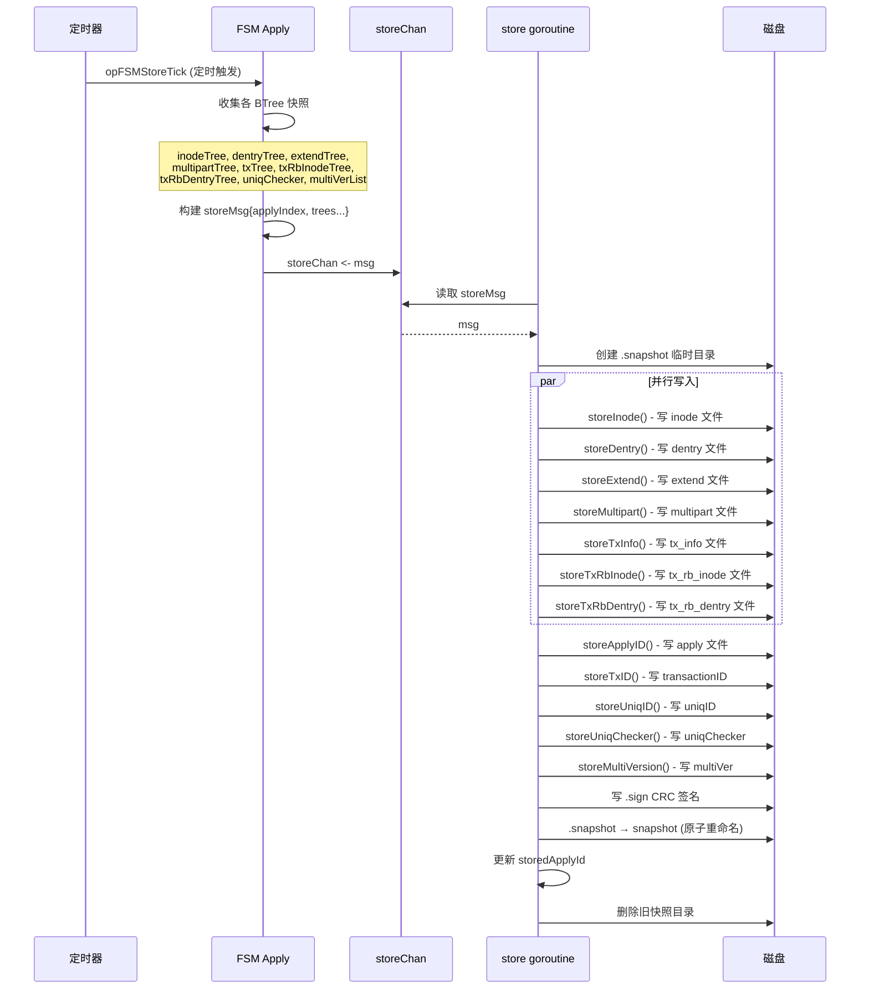

### 6.5 Raft 快照传输与恢复时序

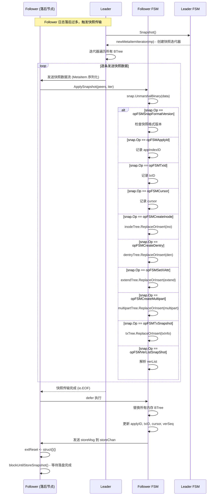

### 6.6 事务（Transaction）流程

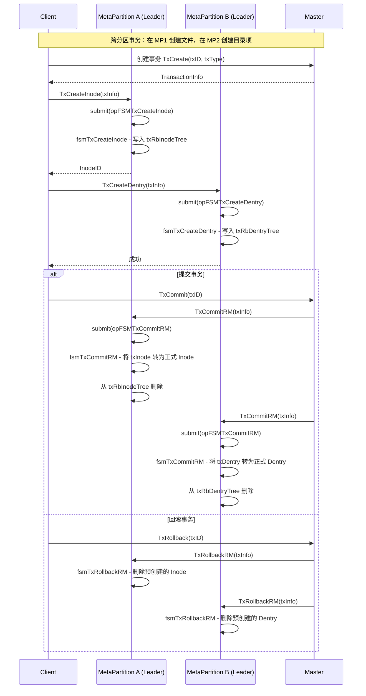

### 6.7 Leader 选举与初始化

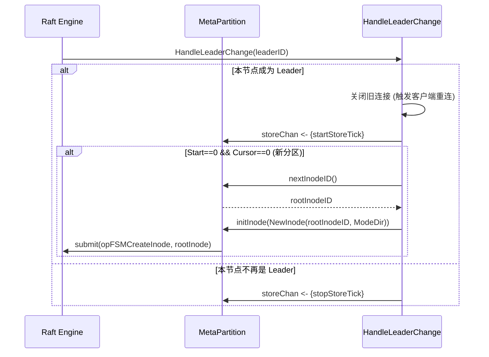

### 6.8 多版本快照操作时序

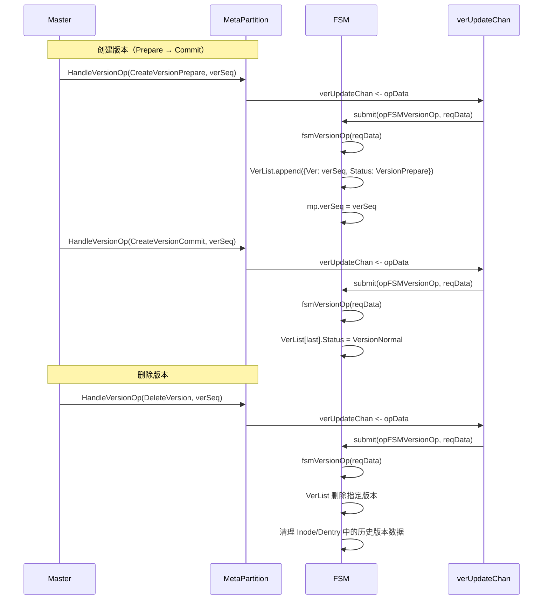

---

## 7. 快照与恢复机制

### 7.1 快照触发条件

1. **定时触发**：`opFSMStoreTick` 由 leader 定期发起
2. **Leader 切换**：`HandleLeaderChange` 发送 `startStoreTick`
3. **ApplySnapshot 后**：follower 接收 raft 快照后触发一次落盘

### 7.2 快照一致性保证

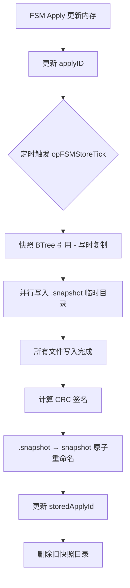

### 7.3 CRC 校验

每个快照文件在加载时都会进行 CRC32 校验：

```go
// 加载时校验
if res := crcCheck.Sum32(); res != crc {
    return ErrSnapshotCrcMismatch
}
```

| 文件 | CRC 计算方式 |
|------|-------------|
| `inode` | 遍历每条记录的 Length + Data |
| `dentry` | 遍历每条记录的 Length + Data |
| `extend` | Count + 每条记录的 Length + Data |
| `multipart` | Count + 每条记录的 Length + Data |
| `tx_info` / `tx_rb_inode` / `tx_rb_dentry` | 遍历每条记录 |
| `uniqChecker` | 整个文件内容 |
| `multiVer` | JSON 序列化后的 verList |

---

## 8. 总结

### 8.1 元数据布局特点

| 特性 | 说明 |
|------|------|
| **分区化** | Inode ID 范围 `[Start, End)` 划分到不同 MetaPartition |
| **BTree 内存索引** | 所有元数据使用 BTree 在内存中维护，支持高效范围查询 |
| **Raft 强一致** | 所有写操作通过 Raft 共识，保证多副本一致 |
| **快照持久化** | 定时将内存 BTree 序列化到磁盘文件，带 CRC 校验 |
| **多版本支持** | Inode/Dentry 支持快照版本链，实现快照回滚 |
| **事务支持** | 跨分区事务通过 TxInfo + Rollback 记录实现 |
| **混合云** | 支持 Replica 和 BlobStore 两种存储类别 |

### 8.2 数据流总结

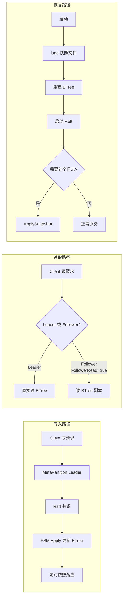

### 8.3 关键设计要点

1. **写时复制快照**：`opFSMStoreTick` 通过获取 BTree 的 `GetTree()` 引用，实现写时复制，不阻塞 FSM 继续处理写入
2. **幂等性保证**：`nonIdempotent` 互斥锁 + `uniqChecker` 确保同一操作不会被重复应用
3. **延迟删除**：`freeList` 机制实现 Inode 的延迟删除，避免删除大文件时阻塞
4. **快照格式版本兼容**：`opFSMSnapFormatVersion` 支持快照格式的版本演进
5. **混合云迁移**：`HybridCloudExtentsMigration` 支持数据在不同存储类别间的迁移

---