# CubeFS 代码工程分析

## 目录

1. [项目概览](#1-项目概览)
2. [整体架构](#2-整体架构)
3. [目录结构与模块划分](#3-目录结构与模块划分)
4. [核心组件详解](#4-核心组件详解)
   - 4.1 [Master](#41-master)
   - 4.2 [MetaNode](#42-metanode)
   - 4.3 [DataNode](#43-datanode)
   - 4.4 [Client / SDK](#44-client--sdk)
   - 4.5 [ObjectNode](#45-objectnode)
   - 4.6 [BlobStore (纠删码子系统)](#46-blobstore-纠删码子系统)
   - 4.7 [AuthNode](#47-authnode)
   - 4.8 [LcNode](#48-lcnode)
5. [一致性模型与 Raft 共识](#5-一致性模型与-raft-共识)
6. [数据写入与读取流程](#6-数据写入与读取流程)
7. [故障恢复机制](#7-故障恢复机制)
   - 7.1 [DataNode 副本修复与下线](#71-datanode-副本修复与下线)
   - 7.2 [MetaNode 分区迁移与恢复](#72-metanode-分区迁移与恢复)
   - 7.3 [Master Leader 切换与状态恢复](#73-master-leader-切换与状态恢复)
   - 7.4 [Extent 修复流程](#74-extent-修复流程)
8. [关键数据结构](#8-关键数据结构)
9. [技术栈与依赖](#9-技术栈与依赖)
10. [总结](#10-总结)

---

## 1. 项目概览

**CubeFS**（"储宝"）是 CNCF 毕业级的开源云原生分布式文件与对象存储系统。

| 属性 | 说明 |
|------|------|
| 语言 | Go 1.18+ |
| 许可证 | Apache 2.0 |
| 模块路径 | `github.com/cubefs/cubefs` |
| 核心特性 | POSIX / HDFS / S3 多协议访问；强一致性元数据；大小文件优化；多租户；混合云缓存加速；多副本与纠删码存储策略 |

---

## 2. 整体架构

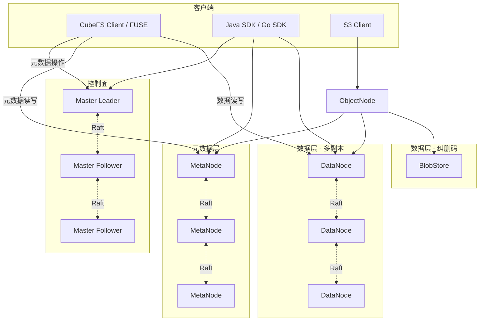

CubeFS 采用**元数据与数据分离**的架构：

- **Master**：集群管理、资源调度、元数据分区分配。
- **MetaNode**：元数据存储（inode、dentry），使用 Raft 保证强一致性。
- **DataNode**：实际数据块（extent）存储，使用 Raft 保证多副本一致性。
- **BlobStore**：纠删码存储后端，适用于冷数据和大文件。
- **ObjectNode**：提供 S3 协议访问。
- **Client/SDK**：通过 Master 获取元数据路由后，直接与 MetaNode 和 DataNode 交互。

---

## 3. 目录结构与模块划分

```
cubefs/
├── master/          # Master 节点：集群管理、分区调度、Raft FSM
├── metanode/        # MetaNode 节点：元数据存储（inode/dentry），BTree + Raft
├── datanode/        # DataNode 节点：数据存储（extent），多副本 Raft
├── blobstore/       # 纠删码存储子系统
├── client/          # FUSE 客户端
├── sdk/             # Go SDK
├── java/            # Java SDK
├── objectnode/      # S3 协议网关
├── authnode/        # 认证节点（密钥管理）
├── lcnode/          # 生命周期管理节点
├── raftstore/       # Raft 共识库封装
├── proto/           # 通信协议定义
├── console/         # 管理控制台
├── cli/             # 命令行工具
├── shell/           # 交互式 shell
├── tool/            # 运维工具集
├── util/            # 公共工具库
├── vendor/          # Go 依赖
├── depends/         # 本地依赖替换（fuse, cobra）
├── deploy/          # 部署脚本
├── docker/          # Docker 镜像
├── docs/            # 英文文档
├── docs-zh/         # 中文文档
└── test/            # 集成测试
```

---

## 4. 核心组件详解

### 4.1 Master

**职责**：集群的"大脑"，管理所有元数据和资源的调度分配。

**关键文件**：

| 文件 | 职责 |
|------|------|
| `cluster.go` | 集群核心逻辑：节点管理、分区创建/迁移/下线 |
| `metadata_fsm.go` | Raft 状态机：Apply 日志、状态恢复 |
| `metadata_snapshot.go` | Raft 快照管理 |
| `cluster_task.go` | 副本迁移任务（Meta/Data Partition 迁移、下线） |
| `api_service.go` | HTTP API 接口 |
| `gapi_cluster.go` | gRPC 接口 |
| `data_partition.go` | DataPartition 数据结构管理 |
| `meta_partition.go` | MetaPartition 数据结构管理 |
| `data_node.go` / `meta_node.go` | 节点管理 |
| `topology.go` | 拓扑管理（Zone → NodeSet → Node） |

**拓扑模型**：

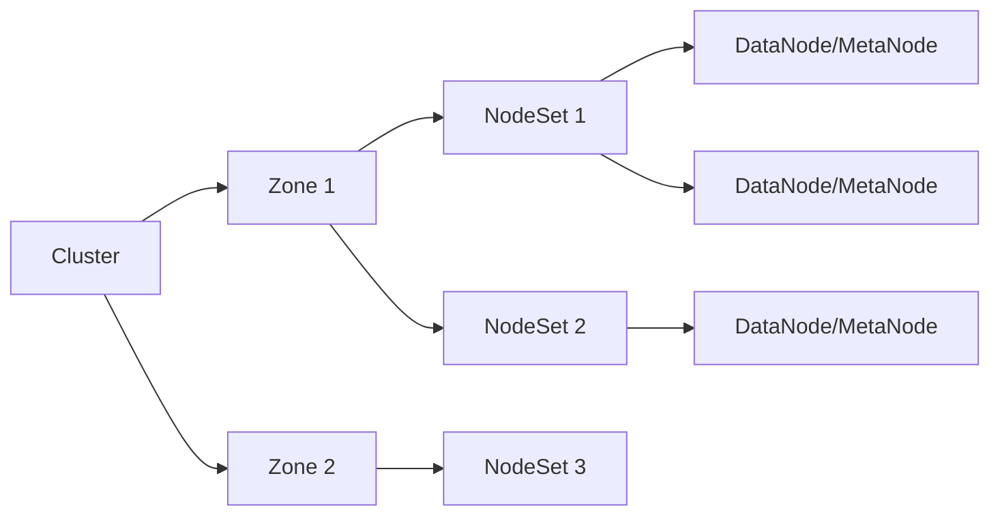

- **Zone**：故障域（通常对应机房或机架）
- **NodeSet**：节点集合，副本分配的基本单元
- 副本分配策略：优先在同一个 NodeSet 内分配，不足时跨 NodeSet，再不足跨 Zone

**FSM 状态机**（`metadata_fsm.go`）：

Master 使用 Raft 持久化所有元数据变更操作。`Apply()` 方法处理两类操作：
- **opSyncUpdateDataPartition / opSyncDeleteDataPartition**：更新/删除数据分区
- **opSyncBatchPut**：批量操作（支持嵌套命令）

```go
// Apply 实现 raft.StateMachine 接口
func (mf *MetadataFsm) Apply(command []byte, index uint64) (resp interface{}, err error) {
    cmd := new(RaftCmd)
    cmd.Unmarshal(command)
    // 根据 cmd.Op 分发到对应处理器
}
```

### 4.2 MetaNode

**职责**：存储文件系统元数据（inode、dentry、extend 属性）。

**关键文件**：

| 文件 | 职责 |
|------|------|
| `manager.go` | MetaPartition 生命周期管理 |
| `partition.go` | MetaPartition 核心：Raft 启动、命令处理 |
| `inode.go` | Inode 管理（BTree 存储） |
| `dentry.go` | Dentry 管理（BTree 存储） |
| `extend.go` | 扩展属性管理 |
| `btree.go` | BTree 实现 |
| `manager_op.go` | 分区创建/删除操作 |
| `partition_delete_extents.go` | 数据_extent 删除 |

**元数据存储**：使用内存 BTree 存储 inode 和 dentry，通过 Raft 日志保证一致性，定期快照持久化到磁盘。

**MetaPartition 启动流程**：

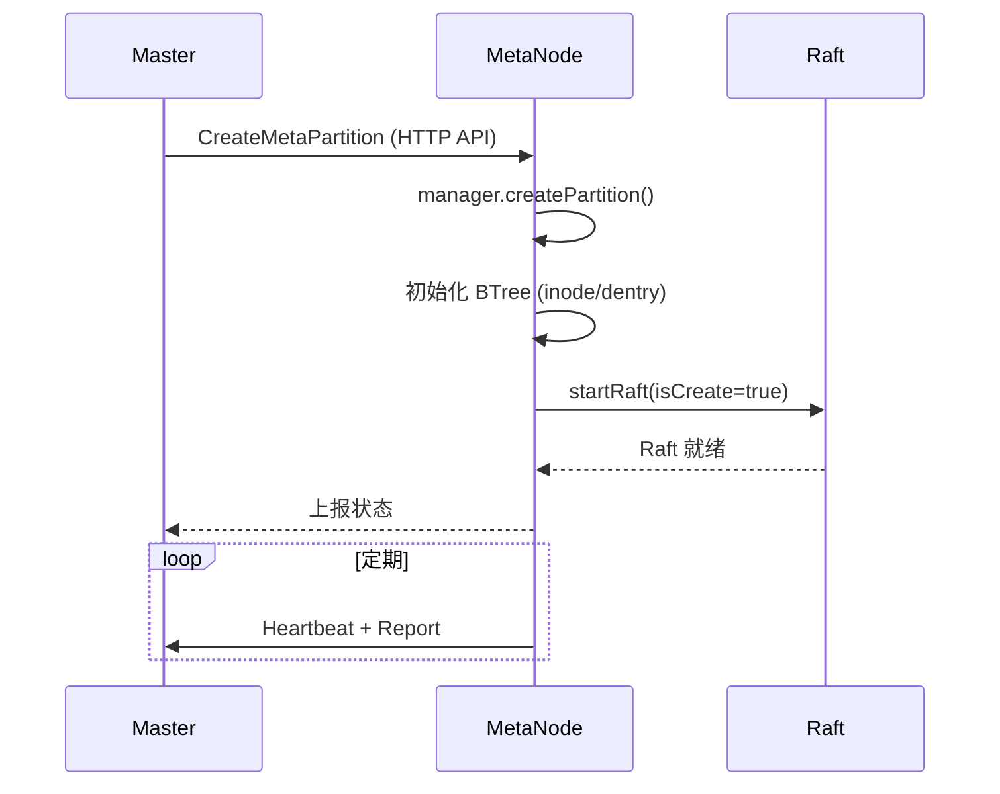

### 4.3 DataNode

**职责**：存储文件数据（extent），支持多副本一致性。

**关键文件**：

| 文件 | 职责 |
|------|------|
| `server.go` | DataNode 服务入口 |
| `space_manager.go` | 磁盘/空间管理 |
| `disk.go` | 磁盘管理 |
| `partition.go` | DataPartition 核心 |
| `partition_raft.go` | DataPartition Raft 封装 |
| `partition_raftfsm.go` | Raft FSM 实现 |
| `partition_op_by_raft.go` | 通过 Raft 执行的操作 |
| `data_partition_repair.go` | **Extent 修复机制** |
| `repl/` | 副本间通信 |
| `storage/` | 底层存储引擎 |

**数据存储模型**：

```
DataNode
├── Disk 1 (diskPath)
│   ├── DataPartition_1/
│   │   ├── extent_0001   (Normal Extent, 最大 128MB)
│   │   ├── extent_0002
│   │   └── ...
│   └── DataPartition_2/
│       ├── tiny_extent_0001  (Tiny Extent, 用于小文件)
│       └── ...
├── Disk 2
└── ...
```

- **Normal Extent**：固定上限（128MB），用于大文件顺序写入
- **Tiny Extent**：用于小文件追加写入，需要特殊的修复逻辑

### 4.4 Client / SDK

**Client**（`client/`）：FUSE 文件系统客户端，挂载后可像本地文件系统一样访问。

**SDK**（`sdk/`）：Go SDK，提供编程接口。

**工作流程**：
1. 启动时从 Master 获取卷元数据和分区路由表
2. 元数据操作（create/delete/readdir）→ MetaNode
3. 数据读写 → DataNode（根据 extent ID 路由）
4. 定期从 Master 刷新路由表

### 4.5 ObjectNode

**职责**：提供 S3 兼容的对象存储接口。

支持将 CubeFS 卷暴露为 S3 Bucket，支持：
- Bucket CRUD
- Object PUT/GET/DELETE
- Multipart Upload
- ACL / 生命周期策略

### 4.6 BlobStore (纠删码子系统)

**职责**：提供低成本纠删码存储后端。

适用于冷数据和大文件场景，将数据分条后进行纠删码编码，分散存储到多个 BlobNode 上。支持与多副本模式混合使用。

### 4.7 AuthNode

**职责**：密钥与认证管理。

管理集群的认证密钥（AK/SK），为客户端和各节点间通信提供认证支持。

### 4.8 LcNode

**职责**：生命周期管理。

管理对象的生命周期规则，支持数据在多副本和纠删码之间的自动转换、过期删除等。

---

## 5. 一致性模型与 Raft 共识

CubeFS 在三个层面使用 Raft 共识：

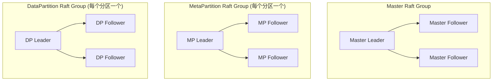

| 层级 | Raft 组 | 作用 |
|------|---------|------|
| Master | 1个（3/5节点） | 集群元数据一致性 |
| MetaPartition | 每个分区1个 | 元数据操作一致性 |
| DataPartition | 每个分区1个 | 数据写入一致性 |

**Raft 库**：`raftstore/` 封装了 `github.com/hashicorp/raft`，提供统一的 Raft 操作接口。

---

## 6. 数据写入与读取流程

### 写入流程

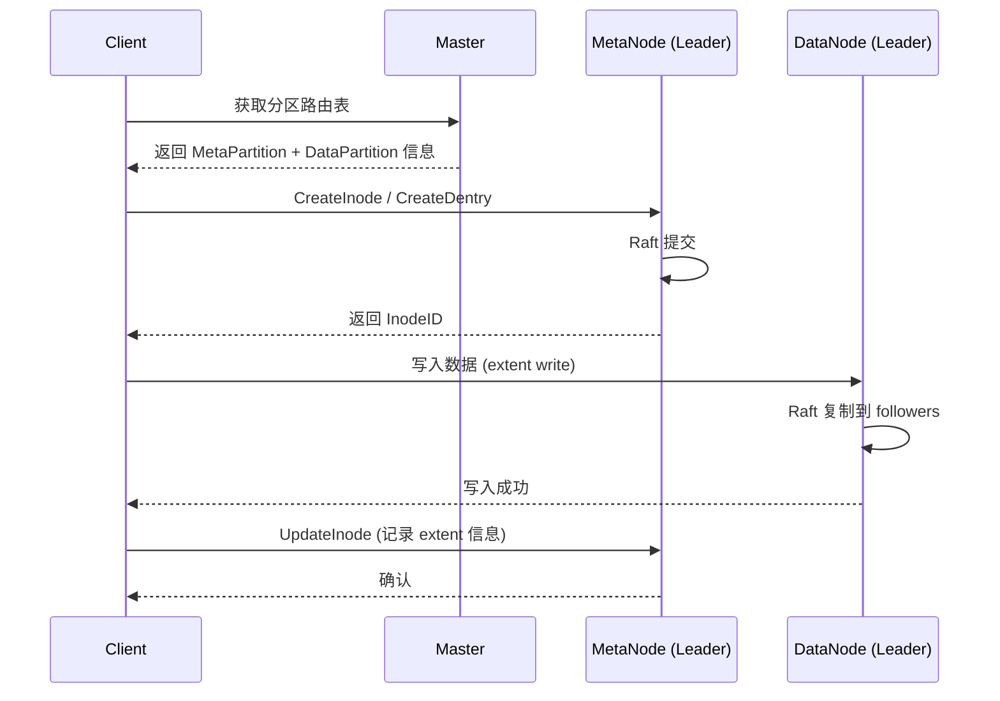

### 读取流程

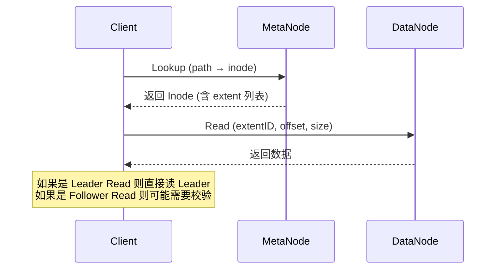

---

## 7. 故障恢复机制

这是 CubeFS 最核心的设计之一，涉及多个层面的恢复。

### 7.1 DataNode 副本修复与下线

#### 数据节点下线流程

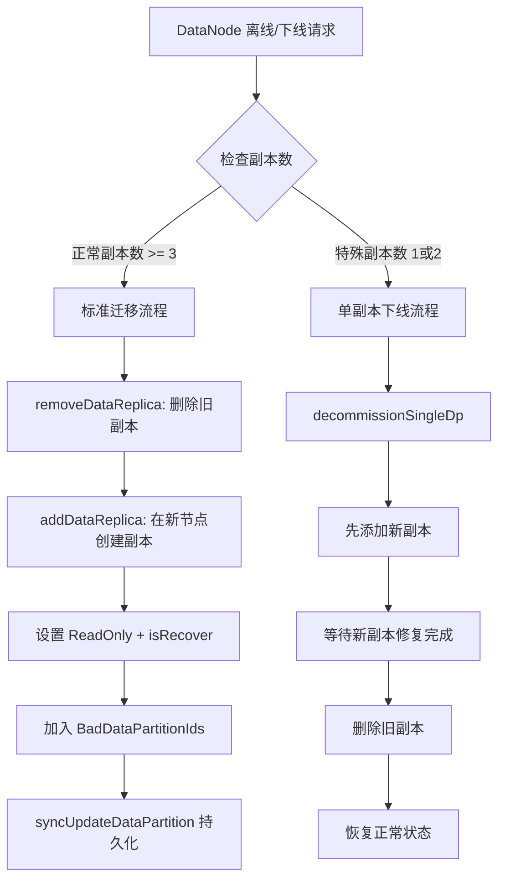

**关键函数**（`cluster.go`）：

```go
// 标准迁移流程
func (c *Cluster) migrateDataPartition(srcAddr, targetAddr string, dp *DataPartition, raftForce bool, errMsg string)

// 特殊副本（1或2副本）下线
func (c *Cluster) decommissionSingleDp(dp *DataPartition, newAddr, offlineAddr string)

// 创建新副本
func (c *Cluster) createDataReplica(dp *DataPartition, addPeer proto.Peer, ignoreDecommissionDisk bool)

// 删除旧副本
func (c *Cluster) removeDataReplica(dp *DataPartition, addr string, validate bool, raftForceDel bool)
```

**特殊副本下线的状态机**（`decommissionSingleDp`）：

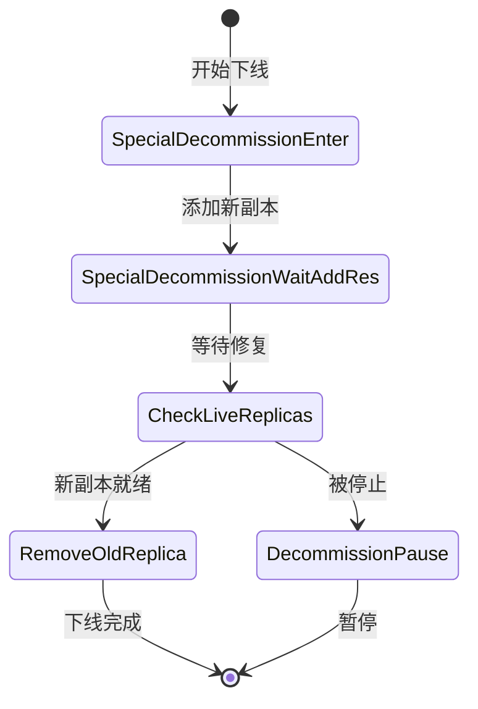

**新节点选择策略**（分层选择）：

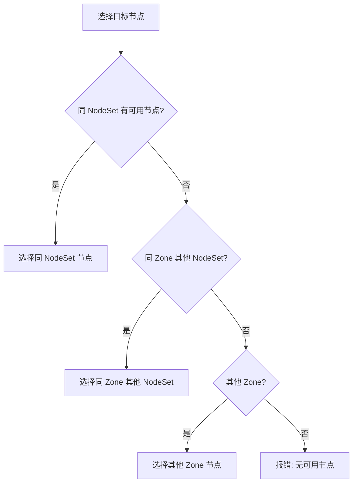

#### 磁盘下线

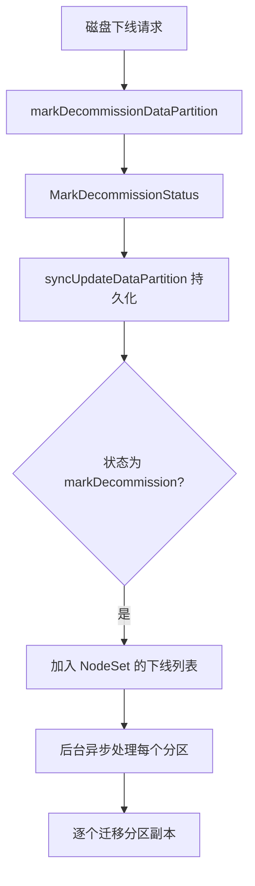

#### 坏磁盘检测与处理

```go
// 获取磁盘错误分区视图
func (c *Cluster) getDiskErrDataPartitionsView() (dps proto.DiskErrPartitionView)

// 将坏分区加入列表
func (c *Cluster) putBadDataPartitionIDs(replica *DataReplica, addr string, partitionID uint64)
```

### 7.2 MetaNode 分区迁移与恢复

#### 元数据分区迁移流程

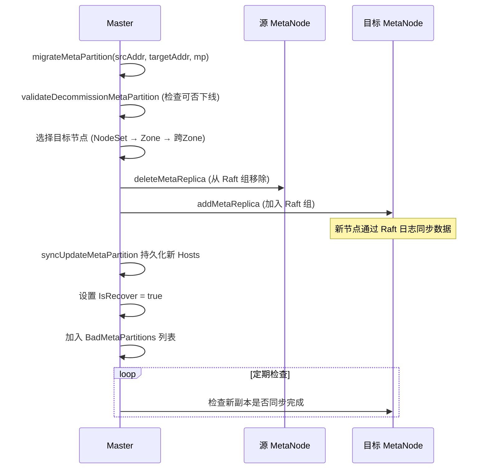

**关键函数**（`cluster_task.go`）：

```go
// 迁移元数据分区
func (c *Cluster) migrateMetaPartition(srcAddr, targetAddr string, mp *MetaPartition)

// 下线元数据分区（迁移的特殊形式）
func (c *Cluster) decommissionMetaPartition(nodeAddr string, mp *MetaPartition)

// 验证是否可以下线
func (c *Cluster) validateDecommissionMetaPartition(mp *MetaPartition, nodeAddr string, forceDel bool)
```

**下线验证条件**：
1. 副本在最新 host 列表中
2. 剩余副本数 >= 多数派
3. 没有正在恢复中的副本（`IsRecover`）
4. `activeMaxInodeSimilar()` - 活跃 inode 相似（避免数据不一致）

#### MetaNode 节点下线

```go
// cluster.go:3734
func (c *Cluster) decommissionMetaNode(metaNode *MetaNode)
```

遍历该节点上的所有 MetaPartition，逐个执行迁移。

### 7.3 Master Leader 切换与状态恢复

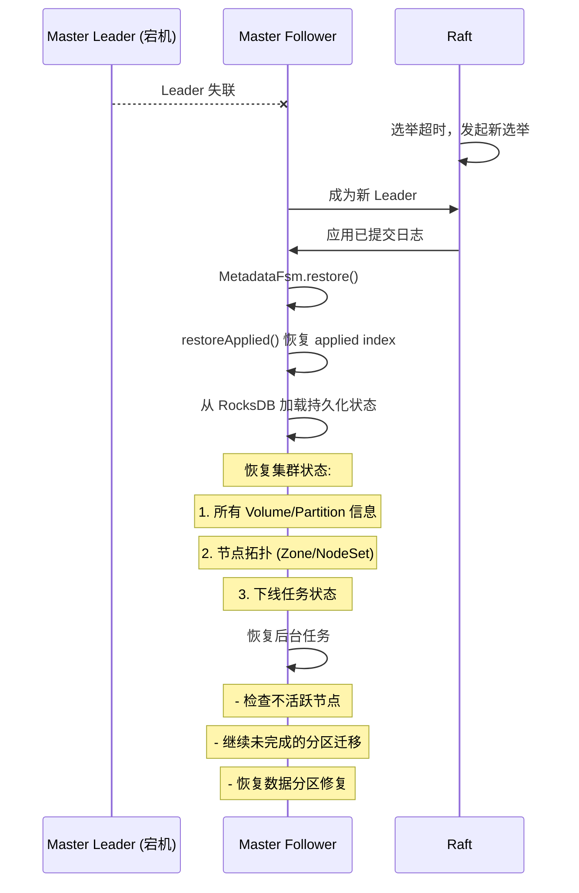

**关键恢复逻辑**：

```go
// metadata_fsm.go
func (mf *MetadataFsm) restore() {
    mf.restoreApplied() // 恢复 Raft applied index
}

func (mf *MetadataFsm) restoreApplied() {
    value, _ := mf.store.Get(applied)
    // 从 RocksDB 恢复 applied index
}
```

**Leader 切换后的特殊处理**：

在 `decommissionSingleDp` 中，如果 Leader 切换发生在下线过程中：
```go
// 如果 leader 切换后，状态从 prepare 更新为 running
if dp.GetDecommissionStatus() == DecommissionPrepare && dp.GetSpecialReplicaDecommissionStep() > SpecialDecommissionEnter {
    dp.SetDecommissionStatus(DecommissionRunning, "leaderChange_continueDecommission_updatePrepareToRunning", "")
}
```

### 7.4 Extent 修复流程

这是 DataNode 层面的数据修复机制，当副本间数据不一致时触发。

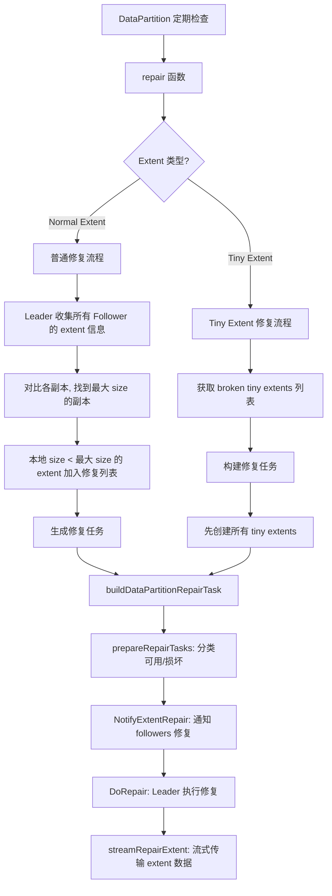

**修复任务执行细节**：

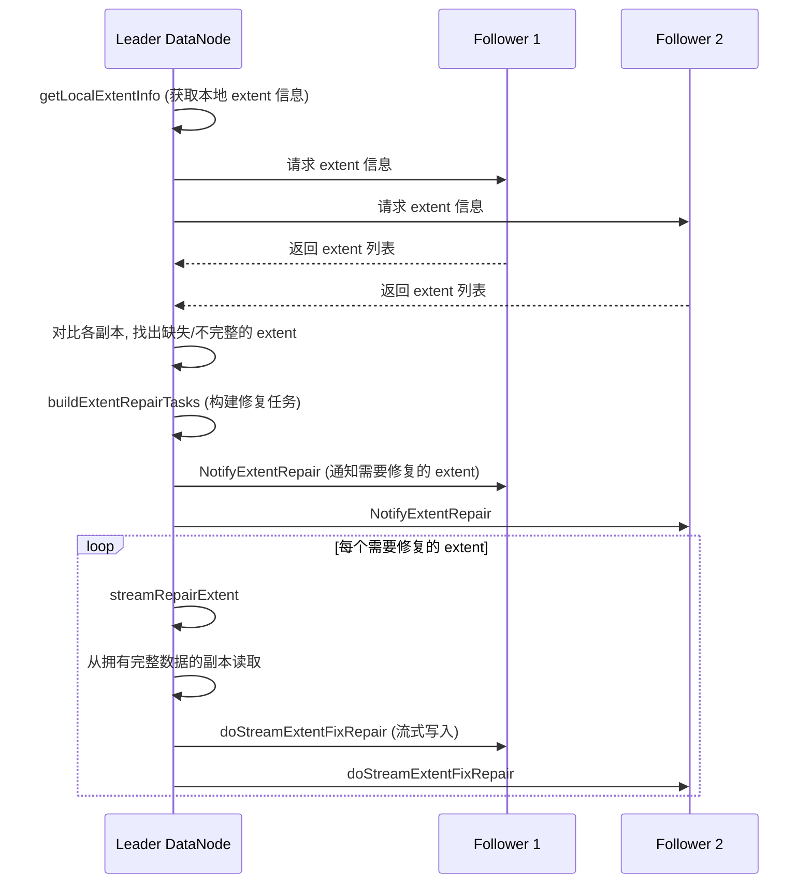

**关键函数**（`data_partition_repair.go`）：

```go
// 修复主入口
func (dp *DataPartition) repair(extentType uint8)

// 构建修复任务
func (dp *DataPartition) buildDataPartitionRepairTask(...)

// 执行修复
func (dp *DataPartition) DoRepair(repairTasks []*DataPartitionRepairTask)

// 流式修复 extent
func (dp *DataPartition) streamRepairExtent(remoteExtentInfo *RepairExtentInfo, ...)

// 通知 follower 修复
func (dp *DataPartition) NotifyExtentRepair(members []*DataPartitionRepairTask)
```

---

## 8. 关键数据结构

### Volume（卷）

```go
type Vol struct {
    Name           string
    ID             uint64
    Owner          string
    dpReplicaNum   int    // 数据副本数
    mpReplicaNum   int    // 元数据副本数
    dataPartitionSize uint64 // 单个 DP 大小
    // ... 状态、配额、权限等
}
```

### DataPartition（数据分区）

```go
type DataPartition struct {
    PartitionID    uint64
    VolName        string
    ReplicaNum     int
    Hosts          []string    // 副本地址列表
    Peers          []proto.Peer // Raft peer 列表
    Status         int         // ReadWrite / ReadOnly
    isRecover      bool        // 是否在恢复中
    DecommissionStatus  int    // 下线状态
    // ...
}
```

### MetaPartition（元数据分区）

```go
type MetaPartition struct {
    PartitionID    uint64
    volName        string
    Hosts          []string
    Peers          []proto.Peer
    Start          uint64  // inode 起始范围
    End            uint64  // inode 结束范围
    IsRecover      bool
    // ...
}
```

### 拓扑结构

```
Cluster
  └── Zone (故障域)
       └── NodeSet (节点集合)
            ├── DataNode
            └── MetaNode
```

---

## 9. 技术栈与依赖

| 类别 | 技术 |
|------|------|
| 语言 | Go 1.18 |
| Raft 共识 | `github.com/hashicorp/raft` |
| 持久化存储 | RocksDB (通过 `gorocksdb`) |
| FUSE | `github.com/jacobsa/fuse` (本地替换) |
| S3 SDK | `github.com/aws/aws-sdk-go` |
| 命令行 | `github.com/spf13/cobra` (本地替换) |
| 序列化 | JSON + 自定义二进制协议 |
| 监控 | Prometheus metrics |
| 容器化 | Docker + Kubernetes (Helm) |
| CI/CD | GitHub Actions, Travis CI, GitLab CI |

---

## 10. 总结

CubeFS 是一个设计成熟的分布式存储系统，其核心设计亮点包括：

### 架构设计

1. **元数据与数据分离**：MetaNode 专管元数据，DataNode 专管数据，各自独立扩展
2. **多级 Raft**：Master、MetaPartition、DataPartition 各自独立 Raft 组，避免单点瓶颈
3. **拓扑感知**：Zone → NodeSet → Node 三级拓扑，副本分配考虑故障域隔离

### 故障恢复

1. **分层恢复**：Master Leader 切换 → 节点级下线 → 分区级迁移 → Extent 级修复
2. **特殊副本处理**：对 1/2 副本场景有专门的下线流程（`decommissionSingleDp`），先加后删
3. **Leader 切换容错**：下线过程支持 Leader 切换后断点续传
4. **Extent 修复**：Leader 定期收集副本信息，对比后自动修复不一致的 extent

### 存储优化

1. **大小文件分离**：Normal Extent（大文件）和 Tiny Extent（小文件）不同处理
2. **多协议支持**：POSIX、HDFS、S3 统一后端
3. **混合存储**：多副本（热数据）+ 纠删码（冷数据）灵活策略

### 代码质量

- 模块化清晰，各组件职责明确
- 丰富的测试文件（`*_test.go`）
- 完善的文档（中英文）
- 活跃的社区维护（CNCF 毕业项目）

---