# CubeFS 线程模型分析

> 本文档分析 CubeFS 各组件的线程(Goroutine)模型，并使用 Mermaid 时序图展示关键交互流程。

---

## 目录

1. [总体架构](#1-总体架构)
2. [Master 线程模型](#2-master-线程模型)
3. [MetaNode 线程模型](#3-metanode-线程模型)
4. [DataNode 线程模型](#4-datanode-线程模型)
5. [SDK/Client 线程模型](#5-sdkclient-线程模型)
6. [Raft 一致性线程模型](#6-raft-一致性线程模型)
7. [典型 IO 流程时序图](#7-典型-io-流程时序图)
8. [心跳与任务调度时序图](#8-心跳与任务调度时序图)
9. [总结](#9-总结)

---

## 1. 总体架构

CubeFS 采用 Go 语言开发，其"线程模型"本质上是 **Goroutine + Channel** 的 CSP 并发模型。各组件之间通过 TCP/HTTP 通信，内部通过 Goroutine 实现并发。

### 组件关系总览

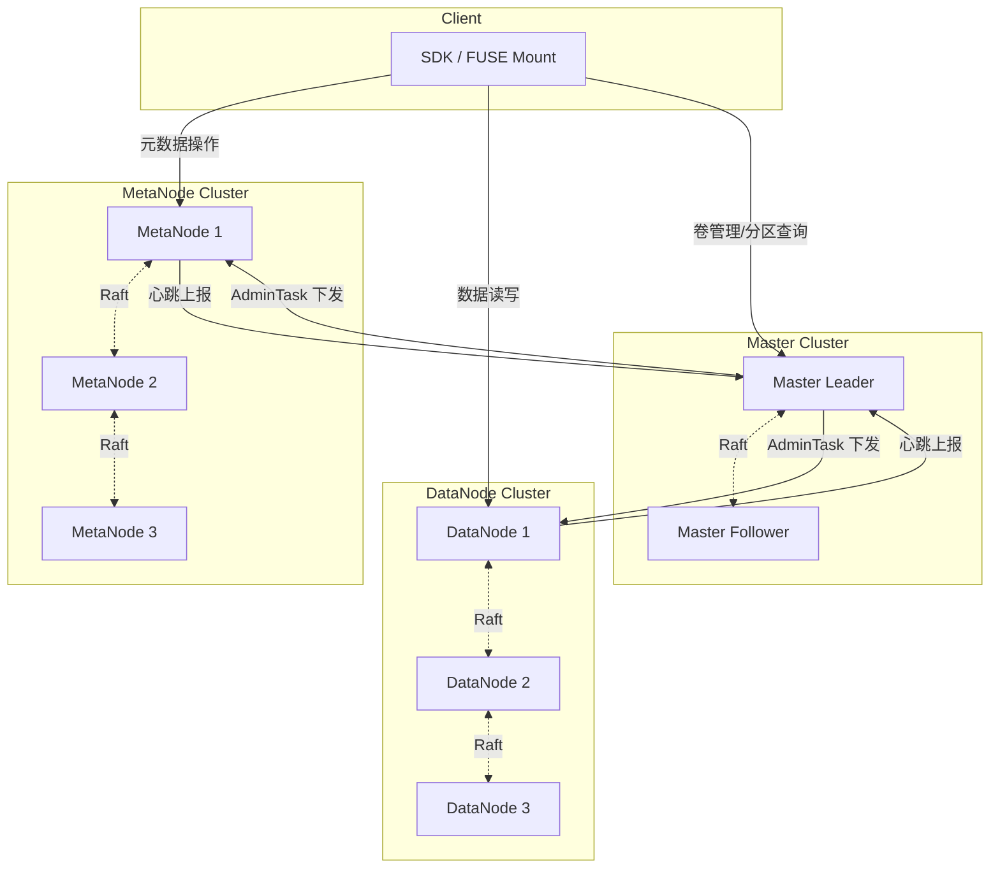

### Goroutine 模型分类

| 类型 | 描述 | 示例 |
|------|------|------|
| **Accept Loop Goroutine** | 监听 TCP 连接，每连接派生 Goroutine | `serveConn`, `serveSmuxConn` |
| **Ticker/Timer Goroutine** | 定时执行周期任务 | `AdminTaskManager.process`, `scheduleTask` |
| **Worker Goroutine** | 处理具体业务逻辑 | Raft apply, packet handling |
| **Background Goroutine** | 长期运行的后台任务 | `startUpdateNodeInfo`, `startCpuSample`, `startGcTimer` |

---

## 2. Master 线程模型

### 2.1 核心组件

Master 节点是集群的管理中心，其核心并发组件包括：

- **AdminTaskManager**: 负责向 MetaNode / DataNode 下发管理任务
- **Raft Store**: 保证 Master 集群一致性
- **HTTP Server**: 处理客户端和节点请求
- **定时调度器**: 心跳检测、分区管理、负载均衡

### 2.2 AdminTaskManager 线程模型

`AdminTaskManager` 是 Master 向节点下发管理命令的核心组件。每个 MetaNode/DataNode 对应一个 `AdminTaskManager` 实例。

**关键代码** (`master/admin_task_manager.go`):

```go
func newAdminTaskManager(targetAddr, clusterID string) (sender *AdminTaskManager) {
    sender = &AdminTaskManager{
        targetAddr: targetAddr,
        TaskMap:    make(map[string]*proto.AdminTask),
        exitCh:     make(chan struct{}, 1),
        connPool:   util.NewConnectPoolWithTimeout(...),
    }
    go sender.process()  // 启动后台 Goroutine
    return
}

func (sender *AdminTaskManager) process() {
    ticker := time.NewTicker(TaskWorkerInterval) // 2秒
    for {
        select {
        case <-sender.exitCh:
            return
        case <-ticker.C:
            sender.doDeleteTasks()  // 清理超时任务
            sender.doSendTasks()    // 发送待发送任务
        }
    }
}
```

### 2.3 Master AdminTask 调度时序图

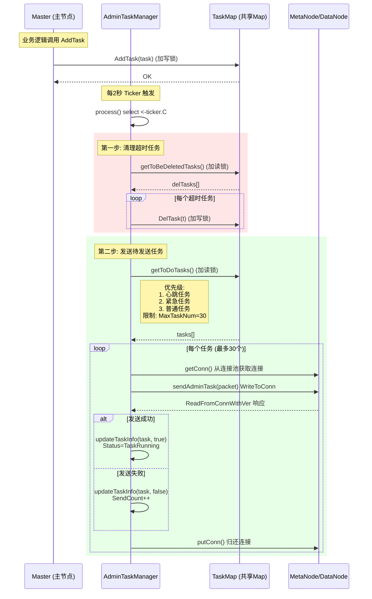

### 2.4 Master 主要 Goroutine 清单

| Goroutine | 触发方式 | 功能 |
|-----------|---------|------|
| `AdminTaskManager.process` | Ticker (2s) | 周期性发送/清理管理任务 |
| Raft `tick` | 定时 | Raft 心跳与选举 |
| Raft `apply` | Commit 事件 | 应用已提交的日志 |
| HTTP Handler | 请求驱动 | 处理 API 请求 |
| `scheduleTask` | Ticker | 分区创建、迁移、负载均衡 |
| `checkNodeHeartbeat` | Ticker | 检测节点存活状态 |

---

## 3. MetaNode 线程模型

### 3.1 核心组件

MetaNode 管理元数据分片(MetaPartition)，通过 Raft 保证一致性。其启动流程 (`doStart`) 按顺序启动多个服务：

```go
func doStart(s common.Server, cfg *config.Config) (err error) {
    m.parseConfig(cfg)
    m.register()             // 向 Master 注册
    m.startRaftServer(cfg)   // 启动 Raft
    m.newMetaManager(cfg)    // 创建元数据管理器
    m.startServer()          // 启动 TCP 服务
    m.startSmuxServer()      // 启动 Smux 服务
    m.startMetaManager()     // 启动元数据管理器
    m.registerAPIHandler()   // 注册 HTTP API
    go m.startUpdateNodeInfo() // 后台: 更新节点信息
    m.startStat()            // 启动统计
}
```

### 3.2 TCP 连接处理模型

MetaNode 采用 **"一个连接一个 Goroutine"** 的模型处理 TCP 请求：

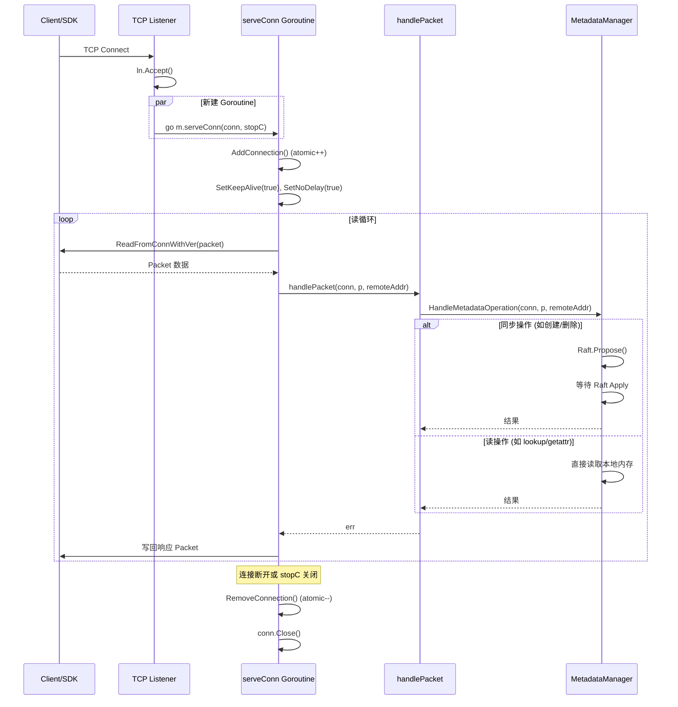

### 3.3 Smux 多路复用模型

为减少连接数开销，MetaNode 支持 Smux (多路复用) 协议，在单条 TCP 连接上创建多个逻辑流：

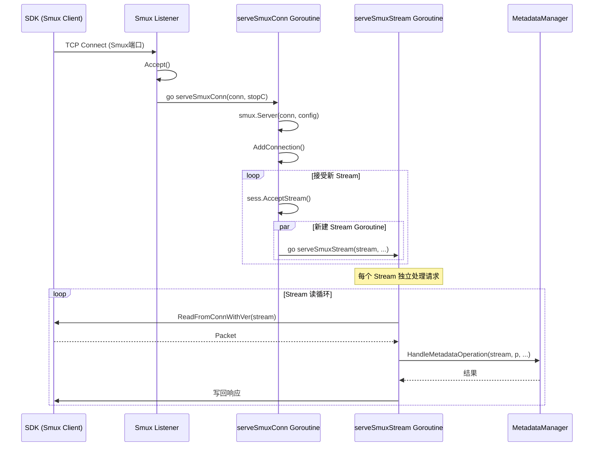

### 3.4 MetaNode 主要 Goroutine 清单

| Goroutine | 触发方式 | 功能 |
|-----------|---------|------|
| TCP Accept Loop | `startServer` | 接受 TCP 连接 |
| `serveConn` | 每连接 | 处理 TCP 请求 |
| Smux Accept Loop | `startSmuxServer` | 接受 Smux 连接 |
| `serveSmuxConn` | 每 Smux Session | 管理 Smux 流 |
| `serveSmuxStream` | 每 Smux Stream | 处理流上请求 |
| Raft goroutines | RaftStore | Raft 协议 |
| `startUpdateNodeInfo` | 后台定时 | 向 Master 上报节点信息 |
| `startStat` | 定时 | 统计信息收集 |

---

## 4. DataNode 线程模型

### 4.1 核心组件

DataNode 管理数据分片(DataPartition)，同样通过 Raft 保证副本一致性。其启动流程最为复杂：

```go
func doStart(server common.Server, cfg *config.Config) (err error) {
    s.parseConfig(cfg)
    s.parseRaftConfig(cfg)
    s.registerMetrics()
    s.register(cfg)           // 向 Master 注册
    s.parseSmuxConfig(cfg)
    s.startStat(cfg)
    s.initConnPool()
    initRepairLimit()
    s.startRaftServer(cfg)
    s.newSpaceManager(cfg)
    s.startTCPService()       // 启动 TCP 服务
    s.startSmuxService(cfg)   // 启动 Smux 服务
    s.startSpaceManager(cfg)  // 并发加载磁盘
    go s.registerHandler()    // 注册 HTTP Handler
    s.scheduleTask()          // 启动定时任务
    s.startMetrics()
    s.startCpuSample()        // CPU 采样
    s.startGcTimer()          // GC 定时器
}
```

### 4.2 磁盘并发加载模型

`startSpaceManager` 使用 `sync.WaitGroup` 并发加载多块磁盘：

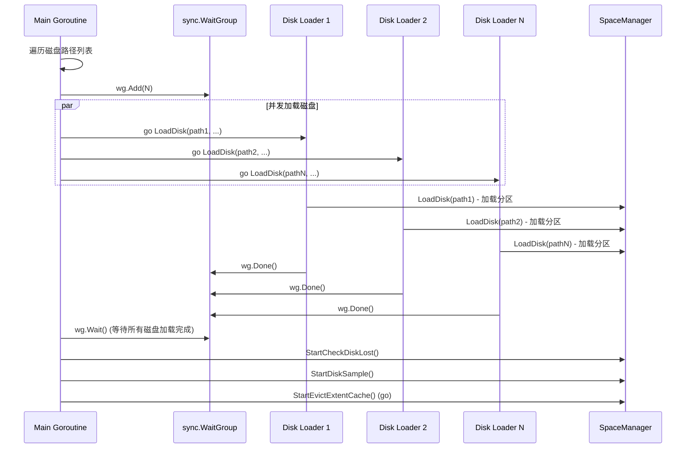

### 4.3 DataNode TCP 服务模型

DataNode 的 TCP 服务与 MetaNode 类似，采用 **每连接一 Goroutine** 模型：

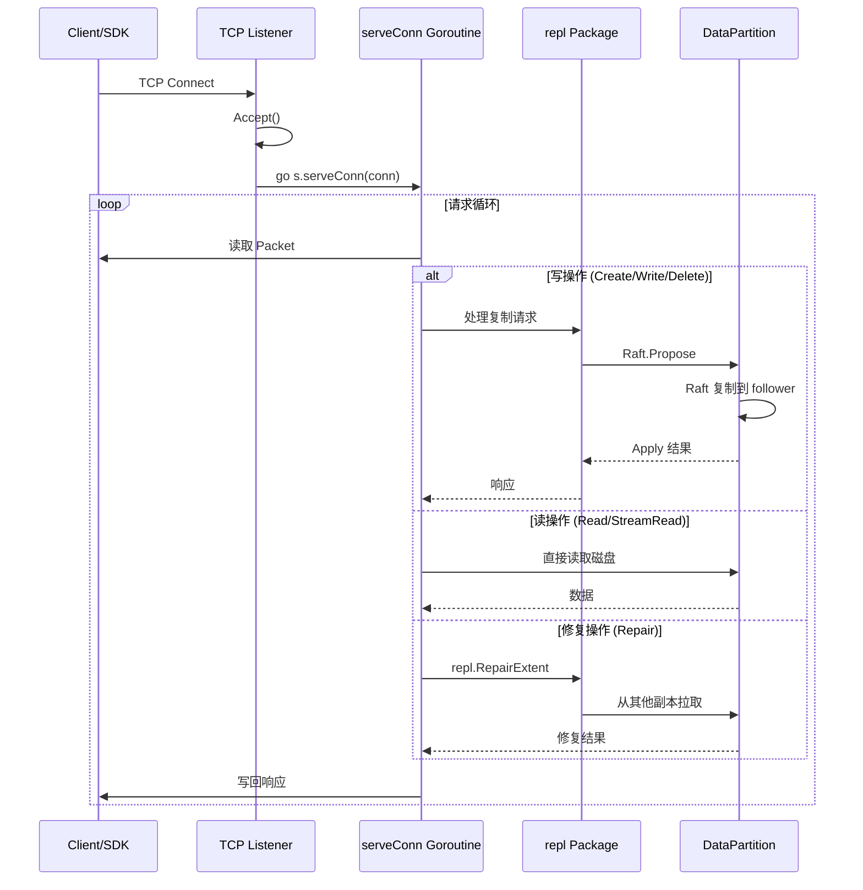

### 4.4 DataNode 后台任务模型

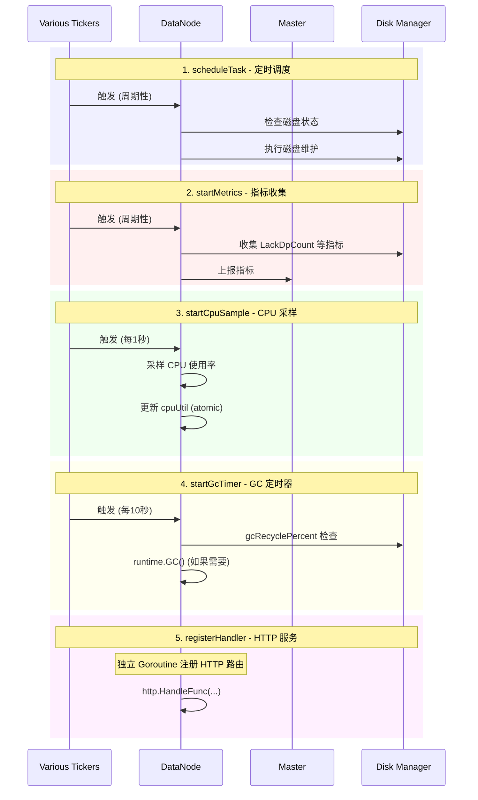

### 4.5 DataNode 主要 Goroutine 清单

| Goroutine | 触发方式 | 功能 |
|-----------|---------|------|
| TCP Accept Loop | `startTCPService` | 接受 TCP 连接 |
| `serveConn` | 每连接 | 处理数据读写请求 |
| Smux Accept Loop | `startSmuxService` | 接受 Smux 连接 |
| `serveSmuxConn` | 每 Smux Session | 处理 Smux 流 |
| 磁盘加载 | `startSpaceManager` | 并发加载磁盘 (WaitGroup) |
| `registerHandler` | 后台 | 注册 HTTP API |
| `scheduleTask` | Ticker | 定时调度任务 |
| `startMetrics` | Ticker | 指标收集与上报 |
| `startCpuSample` | Ticker (1s) | CPU 使用率采样 |
| `startGcTimer` | Ticker (10s) | GC 触发 |
| `StartEvictExtentCache` | 后台 | Extent 缓存驱逐 |
| `StartDiskSample` | 后台 | 磁盘采样 |
| `StartCheckDiskLost` | 后台 | 检查磁盘丢失 |

---

## 5. SDK/Client 线程模型

### 5.1 核心组件

CubeFS SDK 是客户端的核心，包含：
- **MetaClient**: 元数据操作客户端
- **ExtentClient**: 数据操作客户端
- **MasterClient**: 与 Master 交互
- **连接池**: TCP/Smux 连接复用

### 5.2 SDK 读写流程时序图

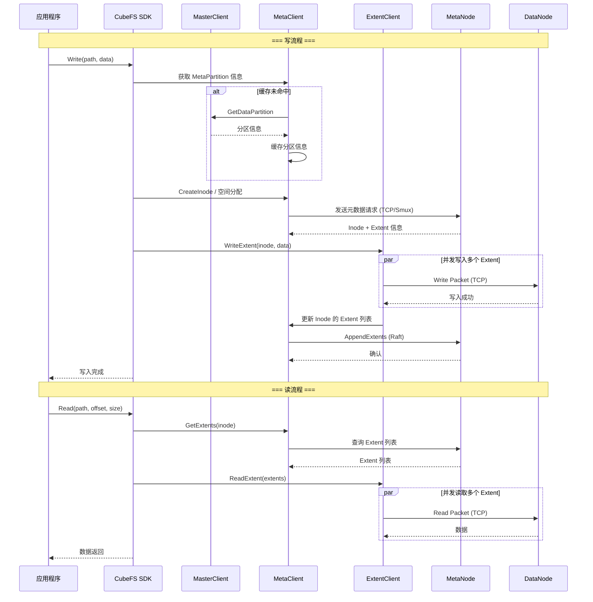

### 5.3 SDK 连接池模型

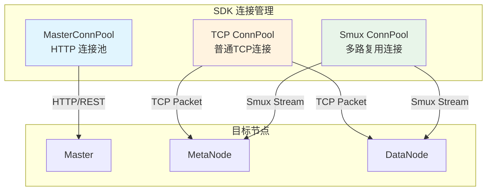

---

## 6. Raft 一致性线程模型

### 6.1 Raft 在 CubeFS 中的角色

CubeFS 在三个层面使用 Raft：
1. **Master 集群**: 元数据管理(卷、节点信息)
2. **MetaPartition**: 元数据分片一致性
3. **DataPartition**: 数据分片副本一致性

### 6.2 Raft 写入流程时序图

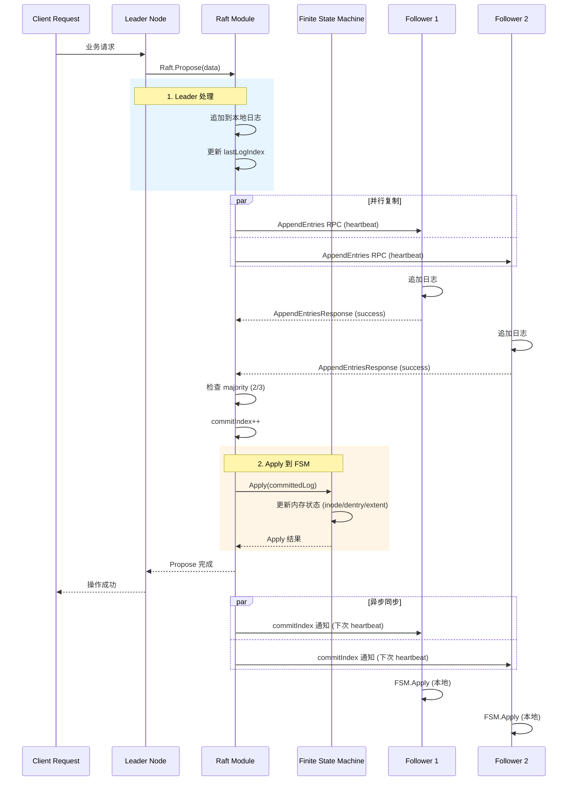

### 6.3 Raft 主要 Goroutine

| Goroutine | 功能 |
|-----------|------|
| `tick` goroutine | 定时触发心跳和选举超时 |
| `step` goroutine | 处理 Raft 消息 |
| `propose` channel | 接收写提案 |
| `apply` goroutine | 应用已提交日志到 FSM |
| `snap` goroutine | 快照创建与传输 |

---

## 7. 典型 IO 流程时序图

### 7.1 完整的文件写入流程

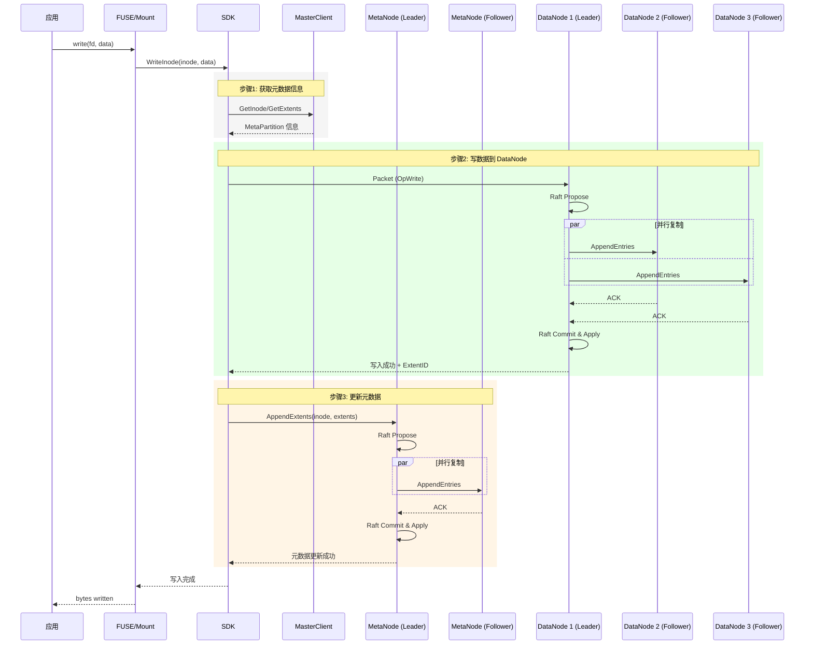

### 7.2 完整的文件读取流程

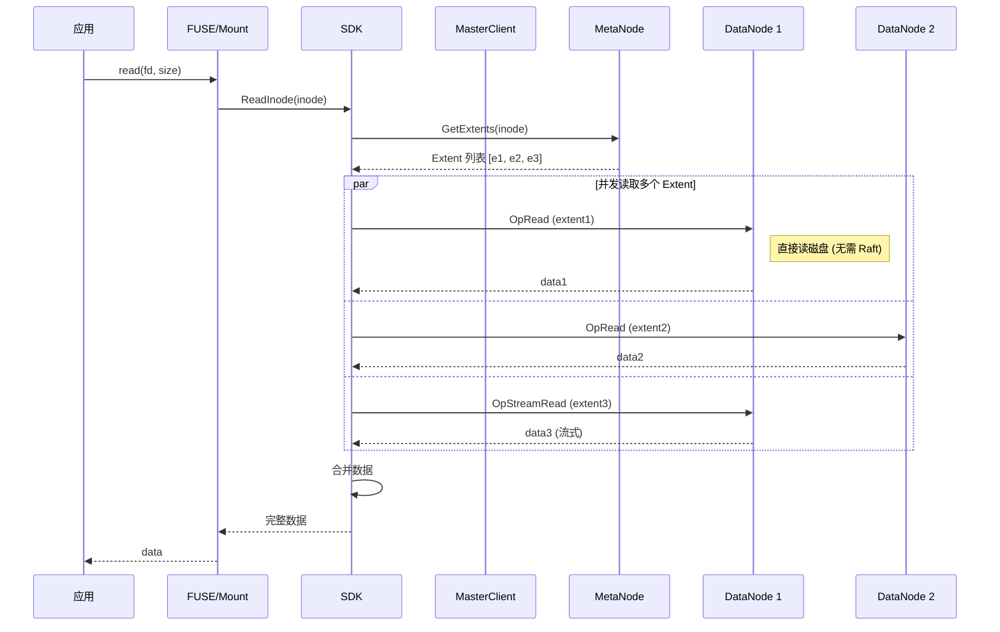

---

## 8. 心跳与任务调度时序图

### 8.1 Master-Node 心跳与任务下发

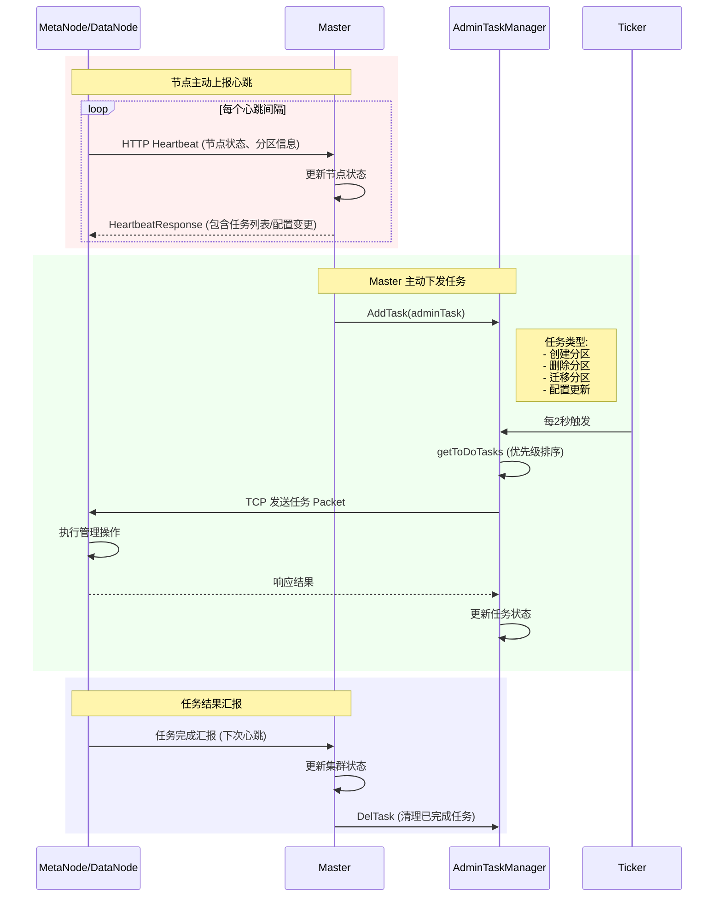

### 8.2 MetaNode 启动与注册流程

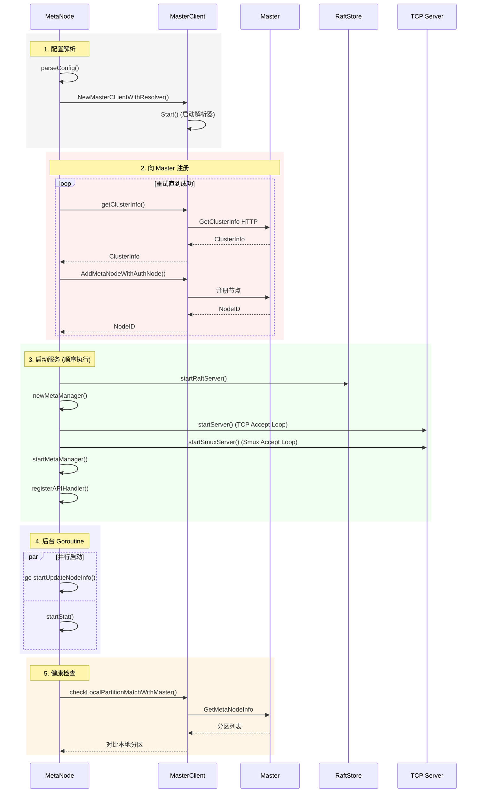

---

## 9. 总结

### 9.1 并发模型特点

| 特点 | 说明 |
|------|------|
| **CSP 模型** | Go 语言原生 Goroutine + Channel，而非 OS 线程 |
| **每连接一 Goroutine** | TCP/Smux 连接由独立 Goroutine 处理 |
| **Ticker 驱动** | 大量后台任务通过 `time.Ticker` 定时触发 |
| **连接池复用** | TCP/Smux 连接池减少连接建立开销 |
| **Raft 复制** | 写操作通过 Raft 在多副本间同步 |
| **并发加载** | DataNode 磁盘加载使用 `sync.WaitGroup` 并发 |

### 9.2 线程模型架构总览

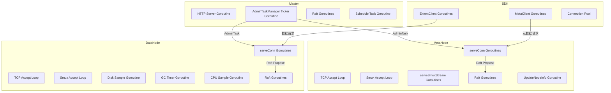

### 9.3 关键设计决策

1. **Goroutine 而非线程池**: CubeFS 大量使用 Goroutine 处理并发，Go 运行时自动调度，无需手动管理线程池。

2. **连接级隔离**: 每个 TCP/Smux 连接由独立 Goroutine 处理，避免了连接间相互阻塞。

3. **AdminTaskManager 解耦**: Master 通过 `AdminTaskManager` 异步下发管理任务，业务逻辑与网络通信解耦。

4. **Raft 同步写 + 直接读**: 写操作通过 Raft 保证一致性，读操作直接读本地内存/磁盘，兼顾一致性与性能。

5. **Smux 多路复用**: 在单条 TCP 连接上复用多个逻辑流，减少连接数同时保持并发能力。

6. **定时器集群**: 各组件通过多个独立 Ticker Goroutine 执行周期性任务(心跳、GC、采样、统计)，互不干扰。

---

> **注**: 本文档基于 CubeFS 源码分析，主要参考文件:
> - `master/admin_task_manager.go` - AdminTask 管理器
> - `metanode/server.go`, `metanode/metanode.go` - MetaNode 服务
> - `datanode/server.go` - DataNode 服务
> - `sdk/data/stream/extent_client.go` - SDK 数据客户端