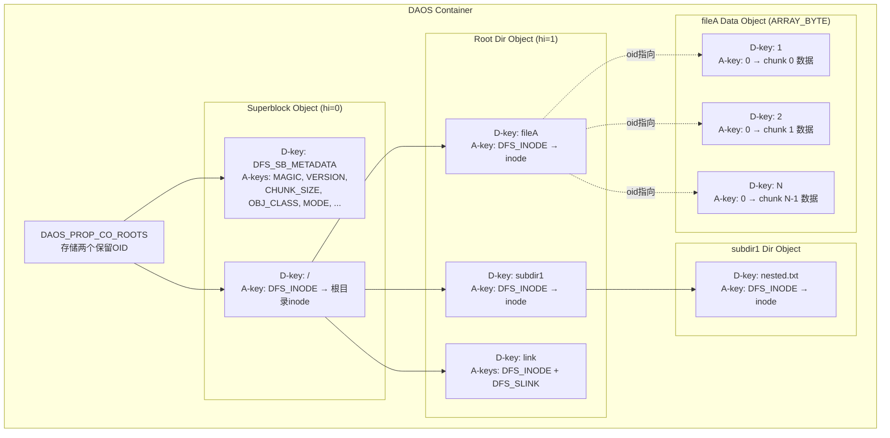
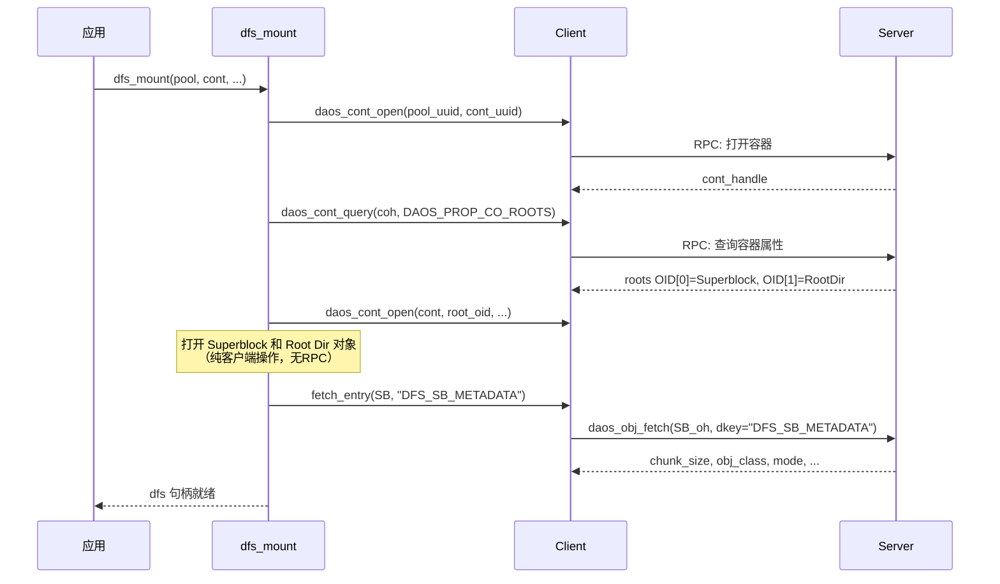
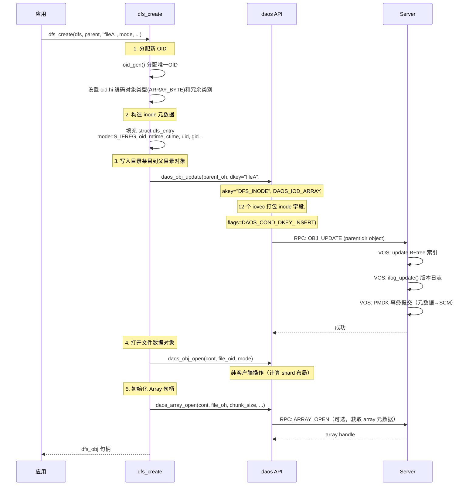
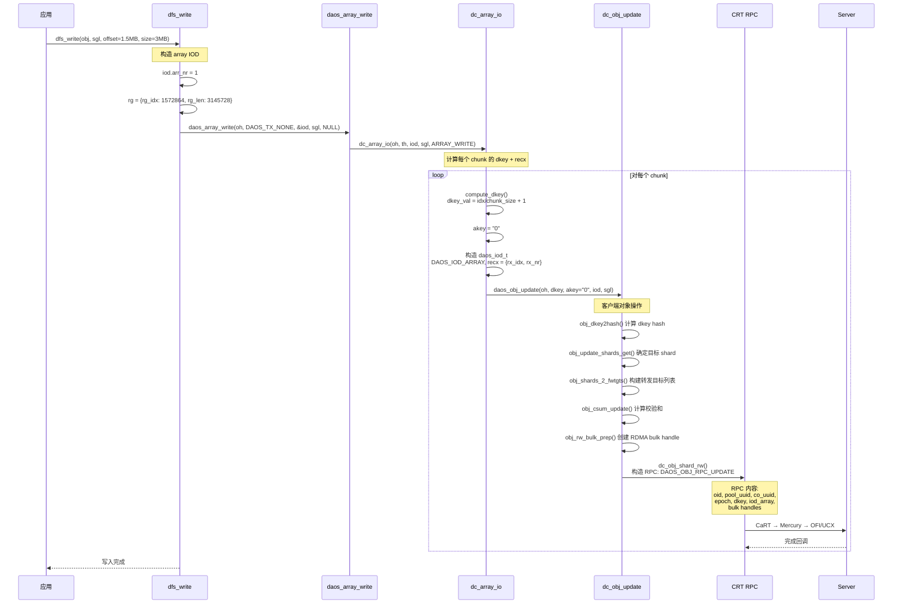
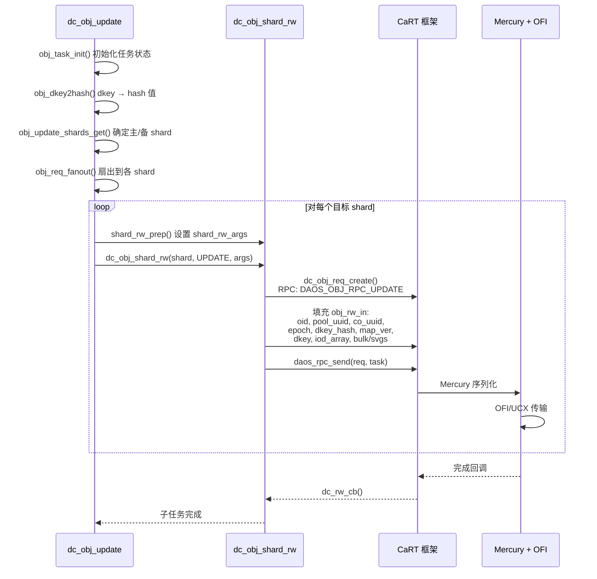
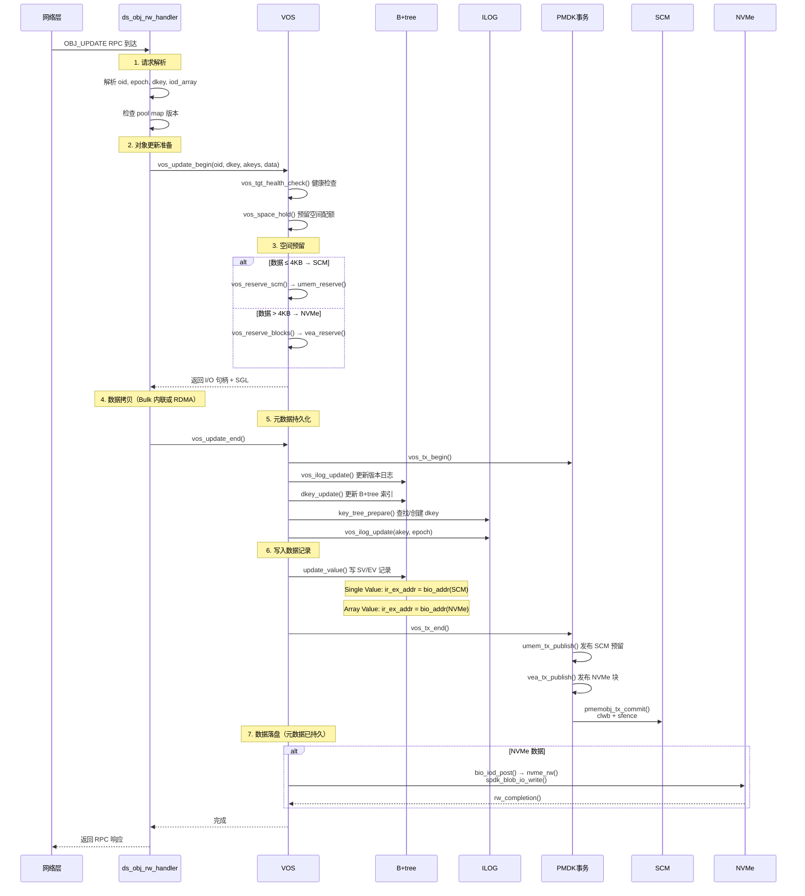
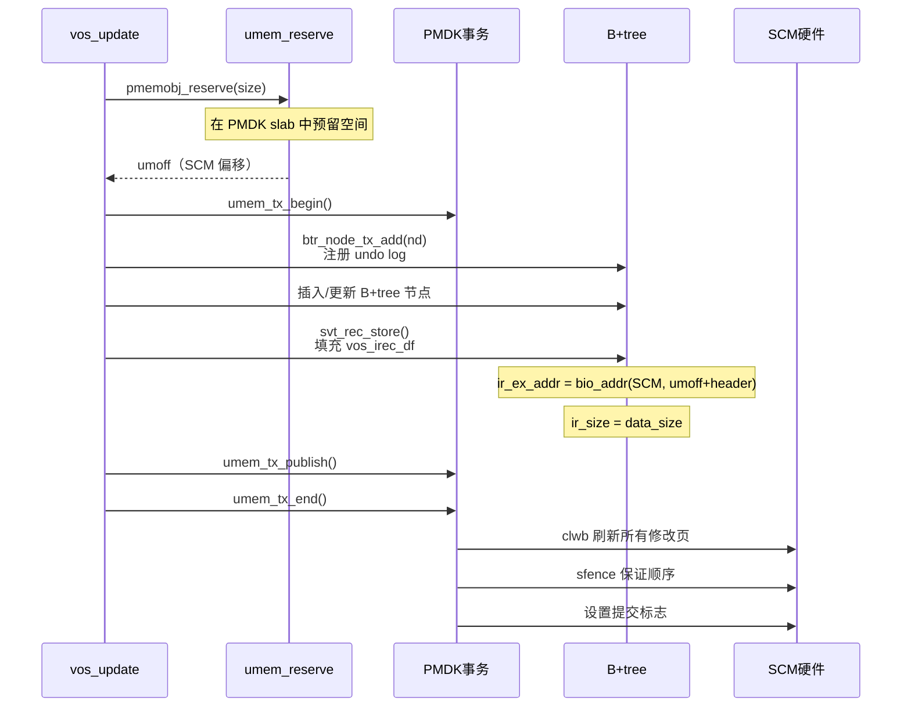
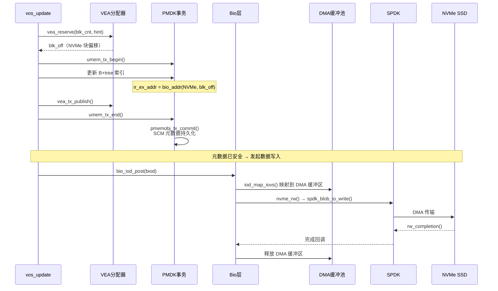
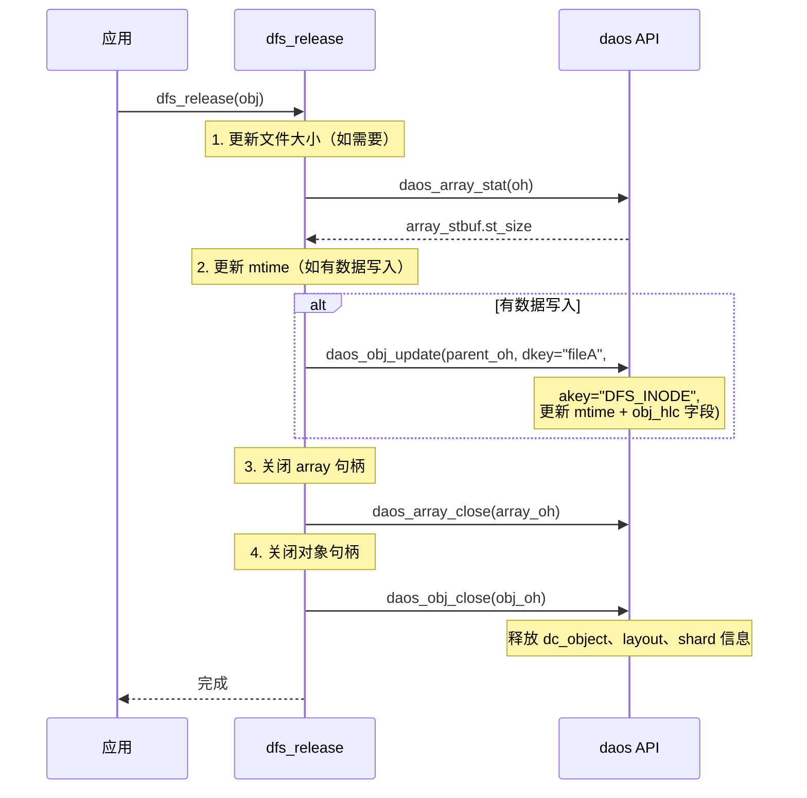
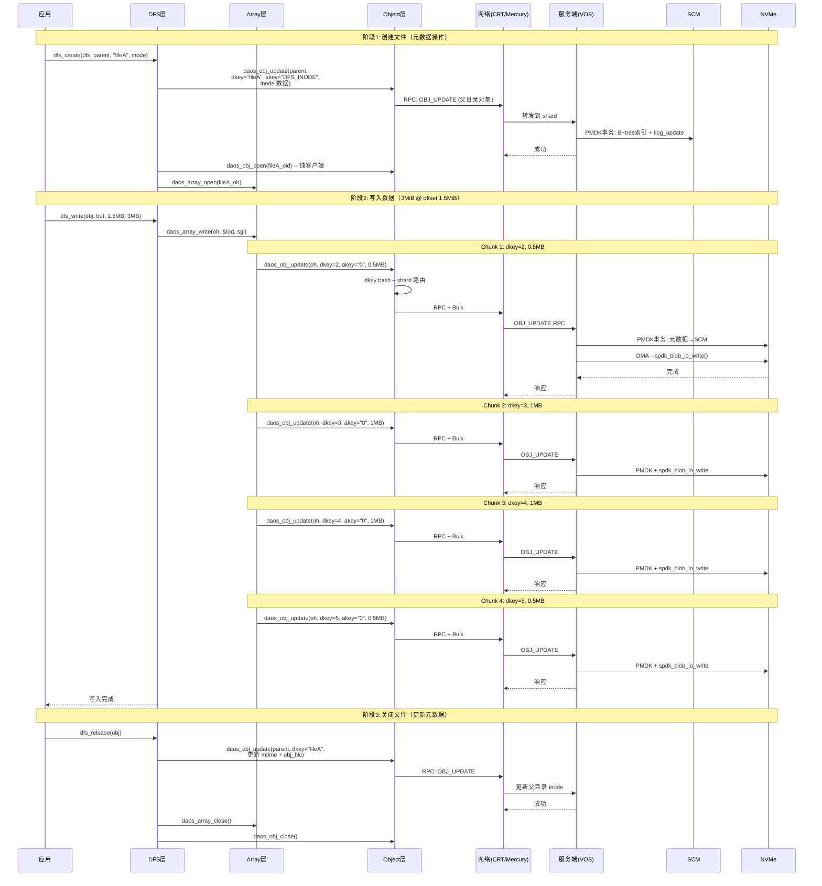

# DAOS 文件写入全流程分析

## 目录

1. [场景概述](#1-场景概述)
2. [文件系统元数据模型](#2-文件系统元数据模型)
3. [容器挂载流程](#3-容器挂载流程)
4. [文件创建流程](#4-文件创建流程)
5. [文件写入流程](#5-文件写入流程)
6. [客户端 RPC 构建与发送](#6-客户端-rpc-构建与发送)
7. [服务端处理流程](#7-服务端处理流程)
8. [VOS 层落盘流程](#8-vos-层落盘流程)
9. [文件关闭流程](#9-文件关闭流程)
10. [端到端完整时序](#10-端到端完整时序)
11. [数据到 DAOS 对象的映射](#11-数据到-daos-对象的映射)
12. [元数据与数据的分离存储](#12-元数据与数据的分离存储)
13. [错误处理与重试](#13-错误处理与重试)
14. [对比总结](#14-对比总结)
15. [源码索引](#15-源码索引)

---

## 1. 场景概述

假设用户通过 DFS（DAOS POSIX File System）接口写入一个文件 A，整个操作涉及的阶段：

```
挂载容器 → 打开/创建文件 → 写入数据 → 关闭文件

涉及层级:
  DFS (POSIX层) → Array API (数组层) → Object API (对象层) → CRT RPC → VOS (存储层) → Bio (I/O层) → SCM/NVMe
```

**核心设计**：

- 每个文件映射为一个 `DAOS_OT_ARRAY_BYTE` 类型对象
- 文件按 chunk（默认 1MiB）切分，每个 chunk 对应一个 D-key
- 文件元数据（mode, uid, gid, mtime 等）存储在**父目录对象**中
- 数据存储在**文件对象**中，通过 VOS → Bio → SCM/NVMe 落盘

---

## 2. 文件系统元数据模型

### 2.1 两个保留对象

每个 DFS 容器在创建时生成两个保留对象：

```c
// src/client/dfs/cont.c:274-295
roots.cr_oids[0] = {lo: 0, hi: 0};  // Superblock 对象
roots.cr_oids[1] = {lo: 0, hi: 1};  // 根目录对象
```

### 2.2 存储层次结构



### 2.3 Inode 结构

```c
// src/client/dfs/dfs_internal.h:64-80
// 存储在父目录对象的 "DFS_INODE" A-key 中（DAOS_IOD_ARRAY，~82字节）
struct dfs_entry {
    mode_t     mode;           // 文件类型 + 权限 (S_IFREG/S_IFDIR/S_IFLNK)
    daos_obj_id_t oid;        // 文件/目录的数据对象OID
    uint64_t   mtime;          // 修改时间（秒）
    uint64_t   ctime;          // 状态变更时间（秒）
    uint64_t   chunk_size;     // 文件 chunk 大小
    uint16_t   oclass;         // 对象类别
    uint64_t   mtime_nano;     // mtime 纳秒
    uint64_t   ctime_nano;     // ctime 纳秒
    uid_t      uid;            // 所有者 UID
    gid_t      gid;            // 所有者 GID
    uint64_t   value_len;      // 符号链接目标长度
    uint64_t   obj_hlc;        // 对象最后写入的 HLC 时间戳
};
```

### 2.4 对象类型对应关系

| POSIX 文件类型 | DAOS 对象类型 | 说明 |
|---|---|---|
| 普通文件 | `DAOS_OT_ARRAY_BYTE` | 数组对象，按 chunk 存储 |
| 目录 | `DAOS_OT_MULTI_HASHED` | KV 对象，子条目为 D-key |
| 符号链接 | 无独立对象 | 元数据存于父目录（DFS_INODE + DFS_SLINK） |

---

## 3. 容器挂载流程



**要点**：`daos_obj_open()` 是纯客户端操作，根据 pool map 计算对象布局，不发 RPC。

---

## 4. 文件创建流程



### 4.1 目录条目写入详情

`insert_entry()` 将 inode 写入父目录对象：

```c
// src/client/dfs/common.c:329-396
daos_iod_t iods[2];
d_iov_t   sg_iovs[12];  // 12个iovec打包inode字段

// A-key "DFS_INODE"
iods[0].iod_name   = "DFS_INODE";
iods[0].iod_type   = DAOS_IOD_ARRAY;
iods[0].iod_size   = sizeof(mode_t);  // 每个"记录"大小 = mode_t
iods[0].iod_nr     = 1;
iods[0].iod_recxs[0] = {rx_idx: 0, rx_nr: END_IDX};  // 82字节inode

// D-key = 文件名 "fileA"
daos_key_t dkey = {buf: "fileA", len: 6};

// Conditional insert（防止重复创建）
daos_obj_update(parent_oh, DAOS_TX_NONE, &dkey, 1, iods, sgls,
                DAOS_COND_DKEY_INSERT);
```

---

## 5. 文件写入流程

### 5.1 偏移量到 D-key 的映射

假设写入 3MiB 数据到文件偏移 1.5MiB，chunk_size = 1MiB：

```
offset = 1.5 MiB, size = 3 MiB, chunk_size = 1 MiB

chunk 1: dkey_val = 1.5M / 1M = 1 → dkey = 2
          内部偏移 = 1.5M - 1M = 0.5M, 长度 = 0.5M

chunk 2: dkey_val = 2 → dkey = 3
          内部偏移 = 0, 长度 = 1M

chunk 3: dkey_val = 3 → dkey = 4
          内部偏移 = 0, 长度 = 1M

chunk 4: dkey_val = 4 → dkey = 5
          内部偏移 = 0, 长度 = 0.5M

→ 产生 4 次 daos_obj_update RPC
```

### 5.2 完整写入时序



### 5.3 `dc_array_io()` 中的偏移映射核心逻辑

```c
// src/client/array/dc_array.c:1432
dc_array_io(oh, th, iod, sgl, opc, task) {
    for (i = 0; i < iod->arr_nr; i++) {
        // 计算当前 range 起始的 dkey
        compute_dkey(array, array_idx, &num_records, &record_i, &dkey_val);

        // array_idx / chunk_size → dkey 编号（从1开始，0保留给元数据）
        // array_idx % chunk_size → dkey 内的记录偏移

        dkey = dkey_val + 1;  // 1-based
        akey = "0";

        // 构造 IOD
        iod_local.iod_type  = DAOS_IOD_ARRAY;
        iod_local.iod_size  = array->cell_size;  // 通常为 1 字节
        iod_local.iod_recxs = {rx_idx: record_i, rx_nr: num_records};

        // 合并同一 dkey 内的连续 range
        // 创建子任务: DAOS_OPC_OBJ_UPDATE
        //   → daos_obj_update(oh, dkey, akey, &iod_local, sgl_part)
    }
}
```

---

## 6. 客户端 RPC 构建与发送

### 6.1 RPC 构建流程



### 6.2 RPC 协议格式

```c
// src/object/obj_rpc.h - DAOS_ISEQ_OBJ_RW

输入（Client → Server）:
  orw_dti          dtx_id           // 分布式事务 ID
  orw_oid          daos_unit_oid_t  // Unit OID（含 shard 号）
  orw_pool_uuid    uuid_t           // Pool UUID
  orw_co_hdl       uuid_t           // Container handle
  orw_co_uuid      uuid_t           // Container UUID
  orw_epoch        uint64_t         // 事务 epoch
  orw_dkey_hash    uint64_t         // D-key hash（服务端路由用）
  orw_map_ver      uint32_t         // Pool map 版本
  orw_dkey         daos_key_t       // 分发键
  orw_iod_array    obj_iod_array    // IOD 数组（含 recxs）
  orw_bulks        crt_bulk_t[]     // RDMA bulk 句柄（大数据）
  orw_sgls         d_sg_list_t[]    // 内联 SGL（小数据）

输出（Server → Client）:
  orw_ret          int32_t          // 返回码
  orw_map_version  uint32_t         // 最新 map 版本
  orw_epoch        uint64_t         // 实际 epoch
  orw_iod_sizes    daos_size_t[]    // 每个 IOD 实际写入大小
  orw_iod_csums    dcs_iod_csums[]  // 校验和
```

### 6.3 Bulk 传输决策

| 数据大小 | 传输方式 | 说明 |
|---|---|---|
| ≤ 19 KiB | 内联 SGL | 数据嵌入 RPC 消息 |
| > 19 KiB | RDMA Bulk | CRT bulk handle，零拷贝传输 |

---

## 7. 服务端处理流程



---

## 8. VOS 层落盘流程

### 8.1 数据分类决策

```
写入数据大小
├── ≤ 4KB → SCM Inline
│   └── vos_irec_df + payload 连续存储在 SCM
├── > 4KB → NVMe External
│   └── 元数据在 SCM，payload 在 NVMe
└── > 8MB → Gang
    └── 元数据在 SCM，payload 分散存储
```

### 8.2 SCM 写详细路径



### 8.3 NVMe 写详细路径



---

## 9. 文件关闭流程



**注意**：DFS write 本身不更新 inode（lazy update），mtime 在 close 或下次 stat 时才刷新。

---

## 10. 端到端完整时序



---

## 11. 数据到 DAOS 对象的映射

### 11.1 单文件映射

每个 DFS 文件 → 一个 `DAOS_OT_ARRAY_BYTE` 对象：

```
文件偏移空间:     [0]────────[1M]────────[2M]────────[3M]────────[4M]
                  │  chunk 0  │  chunk 1  │  chunk 2  │  chunk 3  │
DAOS D-key:       │     1     │     2     │     3     │     4     │
DAOS A-key:       │     "0"   │     "0"   │     "0"   │     "0"   │
DAOS recx:        │ (0, 1M)  │ (0, 1M)  │ (0, 1M)  │ (0, 1M)  │
```

### 11.2 跨 Chunk 写入拆分

```
写入: offset=1.5MB, size=3MB, chunk_size=1MB

文件空间:
     [0]────[1M]────[1.5M]────[2M]────[3M]────[4M]────[4.5M]
              chunk 1  │   chunk 2    │  chunk 3  │  chunk 4
              dkey=2   │   dkey=3     │  dkey=4   │  dkey=5
写入:          [===]   │ [===========]│[==========]│ [===]

RPC 1: dkey=2, recx={idx:524288, nr:524288}  (0.5MB)
RPC 2: dkey=3, recx={idx:0,      nr:1048576} (1MB)
RPC 3: dkey=4, recx={idx:0,      nr:1048576} (1MB)
RPC 4: dkey=5, recx={idx:0,      nr:524288}  (0.5MB)
```

### 11.3 对象冗余（Replication/EC）

数据通过 DAOS 对象类别（Object Class）实现冗余：

| Object Class | 说明 | shard 行为 |
|---|---|---|
| `OC_RP_2GX` | 2 副本 | Leader 写入 + 1 个 Follower 复制 |
| `OC_RP_3GX` | 3 副本 | Leader 写入 + 2 个 Follower 复制 |
| `OC_EC_2P1G1` | EC 2+1 | 跨 3 个 shard，任意 2 个可恢复 |

每个 chunk 的写入通过 Leader → Follower 的 RPC 转发实现副本同步（参见 [daos_replication.md](daos_replication.md)）。

---

## 12. 元数据与数据的分离存储

```
                    元数据路径                          数据路径
                    ────────                            ────────

父目录对象                                    文件数据对象
(DAOS_OT_MULTI_HASHED)                      (DAOS_OT_ARRAY_BYTE)
┌─────────────────────┐                    ┌─────────────────────┐
│ D-key: "fileA"      │                    │ D-key: 1 (chunk 0)  │
│  A-key: "DFS_INODE" │                    │  A-key: "0"          │
│  ├─ mode (4B)       │                    │  └─ 1MiB 文件数据   │
│  ├─ oid (16B)  ─────────────────────────→ │                     │
│  ├─ mtime (8B)      │                    │ D-key: 2 (chunk 1)  │
│  ├─ ctime (8B)      │                    │  A-key: "0"          │
│  ├─ chunk_size (8B) │                    │  └─ 1MiB 文件数据   │
│  ├─ oclass (2B)     │                    │         ...          │
│  ├─ mtime_nano (8B) │                    │                     │
│  ├─ ctime_nano (8B) │                    │ D-key: N (chunk N-1)│
│  ├─ uid (4B)        │                    │  A-key: "0"          │
│  ├─ gid (4B)        │                    │  └─ 文件数据         │
│  └─ obj_hlc (8B)    │                    └─────────────────────┘
└─────────────────────┘                      存储在 NVMe SSD
存储在 SCM
```

**关键设计**：

1. **元数据在父目录**：inode 信息存储在父目录 KV 对象中，与文件名同 D-key。`readdir` = 枚举 D-key。
2. **数据在文件对象**：文件内容存储在独立的数据对象中，通过 inode 中的 `oid` 字段关联。
3. **大小不存 inode**：文件大小从 `daos_array_stat()` 获取（由数据对象维护）。
4. **mtime 双源**：取 inode 存储 mtime 和对象 HLC 时间戳中较新者。

---

## 13. 错误处理与重试

### 13.1 可重试错误

```c
// obj_internal.h:826
-DER_TIMEDOUT       // RPC 超时
-DER_STALE          // Pool map 版本过期
-DER_INPROGRESS     // 事务冲突
-DER_GRPVER         // Pool map 版本变更
-DER_EXCLUDED       // 目标被排除
-DER_CSUM           // 校验和不匹配
-DER_TX_BUSY        // 事务繁忙
-DER_TX_UNCERTAIN   // 事务状态不确定
-DER_NOTLEADER      // 非 Leader
-DER_UPDATE_AGAIN   // 需要重新更新
-DER_NVME_IO        // NVMe I/O 错误
```

### 13.2 重试机制

```
obj_retry_error():
    1. 检查错误是否可重试
    2. 设置 ORF_RESEND 标志
    3. obj_req_fanout() 重新调度所有 shard 任务
    4. DTX ID 保持不变（服务端幂等处理）
```

---

## 14. 对比总结

### 14.1 文件写入各阶段耗时对比

| 阶段 | 主要操作 | 典型延迟 |
|---|---|---|
| dfs_create | 客户端 OID 分配 + 1 次 RPC（inode 写入） | ~50μs RPC |
| dfs_write（per chunk） | 客户端计算 + 1 次 RPC + NVMe 写入 | ~20-50μs RPC + ~10μs NVMe |
| dfs_release | 1 次 RPC（mtime 更新）+ 关闭 | ~50μs RPC |

### 14.2 与 POSIX 文件系统对比

| 操作 | DAOS DFS | POSIX (ext4) | CephFS |
|---|---|---|---|
| 创建文件 | 父目录 KV 写入 + 对象分配 | inode 分配 + 目录项写入 | MDS 事务 |
| 写入数据 | Array API → Object RPC → VOS | VFS → ext4 journal → block | Client cache → OSD write |
| 元数据存储 | 父目录 KV 对象（SCM） | inode table（块设备） | MDS（内存/rocksdb） |
| 数据存储 | DAOS 对象（NVMe） | block device | OSD（NVMe） |
| 分条策略 | 按 chunk（默认 1MiB）按 D-key 分割 | block 级连续分配 | striping（默认 4MB） |
| 副本 | 对象类别（RP/EC） | 无（单机） | EC/Replica |
| 一致性 | DTX 两阶段提交 | journaling | 分布式 MDS |

---

## 15. 源码索引

### DFS 层

| 文件 | 内容 |
|---|---|
| `src/client/dfs/io.c` | `dfs_write()`、`dfs_read()` |
| `src/client/dfs/dfs_internal.h` | `struct dfs_entry`、`struct dfs_obj`、OID 生成 |
| `src/client/dfs/common.c` | `insert_entry()`、`fetch_entry()`、`remove_entry()` |
| `src/client/dfs/cont.c` | `dfs_cont_create()`、Superblock 创建 |
| `src/client/dfs/lookup.c` | `lookup_rel_path()`、路径解析 |
| `src/client/dfs/readdir.c` | `dfs_readdir()`、`dfs_readdirplus()` |
| `src/client/dfs/xattr.c` | `dfs_setxattr()`、扩展属性 |

### Array 层

| 文件 | 内容 |
|---|---|
| `src/include/daos_array.h` | `daos_array_iod_t`、`daos_range_t` |
| `src/client/api/array.c` | `daos_array_write()` |
| `src/client/array/dc_array.c` | `dc_array_io()`、`compute_dkey()`、偏移映射 |

### Object 层（客户端）

| 文件 | 内容 |
|---|---|
| `src/include/daos_obj.h` | `daos_iod_t`、`daos_recx_t`、`daos_obj_update()` |
| `src/include/daos/object.h` | 内部对象 API |
| `src/client/api/object.c` | `daos_obj_open()`、`daos_obj_update()` |
| `src/object/cli_obj.c` | `dc_obj_open()`、`dc_obj_update()`、`obj_req_fanout()` |
| `src/object/cli_shard.c` | `dc_obj_shard_rw()`、RPC 构建 |
| `src/object/obj_rpc.h` | RPC 协议格式（`DAOS_ISEQ_OBJ_RW`） |
| `src/object/obj_tx.c` | 分布式事务（`dc_tx_attach`/`dc_tx_commit`） |
| `src/object/obj_internal.h` | `dc_object`、`dc_obj_shard`、`shard_rw_args` |

### 服务端

| 文件 | 内容 |
|---|---|
| `src/object/srv_obj.c` | `ds_obj_rw_handler()`、`obj_tgt_update()` |

### VOS 层（服务端落盘）

| 文件 | 内容 |
|---|---|
| `src/vos/vos_io.c` | `vos_update_begin/end`、`vos_fetch_begin/end` |
| `src/vos/vos_common.c` | `vos_tx_begin/end` |
