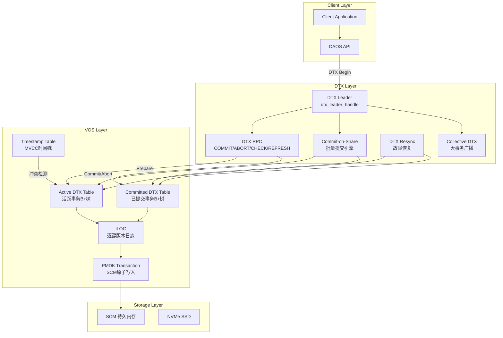
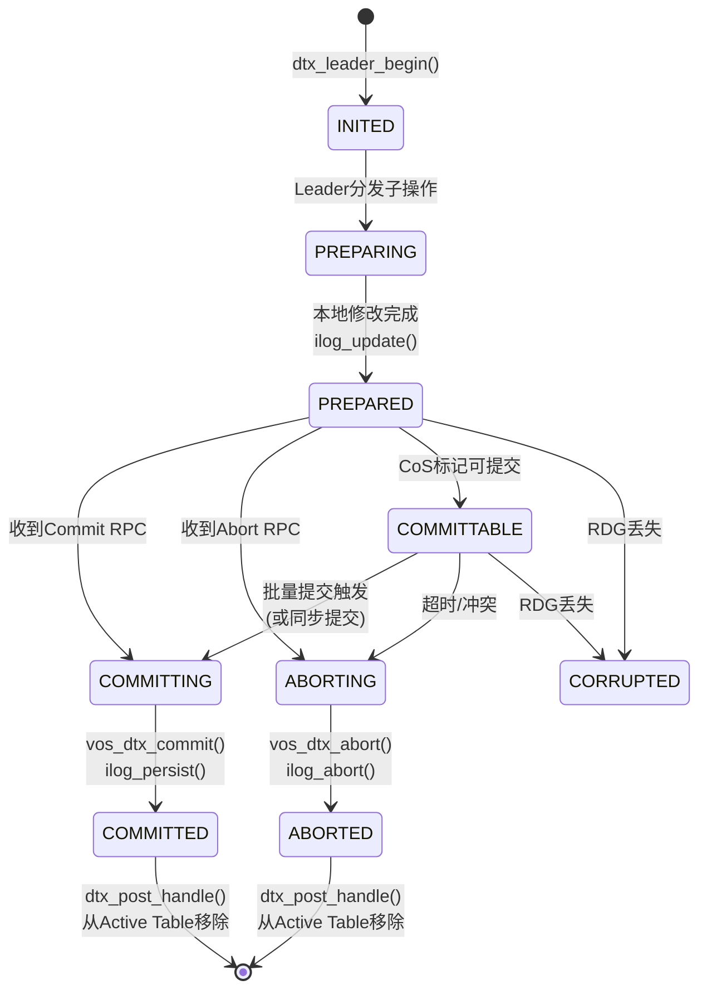
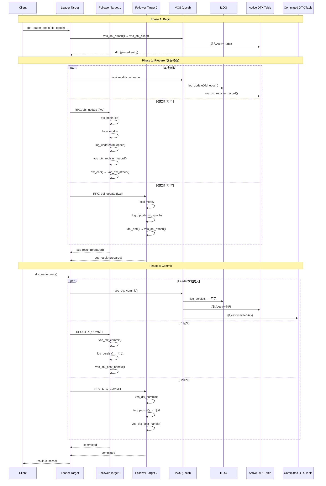
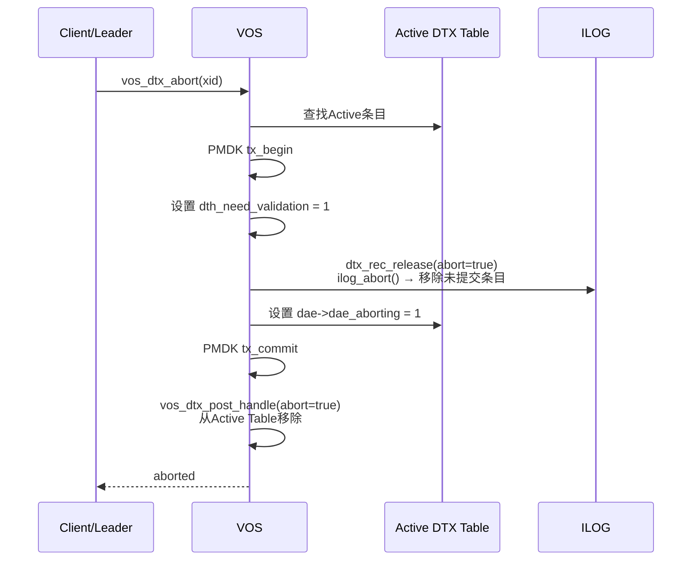
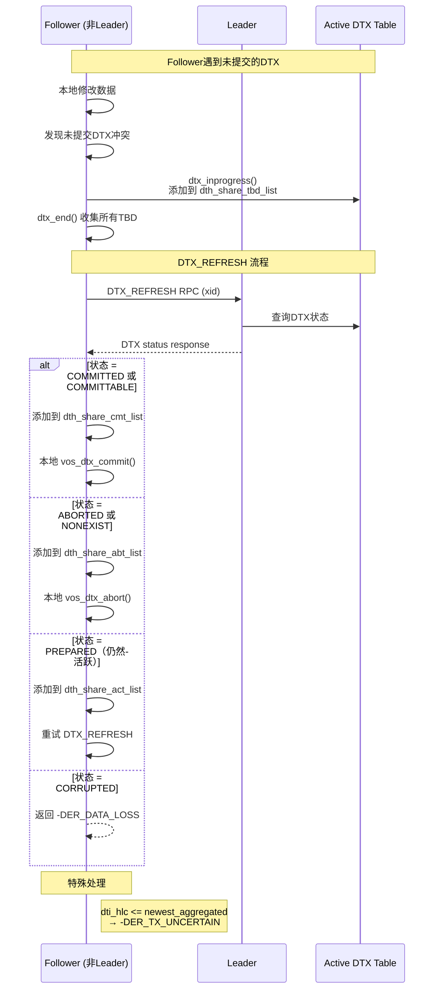
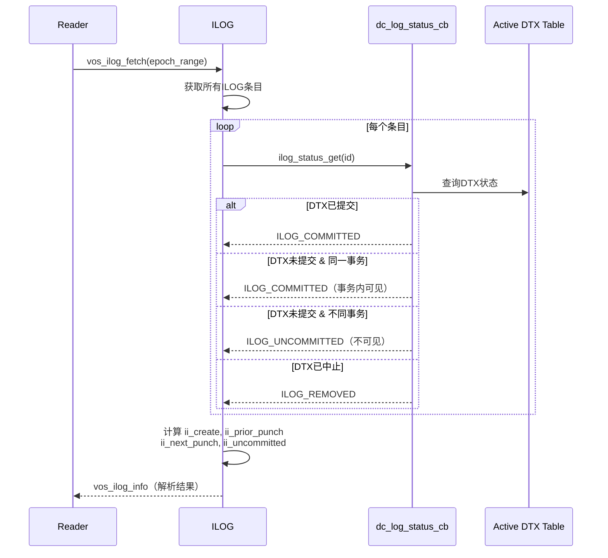
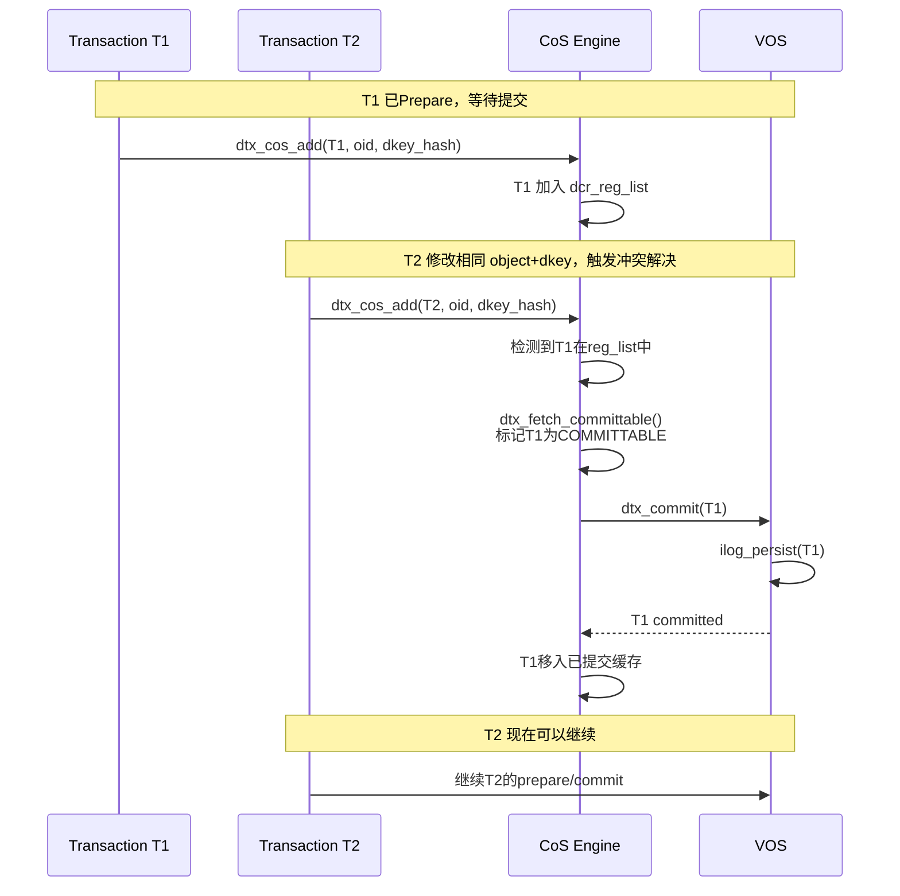
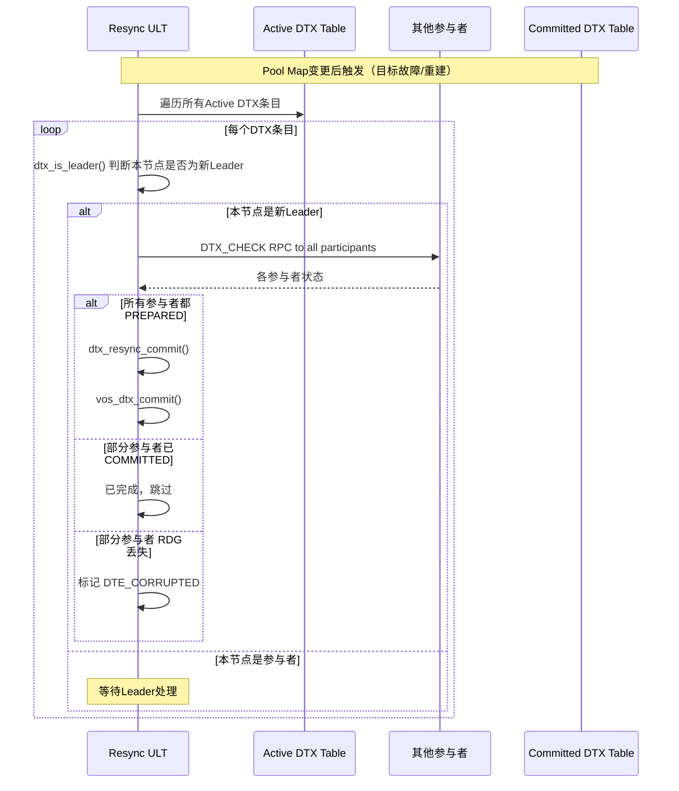
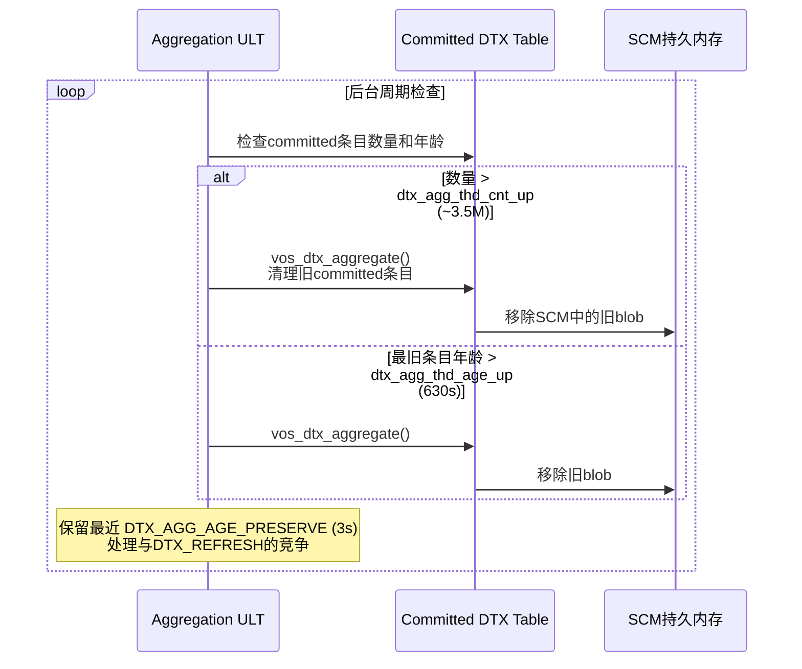
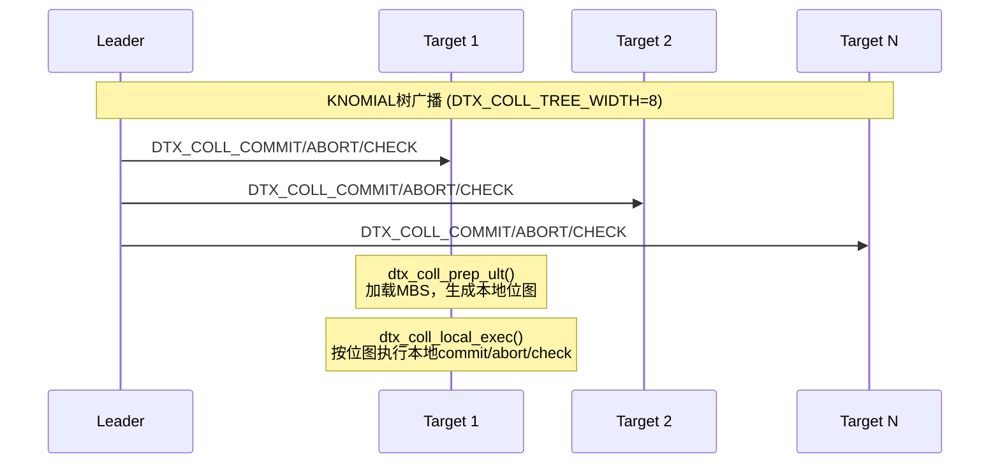

# DAOS 一致性实现分析

## 目录

1. [概述](#1-概述)
2. [一致性架构总览](#2-一致性架构总览)
3. [DTX 核心数据结构](#3-dtx-核心数据结构)
4. [事务标识符与Epoch](#4-事务标识符与epoch)
5. [事务状态机](#5-事务状态机)
6. [参与者与成员关系](#6-参与者与成员关系)
7. [ILOG 版本追踪](#7-ilog-版本追踪)
8. [两阶段提交流程](#8-两阶段提交流程)
9. [冲突检测与解决](#9-冲突检测与解决)
10. [读一致性与MVCC](#10-读一致性与mvcc)
11. [Commit-on-Share 批量提交](#11-commit-on-share-批量提交)
12. [恢复机制](#12-恢复机制)
13. [副本一致性](#13-副本一致性)
14. [持久性保证](#14-持久性保证)
15. [参数配置](#15-参数配置)
16. [对比总结](#16-对比总结)
17. [源码索引](#17-源码索引)

---

## 1. 概述

DAOS（Distributed Asynchronous Object Storage）采用 **分布式两阶段提交（Distributed Transaction, DTX）** 作为核心一致性机制，结合 **ILOG（Incarnation Log）** 实现逐键的 MVCC 版本追踪，在 SCM 持久内存上通过 PMDK 事务保证原子性和持久性。

一致性模型的核心特点：

| 特性 | 实现方式 |
|---|---|
| 原子性 | PMDK 事务 + DTX 两阶段提交 |
| 一致性 | ILOG 版本追踪 + Epoch 排序 |
| 隔离性 | MVCC + 时间戳冲突检测 |
| 持久性 | PMDK fdatasync + Active/Committed DTX 持久化 |

---

## 2. 一致性架构总览



三层架构：

- **Client Layer**：发起事务请求，处理重试
- **DTX Layer**：协调分布式两阶段提交，管理事务生命周期
- **VOS Layer**：执行本地持久化操作，维护版本日志和时间戳

---

## 3. DTX 核心数据结构

### 3.1 事务标识符

```c
// src/include/daos/dtx.h:232-237
struct dtx_id {
    uuid_t      dti_uuid;    /* 事务UUID */
    uint64_t    dti_hlc;     /* HLC（混合逻辑时钟）时间戳 */
};
```

由客户端通过 `daos_dti_gen_unique()` 生成，全局唯一。

### 3.2 事务状态

```c
// src/include/daos/dtx.h:304-323
enum dtx_status {
    DTX_ST_INITED      = 0,  /* 已初始化，未prepare */
    DTX_ST_PREPARED    = 1,  /* 本地参与者已完成修改 */
    DTX_ST_COMMITTED   = 2,  /* 已提交 */
    DTX_ST_CORRUPTED   = 3,  /* 部分参与者RDG丢失 */
    DTX_ST_COMMITTABLE = 4,  /* 可提交但未提交（非持久化） */
    DTX_ST_ABORTED     = 5,  /* 已中止 */
    DTX_ST_ABORTING    = 6,  /* 中止中（非持久化） */
    DTX_ST_COMMITTING  = 7,  /* 提交中（非持久化） */
    DTX_ST_PREPARING   = 8,  /* 准备中（非持久化） */
};
```

### 3.3 Epoch上下文

```c
// src/include/daos/dtx.h:358-370
struct dtx_epoch {
    daos_epoch_t oe_value;     /* 选定的epoch值 */
    daos_epoch_t oe_first;     /* 首次选定的epoch */
    uint32_t     oe_flags;     /* e.g., DTX_EPOCH_UNCERTAIN */
    uint32_t     oe_rpc_flags; /* 线程协议标志 */
};
```

`DTX_EPOCH_UNCERTAIN` 标志表示epoch值存在时钟不确定性。`dtx_epoch_bound()` 函数通过 HLC epsilon 边界处理不确定性：

```c
// src/dtx/dtx_common.c:808-829
static daos_epoch_t dtx_epoch_bound(struct dtx_epoch *epoch) {
    if (!(epoch->oe_flags & DTX_EPOCH_UNCERTAIN))
        return epoch->oe_value;     // 无不确定性
    limit = d_hlc_epsilon_get_bound(epoch->oe_first);
    if (epoch->oe_value >= limit)
        return epoch->oe_value;     // 超出不确定性窗口
    return limit;                   // 在不确定性窗口内 → 使用边界值
}
```

### 3.4 DTX Entry（持久化结构）

```c
// src/include/daos_srv/vos_types.h:66-75
struct dtx_entry {
    struct dtx_id           dte_xid;   /* 事务标识符 */
    uint32_t                dte_ver;   /* Pool map版本 */
    uint32_t                dte_refs;  /* 引用计数 */
    struct dtx_memberships *dte_mbs;   /* 参与者信息 */
};
```

### 3.5 DTX Handle（运行时结构）

```c
// src/include/daos_srv/dtx_srv.h:51-169
struct dtx_handle {
    struct dtx_id           dth_xid;          /* 事务标识符 */
    daos_handle_t           dth_coh;           /* Container句柄 */
    daos_handle_t           dth_poh;           /* Pool句柄 */
    struct dtx_epoch        dth_epoch;         /* Epoch信息 */
    struct dtx_epoch        dth_epoch_bound;   /* Epoch边界 */
    daos_unit_oid_t         dth_leader_oid;    /* 用于Leader选举的Object ID */
    /* 标志位 */
    uint32_t                dth_sync:1;        /* 同步提交 */
    uint32_t                dth_solo:1;        /* 单节点事务 */
    uint32_t                dth_dist:1;        /* 分布式事务 */
    uint32_t                dth_prepared:1;    /* 已prepare */
    uint32_t                dth_aborted:1;     /* 已中止 */
    /* 共享列表（冲突检测） */
    struct dtx_share_list   *dth_share_cmt_list;  /* 共享-已提交列表 */
    struct dtx_share_list   *dth_share_abt_list;  /* 共享-已中止列表 */
    struct dtx_share_list   *dth_share_act_list;  /* 共享-活跃列表 */
    struct dtx_share_list   *dth_share_tbd_list;  /* 共享-待定列表 */
};
```

### 3.6 DTX Leader Handle

```c
// src/include/daos_srv/dtx_srv.h:198-240
struct dtx_leader_handle {
    struct dtx_handle       dlh_hdl;           /* 基础handle */
    int                     dlh_result;        /* 分布式事务结果 */
    ABT_future              dlh_future;        /* 子请求完成future */
    struct dtx_sub_status   *dlh_subs;         /* 子事务状态数组 */
    int                     dlh_coll;          /* 集体DTX标志 */
    struct dtx_coll_entry   dlh_coll_entry;    /* 集体DTX条目 */
};
```

### 3.7 DTX Entry标志

```c
// src/include/daos_srv/vos_types.h:42-64
enum dtx_entry_flags {
    DTE_LEADER            = 0x1,   /* 本目标是DTX Leader */
    DTE_INVALID           = 0x2,   /* 条目无效 */
    DTE_BLOCK             = 0x4,   /* 阻塞其他DTX访问（分布式/EC） */
    DTE_CORRUPTED         = 0x8,   /* 部分参与者RDG丢失 */
    DTE_ORPHAN            = 0x10,  /* Leader条目丢失，状态不确定 */
    DTE_PARTIAL_COMMITTED = 0x20,  /* 仅在部分参与者上已提交 */
    DTE_EPOCH_SORTED      = 0x40,  /* Epoch已本地排序 */
};
```

---

## 4. 事务标识符与Epoch

### 4.1 HLC（混合逻辑时钟）

DAOS 使用 Hybrid Logical Clock 来生成全局有序的时间戳：

```
HLC = (physical_time, logical_counter)
```

- **物理时间**：取本地物理时钟和消息中携带的时钟的最大值
- **逻辑计数器**：当物理时钟回退时递增，保证单调递增

HLC 提供以下保证：
- 事件因果关系（happened-before）→ 严格递增
- 物理时间接近（误差 bounded by ε）→ 用于不确定性检测

### 4.2 Epoch 与事务的关系

每个 DTX 关联一个 epoch 范围：

| 场景 | Epoch 处理 |
|---|---|
| Solo DTX（单节点） | 使用本地 epoch |
| 分布式 DTX | Leader 选择 epoch，广播给参与者 |
| HLC 不确定性 | 使用 `dtx_epoch_bound()` 推迟到安全边界 |
| 同一对象并发写 | 通过 ILOG 的 epoch 排序检测冲突 |

### 4.3 时间戳表（Timestamp Table）

```c
// src/vos/vos_ts.h:51-70
struct vos_wts_cache {
    daos_epoch_t wc_ts_w[2];  /* 最高的两个写时间戳 */
    uint32_t     wc_w_high;   /* 最高时间戳的索引 */
};

// src/vos/vos_ts.h:144-159
struct vos_ts_table {
    daos_epoch_t          tt_ts_rl;      /* 全局读低水位 */
    daos_epoch_t          tt_ts_rh;      /* 全局读高水位 */
    struct vos_wts_cache  tt_w_cache;    /* 全局写时间戳缓存 */
    struct dtx_id         tt_tx_rl;      /* 低水位对应的DTX ID */
    struct dtx_id         tt_tx_rh;      /* 高水位对应的DTX ID */
    struct vos_ts_entry  *tt_misses;     /* 负面缓存 */
    struct vos_ts_info    tt_type_info[VOS_TS_TYPE_COUNT]; /* 按类型分类 */
};
```

用于 MVCC 冲突检测，每个线程维护一个时间戳缓存。

---

## 5. 事务状态机



状态转换要点：

- **INITED → PREPARED**：本地参与者完成数据修改，更新 ILOG，注册记录到 Active DTX Table
- **PREPARED → COMMITTABLE**：Commit-on-Share 机制标记事务可提交（批量优化）
- **PREPARED → COMMITTING**：同步提交路径直接进入提交
- **COMMITTING → COMMITTED**：调用 `ilog_persist()` 使 ILOG 条目对其他事务可见
- **ABORTING → ABORTED**：调用 `ilog_abort()` 清除未提交的 ILOG 条目
- **CORRUPTED**：部分副本丢失，需人工干预

---

## 6. 参与者与成员关系

### 6.1 DTX Memberships

```c
// src/include/daos/dtx.h:194-226
struct dtx_memberships {
    uint32_t dm_tgt_cnt;     /* 总共涉及的shard数 */
    uint32_t dm_grp_cnt;     /* 修改组数 */
    uint32_t dm_data_size;   /* dm_data的大小 */
    uint16_t dm_flags;       /* dtx_mbs_flags */
    uint16_t dm_dte_flags;   /* 恢复用DTX条目标志 */
    union {
        char                   dm_data[0];    /* 灵活数据区 */
        struct dtx_daos_target dm_tgts[0];    /* 目标数组 */
    };
};
```

### 6.2 冗余组（Redundancy Group）

```c
// src/include/daos/dtx.h:112-134
struct dtx_redundancy_group {
    uint32_t drg_tgt_cnt;     /* 组内涉及的shard数 */
    uint32_t drg_redundancy;  /* 冗余度（EC: parity+1, 副本: 副本数） */
    uint16_t drg_ids[];       /* Shard ID数组（第一个是Leader） */
};
```

- 如果冗余组内所有 shard 丢失 → DTX 标记为 `CORRUPTED`
- 如果部分 shard 存活 → 通过存活副本的状态决定提交或中止

### 6.3 集体DTX目标（Collective DTX Target）

```c
// src/include/daos/dtx.h:172-192
struct dtx_coll_target {
    uint32_t dct_fd_id;       /* Fault Domain ID */
    uint32_t dct_pda_id;      /* PDA ID */
    uint32_t dct_ver;         /* Layout版本 */
    uint32_t dct_cnt;         /* 目标总数 */
    uint32_t dct_tgt_idx;     /* 目标索引 */
    uint32_t dct_local_map[]; /* 本地位图 */
};
```

用于大规模事务（如整对象 punch），避免存储所有参与者列表。通过布局参数动态计算参与者。

---

## 7. ILOG 版本追踪

### 7.1 ILOG 概述

ILOG（Incarnation Log）是 DAOS MVCC 的核心数据结构。每个 object、dkey 和 akey 都有自己的 ILOG，记录创建、更新和删除的历史。

### 7.2 ILOG 条目标识符

```c
// src/vos/ilog.h:18-30
struct ilog_id {
    union {
        uint64_t id_value;
        struct {
            uint32_t id_tx_id;           /* DTX本地ID */
            uint16_t id_punch_minor_eph; /* Punch的次级epoch */
            uint16_t id_update_minor_eph;/* Update的次级epoch */
        };
    };
    daos_epoch_t id_epoch;               /* 条目时间戳 */
};
```

- `id_tx_id == 0`：条目已提交（无挂起事务）
- `id_tx_id != 0`：条目属于活跃事务，引用 Active DTX Table

### 7.3 ILOG 状态

```c
// src/vos/ilog.h:39-48
enum ilog_status {
    ILOG_INVALID     = 0,  /* 状态未设置 */
    ILOG_COMMITTED   = 1,  /* 条目对调用者可见 */
    ILOG_UNCOMMITTED = 2,  /* 条目尚未可见 */
    ILOG_REMOVED     = 3,  /* 条目可被删除 */
};
```

### 7.4 ILOG 根结构（磁盘持久化）

```c
// src/vos/ilog_internal.h:40-47
struct ilog_root {
    union {
        struct ilog_id   lr_id;      /* 单条目内嵌（优化） */
        struct ilog_tree lr_tree;    /* 多条目B+树 */
    };
    uint32_t lr_ts_idx;              /* 时间戳索引 */
    uint32_t lr_magic;               /* 4-bit magic | 24-bit version | 4-bit flags */
};
```

**优化设计**：当只有一条记录时，直接嵌入根结构，避免 B+树开销。

### 7.5 ILOG 回调机制

```c
// src/vos/ilog.h:51-71
struct ilog_desc_cbs {
    int  (*dc_log_status_cb)(void *args, struct ilog_id *id, ...);   /* 查询DTX状态 */
    void *dc_log_status_args;
    int  (*dc_is_same_tx_cb)(void *args, struct ilog_id *id1, ...);  /* 是否同一事务 */
    void *dc_is_same_tx_args;
    int  (*dc_log_add_cb)(void *args, struct ilog_id *id, ...);      /* 注册到DTX日志 */
    void *dc_log_add_args;
    int  (*dc_log_del_cb)(void *args, struct ilog_id *id, ...);      /* 从DTX日志注销 */
    void *dc_log_del_args;
};
```

通过回调函数将 ILOG 层与 DTX 系统解耦：
- `dc_log_status_cb`：检查 DTX 是否已提交/准备/中止
- `dc_log_add_cb`/`dc_log_del_cb`：管理 Active DTX Table 中的记录引用

### 7.6 VOS ILOG 信息

```c
// src/vos/vos_ilog.h:52-75
struct vos_ilog_info {
    struct ilog_entries       ii_entries;          /* 原始条目列表 */
    daos_epoch_t              ii_uncommitted;      /* 可见的未提交epoch */
    daos_epoch_t              ii_create;           /* 最早创建时间戳 */
    struct vos_punch_record   ii_prior_punch;      /* 前一次已提交punch */
    struct vos_punch_record   ii_prior_any_punch;  /* 前一次已提交或未提交punch */
    daos_epoch_t              ii_next_punch;       /* 后续已提交punch */
    daos_epoch_t              ii_uncertain_create; /* 不确定更新epoch */
    bool                      ii_empty;            /* 无有效条目 */
    bool                      ii_full_scan;        /* 全范围扫描 */
};
```

### 7.7 ILOG 核心操作

| 操作 | 函数 | 说明 |
|---|---|---|
| 创建 | `ilog_create()` | 初始化空日志，设置magic |
| 打开 | `ilog_open()` | 打开已有日志，设置回调 |
| 更新 | `ilog_update()` | 记录/更新条目（带major/minor epoch） |
| 提交 | `ilog_persist()` | 移除事务ID，标记已提交，清理冗余未提交条目 |
| 中止 | `ilog_abort()` | 移除未提交条目 |
| 获取 | `ilog_fetch()` | 获取所有条目（带缓存） |
| 聚合 | `ilog_aggregate()` | 清理指定epoch范围内的旧条目 |

所有修改使用 PMDK 事务（`umem_tx_begin`/`umem_tx_commit`）保证 SCM 上的原子性。

---

## 8. 两阶段提交流程

### 8.1 完整事务生命周期



### 8.2 Phase 1: Begin

1. Client 生成 `dtx_id`（UUID + HLC）
2. Leader 调用 `dtx_leader_begin()`（`src/dtx/dtx_common.c` ~1080行）
3. Leader 在本地 VOS 中分配 DTX entry → 插入 Active DTX Table
4. Active entry 在 SCM 中持久化（`vos_dtx_blob_df`，DTX_ACT_BLOB_MAGIC）

### 8.3 Phase 2: Prepare

对每个子操作：

1. Leader 通过 `dtx_leader_exec_ops()` 分发到各参与者
2. 非Leader参与者调用 `dtx_begin()` 获取本地 handle
3. 执行本地数据修改：
   - `vos_ilog_update()` → `ilog_update()`：在 ILOG 中记录带事务ID的条目
   - 数据记录的 `ir_dtx` 字段编码 DTX 本地ID，建立与事务的关联
   - `vos_dtx_register_record()`：将 ILOG/SVT/EVT 记录注册到 Active DTX Table
4. `dtx_end()` → `vos_dtx_attach(dth, true, ...)`：持久化 DTX entry

**Solo DTX 特殊路径**：如果 `dth_solo == true` 且 `DTX_SYNC`，在 `vos_dtx_prepared()` 中直接调用 `vos_dtx_commit_internal()` 跳过远程提交。

### 8.4 Phase 3: Commit

**`vos_dtx_commit_one()`**（`src/vos/vos_dtx.c` ~822行）：

1. 在 Active DTX Table 中查找事务
2. 检查是否已提交/正在中止
3. 创建 committed DTX entry（`vos_dtx_cmt_ent`，包含 commit_time）
4. 插入 Committed B+树（`dbtree_upsert()`）
5. 设置 `dae->dae_committing = 1`
6. 调用 `dtx_rec_release()` → 对所有注册记录调用 `ilog_persist()`

**`vos_dtx_post_handle()`**（~2344行）：
- **成功**：从 Active Table 移除，从 LRU Cache 淘汰
- **回滚**：移除 committed entries，撤销 committing 状态
- **中止**：标记为 aborted，释放记录引用

### 8.5 中止流程



### 8.6 服务器端 RPC 处理

```c
// src/dtx/dtx_srv.c, dtx_handler(), line 160
switch (rpc_op) {
    case DTX_COMMIT:  /* 批量提交，每批 DTX_YIELD_CYCLE (64) 个 */
        for each DTX in array:
            vos_dtx_commit();
        break;
    case DTX_ABORT:   /* 批量中止 */
        vos_dtx_abort() or vos_dtx_set_flags(DTE_CORRUPTED);
        break;
    case DTX_CHECK:   /* 状态查询 */
        vos_dtx_check();
        break;
    case DTX_REFRESH: /* 状态刷新（处理不确定性） */
        vos_dtx_check(for_refresh=true);
        break;
}
```

---

## 9. 冲突检测与解决

### 9.1 DTX 可用性检查

`vos_dtx_check_availability()`（`src/vos/vos_dtx.c` ~1248行）是访问任何可能涉及活跃 DTX 的数据时的核心判断函数：

```
1. 已提交的 DTX → ALB_AVAILABLE_CLEAN（数据可见）
2. 已中止的 DTX → ALB_UNAVAILABLE（或 ALB_AVAILABLE_ABORTED 用于PURGE）
3. 同一事务所有者 → ALB_AVAILABLE_CLEAN（所有者始终可见自己的数据）
4. 正在提交的 Solo DTX → -DER_INPROGRESS（尚未可见）
5. 已损坏的 DTX → -DER_DATA_LOSS（或允许带新epoch的update/punch）
6. 孤儿 DTX → -DER_TX_UNCERTAIN
7. 检查共享列表：
   - dth_share_cmt_list → ALB_AVAILABLE_CLEAN
   - dth_share_abt_list → ALB_UNAVAILABLE
   - dth_share_act_list → -DER_INPROGRESS（触发重试）
8. DTX_BLOCK 标志 → 强制阻塞行为（分布式/EC）
```

### 9.2 基于时间戳的冲突检测

```c
// src/vos/vos_ts.h:418-455
vos_ts_wcheck():
    Case 1: 访问时间 < 两个缓存时间戳 → cache miss，拒绝
    Case 2: 访问时间 > 第一个，bound <= high → 无冲突
    Case 3: 访问时间 > 第一个，bound > high → 不确定冲突
    Case 4: 访问时间 > 两个 → 无冲突
```

`vos_ts_set_check_conflict()`（~722行）：遍历时间戳集中所有条目，检查读写冲突。写操作在 `write_time` 时如果有更晚的读操作则冲突。

### 9.3 ILOG 条件检查

```c
// src/vos/vos_ilog.h:215
vos_ilog_check() 支持的条件：
    VOS_ILOG_COND_PUNCH  → Punch仅当存在时
    VOS_ILOG_COND_UPDATE → Update仅当存在时
    VOS_ILOG_COND_INSERT → Insert仅当不存在时
    VOS_ILOG_COND_FETCH  → Fetch仅当存在时
```

### 9.4 DTX_REFRESH 冲突解决流程



**Leader端处理逻辑**（`src/dtx/dtx_rpc.c`）：

- 如果 `dtx->dti_hlc <= stat.dtx_newest_aggregated`，返回 `-DER_TX_UNCERTAIN`（事务可能已被聚合清理）

---

## 10. 读一致性与MVCC

### 10.1 Epoch范围读

所有 VOS 操作使用 epoch 范围（`daos_epoch_range_t {epr_lo, epr_hi}`）：

| 读模式 | 行为 |
|---|---|
| `epr_hi` 读 | 看到所有 `epoch <= epr_hi` 的已提交数据 |
| 同事务读 | DTX 所有者可以看到自己未提交的数据 |
| Punch可见性 | Punch 在指定 epoch 删除该 epoch 及之前的所有数据 |

### 10.2 ILOG Fetch 与可见性



### 10.3 操作意图（Intent）

```c
// src/include/daos/dtx.h:288-299
enum daos_ops_intent {
    DAOS_INTENT_DEFAULT                = 0,  /* 普通fetch/enumerate/query */
    DAOS_INTENT_PURGE                  = 1,  /* 聚合/垃圾回收（可访问脏数据） */
    DAOS_INTENT_UPDATE                 = 2,  /* 写/插入 */
    DAOS_INTENT_PUNCH                  = 3,  /* 删除/punch */
    DAOS_INTENT_MIGRATION              = 4,  /* 数据迁移 */
    DAOS_INTENT_CHECK                  = 5,  /* 检查是否已中止 */
    DAOS_INTENT_KILL                   = 6,  /* 删除object/key */
    DAOS_INTENT_IGNORE_NONCOMMITTED    = 7,  /* 跳过未提交DTX */
};
```

不同 intent 决定如何处理未提交数据：
- `PURGE`：允许访问脏数据（用于 GC）
- `CHECK`：只关心中止状态
- `DEFAULT`：标准 MVCC 语义

### 10.4 VOS I/O 集成

```c
// src/vos/vos_io.c 中的关键流程
key_tree_prepare():
    1. vos_ilog_fetch(epoch_range, intent, dth)
    2. vos_ilog_check(ii, epoch_range, cond)
    3. if 冲突 (非自己事务的未提交DTX):
         return -DER_INPROGRESS
    4. 调用者重试，通常通过 DTX_REFRESH 解决冲突
```

---

## 11. Commit-on-Share 批量提交

### 11.1 CoS 概述

Commit-on-Share 是 DAOS 的事务批处理优化机制。当多个事务修改同一个 object+dkey 时，新事务的修改会触发前序事务批量提交。

### 11.2 CoS 数据结构

```c
// src/dtx/dtx_cos.c:21
struct dtx_cos_rec {
    /* 按 (oid, dkey_hash) 组织的B+树节点 */
    struct d_list dcr_reg_list;     /* 常规（非共享）DTX列表 */
    struct d_list dcr_prio_list;    /* 优先DTX列表（创建/punch） */
    struct d_list dcr_expcmt_list;  /* 需要显式commit的DTX列表 */
};
```

### 11.3 CoS 流程



### 11.4 CoS 触发条件

| 条件 | 阈值 | 说明 |
|---|---|---|
| 可提交计数 | `DTX_THRESHOLD_COUNT` = 512 | 超过此数量触发批量提交 |
| 等待时间 | `DTX_COMMIT_THRESHOLD_AGE` = 10s | 超过此时间触发批量提交 |

后台 ULT `dtx_batched_commit` 周期性调用 `dtx_fetch_committable()` 和 `dtx_commit()`。

---

## 12. 恢复机制

### 12.1 DTX Resync（故障后重同步）



### 12.2 孤儿DTX处理

**孤儿DTX**：Leader 条目丢失，但参与者仍有准备记录。

检测方式：
- `vos_dtx_check()` 返回 `-DER_TX_UNCERTAIN`
- `DTE_ORPHAN` 标志在 DTX_REFRESH 时设置

### 12.3 损坏DTX处理

**DTE_CORRUPTED**：部分参与者 RDG 丢失。

处理策略：
- DTX 既不提交也不中止
- 需要人工干预
- 通过 `vos_dtx_set_flags(coh, dtis, count, DTE_CORRUPTED)` 设置标志

### 12.4 DTX 重索引

**Active DTX 重索引**（`vos_dtx_act_reindex()`，~3372行）：
- 扫描 SCM 中的 Active DTX blobs
- 重建内存中的 Active B+树
- 在 Container 重新打开时调用

**Committed DTX 重索引**（`vos_dtx_cmt_reindex()`，~3540行）：
- 扫描 Committed DTX blobs
- 重建内存中的 Committed B+树
- 作为后台 ULT 运行

### 12.5 DTX 聚合（Aggregation）



### 12.6 集体DTX（Collective DTX）

用于大规模事务（如整对象 punch），涉及大量目标：



---

## 13. 副本一致性

### 13.1 副本与DTX参与者

对于冗余对象（同一 RDG），`dtx_memberships` 包含所有副本目标。提交流程：

```
Leader → DTX_COMMIT RPC → 所有参与者
参与者1 → vos_dtx_commit() → ilog_persist()（独立执行）
参与者2 → vos_dtx_commit() → ilog_persist()（独立执行）
...
```

每个参与者独立提交，ILOG 条目独立变为可见。

### 13.2 冗余组验证

恢复期间，`dtx_redundancy_group` 保证：

| 场景 | 处理方式 |
|---|---|
| 组内所有成员丢失 | DTX 标记为 CORRUPTED |
| 部分成员存活 | 通过存活副本状态决定提交/中止 |
| 组间不一致 | 防止部分可见（partial visibility） |

### 13.3 部分提交

`DTE_PARTIAL_COMMITTED` 标志：DTX 在部分但非全部参与者上已提交。触发 DTX resync 重新提交。

---

## 14. 持久性保证

### 14.1 PMDK 事务

所有 VOS 修改使用 PMDK（Persistent Memory Development Kit）事务：

```c
umem_tx_begin()   // 开始事务
// ... 所有修改在事务内 ...
umem_tx_commit()  // 提交事务，数据刷到持久内存
```

保证：
- **原子性**：事务内修改要么全部生效要么全部回滚
- **持久性**：commit 后数据已持久化到 SCM

### 14.2 持久性时间点

| 场景 | 持久化时间点 |
|---|---|
| Solo DTX + DTX_SYNC | `vos_dtx_commit_internal()` 完成 + PMDK 事务提交 |
| 批量提交（CoS） | `vos_dtx_commit_internal()` 完成 + DTX entry 写入 Committed blob |
| 分布式 DTX | 所有参与者提交完成 + Leader 处理所有 commit 响应 |
| Active DTX（准备阶段） | DTX entry 写入 SCM Active blob（`DTX_ACT_BLOB_MAGIC`） |
| Committed DTX | DTX entry 写入 SCM Committed blob（`DTX_CMT_BLOB_MAGIC`） |

### 14.3 崩溃恢复

```
崩溃重启后：
1. vos_dtx_act_reindex() → 扫描Active blob，重建Active Table
2. vos_dtx_cmt_reindex() → 扫描Committed blob，重建Committed Table（后台ULT）
3. 未提交的DTX保持PREPARED状态 → 等待Leader resync决定
4. 已提交的DTX条目 → ilog_persist()已生效，数据可见
```

### 14.4 磁盘布局

```
Container (vos_cont_df)
├── cd_dtx_active_head/tail  → Active DTX Blob链表 (每个16KB)
│   └── vos_dtx_blob_df (DTX_ACT_BLOB_MAGIC)
│       └── dtx_entry[] (dtx_id, dte_ver, dte_refs, dte_mbs)
└── cd_dtx_committed_head/tail → Committed DTX Blob链表 (每个4KB)
    └── vos_dtx_cmt_blob_df (DTX_CMT_BLOB_MAGIC)
        └── dtx_committed_entry[] (dtx_id, dce_cmt_time)
```

---

## 15. 参数配置

| 参数 | 默认值 | 说明 |
|---|---|---|
| `DTX_THRESHOLD_COUNT` | 512 | CoS 批量提交触发计数 |
| `DTX_COMMIT_THRESHOLD_AGE` | 10s | CoS 批量提交触发时间 |
| `DTX_YIELD_CYCLE` | 64 | 服务端每批处理的DTX数量 |
| `DTX_COLL_TREE_WIDTH` | 8 | 集体DTX广播树的分支因子 |
| `dtx_agg_thd_cnt_up` | ~3.5M | 聚合触发上限（committed条目数） |
| `dtx_agg_thd_cnt_lo` | 95% of up | 聚合停止下限 |
| `dtx_agg_thd_age_up` | 630s | 聚合触发年龄上限 |
| `DTX_AGG_AGE_PRESERVE` | 3s | 聚合保留的最小committed条目年龄 |

---

## 16. 对比总结

### 16.1 一致性机制对比

| 特性 | Solo DTX | 分布式 DTX | 集体 DTX |
|---|---|---|---|
| 参与者数 | 1 | 多个（固定） | 大量（动态计算） |
| 提交方式 | 本地直接提交 | Leader协调两阶段提交 | KNOMIAL树广播 |
| 冲突检测 | ILOG + 时间戳 | ILOG + DTX_REFRESH | 位图 + ILOG |
| 故障恢复 | Active Table重索引 | DTX Resync | Collective Resync |

### 16.2 MVCC 实现对比

| 层次 | 版本追踪 | 可见性控制 |
|---|---|---|
| Object | ILOG (创建/punch历史) | Epoch范围 |
| dkey | ILOG + vos_krec_df | Epoch范围 + Intent |
| akey | ILOG + vos_irec_df | Epoch范围 + ir_dtx |
| Single Value | ir_dtx → Active DTX Table | ilog_persist() |
| Array Value | EVT extent + DTX ref | ilog_persist() |

### 16.3 与其他系统对比

| 特性 | DAOS DTX | Raft (braft) | Spanner TrueTime |
|---|---|---|---|
| 一致性模型 | 分布式2PC + MVCC | Leader复制 + 日志匹配 | 2PC + TrueTime |
| 时钟 | HLC（混合逻辑时钟） | 逻辑时钟（term+index） | TrueTime（GPS+原子钟） |
| 冲突检测 | ILOG + 时间戳表 | 日志匹配 + next_index | 锁 + 读写事务 |
| 隔离级别 | Snapshot Isolation | Linearizability | Serializable |
| 恢复 | Resync + 重索引 | 日志截断 + InstallSnapshot | Paxos replay |

---

## 17. 源码索引

### 核心头文件

| 文件 | 内容 |
|---|---|
| `src/include/daos/dtx.h` | DTX 类型定义、状态枚举、Epoch、标识符 |
| `src/include/daos_srv/dtx_srv.h` | 服务端 DTX Handle、Leader Handle、API |
| `src/include/daos_srv/vos_types.h` | VOS 类型、dtx_entry、条件标志 |
| `src/include/daos_srv/vos.h` | VOS DTX API（commit, abort, check 等） |
| `src/dtx/dtx_internal.h` | 内部 RPC 定义、阈值常量 |

### DTX 核心

| 文件 | 内容 |
|---|---|
| `src/dtx/dtx_common.c` | dtx_begin/end、Leader逻辑、epoch_bound、聚合 |
| `src/dtx/dtx_srv.c` | RPC处理器（commit, abort, check, refresh） |
| `src/dtx/dtx_rpc.c` | DTX RPC 发送/接收、classify-tree 扇出 |
| `src/dtx/dtx_cos.c` | Commit-on-Share 缓存、冲突解决 |
| `src/dtx/dtx_resync.c` | DTX 故障后重同步 |
| `src/dtx/dtx_coll.c` | 集体DTX（大事务广播） |

### VOS 层

| 文件 | 内容 |
|---|---|
| `src/vos/vos_dtx.c` | VOS层DTX：Active/Committed Table、attach/detach、commit/abort |
| `src/vos/ilog.h` | ILOG 公共 API |
| `src/vos/ilog_internal.h` | ILOG 内部结构 |
| `src/vos/ilog.c` | ILOG 实现（create, update, persist, abort） |
| `src/vos/vos_ilog.h` | VOS ILOG 封装（fetch, check, update, punch） |
| `src/vos/vos_ts.h` | 时间戳表（MVCC 冲突检测） |
| `src/vos/vos_layout.h` | 磁盘布局（DTX blob、Container DF、Key Record） |
| `src/vos/vos_io.c` | VOS I/O 与 DTX 集成 |

### Object 层

| 文件 | 内容 |
|---|---|
| `src/object/srv_obj.c` | 服务端对象操作（DTX begin/end/leader） |
