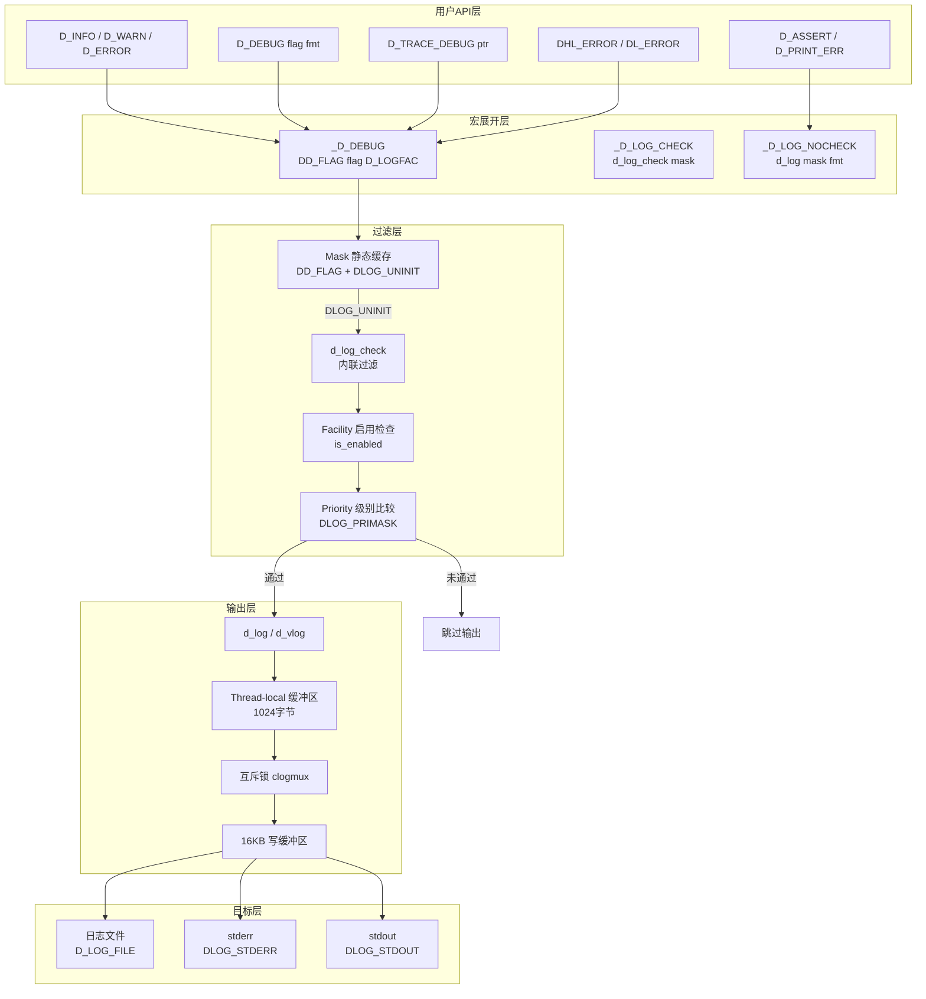
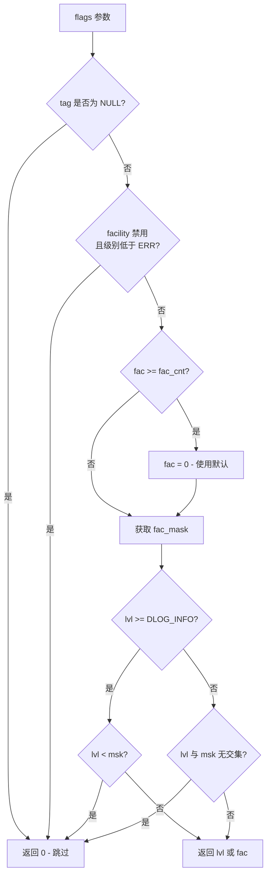
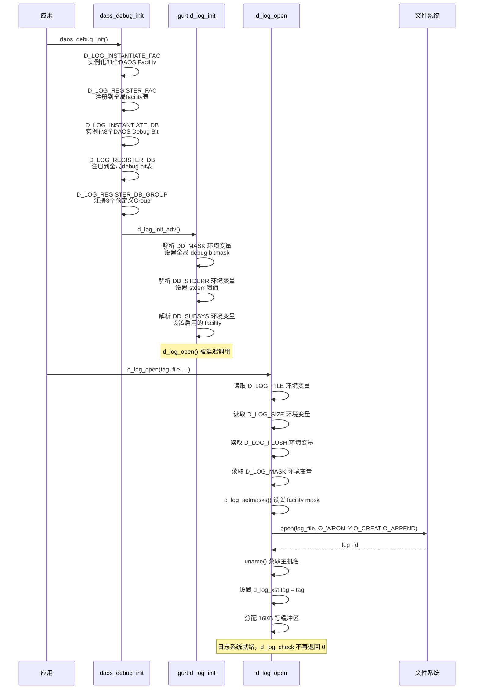
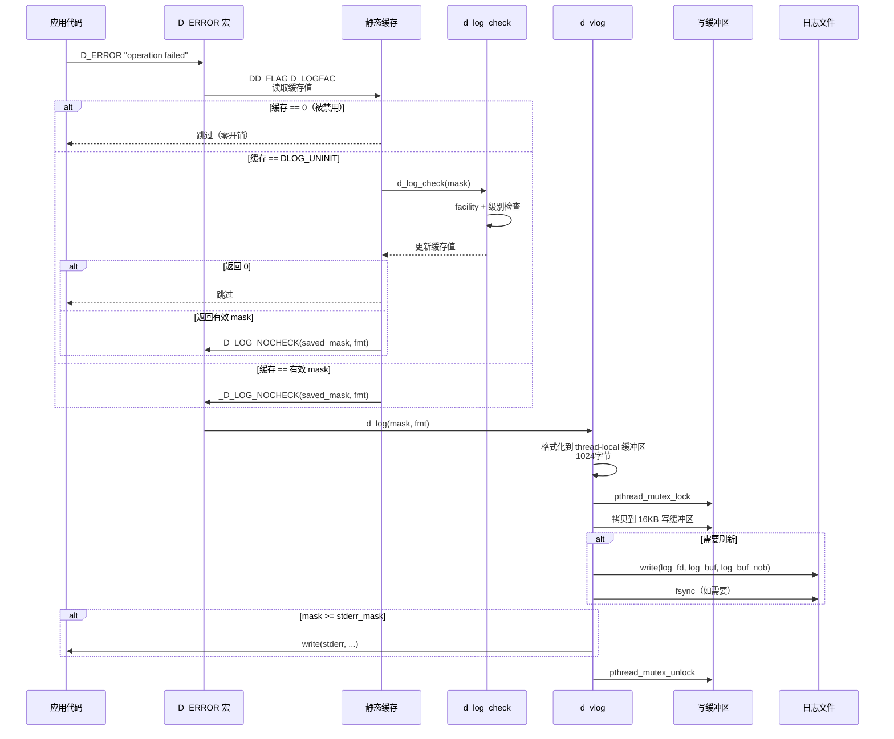

# DAOS 日志系统分析

## 目录

1. [概述](#1-概述)
2. [日志架构总览](#2-日志架构总览)
3. [优先级体系](#3-优先级体系)
4. [日志输出格式](#4-日志输出格式)
5. [日志宏API](#5-日志宏api)
6. [Facility 子系统划分](#6-facility-子系统划分)
7. [Debug Bit 与 Group](#7-debug-bit-与-group)
8. [Mask 缓存机制](#8-mask-缓存机制)
9. [`d_log_check()` 内联过滤](#9-d_log_check-内联过滤)
10. [`d_vlog()` 核心输出](#10-d_vlog-核心输出)
11. [日志初始化流程](#11-日志初始化流程)
12. [日志输出流程](#12-日志输出流程)
13. [日志轮转](#13-日志轮转)
14. [线程安全](#14-线程安全)
15. [环境变量配置](#15-环境变量配置)
16. [性能优化](#16-性能优化)
17. [对比总结](#17-对比总结)
18. [源码索引](#18-源码索引)

---

## 1. 概述

DAOS 日志系统基于 gurt（Go Utility Runtime）中的 **clog**（Compact Log）库构建，提供轻量级、高性能的运行时日志输出。核心设计特点：

| 特性 | 实现方式 |
|---|---|
| 优先级控制 | 位掩码编码，9 级优先级 |
| 子系统过滤 | 31 个 DAOS Facility + 11 个 CaRT Facility + 5 个 GURT Facility |
| Debug 分类 | 8 个基础 Debug Bit + 自定义 Group |
| 性能优化 | Thread-local 缓冲区 + Mask 静态缓存 + 禁用级别快速路径 |
| 输出目标 | 文件 + stderr + stdout |
| 日志轮转 | 基于文件大小（默认 2GB） |

---

## 2. 日志架构总览



---

## 3. 优先级体系

### 3.1 优先级位掩码编码

```c
// src/include/gurt/dlog.h:49-59
#define DLOG_PRIMASK    0x0fffff00   // 优先级掩码

#define DLOG_PRISHIFT   24           // 非Debug级别位移
#define DLOG_DPRISHIFT  8            // Debug级别位移
#define DLOG_PRINDMASK  0x0f000000   // 非Debug级别位掩码
#define DLOG_FACMASK    0x000000ff   // Facility掩码（低8位）
#define DLOG_UNINIT     0x80000000   // 缓存未初始化标记
```

**编码方式**：

```
32-bit mask: [UNINIT(1)] [STDOUT(1)] [STDERR(1)] [EMIT(1)] [Pri(4)] [Debug Bits(16)] [Facility(8)]
                                                                 ^24-27            ^8-23              ^0-7
```

### 3.2 优先级定义

```c
// src/include/gurt/dlog.h:49-59
enum {
    DLOG_EMIT  = 0x08000000,  // 发出（最低）
    DLOG_EMERG = 0x07000000,  // 紧急
    DLOG_ALERT = 0x06000000,  // 警报
    DLOG_CRIT  = 0x05000000,  // 严重
    DLOG_ERR   = 0x04000000,  // 错误
    DLOG_WARN  = 0x03000000,  // 警告
    DLOG_NOTE  = 0x02000000,  // 通知
    DLOG_INFO  = 0x01000000,  // 信息
    DLOG_DBG   = 0x00ffff00,  // 调试（全部Debug Bit）
};
```

| 优先级 | 宏 | 掩码值 | 说明 |
|--------|-----|--------|------|
| EMERG | `D_FATAL` | 0x07000000 | 致命错误，程序终止 |
| ALERT | `D_ALERT` | 0x06000000 | 警报 |
| CRIT | `D_CRIT` | 0x05000000 | 严重错误 |
| ERR | `D_ERROR` | 0x04000000 | 错误 |
| WARN | `D_WARN` | 0x03000000 | 警告 |
| NOTE | `D_NOTE` | 0x02000000 | 通知 |
| INFO | `D_INFO` | 0x01000000 | 信息 |
| DBG | `D_DEBUG` | 0x00ffff00 | 调试（按Debug Bit过滤） |
| EMIT | `D_EMIT` | 0x08000000 | 发出（始终输出） |

**注意**：数字越大优先级越低。`DLOG_ERR > DLOG_WARN > DLOG_INFO`。

### 3.3 每条消息的强制输出标志

```c
#define DLOG_STDERR  0x20000000   // 强制输出到 stderr
#define DLOG_STDOUT  0x10000000   // 强制输出到 stdout
```

---

## 4. 日志输出格式

### 4.1 标准格式

```
YYYY/MM/DD HH:MM:SS.microsec hostname TAG[pid/tid/uid] FAC PRIO file:line func() message\n
```

示例：
```
2026/04/10 14:30:15.123456 node01 DAOS[12345/67/8] vos ERR /home/src/vos_io.c:2729 vos_update_begin() failed to reserve space
```

| 字段 | 来源 | 说明 |
|------|------|------|
| `YYYY/MM/DD HH:MM:SS.microsec` | `gettimeofday()` | 微秒精度时间戳 |
| `hostname` | `uname(2)` | 节点主机名 |
| `TAG` | `d_log_xst.tag` | 用户自定义标签 |
| `pid` | `getpid()` | 进程ID |
| `tid` | `gettid()` | 线程ID |
| `uid` | `log_id_cb()` | ULT ID（用户态线程） |
| `FAC` | `dlog_fac.fac_aname` | Facility 缩写 |
| `PRIO` | 优先级枚举 | EMERG/ALERT/CRIT/ERR/WARN/NOTE/INFO/DBG |
| `file:line` | `__FILE__:__LINE__` | 源码位置 |
| `func()` | `__func__` | 函数名 |

### 4.2 TTY 模式简化格式

当 stderr/stdout 是终端时，省略第一部分头部（时间戳+主机名+TAG），仅输出：

```
FAC PRIO file:line func() message
```

### 4.3 Open Flavor 标志

```c
// src/include/gurt/dlog.h:35-43
#define DLOG_FLV_LOGPID  (1 << 0)  // 包含 PID
#define DLOG_FLV_FQDN    (1 << 1)  // 完全限定域名
#define DLOG_FLV_FAC     (1 << 2)  // Facility 名称
#define DLOG_FLV_YEAR    (1 << 3)  // 包含年份
#define DLOG_FLV_TAG     (1 << 4)  // TAG 字符串
#define DLOG_FLV_STDOUT  (1 << 5)  // 始终输出到 stdout
#define DLOG_FLV_STDERR  (1 << 6)  // 始终输出到 stderr

#define DLOG_FLV_DEFAULT (DLOG_FLV_FAC | DLOG_FLV_LOGPID | DLOG_FLV_TAG | DLOG_FLV_YEAR)
```

---

## 5. 日志宏 API

### 5.1 核心宏层次

```c
// src/include/gurt/debug.h:74-193

// 最底层：不做检查直接输出
#define _D_LOG_NOCHECK(mask, fmt, ...) \
    d_log(mask, "%s:%d %s() " fmt, __FILE__, __LINE__, __func__, ##__VA_ARGS__)

// 带指针的变体
#define _D_TRACE_NOCHECK(mask, ptr, fmt, ...) \
    d_log(mask, "%s:%d %s(%p) " fmt, __FILE__, __LINE__, __func__, ptr, ##__VA_ARGS__)

// 检查后输出（带静态缓存）
#define _D_LOG_CHECK(func, saved_mask, mask, ...)  \
    do {                                            \
        (saved_mask) = d_log_check(mask);           \
        if (saved_mask)                             \
            func(saved_mask, ##__VA_ARGS__);        \
    } while (0)

// 带缓存变量的封装
#define _D_LOG(func, mask, ...)                     \
    do {                                            \
        int __tmp_mask;                             \
        _D_LOG_CHECK(func, __tmp_mask, mask, ##__VA_ARGS__); \
    } while (0)

// 带 DLOG_UNINIT 检查的 Debug 封装
#define _D_DEBUG(func, flag, ...)                   \
    _D_DEBUG_W_SAVED_MASK(func, DD_FLAG(flag, D_LOGFAC), flag, ##__VA_ARGS__)
```

### 5.2 用户 API 宏

```c
// 优先级快捷宏
D_INFO(fmt, ...)      // 信息级别
D_NOTE(fmt, ...)      // 通知级别
D_WARN(fmt, ...)      // 警告级别
D_ERROR(fmt, ...)     // 错误级别
D_ALERT(fmt, ...)     // 警报级别
D_CRIT(fmt, ...)      // 严重级别
D_FATAL(fmt, ...)     // 致命级别
D_EMIT(fmt, ...)      // 发出级别（始终输出）

// 带Debug Bit的详细日志
D_DEBUG(flag, fmt, ...)

// 带指针追踪的变体
D_TRACE_INFO(ptr, fmt, ...)
D_TRACE_WARN(ptr, fmt, ...)
D_TRACE_ERROR(ptr, fmt, ...)

// 检查是否启用
D_LOG_ENABLED(flag)   // 返回 bool
```

### 5.3 错误码辅助宏

```c
// src/include/gurt/debug.h:218-247

// DAOS 错误码（自动格式化为 "error_name(code): 'description'"）
DL_INFO(_rc, _fmt, ...)     // 仅错误码
DL_WARN(_rc, _fmt, ...)
DL_ERROR(_rc, _fmt, ...)

// 描述符 + DAOS 错误码
DHL_INFO(_desc, _rc, _fmt, ...)
DHL_WARN(_desc, _rc, _fmt, ...)
DHL_ERROR(_desc, _rc, _fmt, ...)

// POSIX errno（自动格式化为 "errno(strerror)"）
DS_INFO(_rc, _fmt, ...)
DS_WARN(_rc, _fmt, ...)
DS_ERROR(_rc, _fmt, ...)

// 描述符 + POSIX errno
DHS_INFO(_desc, _rc, _fmt, ...)
DHS_WARN(_desc, _rc, _fmt, ...)
DHS_ERROR(_desc, _rc, _fmt, ...)
```

### 5.4 断言宏

```c
// src/include/gurt/debug.h:344-378
D_ASSERT(e)                   // 断言，失败时 D_FATAL + d_log_sync() + abort()
D_ASSERTF(cond, fmt, ...)     // 带格式化消息的断言
D_CASSERT(cond, ...)          // 编译期静态断言
```

### 5.5 Pre-clog 输出

```c
// 日志系统初始化前的输出（直接 fprintf）
D_PRINT_ERR(fmt, ...)         // 直接输出到 stderr + fflush
D_PRINT(fmt, ...)             // 直接输出到 stdout + fflush
```

---

## 6. Facility 子系统划分

### 6.1 DAOS Facilities（31 个）

```c
// src/include/daos/debug.h:27-59
DAOS_FOREACH_LOG_FAC(ACTION, arg):
    daos        // DAOS 核心
    array       // 数组操作
    kv          // KV 存储
    common      // 通用
    tree        // B+树
    vos         // VOS 对象存储
    pmdk        // PMDK 集成
    dlck        // 分布式锁
    client      // 客户端
    server      // 服务端
    rdb         // 远程数据库
    rsvc        // 远程服务
    pool        // Pool 管理
    container   // Container 管理
    object      // 对象操作
    placement   // 数据放置
    rebuild     // 重建
    mgmt        // 管理
    bio         // Blob I/O
    tests       // 测试
    dfs         // DFS 文件系统
    duns        // 统一命名空间
    drpc        // 远程过程调用
    security    // 安全
    dtx         // 分布式事务
    chk         // 检查
    dfuse       // FUSE 挂载
    il          // 中间层
    csum        // 校验和
    pipeline    // 流水线
    stack       // 调用栈
    ddb         // 调试数据库
```

### 6.2 CaRT Facilities（11 个）

```c
// src/cart/crt_debug.h:23-34
CRT_FOREACH_LOG_FAC(ACTION, arg):
    crt         // CaRT 核心
    rpc         // RPC 通信
    bulk        // Bulk 传输
    corpc       // 协程 RPC
    grp         // 组管理
    lm          // 活性图
    hg          // Mercury
    external    // 外部
    st          // 自测
    iv          // IV 模块
    ctl         // 控制面
```

### 6.3 GURT Facilities（5 个）

```c
// src/include/gurt/debug.h:28-33
D_FOREACH_GURT_FAC(ACTION, arg):
    misc        // 杂项
    mem         // 内存
    swim        // SWIM 协议
    fi          // 故障注入
    telem       // 遥测
```

### 6.4 Facility 数据结构

```c
// src/include/gurt/dlog.h:101-106
struct dlog_fac {
    char    *fac_aname;   // 缩写名称（如 "vos"）
    char    *fac_lname;   // 长名称（如 "Versioned Object Store"）
    int      fac_mask;    // 该 facility 的日志级别掩码
    bool     is_enabled;  // 是否启用
};
```

### 6.5 Facility 注册宏

```c
// 声明
D_LOG_DECLARE_FAC(name)

// 实例化（每个 .c 文件）
D_LOG_INSTANTIATE_FAC(name)

// 注册到 clog
D_LOG_REGISTER_FAC(name)
```

---

## 7. Debug Bit 与 Group

### 7.1 GURT Debug Bit（8 个）

```c
// src/include/gurt/debug_setup.h:44-58
DB_ALL       // 全部 Debug Bit
DB_ANY       // 未分类流
DB_TRACE     // 极度详细追踪
DB_MEM       // 内存操作
DB_NET       // 网络操作
DB_IO        // I/O 操作
DB_TEST      // 测试流
```

### 7.2 DAOS Debug Bit（8 个）

```c
// src/include/daos/debug.h:61-77
DB_MD       // 元数据操作
DB_PL       // 数据放置
DB_MGMT     // 管理操作
DB_EPC      // Epoch 操作
DB_DF       // 持久格式操作
DB_REBUILD  // 重建操作
DB_SEC      // 安全检查
DB_CSUM     // 校验和
```

### 7.3 Debug Group（预定义组合）

```c
// src/common/debug.c:29-36
DB_GRP1 = DB_IO | DB_MD | DB_PL | DB_REBUILD | DB_SEC | DB_CSUM  // "group_default"
DB_GRP_MD = DB_GRP1 | DB_MGT                                       // "group_metadata"
DB_GRP_MD_ONLY = DB_MD | DB_MGT                                   // "group_metadata_only"
```

### 7.4 Debug Bit 数据结构

```c
// src/include/gurt/dlog.h:117-162
struct d_debug_data {
    d_dbug_t    dd_mask;       // 当前 debug bitmask
    d_dbug_t    dd_prio_err;   // stderr 输出的优先级阈值
    int         dbg_bit_cnt;   // 已分配的 debug bit 数
    int         dbg_grp_cnt;   // 已分配的 debug group 数
};

struct d_debug_bit {
    d_dbug_t    *db_bit;       // 指向 mask 中的位
    char        *db_name;      // 短名（如 "io"）
    char        *db_lname;     // 长名（如 "I/O operations"）
};

struct d_debug_grp {
    char        *dg_name;      // 组名（如 "group_default"）
    d_dbug_t     dg_mask;      // 组合掩码
};
```

---

## 8. Mask 缓存机制

### 8.1 缓存原理

每个 Facility 在每个编译单元维护一个**静态 int 缓存数组**，存储每个 Debug Bit 对应的 Mask 值。首次访问时缓存为 `DLOG_UNINIT`，需要通过 `d_log_check()` 解析；后续直接使用缓存值，避免重复查找。

### 8.2 缓存宏展开

```c
// src/include/gurt/debug_setup.h:61-69
// DD_FLAG(DB_IO, D_LOGFAC)
//   → daos_daos_logfac_cache[DD_FLAG_DB_IO_daos_daos_logfac - 1]

#define DD_CONCAT_CACHE(x, y)     x##_cache
#define DD_CONCAT_FLAG(x, y)      DD_FLAG_##x##_##y
#define DD_FLAG_NAME(mask, fac)   DD_CONCAT(mask, fac, DD_CONCAT_FLAG)
#define DD_CACHE(fac)             DD_CONCAT(fac, D_NOOP, DD_CONCAT_CACHE)
#define DD_FLAG(mask, fac)        DD_CACHE(fac)[DD_FLAG_NAME(mask, fac) - 1]
```

### 8.3 缓存检查流程

```c
// src/include/gurt/debug.h:82-91
#define _D_DEBUG_W_SAVED_MASK(func, saved_mask, level, ...)  \
    do {                                                      \
        if (__builtin_expect(saved_mask, 0)) {                \
            if ((saved_mask) == (int)DLOG_UNINIT) {           \
                // 缓存未初始化 → 重新解析                     \
                _D_LOG_CHECK(func, saved_mask,                \
                             (level) | D_LOGFAC, ##__VA_ARGS__);\
                break;                                         \
            }                                                  \
            // 缓存有效 → 直接使用                             \
            func(saved_mask, ##__VA_ARGS__);                   \
        }                                                      \
    } while (0)
```

**性能关键**：`__builtin_expect(saved_mask, 0)` 告诉编译器缓存值通常为 0（日志被禁用），CPU 分支预测将跳过整个日志输出代码。

---

## 9. `d_log_check()` 内联过滤

```c
// src/include/gurt/dlog.h:221-267
static inline int d_log_check(int flags)
{
    int fac = flags & DLOG_FACMASK;   // 低8位: facility ID
    int lvl = flags & DLOG_PRIMASK;   // 中间位: 优先级
    int msk;

    // 1. 日志系统未打开 → 跳过
    if (!d_log_xst.tag)
        return 0;

    // 2. Facility 禁用 且 级别低于 ERR → 跳过
    //    （ERR 及以上总是记录，除非用户设置更高阈值）
    if (!d_log_xst.dlog_facs[fac].is_enabled && lvl < DLOG_ERR)
        return 0;

    // 3. 防止越界
    if (fac >= d_log_xst.fac_cnt)
        fac = 0;

    msk = d_log_xst.dlog_facs[fac].fac_mask;

    if (lvl >= DLOG_INFO) {
        // 4a. 非Debug消息: 级别数值比较
        if (lvl < msk)
            return 0;   // 消息级别低于facility阈值 → 跳过
    } else {
        // 4b. Debug消息: 位掩码匹配
        if ((lvl & msk) == 0)
            return 0;   // 无匹配的debug bit → 跳过
    }

    return lvl | fac;  // 返回有效mask
}
```



---

## 10. `d_vlog()` 核心输出

### 10.1 函数签名

```c
// src/gurt/dlog.c
void d_vlog(const char *file, int line, const char *func, int mask, const char *fmt, va_list ap);
```

### 10.2 实现要点

```c
// src/gurt/dlog.c:568-750
void d_vlog(...) {
    static __thread char b[DLOG_TBSIZ];  // 线程局部缓冲区 1024字节
    static __thread int cached_pid;       // 线程局部PID缓存
    static __thread int cached_tid;       // 线程局部TID缓存

    // 1. 格式化日志行（时间戳 + 主机名 + TAG + PID/TID + Facility + 级别）
    // 2. 追加源码位置（file:line func()）
    // 3. 追加用户消息（vsprintf）

    // 4. 写入日志文件（通过 clogmux 互斥锁）
    pthread_mutex_lock(&clogmux);

    // 5. 写入 16KB 缓冲区
    memcpy(log_buf + log_buf_nob, b, len);
    log_buf_nob += len;

    // 6. 刷新条件:
    //    a. 缓冲区满（接近 16KB）
    //    b. 消息级别 >= flush_pri（默认 WARN）
    //    c. 距上次刷新超过 1 秒
    if (需要刷新)
        flush_to_file();

    // 7. 同时输出到 stderr（如果级别足够）
    if (mask >= stderr_mask)
        write_to_stderr();

    pthread_mutex_unlock(&clogmux);
}
```

---

## 11. 日志初始化流程



### 11.1 初始化时序

1. `daos_debug_init()` 注册所有 DAOS Facility 和 Debug Bit
2. `d_log_init_adv()` 解析环境变量，设置全局 Debug Mask
3. `d_log_open()` 打开日志文件，设置 TAG，分配缓冲区
4. 此后 `d_log_check()` 的 `d_log_xst.tag` 非空，开始输出日志

### 11.2 关键结构

```c
// 全局状态
struct d_log_xstate d_log_xst = {
    .tag = NULL,         // NULL 表示未初始化
    .dlog_facs = NULL,
    .fac_cnt = 0,
};

// 内部状态（clog）
static struct d_log_state {
    char     *log_file;        // 日志文件路径
    char     *log_buf;         // 16KB 写缓冲区
    off_t     log_buf_nob;     // 缓冲区已用字节数
    int       log_fd;          // 日志文件 fd
    uint64_t  log_size;        // 当前文件大小
    uint64_t  log_size_max;    // 最大文件大小（默认2GB）
    int       def_mask;        // 默认 facility mask
    int       stderr_mask;     // stderr 阈值
    int       flush_pri;       // 立即刷新优先级（默认 WARN）
};
```

---

## 12. 日志输出流程



---

## 13. 日志轮转

### 13.1 轮转机制

```c
// src/gurt/dlog.c
void log_rotate() {
    // 1. 关闭当前日志文件
    close(log_fd);

    // 2. 将当前文件重命名为 .old
    rename(log_file, log_old);

    // 3. 打开新日志文件
    log_fd = open(log_file, O_WRONLY|O_CREAT|O_TRUNC);

    // 4. 重置文件大小计数
    log_size = 0;

    // 5. 刷新缓冲区
    flush_buffer();
}
```

### 13.2 轮转触发

| 条件 | 默认值 |
|---|---|
| `D_LOG_SIZE` | 2GB（最小 1MB） |
| 检查时机 | 每次刷新缓冲区时 |

轮转仅保留一个 `.old` 备份文件，即最多两份日志（当前 + 前一份）。

---

## 14. 线程安全

### 14.1 互斥锁

```c
static pthread_mutex_t clogmux = PTHREAD_MUTEX_INITIALIZER;
```

`clogmux` 保护：
- 写缓冲区（`log_buf` / `log_buf_nob`）
- 日志文件写入
- stderr/stdout 写入
- 日志轮转

### 14.2 Thread-local 优化

```c
static __thread char b[DLOG_TBSIZ];    // 每线程独立格式化缓冲区
static __thread int cached_pid;        // PID缓存（避免每次 getpid）
static __thread int cached_tid;        // TID缓存（避免每次 gettid）
```

格式化在 thread-local 缓冲区中完成（无锁），仅最终写入共享缓冲区时加锁。

### 14.3 Mask 缓存无锁读取

```c
static int daos_daos_logfac_cache[] = { DLOG_UNINIT, DLOG_UNINIT, ... };
```

缓存数组是 `static const`（初始化后不再修改），无锁读取安全。`DLOG_UNINIT` 触发一次性 `d_log_check()` 更新。

---

## 15. 环境变量配置

### 15.1 日志文件控制

| 环境变量 | 说明 | 默认值 |
|---|---|---|
| `D_LOG_FILE` | 日志文件路径 | stderr |
| `D_LOG_SIZE` | 最大文件大小 | 2GB |
| `D_LOG_FILE_APPEND_PID` | 文件名追加 PID | 无 |
| `D_LOG_FILE_APPEND_RANK` | 文件名追加 MPI rank | 无 |
| `D_LOG_TRUNCATE` | 启动时截断日志文件 | 否 |
| `D_LOG_FLUSH` | 立即刷新优先级 | WARN |
| `D_LOG_STDERR_IN_LOG` | 将 stderr 输出也写入日志文件 | 否 |
| `D_LOG_MASK` | 全局日志级别掩码 | - |

### 15.2 Debug Bit 控制

| 环境变量 | 说明 | 默认值 |
|---|---|---|
| `DD_MASK` | 启用的 Debug Bit 列表 | "all" |
| `DD_SUBSYS` | 启用的 Facility 列表 | "all" |
| `DD_STDERR` | stderr 输出优先级阈值 | ERR |

### 15.3 配置示例

```bash
# 启用所有 debug bit，输出到文件，10MB 轮转
export DD_MASK="all"
export DD_SUBSYS="vos,bio,dtx"
export D_LOG_FILE="/var/log/daos/server.log"
export D_LOG_SIZE="10M"
export DD_STDERR="warn"

# 仅启用 IO 和 metadata debug，错误及以上到 stderr
export DD_MASK="io,md"
export DD_STDERR="err"

# 启用 debug group
export DD_MASK="group_default"
```

---

## 16. 性能优化

### 16.1 四级过滤漏斗

```
Level 1: __builtin_expect(saved_mask, 0)  — 分支预测，通常跳过
Level 2: d_log_check()                    — Facility + 级别过滤
Level 3: vsprintf 格式化                  — 仅在过滤通过后执行
Level 4: pthread_mutex_lock               — 仅在实际写入时加锁
```

### 16.2 禁用日志的零开销

当某个 Facility+Debug Bit 组合被禁用时：

1. `DD_FLAG()` 返回缓存的 `0`
2. `__builtin_expect(0, 0)` → CPU 分支预测跳过
3. 不调用 `d_log_check()`，不格式化，不加锁
4. **接近零开销**（仅一次内存读取 + 一次分支判断）

### 16.3 缓冲写入

- **格式化缓冲区**：Thread-local 1024 字节（无锁）
- **写缓冲区**：全局 16KB（锁保护，批量写入文件）
- **刷新策略**：WARN 及以上立即刷新，或 1 秒超时刷新

### 16.4 PID/TID 缓存

```c
static __thread int cached_pid;
static __thread int cached_tid;
```

避免每次日志输出都调用 `getpid()` / `gettid()` 系统调用。

---

## 17. 对比总结

### 17.1 日志级别对比

| DAOS | syslog | Python | 说明 |
|---|---|---|---|
| DLOG_EMERG | LOG_EMERG | CRITICAL | 致命 |
| DLOG_ALERT | LOG_ALERT | CRITICAL | 警报 |
| DLOG_CRIT | LOG_CRIT | CRITICAL | 严重 |
| DLOG_ERR | LOG_ERR | ERROR | 错误 |
| DLOG_WARN | LOG_WARNING | WARNING | 警告 |
| DLOG_NOTE | LOG_NOTICE | INFO | 通知 |
| DLOG_INFO | LOG_INFO | INFO | 信息 |
| DLOG_DBG | LOG_DEBUG | DEBUG | 调试 |

### 17.2 与其他系统对比

| 特性 | DAOS clog | Ceph dout | RocksDB |
|---|---|---|---|
| 子系统过滤 | 47 个 Facility | 50+ Subsystem | 无（全局级别） |
| Debug 分类 | 16 个 Debug Bit + Group | 20+ Debug Flag | 无 |
| 过滤机制 | 位掩码 + 静态缓存 | 位掩码 + Mutex | 条件变量 |
| 缓冲写入 | 16KB 全局缓冲 | 无缓冲（直接 fprintf） | Log 文件缓冲 |
| 线程安全 | 全局 Mutex | 全局 Mutex | 无锁写入 |
| 日志轮转 | 基于大小（.old） | 无内置轮转 | 基于大小（.old） |
| 环境变量 | DD_MASK/DD_SUBSYS | GLOG_v/DOUT_SUBSYST | RocksDB_LOG_LEVEL |
| 性能优化 | Thread-local + 分支预测 | 条件检查 | 无 |

---

## 18. 源码索引

### 核心头文件

| 文件 | 内容 |
|---|---|
| `src/include/gurt/dlog.h` | clog 核心：优先级掩码、Facility 结构、`d_log_check()` 内联、`d_log()` API |
| `src/include/gurt/debug.h` | 用户宏：`D_INFO`/`D_ERROR`/`D_DEBUG`/`D_ASSERT`、GURT Facility/Debug Bit |
| `src/include/gurt/debug_setup.h` | 缓存系统：`DD_FLAG`/`DD_CACHE`、Facility/Debug Bit 注册宏 |
| `src/include/daos/debug.h` | DAOS Facility（31个）、DAOS Debug Bit（8个）、`daos_debug_init()` |
| `src/cart/crt_debug.h` | CaRT Facility（11个）、独立 `D_LOGFAC` |

### 实现文件

| 文件 | 内容 |
|---|---|
| `src/gurt/dlog.c` | `d_log_open()`、`d_vlog()`、`d_log_setmasks()`、`d_log_write()`、`log_rotate()`、`d_log_sync()`、`d_log_allocfacility()` |
| `src/gurt/debug.c` | `d_log_init_adv()`、`d_log_init()`、`d_log_fini()`、`d_log_sync_mask()`、`d_log_dbg_bit_alloc()`、`d_log_dbg_grp_alloc()` |
| `src/common/debug.c` | `daos_debug_init()`、`daos_debug_init_ex()`、DAOS Facility/Debug Bit 实例化、Debug Group 注册 |

### 辅助文件

| 文件 | 内容 |
|---|---|
| `src/include/daos_errno.h` | `DF_RC`/`DP_RC` 错误格式化宏 |
| `src/include/gurt/common.h` | 包含 `debug.h`，通用工具函数 |
