# DAOS 落盘 I/O 机制分析

## 目录

1. [概述](#1-概述)
2. [I/O 架构总览](#2-io-架构总览)
3. [Bio（Blob I/O）抽象层](#3-bioblob-io抽象层)
4. [SCM I/O 路径（PMDK）](#4-scm-io-路径pmdk)
5. [NVMe I/O 路径（SPDK）](#5-nvme-io-路径spdk)
6. [VEA 空间分配器](#6-vea-空间分配器)
7. [写 I/O 完整流程](#7-写-io-完整流程)
8. [读 I/O 完整流程](#8-读-io-完整流程)
9. [DMA 缓冲区管理](#9-dma-缓冲区管理)
10. [I/O 流控与调度](#10-io-流控与调度)
11. [WAL 机制（MD-on-SSD）](#11-wal-机制md-on-ssd)
12. [数据分类存储策略](#12-数据分类存储策略)
13. [Gang 地址（分散存储）](#13-gang-地址分散存储)
14. [I/O 错误处理与健康监控](#14-io-错误处理与健康监控)
15. [参数配置](#15-参数配置)
16. [对比总结](#16-对比总结)
17. [源码索引](#17-源码索引)

---

## 1. 概述

DAOS 采用**双介质存储架构**，将数据分为 SCM（Storage Class Memory，存储级内存）和 NVMe SSD 两类介质，通过统一的 Bio（Blob I/O）抽象层和不同的 I/O 引擎实现高效落盘：

| 介质 | 引擎 | 特点 | 用途 |
|---|---|---|---|
| SCM | PMDK（libpmemobj） | 字节寻址、内存映射、~100ns延迟 | 元数据 + 小值数据 |
| NVMe | SPDK（用户态驱动） | 块寻址、轮询模式、~10μs延迟 | 大块数据 + WAL（MD-on-SSD） |

核心设计原则：

- **SCM 走内存语义**：直接 load/store，通过 PMDK 事务保证持久性
- **NVMe 走 DMA 语义**：用户态 SPDK 驱动绕过内核，DMA Buffer 做中转
- **Bio 统一抽象**：对上层屏蔽 SCM/NVMe 差异，统一 bio_addr_t 寻址
- **VEA 细粒度管理**：在 SPDK blob 之上实现 4KB 粒度的块分配

---

## 2. I/O 架构总览

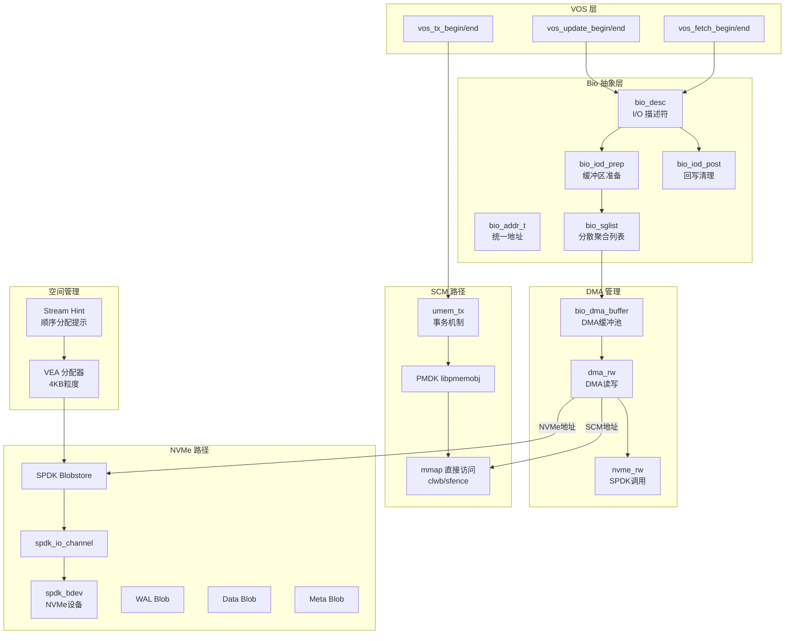

---

## 3. Bio（Blob I/O）抽象层

### 3.1 统一地址 `bio_addr_t`

Bio 层最核心的设计是统一地址，将 SCM 和 NVMe 的地址编码到同一结构中：

```c
// src/include/daos_srv/bio.h
struct bio_addr_t {
    // 编码方式：高bit标识介质类型，低bit存储偏移
    // DAOS_MEDIA_SCM → SCM 持久内存偏移
    // DAOS_MEDIA_NVME → NVMe 块偏移
};
```

`bio_addr_set(&addr, media_type, offset)` 设置地址，`bio_addr_media(addr)` 获取介质类型，`bio_addr_offset(addr)` 获取偏移量。

### 3.2 I/O 描述符 `bio_desc`

```c
// src/bio/bio_internal.h:500-535
struct bio_desc {
    struct bio_io_lug     bd_io_lug;        // 在途I/O追踪
    struct bio_io_context *bd_ctxt;          // VOS I/O上下文
    struct bio_rsrvd_dma  bd_rsrvd;          // 已预留的DMA区域
    ABT_eventual          bd_dma_done;        // 完成信号
    unsigned int          bd_inflights;       // 在途SPDK DMA传输数
    int                   bd_result;          // I/O结果
    unsigned int          bd_type;            // UPDATE / FETCH / GETBUF
    unsigned int          bd_nvme_bytes;      // NVMe总字节数
    unsigned int          bd_buffer_prep:1;   // 缓冲区已准备
    unsigned int          bd_dma_issued:1;    // DMA已发起
    unsigned int          bd_async_post:1;    // 异步回写（WAL+Data）
    unsigned int          bd_non_blocking:1;  // 非阻塞模式
    void (*bd_completion)(void *, int);       // 自定义完成回调
    struct bio_sglist     bd_sgls[0];         // SGL数组（柔性）
};
```

### 3.3 分散聚合列表 `bio_sglist` 和 `bio_iov`

```c
struct bio_sglist {
    // 每个SGL包含多个bio_iov
    // bio_iov描述一个连续的I/O段：
    //   - SCM: umem_off_t（PMDK池内偏移）
    //   - NVMe: block offset（VEA分配的块偏移）
};

struct bio_iov {
    union {
        umem_off_t  bi_umoff;  // SCM偏移
        uint64_t    bi_off;    // NVMe块偏移
    };
    uint32_t bi_size;  // 大小
    uint8_t  bi_media; // 介质类型 (DAOS_MEDIA_SCM / DAOS_MEDIA_NVME)
};
```

### 3.4 Bio 核心 API

| 函数 | 说明 |
|---|---|
| `bio_iod_alloc(ctxt, sgl_cnt, type)` | 分配I/O描述符 |
| `bio_iod_prep(biod, chk_type, bulk_ctxt, bulk_perm)` | 准备缓冲区（FETCH时立即发起读） |
| `bio_iod_post(biod, err)` | 回写+清理（UPDATE时发起写） |
| `bio_iod_copy(biod, sgl_idx, dst, dst_len)` | 从DMA缓冲区拷贝到用户SGL |
| `bio_iod_try_prep(biod)` | 非阻塞版prep（检查点优先） |
| `bio_iod_post_async(biod, err)` | 异步回写（WAL+小数据） |

### 3.5 Prep/Post 模型

Bio 采用**准备-回写**两阶段模型：

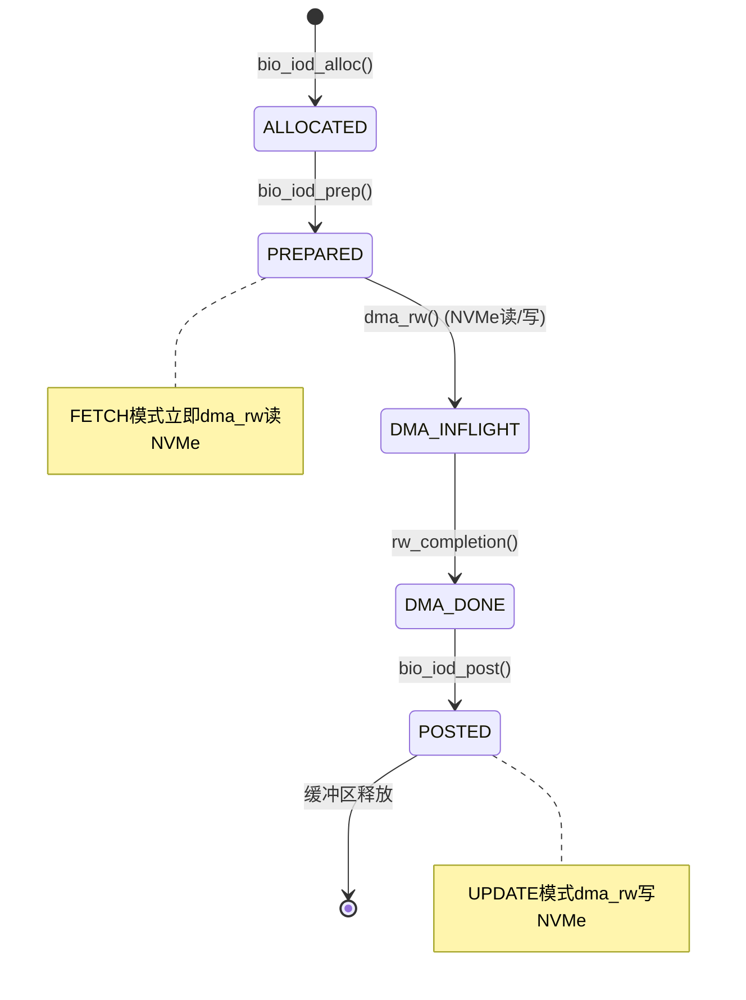

---

## 4. SCM I/O 路径（PMDK）

### 4.1 umem 统一内存抽象

DAOS 将 PMDK 封装为 umem（Unified Memory）接口，支持多种后端：

| 后端 | 说明 |
|---|---|
| PMEM (DAOS_MD_PMEM) | 真实持久内存，`libpmemobj` |
| BMEM | 自定义后端 |
| BMEM_V2 | NVMe 作为元数据设备（WAL模式） |
| VMEM | 易失性内存（测试用） |

核心 API：

```c
umem_tx_begin(umm, txd)    → pmemobj_tx_begin()
umem_tx_end(umm)           → pmemobj_tx_commit() + pmemobj_tx_end()
umem_tx_abort(umm, err)    → pmemobj_tx_abort() + pmemobj_tx_end()
umem_zalloc(umm, size)     → pmemobj_zalloc()
umem_reserve(umm, rsrvd)   → pmemobj_reserve()
umem_tx_publish()          → pmemobj_tx_publish()  // 批量发布预留
umem_cancel()              → pmemobj_cancel()      // 取消预留
umem_off2ptr(umm, off)     → 直接指针转换（mmap）
```

### 4.2 PMDK 事务持久性保证

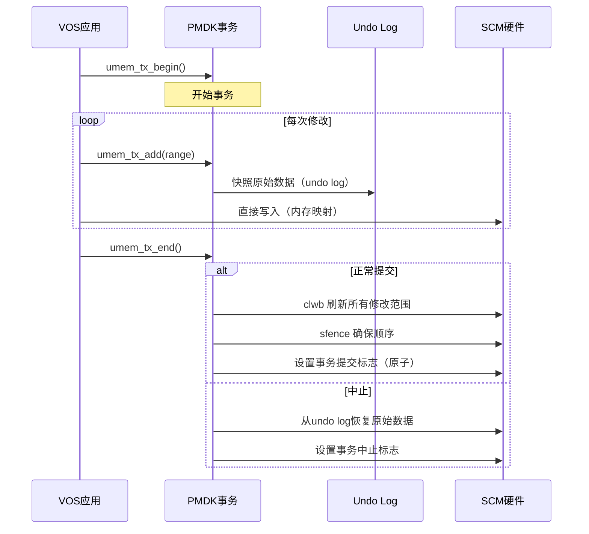

**关键实现**：
- `pmemobj_tx_commit()` 内部调用 `pmemobj_persist()` 刷新所有已注册的修改范围
- x86 平台使用 `clwb`（Cache Line Write Back）+ `sfence`（Store Fence）指令
- 事务提交标志使用原子存储，保证崩溃后要么看到提交要么看到回滚

### 4.3 SCM Slab 分配器

PMDK 后端使用 16 个 slab 类：

```
32, 64, 96, 128, 160, 192, 224, 256, 288, 352, 384, 416, 512, 576, 672, 768 bytes
```

- 所有大小 32 字节对齐
- `get_slab()` 根据对齐后的大小选择 slab 类
- 每个 slab 使用 `POBJ_HEADER_NONE`，1000 个单元/块

### 4.4 SCM 上的数据存储

Single Value 在 SCM 上的三种存储方式：

| 类型 | 条件 | 存储 |
|---|---|---|
| Inline（内联） | 数据 ≤ data_thresh 且无 gang | `vos_irec_df` 头部 + payload 连续存储在 SCM |
| External（外部） | 数据 > data_thresh | 头部在 SCM，payload 在 NVMe（通过 `ir_ex_addr` 引用） |
| Gang（分散） | 数据 > 8MB（gang_nr > 0） | 头部在 SCM，payload 分散在多个 SCM/NVMe 段 |

```c
// src/vos/vos_layout.h:383
struct vos_irec_df {
    uint16_t ir_cs_size;    // checksum 大小
    uint8_t  ir_cs_type;    // checksum 类型
    uint8_t  ir_pad8;
    uint32_t ir_ver;        // pool map 版本
    uint32_t ir_dtx;        // DTX 引用
    uint16_t ir_minor_epc;  // 次级 epoch
    uint16_t ir_pad16;
    uint64_t ir_size;       // 数据长度
    uint64_t ir_gsize;      // 全局长度（EC对象）
    struct bio_addr_t ir_ex_addr; // 外部payload地址
    uint8_t ir_body[];      // 柔性数组: checksum + 内联数据
};
```

### 4.5 Btree 节点 I/O

- **分配**：`btr_node_alloc()` → `umem_zalloc()`，零初始化 SCM 内存
- **修改前保护**：`btr_node_tx_add()` → `umem_tx_add()` 注册 undo log
- **读取**：直接指针解引用（`umem_off2ptr()`），无需事务，mmap 直接访问

---

## 5. NVMe I/O 路径（SPDK）

### 5.1 SPDK 集成架构

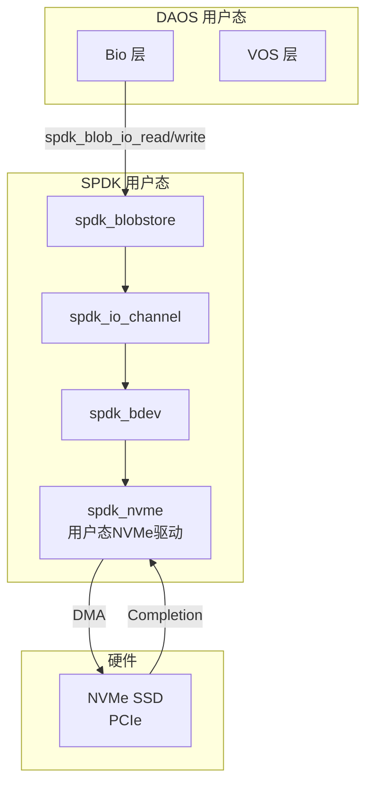

**特点**：
- 完全用户态，绕过内核
- 轮询模式（Poll Mode），无中断开销
- 每个 xstream（target）拥有独立的 `spdk_thread` 和 `spdk_io_channel`
- DMA Buffer 通过 `spdk_dma_malloc_socket()` 分配，确保物理连续、IOMMU 映射

### 5.2 设备管理

```c
// src/bio/bio_internal.h:308-337
struct bio_bdev {
    uuid_t             bb_uuid;
    char              *bb_name;
    struct spdk_bdev_desc *bb_desc;      // 防止bdev被释放
    struct bio_blobstore *bb_blobstore;
    int                bb_tgt_cnt;
    unsigned int       bb_removed, bb_faulty, bb_unmap_supported;
    unsigned int       bb_roles;         // data / meta / wal
};
```

### 5.3 Blobstore 结构

每个 NVMe 设备被组织为一个 SPDK Blobstore，内含多个 Blob：

| Blob | 用途 | 说明 |
|---|---|---|
| Data Blob | 用户数据 | 大块数据存储 |
| Meta Blob | 元数据（MD-on-SSD） | SCM 元数据的 NVMe 备份 |
| WAL Blob | Write-Ahead Log | 事务日志 |

默认 Cluster Size = 128MB（`DAOS_DEFAULT_CLUSTER_MB`）。

### 5.4 Per-Xstream 上下文

```c
// src/bio/bio_internal.h:382-405
struct bio_xs_context {
    int                  bxc_tgt_id;
    struct spdk_thread  *bxc_thread;        // 每xstream一个SPDK线程
    struct bio_xs_blobstore *bxc_xs_blobstores[SMD_DEV_TYPE_MAX]; // DATA/META/WAL
    struct bio_dma_buffer   *bxc_dma_buf;   // 私有DMA缓冲池
    unsigned int            bxc_self_polling;
};

struct bio_xs_blobstore {
    unsigned int         bxb_blob_rw;       // 在途I/O计数
    d_list_t             bxb_pending_ios;   // 等待中的I/O列表
    struct spdk_io_channel *bxb_io_channel; // SPDK I/O通道
    struct bio_blobstore  *bxb_blobstore;
};
```

### 5.5 SPDK I/O 提交：`nvme_rw()`

```c
// src/bio/bio_buffer.c:1135-1216
nvme_rw(biod, rg) {
    blob = biod->bd_ctxt->bic_blob;
    channel = bxb->bxb_io_channel;
    payload = DMA缓冲区地址;

    while (pg_cnt > 0) {
        // 流控：队列过深时阻塞轮询
        drain_inflight_ios(xs_ctxt, bxb);

        rw_cnt = min(pg_cnt, bio_chk_sz);  // 最多8MB/次

        if (type == UPDATE)
            spdk_blob_io_write(blob, channel, payload,
                               page2io_unit(pg_idx), page2io_unit(rw_cnt),
                               rw_completion, biod);
        else
            spdk_blob_io_read(blob, channel, payload,
                              page2io_unit(pg_idx), page2io_unit(rw_cnt),
                              rw_completion, biod);

        pg_idx += rw_cnt;
    }
}
```

**关键细节**：
- 页地址通过 `page2io_unit()` 转换为 I/O 单元（`page * pg_size / io_unit_size`）
- 每次最多传输 8MB（`bio_chk_sz` = 2048 pages × 4KB）
- `drain_inflight_ios()` 在 `bxb_blob_rw >= BIO_BS_STOP_WATERMARK`（4000）时阻塞

### 5.6 SPDK I/O 完成：`rw_completion()`

```c
// src/bio/bio_buffer.c:1031-1081
rw_completion(cb_arg, err) {
    biod->bd_inflights--;
    bio_io_lug_dequeue(bxb, &biod->bd_io_lug);

    if (err != 0 || injected_nvme_error(biod)) {
        biod->bd_result = -DER_NVME_IO;
        // 通知owner线程的介质错误监控
        spdk_thread_send_msg(owner_thread(bbs), bio_media_error, mem);
    }

    if (biod->bd_inflights == 0) {
        iod_dma_completion(biod, err);  // 信号完成
    }
}
```

### 5.7 完成通知机制

```c
iod_dma_completion(biod, err):
    if (自定义回调)
        biod->bd_completion(biod->bd_comp_arg, err)
    else
        ABT_eventual_set(biod->bd_dma_done, NULL, 0)  // 唤醒等待ULT

iod_dma_wait(biod):
    if (自轮询模式)
        xs_poll_completion()  // 主动轮询spdk_thread_poll()
    else
        ABT_eventual_wait()   // 让出并等待
```

---

## 6. VEA 空间分配器

### 6.1 VEA 概述

VEA（Virtual EVTree Allocator）是 NVMe 块设备的细粒度空间分配器，运行在 SPDK Blob 之上。由于 SPDK Blobstore 的最小分配粒度是 Cluster（默认 128MB），而 DAOS 需要 4KB 粒度的块管理，VEA 在 Cluster 内部实现精细的块分配。

### 6.2 持久化元数据

```c
// src/include/daos_srv/vea.h:85-98
struct vea_space_df {
    uint32_t    vsd_magic;           // VEA_MAGIC = 0xea201804
    uint32_t    vsd_compat;          // 兼容特性位图
    uint32_t    vsd_blk_sz;          // 块大小 (4KB)
    uint32_t    vsd_hdr_blks;        // 设备头保留块数
    uint64_t    vsd_tot_blks;        // 总块数
    struct btr_root vsd_free_tree;       // SCM上的空闲区间B+树（按偏移排序）
    struct btr_root vsd_bitmap_tree;     // SCM上的位图B+树
};
```

存储在 `vos_pool_df.pd_vea_df` 中，嵌入 SCM 池的根结构。

### 6.3 三层空闲空间管理

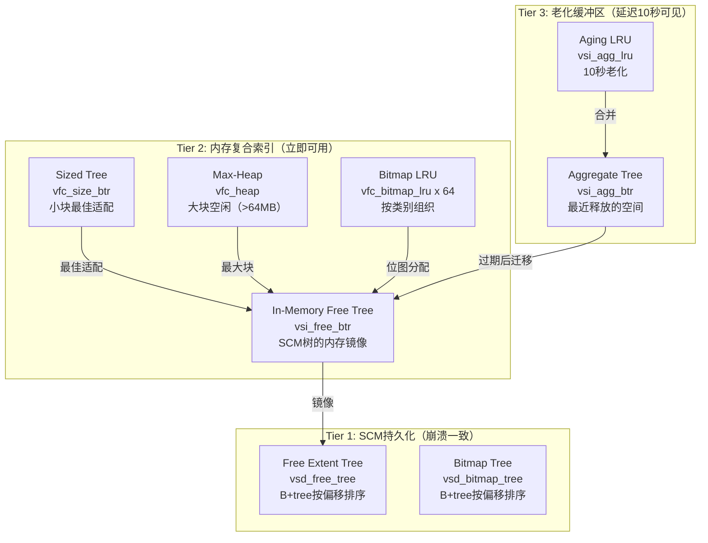

| 层次 | 数据结构 | 可见性 | 用途 |
|---|---|---|---|
| Tier 1 | SCM B+tree | 持久化 | 崩溃恢复 |
| Tier 2 | 内存复合索引 | 立即可分配 | 高速分配 |
| Tier 3 | 老化缓冲区 | 延迟10秒 | 防止立即重分配 |

### 6.4 Reserve-Publish 两阶段分配

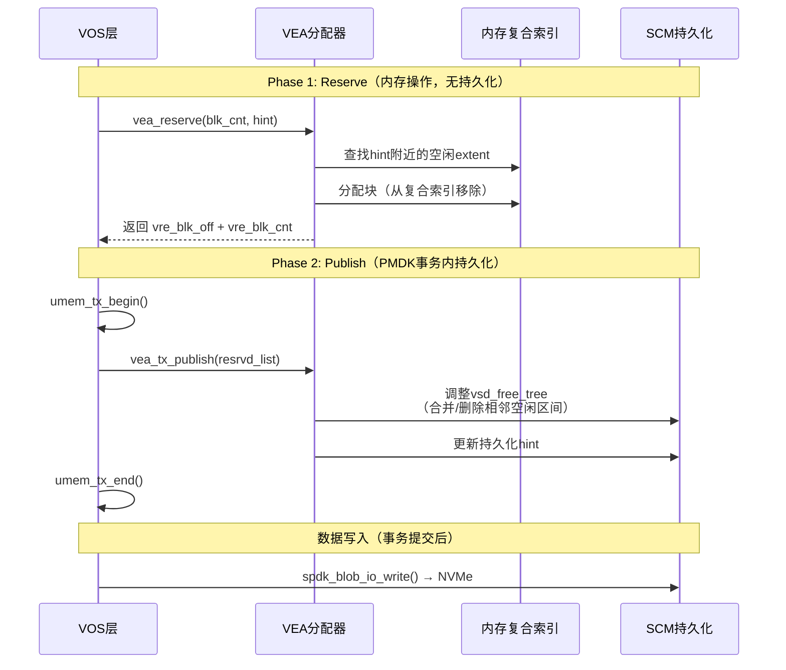

### 6.5 分配优先级

1. **Bitmap 分配**（blk_cnt ≤ 64）：从位图 LRU 中查找空闲 bit
2. **Hint 分配**：查找 hint 偏移处的空闲 extent（顺序局部性）
3. **小块分配**（< 64MB）：Size Tree 最佳适配
4. **大块分配**（≥ 64MB）：Max-Heap 取最大块

### 6.6 Stream Hint 顺序分配

每个 Container 有两个 I/O Stream：

| Stream | 用途 |
|---|---|
| `VOS_IOS_GENERIC = 0` | 客户端更新、重建、再平衡 |
| `VOS_IOS_AGGREGATION = 1` | Extent 合并/聚合 |

每个 Stream 持久化一个 hint（`cd_hint_df[i]`），hint 在每次成功分配后更新为 `blk_off + blk_cnt`，使后续分配在物理上连续。通过序列号检测交错 Reserve-Publish，防止 hint 回滚错误。

---

## 7. 写 I/O 完整流程

### 7.1 SCM 写（Inline 数据 ≤ 4KB）

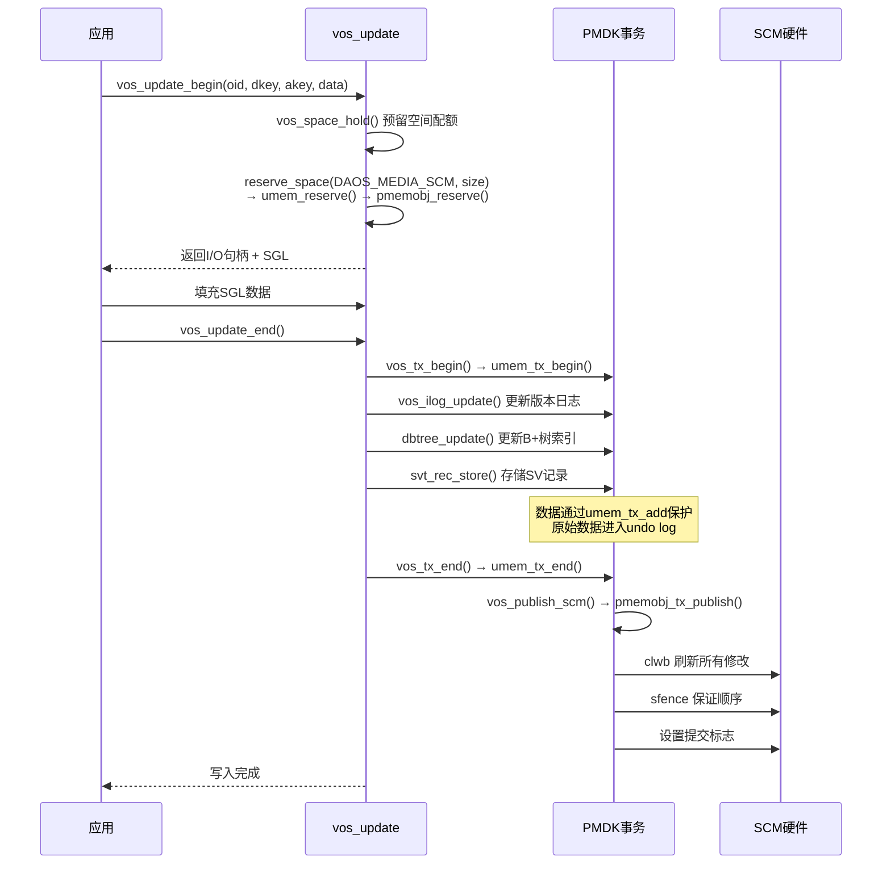

### 7.2 NVMe 写（大块数据 > 4KB）

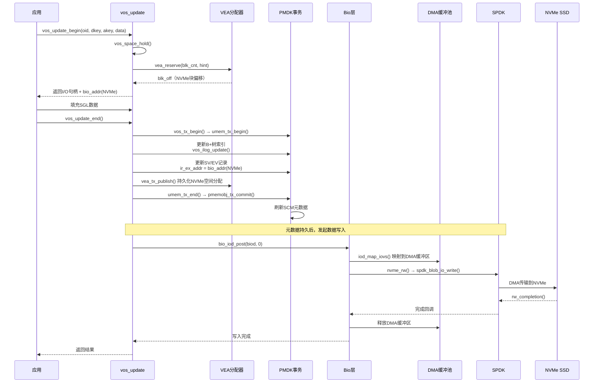

### 7.3 vos_tx_end 详细流程

`vos_tx_end()` 是写操作的关键汇聚点：

```c
// src/vos/vos_common.c:283
vos_tx_end(cont, dth, rsrvd_scm, blk_exts, tx_started, biod, err)
{
    // 1. 发布SCM预留空间
    vos_publish_scm(rsrvd_scm) → pmemobj_tx_publish()

    // 2. 发布NVMe预留块
    vos_publish_blocks(blk_exts, true) → vea_tx_publish()

    // 3. 最终DTX提交
    vos_tx_publish(dth, true)

    // 4. 提交PMDK事务（刷新SCM元数据）
    umem_tx_end() → pmemobj_tx_commit() + pmemobj_tx_end()

    // 5. NVMe数据写入（元数据已持久，数据异步写入）
    // 由bio_iod_post()在事务提交后发起
}
```

**关键设计**：先持久化元数据（SCM），再写入数据（NVMe）。元数据记录了数据的位置，即使数据写入过程中崩溃，恢复时可以通过元数据判断数据完整性。

---

## 8. 读 I/O 完整流程

### 8.1 SCM 读（Inline 数据）

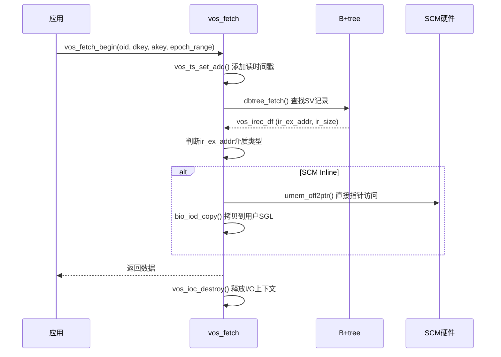

### 8.2 NVMe 读（外部数据）

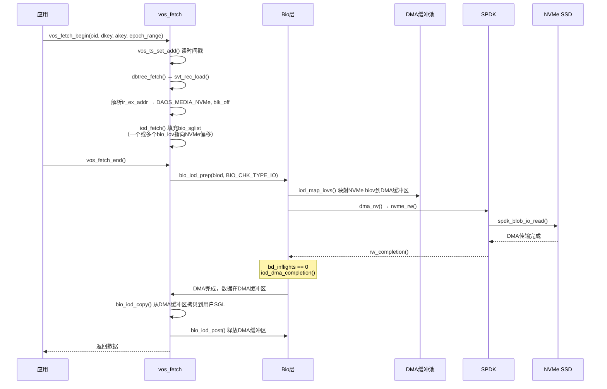

**SCM 读的特点**：无需事务，直接通过 mmap 指针访问，零拷贝（SCM 内联数据）或一次拷贝（SCM 外部数据从 DMA Buffer 到用户 SGL）。

**NVMe 读的特点**：需要 DMA Buffer 中转。`bio_iod_prep()` 在 FETCH 模式下立即发起 NVMe 读取，`vos_fetch_end()` 等待完成后拷贝数据。

---

## 9. DMA 缓冲区管理

### 9.1 DMA Chunk 分配

```c
// src/bio/bio_buffer.c:29-77
dma_alloc_chunk():
    spdk_dma_malloc_socket(bytes, BIO_DMA_PAGE_SZ, NULL, bio_numa_node)
    // 回退: spdk_dma_malloc()
    // 回退: posix_memalign()
```

每个 DMA Chunk = **8MB**（`BIO_DMA_CHUNK_MB = 8`），4KB 页对齐（`BIO_DMA_PAGE_SZ = 4096`）。

### 9.2 DMA Buffer 结构

```c
// src/bio/bio_internal.h:122-136
struct bio_dma_buffer {
    d_list_t            bdb_idle_list;      // 空闲Chunk列表
    d_list_t            bdb_used_list;       // 使用中Chunk列表
    struct bio_dma_chunk *bdb_cur_chk[BIO_CHK_TYPE_MAX]; // 当前Chunk（按类型）
    unsigned int        bdb_active_iods;     // 活跃I/O描述符数
    unsigned int        bdb_queued_iods;     // 等待DMA的I/O数
    ABT_cond            bdb_wait_iod;        // 等待FIFO
    ABT_cond            bdb_fifo;            // 排队FIFO
    struct bio_bulk_cache bdb_bulk_cache;     // RDMA Bulk缓存
};
```

### 9.3 DMA Buffer 流转

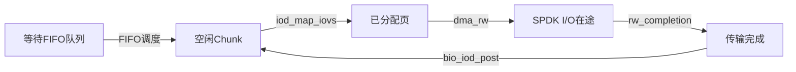

### 9.4 Bulk Handle 缓存（RDMA）

```c
struct bio_bulk_cache:
    BIO_BULK_GRPS_MAX = 64  // 最多64个bulk组
    每组: DMA chunks + 预注册的crt_bulk_t句柄
```

避免每次 RDMA I/O 都执行昂贵的内存注册。通过 `bulk_get_hdl()` / `bulk_hdl_unhold()` 复用句柄。

---

## 10. I/O 流控与调度

### 10.1 多级流控

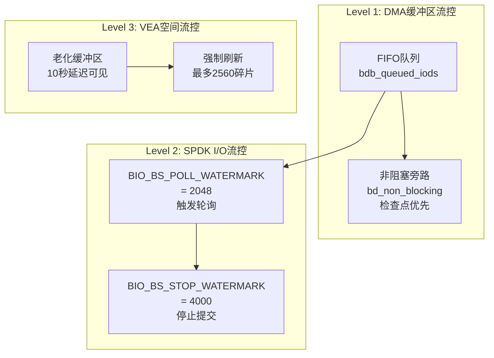

| 层级 | 机制 | 阈值 | 作用 |
|---|---|---|---|
| DMA 缓冲区 | FIFO 队列 + 非阻塞旁路 | 无硬阈值 | 防止 DMA 耗尽 |
| SPDK I/O | Poll/Stop Watermark | 2048/4000 | 防止 NVMe 队列溢出 |
| VEA 空间 | 老化缓冲区 | 10秒 | 防止刚释放空间立即重分配 |

### 10.2 非阻塞 Prep

```c
bio_iod_try_prep(biod):
    if (DMA不足)
        return -DER_AGAIN  // 立即返回，不等待
    // 用于检查点等高优先级操作
```

### 10.3 异步 Post（WAL + Data 并行）

```c
bio_iod_post_async(biod, err):
    // 仅用于 UPDATE + MD-on-SSD + 小数据（< 32KB）
    biod->bd_async_post = 1
    // WAL写入和Data写入并行发起
```

---

## 11. WAL 机制（MD-on-SSD）

### 11.1 WAL 概述

当元数据存储在 NVMe 上（`DAOS_MD_BMEM_V2` 后端）时，DAOS 使用 WAL（Write-Ahead Log）保证元数据持久性：

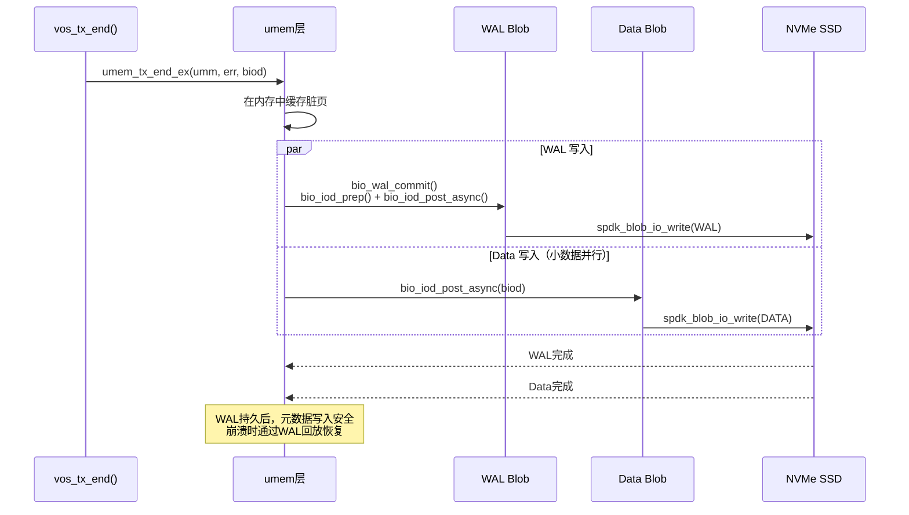

### 11.2 WAL 数据结构

```c
struct umem_wal_tx {
    uint64_t wal_tx_id;   // 64位事务ID
    // 32位: 字节偏移
    // 32位: 序列号
    // 提供空间效率 + 单调排序
};
```

### 11.3 WAL 恢复

- `so_wal_replay()`：崩溃后扫描 WAL Blob，按序列号回放事务
- 重建 SCM 上的元数据状态

---

## 12. 数据分类存储策略

### 12.1 存储阈值

```c
// vos_internal.h
vos_io_scm(pool, size):
    if (!NVMe配置 || vp_data_thresh == 0) → 全部SCM
    默认阈值: DAOS_PROP_PO_DATA_THRESH_DEFAULT = 4KB (1UL << 12)
    size < 阈值 → SCM（Inline）
    size >= 阈值 → NVMe（External）
```

### 12.2 数据分类决策树

```
数据大小
├── ≤ 4KB → SCM Inline（vos_irec_df + payload 连续存储）
├── > 4KB 且 ≤ 8MB → NVMe External（头部SCM，payload NVMe）
└── > 8MB → Gang（头部SCM，payload分散在多个段）
```

### 12.3 Array Value 的存储

Array Value 通过 EVTree 管理，每个 extent 记录：

| 字段 | 说明 |
|---|---|
| `ev_epoch` | 版本号 |
| `ev_offset` | 逻辑偏移 |
| `ev_len` | 长度 |
| `bio_addr_t` | 物理地址（SCM或NVMe） |

Array Value 的数据始终存储在 NVMe 上（通过 VEA 分配），元数据存储在 EVTree 节点中（SCM）。

---

## 13. Gang 地址（分散存储）

### 13.1 Gang 概述

当单个逻辑 extent 无法在物理上连续分配时（大小超过可用连续空间），DAOS 使用 Gang 地址将其分散存储。

### 13.2 Gang 阈值

- `VOS_GANG_SIZE_THRESH = 8MB`
- 仅当 `VOS_POOL_FEAT_GANG_SV` 特性启用时生效

### 13.3 Gang 地址结构

```c
struct bio_gang_addr {
    // 8字节: bio_addr_t 基地址
    // 4字节: 子段数量
    // 1字节: 标志
    // 每个子段: 8+4+1 = 13字节
    // 紧凑存储在SCM上
};
```

### 13.4 Gang I/O

- **读**：`iod_gang_fetch()` 遍历 gang 成员，为每个子段创建 bio_iov，合并后发起 NVMe 读取
- **写**：每个子段独立分配（可跨 SCM/NVMe），独立写入
- **聚合**：后台聚合将小记录合并为大记录，可能产生 gang 地址

---

## 14. I/O 错误处理与健康监控

### 14.1 错误检测

| 错误类型 | 检测方式 |
|---|---|
| NVMe I/O 错误 | `rw_completion()` 回调的 `err` 参数 |
| 介质错误 | `injected_nvme_error()` + `auto_faulty_detect()` |
| 校验和错误 | 读完成后 `bio_log_data_csum_err()` |
| I/O 超时 | `DAOS_SPDK_IO_TIMEOUT`（默认120秒） |

### 14.2 错误传播

```c
rw_completion(err != 0):
    1. 设置 biod->bd_result = -DER_NVME_IO
    2. 发送 media_error_msg 到 owner 线程
    3. auto_faulty_detect() 累计错误计数
    4. 超过阈值 → bio_blobstore 进入 FAULTY 状态
```

### 14.3 故障判定标准

```c
// bio_internal.h:595-599
最大I/O错误数: 可配置（默认10）
最大校验和错误数: 可配置（默认无限制）
```

超过阈值后：
1. Blobstore 状态转为 `BIO_BS_STATE_FAULTY`
2. 停止接受新 I/O
3. 触发健康监控告警

---

## 15. 参数配置

| 参数 | 默认值 | 说明 |
|------|--------|------|
| `VOS_BLK_SZ` | 4KB | 块大小（`VOS_BLK_SHIFT = 12`） |
| `BIO_DMA_CHUNK_MB` | 8MB | DMA Chunk 大小 |
| `BIO_DMA_PAGE_SZ` | 4KB | DMA 页大小 |
| `BIO_BS_MAX_CHANNEL_OPS` | 4096 | 每通道最大在途I/O |
| `BIO_BS_POLL_WATERMARK` | 2048 | 触发NVMe轮询的水位 |
| `BIO_BS_STOP_WATERMARK` | 4000 | 停止提交I/O的水位 |
| `DAOS_DEFAULT_CLUSTER_MB` | 128MB | SPDK Blob Cluster 大小 |
| `DAOS_PROP_PO_DATA_THRESH_DEFAULT` | 4KB | SCM/NVMe 数据分流阈值 |
| `DAOS_SPDK_IO_TIMEOUT` | 120s | I/O 超时 |
| `bio_max_async_sz` | 32KB | 异步Post最大数据大小 |
| `DTX_THRESHOLD_COUNT` | 512 | CoS 批量提交计数阈值 |
| `DTX_COMMIT_THRESHOLD_AGE` | 10s | CoS 批量提交时间阈值 |
| `VEA_LARGE_THRESH` | 64MB | 大块分配阈值 |
| 老化延迟 | 10s | 释放空间延迟可见时间 |
| `BIO_BULK_GRPS_MAX` | 64 | RDMA Bulk缓存组数 |
| `VOS_GANG_SIZE_THRESH` | 8MB | Gang 分散存储阈值 |

---

## 16. 对比总结

### 16.1 SCM vs NVMe I/O 对比

| 特性 | SCM (PMDK) | NVMe (SPDK) |
|---|---|---|
| 寻址方式 | 字节寻址（内存映射） | 块寻址（4KB粒度） |
| 延迟 | ~100ns | ~10μs |
| 事务模型 | PMDK事务（undo log） | WAL（MD-on-SSD） |
| 持久化指令 | clwb + sfence | NVMe DMA完成 |
| 缓冲区 | 直接访问（mmap） | DMA Buffer 中转 |
| 分配器 | PMDK Slab（16类） | VEA（4KB粒度） |
| 用途 | 元数据 + 小值（≤4KB） | 大块数据 + WAL |
| 并发模型 | 多线程直接访问 | 每xstream独立SPDK通道 |

### 16.2 与其他系统对比

| 特性 | DAOS Bio | Ceph BlueStore | RocksDB |
|---|---|---|---|
| 双介质 | SCM + NVMe | WAL(DB) + RocksDB(KV) + Blob | WAL + SSTable |
| I/O路径 | 用户态SPDK | 内核AIO/iouring | 系统调用 |
| 元数据存储 | SCM直接访问 | RocksDB | memtable + SSTable |
| 数据分配 | VEA 4KB粒度 | FreeList/Bitmap | 文件内offset |
| 流控 | 三级水位线 | Op sequencer | Write stall |
| WAL | 独立Blob（可选） | RocksDB内置 | 独立文件 |

---

## 17. 源码索引

### Bio 层

| 文件 | 内容 |
|---|---|
| `src/include/daos_srv/bio.h` | 公共API：bio_addr_t, bio_iov, bio_sglist, bio_iod_alloc/prep/post |
| `src/bio/bio_internal.h` | 核心结构：bio_desc, bio_dma_buffer, bio_bdev, bio_blobstore |
| `src/bio/bio_buffer.c` | DMA管理、nvme_rw()、rw_completion()、bio_iod_prep/post |
| `src/bio/bio_bulk.c` | Bulk Handle缓存（RDMA） |
| `src/bio/bio_context.c` | Blob open/close/create、WAL/元数据/数据上下文 |
| `src/bio/bio_xstream.c` | SPDK初始化、xstream上下文、线程轮询 |
| `src/bio/bio_device.c` | 设备管理 |
| `src/bio/bio_monitor.c` | 健康监控、自动故障检测 |
| `src/bio/bio_wal.c` | WAL 提交/回放 |

### VOS I/O

| 文件 | 内容 |
|---|---|
| `src/vos/vos_io.c` | I/O入口：vos_update_begin/end、vos_fetch_begin/end、reserve_space |
| `src/vos/vos_common.c` | vos_tx_begin/end（umem事务包装） |
| `src/vos/vos_layout.h` | 磁盘结构：vos_pool_df、vos_cont_df、vos_obj_df、vos_irec_df |
| `src/vos/vos_internal.h` | 内联工具：vos_irec_msize、vos_io_scm、vos_obj_alloc/reserve |
| `src/vos/vos_tree.c` | SV B+tree记录操作 |

### VEA 空间分配器

| 文件 | 内容 |
|---|---|
| `src/include/daos_srv/vea.h` | 公共API：vea_space_df、vea_free_extent、vea_resrvd_ext |
| `src/vea/vea_internal.h` | 内部结构：vea_space_info、vea_free_class、vea_bitmap_entry |
| `src/vea/vea_init.c` | 格式化、加载、卸载、升级 |
| `src/vea/vea_alloc.c` | 空间预留：reserve_hint/small/bitmap/extent |
| `src/vea/vea_free.c` | 空间释放、合并、老化 |
| `src/vea/vea_hint.c` | Stream Hint管理 |
| `src/vea/vea_api.c` | 顶层API：reserve/publish/cancel/free/query |

### 内存抽象

| 文件 | 内容 |
|---|---|
| `src/include/daos/mem.h` | umem统一API |
| `src/common/mem.c` | PMDK后端实现 |
