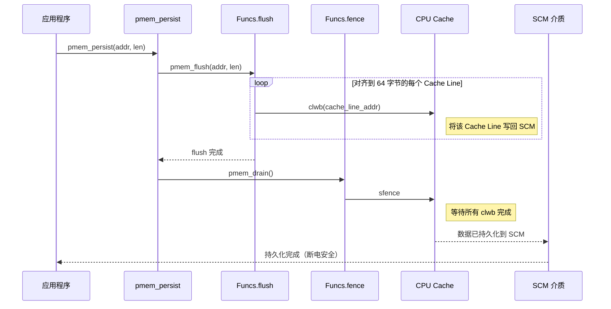
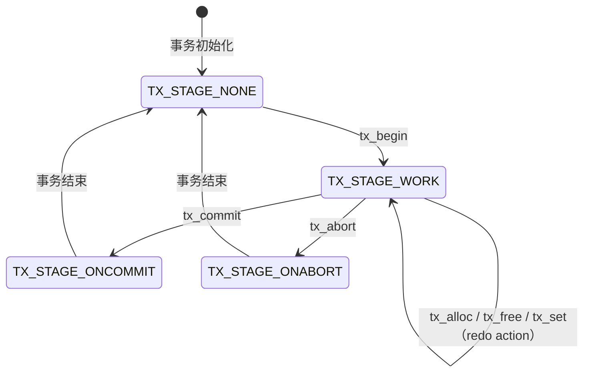
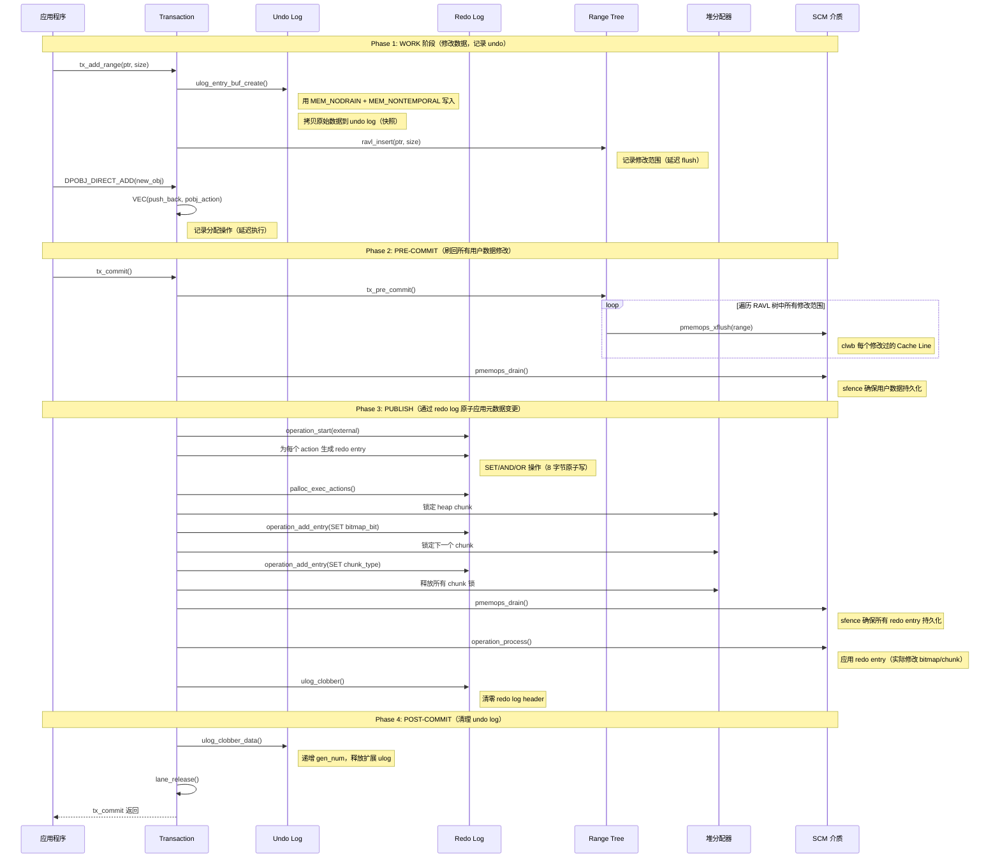
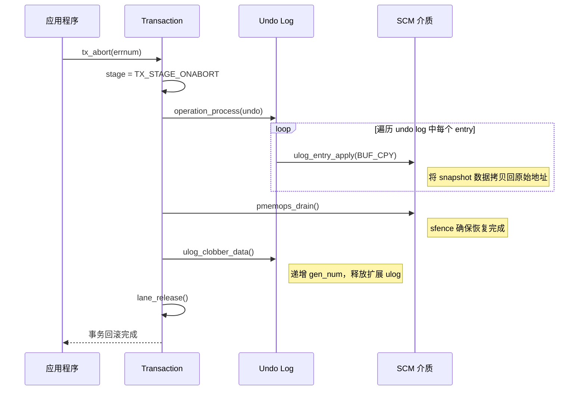
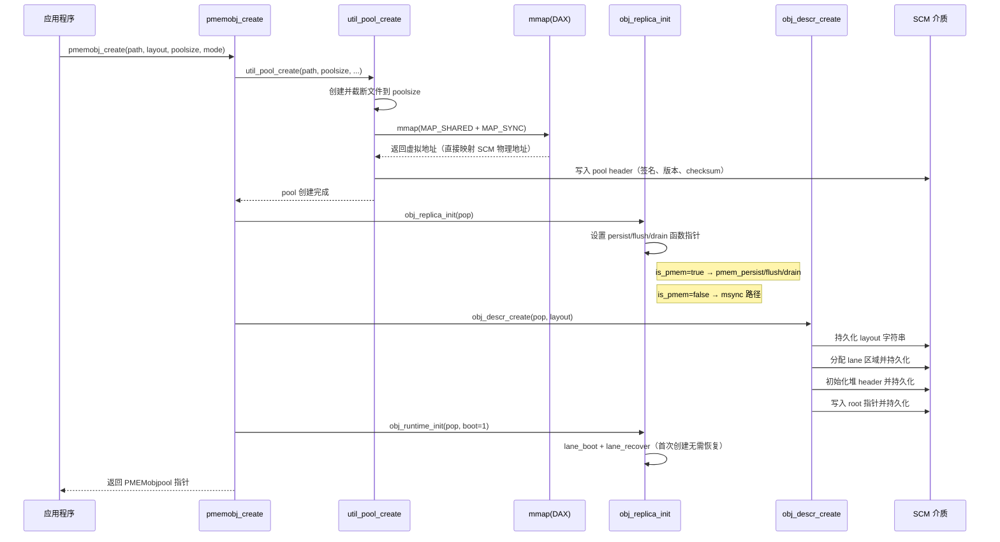
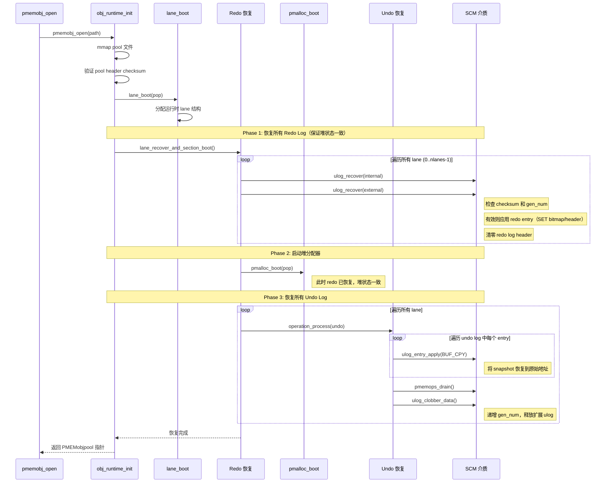

# PMDK I/O 流程分析

## 1. 概述

PMDK（Persistent Memory Development Kit）的 I/O 与传统磁盘 I/O 本质不同：它不经过块设备、文件系统、Page Cache，而是通过 CPU 指令直接操作 SCM 介质。核心指令是 `clwb`（Cache Line Write Back）+ `sfence`（内存屏障），配合 `memcpy`/`memset` 完成持久化。

### 1.1 三种持久化粒度

```
┌──────────────────────────────────────────────────────────────────┐
│                    PMDK 三种持久化粒度                             │
├──────────────┬────────────────────────┬───────────────────────────┤
│ 粒度          │ 指令                   │ 适用场景                   │
├──────────────┼────────────────────────┼───────────────────────────┤
│ 字节级        │ sfence（仅内存屏障）    │ eADR 平台（CPU 自动刷回）  │
│ Cache Line级 │ clwb + sfence          │ 普通 PMem（如 Optane）     │
│ Page 级      │ msync（走内核）         │ 非 PMem 设备（模拟/文件）   │
└──────────────┴────────────────────────┴───────────────────────────┘

初始化时自动检测:
  CPUID 检测可用指令 → 选择 clwb > clflushopt > clflush
  eADR 检测 → 有则跳过 flush，仅保留 sfence
```

### 1.2 I/O 与传统磁盘 I/O 对比

```
传统文件 I/O（以 ext4 为例）:
  应用 → libc → VFS(Page Cache) → ext4(日志) → 块层 → SCSI驱动 → SSD
  延迟: 10-100us，经过多层内核栈

PMDK 持久化 I/O:
  应用 → PMDK(clwb+sfence) → CPU Cache → SCM
  延迟: ~300ns（store）+ ~300ns（clwb）+ ~20ns（sfence）
  用户态直接操作，无内核参与
```

## 2. libpmem I/O 流程

libpmem 提供 SCM 的基本 I/O 原语：`pmem_persist`、`pmem_memcpy_persist`、`pmem_msync`。

### 2.1 函数指针初始化

```
PMDK 库加载时，pmem_init() 通过 CPUID 探测可用指令，设置函数指针:

  struct pmem_funcs Funcs = {
    .flush  → flush_clwb()          (首选)
             flush_clflushopt()     (次选)
             flush_clflush()        (最后)
    .fence  → memory_barrier()      (sfence，CLWB/CLFLUSHOPT 用)
             fence_empty()          (CLFLUSH 自身串行化，无需额外 fence)
    .deep_flush → 始终是真实 flush（不为空，用于 deep persist）
    .memmove_nodrain → 按长度和 ISA 选择最优路径
    .memset_nodrain  → 同上
  };
```

### 2.2 pmem_persist 流程



### 2.3 三种 Flush 指令对比

| 指令 | 作用 | 是否失效 Cache Line | 是否串行化 | 需要额外 sfence |
|---|---|---|---|---|
| `clwb` | 写回但不失效 | 否 | 否 | 是 |
| `clflushopt` | 写回但不失效 | 否 | 否 | 是 |
| `clflush` | 写回且失效 | 是 | 是 | 否 |

### 2.4 pmem_memcpy_persist 流程

```
pmem_memcpy_persist(dest, src, len) 的优化策略:

  Step 1: 根据 len 选择拷贝方式
    len < 256 字节 → temporal stores（普通 mov，利用 Cache）
    len >= 256 字节 → non-temporal stores（MOVNTDQ/VMOVNTDQ，绕过 Cache）

  Step 2: 根据 ISA 选择指令级
    SSE2   → MOVNTDQ（128位，需 WC barrier 每 12 CL）
    AVX    → VMOVNTDQ（256位，需 WC barrier 每 12 CL）
    AVX512 → VMOVDQA64（512位，无需 WC barrier）
    MOVDIR64B → 直接 64 字节写入（需手动启用 PMEM_MOVDIR64B=1）

  Step 3: Non-temporal 写入后需要额外 sfence
    因为 MOVNT 绕过 Cache，需要 sfence 确保所有写入完成

  为什么区分 temporal 和 non-temporal:
    小数据 → 利用 Cache 提高局部性，clwb 批量刷回
    大数据 → 绕过 Cache 避免 Cache 污染（SCM 数据大概率不会马上再读）
```

### 2.5 WC Barrier 优化

```
Write Combining Buffer 优化（SSE2/AVX 专用）:

  CPU 有 10-12 个 WC（Write Combining）缓冲区
  每个 WC Buffer = 64 字节（一个 Cache Line）
  MOVNT 写入填满 WC Buffer 后自动刷新到 SCM

  问题: 如果 MOVNT 目标地址不连续，WC Buffer 可能未满就溢出
        导致 suboptimal eviction（性能下降）

  解决: 每 12 个 Cache Line（768 字节）插入一次 sfence
        强制清空 WC Buffer，避免溢出

  AVX512 不需要: 因为一条指令写 512 位（8 字节对齐的 64 字节区域）
                  一次覆盖整个 Cache Line，不存在部分填充问题
```

### 2.6 pmem_msync 流程（非 PMem 降级路径）

```
pmem_msync(addr, len):
  - 页对齐 addr（向下取整到 4KB 边界）
  - 调用 msync(addr, len, MS_SYNC)
  - 走内核路径: VFS → Page Cache → 文件系统 → 块设备

  适用场景:
    - 非 DAX 文件系统上的文件（如普通 ext4）
    - 开发测试环境（无真实 SCM 硬件）
    - 非持久内存区域的持久化需求
```

## 3. libpmemobj 事务 I/O 流程

libpmemobj 在 libpmem 之上提供对象存储和事务机制。事务的 I/O 流程是 PMDK 最核心、最复杂的部分。

### 3.1 事务阶段状态机



### 3.2 事务核心数据结构

```
每个线程的事务上下文:

  struct tx {
    PMEMobjpool *pop;          // 所属 pool
    enum pobj_tx_stage stage;   // 事务阶段
    struct lane *lane;          // 分配的 lane（per-thread, round-robin）
    VEC(actions)                // 延迟执行的 alloc/free/set 操作
    VEC(redo_userbufs)          // 用户自定义 redo buffer
    struct ravl *ranges;        // 修改范围的 RAVL 树（延迟 flush）
  };

Lane 结构（持久化的，每个线程独占一个）:

  struct lane_layout {
    struct ulog undo;           // undo 日志区域
    struct ulog internal;       // 内部 redo 日志（固定大小）
    struct ulog external;       // 外部 redo 日志（可扩展，通过 pmalloc）
  };
```

### 3.3 事务提交完整 I/O 流程



### 3.4 Undo Log 写入优化

```
tx_add_range() 创建 undo snapshot 时的 I/O 优化:

  1. 非 temporal写入（MEM_NONTEMPORAL）:
     - 使用 MOVNT 指令写入 undo log
     - 不污染 CPU Cache（undo log 数据不会马上再读）

  2. 延迟 drain（MEM_NODRAIN）:
     - undo log 的每条 entry 写入后不立即 sfence
     - 仅在 entry 的第一个 Cache Line 写入后 sfence
     - 保证 header（含 checksum 和 gen_num）先持久化

  3. 延迟用户数据 flush（RELAXED 标志）:
     - undo entry 写入时，不 flush 用户数据修改
     - 用户数据修改积累在 RAVL tree 中
     - tx_pre_commit 时批量 flush（减少 flush 次数）

  4. Checksum 计算:
     - 包含 gen_num，防止旧 log 被误应用
     - 在第一个 Cache Line 写入前计算完成
```

### 3.5 Redo Log Apply 优化

```
palloc_exec_actions() 中的 redo log 优化:

  1. Entry 合并（operation_try_merge_entry）:
     - 搜索最近 64 条 redo entry
     - 如果同一地址、同一操作类型的连续 entry → 合并为一条
     - 减少 redo log 大小

  2. 单 entry 直接应用:
     - 如果只有 1 条 redo entry（SET/AND/OR 类型）
     - 直接写入目标地址 + persist，不经过 log store/clobber
     - 避免 redo log 的额外 I/O

  3. 批量处理:
     - 所有 action 按 lock 地址排序（避免死锁）
     - 一次获取所有锁 → 生成所有 redo entry → 一次 drain → 一次 process
     - 减少锁竞争和 barrier 次数
```

### 3.6 事务回滚 I/O 流程



## 4. Pool 创建与映射 I/O 流程

### 4.1 pmemobj_create 流程



### 4.2 DAX 映射的关键特征

```
DAX（Direct Access）映射与传统 mmap 的区别:

  传统 mmap（非 DAX）:
    mmap → Page Cache → 内核脏页回写 → 文件系统 → 块设备 → 磁盘
    数据先到 Page Cache，内核异步刷回

  DAX mmap:
    mmap → 直接映射到 SCM 物理地址
    无 Page Cache 中间层
    CPU load/store 直接访问 SCM
    持久化需要手动 clwb + sfence

  MAP_SYNC 标志:
    确保映射同步建立（不是懒加载）
    保证 write-after-map 的数据可见性
    仅对 DAX 设备有效
```

### 4.3 多副本持久化函数指针

```
单副本模式（默认）:
  persist → pmem_persist        (clwb + sfence)
  flush   → pmem_flush          (clwb)
  drain   → pmem_drain          (sfence)
  memcpy  → pmem_memcpy         (MOVNT + clwb + sfence)

多副本模式（自动复制到所有副本）:
  persist → obj_rep_persist     (遍历所有副本调用 pmem_persist)
  flush   → obj_rep_flush       (遍历所有副本)
  drain   → obj_rep_drain       (遍历所有副本)
  memcpy  → obj_rep_memcpy      (遍历所有副本)

非 PMem 降级:
  persist → obj_msync_nofail    (msync)
  flush   → obj_msync_nofail
  drain   → obj_drain_empty     (空操作)
  memcpy  → obj_nopmem_memcpy   (libc memcpy + msync)
```

## 5. 堆分配 I/O 流程

### 5.1 堆数据结构

```
PMemobjpool 堆布局:

  ┌──────────────────────────────────────────────────┐
  │ Pool Header (4KB)                                │
  │ - 签名、版本、checksum、run_id                    │
  ├──────────────────────────────────────────────────┤
  │ Lanes (N * sizeof(lane_layout))                  │
  │ - 每个 lane 含 undo/internal/external redo log    │
  ├──────────────────────────────────────────────────┤
  │ Heap Header                                      │
  │ - chunksize=256KB, zones 数量                     │
  ├──────────────────────────────────────────────────┤
  │ Zone 0                                           │
  │  ├─ Zone Header                                  │
  │  ├─ Chunk Headers[MAX_CHUNK]                     │
  │  └─ Chunk Data                                   │
  │     ├─ Chunk 0 (256KB): FREE / HUGE / RUN       │
  │     ├─ Chunk 1 (256KB): RUN（细分为 slot）         │
  │     └─ ...                                       │
  │ Zone 1 ...                                       │
  └──────────────────────────────────────────────────┘

两种块类型:
  HUGE: 跨多个 chunk 的大块分配（> 256KB）
  RUN:  单个 chunk 内的固定大小 slot 分组（<= 256KB）
        通过 bitmap 管理空闲 slot
```

### 5.2 分配 I/O 流程（事务内）

```
tx_alloc(size) 的 I/O 路径:

  Step 1: palloc_reserve()（延迟分配）
    - 根据 size 找到最佳 allocation class
    - 在 bitmap 中搜索空闲 slot
    - 创建 pobj_action（记录操作，不执行）

  Step 2: 用户修改新对象数据（在 WORK 阶段）
    - 数据修改记录在 undo log 中

  Step 3: tx_commit() → palloc_exec_actions()
    - 锁定 chunk 的 mutex
    - 生成 redo entry: SET bitmap_bit（标记 slot 已占用）
    - 生成 redo entry: SET chunk_header 修改
    - sfence 确保 redo entry 持久化
    - 应用 redo entry（实际修改 bitmap 和 header）
    - 释放 chunk mutex

  关键点: bitmap 和 header 的修改通过 redo log 保证原子性
          崩溃时要么全部应用，要么全部不应用
```

## 6. 恢复 I/O 流程

### 6.1 恢复总览



### 6.2 Redo Log 恢复判定逻辑

```
ulog_recovery_needed(ulog) 的判定:

  遍历 ulog 中的每个 entry:
    entry.offset == 0 或 checksum 不匹配 → 停止遍历

  判定结果:
    ├─ 无有效 entry → 无需恢复（正常关闭或 log 已清理）
    ├─ 有效 entry 且 checksum 通过 → 需要恢复（崩溃时事务中断）
    └─ 有效 entry 但 checksum 失败 → 不恢复（entry 写了一半，无效）

  为什么 redo 先于 undo 恢复:
    redo log 记录的是堆元数据变更（bitmap, chunk header）
    堆状态必须先一致，才能安全处理 undo
    否则 undo 可能访问到不一致的堆结构
```

### 6.3 Undo Log 恢复判定逻辑

```
undo log 的恢复更复杂:

  场景 1: 事务正常提交
    → redo log 已处理，undo log 的 gen_num 已递增
    → 旧 undo entry 的 gen_num 不匹配 → 自动跳过

  场景 2: 事务未提交就崩溃
    → redo log 未处理（entry checksum 不匹配）
    → undo log 的 gen_num 未递增
    → 有效 undo entry 被应用 → 用户数据恢复到修改前

  场景 3: tx_pre_commit 完成但 palloc_publish 未完成
    → 用户数据已 flush（pre-commit 完成）
    → 但堆元数据变更未应用（redo 未 process）
    → redo 恢复完成（应用元数据变更）
    → undo log gen_num 匹配 → 不需要 undo 恢复
    → 结果: 对象已分配但数据可能不完整（由应用层处理）
```

## 7. 关键 I/O 优化汇总

| 优化 | 位置 | 效果 |
|---|---|---|
| Entry 合并 | memops.c: operation_try_merge_entry | 同地址连续 entry 合为一条，减少 redo log 大小 |
| 单 entry 直接应用 | memops.c: operation_process | 只有 1 条 SET entry 时跳过 log 机制 |
| Non-temporal 写入 | ulog.c: ulog_entry_buf_create | undo/redo entry 绕过 Cache，减少污染 |
| 延迟用户数据 flush | tx.c: tx_pre_commit | 修改范围积累到 RAVL tree，提交时批量 flush |
| 延迟 drain | ulog.c: MEM_NODRAIN | undo entry 写入不立即 sfence |
| WC Barrier | memcpy_memset.h: wc_barrier | 每 12 CL sfence 一次，防止 WC buffer 溢出 |
| MOVNT 阈值 | init.c: Movnt_threshold=256 | 小数据用 temporal，大数据用 non-temporal |
| eADR 检测 | pmem.c: pmem2_auto_flush | eADR 平台跳过 clwb，仅 sfence |
| 三粒度持久化 | persist.c: pmem2_set_flush_fns | 字节/CL/Page 三种粒度自动适配 |
| Redo 优先恢复 | lane.c: lane_recover | redo 先恢复保证堆一致，undo 后恢复用户数据 |

## 8. 源码索引

| 文件 | 关键函数 | 说明 |
|---|---|---|
| src/libpmem2/x86_64/flush.h | flush_clwb_nolog | clwb 指令封装 |
| src/libpmem2/x86_64/flush.h | flush_clflushopt_nolog | clflushopt 指令封装 |
| src/libpmem2/x86_64/init.c | memory_barrier | sfence 指令封装 |
| src/libpmem2/x86_64/init.c | pmem2_arch_init | CPUID 探测初始化 |
| src/libpmem/pmem.c | pmem_persist | flush + drain |
| src/libpmem/pmem.c | pmem_memcpy_persist | memcpy + persist |
| src/libpmem/pmem.c | pmem_msync | msync 降级路径 |
| src/libpmem2/memcpy_memset.h | wc_barrier | WC buffer 管理 |
| src/libpmemobj/tx.c | pmemobj_tx_begin | 事务开始 |
| src/libpmemobj/tx.c | pmemobj_tx_commit | 事务提交 |
| src/libpmemobj/tx.c | pmemobj_tx_abort | 事务回滚 |
| src/libpmemobj/tx.c | tx_pre_commit | 批量 flush 用户数据 |
| src/libpmemobj/ulog.c | ulog_entry_buf_create | undo/redo entry 创建 |
| src/libpmemobj/ulog.c | ulog_entry_apply | entry 应用 |
| src/libpmemobj/ulog.c | ulog_recover | redo 恢复 |
| src/libpmemobj/ulog.c | ulog_clobber | log 清理 |
| src/libpmemobj/palloc.c | palloc_exec_actions | redo log 提交执行 |
| src/libpmemobj/memops.c | operation_process | redo 应用（含单 entry 优化） |
| src/libpmemobj/memops.c | operation_try_merge_entry | entry 合并 |
| src/libpmemobj/obj.c | pmemobj_create | pool 创建 |
| src/libpmemobj/obj.c | obj_runtime_init_common | 恢复入口 |
| src/libpmemobj/lane.c | lane_recover_and_section_boot | redo+undo 恢复主循环 |
| src/libpmemobj/heap.c | heap_boot | 堆初始化 |
| src/libpmem2/persist.c | pmem2_set_flush_fns | 三粒度持久化分发 |
| src/common/mmap.c | util_map | mmap + MAP_SYNC |
