# PMDK 数据一致性保证分析

## 目录

1. [概述](#1-概述)
2. [一致性保证架构总览](#2-一致性保证架构总览)
3. [Undo Log 一致性机制](#3-undo-log-一致性机制)
4. [Redo Log 一致性机制](#4-redo-log-一致性机制)
5. [事务提交原子性](#5-事务提交原子性)
6. [事务中止与回滚](#6-事务中止与回滚)
7. [gen_num 代数追踪机制](#7-gen_num-代数追踪机制)
8. [Checksum 校验体系](#8-checksum-校验体系)
9. [内存排序保证](#9-内存排序保证)
10. [崩溃恢复流程](#10-崩溃恢复流程)
11. [崩溃点分析：对象分配](#11-崩溃点分析对象分配)
12. [崩溃点分析：事务提交](#12-崩溃点分析事务提交)
13. [崩溃点分析：事务中止](#13-崩溃点分析事务中止)
14. [Range 追踪与重叠处理](#14-range-追踪与重叠处理)
15. [事务状态机](#15-事务状态机)
16. [Pool 一致性检查](#16-pool-一致性检查)
17. [多副本一致性](#17-多副本一致性)
18. [与 DAOS 一致性的对比](#18-与-daos-一致性的对比)
19. [对比总结](#19-对比总结)
20. [源码索引](#20-源码索引)

---

## 1. 概述

PMDK 通过**双日志（Undo + Redo）架构**在应用层实现崩溃一致性，不依赖操作系统文件系统日志。核心一致性保证分为四个层次：

| 层次 | 机制 | 保护对象 | 崩溃恢复行为 |
|---|---|---|---|
| L1: 持久化原语 | clwb/clflushopt + sfence | 单次写入 | 确保写入到达持久内存 |
| L2: Checksum | Fletcher64 + gen_num | 日志条目 | 检测部分写入/损坏 |
| L3: Undo Log | 修改前快照 | 应用数据 | 回滚未完成事务 |
| L4: Redo Log | 意图日志 | 分配器元数据 | 恢复分配器一致性 |

---

## 2. 一致性保证架构总览

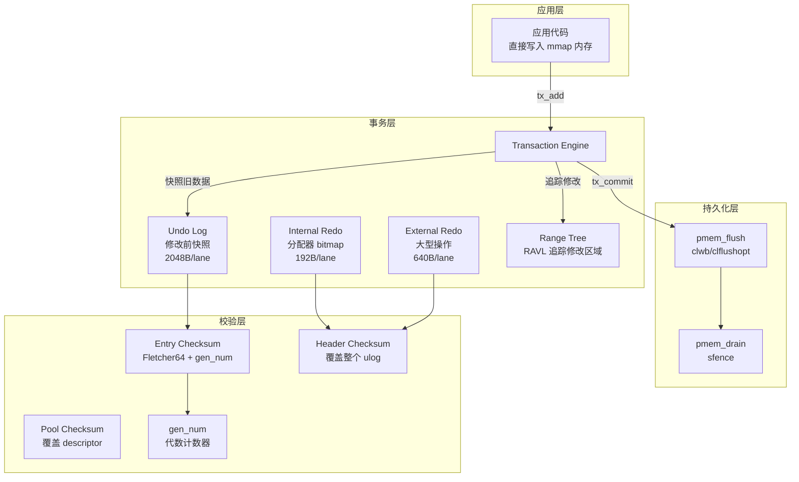
```mermaid
graph TB
    subgraph "应用层"
        APP[应用代码<br/>直接写入 mmap 内存]
    end

    subgraph "事务层"
        TX[Transaction Engine]
        UNDO[Undo Log<br/>修改前快照<br/>2048B/lane]
        REDO_I[Internal Redo<br/>分配器 bitmap<br/>192B/lane]
        REDO_E[External Redo<br/>大型操作<br/>640B/lane]
        RANGE[Range Tree<br/>RAVL 追踪修改区域]
    end

    subgraph "持久化层"
        FLUSH[pmem_flush<br/>clwb/clflushopt]
        DRAIN[pmem_drain<br/>sfence]
    end

    subgraph "校验层"
        CS_ENTRY[Entry Checksum<br/>Fletcher64 + gen_num]
        CS_HDR[Header Checksum<br/>覆盖整个 ulog]
        CS_POOL[Pool Checksum<br/>覆盖 descriptor]
        GNUM[gen_num<br/>代数计数器]
    end

    APP -->|tx_add| TX
    TX -->|快照旧数据| UNDO
    TX -->|追踪修改| RANGE
    TX -->|tx_commit| FLUSH
    FLUSH --> DRAIN

    UNDO --> CS_ENTRY
    CS_ENTRY --> GNUM
    REDO_I --> CS_HDR
    REDO_E --> CS_HDR
```

---

## 3. Undo Log 一致性机制

### 3.1 Undo Log 结构

```c
// src/libpmemobj/ulog.h
struct ULOG(capacity) {
    uint64_t checksum;     // 头部校验和
    uint64_t next;         // 扩展 ulog 链接
    uint64_t capacity;     // 容量
    uint64_t gen_num;      // 代数计数器（关键一致性字段）
    uint64_t flags;
    uint64_t unused[2];    // 必须为 0
    uint8_t  data[capacity]; // 条目数据
};
```

### 3.2 Undo 条目格式

```
值条目 (16B) — 用于 SET/AND/OR:
┌────────────────────────────────┬──────────────────┐
│ offset + type (8B)             │ value (8B)       │
│ bit[63:61] = 操作类型          │ 操作数值          │
└────────────────────────────────┴──────────────────┘

缓冲区条目 (可变) — 用于 BUF_CPY/BUF_SET:
┌──────────────────────────────────────────────────────┐
│ base: offset+type (8B)                               │
│ checksum (8B) — 覆盖整个条目 + gen_num               │
│ size (8B)                                            │
│ data[size] — 保存的原始数据                           │
└──────────────────────────────────────────────────────┘
```

### 3.3 Undo 快照操作时序

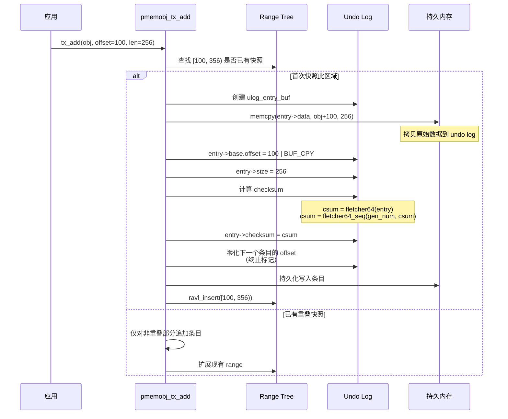
```mermaid
sequenceDiagram
    participant APP as 应用
    participant TX as pmemobj_tx_add
    participant RANGE as Range Tree
    participant UNDO as Undo Log
    participant PMEM as 持久内存

    APP->>TX: tx_add(obj, offset=100, len=256)

    TX->>RANGE: 查找 [100, 356) 是否已有快照

    alt 首次快照此区域
        TX->>UNDO: 创建 ulog_entry_buf
        TX->>PMEM: memcpy(entry->data, obj+100, 256)
        Note over PMEM: 拷贝原始数据到 undo log

        TX->>UNDO: entry->base.offset = 100 | BUF_CPY
        TX->>UNDO: entry->size = 256

        TX->>UNDO: 计算 checksum
        Note over UNDO: csum = fletcher64(entry)<br/>csum = fletcher64_seq(gen_num, csum)
        TX->>UNDO: entry->checksum = csum

        TX->>UNDO: 零化下一个条目的 offset<br/>（终止标记）
        TX->>PMEM: 持久化写入条目

        TX->>RANGE: ravl_insert([100, 356))
    else 已有重叠快照
        TX->>TX: 仅对非重叠部分追加条目
        TX->>RANGE: 扩展现有 range
    end
```

### 3.4 Undo Log 条目写入的原子性保证

```mermaid
sequenceDiagram
    participant CREATE as ulog_entry_buf_create
    participant STACK as 栈缓冲区
    participant PMEM as 持久内存

    Note over CREATE,PMEM: 1. 在栈上准备完整条目

    CREATE->>STACK: 拷贝数据到栈缓冲区
    CREATE->>STACK: 填充 base, size
    CREATE->>STACK: 计算 checksum（含 gen_num）

    Note over CREATE,PMEM: 2. 分三阶段写入持久内存

    Note over CREATE,PMEM: 阶段 A: 写中间对齐缓存行（如果有）
    CREATE->>PMEM: 写入完整缓存行

    Note over CREATE,PMEM: 阶段 B: 写最后部分缓存行（零填充）
    CREATE->>PMEM: 写入最后缓存行

    Note over CREATE,PMEM: 阶段 C: 写第一个缓存行（metadata + checksum）
    CREATE->>PMEM: 非临时写入第一个缓存行
    CREATE->>PMEM: drain（sfence）

    Note over PMEM: 关键：第一个缓存行最后写入<br/>确保 checksum 可见时数据已就位
```

**为什么第一个缓存行最后写**：如果 crash 发生在写入中间，`entry->offset` 为 0（未写入第一个缓存行），恢复时跳过。如果第一个缓存行已写入（checksum 可见），中间和末尾数据必然已就位。

---

## 4. Redo Log 一致性机制

### 4.1 双 Redo Log 分工

| Redo Log | 大小 | 保护内容 | 条目类型 |
|---|---|---|---|
| Internal Redo | 192B | 分配器 bitmap 位翻转 | SET/AND/OR（8字节/条目） |
| External Redo | 640B（可扩展） | chunk 头部、指针更新 | SET/AND/OR + 扩展条目 |

### 4.2 分配器 Redo 操作

```c
// 分配器使用 redo log 记录三种原子操作：
ULOG_OPERATION_OR   → bitmap[idx] |= value   // 标记块已分配
ULOG_OPERATION_AND  → bitmap[idx] &= value   // 标记块已释放
ULOG_OPERATION_SET  → ptr = value            // 更新 chunk 头部/指针
```

### 4.3 Redo 发布流程

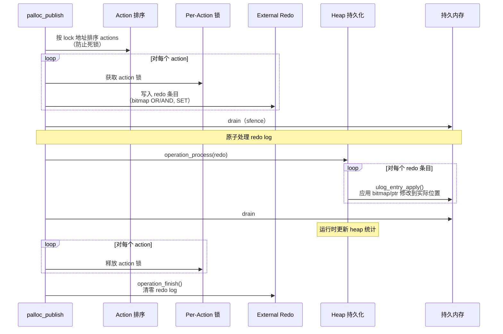
```mermaid
sequenceDiagram
    participant TX as palloc_publish
    participant ACT as Action 排序
    participant LOCK as Per-Action 锁
    participant REDO as External Redo
    participant HEAP as Heap 持久化
    participant PMEM as 持久内存

    TX->>ACT: 按 lock 地址排序 actions<br/>（防止死锁）

    loop 对每个 action
        TX->>LOCK: 获取 action 锁
        TX->>REDO: 写入 redo 条目<br/>（bitmap OR/AND, SET）
    end

    TX->>PMEM: drain（sfence）

    Note over TX,PMEM: 原子处理 redo log

    TX->>HEAP: operation_process(redo)
    loop 对每个 redo 条目
        HEAP->>PMEM: ulog_entry_apply()<br/>应用 bitmap/ptr 修改到实际位置
    end
    TX->>PMEM: drain

    Note over HEAP: 运行时更新 heap 统计

    loop 对每个 action
        TX->>LOCK: 释放 action 锁
    end

    TX->>REDO: operation_finish()<br/>清零 redo log
```

### 4.4 单条目优化

当 redo log 仅含一个 8 字节值操作时（`SET`/`AND`/`OR`），PMDK 跳过完整的 redo log 流程：

```c
// memops.c:778
if (redo_process && ctx->pshadow_ops.offset == sizeof(struct ulog_entry_val)) {
    ulog_entry_apply(e, 1, ctx->p_ops);  // 直接写入 8 字节
    redo_process = 0;  // 跳过 redo log
}
```

**原理**：x86 架构上，对齐的 8 字节写入是原子的（Single-Instruction Atomicity），无需 redo log 保护。

---

## 5. 事务提交原子性

### 5.1 提交流程的两阶段协议

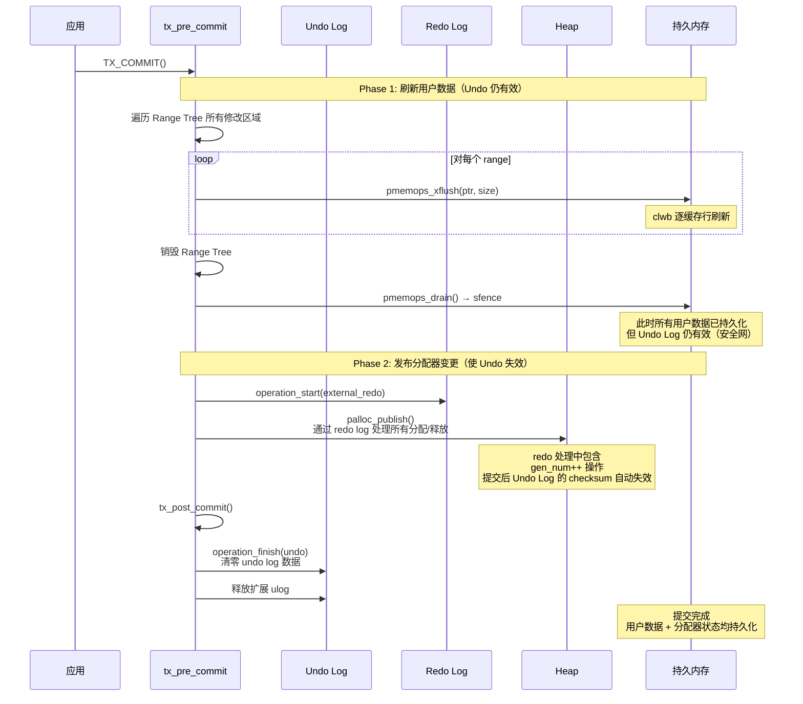
```mermaid
sequenceDiagram
    participant APP as 应用
    participant TX as tx_pre_commit
    participant UNDO as Undo Log
    participant REDO as Redo Log
    participant HEAP as Heap
    participant PMEM as 持久内存

    APP->>TX: TX_COMMIT()

    Note over TX,PMEM: Phase 1: 刷新用户数据（Undo 仍有效）

    TX->>TX: 遍历 Range Tree 所有修改区域
    loop 对每个 range
        TX->>PMEM: pmemops_xflush(ptr, size)
        Note over PMEM: clwb 逐缓存行刷新
    end
    TX->>TX: 销毁 Range Tree

    TX->>PMEM: pmemops_drain() → sfence
    Note over PMEM: 此时所有用户数据已持久化<br/>但 Undo Log 仍有效（安全网）

    Note over TX,PMEM: Phase 2: 发布分配器变更（使 Undo 失效）

    TX->>REDO: operation_start(external_redo)
    TX->>HEAP: palloc_publish()<br/>通过 redo log 处理所有分配/释放

    Note over HEAP: redo 处理中包含<br/>gen_num++ 操作<br/>提交后 Undo Log 的 checksum 自动失效

    TX->>TX: tx_post_commit()
    TX->>UNDO: operation_finish(undo)<br/>清零 undo log 数据
    TX->>UNDO: 释放扩展 ulog

    Note over PMEM: 提交完成<br/>用户数据 + 分配器状态均持久化
```

### 5.2 提交原子性的关键不变量

```
提交过程中的不变量：

1. Undo Log 始终有效 → 直到 gen_num 被 redo 递增
2. 用户数据先于分配器元数据持久化
3. gen_num 递增使 Undo Log 失效（无需显式清零）
4. 任何时刻崩溃，要么：
   - Undo Log 有效 → 回滚（gen_num 未变）
   - Undo Log 失效 → 已提交（gen_num 已递增）
```

### 5.3 Phase 1 与 Phase 2 的分离意义

```
Phase 1 (flush + drain) 失败 → Undo 恢复旧数据
Phase 2 (palloc_publish) 失败 → Undo 仍有效，恢复旧数据
                               但用户数据已持久化（幂等恢复：覆盖已持久化的正确数据）
Phase 2 完成 → gen_num++ 使 Undo 失效，不可回滚
```

---

## 6. 事务中止与回滚

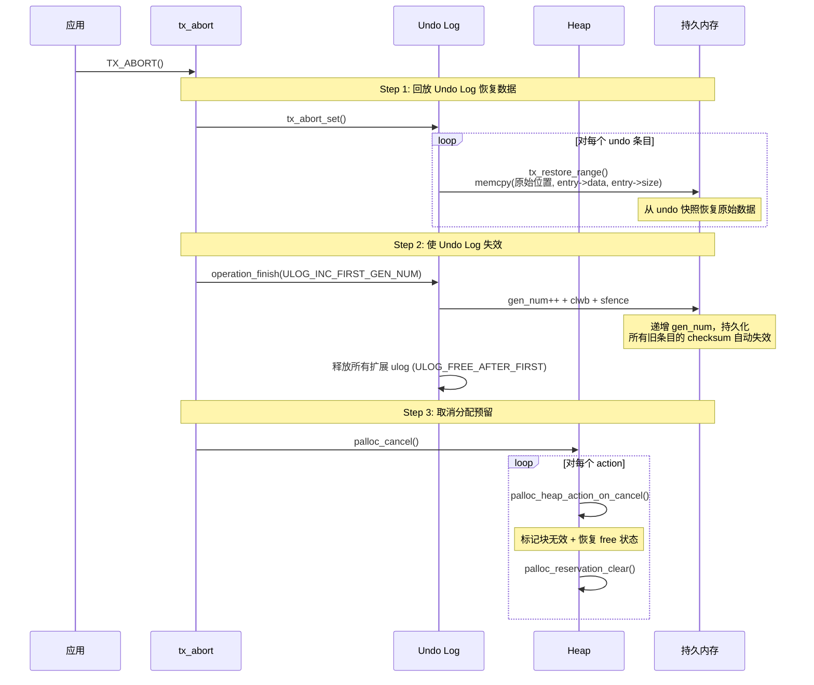
```mermaid
sequenceDiagram
    participant APP as 应用
    participant TX as tx_abort
    participant UNDO as Undo Log
    participant HEAP as Heap
    participant PMEM as 持久内存

    APP->>TX: TX_ABORT()

    Note over TX,PMEM: Step 1: 回放 Undo Log 恢复数据

    TX->>UNDO: tx_abort_set()
    loop 对每个 undo 条目
        UNDO->>PMEM: tx_restore_range()<br/>memcpy(原始位置, entry->data, entry->size)
        Note over PMEM: 从 undo 快照恢复原始数据
    end

    Note over TX,PMEM: Step 2: 使 Undo Log 失效

    TX->>UNDO: operation_finish(ULOG_INC_FIRST_GEN_NUM)
    UNDO->>PMEM: gen_num++ + clwb + sfence
    Note over PMEM: 递增 gen_num，持久化<br/>所有旧条目的 checksum 自动失效

    UNDO->>UNDO: 释放所有扩展 ulog (ULOG_FREE_AFTER_FIRST)

    Note over TX,PMEM: Step 3: 取消分配预留

    TX->>HEAP: palloc_cancel()
    loop 对每个 action
        HEAP->>HEAP: palloc_heap_action_on_cancel()
        Note over HEAP: 标记块无效 + 恢复 free 状态
        HEAP->>HEAP: palloc_reservation_clear()
    end
```

**中止的幂等性**：如果在 `tx_abort_set` 中途崩溃，恢复时 undo log 仍会再次回放。`BUF_CPY` 操作是幂等的（写入相同数据），因此多次回放不会导致不一致。

---

## 7. gen_num 代数追踪机制

### 7.1 gen_num 的核心作用

```
gen_num 是 Undo Log 和 Redo Log 之间的一致性桥梁：

事务开始 → 第一次 snapshot 时创建 redo action: gen_num++

成功提交 → palloc_publish 处理 redo → gen_num 实际递增
                                              ↓
                                    Undo 条目的 checksum 基于 old gen_num
                                              ↓
                                    checksum 不匹配 → 条目被视为无效
                                              ↓
                                    Undo Log 自动失效（无需显式清零）

中止回滚 → redo 不处理 → gen_num 不变 → Undo 条目仍有效
                                      ↓
                            operation_finish 直接递增 gen_num
                                      ↓
                            Undo Log 失效（安全清理）
```

### 7.2 gen_num 与 Checksum 的绑定

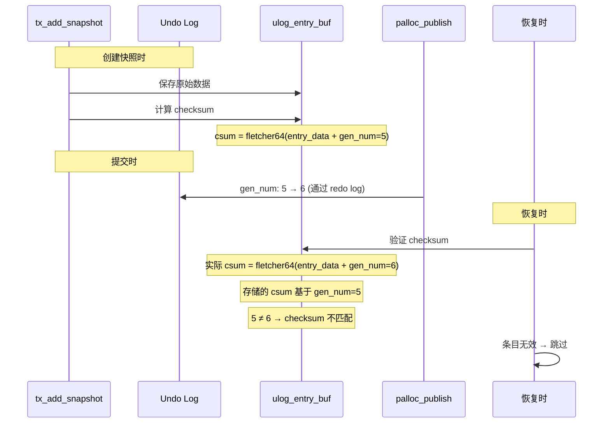
```mermaid
sequenceDiagram
    participant SNAPSHOT as tx_add_snapshot
    participant UNDO as Undo Log
    participant ENTRY as ulog_entry_buf
    participant COMMIT as palloc_publish
    participant RECOVER as 恢复时

    Note over SNAPSHOT,UNDO: 创建快照时

    SNAPSHOT->>ENTRY: 保存原始数据
    SNAPSHOT->>ENTRY: 计算 checksum
    Note over ENTRY: csum = fletcher64(entry_data + gen_num=5)

    Note over SNAPSHOT,UNDO: 提交时

    COMMIT->>UNDO: gen_num: 5 → 6 (通过 redo log)

    Note over RECOVER: 恢复时

    RECOVER->>ENTRY: 验证 checksum
    Note over ENTRY: 实际 csum = fletcher64(entry_data + gen_num=6)
    Note over ENTRY: 存储的 csum 基于 gen_num=5
    Note over ENTRY: 5 ≠ 6 → checksum 不匹配
    RECOVER->>RECOVER: 条目无效 → 跳过
```

### 7.3 gen_num 操作时机

| 场景 | gen_num 操作 | 方式 | 持久化 |
|---|---|---|---|
| 首次 snapshot | 创建 redo action（延迟） | palloc_set_value | 是（通过 redo） |
| 提交成功 | redo 处理时递增 | ulog 处理 | 是 |
| 中止回滚 | 直接递增 | ulog_inc_gen_num | 是（clwb+sfence） |
| 崩溃恢复 | 直接递增 | ulog_inc_gen_num | 是 |
| 中止时扩展 ulog | 递增（但不持久化） | ulog_inc_gen_num(NULL) | 否 |

---

## 8. Checksum 校验体系

### 8.1 三级 Checksum 层次

```
┌─────────────────────────────────────────────────┐
│ Level 1: Pool Checksum                          │
│   覆盖: 整个 pool descriptor                    │
│   验证: 每次 pool open                          │
│   用途: 检测 pool 元数据损坏                     │
├─────────────────────────────────────────────────┤
│ Level 2: ULOG Header Checksum                   │
│   覆盖: ulog header + base_nbytes 数据          │
│   算法: Fletcher64                              │
│   用途: 判断 redo/undo log 是否需要恢复          │
├─────────────────────────────────────────────────┤
│ Level 3: Entry Checksum (仅 BUF_CPY/BUF_SET)   │
│   覆盖: 整个条目数据 + ulog.gen_num             │
│   算法: Fletcher64 + fletcher64_seq             │
│   用途: 检测部分写入/区分有效/无效条目           │
└─────────────────────────────────────────────────┘
```

### 8.2 Fletcher64 算法

```c
// src/core/util.c:134
// 双 32 位累加器
uint64_t fletcher64(const void *data, size_t len) {
    lo32 = 0, hi32 = 0;
    for (each uint32_t word in data) {
        lo32 += le32toh(word);
        hi32 += lo32;
    }
    return (uint64_t)hi32 << 32 | lo32;
}
```

### 8.3 Checksum 判定逻辑

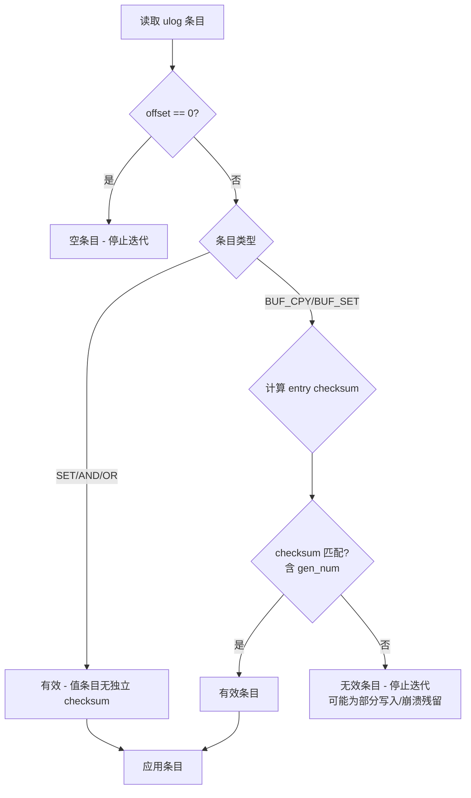
```mermaid
graph TD
    ENTRY[读取 ulog 条目] --> Z0{offset == 0?}
    Z0 -->|是| EMPTY[空条目 - 停止迭代]
    Z0 -->|否| TYPE{条目类型}

    TYPE -->|SET/AND/OR| VALID_8B[有效 - 值条目无独立 checksum]
    TYPE -->|BUF_CPY/BUF_SET| CS{计算 entry checksum}

    CS --> MATCH{checksum 匹配?<br/>含 gen_num}
    MATCH -->|是| VALID_BUF[有效条目]
    MATCH -->|否| INVALID[无效条目 - 停止迭代<br/>可能为部分写入/崩溃残留]

    VALID_8B --> APPLY[应用条目]
    VALID_BUF --> APPLY
```

### 8.4 扩展 Ulog 的 Checksum 策略

```
Base ULOG (预分配在 Lane 中):
  ├── Header checksum 覆盖: header + base_nbytes 数据
  └── 扩展链接: next → Extension ULOG

Extension ULOG (动态分配):
  ├── Header checksum: 仅覆盖 header 本身
  ├── 数据区域: 不被 base checksum 覆盖
  └── 条目级 checksum: 每个条目独立验证

设计原因: 扩展 ulog 的 base_nbytes = 0，
         其有效性完全依赖条目级 checksum。
```

---

## 9. 内存排序保证

### 9.1 Store Ordering 跨掉电

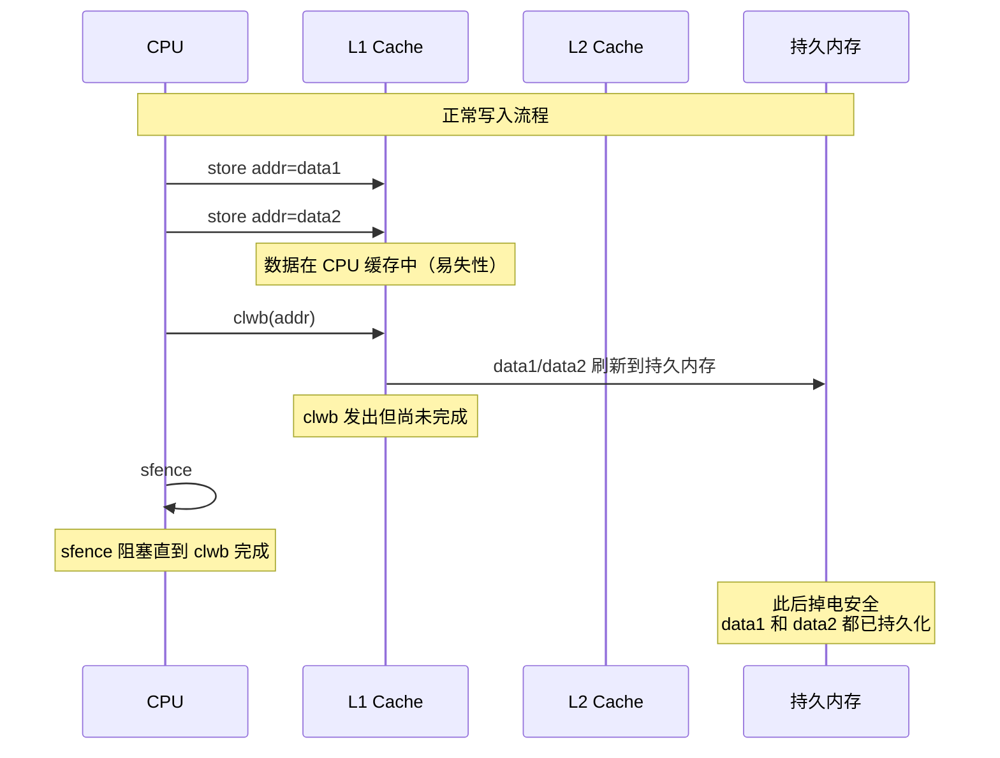
```mermaid
sequenceDiagram
    participant CPU as CPU
    participant L1 as L1 Cache
    participant L2 as L2 Cache
    participant PMEM as 持久内存

    Note over CPU,PMEM: 正常写入流程

    CPU->>L1: store addr=data1
    CPU->>L1: store addr=data2
    Note over L1: 数据在 CPU 缓存中（易失性）

    CPU->>L1: clwb(addr)
    L1->>PMEM: data1/data2 刷新到持久内存
    Note over L1: clwb 发出但尚未完成

    CPU->>CPU: sfence
    Note over CPU: sfence 阻塞直到 clwb 完成

    Note over PMEM: 此后掉电安全<br/>data1 和 data2 都已持久化
```

### 9.2 clwb vs clflushopt vs clflush

| 指令 | 行为 | 是否需要 sfence | 性能 |
|---|---|---|---|
| `clwb` | 写回缓存行，**不失效** | 是 | 最优（保留缓存副本） |
| `clflushopt` | 写回并失效缓存行 | 是 | 次优（后续访问需重新加载） |
| `clflush` | 写回并失效，**串行化** | 否（自带） | 最差（阻塞后续指令） |

### 9.3 事务提交中的排序保证

```
tx_pre_commit():
    flush(range1)  →  clwb × N
    flush(range2)  →  clwb × N
    ...
    drain()        →  sfence     ← 之前所有 clwb 完成后才继续

palloc_publish():
    redo_entry_apply(bitmap) → 直接内存写入
    ...
    drain()                    ← redo 修改也持久化
```

---

## 10. 崩溃恢复流程

### 10.1 恢复总时序

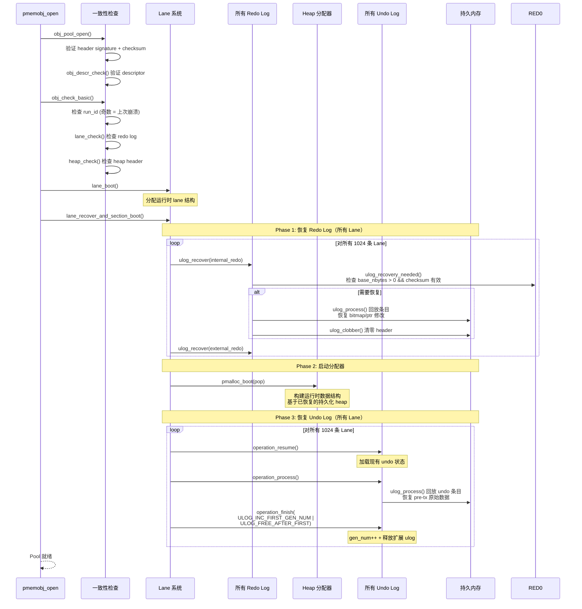
```mermaid
sequenceDiagram
    participant OPEN as pmemobj_open
    participant CHK as 一致性检查
    participant LANE as Lane 系统
    participant REDO as 所有 Redo Log
    participant HEAP as Heap 分配器
    participant UNDO as 所有 Undo Log
    participant PMEM as 持久内存

    OPEN->>CHK: obj_pool_open()
    CHK->>CHK: 验证 header signature + checksum
    CHK->>CHK: obj_descr_check() 验证 descriptor

    OPEN->>CHK: obj_check_basic()
    CHK->>CHK: 检查 run_id (奇数 = 上次崩溃)
    CHK->>CHK: lane_check() 检查 redo log
    CHK->>CHK: heap_check() 检查 heap header

    OPEN->>LANE: lane_boot()
    Note over LANE: 分配运行时 lane 结构

    OPEN->>LANE: lane_recover_and_section_boot()

    Note over LANE,PMEM: Phase 1: 恢复 Redo Log（所有 Lane）

    loop 对所有 1024 条 Lane
        LANE->>REDO: ulog_recover(internal_redo)
        REDO->>RED0: ulog_recovery_needed()<br/>检查 base_nbytes > 0 && checksum 有效
        alt 需要恢复
            REDO->>PMEM: ulog_process() 回放条目<br/>恢复 bitmap/ptr 修改
            REDO->>PMEM: ulog_clobber() 清零 header
        end
        LANE->>REDO: ulog_recover(external_redo)
    end

    Note over LANE,PMEM: Phase 2: 启动分配器

    LANE->>HEAP: pmalloc_boot(pop)
    Note over HEAP: 构建运行时数据结构<br/>基于已恢复的持久化 heap

    Note over LANE,PMEM: Phase 3: 恢复 Undo Log（所有 Lane）

    loop 对所有 1024 条 Lane
        LANE->>UNDO: operation_resume()
        Note over UNDO: 加载现有 undo 状态
        LANE->>UNDO: operation_process()
        UNDO->>PMEM: ulog_process() 回放 undo 条目<br/>恢复 pre-tx 原始数据
        LANE->>UNDO: operation_finish(<br/>ULOG_INC_FIRST_GEN_NUM |<br/>ULOG_FREE_AFTER_FIRST)
        Note over UNDO: gen_num++ + 释放扩展 ulog
    end

    OPEN-->>OPEN: Pool 就绪
```

### 10.2 Redo 先于 Undo 的严格顺序

```
为什么必须是 Redo → Boot → Undo？

┌──────────────┐     ┌──────────────┐     ┌──────────────┐
│  Redo 恢复    │     │  Heap 启动    │     │  Undo 恢复    │
│              │     │              │     │              │
│ 恢复分配器    │ ──→ │ 基于一致的    │ ──→ │ 可能需要释放   │
│ bitmap 状态   │     │ bitmap 构建   │     │ 扩展 ulog    │
│              │     │ 运行时结构     │     │              │
│ 使 heap      │     │              │     │ 释放需要      │
│ 元数据一致    │     │              │     │ 功能正常的    │
│              │     │              │     │ 分配器        │
└──────────────┘     └──────────────┘     └──────────────┘

如果 Undo 先恢复：undo 可能需要释放扩展 ulog 的内存块，
但此时分配器 bitmap 尚未恢复，释放操作会导致 heap 不一致。
```

---

## 11. 崩溃点分析：对象分配

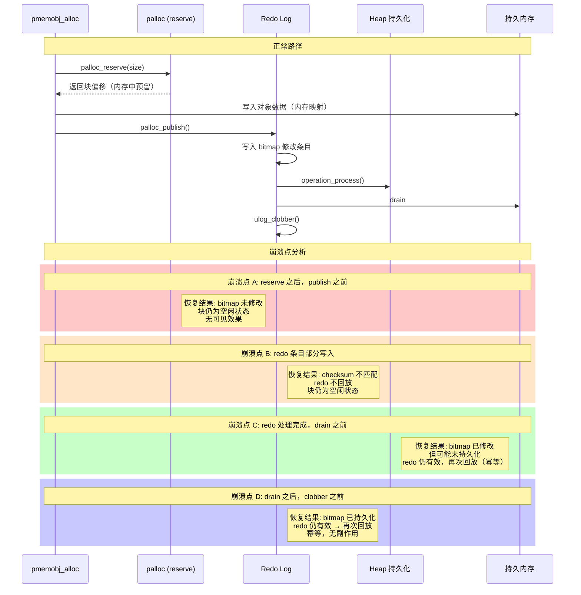
```mermaid
sequenceDiagram
    participant APP as pmemobj_alloc
    participant RESV as palloc (reserve)
    participant REDO as Redo Log
    participant HEAP as Heap 持久化
    participant PMEM as 持久内存

    Note over APP,PMEM: 正常路径

    APP->>RESV: palloc_reserve(size)
    RESV-->>APP: 返回块偏移（内存中预留）

    APP->>PMEM: 写入对象数据（内存映射）

    APP->>REDO: palloc_publish()
    REDO->>REDO: 写入 bitmap 修改条目
    REDO->>HEAP: operation_process()
    REDO->>PMEM: drain
    REDO->>REDO: ulog_clobber()

    Note over APP,PMEM: 崩溃点分析

    rect rgb(255, 200, 200)
        Note over APP,PMEM: 崩溃点 A: reserve 之后，publish 之前
        Note right of RESV: 恢复结果: bitmap 未修改<br/>块仍为空闲状态<br/>无可见效果
    end

    rect rgb(255, 230, 200)
        Note over APP,PMEM: 崩溃点 B: redo 条目部分写入
        Note right of REDO: 恢复结果: checksum 不匹配<br/>redo 不回放<br/>块仍为空闲状态
    end

    rect rgb(200, 255, 200)
        Note over APP,PMEM: 崩溃点 C: redo 处理完成，drain 之前
        Note right of HEAP: 恢复结果: bitmap 已修改<br/>但可能未持久化<br/>redo 仍有效，再次回放（幂等）
    end

    rect rgb(200, 200, 255)
        Note over APP,PMEM: 崩溃点 D: drain 之后，clobber 之前
        Note right of REDO: 恢复结果: bitmap 已持久化<br/>redo 仍有效 → 再次回放<br/>幂等，无副作用
    end
```

---

## 12. 崩溃点分析：事务提交

### 12.1 提交六个崩溃点

```
时间轴:
                    │       │          │           │              │            │
TX_COMMIT()         │       │          │           │              │            │
  ├─ tx_pre_commit()│       │          │           │              │            │
  │   flush ranges  │       │          │           │              │            │
  │   destroy tree  │       │          │           │              │            │
  ├─ drain()        │       │          │           │              │            │
  ├─ operation_start│       │          │           │              │            │
  ├─ palloc_publish │       │          │           │              │            │
  │   ├─ redo_apply │       │          │           │              │            │
  │   └─ drain      │       │          │           │              │            │
  ├─ tx_post_commit │       │          │           │              │            │
  └─ lane_release   │       │          │           │              │            │
                    │       │          │           │              │            │
崩溃点:             CP1     CP2        CP3         CP4            CP5          CP6
```

### 12.2 各崩溃点恢复结果

| 崩溃点 | 位置 | 用户数据 | 分配器 | Undo Log | gen_num | 恢复结果 |
|---|---|---|---|---|---|---|
| CP1 | pre_commit 之前 | 可能部分修改 | 未变更 | 有效 | 旧值 | **回滚**：undo 恢复旧数据 |
| CP2 | flush 后、drain 前 | 在 CPU 缓存中 | 未变更 | 有效 | 旧值 | **回滚**：undo 恢复（幂等覆盖已缓存数据） |
| CP3 | drain 后、publish 前 | **已持久化** | 未变更 | 有效 | 旧值 | **回滚**：undo 覆盖已持久化数据（幂等） |
| CP4 | publish 中 | 已持久化 | 部分变更 | 有效 | 旧值 | **回滚**：redo 不完整则不回放 |
| CP5 | publish 后、post_commit 前 | 已持久化 | 已变更 | 有效 | **新值** | **已提交**：undo 失效（gen_num 已变），条目被跳过 |
| CP6 | post_commit 之后 | 已持久化 | 已变更 | **已清零** | 新值 | **已提交**：undo log 不存在 |

### 12.3 关键观察

```
CP3 是最有意思的崩溃点：
- 用户数据已持久化（正确的最终值）
- 但 undo log 仍有效（gen_num 未变）
- 恢复时 undo 回放会"覆盖"已持久化的正确数据
- 这是安全的！因为 undo 保存的是旧数据，覆盖后回到 pre-tx 状态
- 分配器未 publish → 预留块未激活 → 逻辑上分配未完成

CP5 是提交的实际完成点：
- palloc_publish 中 redo 处理了 gen_num++ action
- gen_num 变化使 undo 条目 checksum 失效
- 恢复时 undo 条目被跳过 → 不回滚
- 用户数据 + 分配器状态均一致
```

---

## 13. 崩溃点分析：事务中止

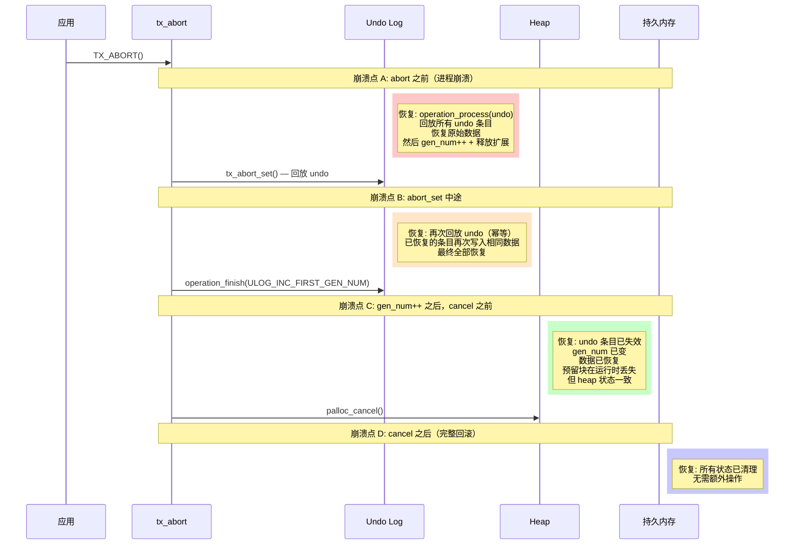
```mermaid
sequenceDiagram
    participant APP as 应用
    participant TX as tx_abort
    participant UNDO as Undo Log
    participant HEAP as Heap
    participant PMEM as 持久内存

    APP->>TX: TX_ABORT()

    Note over TX,PMEM: 崩溃点 A: abort 之前（进程崩溃）

    rect rgb(255, 200, 200)
        Note right of UNDO: 恢复: operation_process(undo)<br/>回放所有 undo 条目<br/>恢复原始数据<br/>然后 gen_num++ + 释放扩展
    end

    TX->>UNDO: tx_abort_set() — 回放 undo

    Note over TX,PMEM: 崩溃点 B: abort_set 中途

    rect rgb(255, 230, 200)
        Note right of UNDO: 恢复: 再次回放 undo（幂等）<br/>已恢复的条目再次写入相同数据<br/>最终全部恢复
    end

    TX->>UNDO: operation_finish(ULOG_INC_FIRST_GEN_NUM)

    Note over TX,PMEM: 崩溃点 C: gen_num++ 之后，cancel 之前

    rect rgb(200, 255, 200)
        Note right of HEAP: 恢复: undo 条目已失效<br/>gen_num 已变<br/>数据已恢复<br/>预留块在运行时丢失<br/>但 heap 状态一致
    end

    TX->>HEAP: palloc_cancel()

    Note over TX,PMEM: 崩溃点 D: cancel 之后（完整回滚）

    rect rgb(200, 200, 255)
        Note right of PMEM: 恢复: 所有状态已清理<br/>无需额外操作
    end
```

---

## 14. Range 追踪与重叠处理

### 14.1 Range Tree 结构

事务使用 RAVL（Red-Black AVL Tree）追踪所有已快照的内存区域：

```c
struct tx_range_def {
    uint64_t offset;  // Pool 内偏移
    uint64_t size;    // 大小
    uint64_t flags;   // 标志（如 POBJ_FLAG_NO_FLUSH）
};
```

### 14.2 重叠处理五种场景

```
场景 1: 新范围完全在已有范围内
已有: [100, 300)    新: [150, 200)
结果: 无需额外快照（已有快照覆盖）

场景 2: 新范围向左扩展
已有: [200, 300)    新: [100, 250)
结果: 快照 [100, 200)，扩展已有 range 为 [100, 300)

场景 3: 新范围向右扩展
已有: [100, 200)    新: [150, 300)
结果: 快照 [200, 300)，扩展已有 range 为 [100, 300)

场景 4: 新范围完全覆盖已有范围
已有: [150, 250)    新: [100, 300)
结果: 快照 [100, 150) + [250, 300)，合并为 [100, 300)

场景 5: 相邻范围合并
已有: [100, 200)    新: [200, 300)
结果: 无需快照（相邻），合并为 [100, 300)
```

### 14.3 重叠处理时序

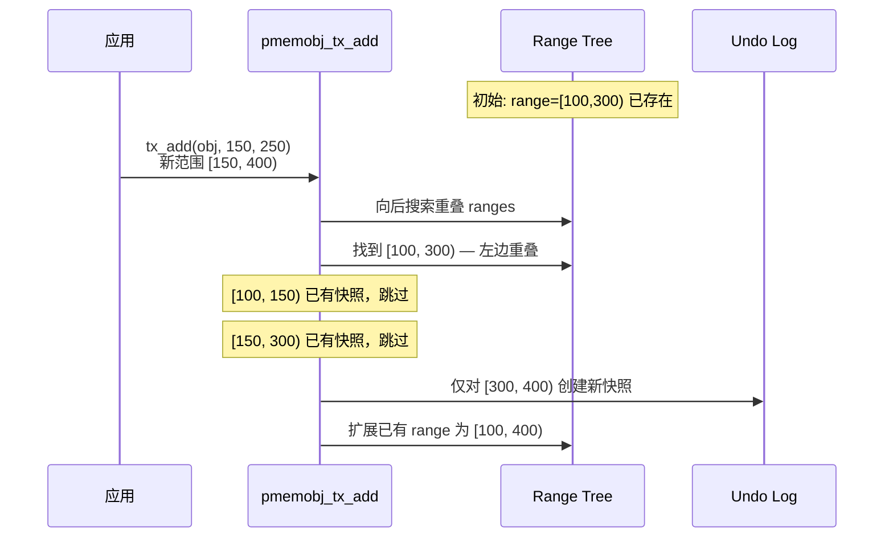
```mermaid
sequenceDiagram
    participant APP as 应用
    participant TX as pmemobj_tx_add
    participant RAVL as Range Tree
    participant UNDO as Undo Log

    Note over RAVL: 初始: range=[100,300) 已存在

    APP->>TX: tx_add(obj, 150, 250)<br/>新范围 [150, 400)

    TX->>RAVL: 向后搜索重叠 ranges

    TX->>RAVL: 找到 [100, 300) — 左边重叠
    Note over TX: [100, 150) 已有快照，跳过
    Note over TX: [150, 300) 已有快照，跳过

    TX->>UNDO: 仅对 [300, 400) 创建新快照
    TX->>RAVL: 扩展已有 range 为 [100, 400)
```

---

## 15. 事务状态机

### 15.1 五个阶段

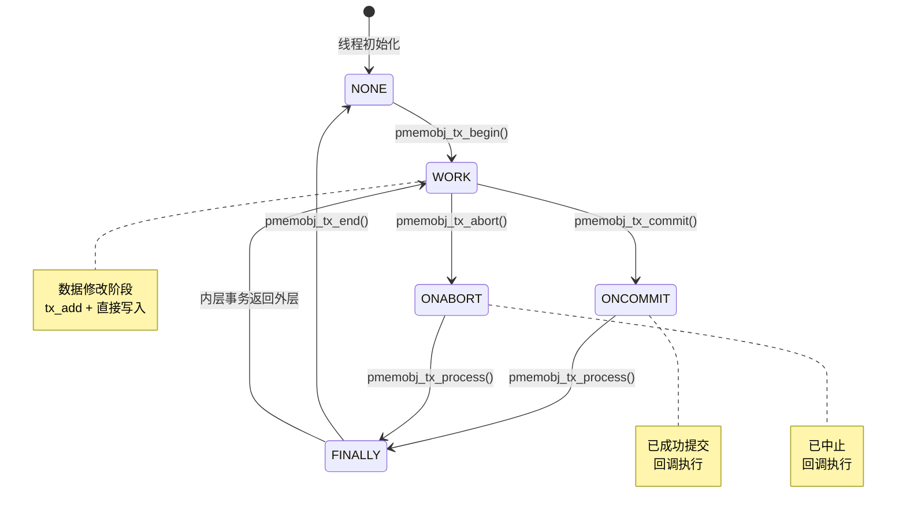
```mermaid
stateDiagram-v2
    [*] --> NONE: 线程初始化
    NONE --> WORK: pmemobj_tx_begin()
    WORK --> ONCOMMIT: pmemobj_tx_commit()
    WORK --> ONABORT: pmemobj_tx_abort()
    ONCOMMIT --> FINALLY: pmemobj_tx_process()
    ONABORT --> FINALLY: pmemobj_tx_process()
    FINALLY --> NONE: pmemobj_tx_end()
    FINALLY --> WORK: 内层事务返回外层

    note right of WORK: 数据修改阶段<br/>tx_add + 直接写入
    note right of ONCOMMIT: 已成功提交<br/>回调执行
    note right of ONABORT: 已中止<br/>回调执行
```

### 15.2 状态转换规则

| 当前状态 | 允许操作 | 目标状态 |
|---|---|---|
| `TX_STAGE_NONE` | `pmemobj_tx_begin()` | `TX_STAGE_WORK` |
| `TX_STAGE_WORK` | `pmemobj_tx_commit()` | `TX_STAGE_ONCOMMIT` |
| `TX_STAGE_WORK` | `pmemobj_tx_abort()` | `TX_STAGE_ONABORT` |
| `TX_STAGE_ONCOMMIT` | `pmemobj_tx_process()` | `TX_STAGE_FINALLY` |
| `TX_STAGE_ONABORT` | `pmemobj_tx_process()` | `TX_STAGE_FINALLY` |
| `TX_STAGE_FINALLY` | `pmemobj_tx_end()` | `TX_STAGE_NONE`（外层）或 `TX_STAGE_WORK`（内层） |

### 15.3 非法转换保护

```c
// 以下断言在运行时检查：
ASSERT_IN_TX()       // stage != TX_STAGE_NONE（必须在事务中）
ASSERT_TX_STAGE_WORK() // stage == TX_STAGE_WORK（必须在工作阶段）

// 非法操作示例：
// pmemobj_tx_add() 在 TX_STAGE_ONCOMMIT 调用 → FATAL
// pmemobj_tx_commit() 在 TX_STAGE_NONE 调用 → FATAL
```

---

## 16. Pool 一致性检查

### 16.1 Pool Open 检查序列

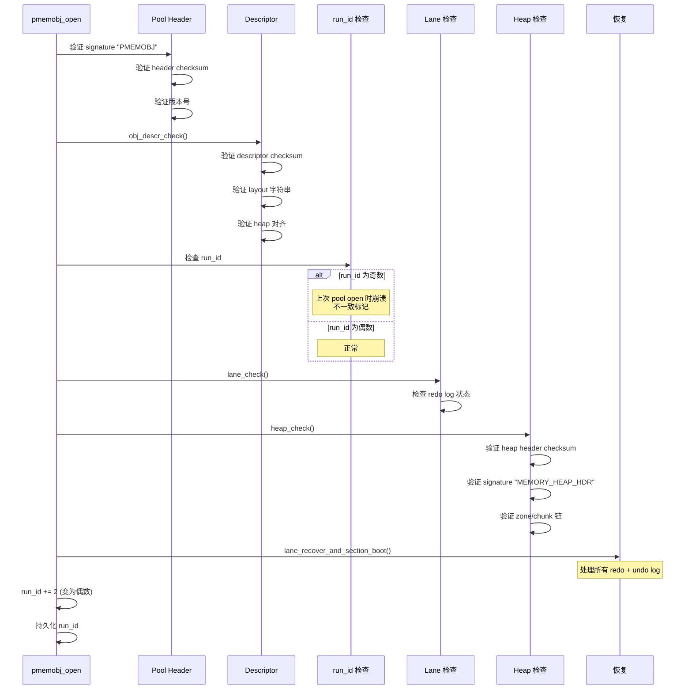
```mermaid
sequenceDiagram
    participant OPEN as pmemobj_open
    participant HDR as Pool Header
    participant DSC as Descriptor
    participant RUN as run_id 检查
    participant LANE_CHK as Lane 检查
    participant HEAP_CHK as Heap 检查
    participant RECOVER as 恢复

    OPEN->>HDR: 验证 signature "PMEMOBJ"
    HDR->>HDR: 验证 header checksum
    HDR->>HDR: 验证版本号

    OPEN->>DSC: obj_descr_check()
    DSC->>DSC: 验证 descriptor checksum
    DSC->>DSC: 验证 layout 字符串
    DSC->>DSC: 验证 heap 对齐

    OPEN->>RUN: 检查 run_id
    alt run_id 为奇数
        Note over RUN: 上次 pool open 时崩溃<br/>不一致标记
    else run_id 为偶数
        Note over RUN: 正常
    end

    OPEN->>LANE_CHK: lane_check()
    LANE_CHK->>LANE_CHK: 检查 redo log 状态

    OPEN->>HEAP_CHK: heap_check()
    HEAP_CHK->>HEAP_CHK: 验证 heap header checksum
    HEAP_CHK->>HEAP_CHK: 验证 signature "MEMORY_HEAP_HDR"
    HEAP_CHK->>HEAP_CHK: 验证 zone/chunk 链

    OPEN->>RECOVER: lane_recover_and_section_boot()
    Note over RECOVER: 处理所有 redo + undo log

    OPEN->>OPEN: run_id += 2 (变为偶数)
    OPEN->>OPEN: 持久化 run_id
```

### 16.2 libpmempool 检查工具

```
检查管线（按顺序）:

1. check_bad_blocks   — 底层存储坏块检测
2. check_backup       — 创建备份（修复前）
3. check_sds          — Shutdown State 验证
4. check_pool_hdr     — Pool Header 校验和/签名/UUID
5. check_pool_hdr_uuids — 副本间 UUID 链路验证

检查结果:
├── CHECK_RESULT_CONSISTENT     — 健康
├── CHECK_RESULT_REPAIRED       — 已修复
├── CHECK_RESULT_NOT_CONSISTENT — 不可修复
├── CHECK_RESULT_CANNOT_REPAIR  — 需要 ADVANCED 模式
└── CHECK_RESULT_ASK_QUESTIONS  — 需要用户确认
```

---

## 17. 多副本一致性

### 17.1 副本同步机制

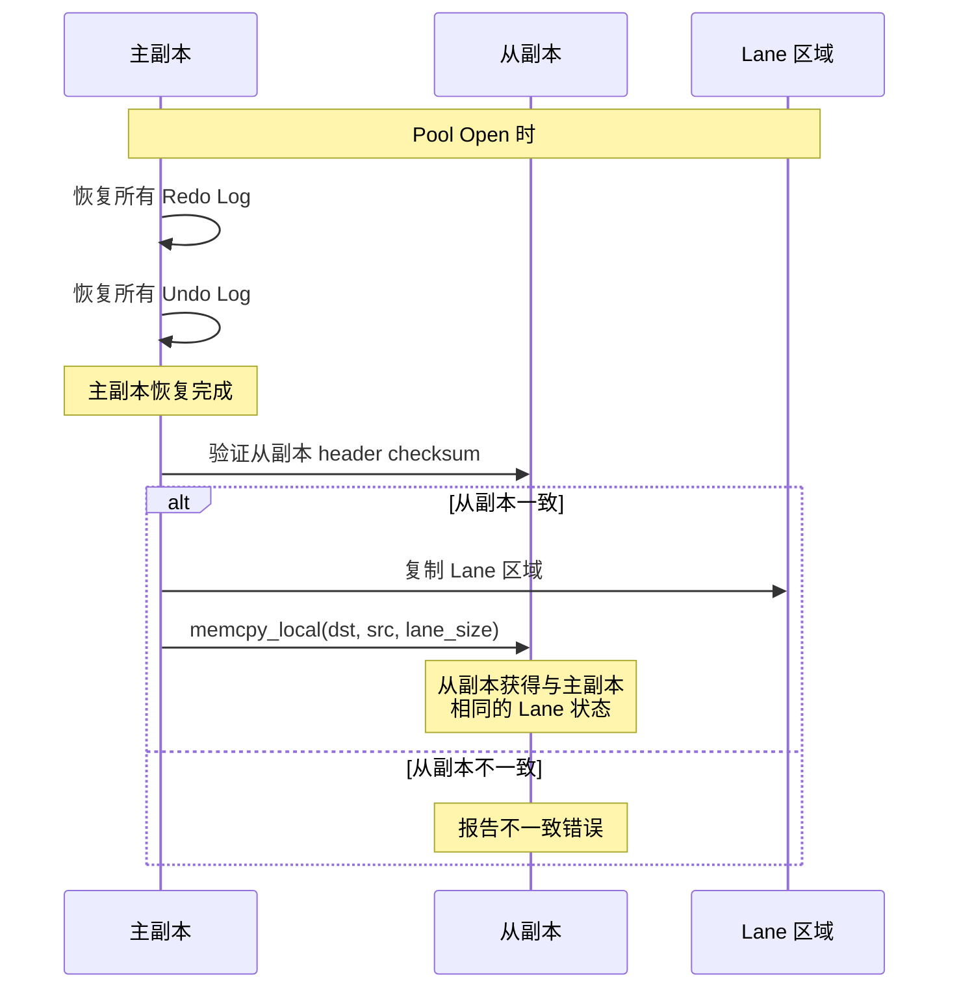
```mermaid
sequenceDiagram
    participant MASTER as 主副本
    participant REPLICA as 从副本
    participant LANE as Lane 区域

    Note over MASTER,LANE: Pool Open 时

    MASTER->>MASTER: 恢复所有 Redo Log
    MASTER->>MASTER: 恢复所有 Undo Log
    Note over MASTER: 主副本恢复完成

    MASTER->>REPLICA: 验证从副本 header checksum

    alt 从副本一致
        MASTER->>LANE: 复制 Lane 区域
        MASTER->>REPLICA: memcpy_local(dst, src, lane_size)
        Note over REPLICA: 从副本获得与主副本<br/>相同的 Lane 状态
    else 从副本不一致
        Note over REPLICA: 报告不一致错误
    end
```

### 17.2 UUID 链路验证

```
副本间通过 UUID 链路保证拓扑正确:

Pool Part 0 ←→ Part 1 ←→ Part 2
     ↓ prev_part_uuid / next_part_uuid
     ↑

Replica 0 ←→ Replica 1 ←→ Replica 2
     ↓ prev_repl_uuid / next_repl_uuid
     ↑

每个 Part 存储:
  - uuid (自身)
  - prev_part_uuid (前一个 Part)
  - next_part_uuid (后一个 Part)
  - prev_repl_uuid (前一个 Replica 的对应 Part)
  - next_repl_uuid (后一个 Replica 的对应 Part)
  - poolset_uuid (所有 Part 共享)
```

---

## 18. 与 DAOS 一致性的对比

| 特性 | PMDK (libpmemobj) | DAOS (VOS) |
|---|---|---|
| 日志类型 | Undo Log + Redo Log | ILOG (Incarnation Log) |
| 分配器保护 | Redo Log（internal + external） | VEA Reserve-Publish + PMDK 事务 |
| 用户数据保护 | Undo Log（快照旧数据） | PMDK 事务（DAOS 基于 PMDK） |
| 版本管理 | gen_num（单值递增） | epoch（全局逻辑时钟） |
| 检测机制 | Fletcher64 + gen_num 绑定 | CRC/checksum + epoch 比较 |
| 恢复顺序 | Redo → Boot → Undo | Redo → Boot → Undo（继承自 PMDK） |
| 分布式事务 | 不支持（单机） | DTX（两阶段提交 + CoS） |
| 副本一致性 | Lane 区域复制 | Leader-Follower RPC 复制 |
| 并发控制 | Lane CAS（1024 条） | B+tree 乐观并发 + 锁 |

**关键关系**：DAOS 的 VOS 层基于 PMDK 构建，继承并扩展了 PMDK 的一致性机制。DAOS 在 PMDK Undo Log 之上增加了 ILOG 版本追踪和分布式事务（DTX）。

---

## 19. 对比总结

### 19.1 一致性机制对比表

| 机制 | PMDK | RocksDB | SQLite | ext4 |
|---|---|---|---|---|
| 日志类型 | Undo + Redo | WAL (Redo) | WAL (Redo) | JBD2 (Redo) |
| 原子操作 | clwb + sfence | fsync | fsync | journal commit |
| 延迟 | ~100ns | ~ms | ~ms | ~ms |
| 回滚方式 | Undo Log 快照恢复 | WAL 回放反向操作 | 回滚 WAL | 回滚 journal |
| 并发 | Lane (1024) | 无锁 memtable | WAL + SHM | journaling |
| 崩溃恢复 | Checksum + gen_num | Sequence + checksum | Checksum | Checksum + journal |

### 19.2 PMDK 一致性保证总结

| 保证类型 | 实现机制 | 强度 |
|---|---|---|
| **原子性** | Undo Log + 两阶段提交 | 强（任何时刻崩溃要么全做要么全不做） |
| **持久性** | clwb + sfence + drain | 强（drain 完成后数据必定到达 PMEM） |
| **隔离性** | Lane CAS + per-thread undo | 中（同 range 并发需应用层加锁） |
| **一致性** | Redo 恢复分配器 + Undo 恢复数据 | 强（Redo-before-Undo 保证全局一致） |
| **幂等性** | BUF_CPY 幂等 + 单条目原子 | 强（多次恢复不导致不一致） |

---

## 20. 源码索引

### 事务核心

| 文件 | 内容 |
|---|---|
| `src/libpmemobj/tx.c` | 事务 API、`tx_pre_commit`、`tx_post_commit`、`tx_abort`、`tx_abort_set`、range 追踪 |
| `src/libpmemobj/tx.h` | 事务内部结构、`struct tx` |
| `src/include/libpmemobj/tx_base.h` | `enum pobj_tx_stage` 状态枚举 |

### 日志系统

| 文件 | 内容 |
|---|---|
| `src/libpmemobj/ulog.h` | `struct ulog`、条目类型宏、标志位 |
| `src/libpmemobj/ulog.c` | `ulog_recover`、`ulog_process`、`ulog_clobber`、`ulog_entry_buf_create`、checksum 验证 |
| `src/libpmemobj/memops.c` | `operation_resume`、`operation_process`、`operation_finish` |
| `src/libpmemobj/memops.h` | `struct operation_context` |

### 分配器

| 文件 | 内容 |
|---|---|
| `src/libpmemobj/palloc.c` | `palloc_publish`、`palloc_cancel`、`palloc_exec_actions` |
| `src/libpmemobj/heap.c` | `heap_boot`、`heap_check`、`heap_verify_header`、`heap_verify_zone` |

### Lane 并发

| 文件 | 内容 |
|---|---|
| `src/libpmemobj/lane.h` | `struct lane_layout`、Lane 大小常量 |
| `src/libpmemobj/lane.c` | `lane_recover_and_section_boot`、`lane_hold`/`lane_release` |

### Pool 管理

| 文件 | 内容 |
|---|---|
| `src/libpmemobj/obj.c` | `pmemobj_open`、`obj_check_basic`、`obj_descr_check`、`run_id` |
| `src/libpmemobj/obj.h` | `struct PMEMobjpool` |

### Checksum

| 文件 | 内容 |
|---|---|
| `src/core/util.c` | `util_checksum`、`util_checksum_compute`、`util_checksum_seq`（Fletcher64） |
| `src/core/util.h` | Checksum 函数声明 |

### 持久化原语

| 文件 | 内容 |
|---|---|
| `src/libpmem/pmem.c` | `pmem_persist`、`pmem_flush`、`pmem_drain` |
| `src/libpmem2/x86_64/flush.h` | `clwb`、`clflushopt`、`clflush` 内联实现 |
| `src/libpmem2/x86_64/init.c` | CPU 特性检测、函数指针绑定 |
| `src/libpmem2/x86_64/cpu.c` | CPUID 特性枚举 |

### 一致性检查工具

| 文件 | 内容 |
|---|---|
| `src/libpmempool/check.c` | 检查管线编排 |
| `src/libpmempool/check_pool_hdr.c` | Header 检查与修复 |
| `src/libpmempool/check_sds.c` | Shutdown State 检查 |
| `src/libpmempool/check_util.c` | 检查工具框架 |
