# PMDK 线程模型分析

## 目录

1. [概述](#1-概述)
2. [锁层次结构总览](#2-锁层次结构总览)
3. [Lane 并发机制](#3-lane-并发机制)
4. [Lane 分配时序](#4-lane-分配时序)
5. [Arena 分片模型](#5-arena-分片模型)
6. [Bucket 与 Run 锁](#6-bucket-与-run-锁)
7. [PMEM 持久化锁](#7-pmem-持久化锁)
8. [锁与事务的集成](#8-锁与事务的集成)
9. [Critnib 并发数据结构](#9-critnib-并发数据结构)
10. [Pool 级别同步](#10-pool-级别同步)
11. [多副本复制线程模型](#11-多副本复制线程模型)
12. [线程生命周期管理](#12-线程生命周期管理)
13. [并发分配完整时序](#13-并发分配完整时序)
14. [并发事务完整时序](#14-并发事务完整时序)
15. [libpmem2 线程安全模型](#15-libpmem2-线程安全模型)
16. [对比总结](#16-对比总结)
17. [源码索引](#17-源码索引)

---

## 1. 概述

PMDK 的线程模型围绕 **Lane（事务并发）** 和 **Arena（分配并发）** 两大分片机制构建，通过多级锁层次实现高并发：

| 机制 | 并发维度 | 最大并行度 | 锁类型 |
|---|---|---|---|
| Lane | 事务/分配操作 | 1024 | CAS（uint64） |
| Arena | 堆分配 | CPU 核数 | os_mutex（全局 arena 锁） |
| Bucket | 分配类内竞争 | Arena × Class | os_mutex |
| Run Lock | Chunk 位图修改 | 65528（hash） | os_mutex |
| PMEM Lock | 用户数据保护 | 嵌入对象中 | os_mutex/rwlock/cond |
| Pool Mutex | Pool 生命周期 | 1（全局） | os_mutex |

核心设计原则：

- **Lane 隔离事务**：每个事务独占 Lane，redo/undo log 互不干扰
- **Arena 分片分配**：按 CPU 核数分片，每线程绑定一个 Arena，减少 bucket 竞争
- **CAS 优先**：Lane 锁和 Arena 初始化使用 CAS，减少锁开销
- **锁排序防死锁**：arenas.lock → bucket → run_lock → memory_block，严格顺序

---

## 2. 锁层次结构总览

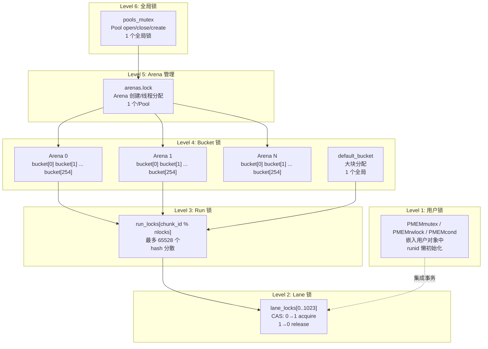
```mermaid
graph TB
    subgraph "Level 6: 全局锁"
        PM["pools_mutex<br/>Pool open/close/create<br/>1 个全局锁"]
    end

    subgraph "Level 5: Arena 管理"
        AL["arenas.lock<br/>Arena 创建/线程分配<br/>1 个/Pool"]
    end

    subgraph "Level 4: Bucket 锁"
        B1["Arena 0<br/>bucket[0] bucket[1] ... bucket[254]"]
        B2["Arena 1<br/>bucket[0] bucket[1] ... bucket[254]"]
        BN["Arena N<br/>bucket[0] bucket[1] ... bucket[254]"]
        DB["default_bucket<br/>大块分配<br/>1 个全局"]
    end

    subgraph "Level 3: Run 锁"
        RL1["run_locks[chunk_id % nlocks]<br/>最多 65528 个<br/>hash 分散"]
    end

    subgraph "Level 2: Lane 锁"
        LL["lane_locks[0..1023]<br/>CAS: 0→1 acquire<br/>1→0 release"]
    end

    subgraph "Level 1: 用户锁"
        PL["PMEMmutex / PMEMrwlock / PMEMcond<br/>嵌入用户对象中<br/>runid 懒初始化"]
    end

    PM --> AL
    AL --> B1
    AL --> B2
    AL --> BN
    B1 --> RL1
    B2 --> RL1
    DB --> RL1
    RL1 --> LL
    PL -.->|"集成事务"| LL
```

---

## 3. Lane 并发机制

### 3.1 Lane 布局

每条 Lane 在持久内存中占 3072 字节，包含三个日志区域：

```
Lane Layout (3072B)
├── Internal Redo (192B)  — 分配器 bitmap 操作
├── External Redo (640B)  — 大型分配操作（可扩展）
└── Undo Log     (2048B)  — 事务快照（可扩展）
```

默认 Lane 数量由 Pool 大小决定（最大 1024）。

### 3.2 Lane 获取策略

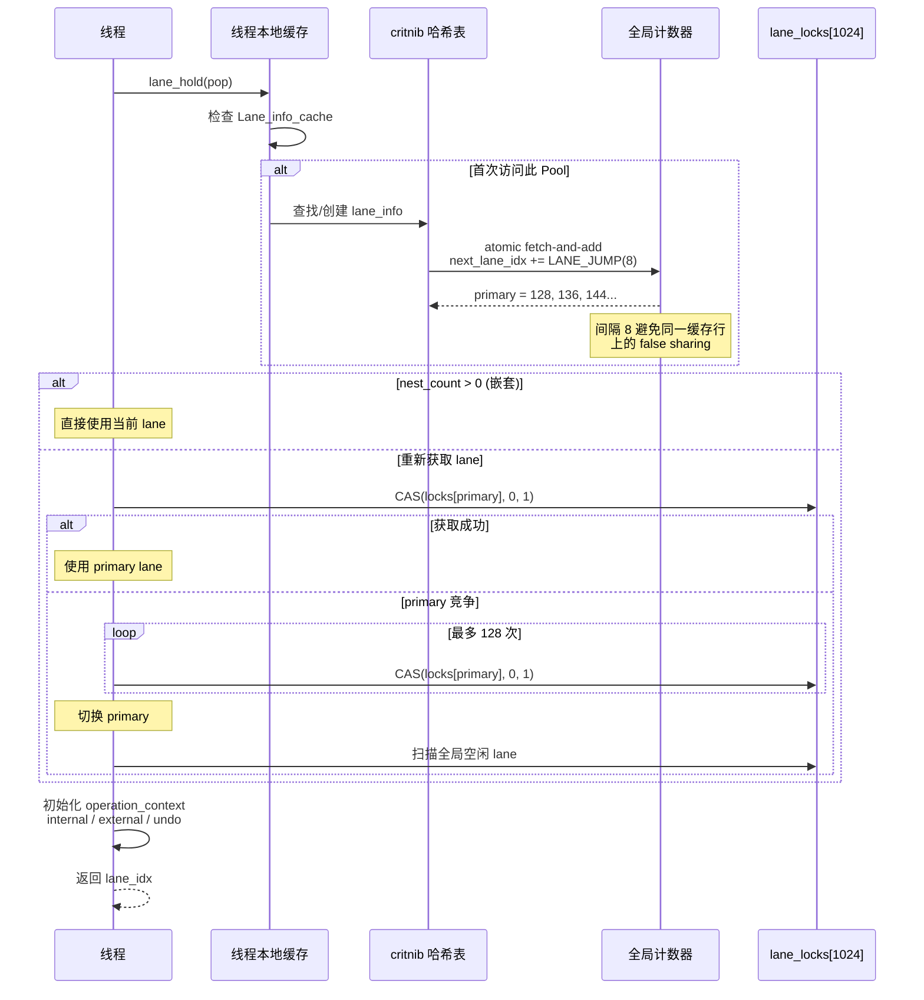
```mermaid
sequenceDiagram
    participant T as 线程
    participant CACHE as 线程本地缓存
    participant HT as critnib 哈希表
    participant COUNTER as 全局计数器
    participant LOCKS as lane_locks[1024]

    T->>CACHE: lane_hold(pop)
    CACHE->>CACHE: 检查 Lane_info_cache

    alt 首次访问此 Pool
        CACHE->>HT: 查找/创建 lane_info
        HT->>COUNTER: atomic fetch-and-add<br/>next_lane_idx += LANE_JUMP(8)
        COUNTER-->>HT: primary = 128, 136, 144...
        Note over COUNTER: 间隔 8 避免同一缓存行<br/>上的 false sharing
    end

    alt nest_count > 0 (嵌套)
        Note over T: 直接使用当前 lane
    else 重新获取 lane
        T->>LOCKS: CAS(locks[primary], 0, 1)
        alt 获取成功
            Note over T: 使用 primary lane
        else primary 竞争
            loop 最多 128 次
                T->>LOCKS: CAS(locks[primary], 0, 1)
            end
            Note over T: 切换 primary
            T->>LOCKS: 扫描全局空闲 lane
        end
    end

    T->>T: 初始化 operation_context<br/>internal / external / undo

    T-->>T: 返回 lane_idx
```

### 3.3 Lane 分配参数

| 参数 | 值 | 说明 |
|---|---|---|
| `LANE_JUMP` | 8 | 新线程间隔（64B/sizeof(uint64)），防 false sharing |
| `LANE_PRIMARY_ATTEMPTS` | 128 | primary lane 最大重试次数 |
| `LANE_TOTAL_SIZE` | 3072B | 每条 Lane 大小 |
| `OBJ_NLANES` | 1024 | Lane 数量上限 |

### 3.4 Lane 并发隔离

```
线程 A: Lane 0  ──→  redo(0) + undo(0)  ──→  独立日志空间
线程 B: Lane 8  ──→  redo(8) + undo(8)  ──→  独立日志空间
线程 C: Lane 16 ──→  redo(16) + undo(16) ──→  独立日志空间

无共享日志 → 无锁并发 → 完全隔离
```

---

## 4. Lane 分配时序

### 4.1 Primary Lane 自适应切换

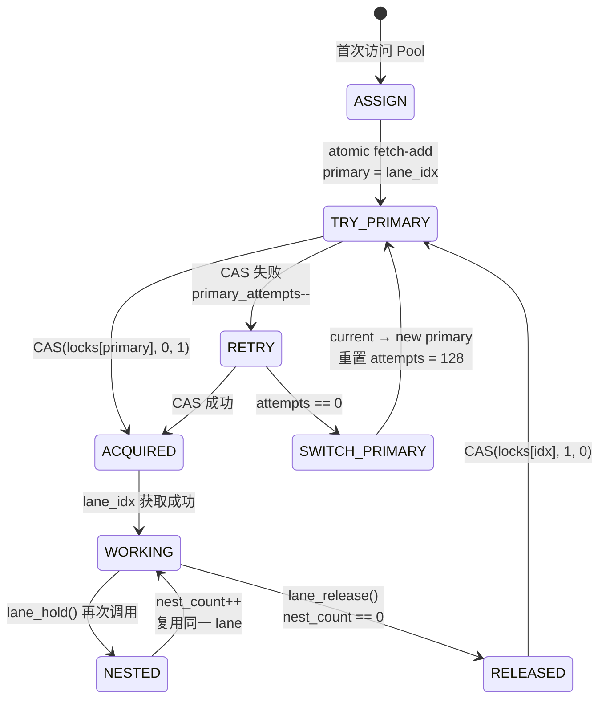
```mermaid
stateDiagram-v2
    [*] --> ASSIGN: 首次访问 Pool
    ASSIGN --> TRY_PRIMARY: atomic fetch-add<br/>primary = lane_idx

    TRY_PRIMARY --> ACQUIRED: CAS(locks[primary], 0, 1)
    TRY_PRIMARY --> RETRY: CAS 失败<br/>primary_attempts--
    RETRY --> ACQUIRED: CAS 成功
    RETRY --> SWITCH_PRIMARY: attempts == 0
    SWITCH_PRIMARY --> TRY_PRIMARY: current → new primary<br/>重置 attempts = 128

    ACQUIRED --> WORKING: lane_idx 获取成功
    WORKING --> NESTED: lane_hold() 再次调用
    NESTED --> WORKING: nest_count++<br/>复用同一 lane
    WORKING --> RELEASED: lane_release()<br/>nest_count == 0
    RELEASED --> TRY_PRIMARY: CAS(locks[idx], 1, 0)
```

**自适应意义**：当 primary lane 被频繁占用时，线程不再反复竞争同一条 Lane，而是接受另一条 Lane 作为新的 primary，减少 CAS 竞争。

---

## 5. Arena 分片模型

### 5.1 Arena 架构

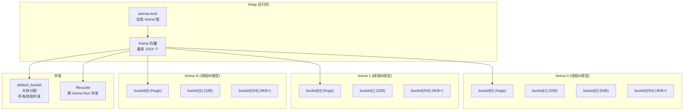
```mermaid
graph TB
    subgraph "Heap 运行时"
        AL["arenas.lock<br/>全局 Arena 锁"]
        AV["Arena 向量<br/>最多 1024 个"]
    end

    subgraph "Arena 0 (线程A绑定)"
        B00["bucket[0] (Huge)"]
        B01["bucket[1] (32B)"]
        B02["bucket[2] (64B)"]
        B0N["bucket[254] (4KB+)"]
    end

    subgraph "Arena 1 (线程B绑定)"
        B10["bucket[0] (Huge)"]
        B11["bucket[1] (32B)"]
        B1N["bucket[254] (4KB+)"]
    end

    subgraph "Arena N (线程M绑定)"
        BN0["bucket[0] (Huge)"]
        BN1["bucket[1] (32B)"]
        BNN["bucket[254] (4KB+)"]
    end

    subgraph "共享"
        DB["default_bucket<br/>大块分配<br/>所有线程共享"]
        RC["Recycler<br/>跨 Arena Run 共享"]
    end

    AL --> AV
    AV --> B00
    AV --> B10
    AV --> BN0
    AV --> DB
    AV --> RC
```

### 5.2 Arena 分配参数

| 参数 | 值 | 说明 |
|---|---|---|
| `MAX_DEFAULT_ARENAS` | 1024 | Arena 上限 |
| `MAX_ALLOCATION_CLASSES` | 255 | 分配类上限 |
| 默认 Arena 数 | `sysconf(_SC_NPROCESSORS_ONLN)` | 等于 CPU 核数 |
| `HEAP_DEFAULT_GROW_SIZE` | 128MB | Heap 扩展增量 |

### 5.3 线程绑定 Arena 流程

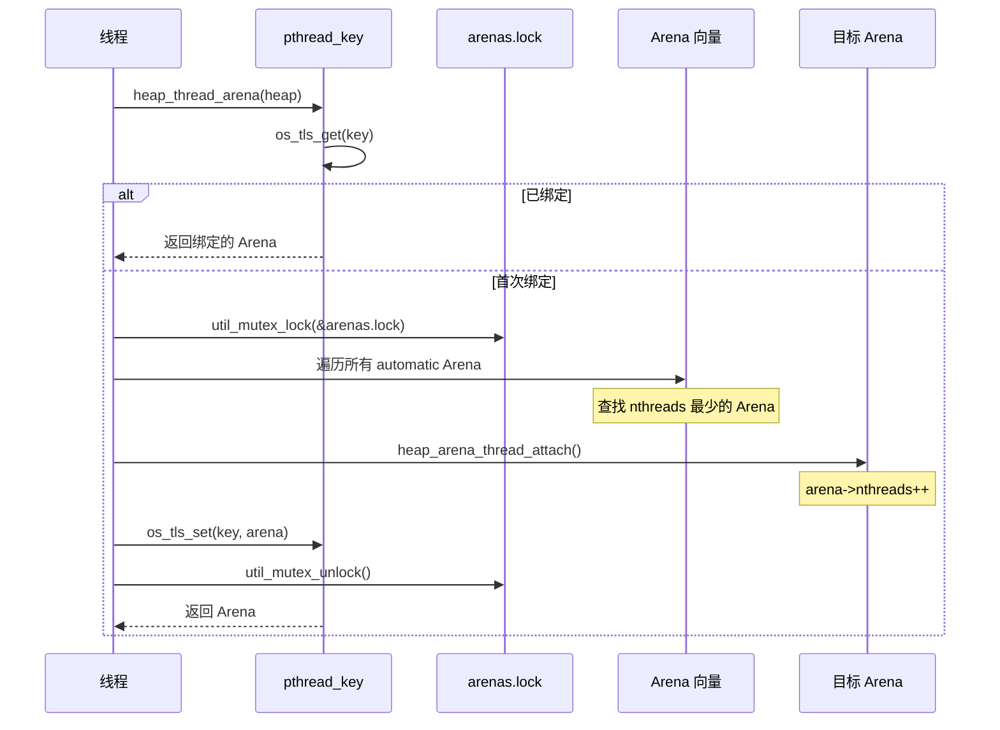
```mermaid
sequenceDiagram
    participant T as 线程
    participant TLS as pthread_key
    participant AL as arenas.lock
    participant AV as Arena 向量
    participant ARENA as 目标 Arena

    T->>TLS: heap_thread_arena(heap)
    TLS->>TLS: os_tls_get(key)

    alt 已绑定
        TLS-->>T: 返回绑定的 Arena
    else 首次绑定
        T->>AL: util_mutex_lock(&arenas.lock)

        T->>AV: 遍历所有 automatic Arena
        Note over AV: 查找 nthreads 最少的 Arena

        T->>ARENA: heap_arena_thread_attach()
        Note over ARENA: arena->nthreads++

        T->>TLS: os_tls_set(key, arena)

        T->>AL: util_mutex_unlock()

        TLS-->>T: 返回 Arena
    end
```

### 5.4 Arena 分配模式

| 模式 | 说明 | 使用场景 |
|---|---|---|
| `POBJ_ARENAS_ASSIGNMENT_THREAD_KEY`（默认） | 每 pthread 绑定一个 Arena（最少线程优先） | 通用场景 |
| `POBJ_ARENAS_ASSIGNMENT_GLOBAL` | 所有线程共享一个 Arena | 低线程数/测试 |

---

## 6. Bucket 与 Run 锁

### 6.1 分配路径中的锁层次

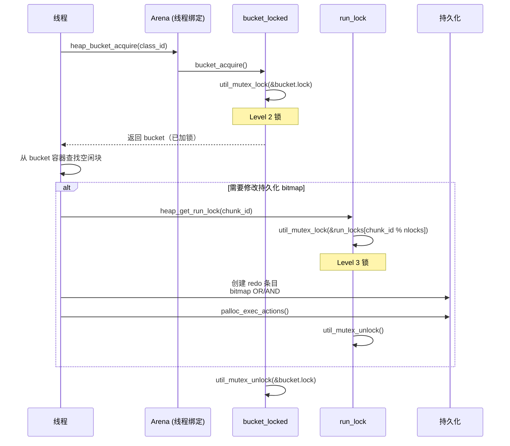
```mermaid
sequenceDiagram
    participant T as 线程
    participant ARENA as Arena (线程绑定)
    participant BUCKET as bucket_locked
    participant RLOCK as run_lock
    participant PMEM as 持久化

    T->>ARENA: heap_bucket_acquire(class_id)
    ARENA->>BUCKET: bucket_acquire()
    BUCKET->>BUCKET: util_mutex_lock(&bucket.lock)
    Note over BUCKET: Level 2 锁

    BUCKET-->>T: 返回 bucket（已加锁）

    T->>T: 从 bucket 容器查找空闲块

    alt 需要修改持久化 bitmap
        T->>RLOCK: heap_get_run_lock(chunk_id)
        RLOCK->>RLOCK: util_mutex_lock(&run_locks[chunk_id % nlocks])
        Note over RLOCK: Level 3 锁

        T->>PMEM: 创建 redo 条目<br/>bitmap OR/AND
        T->>PMEM: palloc_exec_actions()

        RLOCK->>RLOCK: util_mutex_unlock()
    end

    BUCKET->>BUCKET: util_mutex_unlock(&bucket.lock)
```

### 6.2 锁排序规则

```
锁获取顺序（严格从外到内）：

1. arenas.lock          — Arena 管理（创建/分配/销毁）
2. bucket locks         — 按 bucket ID 排序获取（防死锁）
3. run locks            — 按 lock 地址排序获取
4. memory block locks   — 由 palloc_exec_actions 排序

运行时锁（bucket）必须在持久化锁（run）之前获取。
```

### 6.3 Run Lock 分散

```
chunk_id:  0    1    2    3  ...  65527
            │    │    │    │        │
run_locks:  [0]  [1]  [2]  [3] ... [nlocks-1]
            ↑ hash: chunk_id % nlocks

nlocks 最多 = MAX_CHUNK = 65528
Valgrind 下 nlocks = 1024（减少锁开销）
```

### 6.4 单条目优化

当 redo log 仅包含一个 8 字节操作（`SET`/`AND`/`OR`）时，PMDK 跳过完整 redo 流程：

```c
// 8 字节对齐写入在 x86 上天然原子
if (ctx->pshadow_ops.offset == sizeof(struct ulog_entry_val)) {
    ulog_entry_apply(e, 1, ctx->p_ops);  // 直接写入
    redo_process = 0;
}
```

---

## 7. PMEM 持久化锁

### 7.1 混合持久化-易失性设计

```c
// PMEMmutex / PMEMrwlock / PMEMcond
// 用户视角：64 字节不透明结构（嵌入用户对象）
// 内部视角：持久化 runid + 易失性 POSIX 锁

typedef union padded_pmemmutex {
    char padding[64];        // 64 字节对齐
    struct {
        uint64_t runid;      // 持久化：pool 打开生命周期
        os_mutex_t mutex;    // 易失性：POSIX mutex
    } pmemmutex;
} PMEMmutex_internal;
```

### 7.2 runid 懒初始化协议

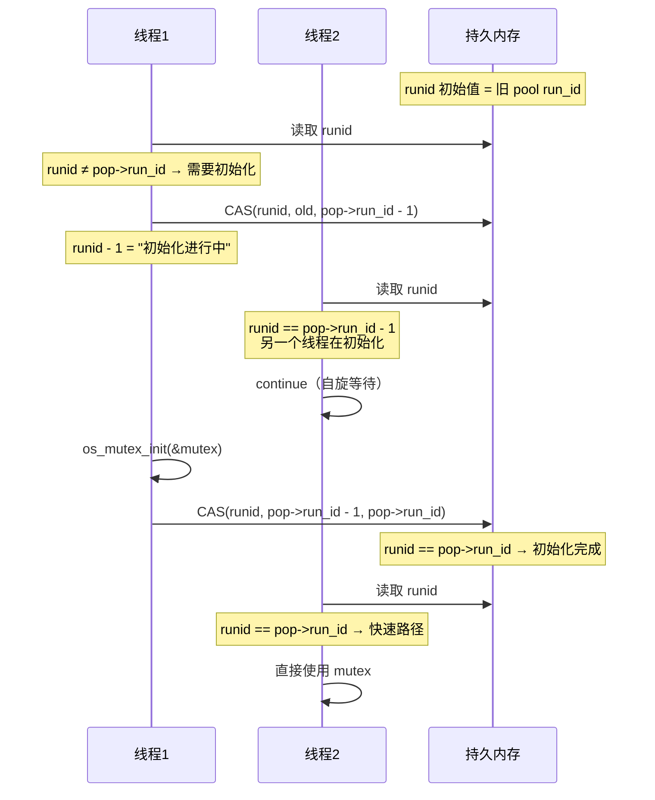
```mermaid
sequenceDiagram
    participant T1 as 线程1
    participant T2 as 线程2
    participant PMEM as 持久内存

    Note over PMEM: runid 初始值 = 旧 pool run_id

    T1->>PMEM: 读取 runid
    Note over T1: runid ≠ pop->run_id → 需要初始化

    T1->>PMEM: CAS(runid, old, pop->run_id - 1)
    Note over T1: runid - 1 = "初始化进行中"

    T2->>PMEM: 读取 runid
    Note over T2: runid == pop->run_id - 1<br/>另一个线程在初始化

    T2->>T2: continue（自旋等待）

    T1->>T1: os_mutex_init(&mutex)
    T1->>PMEM: CAS(runid, pop->run_id - 1, pop->run_id)
    Note over PMEM: runid == pop->run_id → 初始化完成

    T2->>PMEM: 读取 runid
    Note over T2: runid == pop->run_id → 快速路径
    T2->>T2: 直接使用 mutex
```

**三态协议**：

| runid 值 | 含义 | 线程行为 |
|---|---|---|
| `pop->run_id` | 已初始化 | 直接使用（快速路径） |
| `pop->run_id - 1` | 初始化进行中 | 自旋等待 |
| 其他值 | 未初始化 | CAS 竞争初始化权 |

**run_id 始终为偶数**（每次 pool open += 2），确保三态可区分。

---

## 8. 锁与事务的集成

### 8.1 事务内锁管理

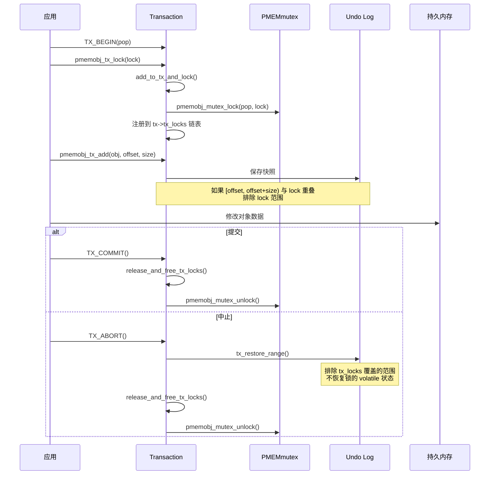
```mermaid
sequenceDiagram
    participant APP as 应用
    participant TX as Transaction
    participant LOCK as PMEMmutex
    participant UNDO as Undo Log
    participant PMEM as 持久内存

    APP->>TX: TX_BEGIN(pop)

    APP->>TX: pmemobj_tx_lock(lock)
    TX->>TX: add_to_tx_and_lock()
    TX->>LOCK: pmemobj_mutex_lock(pop, lock)
    TX->>TX: 注册到 tx->tx_locks 链表

    APP->>TX: pmemobj_tx_add(obj, offset, size)
    TX->>UNDO: 保存快照
    Note over TX,UNDO: 如果 [offset, offset+size) 与 lock 重叠<br/>排除 lock 范围

    APP->>PMEM: 修改对象数据

    alt 提交
        APP->>TX: TX_COMMIT()
        TX->>TX: release_and_free_tx_locks()
        TX->>LOCK: pmemobj_mutex_unlock()
    else 中止
        APP->>TX: TX_ABORT()
        TX->>UNDO: tx_restore_range()
        Note over UNDO: 排除 tx_locks 覆盖的范围<br/>不恢复锁的 volatile 状态
        TX->>TX: release_and_free_tx_locks()
        TX->>LOCK: pmemobj_mutex_unlock()
    end
```

### 8.2 Undo 排除锁的原理

```
假设对象布局:  [lock][field1][field2]

tx_add(obj, 0, sizeof(lock)+sizeof(field1)+sizeof(field2)):
  Undo 快照: [lock_old | field1_old | field2_old]

tx_abort() 时:
  tx_restore_range() 遍历 tx_locks:
    发现 lock 范围 [0, 64) 在 tx_locks 中
    排除: [field1_old | field2_old]

  仅恢复 field1 和 field2，不动 lock
  → lock 的 volatile mutex 状态保持不变
  → 后续 pmemobj_mutex_unlock() 正常工作
```

**如果不排除锁**：Undo 恢复会覆盖 `PMEMmutex` 的 `runid` 和 `os_mutex_t`，导致 POSIX 锁状态损坏。

---

## 9. Critnib 并发数据结构

### 9.1 Critnib 架构

Critnib 是 PMDK 自研的混合 **基数树 + Critbit 树**：

```
         critnib_root
            │
         ┌──┴──┐
         │node1│  shift=60, path=0xABCD...
         └──┬──┘
      ┌─────┼─────┬─────┐
   [0]  [1]  [2] ... [15]   ← 16 个子节点（4-bit slice）
      │         │
    leaf1     node2          ← 内部节点/叶子标记（bit 0）
    key=A     shift=56
    val=...     │
            ┌───┴───┐
          [0] ... [15]
           │
         leaf2
         key=B
         val=...
```

### 9.2 读写并发模型

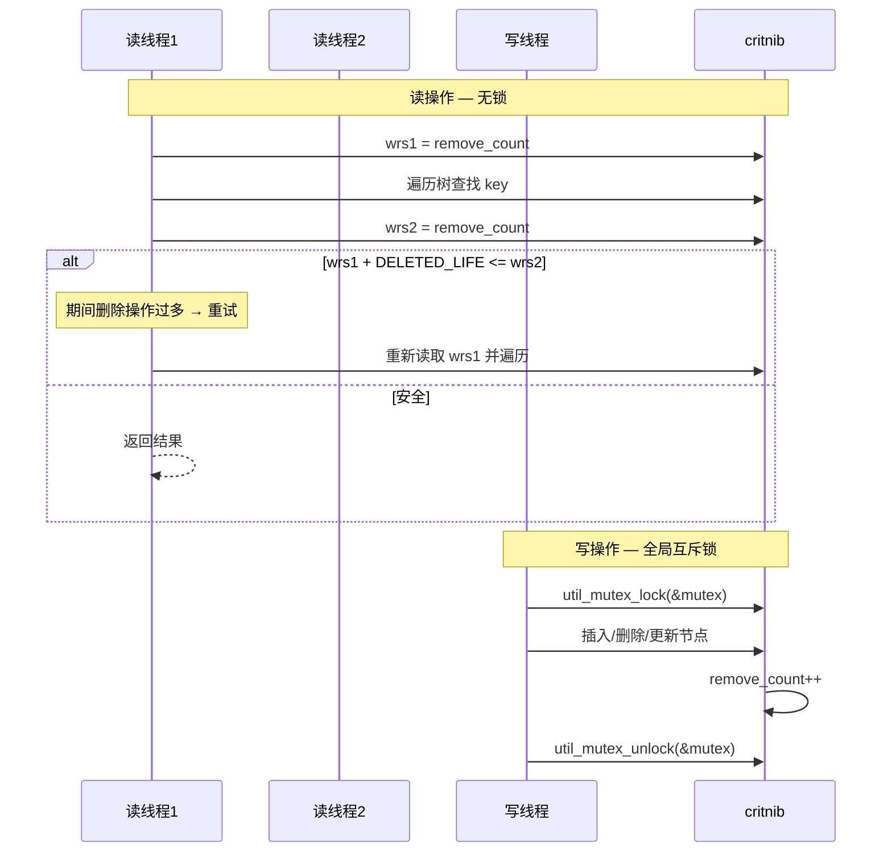
```mermaid
sequenceDiagram
    participant R1 as 读线程1
    participant R2 as 读线程2
    participant W as 写线程
    participant CN as critnib

    Note over R1,CN: 读操作 — 无锁

    R1->>CN: wrs1 = remove_count
    R1->>CN: 遍历树查找 key
    R1->>CN: wrs2 = remove_count
    alt wrs1 + DELETED_LIFE <= wrs2
        Note over R1: 期间删除操作过多 → 重试
        R1->>CN: 重新读取 wrs1 并遍历
    else 安全
        R1-->>R1: 返回结果
    end

    Note over W,CN: 写操作 — 全局互斥锁

    W->>CN: util_mutex_lock(&mutex)
    W->>CN: 插入/删除/更新节点
    CN->>CN: remove_count++
    W->>CN: util_mutex_unlock(&mutex)
```

**设计取舍**：写操作用全局锁（简单高效），读操作完全无锁（RCU-like 版本检查）。

### 9.3 Critnib 使用场景

| 使用位置 | Key | Value | 用途 |
|---|---|---|---|
| Pool 查找（pools_ht） | `pop->uuid_lo` | `PMEMobjpool*` | `pmemobj_open` 返回已有句柄 |
| 地址查找（pools_tree） | `(uint64_t)addr` | `PMEMobjpool*` | `pmemobj_pool_by_ptr()` |
| Lane info（per-thread） | `pop->uuid_lo` | `lane_info*` | 线程本地 lane 缓存 |

---

## 10. Pool 级别同步

### 10.1 Pool Open/Close 同步

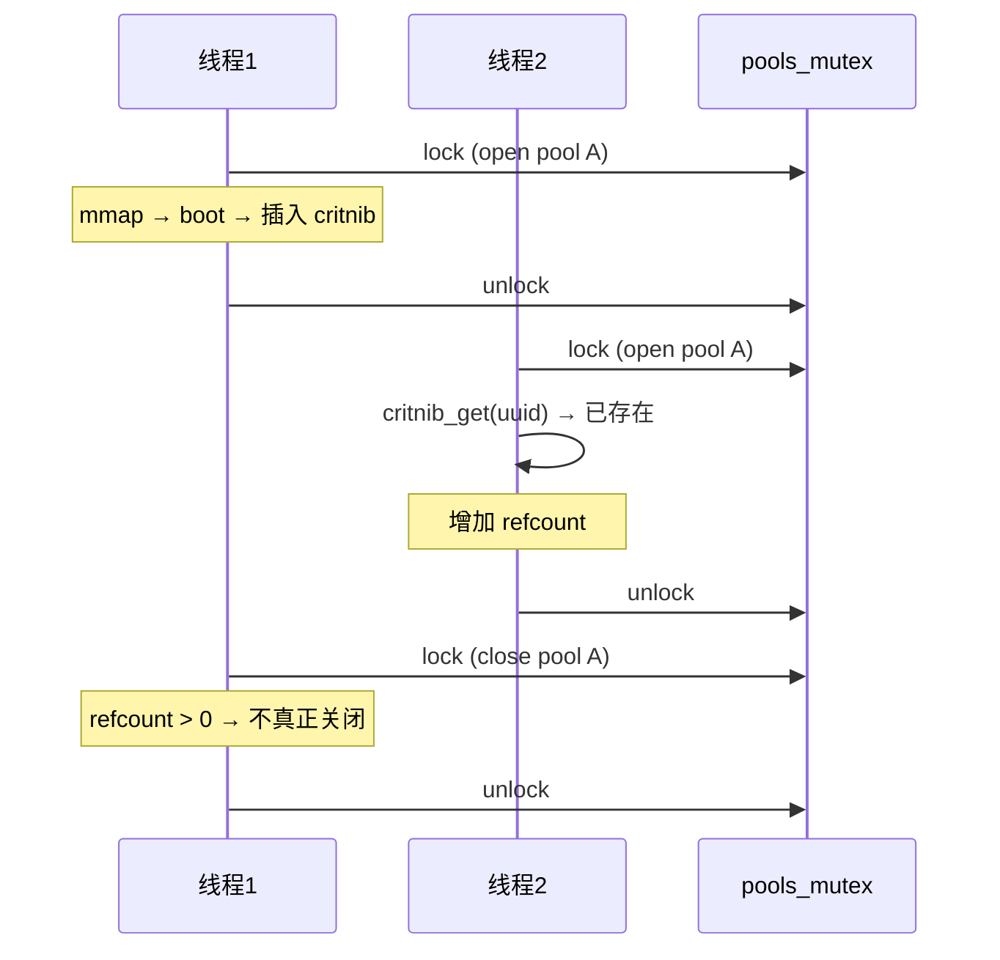
```mermaid
sequenceDiagram
    participant T1 as 线程1
    participant T2 as 线程2
    participant GM as pools_mutex

    T1->>GM: lock (open pool A)
    Note over T1: mmap → boot → 插入 critnib
    T1->>GM: unlock

    T2->>GM: lock (open pool A)
    T2->>T2: critnib_get(uuid) → 已存在
    Note over T2: 增加 refcount
    T2->>GM: unlock

    T1->>GM: lock (close pool A)
    Note over T1: refcount > 0 → 不真正关闭
    T1->>GM: unlock
```

### 10.2 全局 Critnib 初始化（CAS）

```c
// obj.c:138
if (pools_ht == NULL) {
    critnib *c = critnib_new();
    if (!util_bool_compare_and_swap64(&pools_ht, NULL, c))
        critnib_delete(c);  // 另一个线程赢了
}
```

**无需 `pools_mutex`**：CAS 保证只有一个线程成功创建 critnib，失败的线程清理自己的实例。

---

## 11. 多副本复制线程模型

### 11.1 复制函数链

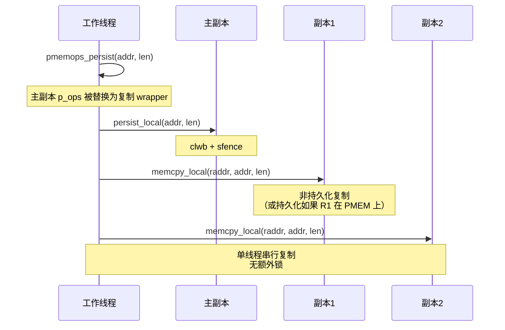
```mermaid
sequenceDiagram
    participant T as 工作线程
    participant MASTER as 主副本
    participant R1 as 副本1
    participant R2 as 副本2

    T->>T: pmemops_persist(addr, len)
    Note over T: 主副本 p_ops 被替换为复制 wrapper

    T->>MASTER: persist_local(addr, len)
    Note over MASTER: clwb + sfence

    T->>R1: memcpy_local(raddr, addr, len)
    Note over R1: 非持久化复制<br/>（或持久化如果 R1 在 PMEM 上）

    T->>R2: memcpy_local(raddr, addr, len)

    Note over T,R2: 单线程串行复制<br/>无额外锁
```

**特点**：
- 复制是**单线程串行**的：先主后副本
- 无显式副本间锁：Lane/事务机制在更高层保证串行化
- 地址转换：`raddr = (char *)rep + (uintptr_t)addr - (uintptr_t)master`
- 每个副本独立选择持久化方式（PMEM 用 clwb，非 PMEM 用 msync）

---

## 12. 线程生命周期管理

### 12.1 线程本地存储

| 变量 | 存储方式 | 用途 | 析构函数 |
|---|---|---|---|
| `static __thread struct tx tx` | `__thread` | 事务状态（stage, lane, locks, ranges） | 无（静态） |
| `__thread Lane_info_cache` | `__thread` | 最近使用的 lane_info | 无 |
| `__thread Lane_info_ht` | `__thread` | per-pool lane info 哈希表 | `lane_info_ht_destroy` |
| `__thread Lane_info_records` | `__thread` | lane_info 链表 | 同上 |
| `Lane_info_key` | `pthread_key_t` | 触发析构 | `lane_info_ht_destroy` |
| Arena assignment key | `pthread_key_t` | Arena 绑定 | `heap_thread_arena_destructor` |
| `_pobj_cached_pool` | `__thread` | 最近使用的 Pool 句柄 | 无 |

### 12.2 线程退出清理时序

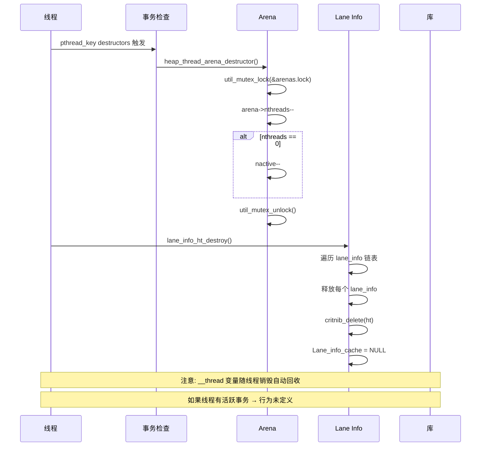
```mermaid
sequenceDiagram
    participant T as 线程
    participant TX as 事务检查
    participant ARENA as Arena
    participant LANE as Lane Info
    participant LIB as 库

    T->>TX: pthread_key destructors 触发

    TX->>ARENA: heap_thread_arena_destructor()
    ARENA->>ARENA: util_mutex_lock(&arenas.lock)
    ARENA->>ARENA: arena->nthreads--
    alt nthreads == 0
        ARENA->>ARENA: nactive--
    end
    ARENA->>ARENA: util_mutex_unlock()

    T->>LANE: lane_info_ht_destroy()
    LANE->>LANE: 遍历 lane_info 链表
    LANE->>LANE: 释放每个 lane_info
    LANE->>LANE: critnib_delete(ht)
    LANE->>LANE: Lane_info_cache = NULL

    Note over T,LIB: 注意: __thread 变量随线程销毁自动回收
    Note over T,LIB: 如果线程有活跃事务 → 行为未定义
```

### 12.3 库初始化/清理

```
进程启动:
  obj_init() [__attribute__((constructor))]
    ├── os_mutex_init(&pools_mutex)
    ├── ctl_global_register()
    └── lane_info_boot()  → pthread_key_create(Lane_info_key, destructor)

进程退出:
  obj_fini() [__attribute__((destructor))]
    ├── critnib_delete(pools_ht)
    ├── critnib_delete(pools_tree)
    ├── lane_info_destroy()  → pthread_key_delete(Lane_info_key)
    └── os_mutex_destroy(&pools_mutex)
```

---

## 13. 并发分配完整时序

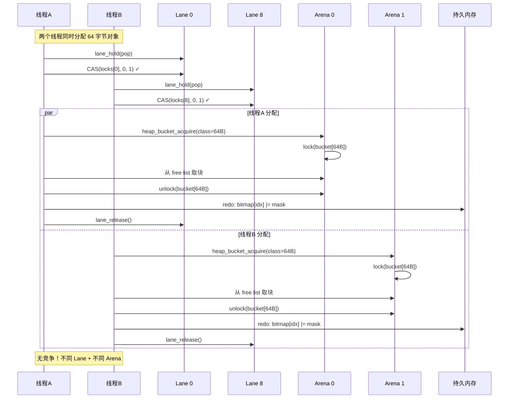
```mermaid
sequenceDiagram
    participant TA as 线程A
    participant TB as 线程B
    participant LA as Lane 0
    participant LB as Lane 8
    participant AA as Arena 0
    participant AB as Arena 1
    participant PMEM as 持久内存

    Note over TA,TB: 两个线程同时分配 64 字节对象

    TA->>LA: lane_hold(pop)
    TA->>LA: CAS(locks[0], 0, 1) ✓

    TB->>LB: lane_hold(pop)
    TB->>LB: CAS(locks[8], 0, 1) ✓

    par 线程A 分配
        TA->>AA: heap_bucket_acquire(class=64B)
        AA->>AA: lock(bucket[64B])
        TA->>AA: 从 free list 取块
        TA->>AA: unlock(bucket[64B])
        TA->>PMEM: redo: bitmap[idx] |= mask
        TA->>LA: lane_release()
    and 线程B 分配
        TB->>AB: heap_bucket_acquire(class=64B)
        AB->>AB: lock(bucket[64B])
        TB->>AB: 从 free list 取块
        TB->>AB: unlock(bucket[64B])
        TB->>PMEM: redo: bitmap[idx] |= mask
        TB->>LB: lane_release()
    end

    Note over TA,TB: 无竞争！不同 Lane + 不同 Arena
```

---

## 14. 并发事务完整时序

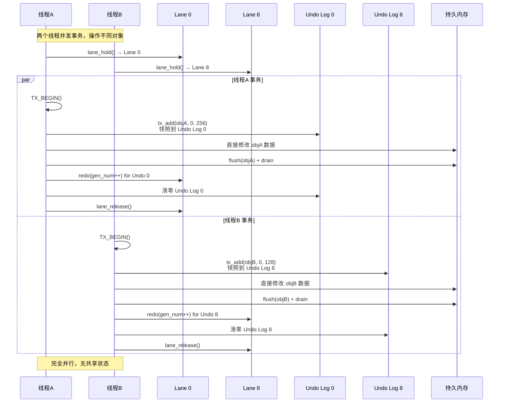
```mermaid
sequenceDiagram
    participant TA as 线程A
    participant TB as 线程B
    participant LA as Lane 0
    participant LB as Lane 8
    participant UA as Undo Log 0
    participant UB as Undo Log 8
    participant PMEM as 持久内存

    Note over TA,TB: 两个线程并发事务，操作不同对象

    TA->>LA: lane_hold() → Lane 0
    TB->>LB: lane_hold() → Lane 8

    par 线程A 事务
        TA->>TA: TX_BEGIN()
        TA->>UA: tx_add(objA, 0, 256)<br/>快照到 Undo Log 0
        TA->>PMEM: 直接修改 objA 数据
        TA->>PMEM: flush(objA) + drain
        TA->>LA: redo(gen_num++) for Undo 0
        TA->>UA: 清零 Undo Log 0
        TA->>LA: lane_release()
    and 线程B 事务
        TB->>TB: TX_BEGIN()
        TB->>UB: tx_add(objB, 0, 128)<br/>快照到 Undo Log 8
        TB->>PMEM: 直接修改 objB 数据
        TB->>PMEM: flush(objB) + drain
        TB->>LB: redo(gen_num++) for Undo 8
        TB->>UB: 清零 Undo Log 8
        TB->>LB: lane_release()
    end

    Note over TA,TB: 完全并行，无共享状态
```

### 14.1 同对象并发场景

```
如果线程A和线程B同时修改同一个对象的相同范围:

⚠️ 这是用户级别的数据竞争！PMDK 不检测也不防止。

后果:
  - 两个事务各自独立提交（各自 Lane 隔离）
  - Undo Log 各自快照不同的旧值
  - 最后一个提交的覆盖前一个的结果
  - 数据不一致

解决方案: 用户必须使用 PMEMmutex + pmemobj_tx_lock()
  → 确保同一对象的修改串行化
```

---

## 15. libpmem2 线程安全模型

### 15.1 设计原则

libpmem2 是**无状态库**，几乎不需要线程同步：

| 全局状态 | 类型 | 保护方式 |
|---|---|---|
| `static struct pmem2_arch_info Info` | 函数指针表 | 只读（初始化后不变） |
| `State.range_map` | 映射区间树 | `os_rwlock_t`（读写锁） |

### 15.2 映射注册

```
pmem2_map() → util_rwlock_wrlock() → 插入 ravl_interval → util_rwlock_wrunlock()
pmem2_persist() → util_rwlock_rdlock() → 查找 map → flush → util_rwlock_rdunlock()
```

### 15.3 为什么不需要 per-call 锁

```c
// 每个 pmem2_map 独立持有函数指针
struct pmem2_map {
    persist_fn  persist_fn;   // 根据 is_pmem + eADR 确定
    flush_fn    flush_fn;
    drain_fn    drain_fn;
    memmove_fn  memmove_fn;   // 根据 SIMD 能力确定
};

// 调用 persist 时:
map->persist_fn(map, addr, len);
// 只读 map 字段 + 全局 Info（不可变） → 无竞争
```

---

## 16. 对比总结

### 16.1 锁层次对比

| 层级 | PMDK | Glibc malloc | jemalloc | tcmalloc |
|---|---|---|---|---|
| 全局锁 | pools_mutex（1个） | arena mutex（N个） | — | — |
| 分片 | Arena（CPU核数） | Arena（N个） | Arena × Slab | CentralFreeList |
| 类级别 | Bucket（Arena×Class） | Bin（全局） | — | — |
| Chunk 级别 | Run Lock（hash） | — | — | Span Lock |
| 事务锁 | Lane CAS（1024） | — | — | — |
| 用户锁 | PMEMmutex（嵌入对象） | pthread_mutex | — | — |

### 16.2 并发模型对比

| 特性 | PMDK | RocksDB | Redis |
|---|---|---|---|
| 事务并发 | Lane（1024路 CAS） | OptimisticTransactionDB | 单线程命令 |
| 分配并发 | Arena 分片 + Bucket 锁 | Arena 分片 | 单线程 |
| 读并发 | Critnib（无锁读） | DB::Get（共享锁） | 单线程 |
| 写并发 | 独立 Lane + Arena | 写锁（DB/WAL ColumnFamily） | 单线程 |
| 用户数据保护 | PMEMmutex（用户责任） | 用户层 | 用户层 |
| 副本同步 | 单线程串行 | 无原生支持 | 异步复制 |

### 16.3 PMDK 线程模型总结

| 设计决策 | 实现方式 | 效果 |
|---|---|---|
| **Lane 隔离** | 1024 路 CAS Lane | 事务完全并行 |
| **Arena 分片** | 每 CPU 核一个 Arena | 分配 90%+ 无竞争 |
| **Critnib 无锁读** | 版本号 + 重试 | 查找无锁 |
| **CAS 懒初始化** | runid 三态协议 | 锁初始化无全局锁 |
| **锁排序** | arenas → bucket → run | 无死锁 |
| **Undo 排除锁** | tx_locks 链表检查 | abort 不损坏锁 |

---

## 17. 源码索引

### Lane 系统

| 文件 | 内容 |
|---|---|
| `src/libpmemobj/lane.h` | `lane_layout`、`lane`、`lane_descriptor`、`lane_info`、LANE_JUMP 等常量 |
| `src/libpmemobj/lane.c` | `lane_hold`/`lane_release`、`get_lane`、`lane_info_boot`、`lane_recover_and_section_boot` |

### 堆并发

| 文件 | 内容 |
|---|---|
| `src/libpmemobj/heap.c` | `arenas` 结构、Arena 创建/分配/销毁、`heap_bucket_acquire`、run locks、recycler |
| `src/libpmemobj/heap.h` | `palloc_heap` 运行时结构 |
| `src/libpmemobj/heap_layout.h` | `heap_layout`、`zone`、`chunk_header`、ZONE_MAX_SIZE |
| `src/libpmemobj/bucket.c` | `bucket_acquire`/`bucket_release`、`bucket_locked` |
| `src/libpmemobj/bucket.h` | `bucket`、`bucket_locked` |
| `src/libpmemobj/memblock.c` | `run_get_lock`、`huge_get_lock` |
| `src/libpmemobj/recycler.c` | `recycler` 结构、跨 Arena Run 共享 |

### 锁与同步

| 文件 | 内容 |
|---|---|
| `src/libpmemobj/sync.h` | `PMEMmutex_internal`、`PMEMrwlock_internal`、`PMEMcond_internal` |
| `src/libpmemobj/sync.c` | `_get_value`（runid CAS 初始化） |
| `src/include/libpmemobj/thread.h` | `PMEMmutex`、`PMEMrwlock`、`PMEMcond`（64B 公共类型） |

### 事务并发

| 文件 | 内容 |
|---|---|
| `src/libpmemobj/tx.c` | `struct tx`（`__thread`）、`tx_locks` 链表、`tx_restore_range` 锁排除、`release_and_free_tx_locks` |

### Critnib

| 文件 | 内容 |
|---|---|
| `src/core/critnib.h` | `critnib` 结构、`critnib_get`/`insert`/`remove` |
| `src/core/critnib.c` | 混合 radix+critbit 实现、无锁读、RCU-like 延迟释放 |

### OS 线程抽象

| 文件 | 内容 |
|---|---|
| `src/core/os_thread.h` | `os_mutex_t`、`os_rwlock_t`、`os_cond_t`、`os_tls_key_t` |
| `src/core/os_thread_posix.c` | POSIX pthread 实现 |

### Pool 管理

| 文件 | 内容 |
|---|---|
| `src/libpmemobj/obj.c` | `pools_mutex`、`obj_pool_init`/`obj_fini`、`pools_ht`/`pools_tree`、多副本复制函数 |

### libpmem2

| 文件 | 内容 |
|---|---|
| `src/libpmem2/persist.c` | `static Info`（只读函数指针表） |
| `src/libpmem2/map.c` | `State.range_map_lock`（读写锁） |
| `src/libpmem2/libpmem2.c` | `libpmem2_init`/`libpmem2_fini`（constructor/destructor） |
