# PMDK 存储模型分析

## 目录

1. [概述](#1-概述)
2. [Pool 磁盘布局](#2-pool-磁盘布局)
3. [Pool Header 结构](#3-pool-header-结构)
4. [Heap 内存管理](#4-heap-内存管理)
5. [对象分配模型](#5-对象分配模型)
6. [事务模型](#6-事务模型)
7. [Undo Log 机制](#7-undo-log-机制)
8. [Redo Log 机制](#8-redo-log-机制)
9. [Lane 并发机制](#9-lane-并发机制)
10. [持久化原语](#10-持久化原语)
11. [CPU 指令映射](#11-cpu-指令映射)
12. [MOVNT 优化](#12-movnt-优化)
13. [eADR 检测与适配](#13-eadr-检测与适配)
14. [Pool 恢复流程](#14-pool-恢复流程)
15. [对象生命周期（OID/TOID）](#15-对象生命周期oidtoid)
16. [与 DAOS 的集成](#16-与-daos-的集成)
17. [对比总结](#17-对比总结)
18. [源码索引](#18-源码索引)

---

## 1. 概述

PMDK（Persistent Memory Development Kit）是 Intel 开源的持久内存管理库，核心组件 `libpmemobj` 提供了事务性对象存储模型。其设计围绕 **内存映射 + 硬件指令** 实现高性能持久化：

| 组件 | 职责 | 延迟 |
|---|---|---|
| `libpmem` | 底层持久化原语（flush/drain） | ~100ns（clwb + sfence） |
| `libpmem2` | 跨平台持久化抽象（粒度感知） | 自动适配 |
| `libpmemobj` | 事务性对象存储（堆/事务/恢复） | 额外 ~50-200ns |
| `libpmempool` | Pool 一致性检查/修复工具 | 离线使用 |

核心设计原则：

- **内存语义访问**：`mmap` 映射后直接 load/store，无需系统调用
- **硬件指令持久化**：`clwb` 刷新缓存行 + `sfence` 排序保证
- **Undo Log 事务**：修改前快照旧数据，提交前刷新所有修改
- **Lane 并发**：1024 条事务 Lane 实现无锁并行事务
- **Redo-before-Undo 恢复**：先恢复分配器元数据（redo），再恢复用户数据（undo）

---

## 2. Pool 磁盘布局

```
┌─────────────────────────────────────────────────────────────────┐
│                        PMEMobj Pool                              │
├──────────────────┬──────────────────────────────────────────────┤
│                  │                                              │
│  Pool Header     │  Runtime Data (PMEMobjpool)                  │
│  (PMEMobjpool)   │  ├─ heap: 分配器元数据                       │
│                  │  ├─ lanes_offset → Lane 区域                  │
│  固定大小        │  ├─ root: 根对象 OID                         │
│  mmap 后直接     │  ├─ nlanes = 1024                           │
│  可访问          │  ├─ toid_offset_gen: 类型偏移+代数           │
│                  │  └─ uuid: Pool 唯一标识                       │
│                  ├──────────────────────────────────────────────┤
│                  │                                              │
│                  │  Lane 区域 (1024 × 3072B = 3MiB)            │
│                  │  ├─ Lane 0: internal_redo(192B) +            │
│                  │  │           external_redo(640B) +            │
│                  │  │           undo(2048B)                     │
│                  │  ├─ Lane 1: ...                              │
│                  │  └─ Lane 1023: ...                           │
│                  ├──────────────────────────────────────────────┤
│                  │                                              │
│                  │  Heap 数据区域                                │
│                  │  ├─ Zone 0: Chunks + Blocks (用户对象)       │
│                  │  ├─ Zone 1: ...                              │
│                  │  └─ Zone N: ...                              │
│                  │                                              │
└──────────────────┴──────────────────────────────────────────────┘
```

**布局特点**：

- **单个文件或 DAX 设备**：Pool 对应一个文件（如 `/mnt/pmem/pool.obj`）或 DAX 设备（如 `/dev/dax0.0`）
- **Header = Runtime Data**：`PMEMobjpool` 结构同时是磁盘格式和运行时结构，`mmap` 后零拷贝访问
- **Lane 区域**：1024 条 Lane，每条 3072 字节，预分配在 Pool 中
- **Heap 区域**：Header 之后的所有空间用于对象分配

---

## 3. Pool Header 结构

```c
// src/libpmemobj/obj.h (简化)
struct PMEMobjpool {
    // ---- 持久化字段（崩溃后需恢复） ----
    uint64_t    hdr;              // 魔数签名 "PMEMOBJ"
    uint32_t    major;            // 主版本号
    uint32_t    minor;            // 次版本号
    struct pmemobjpool_internal {
        uint64_t root;            // 根对象 OID (PMEMoid)
        uint64_t lanes_offset;    // Lane 区域在 Pool 内的偏移
        uint64_t nlanes;          // Lane 数量 (默认 1024)
        uint64_t heap_offset;     // Heap 起始偏移
        uint64_t heap_size;       // Heap 大小
        // ... 其他内部字段
    } internal;
    uint8_t     uuid[16];         // Pool UUID
    uint8_t     prev_uuid[16];    // 前次 UUID（用于快照）
    uint8_t     unused[3920];     // 预留空间
    uint64_t    checksum;         // Header 校验和

    // ---- 运行时字段（mmap 后填充，不持久化） ----
    int         is_pmem;          // 是否为真实 pmem
    int         is_master_replica; // 是否为主副本
    struct heap *heap;            // Heap 运行时指针
    struct lane *lanes;           // Lane 运行时指针数组
    // ... 更多运行时字段
};
```

---

## 4. Heap 内存管理

### 4.1 Heap 组织架构

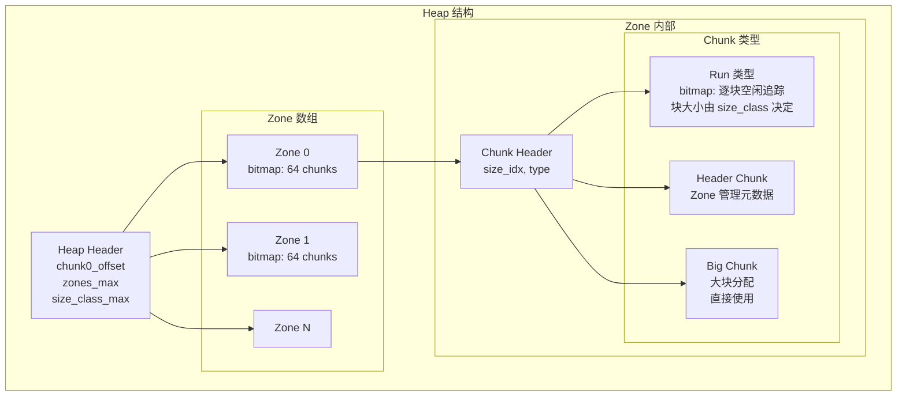

### 4.2 内存层级

| 层级 | 大小 | 管理方式 |
|---|---|---|
| Zone | 1 Zone = 默认 ~4MB | 64-bit bitmap 标记哪些 chunk 被使用 |
| Chunk | 1 Chunk = 默认 ~64KB | 每个 chunk 属于某个 size class 或大块分配 |
| Block | 1 Block = size_class 大小 | chunk 内 bitmap 逐块追踪 |

### 4.3 Size Class 体系

PMDK 使用**固定大小分级**的 size class：

```
32, 64, 96, 128, 160, 192, 224, 256, 288, 352, 384, 416, 512, 576, 672, 768,
832, 896, 960, 1024, 2048, 4096, ...
```

- 小于 1KB 的对象按 32 字节对齐分级（共 16 级）
- 1KB 以上按 2 的幂分级
- 分配时将请求大小向上取整到最近的 size class

---

## 5. 对象分配模型

### 5.1 分配流程

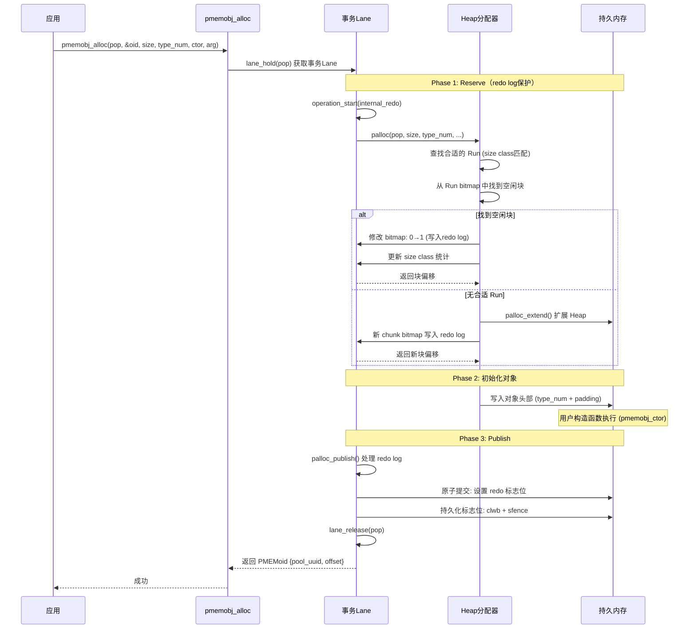

### 5.2 PMEMoid 结构

```c
typedef struct pmemoid {
    uint64_t pool_uuid_lo;  // Pool UUID 低 64 位（路由到正确 Pool）
    uint64_t off;           // 对象在 Pool 内的偏移（0 = 空指针）
} PMEMoid;

// TOID_TYPED 增加类型安全
#define TOID(TYPE) struct { PMEMoid oid; }
#define D_RW(T)  (TYPE *)pmemobj_direct(t.oid)  // 直接指针
#define D_RO(T)  (const TYPE *)pmemobj_direct(t.oid)
```

`pmemobj_direct(oid)` = `pool_addr + oid.off`，直接指针解引用，无额外开销。

---

## 6. 事务模型

### 6.1 事务生命周期

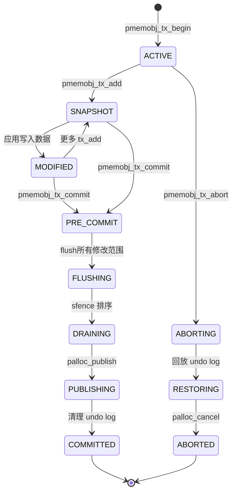

### 6.2 事务完整时序

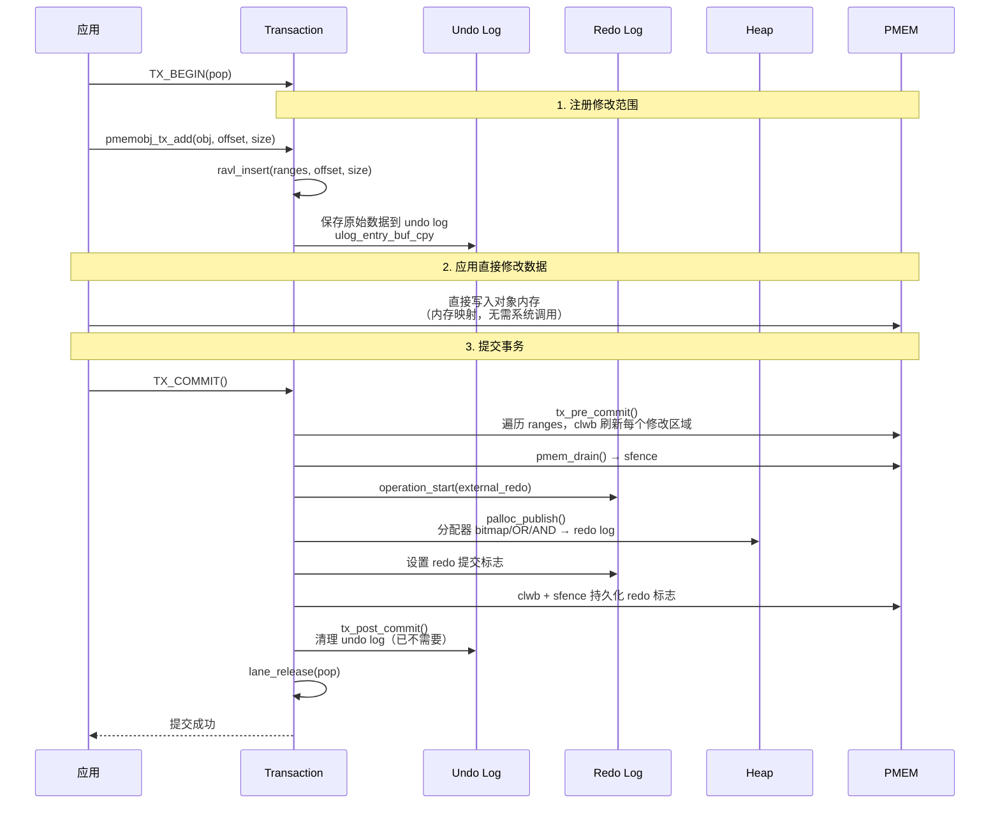

### 6.3 事务中止时序

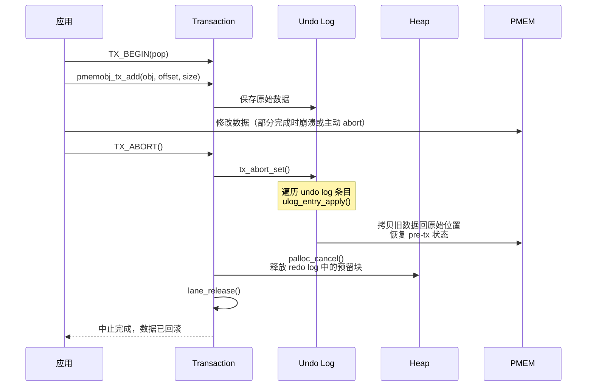

---

## 7. Undo Log 机制

### 7.1 Undo Log 结构

每条 Lane 的 undo log 区域为 2048 字节（`LANE_UNDO_SIZE`），基于 `ulog` 统一日志格式：

```c
// src/libpmemobj/ulog.h
struct ulog {
    uint64_t    checksum;       // 整体校验和（覆盖所有条目）
    uint64_t    gen_num;        // 代数（每次使用递增，防止重放）
    uint64_t    capacity;       // 日志容量
    uint64_t    base_nbytes;    // 当前已用字节数
    uint8_t     data[];         // 日志条目数据（柔性数组）
};
```

### 7.2 Undo Log 条目类型

```c
#define ULOG_OPERATION_BUF_CPY   (0b110ULL << 61ULL)  // memcpy（保存旧数据）
#define ULOG_OPERATION_BUF_SET   (0b101ULL << 61ULL)  // memset
#define ULOG_OPERATION_SET       (0b000ULL << 61ULL)  // 设置 8 字节值
#define ULOG_OPERATION_AND       (0b001ULL << 61ULL)  // AND 操作
#define ULOG_OPERATION_OR        (0b010ULL << 61ULL)  // OR 操作
```

操作类型编码在 `offset` 字段的高 3 位。

### 7.3 条目格式

```
┌─────────────────────────────────────────────────────────┐
│ ulog_entry_val (16 bytes) — 用于 SET/AND/OR            │
├──────────────────────────────┬──────────────────────────┤
│ offset + type (8 bytes)      │ value (8 bytes)          │
│ 高3位=操作类型               │ 操作数值                  │
└──────────────────────────────┴──────────────────────────┘

┌─────────────────────────────────────────────────────────┐
│ ulog_entry_buf (variable) — 用于 BUF_SET/BUF_CPY      │
├────────────┬──────────┬──────────┬─────────────────────┤
│ offset+type│ checksum │ size     │ data[]               │
│ 8 bytes    │ 8 bytes  │ 8 bytes  │ size bytes           │
└────────────┴──────────┴──────────┴─────────────────────┘
```

### 7.4 快照操作流程

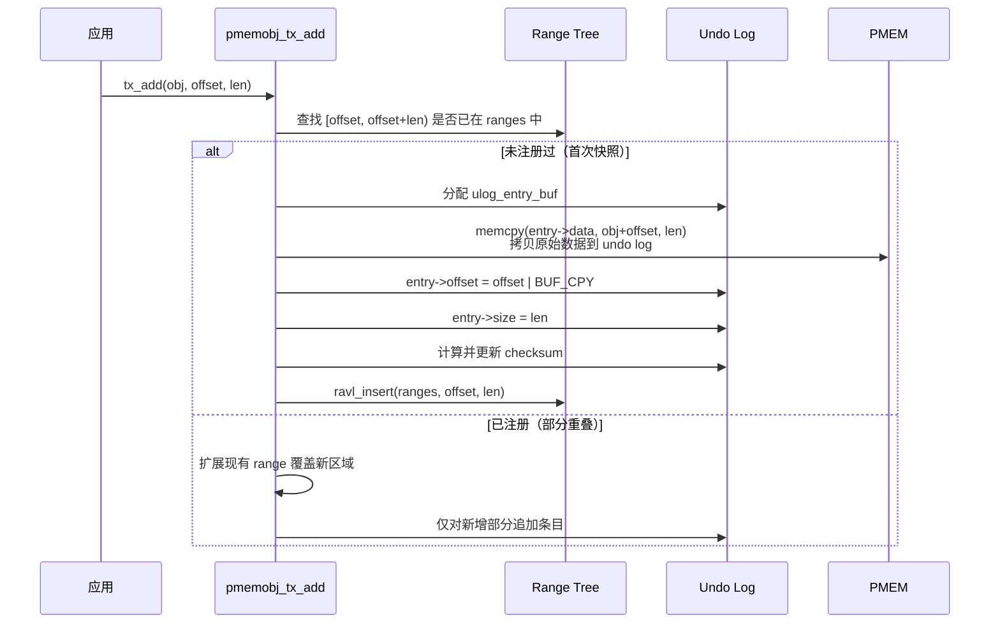

### 7.5 Undo Log 扩展

当 undo log 空间不足时，通过 `ulog_extend()` 扩展：

- 首先持久化当前日志（clwb + sfence）
- 分配新的扩展区域（由 redo log 保护，避免循环依赖）
- 更新日志容量字段
- 后续条目写入扩展区域

---

## 8. Redo Log 机制

### 8.1 双 Redo Log 设计

每条 Lane 包含两个 redo log：

| Redo Log | 大小 | 用途 |
|---|---|---|
| Internal Redo | ~192 字节 | 分配器内部操作（bitmap OR/AND，~12 条目） |
| External Redo | ~640 字节 | 大型操作（可扩展，chunk 分配等） |

### 8.2 Redo 与 Undo 的协作

```
事务生命周期中 Redo 和 Undo 的分工：

┌──────────┐     ┌──────────┐     ┌──────────┐     ┌──────────┐
│  TX_BEGIN │     │  修改数据  │     │  TX_COMMIT│     │  完成     │
└─────┬────┘     └─────┬────┘     └─────┬────┘     └─────┬────┘
      │                │                │                │
      │           Undo: 保存旧数据     │                │
      │           (应用修改前)         │                │
      │                                │                │
      │           Redo(Internal):      │                │
      │           分配器 bitmap 更新    │                │
      │           (palloc 预留)        │                │
      │                                │                │
      │                                │  Redo(External):│
      │                                │  palloc_publish │
      │                                │  原子提交分配    │
      │                                │                │
      │                                │  Undo: 清理     │
      │                                │  (不再需要)     │
```

### 8.3 分配器 Redo 操作类型

分配器使用 redo log 记录三种操作：

```c
// 位图操作
ULOG_OPERATION_OR   → bitmap[idx] |= value  // 标记块已分配
ULOG_OPERATION_AND  → bitmap[idx] &= value  // 标记块已释放
ULOG_OPERATION_SET  → ptr = value           // 更新指针（如 free list head）
```

### 8.4 Redo 提交的原子性

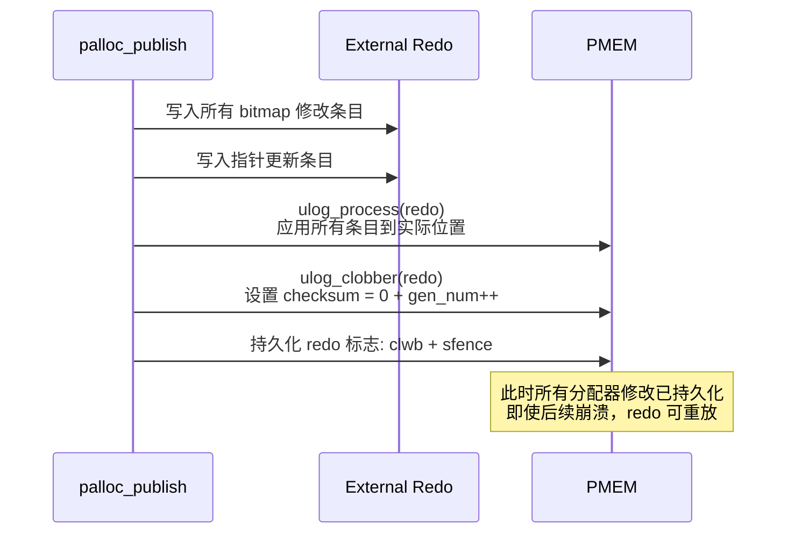

---

## 9. Lane 并发机制

### 9.1 Lane 架构

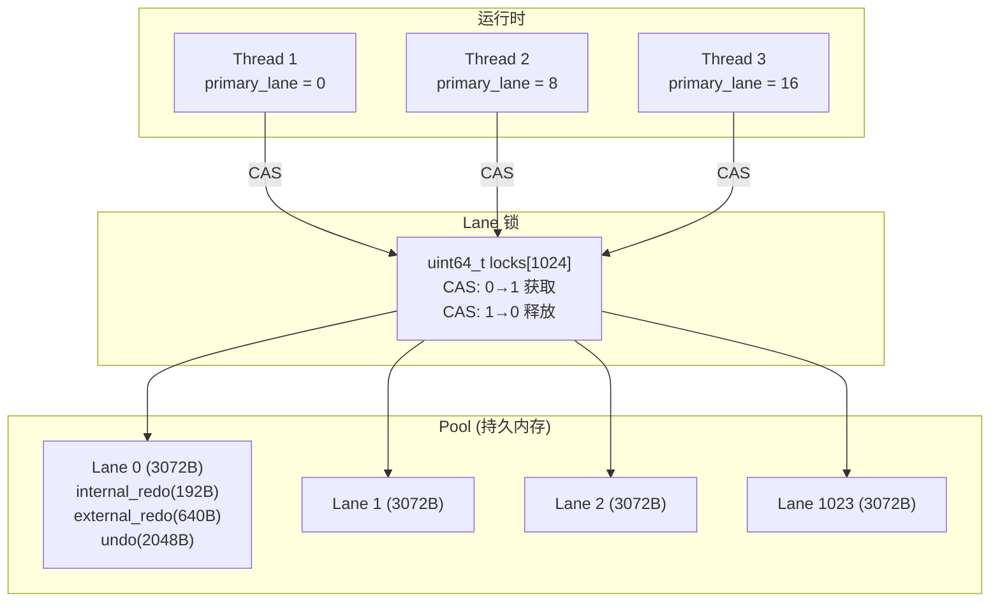

### 9.2 Lane 分配策略

| 策略 | 说明 |
|---|---|
| **Primary Lane** | 每个线程首次使用时通过 atomic fetch-and-add 分配，索引间隔 8（`LANE_JUMP`） |
| **Primary 优先** | 优先重用 primary lane（最多尝试 128 次），失败后扫描全局 |
| **CAS 锁** | `util_bool_compare_and_swap64(locks[idx], 0, 1)` 无锁获取 |
| **嵌套支持** | `nest_count` 追踪嵌套深度，外层事务持锁，内层复用同 lane |

### 9.3 Lane 分配时序

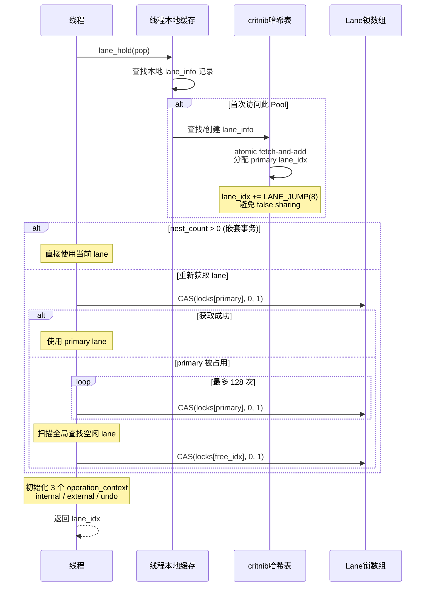

---

## 10. 持久化原语

### 10.1 核心函数

```c
// 三层持久化 API
void    pmem_flush(const void *addr, size_t len);     // 刷新缓存行
void    pmem_drain(void);                              // 等待刷新完成
void    pmem_persist(const void *addr, size_t len);    // flush + drain

void   *pmem_memcpy_persist(void *dest, const void *src, size_t len);
void   *pmem_memset_persist(void *dest, int c, size_t len);

// 带 fence 版本
void   *pmem_memcpy_flush(void *dest, const void *src, size_t len);
void   *pmem_memcpy_nodrain(void *dest, const void *src, size_t len);
```

### 10.2 Flush + Drain 分离

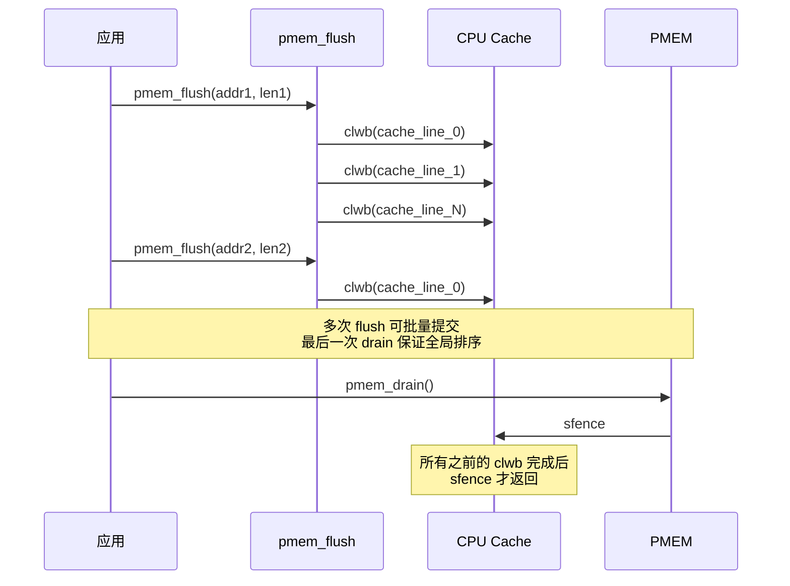

**优势**：多次 `flush` 后一次 `drain`，减少 fence 指令的开销。

---

## 11. CPU 指令映射

### 11.1 x86_64 指令选择

| 指令 | CPUID 检测 | 特性 | Fence 需求 |
|---|---|---|---|
| `CLWB` | CPUID.07H:EBX[24] | 写回不失效缓存行 | 需要 SFENCE |
| `CLFLUSHOPT` | CPUID.07H:EBX[23] | 刷新并失效，非串行化 | 需要 SFENCE |
| `CLFLUSH` | CPUID.01H:EDX[19] | 串行化，自带 fence | 不需要 |

**优先级**：CLWB > CLFLUSHOPT > CLFLUSH（初始化时按此顺序检测）。

### 11.2 缓存行刷新循环

```c
#define FLUSH_ALIGN 64  // x86_64 缓存行大小

for (uptr = (uintptr_t)addr & ~(FLUSH_ALIGN - 1);  // 向下对齐
     uptr < (uintptr_t)addr + len;
     uptr += FLUSH_ALIGN) {
    pmem_clwb((char *)uptr);  // 或 clflushopt / clflush
}
```

### 11.3 ARM AArch64 指令

| x86 等价 | ARM 指令 | ARM 版本 | 检测方式 |
|---|---|---|---|
| CLWB | `dc cvac` | ARMv8.0+ | 默认可用 |
| CLFLUSHOPT | `dc cvap` | ARMv8.2+ | HWCAP_DCPOP |
| SFENCE | `dmb ishst` | all | 默认可用 |

### 11.4 初始化时的函数指针绑定

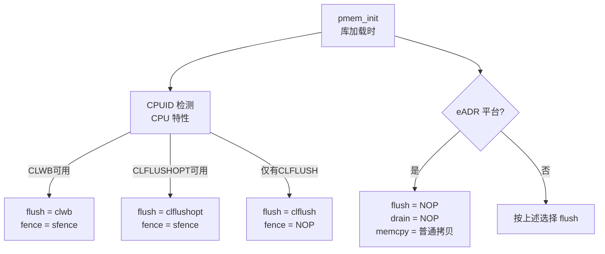

---

## 12. MOVNT 优化

### 12.1 MOVNT 决策

```c
#define MOVNT_THRESHOLD 256  // 默认阈值

if (len < MOVNT_THRESHOLD)
    memmove_funcs.t.flush(dest, src, len);   // temporal: 带缓存，需要 clwb
else
    memmove_funcs.nt.flush(dest, src, len);  // non-temporal: 绕过缓存
```

### 12.2 MOVNT vs Temporal

| 方式 | 指令 | 缓存行为 | 持久化步骤 |
|---|---|---|---|
| Temporal | `movdqa` / SSE2 | 写入 CPU 缓存 | memcpy + clwb + sfence |
| Non-temporal | `movntdq` / `movnti` | 绕过 CPU 缓存 | memcpy + sfence（无需 clwb） |

### 12.3 SIMD 层级

| SIMD 变体 | 寄存器宽度 | 启用方式 |
|---|---|---|
| SSE2 | 128-bit | 默认启用 |
| AVX | 256-bit | `PMEM_AVX=1` |
| AVX-512 | 512-bit | `PMEM_AVX512F=1` |
| MOVDIR64B | 64 字节/次 | `PMEM_MOVDIR64B=1` |

### 12.4 WC Workaround

在 Intel CPU 上，写合并（Write Combining）缓冲区可能导致 non-temporal store 顺序问题：

- **默认启用**：在检测到 `GenuineIntel` CPU 时自动启用
- **额外 SFENCE**：在 non-temporal 操作前插入 SFENCE 排序
- **可关闭**：`PMEM_WC_WORKAROUND=0`

---

## 13. eADR 检测与适配

### 13.1 eADR 概述

eADR（Extended Asynchronous DRAM Refresh）平台在掉电时自动刷新 CPU 缓存，应用无需主动 flush：

```c
// 检测路径: /sys/bus/nd/devices/region*/persistence_domain
if (persistence_domain == "cpu_cache") {
    // eADR 平台：CPU 缓存自动持久化
    Funcs.flush = flush_empty;          // NOP
    Funcs.memmove_nodrain = info.memmove_nodrain_eadr;  // 普通拷贝
} else {
    // 非 eADR：需要显式 clwb + sfence
    Funcs.flush = info.flush;
    Funcs.memmove_nodrain = info.memmove_nodrain;
}
```

### 13.2 三级粒度模型（libpmem2）

| 粒度 | 条件 | persist | flush | drain |
|---|---|---|---|---|
| BYTE | eADR 平台 | NOP | NOP | NOP |
| CACHE_LINE | 真实 pmem（非 eADR） | clwb + sfence | clwb | sfence |
| PAGE | 非持久内存（文件映射） | msync | msync | NOP |

### 13.3 粒度选择逻辑

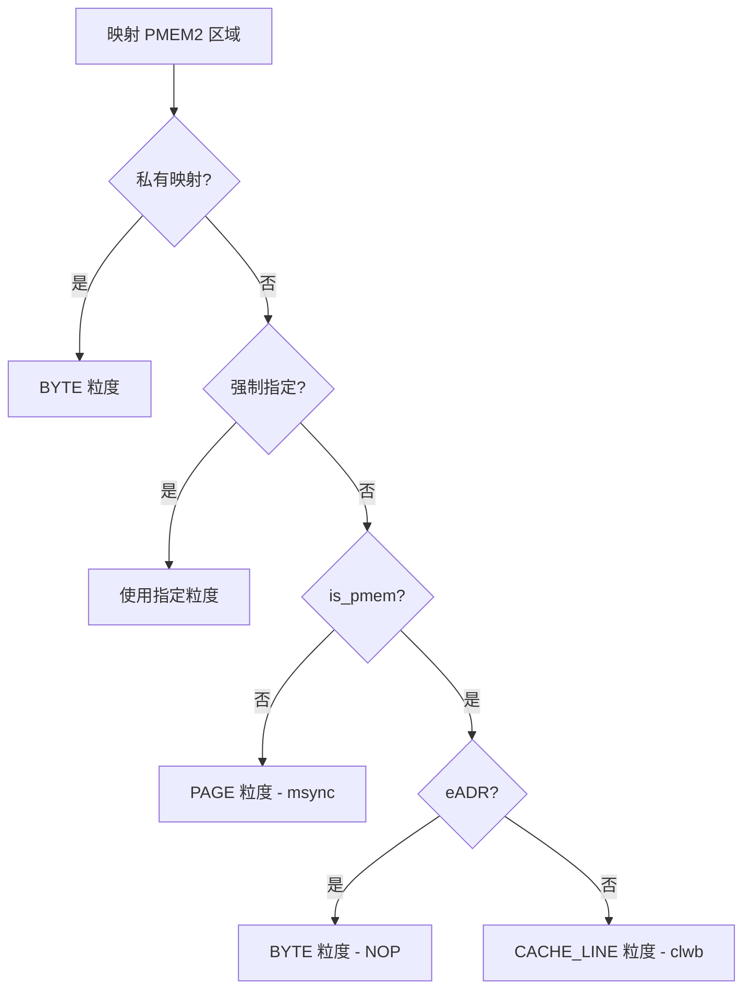

---

## 14. Pool 恢复流程

### 14.1 恢复总时序

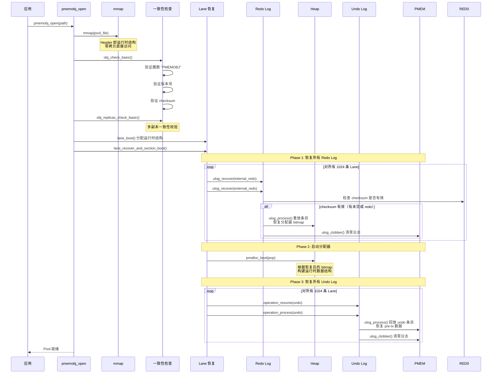

### 14.2 恢复顺序的关键性

```
为什么 Redo 先于 Undo？

1. Redo Log 记录了分配器元数据修改（bitmap 更新）
2. Undo Log 恢复可能需要释放内存（palloc_cancel）
3. 分配器必须处于一致状态才能正确释放内存
4. 因此：先 Redo → 分配器一致 → 再 Undo → 安全释放
```

### 14.3 Checksum 校验

```c
ulog_recovery_needed(ulog, 1):
    // 1. base_nbytes > 0 → 日志中有数据
    // 2. checksum 有效 → 数据完整（非崩溃残留）
    // 两者都满足才需要恢复
```

Checksum 覆盖：所有条目数据 + `gen_num`。这使得恢复可以区分：

- **有效日志**：事务开始后崩溃，undo/redo 需要处理
- **已提交日志**：事务正常完成，日志已被 clobber（checksum=0）
- **损坏日志**：checksum 不匹配，跳过（数据损坏场景）

---

## 15. 对象生命周期（OID/TOID）

### 15.1 OID 全局唯一性

```c
PMEMoid = {pool_uuid_lo, offset}

// 两个 OID 相等 ⟺ 同一 Pool 内同一偏移
// 不同 Pool 的 OID 永远不相等（uuid_lo 不同）
```

### 15.2 类型编号（Type Number）

每个对象类型在创建时分配一个全局唯一的类型编号：

```c
#define TOID_DECLARE(TYPE, TYPE_NUM) TOID(TYPE)
#define TOID_ASSIGN(TOID, OID)       ((TOID).oid = (OID))
#define TOID_IS_NULL(TOID)           OID_IS_NULL((TOID).oid)
#define TOID_VALID(TOID)             OID_VALID(pop, (TOID).oid)
```

`OID_VALID(pop, oid)` 检查 `oid.pool_uuid_lo == pop->uuid_lo && oid.off != 0`。

### 15.3 直接指针 vs OID

```c
// 获取直接指针（零开销）
TYPE *ptr = D_RW(TOID_VAR);
// 等价于: (TYPE *)((char *)pop + oid.off)

// 直接指针仅在当前进程/当前 mmap 有效
// OID 可持久化、可跨进程传递
```

---

## 16. 与 DAOS 的集成

### 16.1 umem 封装层

DAOS 将 PMDK 封装为 `umem`（Unified Memory）接口：

| umem API | PMDK 实现 |
|---|---|
| `umem_tx_begin(umm, txd)` | `pmemobj_tx_begin(pop)` |
| `umem_tx_end(umm)` | `pmemobj_tx_commit() + pmemobj_tx_end()` |
| `umem_tx_abort(umm, err)` | `pmemobj_tx_abort()` |
| `umem_tx_add(range)` | `pmemobj_tx_add_range()` |
| `umem_zalloc(size)` | `pmemobj_zalloc(pop)` |
| `umem_reserve(size)` | `pmemobj_reserve(pop)` |
| `umem_tx_publish()` | `pmemobj_tx_publish()` |
| `umem_off2ptr(off)` | `POBJ_DIRECT(pop, off)` |

### 16.2 Reserve-Publish 模式

DAOS 扩展了 PMDK 的标准事务模型：

```
标准 PMDK:  tx_begin → alloc+modify → tx_commit（一步式）
DAOS umem:  tx_begin → reserve → modify → tx_publish → tx_end（两步式）
                                              ↑
                                     在此处才真正持久化
```

`umem_reserve()` 在事务内预留空间但不发布；`umem_tx_publish()` 批量发布所有预留，配合 DAOS 的 VEA 空间分配器实现延迟持久化。

---

## 17. 对比总结

### 17.1 PMDK vs 其他持久内存库

| 特性 | PMDK libpmemobj | Memcached | Redis |
|---|---|---|---|
| 持久化方式 | CPU 指令（clwb+sfence） | 异步 fork 写文件 | AOF/RDB |
| 访问模式 | 直接内存映射（零拷贝） | 网络 API | 网络 API |
| 事务模型 | Undo Log（undo） | 单命令原子 | MULTI/EXEC |
| 并发 | 1024 Lane（无锁CAS） | 多线程 + 锁 | 单线程 |
| 延迟 | ~100-300ns | ~μs | ~μs |
| 数据模型 | C 结构体（Typed OID） | KV | KV |
| 崩溃恢复 | Redo + Undo 两阶段 | 重放 AOF | 重放 AOF |

### 17.2 libpmemobj 各机制对比

| 机制 | 用途 | 大小 | 持久化时机 |
|---|---|---|---|
| Internal Redo | 分配器 bitmap | 192B/lane | palloc_publish |
| External Redo | 大型分配操作 | 640B/lane（可扩展） | palloc_publish |
| Undo Log | 用户数据快照 | 2048B/lane（可扩展） | tx_pre_commit |
| Heap Bitmap | 块空闲追踪 | 持久化在 PMEM | palloc_publish |
| Pool Header | Pool 元数据 | 4KB | pool_create |

---

## 18. 源码索引

### libpmemobj

| 文件 | 内容 |
|---|---|
| `src/libpmemobj/obj.h` | `PMEMobjpool` 结构、常量定义 |
| `src/libpmemobj/obj.c` | `pmemobj_open/create/close`、恢复流程入口 |
| `src/libpmemobj/tx.c` | 事务 API、`tx_pre_commit`、`tx_post_commit`、`tx_abort` |
| `src/libpmemobj/tx.h` | 事务内部结构定义 |
| `src/libpmemobj/ulog.h` | `ulog` 统一日志结构、条目类型宏 |
| `src/libpmemobj/ulog.c` | `ulog_recover`、`ulog_process`、`ulog_clobber` |
| `src/libpmemobj/memops.c` | `operation_context` 管理、undo/redo 处理 |
| `src/libpmemobj/memops.h` | 操作上下文定义 |
| `src/libpmemobj/lane.h` | `lane_layout` 持久化结构 |
| `src/libpmemobj/lane.c` | Lane 分配/释放/恢复、`lane_recover_and_section_boot` |
| `src/libpmemobj/heap.h` | Heap 内部结构定义 |
| `src/libpmemobj/heap.c` | Heap 初始化、Zone/Chunk 管理 |
| `src/libpmemobj/alloc.c` | `pmemobj_alloc/zalloc/reserve/publish` |
| `src/libpmemobj/pmalloc.h` | `palloc`、`palloc_publish`、`palloc_cancel` |
| `src/libpmemobj/pmalloc.c` | 分配器核心实现（bitmap + run 管理） |
| `src/libpmemobj/ctl.c` | Pool 控制接口 |
| `src/libpmemobj/list.c` | 持久化链表宏（POBJ_LIST_*） |

### libpmem

| 文件 | 内容 |
|---|---|
| `src/libpmem/pmem.c` | `pmem_persist/flush/drain`、函数指针初始化 |
| `src/libpmem/pmem.h` | 内部定义 |

### libpmem2

| 文件 | 内容 |
|---|---|
| `src/libpmem2/persist.c` | `pmem2_persist/flush/drain`、粒度感知分派 |
| `src/libpmem2/map.c` | `pmem2_map`、`get_min_granularity` |
| `src/libpmem2/deep_flush.c` | `pmem2_deep_flush` |
| `src/libpmem2/config.c` | `pmem2_config` |
| `src/libpmem2/x86_64/init.c` | x86_64 CPU 检测、函数指针绑定 |
| `src/libpmem2/x86_64/cpu.c` | CPUID 特性检测 |
| `src/libpmem2/x86_64/flush.h` | CLWB/CLFLUSHOPT/CLFLUSH 内联实现 |
| `src/libpmem2/aarch64/init.c` | ARM64 初始化 |
| `src/libpmem2/aarch64/flush.h` | ARM DC CVAC/CVAP 实现 |
| `src/libpmem2/aarch64/arm_cacheops.h` | ARM 缓存操作内联汇编 |
| `src/libpmem2/auto_flush_linux.c` | eADR 检测（sysfs persistence_domain） |

### 公共

| 文件 | 内容 |
|---|---|
| `src/include/libpmemobj.h` | 公共 API：PMEMoid、TOID、TX_BEGIN 等 |
| `src/include/libpmem.h` | 公共 API：pmem_persist 等 |
| `src/include/libpmem2.h` | 公共 API：pmem2_persist 等 |
