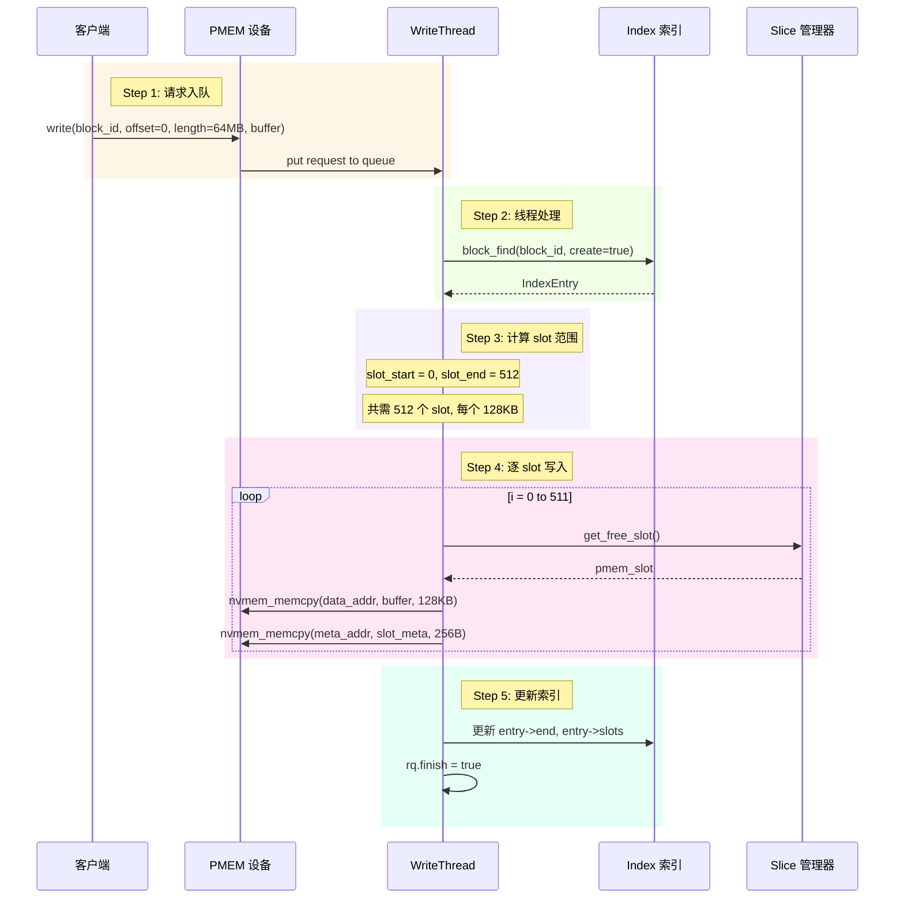
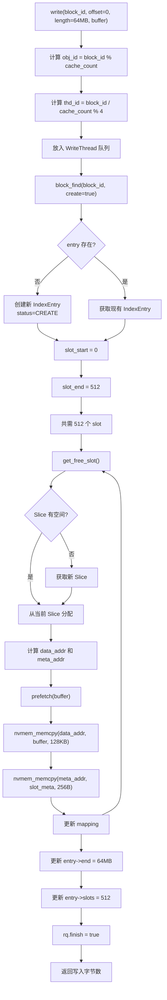

# PMEM CACHE存储模型分析

## 一、AEP 是什么

AEP = Intel Apache Pass，即 Intel Optane DC Persistent Memory（PMEM持久内存），是一种：
- 字节可寻址的非易失性内存
- 容量大（单条 128GB~512GB），延迟介于 DRAM 和 SSD 之间
- 通过 mmap 映射到用户空间，可直接像内存一样访问

## 二、核心存储架构

### 1. 存储层次结构

每个 PMEMObj 对应一个 NUMA 节点上的 PMEM 设备文件，通过 mmap 映射到用户空间。

### 2. Slice 内部结构 (512MB)

每个 Slice 包含:
- SliceMeta (256B): 记录 Slice 状态
- Slot Meta 区域 (2KB - 1MB): 4088 个 slot 元数据，每个 256B
- Slot Data 区域 (1MB - 512MB): 4088 个 slot 数据，每个 128KB

有效数据容量: 4088 × 128KB ≈ 511MB

### 3. Slot 元数据结构 (256B)

```
struct SlotMeta {
    uint64_t reserved0;
    uint64_t block_id;    // 所属 block ID
    uint64_t reserved1;
    uint64_t offset;      // 数据在 block 中的偏移
    uint64_t reserved2;
    uint64_t length;      // 数据长度
    uint64_t status;      // 0: free, 1: in-use, 2: delete
    uint64_t reserved3[25];
};
```

## 三、关键常量定义

| 常量 | 值 | 说明 |
|------|-----|------|
| PMEM_SLICE_SIZE | 512MB | Slice 大小 (内存分配单元) |
| PMEM_SLOT_SIZE | 128KB | Slot 大小 (写入单元) |
| PMEM_SLOT_COUNT | 4088 | 每个 Slice 的 slot 数量 |
| PMEM_SLOT_META | 256B | Slot 元数据大小 |
| PMEM_SLICE_META | 2KB | Slice 元数据区域起始 |
| PMEM_SLICE_OFFS | 1MB | Slice 数据区域起始 |
| PMEM_WRITE_THREADS | 4 | 写线程数量 |
| PMEM_READ_THREADS | 4 | 读线程数量 |

## 四、64MB Block 写入流程

### 1. 写入时序图



### 2. 请求路由逻辑

```cpp
uint64_t PMEM::write(uint64_t block_id, uint64_t offset, uint64_t length, char* buffer)
{
    // 根据 block_id 路由到对应的 PMEMObj 和写线程
    uint64_t obj_id = block_id % _cache_count;        // 选择 NUMA 节点
    uint64_t thd_id = (block_id / _cache_count) % PMEM_WRITE_THREADS;  // 选择写线程

    // 构造请求并放入队列
    PMEM::Request rq;
    rq.block_id = block_id;
    rq.offset = offset;
    rq.length = length;      // 64MB
    rq.buffer = buffer;

    _cache_obj[obj_id].write_worker[thd_id]->put(&rq);

    // 等待完成
    while (!rq.finish) {}
    return rq.count;
}
```

### 3. normal_handler 核心逻辑

```cpp
int WriteThread::normal_handler(PMEM::Request *rq)
{
    // 获取或创建 block 索引条目
    Index::IndexEntry *entry = _index->block_find(rq->block_id, true);

    // 计算 slot 范围 (以 128KB 为单位)
    uint64_t slot_start = __rounddown(rq->offset, _chunk_size) / _chunk_size;
    uint64_t slot_end = __roundup(rq->offset + rq->length, _chunk_size) / _chunk_size;
    // 对于 64MB: slot_start=0, slot_end=512

    // 逐 slot 写入
    for (uint64_t i = slot_start; i < slot_end; ++i) {
        uint64_t wlen = std::min(_chunk_size - (cur_offset & (_chunk_size - 1)), data_left);
        bool new_slot = (i >= slot_exist);

        ret = write_slot(&entry->mapping, rq->block_id, i, cur_offset, wlen, buffer, new_slot);
        
        cur_offset += wlen;
        data_left -= wlen;
        buffer += wlen;
    }

    rq->finish = true;
    return 0;
}
```

## 五、持久化机制 nvmem_memcpy

### 1. SSE Non-Temporal Store

```cpp
void nvmem_memcpy(char *dest, const char *src, size_t len) {
    // 使用 SSE non-temporal store 指令
    // 绕过 CPU 缓存，直接写入内存
    memmove_movnt_sse_fw(dest, src, len);

    // 内存屏障，确保所有写操作完成
    _mm_sfence();
}
```

### 2. 写入优化策略

普通 memcpy 通过 CPU 缓存，需要 clflush 刷回 PMEM。
Non-Temporal Store 绕过 CPU 缓存，直接写入 PMEM:

- 使用 _mm_stream_si128 (MOVNTDQ 指令)
- 64B 对齐写入，一次写入 4 个 cache line (256B)
- 最后调用 _mm_sfence 保证顺序

## 六、地址映射计算

### 1. 数据地址计算

```cpp
char* PMEM::data_addr(uint64_t obj_id, uint64_t slot_id)
{
    // slot 从 1 开始编号
    uint64_t slice_number = (slot_id - 1) / PMEM_SLOT_COUNT;  // 第几个 Slice
    uint64_t slot_number = (slot_id - 1) % PMEM_SLOT_COUNT;   // Slice 内第几个 slot

    return _cache_obj[obj_id].data 
         + slice_number * PMEM_SLICE_SIZE      // 定位到 Slice
         + PMEM_SLICE_OFFS                      // 跳过元数据区 (1MB)
         + slot_number * PMEM_SLOT_SIZE;       // 定位到 slot 数据
}
```

### 2. 元数据地址计算

```cpp
char* PMEM::meta_addr(uint64_t obj_id, uint64_t slot_id)
{
    uint64_t slice_number = (slot_id - 1) / PMEM_SLOT_COUNT;
    uint64_t slot_number = (slot_id - 1) % PMEM_SLOT_COUNT;

    return _cache_obj[obj_id].data 
         + slice_number * PMEM_SLICE_SIZE 
         + PMEM_SLICE_META               // 元数据区起始 (2KB)
         + slot_number * PMEM_SLOT_META; // 每个 slot 256B
}
```

## 七、完整写入流程图



## 八、Slice 状态管理

### 1. 三种链表

- slice_empty: 空 Slice，无数据，可直接分配
- slice_free: 部分使用，有空间可分配
- slice_full: 满 Slice，无空间

### 2. Slot 分配策略

```cpp
uint64_t WriteThread::get_free_slot()
{
    if (!_slice) {
        _slice = _cache->get_slice(_obj);  // 获取一个可用 Slice
    }

    uint64_t slot = UINT64_MAX;
    if (_slice->cur != PMEM_SLOT_COUNT) {
        // 优先使用未分配区域
        slot = _slice->cur;
        ++_slice->cur;
    } else {
        // 从已释放的 slot 中分配
        _slice->cas_lock.lock();
        slot = _slice->free_slots.back();
        _slice->free_slots.pop_back();
        --_slice->free_count;
        _slice->cas_lock.unlock();
    }

    // Slice 用完则释放
    if (_slice->cur == PMEM_SLOT_COUNT && _slice->free_count == 0) {
        _cache->free_slice(_obj, _slice);
        _slice = nullptr;
    }

    return pmem_slot;
}
```

## 九、64MB Block 存储占用

```
64MB 数据存储到 PMEM:

  数据占用: 512 个 slot × 128KB = 64MB
  元数据占用: 512 个 slot × 256B = 128KB
  总占用: ~64.125MB

分布情况:
  - 如果 Slice 有足够空间: 全部在 1 个 Slice 内
  - 如果 Slice 空间不足: 跨多个 Slice 存储
```

## 十、恢复机制

启动时从 PMEM 恢复状态:

1. 遍历所有 Slice
2. 检查 SliceMeta.state
3. 遍历所有 SlotMeta，根据 status 恢复:
   - status=0: 空闲 slot
   - status=1: 有效数据，重建索引
   - status=2: 待删除，加入删除队列
