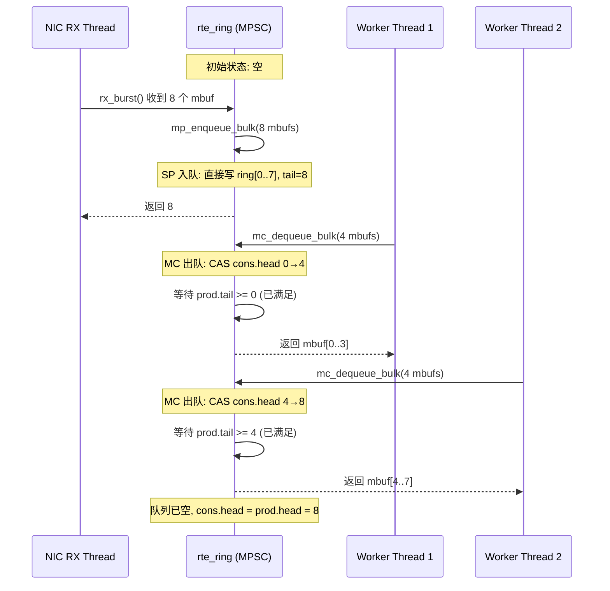
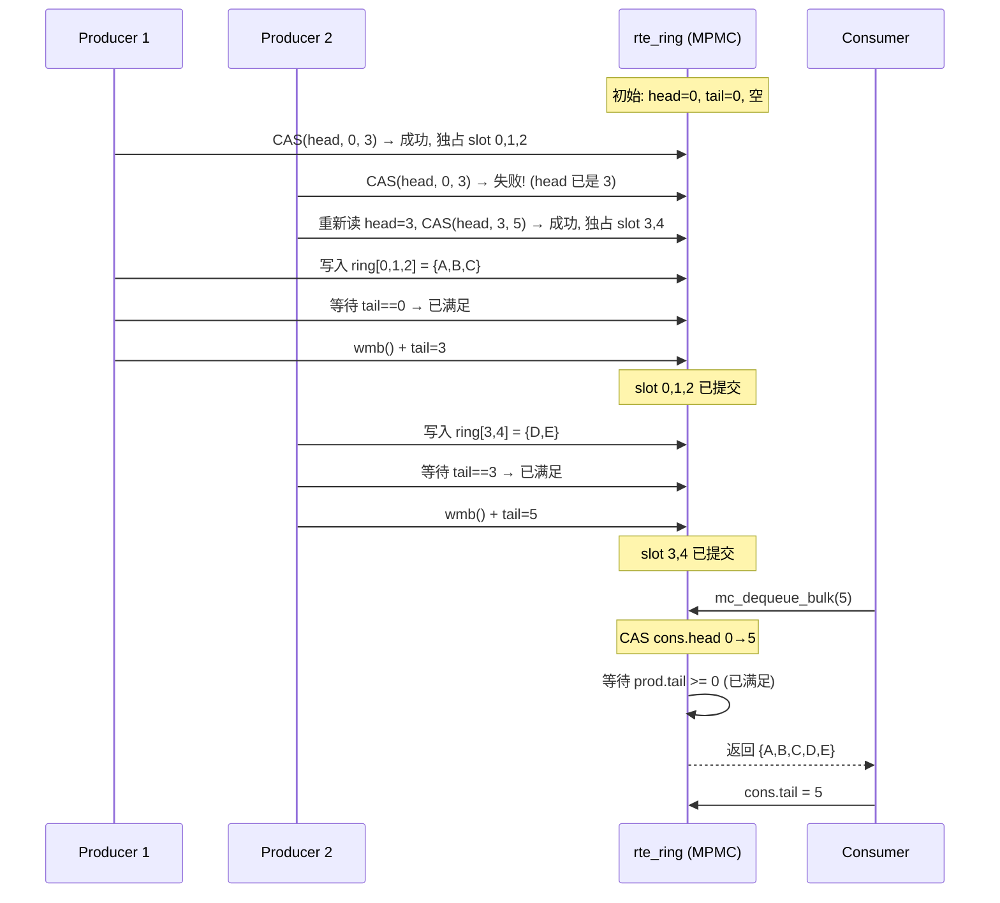

# DPDK Ring Buffer (rte_ring) 工作原理

## 一、概述

`rte_ring` 是 DPDK 提供的**无锁环形队列**，基于 CAS (Compare-And-Swap) 原语实现，支持多生产者多消费者 (MPMC) 场景。它是 DPDK 网络栈中数据包传递的核心数据结构，用于 NIC → 应用、应用核心间、应用 → NIC 的批量数据传输。

```
┌─────────────────────────────────────────────┐
│  典型使用场景                                │
│                                              │
│  NIC RX → rte_ring → Worker Thread 1         │
│  Worker Thread 1 → rte_ring → Worker Thread 2 │
│  Worker Thread → rte_ring → NIC TX           │
│                                              │
│  特点:                                        │
│  ├── 无锁 (lock-free, 基于 CAS)               │
│  ├── 批量操作 (burst enqueue/dequeue)         │
│  ├── 定长元素 (指针大小)                       │
│  ├── 环形缓冲区 (固定容量, 2 的幂)             │
│  └── 内存屏障保证正确性                        │
└─────────────────────────────────────────────┘
```

---

## 二、数据结构

### 2.1 核心结构

```c
struct rte_ring {
    char name[RTE_RING_NAMESIZE];   // 名称

    // 生产者和消费者的计数器各自在独立缓存行
    // 避免 false sharing (伪共享)

    struct rte_ring_headtail prod ____rte_cache_aligned;  // 生产者头尾
    struct rte_ring_headtail cons ____rte_cache_aligned;  // 消费者头尾

    struct rte_ring_tailq *tailq;     // 队列链表
    uint32_t size;                    // 环大小 (实际容量 = size - 1)
    uint32_t mask;                    // 掩码 (size - 1)
    uint32_t capacity;                // 实际可用容量

    void *memzone;                    // 指向环形数组
} __rte_cache_aligned;

// 头尾计数器
struct rte_ring_headtail {
    volatile uint32_t head;  // 头指针 (next write/read position)
    volatile uint32_t tail;  // 尾指针 (next free/slot position)
};

// 环形数组
void *ring[0];  // 柔性数组, 实际容量为 size 个指针
```

### 2.2 内存布局

```
cache line 0 (64 bytes):
┌─────────────────────────────────────────────┐
│ prod.head (4B)                              │
│ prod.tail (4B)                              │
│ (padding, 对齐到 cache line)                  │
├─────────────────────────────────────────────┤
│ cons.head (4B)                              │
│ cons.tail (4B)                              │
│ (padding, 对齐到 cache line)                  │
├─────────────────────────────────────────────┤
│ ring 结构体其他字段                           │
└─────────────────────────────────────────────┘

独立缓存行:
┌─────────────────────────────────────────────┐
│ void *ring[0]    ← 环形数组                  │
│ void *ring[1]                               │
│ void *ring[2]                               │
│ ...                                         │
│ void *ring[size-1]                           │
└─────────────────────────────────────────────┘

关键: prod 和 cons 在不同 cache line
      → 生产者修改 prod.* 不影响消费者的 cache line
      → 消费者修改 cons.* 不影响生产者的 cache line
      → 避免 false sharing
```

### 2.3 索引计算

```
size 必须是 2 的幂 (如 256, 1024, 4096)
mask = size - 1 (如 255, 1023, 4097)

索引计算: index = pos & mask

示例: size = 8, mask = 7
  pos=0  → index=0  → ring[0]
  pos=5  → index=5  → ring[5]
  pos=7  → index=7  → ring[7]
  pos=8  → index=0  → ring[0]  (回绕!)
  pos=9  → index=1  → ring[1]  (回绕!)
```

---

## 三、四种操作模式

| 模式 | 宏 | 生产者 | 消费者 | 适用场景 |
|------|-----|--------|--------|---------|
| **SPSC** | `RTE_RING_F_SP_ENQ` / `SC_DEQ` | 单生产者 | 单消费者 | 核心间点对点 |
| **MPSC** | `RTE_RING_F_MP_ENQ` / `SC_DEQ` | 多生产者 | 单消费者 | NIC → Worker |
| **SPMC** | `RTE_RING_F_SP_ENQ` / `MC_DEQ` | 单生产者 | 多消费者 | Worker → NIC TX |
| **MPMC** | `RTE_RING_F_MP_ENQ` / `MC_DEQ` | 多生产者 | 多消费者 | 通用 |

```
性能排序: SPSC > MPSC/SPMC > MPMC

SPSC: 无 CAS, 纯读改写, 最快
MPSC: 生产者需要 CAS, 消费者不需要
SPMC: 生产者不需要 CAS, 消费者需要
MPMC: 双方都需要 CAS, 最慢 (但仍比锁快很多)
```

---

## 四、SPSC 模式工作原理（最简单）

### 4.1 入队 (Enqueue)

```
初始状态 (size=8, capacity=7):
  prod.head = 0, prod.tail = 0
  cons.head = 0, cons.tail = 0
  已用: 0 个元素

入队 3 个元素:

  Step 1: 计算 free = prod.tail + capacity - cons.head = 0 + 7 - 0 = 7
  Step 2: free >= 3, 可以入队
  Step 3: 写入:
    ring[0 & 7] = obj0  (prod.head=0 → index=0)
    ring[1 & 7] = obj1  (prod.head=1 → index=1)
    ring[2 & 7] = obj2  (prod.head=2 → index=2)
  Step 4: prod.head = 0 + 3 = 3

  结果:
  prod.head = 3, prod.tail = 0
  cons.head = 0, cons.tail = 0

  ring: [obj0, obj1, obj2, -, -, -, -, -]
         cons↑               prod↑
```

### 4.2 出队 (Dequeue)

```
当前状态:
  prod.head = 3, prod.tail = 0
  cons.head = 0, cons.tail = 0

  ring: [obj0, obj1, obj2, -, -, -, -, -]
         cons↑               prod↑

出队 2 个元素:

  Step 1: 计算 avail = prod.head - cons.head = 3 - 0 = 3
  Step 2: avail >= 2, 可以出队
  Step 3: 读取:
    out[0] = ring[0 & 7] = obj0  (cons.head=0 → index=0)
    out[1] = ring[1 & 7] = obj1  (cons.head=1 → index=1)
  Step 4: cons.head = 0 + 2 = 2

  结果:
  ring: [obj0, obj1, obj2, -, -, -, -, -]
                   cons↑     prod↑
  (obj0 和 obj1 仍在 ring 中, 但逻辑上已出队)
```

### 4.3 为什么 capacity = size - 1

```
size = 8 (数组大小)
capacity = 7 (实际可用)

当 prod.head == cons.head 时:
  → 队列空 (0 个元素)

当 prod.head - cons.head == capacity 时:
  → 队列满 (7 个元素)

如果 capacity == size:
  队空: prod.head == cons.head
  队满: prod.head == cons.head  ← 无法区分!

所以必须留一个空位来区分 队空 和 队满。
```

---

## 五、MPMC 模式工作原理（最复杂）

### 5.1 多生产者入队 (MP Enqueue)

```
核心问题: 多个生产者同时写 prod.head, 如何保证不冲突?

解决方案: CAS (Compare-And-Swap)

  while (prod.head - cons.tail < capacity) {
    // 1. 移动本地 head (prod.head → prod.head + 1)
    old_head = prod.head;
    new_head = old_head + 1;
    if (CAS(&prod.head, &old_head, new_head)) {
      // 2. CAS 成功, 独占 ring[old_head & mask]
      ring[old_head & mask] = obj;
      // 3. 等待轮到自己更新 tail
      while (prod.tail != old_head) { pause(); }
      // 4. 更新 tail, 通知其他生产者
      prod.tail = new_head;
      break;
    }
    // CAS 失败 → 重试 (其他生产者抢先了)
  }
```

### 5.2 详细时序：2 个生产者同时入队

```
初始状态:
  prod.head = 0, prod.tail = 0
  ring: [-, -, -, -, -, -, -]

生产者 A 要入队 obj_a:
  生产者 B 要入队 obj_b:

  时间线:

  T1: A 读取 prod.head = 0
  T2: B 读取 prod.head = 0

  T3: A CAS(&prod.head, 0, 1) → 成功!
      prod.head = 1
      A 独占 ring[0]

  T4: B CAS(&prod.head, 0, 1) → 失败! (prod.head 已是 1)
      B 重新读取 prod.head = 1

  T5: B CAS(&prod.head, 1, 2) → 成功!
      prod.head = 2
      B 独占 ring[1]

  T6: A 写入 ring[0 & mask] = obj_a
  T7: A 等待 prod.tail == 0 → 已满足
      A 设置 prod.tail = 1
      (现在 ring[0] 对其他生产者可见为已提交)

  T8: B 写入 ring[1 & mask] = obj_b
  T9: B 等待 prod.tail == 1 → 已满足 (A 在 T7 已更新)
      B 设置 prod.tail = 2

  最终:
    prod.head = 2, prod.tail = 2
    ring: [obj_a, obj_b, -, -, -, -, -]
```

### 5.3 内存屏障的作用

```
为什么需要内存屏障?

  问题 1: 入队顺序
    A 写入 ring[0] 后, 如果没有屏障,
    其他 CPU 可能看到 prod.tail=1 但 ring[0] 仍是旧值

  解决: rte_smp_wmb() (Store-Store 屏障)
    ring[old_head & mask] = obj;
    rte_smp_wmb();           ← 确保 ring[] 写入在 tail 更新之前完成
    prod.tail = new_head;    ← 其他 CPU 看到新 tail 时, ring[] 一定已写入

  问题 2: 出队顺序
    B 读取 ring[0] 后, 如果没有屏障,
    生产者 A 可能在这之后才写入 ring[0]

  解决: rte_smp_rmb() (Load-Load 屏障)
    while (prod.tail == old_head) { pause(); }  ← 等待生产者提交
    rte_smp_rmb();           ← 确保 ring[] 读取在 tail 读取之后
    obj = ring[old_head & mask];  ← 此时 ring[] 一定已写入
```

---

## 六、批量操作 (Burst)

DPDK 的核心优化是**批量入队/出队**，一次操作 N 个元素：

```c
// 批量入队
unsigned int rte_ring_mp_enqueue_bulk(struct rte_ring *r,
                                       void *const *obj_table,
                                       unsigned int n);

// 批量出队
unsigned int rte_ring_mc_dequeue_bulk(struct rte_ring *r,
                                       void **obj_table,
                                       unsigned int n);
```

### 6.1 批量入队流程

```
批量入队 4 个元素:

  Step 1: 检查空间
    free = prod.tail + capacity - cons.head
    if (free < 4) → 队列满, 返回 0

  Step 2: 原子移动 head (一次 CAS 移动 4 个位置)
    old_head = prod.head
    new_head = old_head + 4
    CAS(&prod.head, &old_head, new_head) → 成功
    // 独占了 ring[old_head] ~ ring[new_head-1]

  Step 3: 批量写入 (无竞争)
    ring[(old_head+0) & mask] = obj[0]
    ring[(old_head+1) & mask] = obj[1]
    ring[(old_head+2) & mask] = obj[2]
    ring[(old_head+3) & mask] = obj[3]

  Step 4: 等待 tail 追上 old_head
    while (prod.tail != old_head) { pause(); }

  Step 5: 更新 tail
    rte_smp_wmb();          // 内存屏障
    prod.tail = new_head    // 一次性开放 4 个位置

  关键: 4 个元素只做 1 次 CAS (而非 4 次)
        CAS 是最昂贵的操作, 批量化显著降低争用
```

### 6.2 批量出队流程

```
批量出队 4 个元素:

  Step 1: 检查可用
    avail = prod.head - cons.head
    if (avail < 4) → 队列空, 返回 0

  Step 2: 原子移动 head
    old_head = cons.head
    new_head = old_head + 4
    CAS(&cons.head, &old_head, new_head) → 成功

  Step 3: 等待 prod.tail 追上 old_head (确保所有生产者已提交)
    while (prod.tail != old_head) { pause(); }
    rte_smp_rmb();  // 内存屏障

  Step 4: 批量读取 (无竞争)
    obj[0] = ring[(old_head+0) & mask]
    obj[1] = ring[(old_head+1) & mask]
    obj[2] = ring[(old_head+2) & mask]
    obj[3] = ring[(old_head+3) & mask]

  Step 5: 更新 tail (通知其他消费者 + 通知生产者有空间)
    cons.tail = new_head
```

---

## 七、完整时序流程图

### 7.1 NIC → Worker (MPSC 批量出队)



### 7.2 多生产者批量入队 (MPMC)



---

## 八、性能分析

### 8.1 为什么比加锁队列快

```
互斥锁队列:
  enqueue:
    pthread_mutex_lock()    ← 内核态切换 (~1μs)
    ... enqueue ...
    pthread_mutex_unlock()  ← 内核态切换 (~1μs)
  总开销: ~2μs/操作 (无论是否有竞争)

rte_ring:
  SP enqueue:
    ring[pos & mask] = obj  ← 纯内存写
    prod.head++             ← 纯内存写
    总开销: ~10ns/操作

  MP enqueue (无竞争):
    CAS(&prod.head)         ← 原子操作 (~20ns)
    ring[pos & mask] = obj  ← 纯内存写
    prod.tail++             ← 纯内存写
    总开销: ~30ns/操作

  MP enqueue (有竞争):
    CAS 重试 × N            ← 竞争越多越慢
    但仍在用户态, 不进入内核

差距: rte_ring 比 mutex 快 50~200 倍 (取决于竞争程度)
```

### 8.2 批量操作的加速效果

```
单元素 vs 批量:

  入队 32 个元素:
    单元素: 32 次 CAS × ~30ns = ~960ns
    批量:   1 次 CAS × ~30ns + 32 次写入 × ~2ns = ~94ns
    加速比: 10x

  入队 256 个元素:
    单元素: 256 × ~30ns = ~7680ns
    批量:   1 × ~30ns + 256 × ~2ns = ~542ns
    加速比: 14x
```

---

## 九、rte_ring 在 DPDK 网络栈中的位置

```
┌─────────────────────────────────────────────┐
│  Application                                │
│  ├── Worker Thread 0                        │
│  ├── Worker Thread 1                        │
│  └── Worker Thread N                        │
├─────────────────────────────────────────────┤
│  rte_ring (无锁批量传递)                    │
│  ├── RX Ring: NIC → Worker                  │
│  ├── TX Ring: Worker → NIC                  │
│  └── Ring Between Cores: Worker → Worker    │
├─────────────────────────────────────────────┤
│  rte_mbuf (数据包描述符)                    │
├─────────────────────────────────────────────┤
│  PMD (Poll Mode Driver)                     │
│  ├── rx_burst(): 从 NIC 接收 mbuf 到 RX Ring│
│  └── tx_burst(): 从 TX Ring 发送 mbuf 到 NIC│
├─────────────────────────────────────────────┤
│  NIC (Network Interface Card)               │
└─────────────────────────────────────────────┘

典型数据路径:
  NIC → rx_burst() → RX Ring → Worker 处理 → TX Ring → tx_burst() → NIC
  每次 burst 传递 32~64 个 mbuf, 仅 1~2 次 CAS 操作
```

---

## 十、关键设计总结

| 设计点 | 实现方式 | 效果 |
|--------|---------|------|
| **无锁** | CAS 原语 | 避免内核切换, 用户态执行 |
| **缓存行隔离** | `____rte_cache_aligned` | 避免 false sharing |
| **2 的幂大小** | `size & mask` 取代 `%` | 索引计算用位运算 |
| **留空一位** | `capacity = size - 1` | 区分队空和队满 |
| **批量操作** | 一次 CAS 移动 N 个 head | CAS 开销分摊到 N 个元素 |
| **内存屏障** | `rte_smp_wmb/rmb` | 保证跨 CPU 可见性 |
| **定长元素** | `void*` 指针数组 | 无序列化/反序列化开销 |
| **Head-Tail 双指针** | 生产者和消费者独立 | 支持并发读写 |

---
