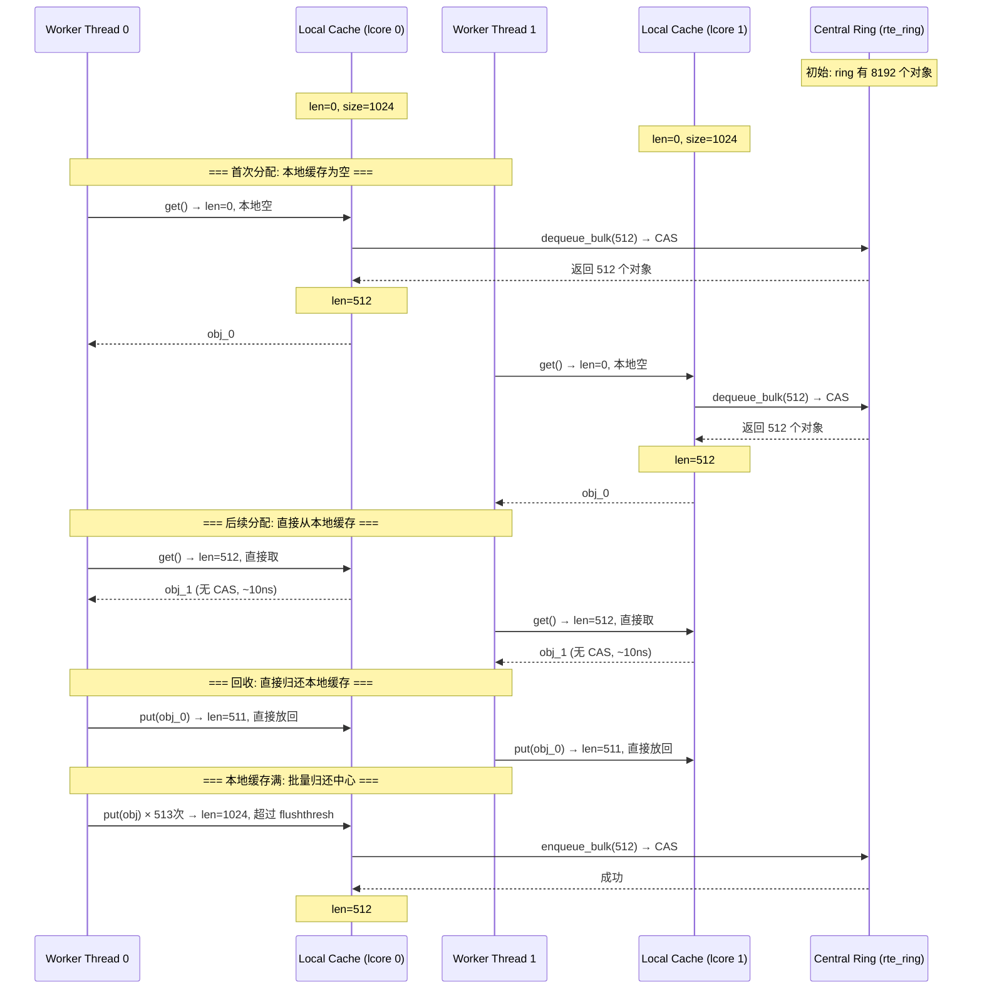
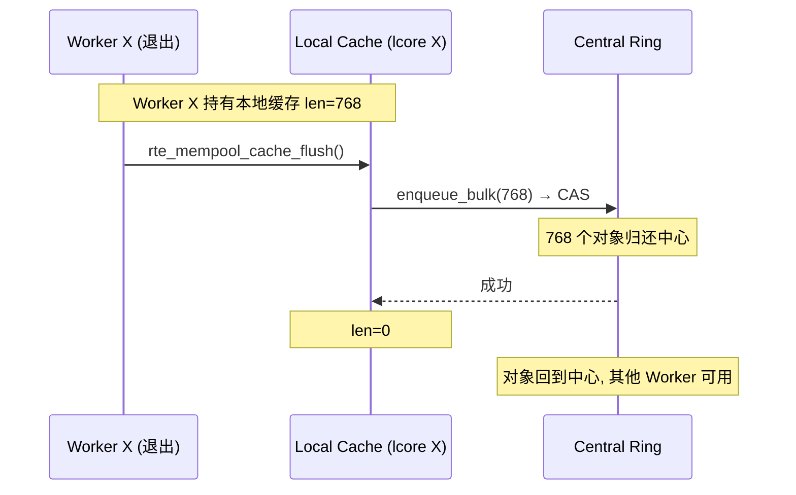

# DPDK rte_mempool 实现原理

## 一、概述

`rte_mempool` 是 DPDK 提供的**固定大小对象的内存池**，为数据包缓冲区（mbuf）、环形队列元素等高频分配对象提供无锁、零碎片、缓存友好的内存管理。

```
核心设计目标:
  ├── 固定大小对象 → 无碎片
  ├── per-core cache → 无 CAS (最常见路径)
  ├── 连续内存布局 → 缓存友好
  ├── NUMA 感知 → 跨节点访问最小化
  └── DMA 支持 → 可注册到网卡
```

---

## 二、内存布局

### 2.1 整体架构

```
┌─────────────────────────────────────────────────────────┐
│  rte_mempool (管理结构, 缓存行对齐)                        │
│                                                          │
│  ┌──────────┐ ┌──────────┐ ┌──────────┐ ┌──────────┐    │
│  │lcore 0   │ │lcore 1   │ │lcore 2   │ │lcore N   │    │
│  │local_cache│ │local_cache│ │local_cache│ │local_cache│    │
│  │len=1024  │ │len=1024  │ │len=1024  │ │len=1024  │    │
│  └──────────┘ └──────────┘ └──────────┘ └──────────┘    │
│       ↑             ↑             ↑             ↑          │
│       │         分配/回收       │             │          │
│       └──────── 不经过中心, 直接操作本地缓存 ────────────┘    │
│                     ↓ 空或满时                        │
│  ┌──────────────────────────────────────────────────────┐ │
│  │ ring[0] ──→ [obj, obj, ..., obj] (slab 0, 4096个)  │ │
│  │ ring[1] ──→ [obj, obj, ..., obj] (slab 1, 4096个)  │ │
│  │ ring[2] ──→ [obj, obj, ..., obj] (slab 2, 4096个)  │ │
│  │ ...                                                 │ │
│  │ 每个 ring 是一个 rte_ring (无锁环形队列)              │ │
│  │ 每个 slab 是一块连续内存, 存放多个固定大小对象        │ │
│  └──────────────────────────────────────────────────────┘ │
└─────────────────────────────────────────────────────────┘
```

### 2.2 核心数据结构

```c
struct rte_mempool {
    char name[RTE_MEMPOOL_NAMESIZE];

    // 环形队列 (slab 管理)
    struct rte_ring *ring;           // 空闲对象队列

    // 对象布局
    uint32_t elt_size;               // 单个对象大小
    uint32_t size;                   // 对象总数
    uint32_t align;                  // 对齐方式
    uint32_t header_size;            // 每个对象的私有头部大小
    uint32_t trailer_size;           // 每个对象的尾部大小

    // 内存信息
    void *elt_va_start;              // 对象区域起始虚拟地址
    void *elt_va_end;                // 对象区域结束虚拟地址
    phys_addr_t elt_pa_start;        // 起始物理地址
    uint32_t pg_num;                 // 物理页数量
    uint32_t pg_shift;               // 物理页大小位移

    // per-core cache
    struct rte_mempool_cache local_cache[RTE_MAX_LCORE];

    // NUMA
    int32_t socket_id;               // NUMA 节点 ID

    // 操作函数表 (可选自定义)
    struct rte_mempool_ops *ops;
} __rte_cache_aligned;

// per-core 本地缓存
struct rte_mempool_cache {
    uint32_t size;           // 缓存容量 (如 1024)
    uint32_t flushthresh;    // flush 阈值 (如 256)
    uint32_t len;            // 当前空闲对象数量
    uint32_t count;          // 总分配次数
    void *objs[RTE_MEMPOOL_CACHE_MAX_SIZE];  // 对象指针数组
} __rte_cache_aligned;
```

### 2.3 对象在内存中的排列

```
每个 slab (连续内存块):

  ┌────────┬────────┬────────┬────────┬────────┬────────┐
  │ obj 0  │ obj 1  │ obj 2  │ obj 3  │ ...    │ obj N  │
  │(header)│(header)│(header)│(header)│        │(header)│
  ├────────┼────────┼────────┼────────┼────────┼────────┤
  │  2KB   │  2KB   │  2KB   │  2KB   │        │  2KB   │
  └────────┴────────┴────────┴────────┴────────┴────────┘

  每个 mbuf 对象 = rte_mbuf (128B) + 数据区 (2KB)
  所有对象紧密排列, 内存连续 → CPU 预取友好
```

---

## 三、分配流程 (Get)

### 3.1 正常路径：从本地缓存分配（无 CAS）

```
Worker Thread 0 分配一个 mbuf:

  Step 1: 获取本地缓存
    cache = &mempool->local_cache[lcore_id()]

  Step 2: 检查本地缓存
    if (cache->len > 0)
        → 有空闲对象, 直接取用, 无 CAS!

  Step 3: 取出对象
    cache->len--
    obj = cache->objs[cache->len]

  总开销: 1 次数组索引 + 1 次递减 ≈ 5~10 ns
```

### 3.2 慢路径：本地缓存空，从中心 ring 补充

```
本地缓存为空时的分配:

  Step 1: cache->len == 0, 本地无空闲对象

  Step 2: 批量从中心 ring 获取
    burst = RTE_MEMPOOL_CACHE_MAX_SIZE / 2 = 512
    actual = rte_ring_mc_dequeue_bulk(mempool->ring, cache->objs, burst)

  Step 3: 更新本地缓存
    cache->len = actual

  Step 4: 从本地缓存取一个
    cache->len--
    obj = cache->objs[cache->len]

  总开销: 1 次 CAS (ring dequeue) + 数组拷贝 ≈ 50~100 ns
  但这只在本地缓存被耗尽时才发生
```

---

## 四、回收流程 (Put)

### 4.1 正常路径：归还到本地缓存（无 CAS）

```
Worker Thread 0 回收一个 mbuf:

  Step 1: 获取本地缓存
    cache = &mempool->local_cache[lcore_id()]

  Step 2: 检查是否有空间
    if (cache->len < cache->size)
        → 有空间, 直接归还, 无 CAS!

  Step 3: 归还对象
    cache->objs[cache->len] = obj
    cache->len++

  总开销: 1 次数组写入 + 1 次递增 ≈ 5~10 ns
```

### 4.2 慢路径：本地缓存满，批量归还到中心 ring

```
本地缓存满时的回收:

  Step 1: cache->len >= flushthresh (如 256+)

  Step 2: 批量归还到中心 ring
    burst = cache->len - RTE_MEMPOOL_CACHE_MAX_SIZE / 2
    rte_ring_mp_enqueue_bulk(mempool->ring, cache->objs, burst)

  Step 3: 更新本地缓存
    memmove(cache->objs, cache->objs + burst, remaining)
    cache->len = remaining

  总开销: 1 次 CAS (ring enqueue) + 数组移动 ≈ 50~100 ns
```

---

## 五、完整时序流程图

### 5.1 分配 + 回收完整流程



### 5.2 跨核心回收（Worker 退出）



---

## 六、per-core cache 的设计原理

### 6.1 为什么 per-core cache 消除了 CAS

```
无 per-core cache (传统内存池):

  Thread A: CAS(&free_list, &head, obj)  ← 全局竞争
  Thread B: CAS(&free_list, &head, obj)  ← 全局竞争
  Thread C: CAS(&free_list, &head, obj)  ← 全局竞争
  → 3 个线程竞争 1 个全局链表, CAS 冲突频繁

有 per-core cache (rte_mempool):

  Thread A: cache_A[cache_A.len--]       ← 私有, 无竞争
  Thread B: cache_B[cache_B.len--]       ← 私有, 无竞争
  Thread C: cache_C[cache_C.len--]       ← 私有, 无竞争
  → 每个线程操作自己的数组, 零竞争

  只在 cache 空或满时, 才通过 CAS 访问中心 ring
  如果 cache 足够大 (1024), 大部分操作都不会命中 CAS
```

### 6.2 cache 大小与 CAS 频率的关系

```
假设:
  每次分配/回收 1 个对象
  cache size = 1024
  flushthresh = 256

Worker 稳定运行:
  ┌─── 分配 ───┐  ┌── 回收 ──┐
  │ get() × 1024 │  put() ×1024│
  │ 0 次 CAS    │  0 次 CAS   │ ← 前 1024 次操作
  │             │  最后 256 次│
  │             │  put() 触发  │
  │             │  enqueue_bulk│ ← 1 次 CAS
  └─────────────┘  └──────────┘

  每 2048 次操作只有 1~2 次 CAS
  CAS 频率 = 1/1024 ≈ 0.1%
```

---

## 七、与 rte_ring 的关系

```
rte_mempool 的中心 ring 就是一个 rte_ring:

  rte_mempool
    ├── local_cache[0]  ← Thread 0 的私有数组 (无锁)
    ├── local_cache[1]  ← Thread 1 的私有数组 (无锁)
    ├── ...
    └── ring            ← rte_ring (CAS 无锁, 共享)

  local_cache ←→ ring 的交互:
    ├── cache 空 → ring.dequeue_bulk(512) → 填充 cache
    └── cache 满 → ring.enqueue_bulk(512) → 清空 cache

  rte_mempool 在 rte_ring 之上增加了:
    ├── per-core cache 消除大部分 CAS
    ├── 连续内存布局 (缓存友好)
    ├── NUMA 感知
    ├── DMA 内存支持
    └── 对象头部/尾部管理
```

---

## 八、NUMA 感知

```
NUMA Node 0:
  ├── CPU Core 0, 1, 2, 3
  ├── mempool_0 (创建在 Node 0)
  │     ├── local_cache[0..3] (线程本地)
  │     ├── ring → slab (Node 0 内存)
  │     └── 所有对象在 Node 0 本地内存

NUMA Node 1:
  ├── CPU Core 4, 5, 6, 7
  ├── mempool_1 (创建在 Node 1)
  │     ├── local_cache[4..7] (线程本地)
  │     ├── ring → slab (Node 1 内存)
  │     └── 所有对象在 Node 1 本地内存

正确做法:
  Core 0 使用 mempool_0 → 内存访问延迟 ~80ns ✓

错误做法:
  Core 0 使用 mempool_1 → 跨 NUMA 访问, 延迟 ~150ns ✗

rte_mempool_create() 时指定 socket_id:
  mp = rte_mempool_create("mbuf_pool", 8192, 2048, 2048,
                          socket_id=0,  // NUMA Node 0
                          NULL, NULL, mbuf_init, NULL);
```

---

## 九、DMA 支持

```
rte_mempool 支持 DMA 内存注册:

  1. 创建时分配大页内存 (hugepages)
  2. 记录每个对象的物理地址
  3. 可传递给 rte_eth_rx_queue_setup()

  对象内存布局:
  ┌──────────────────────────────────┐
  │ private header (自定义)           │ ← rte_mempool 私有头
  ├──────────────────────────────────┤
  │ rte_mbuf (128 bytes)             │ ← 标准描述符
  │   ├── buf_addr = &data[0]        │
  │   ├── buf_physaddr = phys_addr    │ ← 物理地址 (DMA 用)
  │   └── ...                        │
  ├──────────────────────────────────┤
  │ data area (用户数据, 2KB)         │ ← DMA 直接写入区域
  └──────────────────────────────────┘

  DMA 流程:
    NIC DMA → mbuf.data (通过 buf_physaddr, 零 CPU 参与)
    → Worker 直接使用 mbuf (物理地址已记录, 无需地址翻译)
```

---

## 十、性能对比

### 10.1 rte_mempool vs 传统分配器

| 操作 | rte_mempool | malloc | jemalloc | tcmalloc |
|------|-------------|--------|----------|----------|
| 分配 | ~10 ns (cache hit) | ~100~200 ns | ~50~100 ns | ~50~100 ns |
| 回收 | ~10 ns (cache 未满) | ~100~200 ns | ~50~100 ns | ~50~100 ns |
| 碎片 | 无 (固定大小) | 有 | 少量 | 少量 |
| 多线程竞争 | 无 (per-core) | 全局锁 | 竞争少 | 竞争少 |
| DMA 友好 | 是 (物理地址) | 否 | 否 | 否 |
| NUMA 感知 | 是 | 否 | 部分 | 否 |
| 批量操作 | 原生支持 | 不支持 | 不支持 | 不支持 |

### 10.2 rte_mempool 的典型性能

```
环境: 2.5 GHz CPU, 单核

  单次分配 (cache hit):
    耗时: ~10 ns
    吞吐: ~1 亿次/秒

  批量分配 32 个 (cache hit):
    耗时: ~50 ns
    吞吐: ~6.4 亿次/秒

  单次分配 (cache miss, 需 CAS):
    耗时: ~50~100 ns
    吞吐: ~1000~2000 万次/秒
```

---

## 十一、rte_mempool_cache_flush 的使用场景

```
何时需要 flush:

  1. Worker 线程退出:
     → 将本地缓存的所有对象归还中心 ring
     → 其他 Worker 可以继续使用

  2. 内存不足时:
     → flush 所有 Worker 的本地缓存
     → 让对象回到中心, 重新分配给需要的 Worker

  3. 调试/诊断:
     → 检查 mempool 使用情况
     → flush 后 pool->avail = 实际可用对象数

  正常运行时:
     → 通常不需要 flush
     → 各 Worker 的 cache 自给自足
```

---

## 十二、关键设计总结

| 设计点 | 实现方式 | 效果 |
|--------|---------|------|
| **per-core cache** | 每核独立指针数组 | 最常见路径零 CAS |
| **批量补充/归还** | cache 空/满时与 ring 交互 | CAS 频率降至 0.1% |
| **连续内存** | 大页 + 紧密排列 | CPU 预取友好 |
| **固定大小** | 对象大小编译时确定 | 无碎片 |
| **NUMA 感知** | socket_id 参数 | 避免跨节点访问 |
| **DMA 支持** | 物理地址记录 | NIC 直接写入 |
| **无锁** | rte_ring (CAS) + per-core cache | 无内核切换 |
| **缓存行对齐** | `__rte_cache_aligned` | 避免 false sharing |

**一句话总结**：rte_mempool 通过 per-core cache 将 99%+ 的分配/回收操作变为纯本地数组操作（无 CAS、无锁、无内核切换），仅在本地缓存空/满时通过 rte_ring 批量补充/归还，是 DPDK 高性能数据面转发的基础设施。

---
