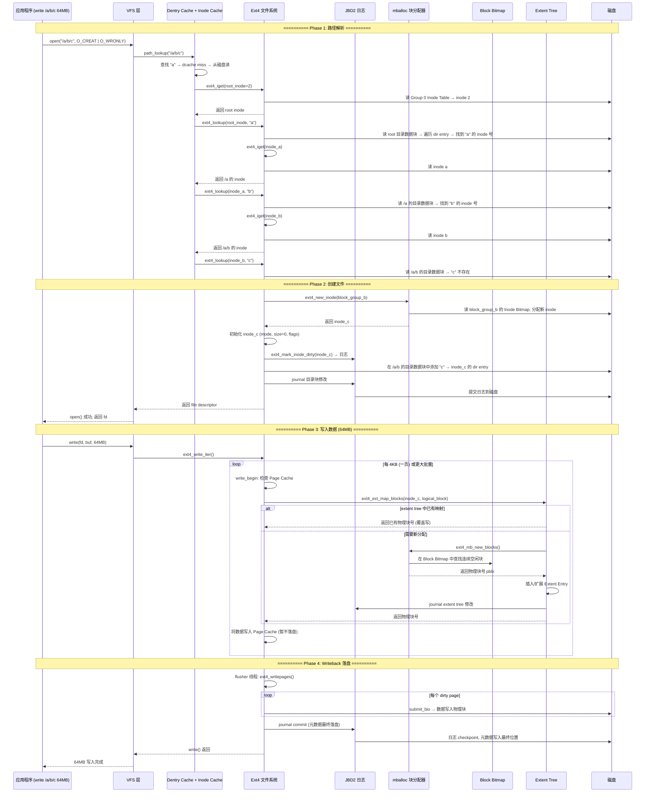
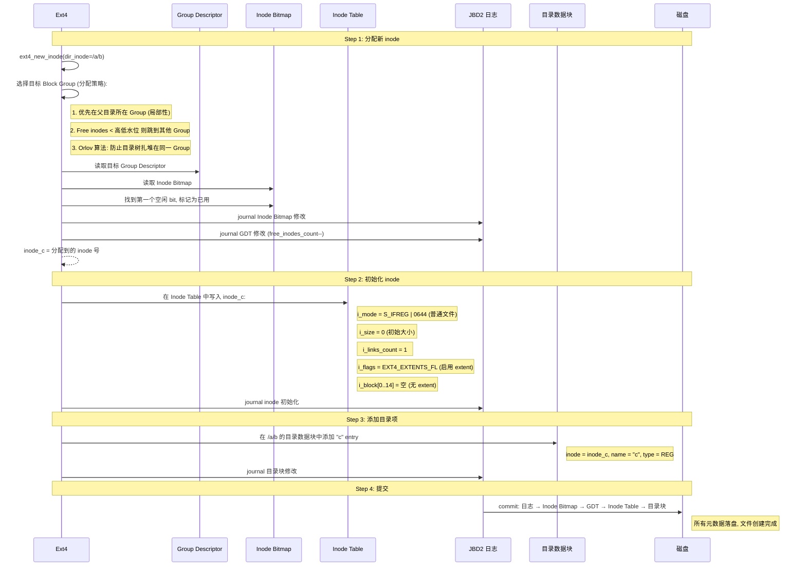
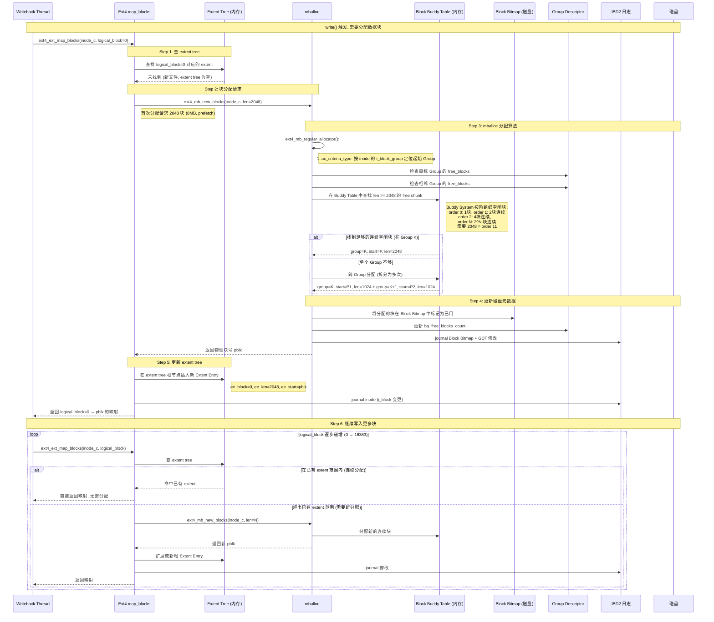
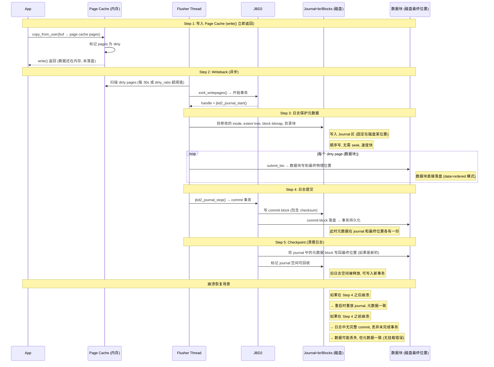

# Ext4 写入 64MB 文件的元数据查询与块分配流程

---

## 1. 问题背景

向 ext4 文件系统写入文件 `/a/b/c`（64MB），需要经过：
1. **路径解析**：逐级查找目录 inode → 目录数据块 → 找到/创建目标文件 inode
2. **块分配**：通过 mballoc 在块位图中找到空闲块
3. **元数据更新**：维护 extent tree 记录逻辑块到物理块的映射
4. **日志保护**：通过 JBD2 保证元数据一致性

---

## 2. Ext4 关键磁盘布局

在分析流程前，先了解涉及的元数据在磁盘上的位置：

```
磁盘 (以 4KB Block 为例, 64MB 文件 = 16384 个 Block):
┌──────────────────────────────────────────────────────────────────────────┐
│  Block 0: Superblock (1 Block)                                          │
│    - s_inodes_count, s_blocks_count, s_log_block_size, s_inode_size     │
│    - s_first_data_block, s_inodes_per_group, s_feature_* (flags)        │
│                                                                          │
│  Block 1: Block Group Descriptor Table (可能跨多个 Block)                │
│    - 每个块组的: bg_block_bitmap, bg_inode_bitmap, bg_inode_table 偏移   │
│    - bg_free_blocks_count, bg_free_inodes_count                          │
│                                                                          │
│  每个 Block Group 结构:                                                  │
│  ┌────────────────────────────────────────────────────────────┐         │
│  │ Superblock 副本 (仅 Group 0,1,..有, 稀疏超级块特性)         │         │
│  │ GDT 副本                                                    │         │
│  │ Block Bitmap (1 Block): 每位代表一个 Block 的空闲状态        │         │
│  │ Inode Bitmap (1 Block): 每位代表一个 Inode 的空闲状态        │         │
│  │ Inode Table: 连续存放 128/256/512 个 Inode (每个 128/256B)   │         │
│  │ Data Blocks: 文件数据块 和 目录数据块                         │         │
│  └────────────────────────────────────────────────────────────┘         │
│                                                                          │
│  Inode 结构 (256 字节):                                                  │
│  ┌────────────────────────────────────────────────────────────┐         │
│  │ i_mode, i_uid, i_size, i_atime, i_ctime, i_mtime           │         │
│  │ i_blocks (扇区数, 用于 quota), i_flags                      │         │
│  │ i_block[0..14] (60 字节): Extent Tree 根节点               │         │
│  │   - 叶节点: 最多 4 个 Extent Entry (每个 12B)                │         │
│  │   - 非叶节点: 最多 5 个 Extent Index (每个 12B)             │         │
│  └────────────────────────────────────────────────────────────┘         │
└──────────────────────────────────────────────────────────────────────────┘

Extent Entry (叶节点, 12 字节):
  ┌──────────────────────────────────────────┐
  │ ee_block    (32bit): 逻辑起始块号         │
  │ ee_len      (16bit): 连续块数             │
  │ ee_start_hi (16bit): 物理块高 16 位       │
  │ ee_start_lo (32bit): 物理块低 32 位       │
  └──────────────────────────────────────────┘
  → 一个 Extent Entry 最多覆盖 2^15 = 32768 块 = 128MB (4KB 块)

Extent Index (非叶节点, 12 字节):
  ┌──────────────────────────────────────────┐
  │ ei_block    (32bit): 逻辑块号 (子节点覆盖的下界)│
  │ ei_leaf_lo  (32bit): 子节点物理块号低 32 位  │
  │ ei_leaf_hi  (16bit): 子节点物理块号高 16 位  │
  │ ei_unused   (16bit): 保留                  │
  └──────────────────────────────────────────┘
```

---

## 3. 完整写入流程总览



---

## 4. Phase 1: 路径解析详解

解析 `/a/b/c` 需要从根目录逐级查找，每一级都要：读 inode → 读目录数据块 → 匹配文件名。

```mermaid
sequenceDiagram
    participant VFS as VFS
    participant IC as Inode Cache (内存)
    participant EXT as Ext4
    participant IT as Inode Table (磁盘)
    participant DB as Directory Block (磁盘)

    Note over VFS,DB: 查找 "/" 根目录

    VFS->>IC: 查找 inode 2 (root)
    IC-->>VFS: hit (root inode 常驻内存)

    Note over VFS,DB: 查找 "/a"

    VFS->>EXT: ext4_lookup(root_inode, "a")
    EXT->>EXT: ext4_htree_lookup(root_inode, "a")
    Note right of EXT: 如果目录启用了 dir_index (htree),<br>先用 hash 查找; 否则线性扫描目录块
    EXT->>DB: 读取 root 目录的数据块
    Note right of DB: 遍历 dir entry 结构:<br>inode号 + rec_len + name_len + name

    alt 找到 "a"
        DB-->>EXT: inode_a = 12837
        EXT->>IT: ext4_iget(12837)
        IT->>IT: 计算: group = (12837 - 1) / inodes_per_group
        IT->>IT: 计算: offset = (12837 - 1) % inodes_per_group
        IT-->>EXT: 读 GDT[group].bg_inode_table + offset * inode_size
        EXT-->>VFS: 返回 /a 的 inode (dentry 缓存)
    else 未找到
        EXT-->>VFS: 返回 -ENOENT
    end

    Note over VFS,DB: 查找 "/a/b" (同样的过程)

    VFS->>EXT: ext4_lookup(inode_a, "b")
    EXT->>DB: 读 /a 的目录数据块
    DB-->>EXT: inode_b = 24591
    EXT->>IT: ext4_iget(24591)
    IT-->>EXT: 读 inode b
    EXT-->>VFS: 返回 /a/b 的 inode

    Note over VFS,DB: 查找 "/a/b/c"

    VFS->>EXT: ext4_lookup(inode_b, "c")
    EXT->>DB: 读 /a/b 的目录数据块, 线性扫描所有 dir entry
    DB-->>EXT: "c" 不存在
    EXT-->>VFS: 返回 -ENOENT → 触发创建文件流程
```

### 4.1 目录项 (dir entry) 在磁盘上的结构

```
目录数据块的内容 (每个目录项):

  ┌──────────────────────────────────────────────────────────┐
  │  inode (4B) │ rec_len (2B) │ name_len (1B) │ type(1B) │ name  │
  │  文件 inode 号│ 此 entry 总长度 │ 文件名长度     │ 文件类型  │ 变长   │
  └──────────────────────────────────────────────────────────┘

  示例: /a/b 目录的内容:

  ┌─────────────────────────────────────────────────────────────┐
  │ .     │ inode=24591 │ self                               │
  │ ..    │ inode=12837 │ parent (/a)                        │
  │ d1    │ inode=25000 │ 其他文件...                        │
  │ d2    │ inode=25001 │ ...                                │
  │      空闲空间 (rec_len 延伸到块尾)                        │
  │                                                   ← 创建 │
  │ c    │ inode=30000 │ 新文件 (创建时填入)                   │
  └─────────────────────────────────────────────────────────────┘

  创建文件 "c" 时:
  - 在 /a/b 的某个目录块中找到足够的空间 (rec_len > 实际需要)
  - 将空闲 rec_len 拆分为两个 entry: 一个放 "c", 一个是剩余空闲
  - 如果块内无空间, 则分配新的数据块并链接
```

---

## 5. Phase 2: 创建文件 inode



---

## 6. Phase 3: 块分配与 Extent Tree 构建 (核心)

64MB 文件 = 16384 个 4KB 块。Ext4 使用 extent tree 管理逻辑块到物理块的映射。

### 6.1 Extent Tree 结构

```
64MB 文件的 Extent Tree (假设块分配基本连续):

  Inode 的 i_block[0..14] (60 字节, 根节点):

  情况 A: 分配连续 (最理想, 1 个 Extent Entry 就够)
  ┌──────────────────────────────────────────────────┐
  │ Root Node (叶子节点, depth=0):                    │
  │   eh_magic = 0xF30A                              │
  │   eh_entries = 1, eh_depth = 0, eh_max = 4       │
  │                                                  │
  │   Entry 0:                                       │
  │     ee_block = 0 (逻辑块 0)                      │
  │     ee_len = 16384 (连续 16384 块 = 64MB)        │
  │     ee_start = 500000 (物理块号)                  │
  └──────────────────────────────────────────────────┘

  情况 B: 分配不连续 (多次分配, 多个 Extent Entry)
  ┌──────────────────────────────────────────────────┐
  │ Root Node (叶子节点, depth=0):                    │
  │   eh_entries = 3, eh_depth = 0, eh_max = 4       │
  │                                                  │
  │   Entry 0: block=0, len=8192, start=500000       │
  │   Entry 1: block=8192, len=4096, start=600000    │
  │   Entry 2: block=12288, len=4096, start=700000   │
  └──────────────────────────────────────────────────┘

  情况 C: 非常碎片化 (Extent Entry 超过 4 个, 树需要分裂)
  ┌──────────────────────────────────────────────────┐
  │ Root Node (索引节点, depth=1):                    │
  │   eh_entries = 2, eh_depth = 1, eh_max = 5       │
  │                                                  │
  │   Index 0: block=0 → leaf at physical block 800001│
  │   Index 1: block=4096 → leaf at physical block 800002│
  │                                                  │
  │ Leaf 0 (at block 800001):                         │
  │   Entry 0: block=0, len=4096, start=500000       │
  └──────────────────────────────────────────────────┘
```

### 6.2 块分配详细流程 (mballoc)



### 6.3 64MB 文件的分配时间线

```
写入进度 (64MB = 16384 blocks, 4KB each):

时间 ──────────────────────────────────────────────────────────►

  0MB        8MB        16MB       32MB       48MB       64MB
  │          │          │          │          │          │
  ├─ 首次分配 ─┤─ 分配 ──┤─ 分配 ───┤─ 分配 ───┤─ 分配 ───┤
  │  2048块   │ 2048块   │ 4096块   │ 4096块   │ 4096块   │
  │ (8MB)     │ (8MB)    │ (16MB)   │ (16MB)   │ (16MB)   │
  │          │          │          │          │          │
  ▼          ▼          ▼          ▼          ▼          ▼

Extent Tree 演变:
  ┌─────────────┐   ┌──────────────┐   ┌────────────────────┐
  │ 1 entry     │──▶│ 1 entry 扩展  │──▶│ 1 entry (覆盖全部) │
  │ 0→2048块    │   │ 0→4096块     │   │ 0→16384块          │
  └─────────────┘   └──────────────┘   └────────────────────┘
  分配连续时: extent tree 只需插入一次, 后续都是扩展同一个 entry

  如果分配不连续 (跨 Group):
  ┌─────────────┐   ┌──────────────┐   ┌───────────────────────┐
  │ 1 entry     │──▶│ 2 entries    │──▶│ 3 entries (或更多)    │
  │ 0→1024块    │   │ 0→1024       │   │ 0→1024, 1024→3072,    │
  │ group K     │   │ 1024→2048    │   │ 3072→8192, ...        │
  │             │   │ group K+1    │   │ (可能触发树分裂)       │
  └─────────────┘   └──────────────┘   └───────────────────────┘
```

---

## 7. Phase 4: 数据写入与日志提交



### 7.1 Ext4 数据写入模式 (mount 选项)

```
┌──────────────────────────────────────────────────────────────────┐
│                    日志模式对比 (data= 挂载选项)                   │
│                                                                   │
│  data=ordered (默认):                                             │
│  ────────────────────                                           │
│  先写数据块到最终位置, 再 commit 日志中的元数据                    │
│  保证: 崩溃后文件内容不超出写入量 (可能截断, 但不混杂旧数据)      │
│  64MB 写入时: 数据直接落盘, 不进 journal → 性能好                  │
│                                                                   │
│  data=writeback:                                                 │
│  ────────────────────                                           │
│  数据和元数据都异步写入, 不保证顺序                                │
│  保证: 最高性能, 但崩溃后可能看到旧数据混在新文件中               │
│                                                                   │
│  data=journal:                                                   │
│  ────────────────                                               │
│  数据和元数据都先写 journal                                        │
│  保证: 最强一致性, 但 64MB 数据都要过 journal → 性能最差          │
└──────────────────────────────────────────────────────────────────┘
```

---

## 8. 崩溃一致性保障

```
写入 64MB 文件 /a/b/c 过程中的崩溃场景:

┌──────────────────────────────────────────────────────────────────────┐
│  阶段              │ 崩溃后果              │ 恢复方式               │
│  ──────────────────┼──────────────────────┼───────────────────────  │
│  1. 路径解析中       │ 无影响, 无磁盘修改     │ 无需恢复               │
│  2. inode 分配后     │ inode 泄漏 (少一个)    │ e2fsck 修复            │
│     目录项未写入      │ "c" 不存在             │ fsck 或 无影响          │
│  3. 目录项写入后     │ inode 和目录项都存在   │ 空文件, 无数据         │
│     数据未写入       │ 但 size=0              │ 正常, 文件为空         │
│  4. 部分数据写入     │ size 可能不准确        │ journal 重放恢复       │
│  5. 数据全写入       │ 无影响                 │ 正常                   │
│     日志未 commit    │                       │                        │
│  6. 日志 commit 后   │ 完全一致               │ 无需恢复               │
│     checkpoint 前    │                       │                        │
│  7. checkpoint 后    │ 完全一致, 日志已回收   │ 无需恢复               │
└──────────────────────────────────────────────────────────────────────┘
```

---

## 9. 总结: 元数据查询全链路

```
写入 /a/b/c (64MB) 涉及的所有元数据查询:

  1. Superblock (Block 0)
     → 获取 block_size, inode_size, inodes_per_group 等基础参数

  2. Group Descriptor Table
     → 找到每个 Group 的 Inode Table / Block Bitmap / Inode Bitmap 位置

  3. Inode 读取 (3 次)
     → Root Inode (inode 2) → 解析根目录
     → /a 的 Inode → 解析 /a 目录, 找到 /b
     → /a/b 的 Inode → 解析 /a/b 目录, 确认 /c 不存在

  4. 目录数据块 (2 次读, 1 次写)
     → 读 root 目录块 → 找 "a"
     → 读 /a 目录块 → 找 "b"
     → 写 /a/b 目录块 → 添加 "c" 的 dir entry

  5. Inode 分配
     → 读 Inode Bitmap → 分配新 inode
     → 写 Inode Table → 初始化新 inode

  6. 数据块分配 (64MB = 最多 16384 次 extent tree 查找)
     → 查 extent tree → miss → mballoc 分配
     → 读 Block Bitmap → 标记已用
     → 插入/扩展 Extent Entry
     → (连续分配时大部分查询直接 hit, 实际分配次数远少于此)

  7. JBD2 日志
     → 所有上述元数据修改先进 journal, 再 commit 到最终位置
```
