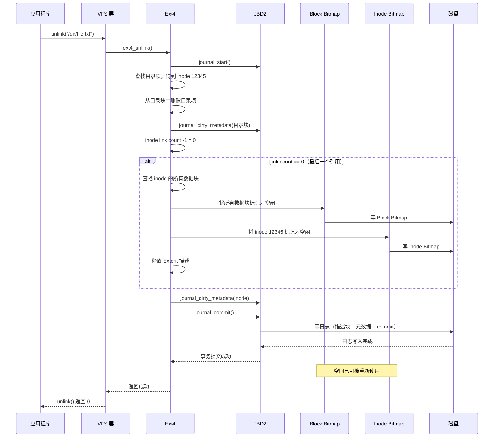
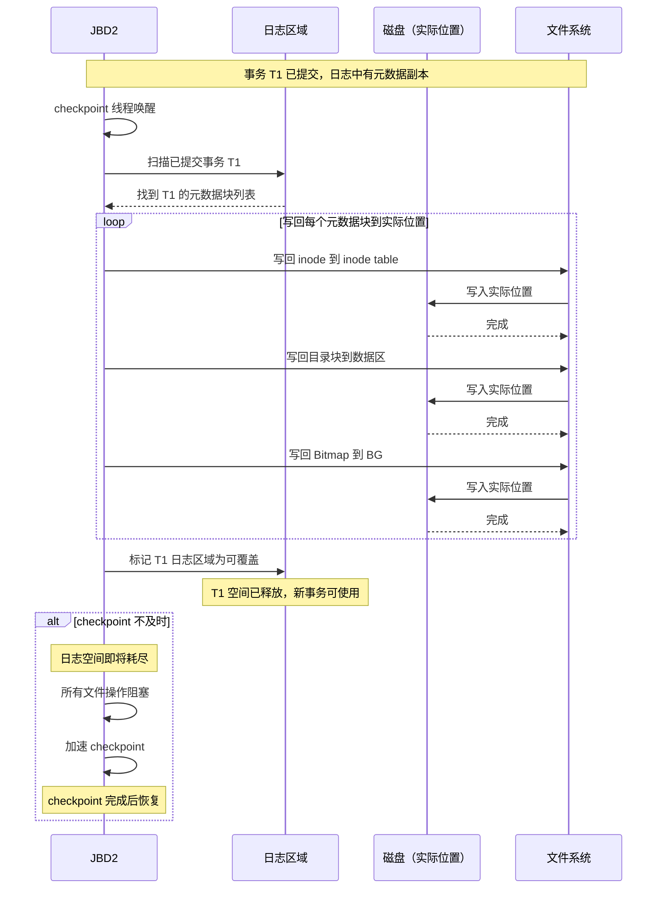
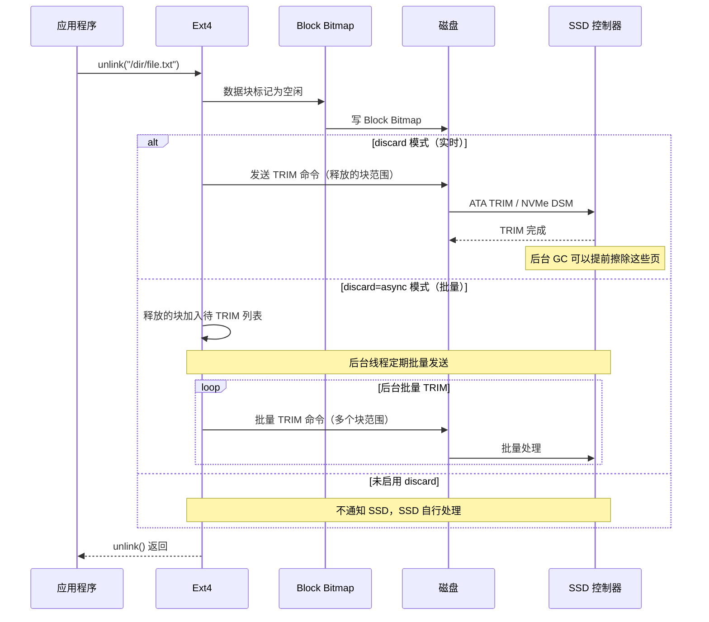
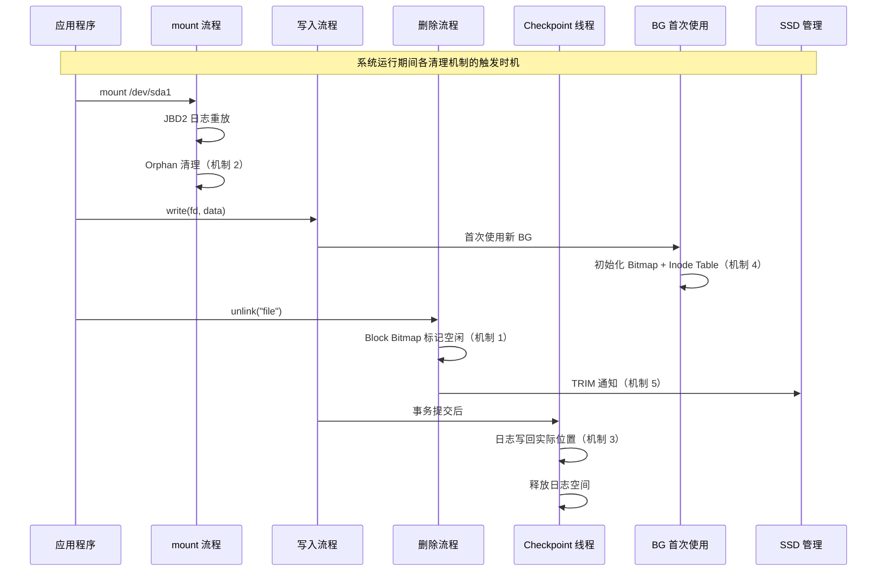

# Ext4 垃圾回收与废弃数据清理机制分析

## 1. 一句话概括

Ext4 没有持续运行的后台 GC 线程，而是通过五种机制在不同时机回收不同类型的废弃数据：删除时同步释放数据块和 inode、mount 时清理崩溃残留的 orphan inode、异步 checkpoint 回收日志空间、首次使用时延迟初始化 Block Group、Discard/TRIM 通知 SSD 释放块。

## 2. ext4 的"GC"哲学

```
ext4 的设计哲学:

  不需要后台 GC 的原因:
    - 删除即释放（unlink 同步回收）
    - 空间管理通过 Bitmap 直接标记（0=空闲，1=已用）
    - 不像 LSM-tree 那样有"无效数据堆积"问题
    - 不需要后台线程扫描和清理

  对比 LSM-tree 数据库（RocksDB、LevelDB）:
    写入 → 产生旧版本数据 → 堆积在 SSTable 中
    → 需要后台 Compaction 线程合并和清理
    → 这才是真正的"GC"

  ext4 的情况:
    写入 → 数据在物理块中
    删除 → Bitmap 标记为空闲 → 空间立即可用
    → 不需要额外清理
```

## 3. 五种清理机制

### 3.1 机制一：unlink 同步释放（最主要的回收方式）

```
删除文件 /dir/file.txt:

  Step 1: 在父目录中删除目录项
  Step 2: inode link count -1
  Step 3: 如果 link count = 0（没有其他硬链接）:
    → 释放所有数据块（Block Bitmap 对应位 置 0）
    → 释放 Extent 描述
    → 释放 inode（Inode Bitmap 对应位 置 0）

时序:
  ┌──────────────────────────────────────────────┐
  │ unlink("/dir/file.txt")                      │
  │                                              │
  │  1. 查找目录项 → 找到 inode 号 12345          │
  │  2. JBD2 事务开始                             │
  │  3. 删除目录项（标记目录块为空闲区域）          │
  │  4. 修改 Block Bitmap（数据块标记为空闲）      │
  │  5. 修改 Inode Bitmap（inode 12345 标记空闲） │
  │  6. 修改 inode（link count = 0）              │
  │  7. JBD2 事务提交                             │
  │  8. unlink() 返回                             │
  │                                              │
  │  此时: 空间已可被重新使用                       │
  │  但: 物理块中的数据内容不会主动擦除              │
  │       新数据写入时自然覆盖                      │
  └──────────────────────────────────────────────┘
```

### 3.2 机制二：Orphan Inode 清理（mount 时回收崩溃残留）

#### 3.2.1 为什么需要 Orphan 清理

```
场景: 应用程序打开文件后崩溃

  正常流程:
    open("file") → write(data) → close() → unlink()
    close 和 unlink 释放资源

  崩溃流程:
    open("file") → write(data) → 崩溃！
    → close() 和 unlink() 没有执行
    → inode 的 link count 仍为 1
    → 但文件已经没有使用者

  如果不清理:
    → 数据块永久占用（空间泄漏）
    → 文件可能处于不一致状态（扩展了但未完成）
```

#### 3.2.2 Orphan 清理流程

```
应用打开文件时:
  ext4_orphan_add()
  → 在超级块的 orphan list 中记录 inode 号
  → 写入 JBD2 日志（保证崩溃后也能恢复）

应用关闭文件时:
  ext4_orphan_del()
  → 从 orphan list 中移除 inode 号

mount 时清理:
  ┌──────────────────────────────────────────────┐
  │ mount /dev/sda1 /mnt                         │
  │                                              │
  │  JBD2 日志重放完成后                           │
  │  ↓                                           │
  │  遍历 orphan list 中的每个 inode:             │
  │                                              │
  │  for each orphan inode:                       │
  │    if link_count == 0:                        │
  │      → 释放 inode 和所有数据块                 │
  │      → 正常删除流程                           │
  │    elif 无目录项引用该 inode:                   │
  │      → 截断文件为 0 大小                       │
  │      → 释放 inode 和数据块                    │
  │    elif 文件过大（崩溃时扩展中断）:             │
  │      → 检查实际分配的块数                      │
  │      → 截断文件到实际大小                      │
  │      → 释放多余的数据块                       │
  │    else:                                      │
  │      → 保留文件（可能有合法打开者）              │
  │                                              │
  │  清理完成后，日志中清除 orphan list              │
  └──────────────────────────────────────────────┘
```

### 3.3 机制三：Journal Checkpoint（回收日志空间）

#### 3.3.1 为什么日志空间需要回收

```
日志区域是固定大小的环形缓冲区:

  ┌──────────────────────────────────────────┐
  │ 日志区域（固定大小，例如 128MB）           │
  │                                          │
  │  T1(已提交) | T2(已提交) | T3(未提交)   │
  │  ↑checkpoint → 可覆盖    ↑必须保留       │
  │                                          │
  │  新事务 T4 需要空间                       │
  │  → 如果 T1 还没 checkpoint → 日志空间不足  │
  │  → 所有文件操作阻塞                       │
  └──────────────────────────────────────────┘
```

#### 3.3.2 Checkpoint 流程

```
异步 Checkpoint（后台线程）:

  Step 1: 选取已提交但未写回的事务（如 T1）
  Step 2: 将 T1 中的元数据写回文件系统实际位置
          - inode 写回 inode table
          - 目录块写回 BG 的数据区
          - Bitmap 写回 BG 的 bitmap 区
  Step 3: 确认写回完成
  Step 4: 标记 T1 的日志区域为可覆盖
  Step 5: 新事务可以使用释放的日志空间

  如果 checkpoint 不及时:
    → 日志空间耗尽
    → 所有文件操作阻塞（等待 checkpoint）
    → 系统卡顿

  checkpoint 速度:
    取决于磁盘写入速度
    默认每 30 秒或日志满 1/4 时触发
    可通过 journal_commit_interval 调整
```

### 3.4 机制四：Uninit Block Group（延迟初始化避免浪费）

```
传统方式（ext2/3）:

  mkfs /dev/sda1（1TB 磁盘）:
    → 初始化约 8000 个 Block Group
    → 每个 BG 的 Inode Table 全部写零（2MB）
    → 每个 BG 的 Inode Bitmap 全部写零
    → 每个 BG 的 Block Bitmap 全部写零
    → 总计写入约 16GB 初始化数据
    → 大磁盘格式化极慢

ext4 Uninit BG:

  mkfs /dev/sda1（1TB 磁盘）:
    → 标记所有 BG 为 "uninit"（只需写 GDT 中的标志位）
    → Inode Table 不初始化
    → Bitmap 不初始化
    → 格式化几乎瞬间完成

  首次使用某个 BG 时:
    → 初始化该 BG 的 Inode Bitmap
    → 初始化该 BG 的 Inode Table
    → 清除 BG 的 Block Bitmap 中的预留位
    → 标记 BG 为 "init"（已初始化）

  清理意义:
    不需要的 BG 永远不初始化 → 避免浪费
    空间按需准备 → 减少不必要的写操作
```

### 3.5 机制五：Discard/TRIM（通知 SSD 释放的块）

#### 3.5.1 为什么 SSD 需要 TRIM

```
SSD 的特性:
  - 写入前必须先擦除（以块为单位，512KB-4MB）
  - 如果不知道某些页已无效，SSD 不会主动擦除
  - 写入时发现需要擦除 → 性能暴跌（write amplification）

ext4 的 Discard:
  数据块被释放时 → 通知 SSD "这些块已无效"
  SSD 后台 GC 可以提前擦除 → 下次写入时直接写入 → 性能好

没有 Discard:
  数据块被释放 → ext4 只标记 Bitmap 为空闲
  SSD 不知道这些页已无效 → GC 时机不确定
  写入时可能需要先擦除 → 性能差
```

#### 3.5.2 TRIM 的三种模式

```
模式 1: discard（实时通知）
  mount -o discard /dev/sda1

  每次释放块时发送 TRIM 命令:
    unlink() → 释放数据块 → 发送 TRIM → 返回

  好处: SSD 始终保持最佳写入性能
  坏处: 每次 unlink 多一次 TRIM 命令，延迟增加

模式 2: discard=async（批量通知，推荐）
  mount -o discard=async /dev/sda1

  释放的块暂存列表，后台批量发送 TRIM:
    unlink() → 释放数据块 → 加入待 TRIM 列表 → 返回
    后台线程: 批量发送 TRIM 命令

  好处: 对 unlink 延迟无影响，SSD 性能仍较好
  坏处: TRIM 不实时，但影响很小

模式 3: 手动 fstrim
  mount /dev/sda1 /mnt（不启用 discard）
  fstrim /mnt -v（手动触发全盘 TRIM）

  好处: 完全控制 TRIM 时机
  坏处: 需要手动或 cron 定时执行

  典型用法: cron 每周执行一次 fstrim
    0 3 * * 0 /usr/bin/fstrim /mnt
```

## 4. 文件截断的特殊清理

```
truncate(file, new_size) 或 ftruncate():

  当 new_size < current_size:
    → 释放 new_size 之后的数据块
    → 更新 inode 的大小

  truncate("/file", 0)（截断为 0）:
    → 释放所有数据块（等同删除数据，保留 inode）
    → inode 大小设为 0
    → 数据块全部归还

  崩溃时截断的一致性:
    JBD2 保证截断是原子的:
    → 要么所有数据块都释放
    → 要么都不释放
    → 不会出现"释放了一半"的状态
```

## 5. 五种机制对比

| 机制 | 回收内容 | 时机 | 频率 | 阻塞业务 |
|---|---|---|---|---|
| unlink 同步释放 | 数据块 + inode | 删除文件时 | 每次删除 | 是 |
| Orphan 清理 | 崩溃残留文件 | mount 时 | 每次挂载 | 是（短暂） |
| Journal Checkpoint | 日志空间 | 事务提交后 | 异步持续 | 可能（日志满时） |
| Uninit BG | 避免无效初始化 | 首次使用 BG | 一次/每 BG | 是（首次使用时） |
| Discard/TRIM | 通知 SSD | 释放块时或定期 | 取决于模式 | 可能（同步模式） |

## 6. 五种清理机制的时序流程图

### 6.1 unlink 同步释放时序



### 6.2 Orphan Inode 清理时序

```mermaid
sequenceDiagram
    participant App as 应用程序
    participant Ext4 as Ext4
    participant JBD2 as JBD2
    participant Orphan as Orphan List
    participant Disk as 磁盘
    participant Kernel as 内核 mount

    Note over App,Disk: Phase 1: 应用运行时注册 orphan

    App->>Ext4: open("file", O_CREAT|O_WRONLY)
    Ext4->>Orphan: ext4_orphan_add(inode 12345)
    Orphan->>JBD2: 记录到日志（保证崩溃可恢复）
    JBD2->>Disk: 写日志
    Ext4-->>App: 返回 fd

    App->>Ext4: write(fd, data)
    Note over Ext4,Disk: 应用崩溃，close/unlink 未执行

    Note over Kernel,Disk: Phase 2: mount 时清理 orphan

    Kernel->>Ext4: mount /dev/sda1
    Ext4->>JBD2: 日志重放（恢复 orphan list）
    JBD2->>Orphan: 加载 orphan list

    loop 遍历每个 orphan inode
        Ext4->>Ext4: 检查 inode 12345

        alt link count == 0
            Ext4->>Ext4: 释放所有数据块
            Ext4->>Ext4: 释放 inode
        elseif 无目录项引用
            Ext4->>Ext4: 截断文件为 0 大小
            Ext4->>Ext4: 释放数据块和 inode
        elseif 文件过大（崩溃中断）
            Ext4->>Ext4: 截断到实际分配大小
            Ext4->>Ext4: 释放多余数据块
        else 文件状态正常
            Ext4->>Ext4: 保留 inode（跳过）
        end
    end

    Ext4->>JBD2: 清除 orphan list
    JBD2->>Disk: 写日志
    Ext4-->>Kernel: 清理完成
```

### 6.3 Journal Checkpoint 时序



### 6.4 Discard/TRIM 时序



### 6.5 五种清理机制的触发时机总览



## 7. ext4 没有的清理能力

```
ext4 不提供以下能力:

  1. 后台碎片整理
     没有自动整理碎片的机制
     需要手动执行 e4defrag
     对比: XFS 有 xfs_fsr 可以在线整理

  2. 空间压缩
     不会主动压缩数据以回收空间
     对比: Btrfs 支持 CoW + 透明压缩

  3. 数据块内容擦除
     删除文件后，物理块中的数据不会主动清零
     新数据写入时自然覆盖
     安全敏感场景需要手动 shred（多次覆写）

  4. 坏块自动检测和替换
     不自动检测坏块
     需要依赖底层存储（SSD 控制器或 RAID）处理
     对比: Btrfs 有内置的 scrub 和坏块替换

  5. 写入放大控制
     不感知 SSD 的写入放大
     对比: F2FS（Flash-Friendly FS）专为 SSD 设计
```

## 8. 与其他文件系统/存储系统的 GC 对比

```
┌──────────────────────────────────────────────────────────────┐
│                   GC 机制对比                                   │
├──────────────┬────────────────────────────────────────────────┤
│ ext4         │ 无后台 GC，删除即释放，Bitmap 直接标记           │
│ XFS          │ 无后台 GC，与 ext4 类似                         │
│ Btrfs        │ 无传统 GC，但 CoW + 事务清理释放旧数据块        │
│ F2FS         │ 无传统 GC，但 SSD segment cleaner 后台整理      │
│ RocksDB      │ 后台 Compaction 合并 SSTable，释放旧版本数据    │
│ LevelDB      │ 后台 Compaction，与 RocksDB 类似               │
│ Ceph OSD     │ 后台 Scrub + Recovery + SnapTrim 回收 PG 空间  │
│ DAOS         │ 后台 GC 回收 VOS 中已删除对象的存储空间         │
│ 3FS          │ 后台 GcManager 回收孤儿 chunk                  │
├──────────────┼────────────────────────────────────────────────┤
│ 设计差异:                                                     │
│   传统文件系统（ext4/XFS）:                                   │
│     覆盖写（in-place update）→ 删除即释放 → 无需 GC           │
│                                                              │
│   CoW 文件系统（Btrfs/ZFS）:                                  │
│     写时复制 → 旧数据块需要清理 → 事务提交时释放              │
│                                                              │
│   LSM 数据库（RocksDB/LevelDB）:                              │
│     追加写 → 旧版本堆积 → 需要后台 Compaction GC              │
│                                                              │
│   分布式存储（Ceph/DAOS/3FS）:                                │
│   多副本 + 故障恢复 → 残留数据 → 需要后台清理                 │
└──────────────────────────────────────────────────────────────┘

核心区别:
  覆盖写文件系统不需要 GC（ext4）
  追加写/Copy-on-Write 需要某种形式的 GC
  分布式系统因为有副本和故障恢复，通常需要后台清理
```

## 9. 总结

```
ext4 的废弃数据清理策略:

  核心原则: 删除即释放，不堆积，不需要后台 GC

  五种清理机制各司其职:
    1. unlink 同步释放 → 日常删除操作的空间回收
    2. Orphan 清理     → 崩溃恢复时的残留清理
    3. Checkpoint      → 日志空间的循环利用
    4. Uninit BG       → 初始化成本的延迟摊销
    5. Discard/TRIM    → SSD 健康维护

  本质原因:
    ext4 使用覆盖写（in-place update）模式
    空间管理通过 Bitmap 直接标记
    删除操作同步修改 Bitmap
    不产生"无效但未回收"的中间状态
    → 所以不需要后台 GC 线程
```
