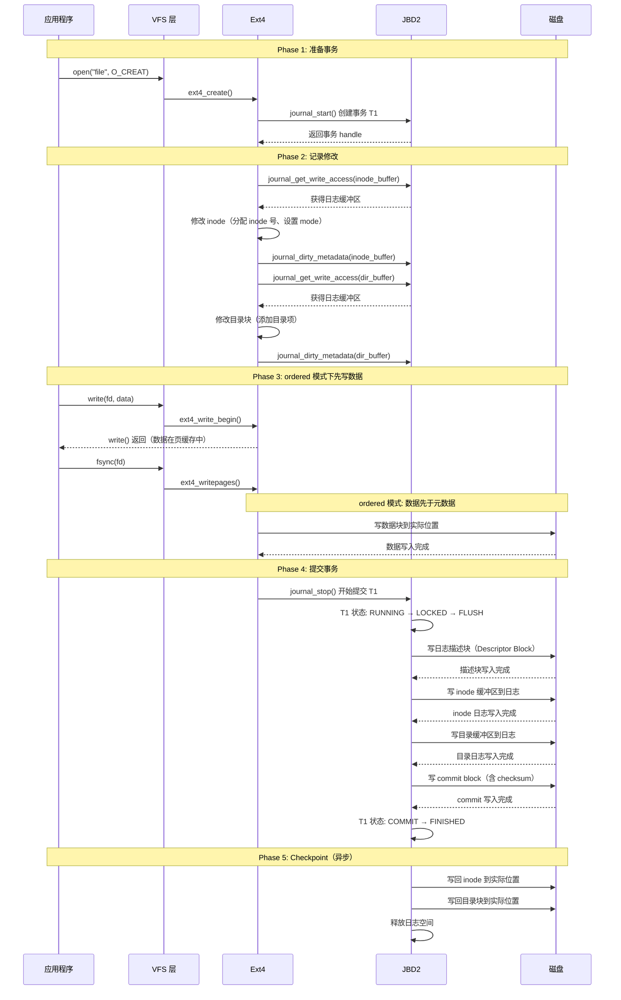
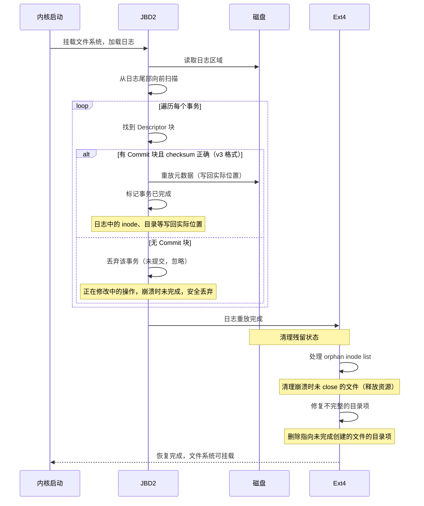

# Ext4 数据一致性保障机制分析

## 1. 一句话概括

Ext4 通过 JBD2 日志系统保障数据一致性：先在日志中记录将要修改的元数据（writeback/ordered 模式）或数据和元数据（journal 模式），日志 commit 成功后再写回实际位置，崩溃恢复时通过重放日志修复不一致状态。

## 2. 文件系统一致性面临哪些威胁

```
文件系统需要在以下场景中保持一致:

  1. 正常关机
     所有脏数据刷盘 → 一致（没有威胁）

  2. 掉电/内核崩溃
     数据可能在以下任意阶段中断:
     - 数据已写入磁盘，但元数据还没写
     - 元数据已写入磁盘，但位图还没更新
     - 位图已更新，但新分配的块被标记为空闲
     - 多个元数据修改只完成了一部分

  3. 典型不一致场景（无日志时）:
     创建文件:
       Step 1: 分配 inode（inode bitmap 标记为已用）  ← 完成
       Step 2: 更新目录项（写入新文件名）              ← 完成
       Step 3: 更新超级块（inode 计数 +1）            ← 崩溃！
     结果: 超级块记录的 inode 数与实际不一致

  4. 更严重的不一致:
     写文件时:
       Step 1: 分配数据块（block bitmap 标记为已用）  ← 完成
       Step 2: 写数据到数据块                         ← 崩溃！
       Step 3: 更新 inode 的 Extent                    ← 未执行
     结果: 数据块被标记为已用但没有任何 inode 引用它
           → 空间泄漏，无法回收

ext4 的解决方案: 日志（Journal）
  核心思想: 先记日志 → 再执行 → 崩溃后按日志恢复
```

## 3. JBD2 日志系统

### 3.1 日志的三种模式

| 模式 | 元数据日志 | 数据日志 | 性能 | 安全性 | 说明 |
|---|---|---|---|---|---|
| **writeback** | 是 | 否 | 最高 | 最低 | 数据可能在元数据之后写入，崩溃可能丢失新数据 |
| **ordered**（默认） | 是 | 否（但保证数据先写） | 高 | 中 | 数据先于元数据写入磁盘，不会出现"指向垃圾数据"的元数据 |
| **journal** | 是 | 是 | 最低 | 最高 | 数据和元数据都先写日志，完全保证不丢失 |

### 3.2 三种模式的写入顺序

```
writeback 模式:
  ┌──────────────────────────────────────────┐
  │ 1. 写日志（仅元数据）                      │
  │ 2. Commit 日志                            │
  │ 3. 写回元数据到实际位置                     │
  │ 4. 写数据（可能已写，也可能没有）            │
  │                                          │
  │ 问题: 崩溃后元数据可能指向未写入的数据块    │
  │       读取该文件可能返回垃圾数据           │
  └──────────────────────────────────────────┘

ordered 模式（默认）:
  ┌──────────────────────────────────────────┐
  │ 1. 写数据到实际位置（先写数据！）           │
  │ 2. 写日志（仅元数据）                      │
  │ 3. Commit 日志                            │
  │ 4. 写回元数据到实际位置                     │
  │                                          │
  │ 保证: 元数据提交时，数据一定已到达磁盘      │
  │       崩溃后最多丢失最近的数据（文件尾部）  │
  │       不会出现"指向垃圾数据"的情况         │
  └──────────────────────────────────────────┘

journal 模式:
  ┌──────────────────────────────────────────┐
  │ 1. 写数据到日志                           │
  │ 2. 写元数据到日志                         │
  │ 3. Commit 日志                            │
  │ 4. 写回数据到实际位置                      │
  │ 5. 写回元数据到实际位置                     │
  │                                          │
  │ 保证: 崩溃后数据不丢失                     │
  │ 代价: 所有数据写两次（日志 + 实际位置）     │
  └──────────────────────────────────────────┘
```

### 3.3 为什么 ordered 模式是默认选择

```
ordered 模式的巧妙之处:

  问题: 如何在不写数据日志的情况下，保证元数据不指向垃圾数据？

  解决: 写数据 → 写日志 → Commit

  时序保证:
    硬件写屏障（barrier）确保:
    Step 1（写数据）必须在 Step 2（写日志）之前完成
    即使内核崩溃/掉电，数据块要么已写要么未写
    元数据 commit 后指向的数据块一定是已成功写入的

  牺牲什么:
    如果在"写数据"和"写日志"之间崩溃:
      → 数据已写但元数据未更新
      → 新文件的数据在磁盘上，但 inode 不引用它
      → 空间泄漏（fsck 可以回收）
    但不会出现更严重的问题（数据损坏）

  为什么不用 journal 模式:
    所有数据写两次 → 性能下降约 50%
    大多数场景不需要这么强的一致性
    ordered 模式是性能和安全的最佳平衡
```

## 4. JBD2 事务的完整生命周期

### 4.1 事务状态机

```
┌──────────────────────────────────────────────────────────────┐
│                    JBD2 事务状态机                              │
├──────────────────────────────────────────────────────────────┤
│                                                              │
│  T_RUNNING ──→ T_LOCKED ──→ T_FLUSH ──→ T_COMMIT ──→ T_FINISHED│
│  (运行中)     (锁定)     (刷脏)      (提交)      (完成)       │
│                                                              │
│  T_RUNNING:  事务活跃，可以添加新的元数据修改                    │
│  T_LOCKED:   停止接受新修改，锁定事务                           │
│  T_FLUSH:    将所有待提交的缓冲区刷到日志磁盘                    │
│  T_COMMIT:   写入 commit block，事务永久化                      │
│  T_FINISHED: 事务完成，进入 checkpoint（异步写回实际位置）        │
│                                                              │
└──────────────────────────────────────────────────────────────┘
```

### 4.2 完整事务时序流程



## 5. 日志的磁盘布局

```
┌──────────────────────────────────────────────────────────────────┐
│                    日志区域（隐藏文件，通常 inode 8）               │
├──────────────────────────────────────────────────────────────────┤
│                                                                  │
│  环形缓冲区，循环使用:                                            │
│                                                                  │
│  ┌──────┐ ┌──────┐ ┌──────┐ ┌──────┐ ┌──────┐ ┌──────┐         │
│  │Desc 1│ │Meta1 │ │Meta2 │ │Commit│ │Desc 2│ │Meta3 │ ...      │
│  │描述块 │ │元数据1│ │元数据2│ │提交块 │ │描述块 │ │元数据3│         │
│  └──────┘ └──────┘ └──────┘ └──────┘ └──────┘ └──────┘         │
│  ├──────── 事务 1 ────────┤├──── 事务 2 ───────┤                  │
│                                                                  │
│  描述块（Descriptor Block）:                                       │
│    标识事务开始                                                    │
│    包含序列号（sequence number）                                    │
│    列出后续有多少个元数据块属于该事务                                │
│    每个 buffer 4 字节描述（block nr + size + flags）               │
│                                                                  │
│  提交块（Commit Block）:                                          │
│    标识事务结束                                                    │
│    包含 commit 序列号（与描述块配对）                              │
│    v3 日志格式包含 checksum（保证日志完整性）                      │
│    只有 commit 块写入成功，事务才算有效                             │
│                                                                  │
│  Checkpoint:                                                     │
│    已提交的事务，其元数据异步写回文件系统实际位置                    │
│    写回完成后，日志空间被释放（可被新事务覆盖）                      │
│    如果在 checkpoint 完成前崩溃 → 重启时再次重放                    │
│    重放是幂等的（再次写回相同数据，不会出错）                       │
│                                                                  │
└──────────────────────────────────────────────────────────────────┘
```

## 6. 崩溃恢复流程

### 6.1 恢复时序



### 6.2 三种事务状态的处理

```
事务在崩溃时的状态:

  状态 1: 只有 Descriptor 块（未提交）
    → 丢弃
    → 原因: 修改尚未完成，安全忽略
    → 例: 创建文件时只修改了 inode，还没修改目录项

  状态 2: 有 Descriptor + 元数据 + Commit（已提交）
    → 重放
    → 原因: 所有修改已完整记录在日志中
    → 将日志中的元数据写回实际位置即可恢复一致

  状态 3: Commit 已写但 checkpoint 未完成（已提交但未写回）
    → 重放
    → 与状态 2 相同处理
    → 重放是幂等的（写回相同数据不会出错）
```

## 7. Write Barrier（写屏障）

### 7.1 为什么需要写屏障

```
硬件层面的问题:
  磁盘控制器有内部写缓存（volatile write cache）
  操作系统发出的"写完成"可能只是进入了磁盘缓存
  真正写入磁盘介质可能延迟

  更严重:
  磁盘可能乱序执行写入
  请求顺序: 写数据 A → 写数据 B
  实际顺序: 可能 B 先到磁盘

ordered 模式的假设:
  数据先于日志 commit 到达磁盘

  如果没有写屏障:
  磁盘乱序 → 日志 commit 可能先于数据到达磁盘
  → 崩溃时: 日志有效（元数据指向新块），但数据未写入
  → 数据损坏

  写屏障的作用:
  强制磁盘按顺序执行写入
  保证"写数据"在"写日志 commit"之前完成
```

### 7.2 写屏障的实现

```
FLUSH CACHE 命令:
  操作系统向磁盘发送 FLUSH CACHE / FLUSH CACHE W/R
  磁盘将内部缓存中的所有数据写入介质
  确保之前的所有写操作已完成

ordered 模式的写屏障时序:
  1. 发送: 写数据块
  2. 发送: FLUSH CACHE（等待数据到达介质）
  3. 发送: 写日志描述块 + 元数据块
  4. 发送: 写日志 commit 块
  5. 发送: FLUSH CACHE（等待日志 commit 到达介质）

  只有两次 FLUSH 都完成后，事务才算提交

配置:
  barrier=1（默认）: 启用写屏障，保证 ordered 模式的正确性
  barrier=0: 禁用写屏障，性能更高但一致性较弱
           仅在磁盘有 BBU（电池备份写缓存）时可安全禁用
```

## 8. Journal Checksum（v3 日志格式）

### 8.1 Checksum 的作用

```
问题: 日志本身可能损坏（介质错误、写入错误）

  如果 commit 块损坏:
    不知道 commit 是否有效
    不知道元数据块是否正确
    → 不敢重放，也不敢丢弃
    → 强制 fsck（全盘扫描，耗时极长）

v3 日志格式的解决方案:
  每个 Descriptor 块有 checksum
  每个 Commit 块有 checksum
  每个 metadata 均有 checksum（独立计算）
  三个 checksum 交叉验证

  检查方法:
    Descriptor checksum 正确 + Commit checksum 正确
    → 事务完整，安全重放

    Descriptor checksum 错误
    → 事务损坏，丢弃

    Commit checksum 错误
    → 事务未完整提交，丢弃
```

### 8.2 Checksum 计算

```
v3 日志格式的 checksum 覆盖:

  Descriptor Block:
    checksum 覆盖: 序列号 + 元数据块列表 + 日志 UUID
    保证: 描述块未被篡改或损坏

  Commit Block:
    checksum 覆盖: 序列号 + 所有元数据块的 checksum
    保证: 所有元数据块都完整

  每个 Metadata Block:
    独立 checksum（block_t 混合校验和）
    保证: 单个元数据块未被损坏

  三层校验:
    Commit checksum 包含所有 metadata checksum
    任何一个环节损坏都能被检测到
    → 避免将损坏的元数据重放到文件系统
```

## 9. Orphan Inode List（孤儿 inode 列表）

### 9.1 解决什么问题

```
场景: 应用程序打开文件后崩溃，没有 close

  创建文件并写入:
    1. 分配 inode，设置 link count = 1
    2. 在目录中添加目录项
    3. 应用程序打开文件（link count = 1）
    4. 应用程序崩溃 → 没有 unlink 也没有 close

  问题:
    inode 的 link count = 1（目录项引用）
    但文件已经没有使用者
    如果后来目录项被删除（link count = 0）
    但文件的最后修改可能没写完

  orphan inode list:
    所有打开但可能未被正确关闭的文件
    在日志中记录为"孤儿 inode"
    恢复时检查这些 inode:
      如果 link count = 0 → 删除（正常删除流程）
      如果 link count > 0 但没有目录项引用 → 截断为 0 并删除
      如果文件有未完成的扩展 → 截断为实际大小
```

### 9.2 Orphan 处理流程

```
应用打开文件时:
  ext4_orphan_add() → 在超级块的 orphan list 中记录 inode 号
  → 写入日志（保证崩溃后也能恢复）

应用关闭文件时:
  ext4_orphan_del() → 从 orphan list 中移除 inode 号

崩溃恢复时:
  遍历 orphan list 中的每个 inode:
    → 检查 link count
    → 如果 link count = 0 → 释放 inode 和数据块
    → 如果 link count > 0 但无目录项引用 → 清理并释放
    → 如果文件过大 → 截断到实际写入大小
  清理完成后，日志中清除 orphan list
```

## 10. 多元数据修改的原子性

### 10.1 一个事务包含多个修改

```
创建文件 /dir/file.txt 需要修改:

  修改 1: Inode Bitmap（标记 inode 为已用）
  修改 2: Inode（初始化文件 inode）
  修改 3: 目录数据块（添加 "file.txt → inode号" 的目录项）
  修改 4: 目录 Inode（更新 mtime、link count）
  修改 5: 超级块（可选，更新空闲 inode 计数）
  修改 6: GDT 块（可选，更新 BG 的空闲 inode 数）

这 6 个修改要么全部生效，要么全部不生效
  → 全部放在同一个 JBD2 事务中

事务提交:
  所有 6 个修改的日志块写入磁盘 → 写 commit 块
  崩溃时:
    commit 未完成 → 6 个修改全部丢弃（文件不存在，状态一致）
    commit 已完成 → 6 个修改全部重放（文件存在，状态一致）
  → 不会出现"inode 已分配但目录项未添加"的中间状态
```

### 10.2 事务原子性的意义

```
没有事务原子性（ext2）:
  创建文件可能处于各种中间状态:
    - inode 存在但目录项不存在（空间泄漏）
    - 目录项存在但 inode 不存在（dangling reference）
    - inode bitmap 已标记但 inode 未初始化（损坏的 inode）

有事务原子性（ext4 + JBD2）:
  创建文件只有两种状态:
    - 完全不存在（事务未提交或被丢弃）
    - 完全存在（事务已提交或已重放）
  不可能有中间状态

  这就是"崩溃一致性"（Crash Consistency）的核心含义
```

## 11. fsck（文件系统检查）

### 11.1 什么时候需要 fsck

```
JBD2 日志覆盖大部分崩溃恢复场景

但以下情况仍需要 fsck:
  1. 日志区域本身损坏（极端情况）
  2. Writeback 模式下数据损坏
  3. 元数据在日志写回（checkpoint）过程中损坏
  4. 介质错误（bit flip、坏道）
  5. 内核 Bug 导致不一致

日志无法修复的问题:
  - 数据块内容损坏（日志只保护元数据）
  - 日志 commit 后、checkpoint 前的介质错误
  - 文件系统结构损坏（非事务性操作的问题）
```

### 11.2 fsck 检查的内容

```
fsck（e2fsck）检查:

  1. Superblock: 魔数、字段合理性
  2. 块组描述符: 位图位置、inode 表位置
  3. Inode Bitmap: 与实际 inode 使用情况对比
  4. Block Bitmap: 与实际块使用情况对比
  5. Inode: 模式、大小、链接数、时间戳合理性
  6. 目录项: 指向的 inode 是否存在、类型是否匹配
  7. Extent/间接块: 指向的块是否在 Block Bitmap 中标记为已用
  8. 文件大小: 与实际分配的块数是否匹配
  9. Link count: 硬链接数是否一致
  10. Orphan inode: 清理无引用的文件

修复操作:
  - 释放未被引用的数据块
  - 删除指向不存在 inode 的目录项
  - 修正错误的 link count
  - 清零损坏的 inode
  - 清理 orphan inode
```

### 11.3 ext4 优化 fsck

```
传统 fsck（ext2）:
  需要扫描所有 inode 和所有目录 → 时间与文件数成正比
  1 亿文件 → fsck 可能需要数小时

ext4 的优化:
  1. Uninit Block Group: 未使用的 BG 标记为"未初始化"
     fsck 跳过未初始化的 BG → 大幅减少扫描量

  2. Journal: 大部分崩溃恢复通过日志完成（秒级）
     fsck 仅在日志无法修复时才需要

  3. e2fsck -p: 自动修复常见问题
     e2fsck -y: 所有问题自动回答 yes

  4. 文件系统特性标记:
     s_feature_incompat 中的标志告诉 fsck 需要做什么
     避免不必要的全盘扫描
```

## 12. Ordered 模式下的边界情况

### 12.1 已写入数据但元数据未更新

```
场景:
  1. write(1MB 数据) → 数据在页缓存中
  2. fsync() → ordered 模式开始刷盘
  3. 数据块已写入磁盘
  4. 崩溃！（日志还没写）

结果:
  - 磁盘上有 1MB 数据，但没有 inode 引用它
  - 文件大小不变（元数据未更新）
  - 数据丢失

  这是 ordered 模式的已知限制:
  崩溃发生在"数据写完"和"日志提交"之间
  应用程序收到的 write 返回值可能已经确认成功
  但数据实际丢失

解决: 关键数据使用 O_SYNC 或 journal 模式
```

### 12.2 文件尾部数据丢失

```
场景:
  1. write(1MB 数据到文件末尾)
  2. 崩溃（fsync 未调用）

结果:
  - 文件大小可能已更新（如果在同一个事务中）
  - 也可能未更新（取决于事务提交时机）
  - 文件尾部可能包含部分数据（torn write）

  这是 POSIX 文件系统的通用问题
  解决: write 后调用 fsync 确保持久化
```

## 13. 一致性保障总结

```
┌──────────────────────────────────────────────────────────────────┐
│                    Ext4 一致性保障层次                            │
├──────────────────────────────────────────────────────────────────┤
│                                                                  │
│  层 1: JBD2 事务                                                 │
│  多元数据修改的原子性（全部成功或全部失败）                        │
│  崩溃后通过日志重放恢复                                           │
│                                                                  │
│  层 2: Ordered 模式                                               │
│  数据先于元数据写入磁盘                                           │
│  保证元数据不会指向未写入的数据（垃圾数据）                         │
│  写屏障（barrier）防止磁盘乱序                                    │
│                                                                  │
│  层 3: Journal Checksum（v3）                                    │
│  检测日志块损坏，避免将损坏数据重放                                │
│  三层校验（描述块 + 元数据块 + 提交块）                            │
│                                                                  │
│  层 4: Orphan Inode List                                         │
│  清理崩溃时未正确关闭的文件                                       │
│  截断未完成的文件扩展                                             │
│                                                                  │
│  层 5: fsck（最后防线）                                           │
│  日志无法修复时的全盘扫描                                         │
│  修复各种不一致状态                                               │
│  ext4 优化后仅在极端情况需要                                      │
│                                                                  │
├──────────────────────────────────────────────────────────────────┤
│                                                                  │
│  保证级别:                                                        │
│  writeback:  崩溃可能丢失数据 + 元数据可能损坏                     │
│  ordered:    崩溃可能丢失数据，但元数据一致                        │
│  journal:    崩溃不丢失数据 + 元数据一致                           │
│                                                                  │
└──────────────────────────────────────────────────────────────────┘
```

## 14. 源码位置（Linux Kernel）

| 组件 | 文件路径 | 说明 |
|---|---|---|
| JBD2 核心 | fs/jbd2/journal.c | 日志管理、事务提交 |
| JBD2 事务 | fs/jbd2/transaction.c | 事务生命周期 |
| JBD2 提交 | fs/jbd2/commit.c | commit 流程 |
| JBD2 恢复 | fs/jbd2/recovery.c | 日志重放 |
| JBD2 Checksum | fs/jbd2/journal_crc32.c | v3 checksum 计算 |
| Ext4 日志集成 | fs/ext4/fs_writeback.c | ext4_writepages 与 JBD2 交互 |
| Ext4 ordered | fs/ext4/inode.c | ordered 模式实现 |
| Orphan 处理 | fs/ext4/orphan.c | orphan inode 管理 |
| Write Barrier | fs/ext4/page-io.c | IO 提交前的 barrier 处理 |
| fsck | e2fsck/e2fsck.c | 用户态文件系统检查工具 |
