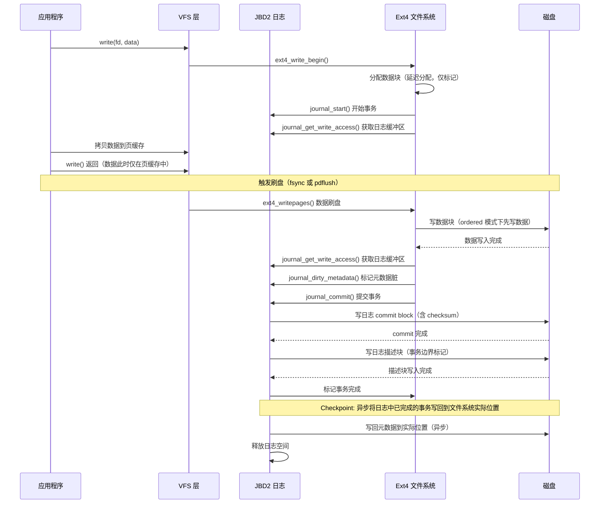
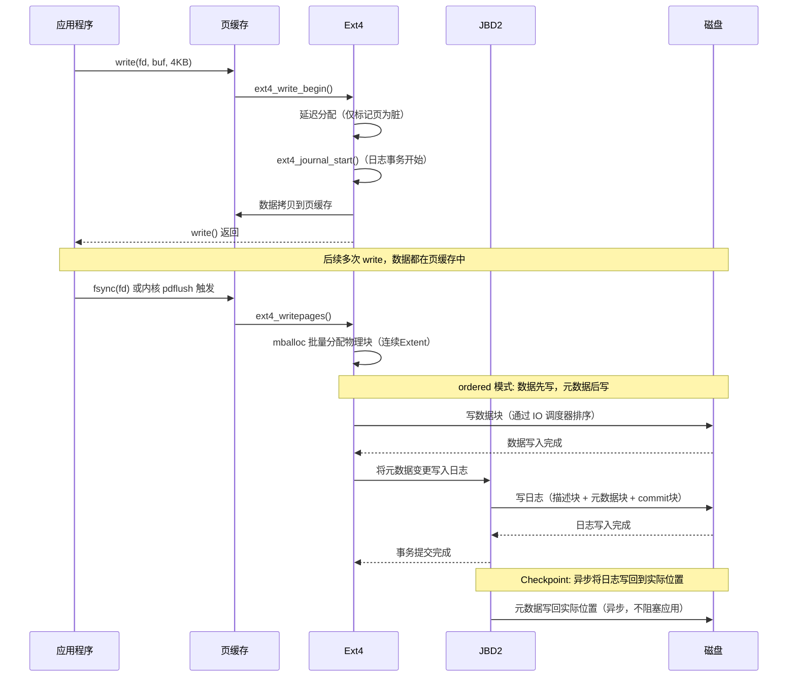
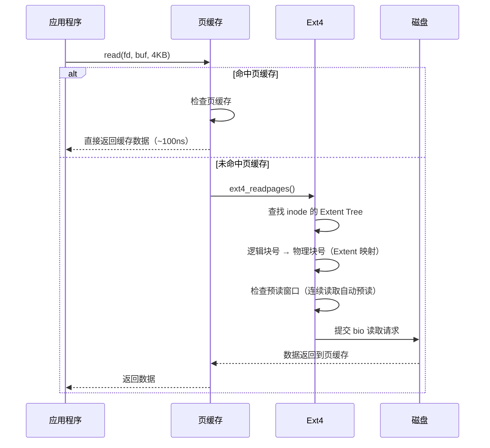
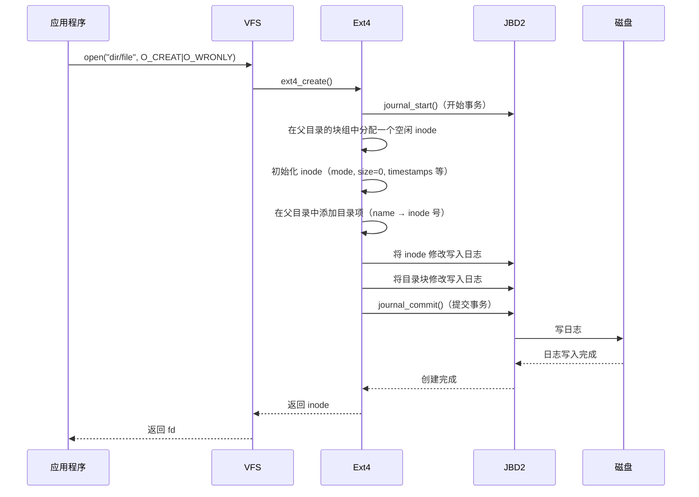
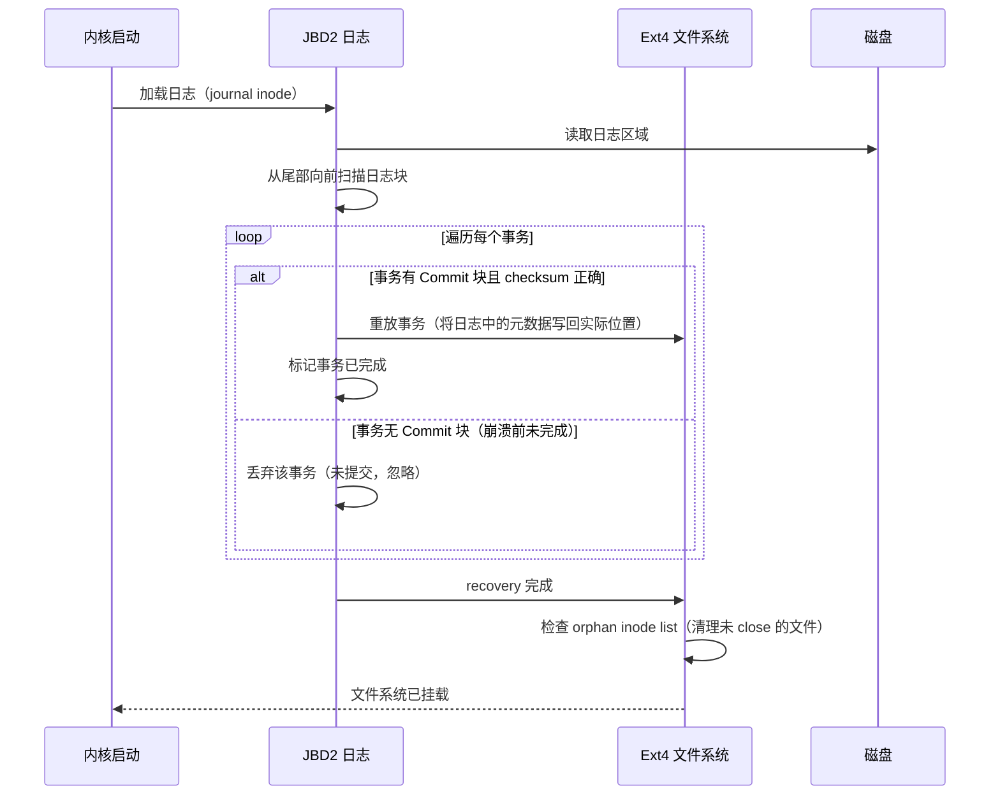

# Ext4 文件系统存储模型分析

## 1. 一句话概括

Ext4 是 Linux 最广泛使用的日志式文件系统，采用"超级块 + 块组"的磁盘布局、基于 Extent 的空间管理、JBD2 日志保障数据一致性、延迟分配优化碎片，所有元数据以 B-Tree/Hash Tree 索引加速查找。

## 2. 磁盘整体布局

```
┌─────────────────────────────────────────────────────────────────────┐
│                        Ext4 磁盘布局                                 │
├─────────────────────────────────────────────────────────────────────┤
│                                                                     │
│  Block 0                    Block N                                  │
│  ┌──────┐ ┌──────────────────────────────────────────────────────┐  │
│  │Boot  │ │                    Block Group 0                     │  │
│  │Sector│ │  ┌─────────┐ ┌──────────┐ ┌──────────┐ ┌─────────┐  │  │
│  │(1024B)│ │  │Superblock│ │GDT      │ │Reserved  │ │Block    │  │  │
│  │      │ │  │(1024B)  │ │Block     │ │GDT      │ │Bitmap   │  │  │
│  │      │ │  │         │ │Descriptor│ │Blocks    │  │(1 block)│  │  │
│  │      │ │  └─────────┘ └──────────┘ └──────────┘ ├─────────┤  │  │
│  │      │ │  ┌──────────┐ ┌──────────┐          │ │Inode    │  │  │
│  │      │ │  │Inode     │ │Inode     │          │ │Bitmap   │  │  │
│  │      │ │  │Bitmap    │ │Table     │          │ │(1 block)│  │  │
│  │      │ │  │(1 block) │ │(可变大小) │          │ ├─────────┤  │  │
│  │      │ │  └──────────┘ └──────────┘          │ │Data    │  │  │
│  │      │ │                                      │ │Blocks  │  │  │
│  │      │ │  ┌──────────────────────────┐        │ │(剩余)  │  │  │
│  │      │ │  │Block Group 1             │        │ │        │  │  │
│  │      │ │  │ (结构同上，无 Superblock)  │        │ └─────────┘  │  │
│  │      │ │  └──────────────────────────┘        └─────────────┘  │  │
│  └──────┘ │                                                       │
│           └───────────────────────────────────────────────────────┘  │
│                                                                     │
│  块组数量 = 总块数 / 块组大小（默认 32768 个块 = 128MB@4K块）         │
└─────────────────────────────────────────────────────────────────────┘
```

## 3. 各组件详解

### 3.1 超级块（Superblock）

```
位置: 每个 Block Group 的第 0 个块（实际只有 Group 0 的有效）
大小: 1024 字节
作用: 记录整个文件系统的全局信息

关键字段:
  s_inodes_count        — inode 总数
  s_blocks_count_lo     — 块总数（低 32 位）
  s_log_block_size      — 块大小（2^(10+s_log_block_size)，默认 4096）
  s_blocks_per_group    — 每个 BG 的块数（默认 32768）
  s_inodes_per_group    — 每个 BG 的 inode 数
  s_inode_size          — inode 大小（默认 256 字节）
  s_feature_compat      — 兼容特性标志
  s_feature_incompat    — 不兼容特性标志
  s_feature_ro_compat   — 只读兼容特性标志
  s_journal_inum        — 日志 inode 号
  s_desc_size           — GDT 描述符大小（64 或 32 字节）
```

### 3.2 块组描述符表（GDT）

```
位置: 紧跟 Superblock
作用: 描述每个 Block Group 的元数据位置

每个描述符 64 字节:
  bg_block_bitmap_lo    — 该 BG 的块位图位置
  bg_inode_bitmap_lo    — 该 BG 的 inode 位图位置
  bg_inode_table_lo     — 该 BG 的 inode 表起始位置
  bg_free_blocks_count_lo — 该 BG 的空闲块数
  bg_free_inodes_count_lo — 该 BG 的空闲 inode 数
  bg_used_dirs_count_lo   — 该 BG 的目录数

备份: GDT 在 Block Group 0, 1, 以及每 power-of-two group 中有备份
      防止单点损坏导致整个文件系统不可用
```

### 3.3 Inode

```
大小: 256 字节（默认）
数量: 由 s_inodes_per_group 决定

关键字段:
  i_mode       — 文件类型 + 权限（16 位）
  i_size_lo    — 文件大小（低 32 位）
  i_links_count — 硬链接数
  i_blocks_lo  — 分配的 512 字节扇区数
  i_atime      — 最后访问时间
  i_ctime      — inode 最后修改时间
  i_mtime      — 文件内容最后修改时间
  i_block[15]  — 数据块指针数组（60 字节）
  i_flags      — 扩展标志
  i_size_high  — 文件大小（高 32 位）
  i_extra_isize — 扩展 inode 区域大小

i_block[15] 指针布局（ext2/3 传统方式）:
  ┌──────┬──────┬────────────────────┐
  │ 0-11 │ 12  │ 13    │ 14          │
  │ 直接  │ 间接 │ 二级  │ 三级         │
  │ 指针  │ 指针 │ 间接  │ 间接         │
  │      │      │ 指针  │ 指针         │
  │12个块│256个块│256^2  │256^3        │
  │48KB  │1MB   │256MB  │64GB         │
  └──────┴──────┴──────┴─────────────┘
  （4KB 块大小下）

ext4 实际使用 Extent 而非间接指针（见下节）
```

### 3.4 Extent（核心创新）

```
ext4 用 Extent 替代了 ext2/3 的间接指针:

  Extent 结构（12 字节）:
  ┌──────────────┬──────────────┬──────────────┐
  │ ee_block     │ ee_len       │ ee_start     │
  │ 起始逻辑块号  │ 长度          │ 起始物理块号  │
  │ (32 bit)     │ (16 bit)     │ (32 bit)     │
  └──────────────┴──────────────┴──────────────┘

  一个 Extent 可以描述最多 128MB 的连续物理块（4KB 块 x 32768）

  i_block[15] 的 Extent 用法:
  ┌──────────┬─────────────────────────────────┐
  │ Header   │ Extent 1 | Extent 2 | ...       │
  │ (12 B)   │ (12 B)   │ (12 B)   │           │
  │ eh_magic │                                  │
  │ = 0xF30A│ 最多 4 个 Extent（60 字节 / 12）   │
  │ eh_max   │                                  │
  │ eh_depth │ 超过 4 个时 → 指向 Extent Tree    │
  └──────────┴─────────────────────────────────┘

  Extent Tree（B-Tree 索引）:
    对于碎片化大文件，ext4 使用 Extent Tree 索引
    树的每个节点是 Extent Index（指向子节点）
    叶子节点是实际的 Extent（指向物理块）

  Extent Status Cache（extents_status.c）:
    内存中缓存已分配/延迟分配/未初始化的 Extent 状态
    避免重复查磁盘
```

### 3.5 目录项与 HTree

```
线性目录（小目录）:
  ┌────────────┬────────────┬────────────┐
  │ inode | rec_len | name_len | name    │
  │ 4B    | 2B       | 1B       | 变长    │
  └────────────┴────────────┴────────────┘

HTree（Hash Tree，大目录优化）:
  当目录项超过一定数量时，ext4 自动启用 HTree
  查找从 O(n) 降到 O(1)

  ┌──────────────┐
  │ dx_root      │  ← 根节点（存在 inode 的 i_block 中）
  │ hash | block │
  ├──────────────┤
  │ dx_node      │  ← 内部节点
  │ hash | block │
  ├──────────────┤
  │ dx_leaf      │  ← 叶子节点（存在数据块中）
  │ entry list   │
  └──────────────┘

  查找: hash(文件名) → 遍历 B-Tree → 找到叶子 → 线性搜索
```

## 4. 日志系统（JBD2）

### 4.1 日志的作用

```
没有日志（ext2）:
  写文件元数据时如果崩溃:
    超级块已更新（inode 已分配）
    但位图未更新（块仍标记为空闲）
    → 文件系统不一致，需要 fsck 全盘扫描

有日志（ext4 + JBD2）:
  先写日志 → 再写实际位置 → 标记日志完成
  崩溃恢复时:
    如果日志中有未完成事务 → 重放（重做）
    如果日志中有已提交但未写回的事务 → 重放
    → 恢复时间从小时级降到秒级
```

### 4.2 日志模式

| 模式 | 元数据日志 | 数据日志 | 性能 | 安全性 |
|---|---|---|---|---|
| **ordered**（默认） | 是 | 否（但保证数据先于元数据写入） | 高 | 中 |
| **writeback** | 是 | 否（数据可能在元数据之后写入） | 最高 | 低 |
| **journal** | 是 | 是 | 低 | 最高 |

### 4.3 日志事务流程



### 4.4 日志磁盘布局

```
日志区域是一个特殊的隐藏文件（journal inode，通常 inode 8）

┌──────────────────────────────────────────────────────────┐
│                    日志区域布局                             │
├──────────────────────────────────────────────────────────┤
│                                                          │
│  ┌──────┐ ┌──────┐ ┌──────┐ ┌─────────┐ ┌──────┐       │
│  │Desc 1│ │Meta 1│ │Meta 2│ │Commit   │ │Desc 2│       │
│  │描述块 │ │元数据1│ │元数据2│ │提交块    │ │描述块 │       │
│  └──────┘ └──────┘ └──────┘ └─────────┘ └──────┘       │
│                                                          │
│  事务 1: Desc1 → Meta1 → Meta2 → Commit                  │
│  事务 2: Desc2 → ...                                     │
│                                                          │
│  描述块（Descriptor Block）:                              │
│    - 标识事务开始                                         │
│    - 包含后续元数据块的列表                                │
│                                                          │
│  提交块（Commit Block）:                                  │
│    - 标识事务结束                                         │
│    - 包含 checksum（v3 日志格式）                         │
│    - 只有 commit 写成功，事务才算有效                       │
│                                                          │
│  日志循环使用: 写到尾部后回到头部（环形缓冲区）              │
│  Checkpoint: 已提交的事务异步写回实际位置后，释放日志空间     │
└──────────────────────────────────────────────────────────┘
```

## 5. 延迟分配（Delayed Allocation）

### 5.1 机制

```
传统分配（立即分配）:
  write(data) → 立即在磁盘位图上分配物理块 → 数据写入页缓存 → 异步刷盘
  问题: 多次小写入产生大量碎片

延迟分配（ext4 默认）:
  write(data) → 仅在页缓存中记录 → 不分配物理块
  刷盘时（writepages）→ 批量分配物理块 → 一次性写入
  好处: 减少碎片，可能合并为连续Extent

时序对比:
  ┌──────────────────────────────────────────────┐
  │ 传统方式（立即分配）:                           │
  │ write(4KB) → 分配 block 100 → 脏页            │
  │ write(4KB) → 分配 block 200 → 脏页（不连续!）  │
  │ write(4KB) → 分配 block 300 → 脏页（不连续!）  │
  │ 刷盘: 3 次随机写，3 个 Fragment                │
  ├──────────────────────────────────────────────┤
  │ 延迟分配（ext4）:                              │
  │ write(4KB) → 仅页缓存                         │
  │ write(4KB) → 仅页缓存                         │
  │ write(4KB) → 仅页缓存                         │
  │ 刷盘: 分配 block 100-102（连续Extent）→ 1次顺序写│
  └──────────────────────────────────────────────┘
```

### 5.2 多块分配器（mballoc）

```
ext4 的多块分配器（mballoc）在刷盘时一次性分配大量连续块:

  目标: 分配 128KB（32 个 4KB 块）

  mballoc 搜索策略:
    1. 先在目标块组中搜索足够大的连续空闲区域
    2. 找到 → 作为一个 Extent 分配
    3. 找不到 → 在相邻块组搜索
    4. 仍找不到 → 碎片化分配（多个小 Extent）

  优化: 块预分配（inode 的 i_prealloc 链表）
    提前多分配一些块，后续写入直接使用
    减少 mballoc 搜索开销
```

## 6. 完整写入流程



## 7. 完整读取流程



## 8. 文件创建流程



## 9. 崩溃恢复流程



## 10. 关键特性汇总

| 特性 | 说明 | ext2 | ext3 | ext4 |
|---|---|---|---|---|
| 日志 | JBD2 | 无 | 有 | 有 |
| Extent | 连续块描述 | 无 | 无 | 有 |
| HTree | 目录哈希索引 | 无 | 有 | 有 |
| 延迟分配 | 减少碎片 | 无 | 无 | 有 |
| 多块分配 | mballoc 批量分配 | 无 | 无 | 有 |
| 在线扩容 | resize2fs 在线 | 有限 | 有 | 有 |
| 在线缩容 | 无需卸载 | 无 | 无 | 有限支持 |
| 日志 checksum | v3 日志格式 | 无 | 无 | 有 |
| 无日志挂载 | data=writeback | N/A | 有 | 有 |
| 最大文件大小 | 16TB（4KB 块） | 2TB | 2TB | 16TB |
| 最大文件系统 | 1EB（理论） | 32TB | 32TB | 1EB |
| 子目录限速 | dir_index | 无 | 有 | 有 |
| Flex Block Group | 多 BG 合并 | 无 | 无 | 有 |
| Uninit Block Group | 初始化延迟 | 无 | 无 | 有 |

## 11. Flex Block Group

```
传统 Block Group: 每个 BG 有完整的元数据副本
  → 大量空间浪费（每个 BG 都有 superblock、GDT 备份）

Flex Block Group（ext4 优化）:
  将多个相邻 BG 合并为一个 Flex Group
  Flex Group 内只保留一份完整的 superblock + GDT
  每个 BG 仍有自己的位图和 inode 表

  ┌─────────────────────────────────────────┐
  │ Flex Group 0                            │
  │ ┌────────┐ ┌────────┐ ┌────────┐       │
  │ │ BG 0   │ │ BG 1   │ │ BG 2   │       │
  │ │完整元数据│ │仅位图   │ │仅位图   │       │
  │ │+inode表│ │+inode表│ │+inode表│       │
  │ └────────┘ └────────┘ └────────┘       │
  └─────────────────────────────────────────┘

  好处: 减少元数据占用空间，加快 fsck 速度
```

## 12. 性能优化总结

```
┌──────────────────────────────────────────────────────────────┐
│                    Ext4 性能优化机制                           │
├──────────────────────────────────────────────────────────────┤
│                                                              │
│  1. 延迟分配（Delayed Allocation）                             │
│     多次小写合并为一次大分配，减少碎片                          │
│                                                              │
│  2. 多块分配器（mballoc）                                      │
│     一次分配多个连续块，减少搜索开销                            │
│     块预分配机制减少后续分配延迟                                │
│                                                              │
│  3. Extent Tree                                               │
│     替代间接指针，减少元数据块数量和查找深度                    │
│                                                              │
│  4. HTree 目录索引                                             │
│     大目录查找从 O(n) 降到接近 O(1)                            │
│                                                              │
│  5. Journal Checksum（v3 格式）                                │
│     检测日志损坏，避免错误重放损坏数据                           │
│                                                              │
│  6. Flex Block Group                                         │
│     减少元数据副本，节省空间，加快 fsck                         │
│                                                              │
│  7. Uninit Block Group                                       │
│     新 BG 的 inode 表和位图延迟初始化                          │
│     加快 mkfs 和 mkfs 后首次挂载速度                           │
│                                                              │
│  8. 在线 resize                                                │
│     无需卸载即可扩容文件系统                                   │
│                                                              │
│  9. 写屏障（barrier）                                          │
│     ordered 模式下保证数据先于日志 commit 到达磁盘              │
│     防止掉电时元数据指向未写入的数据块                          │
│                                                              │
└──────────────────────────────────────────────────────────────┘
```

## 13. 与分布式文件系统的关系

```
ext4 作为本地文件系统 vs 分布式文件系统:

  CephFS / 3FS:
    OSD 底层使用 ext4/xfs 作为本地文件系统
    ext4 负责: 单机磁盘上的块管理和日志
    分布式层负责: 跨节点的副本、一致性、元数据分布
    ext4 的日志保证单机崩溃一致性
    分布式协议保证跨节点一致性

  层次:
    ┌──────────────────────┐
    │ 应用程序               │
    ├──────────────────────┤
    │ 分布式文件系统（CephFS）│  ← 跨节点一致性
    ├──────────────────────┤
    │ 本地文件系统（ext4/xfs）│  ← 单机崩溃一致性
    ├──────────────────────┤
    │ 块设备驱动             │
    ├──────────────────────┤
    │ 磁盘 / NVMe SSD       │
    └──────────────────────┘
```

## 14. 源码位置（Linux Kernel）

| 组件 | 文件路径 | 说明 |
|---|---|---|
| Ext4 核心 | fs/ext4/inode.c | inode 操作 |
| Extent 管理 | fs/ext4/extents.c | Extent Tree 操作 |
| 日志 JBD2 | fs/jbd2/journal.c | 日志管理 |
| 日志 JBD2 | fs/jbd2/transaction.c | 事务管理 |
| 多块分配 | fs/ext4/mballoc.c | mballoc 分配器 |
| 目录 HTree | fs/ext4/hash.c | 目录哈希索引 |
| 延迟分配 | fs/ext4/inode.c:ext4_write_begin() | 延迟分配入口 |
| 超级块 | fs/ext4/super.c | 挂载、超级块读取 |
| 页缓存写回 | fs/ext4/inode.c:ext4_writepages() | 数据刷盘 |
| 崩溃恢复 | fs/jbd2/recovery.c | 日志重放 |
| 块位图 | fs/ext4/balloc.c | 块分配/释放 |
| Inode 分配 | fs/ext4/ialloc.c | inode 分配/释放 |
