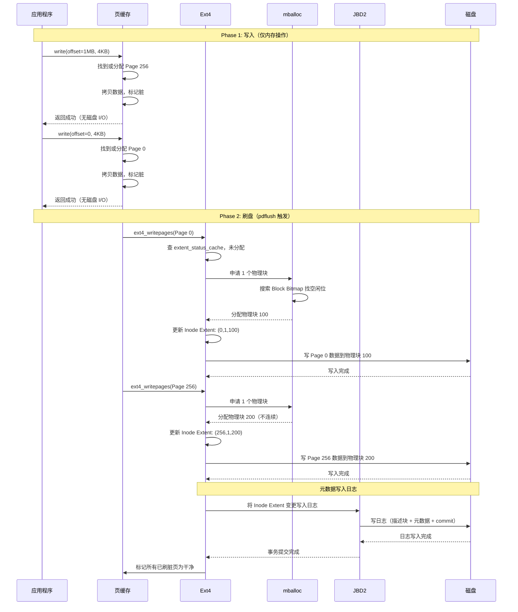

# Ext4 随机写机制分析

## 1. 一句话概括

ext4 完全支持随机写，核心机制是"页缓存屏蔽位置差异 + 延迟分配推迟物理块分配"——写入时只修改页缓存中的对应页，不关心写入位置；刷盘时才由 mballoc 分配物理块，尽量让相邻页的数据分配到连续的物理块以减少碎片。

## 2. ext4 支持随机写

ext4 对写入位置没有任何限制，offset 可以是文件内的任意位置：

```
支持的写入模式:
  顺序写: write(offset=0) → write(offset=4K) → write(offset=8K)
  随机写: write(offset=1MB) → write(offset=0) → write(offset=2GB)
  覆盖写: write(offset=0) → write(offset=0)（同一位置多次写入）
  扩展写: write(offset=文件末尾+1MB)（跳过中间区域，文件变稀疏）

稀疏文件（Hole）:
  write(offset=0, 4KB)
  write(offset=1GB, 4KB)     ← 跳过了中间 1GB
  → 中间的块不分配物理空间
  → ls -lh 显示 1GB，du -sh 显示 8KB
  → 读取中间区域返回全零
```

## 3. 页缓存：消除顺序与随机的差异

### 3.1 页缓存按"页"管理

```
页缓存（Page Cache）将文件视为连续的页数组:

  ┌──────────────────────────────────────────────────────┐
  │                虚拟文件视图（页缓存）                   │
  ├──────────────────────────────────────────────────────┤
  │                                                      │
  │  Page 0     Page 1     Page 2     ...   Page 256    │
  │  offset=0   offset=4K  offset=8K         offset=1MB  │
  │  (干净)     (脏)       (干净)     ...   (脏)        │
  │                                                      │
  └──────────────────────────────────────────────────────┘

无论写入位置在哪里:
  write(offset=0, 4KB)    → 修改 Page 0
  write(offset=1MB, 4KB)  → 修改 Page 256
  write(offset=2GB, 4KB)  → 修改 Page 524288

对页缓存来说都是一样的操作:
  找到对应页 → 修改数据 → 标记脏 → 返回
  不存在"顺序"还是"随机"的区别
```

### 3.2 写入时完全不涉及磁盘分配

```
write(offset=1MB, 4KB) 的完整处理:

  Step 1: 计算页号
    page_index = 1MB / 4KB = 256

  Step 2: 在页缓存中查找 Page 256
    ├─ 已存在 → 直接修改该页的数据
    └─ 不存在 → 分配一个空闲页，填入数据

  Step 3: 标记 Page 256 为"脏"（dirty）

  Step 4: 返回成功

  注意: 这一步完全没有涉及 Inode、Extent、物理块分配
       数据只在内存中，磁盘上什么都没发生
```

## 4. 延迟分配：随机写不立即分配物理块

### 4.1 机制原理

```
传统方式（立即分配，ext2）:
  write(offset=1MB, 4KB)
  → 立即在磁盘上分配一个物理块
  → 更新 Block Bitmap
  → 数据写入页缓存
  → 刷盘时写入已分配的物理块

  问题: 多次随机写每次都触发分配，产生大量碎片

ext4 延迟分配:
  write(offset=1MB, 4KB)
  → 不分配物理块
  → 数据写入页缓存，仅标记脏
  → 返回成功

  刷盘时（writepages）:
  → 批量检查所有脏页
  → 一次性分配物理块
  → 相邻的脏页可能被分配到连续的物理块
  → 减少碎片
```

### 4.2 延迟分配如何减少碎片

```
场景: 对同一文件执行 5 次随机写

  写入顺序:
    write(offset=0, 4KB)
    write(offset=1MB, 4KB)
    write(offset=4KB, 4KB)
    write(offset=2MB, 4KB)
    write(offset=8KB, 4KB)

页缓存状态:
  ┌──────┬──────┬──────┬──────┬──────┐
  │ P0   │ P1   │ P2   │ ...  │ P256 │ ... │ P512 │
  │ 脏   │ 脏   │ 脏   │      │ 脏   │     │ 脏   │
  └──────┴──────┴──────┴──────┴──────┴─────┴──────┘

按页地址顺序刷盘（内核刷盘策略）:
  P0  → 分配物理块 100 → Extent(0,1,100)
  P1  → 分配物理块 101 → 与(0,1,100)合并 → Extent(0,2,100)
  P2  → 分配物理块 102 → 合并 → Extent(0,3,100)
  P256 → 分配物理块 200（不连续）→ Extent(256,1,200)
  P512 → 分配物理块 300（不连续）→ Extent(512,1,300)

最终 Extent:
  Extent 1: 逻辑 0-2    → 物理 100-102  （3 个连续块）
  Extent 2: 逻辑 256    → 物理 200      （碎片）
  Extent 3: 逻辑 512    → 物理 300      （碎片）

如果后续在 256 附近继续写（257, 258...）:
  → 分配到 201, 202... → 与 Extent 2 合并
  → 碎片自动修复
```

## 5. O_DIRECT 模式下的随机写

### 5.1 O_DIRECT 绕过页缓存

```
普通模式（默认）:
  write() → 页缓存 → 异步刷盘 → 磁盘
  好处: 延迟分配，写合并
  坏处: 数据在内存中，掉电可能丢失（未 fsync）

O_DIRECT 模式:
  write(fd, data, 4KB, offset=1MB, O_DIRECT)
  → 绕过页缓存，直接写磁盘
  → 不能延迟分配（数据不经过页缓存，必须立即分配物理块）
  → 每次随机写都触发 mballoc

  特点:
    - 数据直接到达磁盘，无页缓存中间层
    - 无延迟分配，碎片更严重
    - 但数据一致性更强（fsync 不需要额外刷盘）
    - 常用于数据库（MySQL、PostgreSQL）
```

### 5.2 两种模式随机写对比

| 对比项 | 普通模式（页缓存） | O_DIRECT 模式 |
|---|---|---|
| 数据路径 | 内存 → 异步刷盘 | 直接写磁盘 |
| 物理块分配 | 延迟到刷盘时 | 立即分配 |
| 碎片程度 | 较少（批量合并） | 较多（逐次分配） |
| 掉电安全 | 需要 fsync | 写入即持久 |
| 适用场景 | 通用文件读写 | 数据库、自管理缓存 |

## 6. 随机写产生 Extent 碎片的过程

### 6.1 碎片产生

```
大量随机写导致 Extent 碎片化:

  初始（文件为空）:
    Inode: 无 Extent

  随机写入 100 万次 4KB:
    → 可能产生上万个 Extent
    → Extent Tree 深度增加

  Extent Tree 深度与查找性能:
    ┌────────────────────────────────────────┐
    │ Extent 数量   树深度   查找 I/O 次数    │
    │ < 4          内联      0（在 inode 中） │
    │ 4-20         1 层      1                │
    │ 20-400       2 层      2                │
    │ 400-80000    3 层      3                │
    │ > 80000      4 层      4                │
    └────────────────────────────────────────┘

  顺序读碎片化文件:
    → Extent 指向不连续的物理块
    → HDD: 磁头大幅寻道，性能暴跌
    → SSD: 几乎无影响（无机械寻道）
```

### 6.2 碎片整理

```
e4defrag 命令:
  扫描文件的 Extent Tree
  重新分配连续物理块
  更新 Inode 的 Extent 映射
  移动数据到新位置

  整理前:
    Extent 1: 逻辑 0-2    → 物理 100-102
    Extent 2: 逻辑 256    → 物理 5000     ← 碎片
    Extent 3: 逻辑 512    → 物理 9000     ← 碎片

  整理后:
    Extent 1: 逻辑 0-2    → 物理 200-202
    Extent 2: 逻辑 256    → 物理 203      ← 连续
    Extent 3: 逻辑 512    → 物理 204      ← 连续

注意: 整理过程需要额外磁盘空间（新旧块同时存在）
      整理期间文件需要锁（不能同时读写）
      建议在低峰期执行
```

## 7. 完整随机写时序流程



## 8. 不同存储介质上的随机写性能

| 介质 | 随机写 4KB 延迟 | 随机写 IOPS | 碎片影响 | 说明 |
|---|---|---|---|---|
| HDD | ~10ms | ~100 | 极大 | 磁头寻道是瓶颈，碎片严重影响性能 |
| SATA SSD | ~100us | ~50K | 较小 | 无机械寻道，但有写放大 |
| NVMe SSD | ~20us | ~200K | 很小 | 无寻道，碎片几乎无影响 |
| SCM (Optane) | ~1us | ~500K | 无 | 字节寻址，无块设备碎片概念 |

```
结论:
  - HDD 上: 随机写是性能杀手，应尽量顺序写
  - SSD 上: 随机写性能可接受，碎片影响小
  - 如果必须大量随机写: 用 SSD，或用 XFS（对随机写优化更好）
```

## 9. ext4 vs XFS 随机写对比

| 对比项 | ext4 | XFS |
|---|---|---|
| 延迟分配 | 有（减少碎片） | 有 |
| 分配器 | mballoc（多块分配） | 行为分配（B-Tree 空闲 extent 管理） |
| 碎片处理 | e4defrag 离线整理 | xfs_fsr 在线整理 |
| 大量随机写 | 碎片较多，Extent Tree 膨胀 | 碎片较少，B-Tree 空间管理更高效 |
| 数据库场景 | 可用但非最优 | 推荐（MySQL/PostgreSQL 默认推荐 XFS） |
| 大文件随机写 | 一般 | 优秀 |

## 10. 总结

```
ext4 随机写机制:

  1. 页缓存: 消除顺序与随机的差异，所有写入都是"修改某一页"
  2. 延迟分配: 不立即分配物理块，刷盘时批量分配
  3. mballoc: 尽量分配连续物理块，减少碎片
  4. Extent 合并: 相邻的已分配 Extent 自动合并
  5. JBD2 日志: 保证元数据和数据的崩溃一致性

随机写的代价:
  - 可能产生 Extent 碎片（HDD 上性能影响大）
  - O_DIRECT 模式下无法延迟分配，碎片更严重
  - 大量随机写后建议执行 e4defrag

选择建议:
  - SSD: ext4 随机写性能足够
  - HDD: 尽量顺序写，或换 SSD
  - 数据库: 考虑 XFS
```
