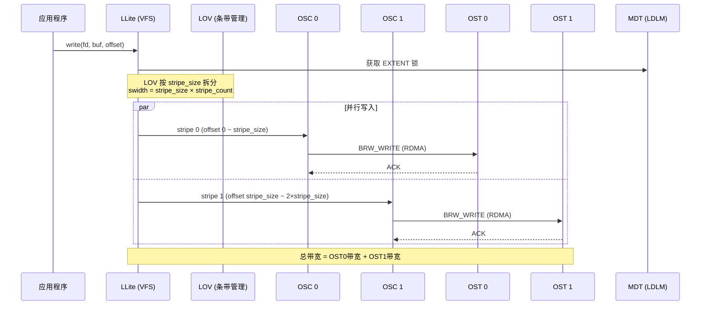
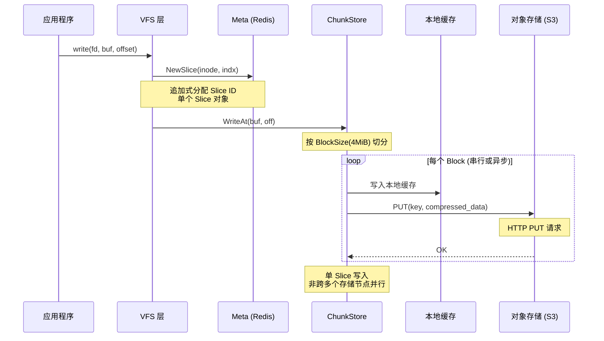
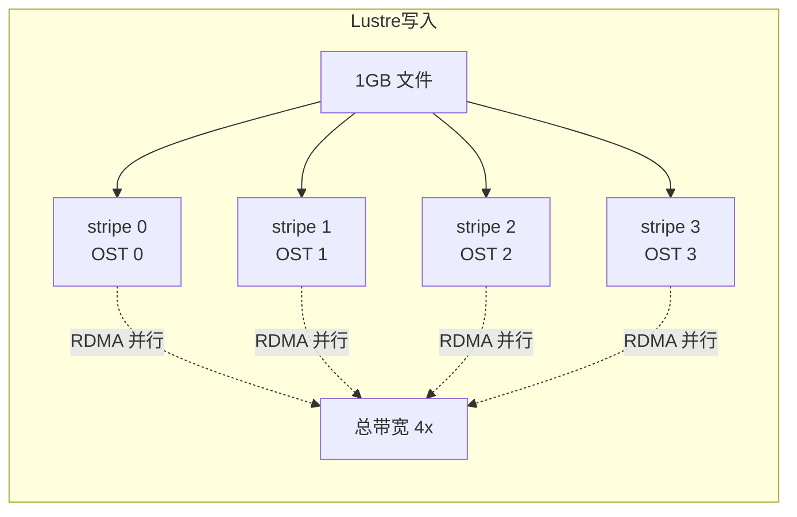
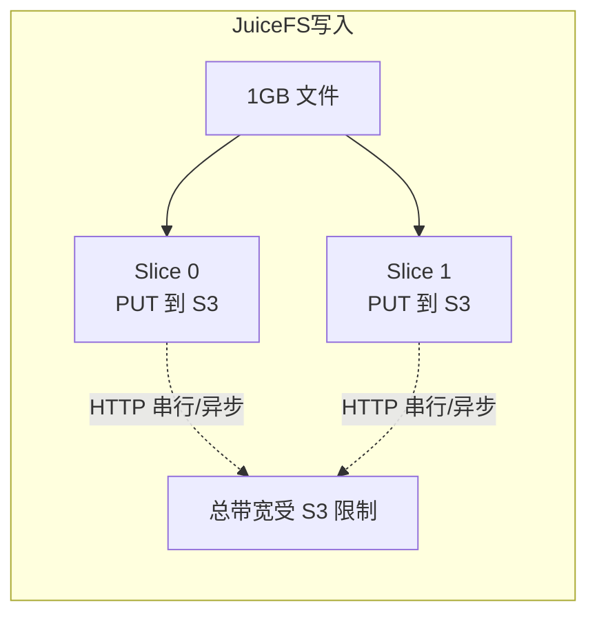
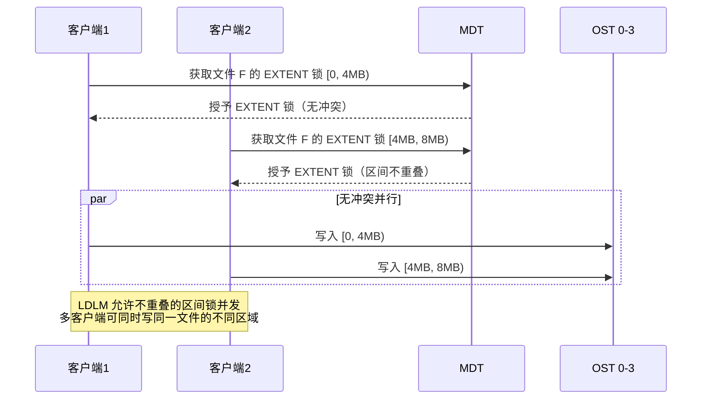
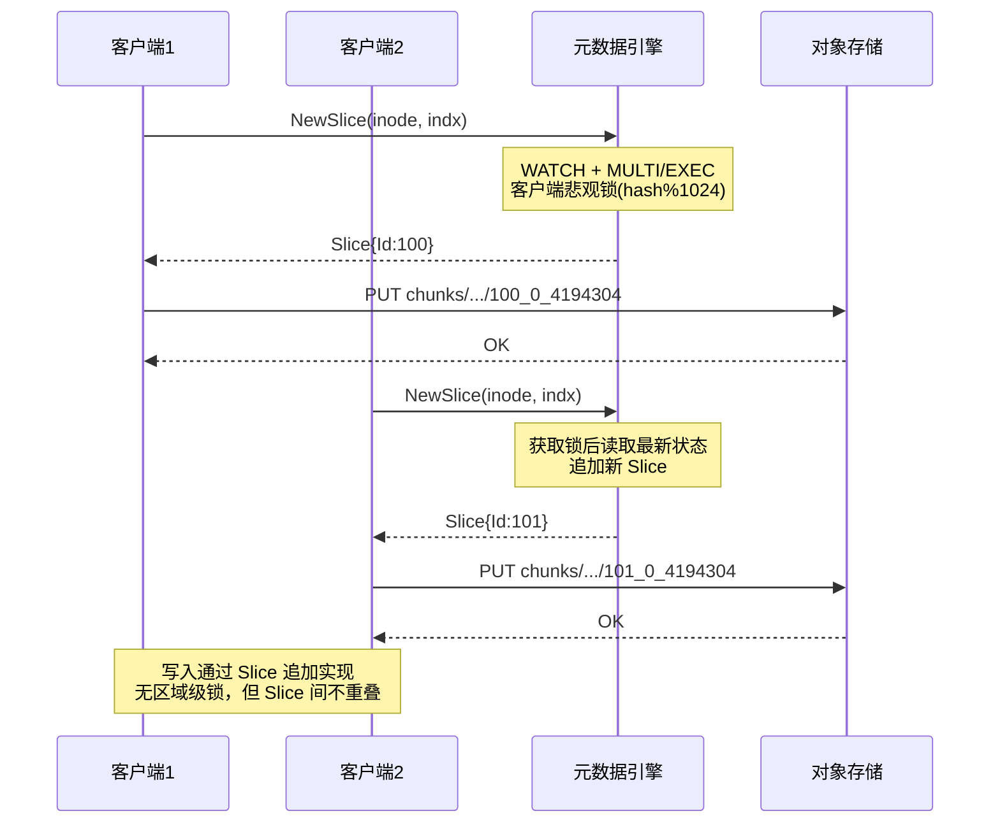
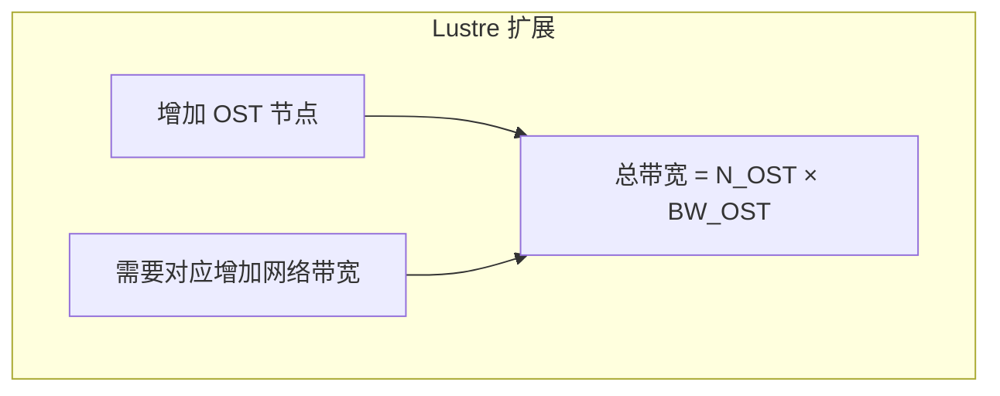
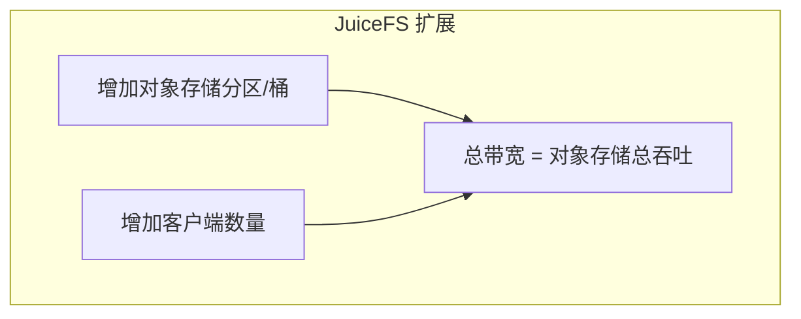

# JuiceFS 与 Lustre 并行性对比分析

---

## 目录

1. [核心定位差异](#1-核心定位差异)
2. [架构对比](#2-架构对比)
3. [数据路径对比](#3-数据路径对比)
4. [单文件 I/O 并行度](#4-单文件-io-并行度)
5. [多客户端并发能力](#5-多客户端并发能力)
6. [元数据并行能力](#6-元数据并行能力)
7. [锁机制对比](#7-锁机制对比)
8. [缓存与数据本地化](#8-缓存与数据本地化)
9. [带宽扩展性](#9-带宽扩展性)
10. [典型应用场景](#10-典型应用场景)
11. [总结](#11-总结)

---

## 1. 核心定位差异

**Lustre 是真正的并行文件系统**（Parallel File System），设计目标是让单文件 I/O 横跨多个存储节点并行执行，为 HPC 大文件场景提供极致吞吐。

**JuiceFS 是分布式文件系统**（Distributed File System），设计目标是利用云原生基础设施（对象存储 + 数据库）实现多客户端共享和高可用，强调部署简单和弹性扩展。

| 维度 | Lustre | JuiceFS |
|---|---|---|
| **分类** | 并行文件系统 (PFS) | 分布式文件系统 (DFS) |
| **起源** | 2001 年，Cray/Cluster File Systems | 2020 年，Juicedata |
| **设计哲学** | 单文件高吞吐，直连存储 | 云原生存储，元数据-数据分离 |
| **部署形态** | MDS + 多 OSS 集群 | 单进程客户端 + 云服务 |
| **访问协议** | 原生内核模块 + FUSE | FUSE |
| **网络要求** | 高带宽低延迟（RDMA/IB） | 标准 TCP/IP 网络 |

---

## 2. 架构对比

### 2.1 Lustre 架构

```
┌──────────────────────────────────────────────────────┐
│                     Client (LDLM+LOV+OSC)            │
│           单文件 I/O 拆分到多个 OSC                   │
├──────────┬──────────┬──────────┬──────────┬──────────┤
│ OSC 0    │ OSC 1    │ OSC 2    │ OSC 3    │   ...    │  ← 每个条带独立 OSC
├──────────┼──────────┼──────────┼──────────┼──────────┤
│ OST 0    │ OST 1    │ OST 2    │ OST 3    │   ...    │  ← 数据存储节点
│ ldiskfs  │ ldiskfs  │ ldiskfs  │ ldiskfs  │   ...    │
└──────────┴──────────┴──────────┴──────────┴──────────┘
        ↕ LNet (RDMA/IB/TCP)
┌──────────────────────────────────────────────────────┐
│                    MDT (元数据)                        │
│              LDLM 分布式锁管理                         │
└──────────────────────────────────────────────────────┘
```

**关键特征**：客户端直连 OST，数据路径**不经过中间层**，条带级并行。

### 2.2 JuiceFS 架构

```
┌──────────────────────────────────────────────────────┐
│               Client (VFS + ChunkStore)               │
│          每个 Slice 独立 GET/PUT 请求                  │
├──────────────────┬───────────────────────────────────┤
│   Meta Client    │        ChunkStore                   │
│   (Redis/SQL/    │   ┌───────────────────────────┐    │
│    TiKV)         │   │ 本地缓存 (磁盘 + 内存)      │    │
│                  │   ├───────────────────────────┤    │
│                  │   │ 压缩 / 加密                │    │
│                  │   ├───────────────────────────┤    │
│                  │   │ 对象存储客户端              │    │
│                  │   └───────────────────────────┘    │
├──────────────────┼───────────────────────────────────┤
│  Redis / MySQL   │     S3 / OSS / Ceph / ...         │
│  PostgreSQL /    │     (HTTP API, 非直连)             │
│  TiKV            │                                    │
└──────────────────┴───────────────────────────────────┘
```

**关键特征**：数据通过对象存储 API 访问，Slice 对象可以并发读取，但受对象存储单 key 吞吐限制。

---

## 3. 数据路径对比

### 3.1 Lustre 写入路径（并行直写）



**条带数学**（[lustre/lov/lov_offset.c](lustre/lov/lov_offset.c)）：

```c
// 文件偏移 → OST 条带映射
swidth = stripe_size * stripe_count
stripeno = (offset % swidth) / stripe_size
stripe_offset = offset / swidth * stripe_size + (offset % stripe_size)
```

### 3.2 JuiceFS 写入路径（Slice 追加）



**Slice 键生成**（[pkg/chunk/cached_store.go:74-79](pkg/chunk/cached_store.go#L74-L79)）：

```go
// 每个 Slice 生成一个对象 key
"chunks/{sliceId/1000/1000}/{sliceId/1000}/{sliceId}_{blockIdx}_{blockSize}"
```

### 3.3 路径关键差异

| 步骤 | Lustre | JuiceFS |
|---|---|---|
| 数据分发 | **LOV 按条带拆分到多个 OSC** | **单个 Slice 追加，无拆分** |
| 传输协议 | **RDMA 零拷贝直传 OST** | HTTP PUT/GET 到对象存储 |
| 存储位置 | **本地磁盘 (ldiskfs/ext4)** | **远程对象存储** |
| 并行度 | 条带数（可配置数百个 OST） | Slice 数 + Block 数（受客户端 goroutine 限制） |

---

## 4. 单文件 I/O 并行度

### 4.1 写入并行度





| 维度 | Lustre | JuiceFS |
|---|---|---|
| **写入方式** | 条带拆分，多 OST 并行直写 | Slice 追加，顺序 PUT |
| **并行粒度** | stripe_size（默认 1MiB ~ 1GiB） | BlockSize（默认 4MiB） |
| **并行维度** | 空间（跨多个存储节点） | 时间（异步上传） |
| **单文件带宽** | `N_OST × BW_OST`（线性扩展） | 受对象存储单/多 key 限制 |

### 4.2 读取并行度

| 维度 | Lustre | JuiceFS |
|---|---|---|
| **条带并行读取** | 多 OSC 同时从多 OST RDMA 读取 | 多 goroutine 并发 GET 多个 Slice |
| **数据预读** | 客户端预读 + OSC 预读 | 可配置 readahead |
| **锁影响** | LDLM 缓存锁，无冲突时并行 | 无数据锁，元数据锁在 DB |
| **瓶颈** | 网络带宽 / OST 磁盘 IOPS | 对象存储单 key 吞吐 / 网络延迟 |

**JuiceFS 的读并行**：`dataReader.Read()` 会为每个 Slice 启动 goroutine 并发读取，这在 Slice 较多时提供一定并行度。但每个 Slice 的 GET 请求仍然经过 HTTP 协议栈和对象存储的内部路由，延迟远高于 RDMA 直连。

---

## 5. 多客户端并发能力

### 5.1 Lustre 多客户端



### 5.2 JuiceFS 多客户端



### 5.3 并发模型对比

| 维度 | Lustre | JuiceFS |
|---|---|---|
| **并发写同一文件** | LDLM 区间锁，不重叠区域并行 | Slice 追加，写入不重叠但无区间锁 |
| **并发写不同文件** | 完全并行（各自条带到各自 OST） | 完全并行（各自 Slice 到对象存储） |
| **锁粒度** | 字节级范围锁（EXTENT） | 事务级（整个 inode 操作） |
| **锁位置** | MDT 集中管理，锁回调 (AST) | 客户端本地锁 + DB 事务 |
| **冲突处理** | AST 回调回收锁 | 事务重试（最多 50 次） |

---

## 6. 元数据并行能力

### 6.1 目录并行

| 维度 | Lustre | JuiceFS |
|---|---|---|
| **分布式目录** | LMV 跨 MDT 分布式目录 | 所有目录在同一元数据引擎 |
| **目录操作并行** | 不同 MDT 上的子目录并行 | Redis/SQL/TiKV 事务并发 |
| **元数据扩展** | 增加 MDT 节点 | 升级元数据引擎（垂直扩展） |

### 6.2 Inode 分配并行

**Lustre**：`FID seq` 客户端批量分配（LUSTRE_DATA_SEQ_MAX_WIDTH = 32M FIDs/seq），`MDS` 管理序列分配。

**JuiceFS**：`incrCounter("nextInode", 1024)` 批量分配，带预取和 jitter。

```go
// pkg/meta/base.go:1425-1477
func (m *baseMeta) nextInode() (Ino, error) {
    // 批量 1024，消耗 ~90% 时预取
}
```

两者都采用客户端批量分配策略减少元数据引擎压力，但 Lustre 的序列空间更大（32M vs 1024）。

### 6.3 元数据引擎性能对比

| 维度 | Lustre MDT | JuiceFS Redis | JuiceFS SQL | JuiceFS TiKV |
|---|---|---|---|---|
| **延迟** | ~100μs（本地磁盘） | ~0.5ms（网络） | ~1ms（SQL） | ~1ms（RPC） |
| **吞吐** | 受限于 MDT 磁盘 | 受限于 Redis 网络 | 受限于 DB 连接数 | 受限于 PD 调度 |
| **扩展** | 多 MDT（DNE） | Redis Cluster | 读写分离 | 自动分片 |
| **持久化** | jbd2 事务 | RDB/AOF | WAL | Raft 多副本 |

---

## 7. 锁机制对比

### 7.1 锁层次

| 层 | Lustre | JuiceFS |
|---|---|---|
| **数据锁** | LDLM EXTENT 锁（字节范围） | 无数据锁 |
| **元数据锁** | LDLM INODE/IBITS 锁 | DB 事务 + 客户端本地锁 |
| **文件锁** | LDLM FLOCK/POSIX | Redis Hash / SQL 表 / TiKV 键 |
| **锁管理器** | MDT 集中管理 | 元数据引擎管理 |

### 7.2 LDLM 分布式锁（Lustre 特有）

Lustre 的 LDLM 是其并行能力的核心支撑：

```c
// lustre/include/lustre_dlm.h
// 锁类型
LDLM_EXTENT   // 字节范围锁（支持 PR/PW/EX/CW 模式）
LDLM_IBITS    // inode 位锁（用于元数据保护）
LDLM_FLOCK    // BSD flock
LDLM_PLAIN    // POSIX fcntl

// 锁模式
LDLM_LOCK_PW  // Protected Write（共享写）
LDLM_LOCK_EX  // Exclusive（排他）
LDLM_LOCK_PR  // Protected Read（共享读）
LDLM_LOCK_CW  // Concurrent Write（并发写）
```

**AST 回调**：当锁冲突时，MDT 发送 Blocking AST 回调给锁持有者，要求其释放锁。这种主动回收机制确保锁的快速传递。

**LVB（Lock Value Block）**：锁携带 `size/mtime/atime/ctime` 等文件属性，避免客户端额外的 getattr RPC。

### 7.3 客户端悲观锁（JuiceFS 特有）

```go
// pkg/meta/base.go:627-663
func (r *baseMeta) txLock(idx uint) {
    r.txlocks[idx%nlocks].Lock()  // 1024 个本地互斥锁
}
```

JuiceFS 的锁策略更简单：
- 客户端本地 1024 个互斥锁串行化同一 inode 的操作
- 数据库层使用乐观并发（WATCH/MVCC）+ 50 次重试
- 无数据层面的锁（不保护文件内容的并发访问）

---

## 8. 缓存与数据本地化

### 8.1 缓存架构对比

| 维度 | Lustre | JuiceFS |
|---|---|---|
| **客户端缓存** | Page Cache（ldiskfs） | Page Pool + 磁盘缓存 |
| **缓存一致性** | LDLM 锁 + AST 回调主动失效 | TTL + mtime 检查被动失效 |
| **预读** | OSC 预读 + 客户端预读 | 可配置 readahead |
| **写回** | OSC dirty page 延迟刷写 | writeback 模式（异步上传） |
| **缓存大小** | 受限于客户端内存 | 磁盘缓存可配置 TB 级 |

### 8.2 数据本地化

| 维度 | Lustre | JuiceFS |
|---|---|---|
| **数据位置** | 本地磁盘（ldiskfs） | 远程对象存储 |
| **访问延迟** | ~100μs（RDMA + 本地磁盘） | ~1-10ms（HTTP + 网络） |
| **数据预热** | 直接从 OST 读取 | `juicefs warmup` 预取到本地缓存 |
| **离线访问** | 否（需要 OST 在线） | 缓存 + writeback 模式部分支持 |

---

## 9. 带宽扩展性

### 9.1 扩展模型





### 9.2 带宽对比（典型配置）

| 配置 | Lustre 估算 | JuiceFS 估算 |
|---|---|---|
| **单客户端** | ~10 GB/s（RDMA + 多 OSC） | ~1-3 GB/s（本地缓存命中） |
| **10 客户端** | ~50 GB/s（无冲突时） | ~5-10 GB/s（各客户端独立） |
| **100 客户端** | 受 MDT + 网络瓶颈 | ~30-100 GB/s（对象存储扩展） |
| **扩展方式** | 加 OSS + 加 IB 交换机 | 加 S3 分区 + 加客户端 |

---

## 10. 典型应用场景

### 10.1 Lustre 擅长的场景

- **大规模科学计算**：气象模拟、分子动力学（单文件 TB 级，需要极致吞吐）
- **HPC 检查点**：并行应用定期写入大检查点文件
- **视频渲染**：帧级并行读写
- **基因组学**：大规模序列比对（BAM 文件）

**关键需求**：单文件高带宽 + 低延迟 + RDMA

### 10.2 JuiceFS 擅长的场景

- **AI/ML 训练**：大量客户端并发读取训练数据集
- **容器持久化存储**：Kubernetes PV/PVC
- **数据湖/数据共享**：多团队共享对象存储上的数据
- **边缘计算**：轻量级客户端 + 云端存储
- **备份/归档**：利用对象存储的低成本和持久性

**关键需求**：易部署 + 低成本 + 弹性扩展 + 云原生集成

### 10.3 选型决策树

```
需要单文件 >10GB/s 吞吐？
├── 是 → 需要 RDMA/IB 网络？
│        ├── 是 → Lustre
│        └── 否 → 评估 GPFS/ BeeGFS
└── 否 → 需要云原生部署？
         ├── 是 → JuiceFS
         └── 否 → 评估 CephFS / NFS
```

---

## 11. 总结

### 核心结论

> **JuiceFS 不是像 Lustre 一样的并行文件系统。**

| 特征 | Lustre | JuiceFS |
|---|---|---|
| **并行类型** | 空间并行（数据跨多节点拆分） | 时间并行（异步操作） |
| **并行粒度** | 条带级（stripe_size ~ MiB） | Slice/Block 级（4MiB Block） |
| **并行维度** | 多 OSC → 多 OST 直连 | 多 goroutine → 对象存储 |
| **单文件带宽** | 线性随 OST 数扩展 | 受对象存储限制 |
| **部署复杂度** | 高（专用集群 + IB 网络） | 低（单进程 + 云服务） |
| **成本** | 高（专用硬件） | 低（按量付费） |

### 一句话概括

- **Lustre**：为**单文件极致吞吐**而生，代价是复杂的集群部署和专用硬件。
- **JuiceFS**：为**云原生共享存储**而生，以牺牲单文件性能换取部署便利性和弹性扩展能力。

两者面向不同的使用场景，不是直接的竞争关系，而是互补关系。
