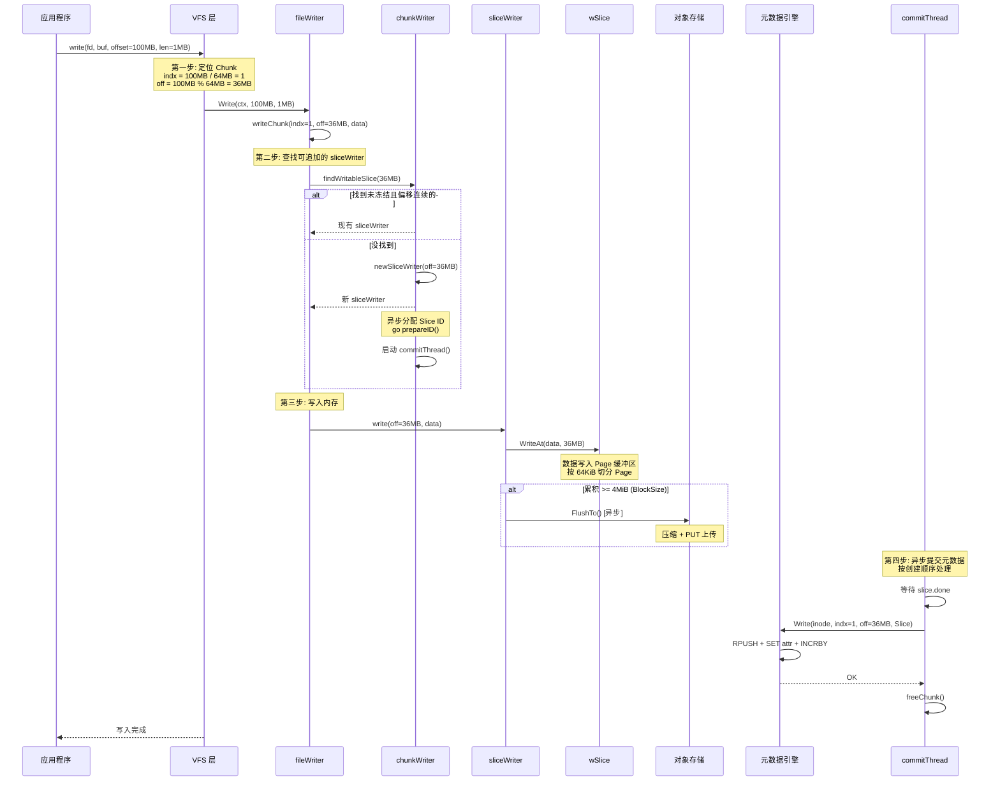

# JuiceFS 文件写入机制分析

---

## 目录

1. [核心问题：写入时如何定位数据？](#1-核心问题写入时如何定位数据)
2. [写入不是"查找"而是"追加"](#2-写入不是查找而是追加)
3. [写入全流程拆解](#3-写入全流程拆解)
4. [Chunk 定位机制](#4-chunk-定位机制)
5. [Slice 追加机制](#5-slice-追加机制)
6. [重叠写入处理](#6-重叠写入处理)
7. [写入时序图](#7-写入时序图)
8. [关键数据结构](#8-关键数据结构)
9. [与 Lustre 写入模型的对比](#9-与-lustre-写入模型的对比)
10. [关键源码索引](#10-关键源码索引)

---

## 1. 核心问题：写入时如何定位数据？

> **问题**：每次写入一个文件，是先找到文件对应的 Chunk，再找到 Chunk 对应的 Slice 吗？

**答案**：不完全是。JuiceFS 的写入是**"定位 Chunk → 追加新 Slice"**，而不是"定位 Chunk → 查找已有 Slice → 写入"。

```
错误理解：
  write → 找 Chunk → 找已有 Slice → 写入 Slice 的某个位置 ✗

正确理解：
  write → 找 Chunk → 找可追加的 sliceWriter（或新建） → 追加新数据 ✓
```

核心区别在于：JuiceFS **不会修改已有 Slice**，而是总是追加新数据，通过元数据层面的位置关系实现覆盖。

---

## 2. 写入不是"查找"而是"追加"

### 2.1 Copy-on-Write 风格

JuiceFS 的写入模型类似 Copy-on-Write（写时复制）：

```
传统"查找并修改"模型：
  数据位置: [Slice A: 0~4MB]
  写入 2~6MB → 找到 Slice A → 修改 Slice A 的 2~4MB + 扩展 4~6MB

JuiceFS "追加并覆盖"模型：
  数据位置: [Slice A: 0~4MB]
  写入 2~6MB → 创建 Slice B: 2~6MB（不修改 Slice A）
  读取时按位置合并: 0~2MB 来自 A，2~6MB 来自 B（覆盖）
```

### 2.2 为什么选择追加模型

| 优势 | 说明 |
|---|---|
| **无锁写入** | 不需要读取/修改已有 Slice，避免并发冲突 |
| **对象存储友好** | 对象存储（S3/OSS）的 PUT 是原子操作，不支持原地修改 |
| **崩溃安全** | 新 Slice 未完成不影响旧 Slice，Abort 清理即可 |
| **简单可靠** | 追加操作天然幂等，重试无副作用 |

---

## 3. 写入全流程拆解

```
应用程序: write(fd, buf, offset=100MB, len=1MB)

┌─────────────────────────────────────────────────────────┐
│ 第一步：定位 Chunk（纯算术，O(1)）                        │
│                                                          │
│   indx = 100MB / 64MB = 1       ← 第 1 个 Chunk        │
│   off  = 100MB % 64MB = 36MB    ← Chunk 内偏移          │
└───────────────────────┬─────────────────────────────────┘
                        │
┌───────────────────────▼─────────────────────────────────┐
│ 第二步：查找可追加的 sliceWriter（遍历列表）              │
│                                                          │
│   chunkWriter.findWritableSlice(36MB)                   │
│   ├── 找到未冻结且偏移连续的 sliceWriter → 复用          │
│   └── 没找到 → 创建新 sliceWriter + 分配新 Slice ID      │
└───────────────────────┬─────────────────────────────────┘
                        │
┌───────────────────────▼─────────────────────────────────┐
│ 第三步：写入内存缓冲区（不涉及对象存储）                  │
│                                                          │
│   wSlice.WriteAt(buf, 36MB)                             │
│   ├── 数据切分为 Page（64KiB）                           │
│   ├── Page 填充到内存缓冲区                              │
│   └── 累积 >= 4MiB → 异步压缩上传到对象存储              │
└───────────────────────┬─────────────────────────────────┘
                        │
┌───────────────────────▼─────────────────────────────────┐
│ 第四步：提交元数据（异步，由 commitThread 处理）          │
│                                                          │
│   chunkWriter.commitThread()                            │
│   ├── 等待 slice.flushData() 完成（所有 Block 已上传）   │
│   ├── meta.Write(inode, indx, off, slice)               │
│   │   └── Redis: RPUSH slice + SET attr + INCRBY space  │
│   └── 失效读缓存                                        │
└─────────────────────────────────────────────────────────┘
```

---

## 4. Chunk 定位机制

### 4.1 Chunk 计算

```go
// pkg/meta/base.go (interface.go)
const ChunkBits = 26
const ChunkSize = 1 << ChunkBits  // 64 MiB
```

每个文件被逻辑分割为固定 64MiB 的 Chunk：

```
文件 offset:  0         64MB       128MB      192MB      256MB
              ├──────────┼──────────┼──────────┼──────────┤
Chunk index:  │ Chunk 0  │ Chunk 1  │ Chunk 2  │ Chunk 3  │
              │ indx=0   │ indx=1   │ indx=2   │ indx=3   │
              └──────────┴──────────┴──────────┴──────────┘
```

### 4.2 写入时 Chunk 拆分

如果写入跨越 Chunk 边界，`fileWriter.Write()` 会自动拆分（[writer.go:325-336](pkg/vfs/writer.go#L325-L336)）：

```go
// 写入 offset=60MB, len=10MB → 跨越 Chunk 0 和 Chunk 1
// 拆分为:
//   writeChunk(indx=0, off=60MB, len=4MB)   ← Chunk 0 的尾部
//   writeChunk(indx=1, off=0MB,   len=6MB)   ← Chunk 1 的头部
```

### 4.3 Chunk 与元数据的映射

元数据引擎中，每个 Chunk 的 Slice 列表存储为独立的键：

```
Redis:
  c$inode_0  →  [Slice0, Slice1, Slice2, ...]   ← Chunk 0 的所有 Slice
  c$inode_1  →  [Slice3, Slice4]                  ← Chunk 1 的所有 Slice

SQL:
  jfs_chunk 表: Inode=inode, Indx=0, Slices=blob  ← Chunk 0
  jfs_chunk 表: Inode=inode, Indx=1, Slices=blob  ← Chunk 1
```

**Chunk 是逻辑概念，不是物理存储单位**。物理存储以 Slice 为单位，每个 Slice 对应对象存储中的一个或多个 Block。

---

## 5. Slice 追加机制

### 5.1 sliceWriter 生命周期

```
创建 → 写入数据 → 累积满 → 冻结 → 刷写 → 提交元数据
 │      │          │        │       │        │
 │      │          │        │       │        └→ meta.Write()
 │      │          │        │       └→ wSlice.Finish() + Abort on err
 │      │          │        └→ freezed=true, go flushData()
 │      │          └→ 64MB (ChunkSize) 或 被 Flush 冻结
 │      └→ wSlice.WriteAt() → Page 缓冲区
 └→ chunkWriter.newSliceWriter() + prepareID()
```

### 5.2 查找可追加的 sliceWriter

`findWritableSlice()` 的逻辑非常简单（[writer.go:160-180](pkg/vfs/writer.go#L160-L180)）：

```go
func (c *chunkWriter) findWritableSlice(off uint32) *sliceWriter {
    for _, s := range c.slices {
        if !s.freezed && uint32(s.off+s.slen) == off {
            // 未冻结 + 写入偏移与已有数据末尾连续 → 可以追加
            return s
        }
    }
    return nil  // 没有可追加的 → 创建新的
}
```

**关键条件**：
- `!s.freezed`：Slice 未被冻结（未被 Flush 或满 64MB）
- `off == s.off + s.slen`：写入偏移恰好接在已有数据后面

如果不满足任一条件，就创建新的 sliceWriter。

### 5.3 何时创建新 Slice

| 条件 | 行为 |
|---|---|
| 偏移不连续（中间有空洞） | 创建新 Slice |
| 当前 Slice 已满 64MiB | 冻结当前 Slice，创建新 Slice |
| 当前 Slice 被 Flush 冻结 | 创建新 Slice |
| 当前 Slice 已有上传错误 | 创建新 Slice（sticky error 后所有写入失败） |
| 第一次写入该 Chunk | 创建第一个 Slice + 启动 commitThread |

### 5.4 Slice ID 分配

Slice ID 通过元数据引擎的原子计数器分配（[base.go:2043-2057](pkg/meta/base.go#L2043-L2057)）：

```go
func (m *baseMeta) NewSlice(ctx Context, id *uint64) syscall.Errno {
    // 批量分配，每批 4096 个
    v, _ := m.en.incrCounter("nextChunk", sliceIdBatch)
    *id = uint64(v) - 1  // 返回当前 ID
}
```

分配是**异步的**（`go s.prepareID()`），写入可以先缓冲数据，等 ID 分配完成后再上传。

### 5.5 数据上传到对象存储

数据写入内存后，按 BlockSize（默认 4MiB）异步上传：

```
wSlice 内存缓冲区:
┌────────┬────────┬────────┬────────┐
│Block 0 │Block 1 │Block 2 │Block 3 │  ← 每个 Block 4MiB
│ 4MiB   │ 4MiB   │ 4MiB   │ 4MiB   │
└────┬───┴────┬───┴────┬───┴────┬───┘
     │        │        │        │
     ▼        ▼        ▼        ▼
  PUT obj   PUT obj   PUT obj   PUT obj   ← 压缩后异步上传
  key:      key:      key:      key:
  chunks/   chunks/   chunks/   chunks/
  100/123/  100/123/  100/123/  100/123/
  100_0_    100_1_    100_2_    100_3_
  4194304   4194304   4194304   4194304
```

---

## 6. 重叠写入处理

### 6.1 重叠示例

```
时间线:

T1: 写入 offset [0, 4MB)
    → Slice 1: {Id:100, Off:0, Len:4MB}
    → Chunk 列表: [Slice1(0, 4MB)]

T2: 写入 offset [2MB, 6MB)    ← 与 Slice 1 有 2MB 重叠
    → Slice 2: {Id:101, Off:2MB, Len:4MB}   ← 不修改 Slice 1！
    → Chunk 列表: [Slice1(0, 4MB), Slice2(2MB, 4MB)]

T3: 读取 offset [0, 6MB)
    → buildSlice() 按位置排序合并:
      [0, 2MB)   → Slice 1 的前 2MB
      [2MB, 6MB) → Slice 2 全部 4MB（覆盖了 Slice 1 的后 2MB）
```

### 6.2 Slice 合并（BST）

Slice 在元数据中以**二叉搜索树**管理（[meta/slice.go:21-29](pkg/meta/slice.go#L21-L29)），处理重叠写入：

```go
type slice struct {
    id    uint64
    size  uint32
    off   uint32
    len   uint32
    pos   uint32   // 在 chunk 内的位置
    left  *slice   // 左子树（更早的 slice）
    right *slice   // 右子树（更晚的 slice）
}
```

`buildSlice()` 遍历 BST，将重叠的 Slice 裁剪后合并为有序列表。空洞区域（无 Slice 覆盖）自动填充为零读取。

### 6.3 为什么不在对象存储中修改？

1. **对象存储不支持原地修改**：S3/OSS 只有 PUT（覆盖整个对象）和 GET，没有"修改部分"的 API
2. **并发安全**：追加不冲突，修改需要加锁
3. **一致性**：旧 Slice 可能有其他客户端正在读取，修改会导致不一致
4. **GC 简单**：旧 Slice 只需在引用计数归零后删除

---

## 7. 写入时序图



---

## 8. 关键数据结构

### 8.1 写管道核心结构

```go
// pkg/vfs/writer.go:224-239 — fileWriter: 管理一个文件的所有 Chunk
type fileWriter struct {
    err          syscall.Errno   // 粘性错误：一旦设置，后续写全失败
    flushwaiting int             // flush 进行中的标记
    writewaiting int             // 写等待中的标记
    chunks      map[uint32]*chunkWriter  // indx → chunkWriter
}

// pkg/vfs/writer.go:153-157 — chunkWriter: 管理一个 Chunk 的所有 Slice
type chunkWriter struct {
    slices []*sliceWriter  // 按创建顺序排列
}

// pkg/vfs/writer.go:52-66 — sliceWriter: 管理一个 Slice 的写入
type sliceWriter struct {
    id      uint64       // Slice ID（0 = 未分配）
    off     uint32       // 在 Chunk 内的偏移
    slen    uint32       // 已写入的数据长度
    freezed bool         // 是否已冻结（不再接受新数据）
    done    bool         // flushData 是否完成
    err     syscall.Errno
    writer  chunk.Writer // 底层 wSlice
}

// pkg/chunk/cached_store.go:238-257 — wSlice: 底层数据缓冲和上传
type wSlice struct {
    pages    [][]*Page   // 按 Block 索引的 Page 数组
    uploaded int         // 已上传的字节数
    errors   chan error  // 上传错误通道
}
```

### 8.2 Slice 元数据结构

```go
// pkg/meta/base.go:327-333 — Slice: 描述文件中的一段数据
type Slice struct {
    Id   uint64  // 对象存储中的 Slice ID
    Size uint32  // Slice 对象的总大小
    Off  uint32  // 在 Chunk 内的偏移
    Len  uint32  // 有效数据长度
}
```

每个 Slice 在元数据中序列化为 **24 字节**：`pos(4B) + id(8B) + size(4B) + off(4B) + len(4B)`。

### 8.3 文件 → Chunk → Slice → Block 映射

```
文件 (inode)
  │
  ├── Chunk 0 (indx=0, 范围 0~64MB)
  │     ├── Slice 1: {Id:100, Off:0, Len:4MB}
  │     │     └── Block: chunks/100/100_0_4194304 (4MiB)
  │     ├── Slice 2: {Id:101, Off:4MB, Len:8MB}
  │     │     ├── Block: chunks/101/100_0_4194304 (4MiB)
  │     │     └── Block: chunks/101/100_1_4194304 (4MiB)
  │     └── (空洞: 12MB~64MB，读取时返回零)
  │
  └── Chunk 1 (indx=1, 范围 64MB~128MB)
        └── (无 Slice，完全空洞)
```

---

## 9. 与 Lustre 写入模型的对比

| 维度 | JuiceFS | Lustre |
|---|---|---|
| **写入模型** | 追加新 Slice（Copy-on-Write） | 直接修改条带对象 |
| **数据定位** | 算术计算 Chunk → 追加 Slice | LOV 条带计算 → 直写 OST |
| **重叠处理** | 追加新 Slice，读取时按位置合并 | LDLM 锁保护下原地修改 |
| **上传方式** | HTTP PUT（压缩后） | RDMA BRW_WRITE（零拷贝） |
| **元数据更新** | RPUSH 追加到 List | 直接更新 inode 属性 |
| **旧数据清理** | 引用计数归零后 GC 删除 | 覆盖即删除 |
| **并发写入** | 不冲突（各自追加不同 Slice） | 需 LDLM 锁协调 |

---

## 10. 关键源码索引

| 模块 | 文件 | 关键内容 |
|---|---|---|
| **VFS Write** | `pkg/vfs/vfs.go:801-863` | `VFS.Write()` 入口 |
| **fileWriter.Write** | `pkg/vfs/writer.go:297-341` | 背压 + Chunk 拆分 |
| **fileWriter.writeChunk** | `pkg/vfs/writer.go:260-281` | 查找/创建 sliceWriter |
| **findWritableSlice** | `pkg/vfs/writer.go:160-180` | 偏移连续性检查 |
| **sliceWriter.write** | `pkg/vfs/writer.go:127-151` | 写入内存 + 触发上传 |
| **sliceWriter.flushData** | `pkg/vfs/writer.go:106-124` | 异步刷写 + Abort |
| **commitThread** | `pkg/vfs/writer.go:182-222` | 有序提交元数据 |
| **wSlice.WriteAt** | `pkg/chunk/cached_store.go:267-310` | Page 缓冲区写入 |
| **wSlice.Finish** | `pkg/chunk/cached_store.go:497-513` | 同步等待所有 Block 上传 |
| **wSlice.upload** | `pkg/chunk/cached_store.go:400-469` | 异步压缩上传 |
| **wSlice.Abort** | `pkg/chunk/cached_store.go:515-525` | 失败时清理 |
| **Slice 结构** | `pkg/meta/base.go:327-333` | 元数据中的 Slice 定义 |
| **Slice BST** | `pkg/meta/slice.go:21-155` | 二叉搜索树 + buildSlice |
| **Slice ID 分配** | `pkg/meta/base.go:2043-2057` | 批量分配（4096/批） |
| **Redis doWrite** | `pkg/meta/redis.go:2875-2918` | RPUSH + SET + INCRBY |
| **Chunk 常量** | `pkg/meta/interface.go` | `ChunkSize = 1 << 26 (64MiB)` |
| **Block 常量** | `pkg/chunk/cached_store.go:40-41` | `chunkSize=64M, pageSize=64K` |
