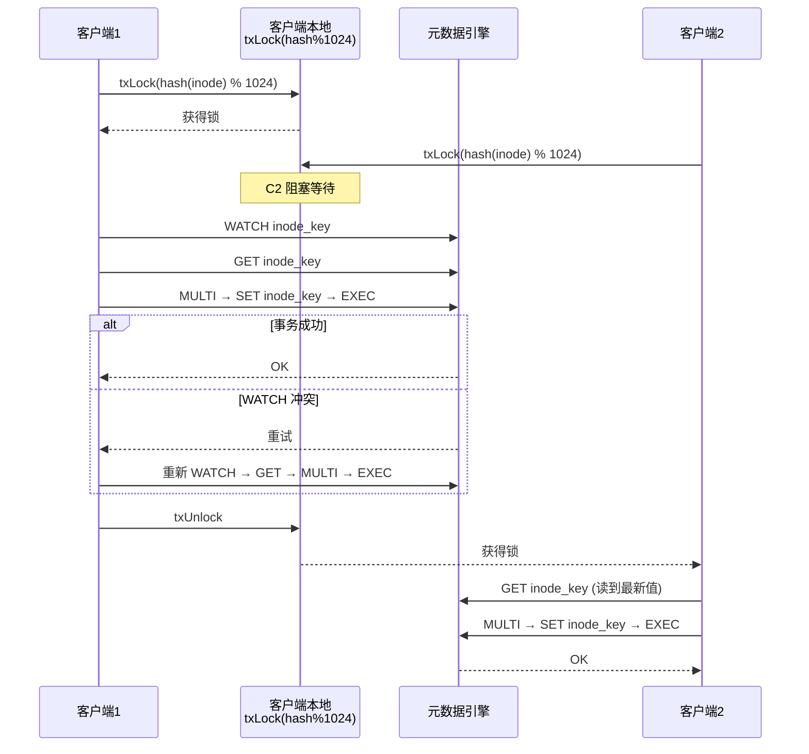
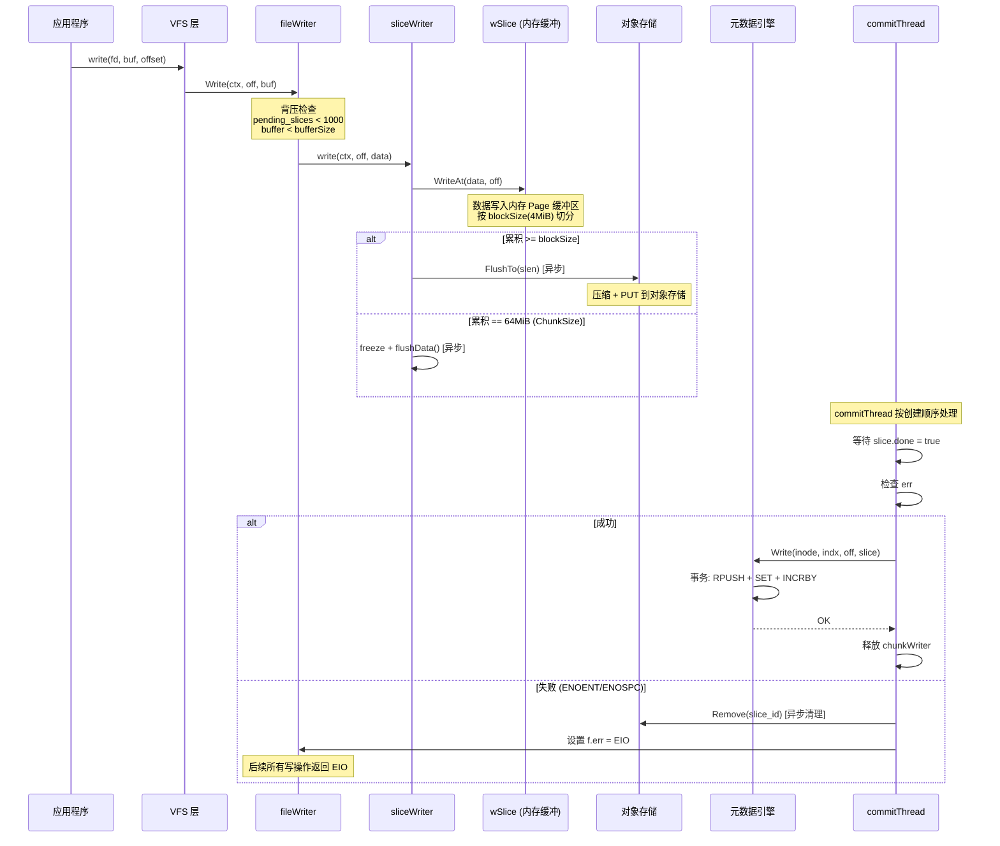
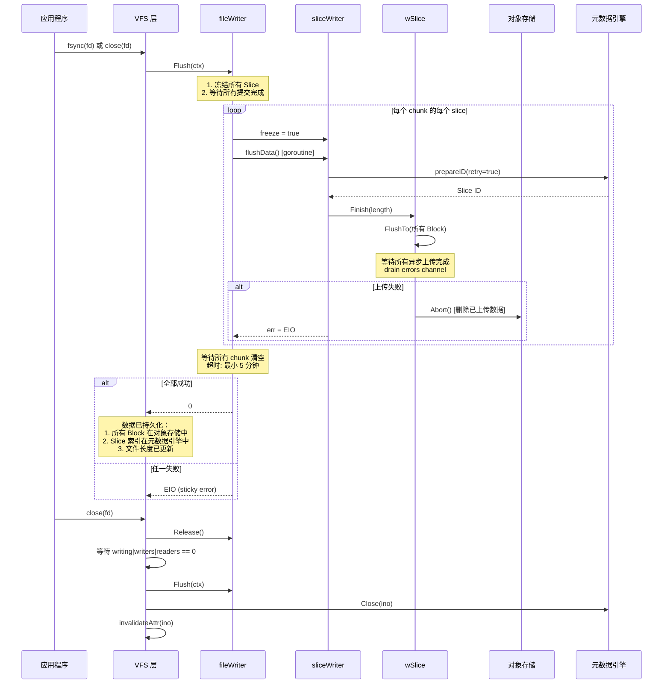
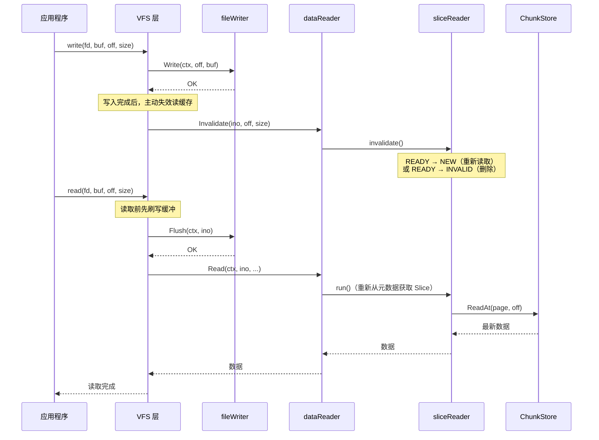
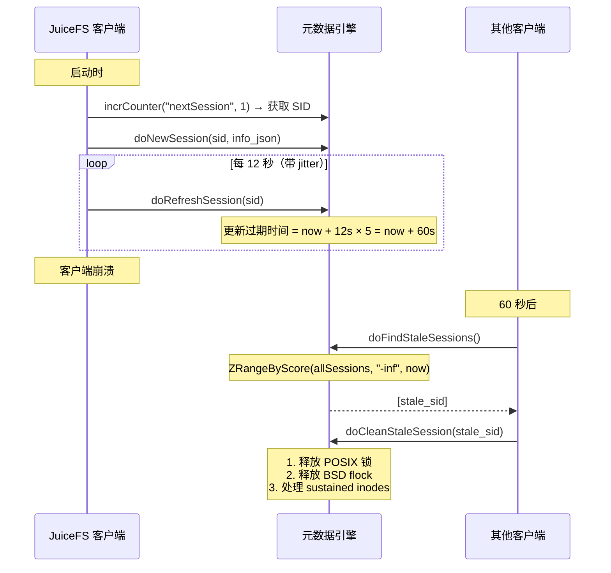
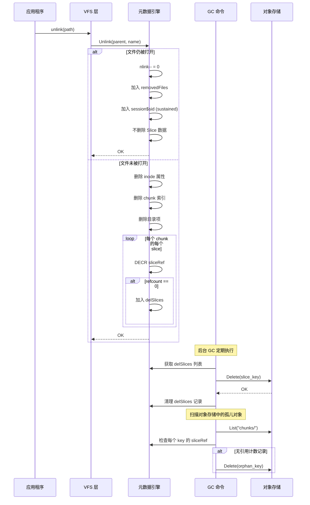

# JuiceFS 数据一致性保证机制分析

---

## 目录

1. [一致性保障总览](#1-一致性保障总览)
2. [元数据一致性](#2-元数据一致性)
3. [写入一致性](#3-写入一致性)
4. [fsync/close 持久化语义](#4-fsyncclose-持久化语义)
5. [缓存一致性](#5-缓存一致性)
6. [数据完整性校验](#6-数据完整性校验)
7. [故障恢复与会话管理](#7-故障恢复与会话管理)
8. [文件删除与垃圾回收一致性](#8-文件删除与垃圾回收一致性)
9. [多客户端一致性](#9-多客户端一致性)
10. [与 Lustre 一致性机制对比](#10-与-lustre-一致性机制对比)
11. [总结](#11-总结)

---

## 1. 一致性保障总览

JuiceFS 通过多层机制保障数据一致性：

```
┌───────────────────────────────────────────────────────┐
│                   应用层一致性                          │
│         POSIX 语义：fsync/close 返回 = 数据持久化      │
├───────────────────────────────────────────────────────┤
│                   写入一致性                            │
│   Sticky Error + 有序提交 + Abort 清理 + 原子元数据     │
├───────────────────────────────────────────────────────┤
│                   元数据一致性                          │
│   客户端悲观锁 + DB 事务(WATCH/MVCC/RR) + 50次重试     │
├───────────────────────────────────────────────────────┤
│                   缓存一致性                            │
│   Write→Invalidate + Read→Flush + 主动失效 + 校验和    │
├───────────────────────────────────────────────────────┤
│                   数据完整性                            │
│   CRC32C 校验 + 原子写入(tmp+rename) + 压缩完整性       │
├───────────────────────────────────────────────────────┤
│                   故障恢复                              │
│   会话心跳 + Stale Session 清理 + 引用计数 + GC        │
└───────────────────────────────────────────────────────┘
```

---

## 2. 元数据一致性

### 2.1 三层锁策略



### 2.2 客户端悲观锁

```go
// pkg/meta/base.go:48-51
const nlocks = 1024

// pkg/meta/base.go:627-663
func (r *baseMeta) txLock(idx uint) {
    r.txlocks[idx%nlocks].Lock()  // 1024 个互斥锁槽位
}

func (r *baseMeta) txBatchLock(inodes ...Ino) func() {
    // 排序去重后按序加锁，防止死锁
    // rename(2 inodes): 按排序加两个锁
}
```

**设计意图**：客户端侧悲观锁减少数据库层事务冲突。同一客户端进程内，对同一 inode 的操作被串行化，避免数据库事务因冲突而频繁重试。

### 2.3 三后端事务机制

| 方面 | Redis | SQL (MySQL/PG) | TiKV |
|---|---|---|---|
| **隔离** | WATCH 乐观并发 | Repeatable Read | MVCC 乐观事务 |
| **协议** | WATCH + MULTI/EXEC | BEGIN + COMMIT | KVTxn commit |
| **重试** | 最多 50 次 | 最多 50 次 | 最多 50 次 |
| **退避** | `rand % (i+1)²` ms | `i²` ms | `rand % (i+1)²` ms |
| **冲突检测** | WATCH 键被修改 | 死锁 / 序列化失败 | write conflict |

**Redis 事务示例**（[redis.go:1123-1173](pkg/meta/redis.go#L1123-L1173)）：

```go
func (m *redisMeta) txn(ctx Context, txf func(tx *redis.Tx) error, keys ...string) error {
    h := uint(fnv.New32().Sum32())  // hash of first key
    m.txLock(h)                     // 客户端悲观锁
    defer m.txUnlock(h)

    for i := 0; i < 50; i++ {       // 最多 50 次重试
        err := m.rdb.Watch(ctx, replaceErrno(txf), keys...)
        if err != nil && m.shouldRetry(err, retryOnFailure) {
            time.Sleep(backoff)      // 指数退避
            continue
        }
        return err
    }
}
```

### 2.4 元数据写入原子性

Redis `doWrite()` 在单个事务中完成三个操作（[redis.go:2875-2918](pkg/meta/redis.go#L2875-L2918)）：

```go
// 在 Redis WATCH + MULTI/EXEC 事务中：
pipe.RPush(ctx, chunkKey(inode, indx), marshalSlice(...))  // 追加 Slice
pipe.Set(ctx, inodeKey(inode), marshal(attr))               // 更新属性
pipe.IncrBy(ctx, usedSpaceKey(), delta.space)               // 更新空间统计
```

**原子性保证**：Slice 索引注册、文件长度更新、空间统计三个操作要么全部成功，要么全部回滚，不存在中间状态。

---

## 3. 写入一致性

### 3.1 写管道全流程



### 3.2 关键一致性机制

#### 3.2.1 Sticky Error（粘性错误）

```go
// pkg/vfs/writer.go:215
// 一旦任何 slice 失败，fileWriter 记录 sticky error
// 后续所有写操作立即返回 EIO，应用立刻感知
f.err = err
```

这是**"快速失败并传播"**策略：一旦某个 Slice 上传或元数据注册失败，同一文件的所有后续写操作都返回 `EIO`，应用程序不会丢失数据而不自知。

#### 3.2.2 有序提交

```go
// pkg/vfs/writer.go:187-188
// commitThread 按创建顺序处理 slice
for _, s := range c.slices {
    // 等待 s.done → 检查 err → meta.Write() → 移除
}
```

Slice 必须按创建顺序提交到元数据引擎。这保证了元数据中的 Slice 序列与实际写入顺序一致。

#### 3.2.3 Abort 清理（失败回滚）

```go
// pkg/chunk/cached_store.go:515-525
func (s *wSlice) Abort() {
    s.freePages()                    // 释放内存 Page
    s.length = s.uploaded            // 只删除已上传的 Block
    s.Remove()                       // 从对象存储删除所有已上传 Block
}
```

当 Slice ID 分配失败或上传失败时：
1. `wSlice.Abort()` 删除所有已上传到对象存储的 Block
2. `commitThread` 对 `ENOENT/ENOSPC/EDQUOT` 错误也调用 `store.Remove()` 清理
3. 逃逸清理的数据由 GC 扫描回收

#### 3.2.4 不可覆盖保护

```go
// pkg/chunk/cached_store.go:271-273
if off < int64(s.uploaded) {
    return 0, fmt.Errorf("Cannot overwrite uploaded block: %d < %d", off, s.uploaded)
}
```

已上传到对象存储的 Block 不可被覆盖，防止数据损坏。

#### 3.2.5 Flush-Write 互斥

```go
// pkg/vfs/writer.go:313-321
// Flush 进行时，Write 被阻塞
f.writewaiting++
for f.flushwaiting > 0 {
    f.writecond.Wait()
}
```

`fsync`/`close` 时冻结所有 Slice 并等待提交完成，期间新的写入被阻塞，防止 Flush 遗漏新数据。

### 3.3 上传重试策略

| 层 | 最大重试 | 退避策略 | 单次超时 |
|---|---|---|---|
| `cachedStore.upload()` (同步) | `MaxRetries + 1` (默认 11) | `try²` 秒 (0, 1, 4, 9, 16...) | `PutTimeout` (60s) |
| `cachedStore.upload()` (异步) | 3 | `try²` 秒 | `PutTimeout` (60s) |
| `sliceWriter.prepareID()` (重试) | 无限（ctx 存活期间） | 固定 100ms | 无 |
| `fileWriter.flush()` 等待 | N/A | 3 秒轮询 | `(maxRetries+2)²/2` 秒（最小 5 分钟） |

---

## 4. fsync/close 持久化语义

### 4.1 持久化时序图



### 4.2 持久化保证

**fsync 返回 0 意味着**：

| 保证 | 实现机制 |
|---|---|
| 数据已写入对象存储 | `wSlice.Finish()` 同步等待所有 Block 上传完成 |
| Slice 索引已注册 | `meta.Write()` 在事务中原子写入 |
| 文件长度已更新 | 同一个事务中更新 inode 属性 |
| 对其他客户端可见 | `meta.Write()` 内部主动失效 chunk 缓存 |

### 4.3 后台自动刷写

```go
// pkg/vfs/writer.go:452-480
// dataWriter.flushAll() 每 100ms 运行一次
func (w *dataWriter) flushAll() {
    for _, f := range w.files {
        // 随机选择一半 chunk
        // 冻结超过 5 秒 或空闲超过 1 秒的 slice
        if s.lastMod.Before(now.Add(-flushDuration)) || s.lastMod.Before(now.Add(-time.Second)) {
            s.freezed = true
            go s.flushData()
        }
    }
}
```

即使应用未调用 `fsync`，后台线程也会定期（5 秒超时）将缓冲数据刷写到对象存储。

---

## 5. 缓存一致性

### 5.1 写后读一致性



**关键保证**：
- **写后失效**：每次 `VFS.Write()` 完成后调用 `v.reader.Invalidate()`，清除重叠区域的读缓存（[vfs.go:859](pkg/vfs/vfs.go#L859)）
- **读前刷写**：每次 `VFS.Read()` 前调用 `v.writer.Flush()`，确保缓冲数据已刷到 ChunkStore（[vfs.go:789](pkg/vfs/vfs.go#L789)）

### 5.2 sliceReader 状态机

```
         flushData()
NEW ──────────────→ BUSY ──────→ READY
  ↑                   │              │
  │              (invalidate)   (invalidate)
  │                   ↓              ↓
  └──── REFRESH ←────┘         NEW (refs > 0)
                                INVALID (refs == 0)
```

- **BUSY + invalidate** → REFRESH：丢弃当前读取结果，重新从 NEW 开始
- **READY + invalidate**：如果有人正在使用（refs > 0）→ 重新读取；否则 → INVALID 删除

### 5.3 目录缓存一致性

```go
// pkg/vfs/handle.go:268-283
// 每次目录变更操作后立即更新所有打开的目录 handle
func (v *VFS) invalidateDirHandle(parent Ino, name string, inode Ino, attr *Attr) {
    for _, h := range hs {
        if h.dirHandler != nil {
            if inode > 0 {
                h.dirHandler.Insert(inode, name, attr)  // 创建/重命名
            } else {
                h.dirHandler.Delete(name)                 // 删除
            }
        }
    }
}
```

所有目录变更操作（create、unlink、mkdir、rmdir、rename、link）都会立即更新已打开的目录句柄。

### 5.4 Redis 客户端缓存

```go
// pkg/meta/redis_csc.go:280-293
// 启用 Redis 6+ RESP3 广播失效
_ = cn.Do(ctx, "CLIENT", "TRACKING", "ON", "BCAST",
    "PREFIX", c.prefix+"i",   // 监听所有 inode 键
    "PREFIX", c.prefix+"d")   // 监听所有目录项键
```

Redis 服务端主动推送失效消息，客户端收到后清除本地缓存：
- inode 属性缓存失效：`HandlePushNotification()` → 删除 `inodeCache[key]`
- 目录项缓存失效：遍历匹配前缀的 `entryCache` 键并删除

### 5.5 内核缓存失效

```go
// pkg/vfs/vfs.go:1291-1295
func (v *VFS) invalidateAttr(ino Ino) {
    v.modifiedAt[ino] = time.Now()
}
```

每次写操作后记录修改时间，供 FUSE 层判断内核 dentry/attr 缓存是否过期。超时由 `AttrTimeout`、`EntryTimeout` 等配置控制。

---

## 6. 数据完整性校验

### 6.1 对象存储校验和

```go
// pkg/object/checksum.go:28
const checksumAlgr = "Crc32c"  // CRC32C (Castagnoli)
```

**生成**：上传时计算整个对象的 CRC32C 校验和。
**验证**：下载时流式计算，在 EOF 时比对。

```go
// pkg/object/checksum.go:55-61
func (c *checksumReader) Read(buf []byte) (n int, err error) {
    n, err = c.ReadCloser.Read(buf)
    c.checksum = crc32.Update(c.checksum, c.table, buf[:n])
    if (err == io.EOF || c.remainingLength == 0) && c.checksum != c.expected {
        return 0, fmt.Errorf("verify checksum failed: %d != %d", c.checksum, c.expected)
    }
    return
}
```

### 6.2 磁盘缓存校验和

```go
// pkg/chunk/disk_cache.go:1308-1315
const (
    CsNone   = "none"   // 不校验
    CsFull   = "full"   // 仅整块读时校验
    CsShrink = "shrink" // 部分读时仅校验内部块
    CsExtend = "extend" // 部分读时扩展范围校验（默认）
)
```

每个 4MiB Block 的磁盘缓存文件附带 CRC32C 校验和（每 32KiB 一个，共 512 字节）。读取时根据策略进行校验：

| 策略 | 触发条件 | 行为 |
|---|---|---|
| `none` | - | 不校验 |
| `full` | `off == 0 && len == blockSize` | 整块校验 |
| `shrink` | 部分读取 | 只校验完整的内部 32KiB 块 |
| `extend` | 部分读取 | 扩展到块边界，校验所有触及的块 |

**校验失败处理**（[cached_store.go:146-148](pkg/chunk/cached_store.go#L146-L148)）：

```go
// 部分缓存块校验失败 → 删除该缓存块
logger.Warnf("remove partial cached block %s: %d %s", key, n, err)
s.store.bcache.remove(key, false)
```

### 6.3 原子写入（磁盘缓存）

```go
// pkg/chunk/disk_cache.go:502-563
func (store *cacheStore) flushPage(...) {
    // 1. 写入临时文件
    f, _ := os.Create(tmpPath)
    f.Write(data)
    f.Write(checksumBytes)
    f.Close()

    // 2. 原子重命名（Linux rename(2) 是原子的）
    os.Rename(tmpPath, finalPath)
}
```

**`write-to-tmp + rename`** 模式确保并发读取不会看到部分写入的缓存文件。如果进程崩溃，孤儿 `.tmp` 文件在下次启动时清理。

### 6.4 压缩完整性

数据在上传前压缩（LZ4/Zstd），下载时解压。压缩流损坏会导致解压失败，自动触发缓存失效和重新读取。

---

## 7. 故障恢复与会话管理

### 7.1 会话心跳机制



### 7.2 Stale Session 清理

当客户端崩溃后，其他客户端检测并清理其遗留资源（[redis.go:2680-2780](pkg/meta/redis.go#L2680-L2780)）：

1. **释放 POSIX 锁**：遍历 `lockp$inode`，删除属于 stale session 的锁记录
2. **释放 BSD flock**：遍历 `lockf$inode`，删除属于 stale session 的锁记录
3. **处理 sustained inodes**：
   - 检查 `session$sid`（sustained inode 集合）
   - 对每个 sustained inode：递减 `sliceRef` 引用计数
   - 如果 refcount 降至 0，加入 `delSlices` 延迟删除队列
4. **清理 session 记录**：删除 `sessionInfos`、`allSessions`、`locked$sid`

### 7.3 Sustained Inodes（打开文件的删除安全）

```go
// 文件被删除但仍被打开时的保护：
// 1. Unlink 时检查 nlink，如果仍 > 0 则仅更新目录项
// 2. 如果 nlink == 0 但文件仍被打开 → 加入 removedFiles
// 3. 添加到 session$sid（sustained inodes）
// 4. Slice 数据暂不删除
// 5. 客户端 close() 时调用 meta.Close() → 再次尝试删除
// 6. 如果客户端崩溃 → stale session 清理时处理
```

### 7.4 会话超时配置

| 参数 | 说明 | 默认值 |
|---|---|---|
| `Heartbeat` | 心跳间隔 | 12 秒 |
| 过期时间 | `now + Heartbeat × 5` | 60 秒 |
| `StaleSessionTimeout` | 显式超时（覆盖计算值） | 0（使用计算值） |
| jitter | 心跳随机抖动 | 0-30% |

---

## 8. 文件删除与垃圾回收一致性

### 8.1 删除与 GC 时序图



### 8.2 Slice 引用计数

```
sliceRef (Redis Hash):
  key = "k{sliceId}_{size}"
  value = refcount

写入时: 无引用计数（Slice 由元数据索引引用）
删除时: 遍历所有 chunk 的 slice → DECR refcount
         refcount == 0 → 加入 delSlices Sorted Set
GC 时:   从 delSlices 取出 → 从对象存储删除
硬链接:  多个 inode 引用同一文件 → refcount 可能 > 1
```

### 8.3 GC 命令（`juicefs gc`）

| 功能 | 说明 |
|---|---|
| 删除过期 Slice | `delSlices` 中超过延迟时间的 Slice |
| 清理孤儿对象 | 对象存储中存在但 `sliceRef` 中无记录的对象 |
| 回收站清理 | `TrashDays` 天前的已删文件 |
| 修复引用计数 | 检测并修复不一致的引用计数 |

---

## 9. 多客户端一致性

### 9.1 一致性模型

JuiceFS 提供**最终一致性**的多客户端语义：

| 操作 | 一致性级别 | 机制 |
|---|---|---|
| 文件创建/删除 | **强一致** | 元数据引擎事务 |
| 目录列举 | **最终一致** | TTL 缓存 + 主动失效 |
| 属性读取 | **最终一致** | AttrTimeout + Redis CSC 失效 |
| 文件读取 | **强一致** | fsync 后数据对所有客户端可见 |
| 并发写同一文件 | **最终一致** | Slice 追加（不重叠）+ 元数据事务 |
| 并发写不同文件 | **强一致** | 完全独立，无冲突 |

### 9.2 多客户端写同一文件

```
客户端 A 写 offset [0, 1MB):
  → 分配 Slice ID=100 → 写入对象存储 → meta.Write()

客户端 B 写 offset [0, 1MB):
  → 分配 Slice ID=101 → 写入对象存储 → meta.Write()

结果: Chunk 索引中有两个 Slice 覆盖 [0, 1MB)
      Slice 100 和 101 都存在
      后写入的 Slice 覆盖先写入的
      buildSlice() 按 pos 排序，后写的覆盖先写的
```

### 9.3 目录操作一致性

- **创建/删除**：通过元数据引擎事务保证原子性
- **列举（readdir）**：依赖 `EntryTimeout` TTL，默认 1 秒后重新查询
- **Lookup**：依赖 `AttrTimeout` TTL

---

## 10. 与 Lustre 一致性机制对比

| 维度 | JuiceFS | Lustre |
|---|---|---|
| **元数据一致性** | DB 事务（WATCH/MVCC/RR）+ 客户端悲观锁 | LDLM 分布式锁 + jbd2 事务 |
| **数据一致性** | Slice 原子注册 + Abort 清理 + 有序提交 | LDLM EXTENT 锁 + OSC dirty page 刷写 |
| **锁粒度** | 事务级（整个 inode 操作） | 字节级范围锁（EXTENT） |
| **锁失效** | 事务重试（最多 50 次） | AST 回调主动回收 |
| **缓存一致性** | Write→Invalidate + Read→Flush + TTL | LDLM 锁回调 + LVB |
| **fsync 语义** | Flush→Finish→meta.Write 三步持久化 | OSC dirty page flush + MDS 回复确认 |
| **客户端崩溃** | 会话心跳 + stale session 清理 | last_rcvd 重放 + orphan 回收 |
| **数据校验** | CRC32C（对象 + 缓存） | CRC32/Adler32/T10（LVB + RPC） |
| **纠删码/冗余** | 依赖对象存储 | 内置 EC + FLR 镜像 |
| **原子写入** | tmp + rename（磁盘缓存） | jbd2 事务（ldiskfs） |
| **引用计数** | sliceRef Hash（GC 删除） | 无显式引用计数（直接删除） |

---

## 11. 总结

JuiceFS 通过**六层一致性保障**机制确保数据安全：

| 层 | 机制 | 核心保证 |
|---|---|---|
| **1. 元数据** | 客户端悲观锁 + DB 事务 + 50 次重试 | 元数据操作的原子性和可串行化 |
| **2. 写入** | Sticky Error + 有序提交 + Abort 清理 | 写入失败不丢失数据、不产生脏数据 |
| **3. 持久化** | fsync → Finish → meta.Write | fsync 返回 = 数据和元数据均已持久化 |
| **4. 缓存** | Write→Invalidate + Read→Flush + 主动失效 | 读写一致性，不返回过期数据 |
| **5. 完整性** | CRC32C 校验 + 原子写入(tmp+rename) | 检测静默数据损坏 |
| **6. 恢复** | 会话心跳 + stale session 清理 + GC | 客户端崩溃后资源正确回收 |

**与 Lustre 的根本区别**：Lustre 通过**分布式锁 (LDLM) + 主动回调 (AST)** 实现细粒度并发控制和缓存一致性；JuiceFS 通过**数据库事务 + 客户端锁 + 引用计数 + GC** 实现更简单但同样有效的模型。JuiceFS 的设计更适合云环境，因为其一致性不依赖专用网络协议（RDMA）和专用锁管理器（MDT），而是复用了成熟的数据库引擎的事务能力。

---

## 附录：关键源码索引

| 模块 | 文件 | 关键内容 |
|---|---|---|
| **VFS 写入** | `pkg/vfs/vfs.go:801-863` | `VFS.Write()` |
| **VFS fsync** | `pkg/vfs/vfs.go:1036-1059` | `VFS.Fsync()` |
| **VFS close** | `pkg/vfs/vfs.go:647-687` | `VFS.Release()` |
| **fileWriter** | `pkg/vfs/writer.go:224-239` | `fileWriter` 结构 |
| **fileWriter.Write** | `pkg/vfs/writer.go:297-341` | 写入 + 背压 |
| **fileWriter.Flush** | `pkg/vfs/writer.go:353-401` | fsync/close 刷写 |
| **sliceWriter** | `pkg/vfs/writer.go:52-66` | `sliceWriter` 结构 |
| **sliceWriter.write** | `pkg/vfs/writer.go:127-151` | 写入内存缓冲 |
| **sliceWriter.flushData** | `pkg/vfs/writer.go:106-124` | 异步刷写 |
| **commitThread** | `pkg/vfs/writer.go:182-222` | 有序提交 |
| **wSlice.WriteAt** | `pkg/chunk/cached_store.go:267-310` | Page 缓冲 |
| **wSlice.Finish** | `pkg/chunk/cached_store.go:497-513` | 同步等待上传 |
| **wSlice.Abort** | `pkg/chunk/cached_store.go:515-525` | 失败清理 |
| **wSlice.upload** | `pkg/chunk/cached_store.go:400-469` | 异步上传 |
| **cachedStore.upload** | `pkg/chunk/cached_store.go:356-398` | 重试上传 |
| **meta.Write** | `pkg/meta/base.go:2074-2098` | 元数据写入 |
| **Redis doWrite** | `pkg/meta/redis.go:2875-2918` | 事务写入 |
| **Redis txn** | `pkg/meta/redis.go:1123-1173` | 事务框架 |
| **客户端锁** | `pkg/meta/base.go:627-663` | txLock/txBatchLock |
| **会话管理** | `pkg/meta/base.go:739-913` | NewSession/refresh/CleanStale |
| **Stale 清理** | `pkg/meta/redis.go:2680-2780` | doCleanStaleSession |
| **磁盘缓存** | `pkg/chunk/disk_cache.go:502-563` | 原子写入(tmp+rename) |
| **缓存校验** | `pkg/chunk/disk_cache.go:1308-1446` | CRC32C 校验 |
| **读缓存失效** | `pkg/vfs/reader.go:234-249` | sliceReader 状态机 |
| **读前刷写** | `pkg/vfs/vfs.go:789` | `v.writer.Flush(ctx, ino)` |
| **写后失效** | `pkg/vfs/vfs.go:859` | `v.reader.Invalidate(ino, off, size)` |
| **目录失效** | `pkg/vfs/handle.go:268-283` | `invalidateDirHandle()` |
| **Redis CSC** | `pkg/meta/redis_csc.go:280-293` | RESP3 广播失效 |
| **对象校验** | `pkg/object/checksum.go:32-80` | CRC32C 生成/验证 |
| **GC** | `cmd/gc.go` | 垃圾回收命令 |
| **后台刷写** | `pkg/vfs/writer.go:452-480` | `flushAll()` |
