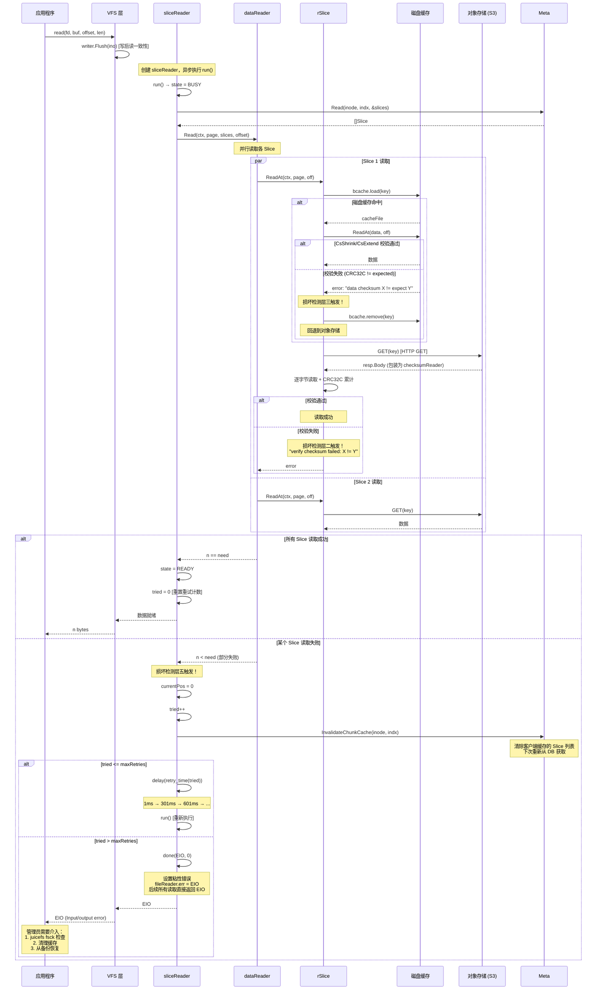
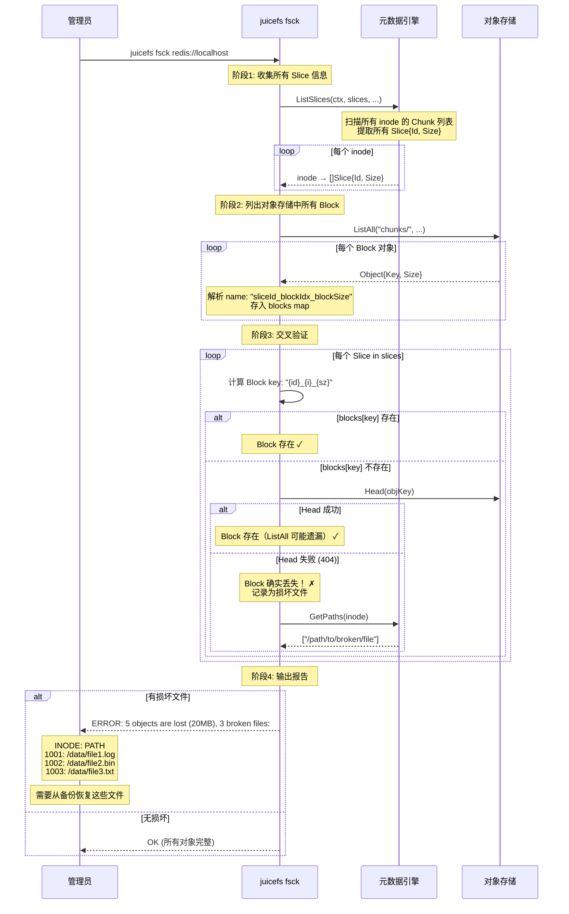

# JuiceFS 数据损坏检测与修复机制详解

---

## 目录

1. [核心问题：Slice 数据损坏如何被发现？](#1-核心问题slice-数据损坏如何被发现)
2. [检测层一：写入时的 CRC32C 校验和（预防性）](#2-检测层一写入时的-crc32c-校验和预防性)
3. [检测层二：读取时的流式校验验证（实时检测）](#3-检测层二读取时的流式校验验证实时检测)
4. [检测层三：磁盘缓存校验和（Shrink/Extend 模式）](#4-检测层三磁盘缓存校验和shrinkextend-模式)
5. [检测层四：磁盘缓存部分读取检测](#5-检测层四磁盘缓存部分读取检测)
6. [检测层五：读取失败自动重试机制](#6-检测层五读取失败自动重试机制)
7. [检测层六：fsck 离线一致性检查（管理员主动检测）](#7-检测层六fsck-离线一致性检查管理员主动检测)
8. [检测层七：数据完整性守卫（解压长度校验）](#8-检测层七数据完整性守卫解压长度校验)
9. [检测层八：磁盘缓存健康状态机](#9-检测层八磁盘缓存健康状态机)
10. [损坏修复路径总结](#10-损坏修复路径总结)
11. [完整时序图：读取时发现并处理损坏数据](#11-完整时序图读取时发现并处理损坏数据)
12. [完整时序图：fsck 检测丢失对象](#12-完整时序图fsck-检测丢失对象)
13. [各检测层对比](#13-各检测层对比)
14. [与 Lustre 数据保护机制的对比](#14-与-lustre-数据保护机制的对比)
15. [关键源码索引](#15-关键源码索引)

---

## 1. 核心问题：Slice 数据损坏如何被发现？

> **问题**：假设 JuiceFS 中有一块 Slice 数据损坏，这个有什么机制可以发现，并修复？

**答案**：JuiceFS 通过 **七层防护机制** 来检测数据损坏，但**没有自动修复损坏数据的能力**。损坏数据的修复需要管理员介入（恢复备份或从副本重建）。

```
Slice 数据损坏的七层检测：

  ┌─────────────────────────────────────────────────────────┐
  │ 第一层：写入时生成 CRC32C 校验和 → 存入对象元数据       │
  │         预防层：确保数据上传时完整性                       │
  ├─────────────────────────────────────────────────────────┤
  │ 第二层：读取时流式 CRC32C 校验 → checksumReader         │
  │         实时层：从 S3 读取时逐字节验证                    │
  ├─────────────────────────────────────────────────────────┤
  │ 第三层：磁盘缓存 CRC32C 校验 → cacheFile.ReadAt()       │
  │         缓存层：Shrink/Extend 模式按 32KiB 校验          │
  ├─────────────────────────────────────────────────────────┤
  │ 第四层：磁盘缓存部分读取检测 → rSlice.ReadAt()          │
  │         缓存层：缓存返回数据不完整时自动删除缓存          │
  ├─────────────────────────────────────────────────────────┤
  │ 第五层：读取失败重试 → sliceReader.run()                │
  │         重试层：失效元数据缓存 → 重新获取 Slice 列表     │
  ├─────────────────────────────────────────────────────────┤
  │ 第六层：解压长度校验 → cachedStore.load()                │
  │         守卫层：解压后数据长度不足 → 返回错误              │
  ├─────────────────────────────────────────────────────────┤
  │ 第七层：fsck 离线检查 → Head() 验证对象存在性            │
  │         管理层：扫描所有 Slice → 验证对象是否丢失         │
  └─────────────────────────────────────────────────────────┘
```

**关键结论**：

| 问题 | 回答 |
|---|---|
| 损坏如何被发现？ | 读取时通过 CRC32C 校验和、缓存校验、解压长度等多层机制检测 |
| 能否自动修复？ | **不能**。JuiceFS 不存储数据副本，无法自动修复损坏的 Slice |
| 管理员如何处理？ | 使用 `juicefs fsck` 检测丢失对象，从备份恢复 |
| 被动 vs 主动？ | 读取时**被动检测** + `fsck` **主动扫描** |

---

## 2. 检测层一：写入时的 CRC32C 校验和（预防性）

### 2.1 校验和生成

写入数据到对象存储时，JuiceFS 会为每个 Block 计算整体 CRC32C 校验和，并将校验和值存入对象的元数据（Metadata）中：

```go
// pkg/object/checksum.go:32-53
const checksumAlgr = "Crc32c"
var crc32c = crc32.MakeTable(crc32.Castagnoli)

func generateChecksum(in io.ReadSeeker) string {
    if b, ok := in.(*bytes.Reader); ok {
        v := reflect.ValueOf(b)
        data := v.Elem().Field(0).Bytes()
        return strconv.Itoa(int(crc32.Update(0, crc32c, data)))
    }
    // 流式计算：逐块读取并更新 CRC32C
    var hash uint32
    crcBuffer := bufPool.Get().(*[]byte)
    defer bufPool.Put(crcBuffer)
    defer func() { _, _ = in.Seek(0, io.SeekStart) }()
    for {
        n, err := in.Read(*crcBuffer)
        hash = crc32.Update(hash, crc32c, (*crcBuffer)[:n])
        if err != nil {
            if err != io.EOF { return "" }
            break
        }
    }
    return strconv.Itoa(int(hash))
}
```

### 2.2 校验和存储

以 S3 为例，校验和作为对象的 `x-amz-meta-crc32c` 元数据存储：

```go
// pkg/object/s3.go:155-193
func (s *s3client) Put(ctx context.Context, key string, in io.Reader, ...) error {
    body := ... // io.ReadSeeker
    params := &s3.PutObjectInput{
        Bucket: &s.bucket,
        Key:    &key,
        Body:   body,
        ...
    }
    // 写入时附加 CRC32C 校验和到对象元数据
    if !s.disableChecksum {
        checksum := generateChecksum(body)
        params.Metadata = map[string]string{checksumAlgr: checksum}
        // 存储为 x-amz-meta-crc32c: "1234567890"
    }
    ...
}
```

**数据流**：

```
写入 Block:
  Page 数据 → LZ4/Zstd 压缩 → CRC32C 校验和
                                  ↓
              PUT /chunks/100/100_0_4194304
              Metadata: { crc32c: "1234567890" }
```

> **注意**：这里校验和是附加在**压缩后**的数据上的。如果原始数据已损坏但压缩成功，校验和无法发现原始数据层面的损坏。不过由于写入路径是内存直传（无中间存储），写入时损坏的可能性极低。

---

## 3. 检测层二：读取时的流式校验验证（实时检测）

### 3.1 流式校验验证器

从 S3 读取数据时，JuiceFS 使用 `checksumReader` 包装器逐字节验证 CRC32C 校验和：

```go
// pkg/object/checksum.go:55-71
type checksumReader struct {
    io.ReadCloser
    expected        uint32   // 从对象元数据中读取的期望校验和
    checksum        uint32   // 实时计算的校验和
    remainingLength int64    // 剩余待读字节数
    table           *crc32.Table
}

func (c *checksumReader) Read(buf []byte) (n int, err error) {
    n, err = c.ReadCloser.Read(buf)
    c.checksum = crc32.Update(c.checksum, c.table, buf[:n])
    c.remainingLength -= int64(n)
    // 读完所有数据后比对校验和
    if (err == io.EOF || c.remainingLength == 0) && c.checksum != c.expected {
        return 0, fmt.Errorf("verify checksum failed: %d != %d", c.checksum, c.expected)
    }
    return
}
```

### 3.2 S3 Get 时的校验触发

```go
// pkg/object/s3.go:122-152
func (s *s3client) Get(ctx context.Context, key string, off, limit int64, ...) (io.ReadCloser, error) {
    params := &s3.GetObjectInput{Bucket: &s.bucket, Key: &key}
    if off > 0 || limit > 0 {
        params.Range = &r  // HTTP Range 请求
    }
    resp, err := s.s3.GetObject(ctx, params)
    ...
    // 仅在完整读取（非 Range）且未禁用校验和时验证
    if off == 0 && limit == -1 && !s.disableChecksum {
        cs := resp.Metadata[strings.ToLower(checksumAlgr)]  // 读取 x-amz-meta-crc32c
        if cs != "" && resp.ContentLength != nil {
            resp.Body = verifyChecksum(resp.Body, cs, *resp.ContentLength)
            // 包装为 checksumReader，后续每次 Read 都会更新校验和
        }
    }
    return resp.Body, nil
}
```

### 3.3 触发条件

| 条件 | 是否校验 |
|---|---|
| 完整 GET（off=0, limit=-1） | 校验 |
| Range GET（部分读取） | **不校验** |
| `disable-checksum=true` | **不校验** |
| 非 S3 后端（OSS/COS 等） | 取决于后端实现 |

**重要限制**：Range GET 请求不触发校验。这是性能权衡——Range GET 通常用于小范围随机读取场景，此时 CRC32C 校验的开销不值得。

---

## 4. 检测层三：磁盘缓存校验和（Shrink/Extend 模式）

### 4.1 校验和级别

JuiceFS 的磁盘缓存支持四种校验和级别（[disk_cache.go:1308-1314](pkg/chunk/disk_cache.go#L1308-L1314)）：

```go
const (
    CsNone   = "none"    // 无校验和
    CsFull   = "full"    // 全量校验：仅完整读取时校验
    CsShrink = "shrink"  // 收缩校验：部分读取时仅校验对齐的 32KiB 块
    CsExtend = "extend"  // 扩展校验：部分读取时扩展到 32KiB 边界后校验
)
```

### 4.2 校验和计算

写入磁盘缓存时，按 32KiB 块计算 CRC32C 校验和，附加在数据后面：

```go
// pkg/chunk/disk_cache.go:1329-1342
const csBlock = 32 << 10  // 32 KiB

// 为每 32 KiB 数据计算 4 字节 CRC32C，4MiB Block 共 512 字节校验和
func checksum(data []byte) []byte {
    length := len(data)
    buf := utils.NewBuffer(uint32((length-1)/csBlock+1) * 4)
    for start, end := 0, 0; start < length; start = end {
        end = start + csBlock
        if end > length { end = length }
        sum := crc32.Checksum(data[start:end], crc32c)
        buf.Put32(sum)
    }
    return buf.Bytes()
}
```

### 4.3 校验和写入

磁盘缓存文件结构：

```
┌────────────────────────────────┬──────────────────┬──────────┐
│         Block 数据             │   CRC32C 校验和  │  TierID  │
│         (4 MiB)                │  (512 Bytes)     │ (1 Byte) │
│                                │  每 32KiB 一项   │          │
└────────────────────────────────┴──────────────────┴──────────┘
     offset 0                     offset 4MiB      offset 4MiB+512
```

写入时使用 `write-to-tmp + rename` 原子模式：

```go
// pkg/chunk/disk_cache.go:502-563
func (cache *cacheStore) flushPage(path string, data []byte, ...) error {
    tmp := path + ".tmp"
    f, _ := os.OpenFile(tmp, os.O_WRONLY|os.O_CREATE, cache.mode)
    // 1. 写入数据
    cache.writeFile(f, data)
    // 2. 写入校验和
    if cache.checksum != CsNone {
        cache.writeFile(f, checksum(data))
    }
    // 3. 写入 tierID（可选）
    // 4. 重命名为正式文件（原子操作）
    cache.renameFile(tmp, path)
}
```

### 4.4 读取时校验验证

```go
// pkg/chunk/disk_cache.go:1372-1446
func (cf *cacheFile) ReadAt(b []byte, off int64) (n int, err error) {
    // CsNone 或 CsFull 部分读取 → 直接读，不校验
    if cf.csLevel == CsNone || cf.csLevel == CsFull && (off != 0 || len(b) != cf.length) {
        return cf.File.ReadAt(b, off)
    }

    var rb = b
    var roff = off

    // CsExtend: 扩展到 32KiB 边界
    if cf.csLevel == CsExtend {
        roff = off / csBlock * csBlock        // 向下对齐
        rend := int(off) + len(b)
        if rend%csBlock != 0 {
            rend = (rend/csBlock + 1) * csBlock  // 向上对齐
        }
    }

    // 读取数据
    cf.File.ReadAt(rb, roff)

    // CsShrink: 裁剪到 32KiB 对齐范围
    if cf.csLevel == CsShrink {
        if roff%csBlock != 0 { rb = rb[o:] }           // 裁剪头部
        if end%csBlock != 0 { rb = rb[:len(rb)-end%csBlock] } // 裁剪尾部
    }

    // 读取校验和
    ioff := int(roff) / csBlock
    buf := utils.NewBuffer(uint32((length-1)/csBlock+1) * 4)
    cf.File.ReadAt(buf.Bytes(), int64(cf.length+ioff*4))

    // 逐块校验
    for start, end := 0, 0; start < length; start = end {
        end = start + csBlock
        if end > length { end = length }
        sum := crc32.Checksum(rb[start:end], crc32c)
        expect := buf.Get32()
        if sum != expect {
            err = fmt.Errorf("data checksum %d != expect %d", sum, expect)
            break  // 校验失败！
        }
    }
    return
}
```

### 4.5 四种校验模式对比

| 模式 | 完整读取 | 部分读取 | 校验范围 | 性能影响 |
|---|---|---|---|---|
| **none** | 不校验 | 不校验 | - | 无额外开销 |
| **full** | 校验 | 不校验 | 仅全量读取 | 最低 |
| **shrink** | 校验 | 校验对齐块 | 裁剪到 32KiB 边界 | 中等 |
| **extend** | 校验 | 校验扩展块 | 扩展到 32KiB 边界 | 最高 |

---

## 5. 检测层四：磁盘缓存部分读取检测

当从磁盘缓存读取数据但返回不完整时，rSlice 会自动删除缓存并回退到对象存储：

```go
// pkg/chunk/cached_store.go:130-148
func (s *rSlice) ReadAt(ctx context.Context, page *Page, off int) (n int, err error) {
    key := s.key(indx)
    if s.store.conf.CacheEnabled() {
        r, err := s.store.bcache.load(key)
        if err == nil {
            n, err = r.ReadAt(p, int64(boff))
            _ = r.Close()
            if err == nil {
                // 缓存命中且读取成功
                return n, nil
            }
            // 缓存命中但读取失败（文件损坏/截断）
            logger.Warnf("remove partial cached block %s: %d %s", key, n, err)
            s.store.bcache.remove(key, false)  // ← 删除损坏的缓存！
        }
    }
    // 回退到对象存储读取
    ...
}
```

**检测场景**：

```
磁盘缓存文件被截断 / 磁盘坏道 / 文件系统错误
  ↓
ReadAt 返回读取字节数 n < 预期长度
  ↓
err != nil (io.ErrUnexpectedEOF 等)
  ↓
bcache.remove(key, false)  ← 删除损坏的缓存文件
  ↓
重新从对象存储下载完整 Block
```

---

## 6. 检测层五：读取失败自动重试机制

### 6.1 sliceReader 重试

当 `dataReader.Read()` 因数据损坏返回字节数不足时，`sliceReader.run()` 会触发重试：

```go
// pkg/vfs/reader.go:162-229
func (s *sliceReader) run() {
    // 1. 从元数据引擎获取 Slice 列表
    err := f.r.m.Read(meta.Background(), inode, indx, &slices)
    if err != 0 {
        f.tried++
        if f.tried > f.r.maxRetries {
            s.done(syscall.EIO, 0)  // 超过最大重试次数 → 永久失败
        } else {
            s.done(0, retry_time(f.tried))  // 延迟后重试
        }
        return
    }

    // 2. 并行读取所有 Slice
    n = f.r.Read(ctx, p, slices, offset)

    if n == int(need) {
        s.state = READY           // 全部成功
        s.file.tried = 0           // 重置重试计数
    } else {
        // 读取数据不完整 → 可能是数据损坏
        s.currentPos = 0
        err = syscall.EIO
        f.tried++
        _ = f.r.m.InvalidateChunkCache(meta.Background(), inode, indx)  // ← 失效元数据缓存
        if f.tried > f.r.maxRetries {
            s.done(err, 0)         // 永久失败
        } else {
            s.done(0, retry_time(f.tried))  // 延迟重试
        }
    }
}
```

### 6.2 重试策略

```go
// pkg/vfs/reader.go:155-160
func retry_time(trycnt uint32) time.Duration {
    if trycnt < 30 {
        return time.Millisecond * time.Duration((trycnt-1)*300+1)
        // 第1次: 1ms, 第2次: 301ms, 第3次: 601ms, ...
    }
    return time.Second * 10  // 30次后固定 10秒
}
```

### 6.3 重试时的关键操作

重试时 JuiceFS 会执行以下操作：

```
sliceReader.run() 读取失败
  ↓
InvalidateChunkCache(inode, indx)
  ├── openfile.InvalidateChunk()   ← 清除客户端缓存的 Slice 列表
  └── 下次 run() 重新从元数据引擎获取最新 Slice 信息
  ↓
retry_time(tried) 延迟后重新执行 run()
  ↓
meta.Read(inode, indx, &slices)   ← 获取最新 Slice 列表
  ↓
dataReader.Read()                  ← 重新从存储后端读取
  ├── 磁盘缓存可能已被删除（检测层四）
  └── 对象存储可能修复了临时故障
```

### 6.4 Sticky Error

一旦重试超过 `maxRetries`（默认 100），设置粘性错误：

```go
// pkg/vfs/reader.go:127
if err != 0 {
    f.err = err  // 设置粘性错误，后续所有读取直接返回 EIO
}
```

---

## 7. 检测层六：fsck 离线一致性检查（管理员主动检测）

### 7.1 命令概述

`juicefs fsck` 是管理员主动运行的一致性检查工具，可以检测**丢失的对象**（对象存储中不存在的 Block）：

```bash
# 检查整个卷
$ juicefs fsck redis://localhost

# 检查并修复指定路径
$ juicefs fsck redis://localhost --path /d1/d2 --repair

# 递归检查
$ juicefs fsck redis://localhost --path /d1/d2 --recursive
```

### 7.2 检查流程

```go
// cmd/fsck.go:78-234
func fsck(ctx *cli.Context) error {
    m := meta.NewClient(ctx.Args().Get(0), nil)
    format, _ := m.Load(true)

    // 1. 收集所有文件的 Slice 信息
    slices := make(map[meta.Ino][]meta.Slice)
    if path != "" {
        // 检查指定路径
        m.Check(c, path, &meta.CheckOpt{...Slices: slices})
    } else {
        // 列出所有 Slice
        m.ListSlices(c, slices, false, false, ...)
    }

    // 2. 列出对象存储中的所有 Block
    blob := object.WithPrefix(createStorage(*format), "chunks/")
    objs, _ := object.ListAll(ctx.Context, blob, "", "", true, false)
    blocks := make(map[string]int64)
    for obj := range objs {
        name := parts[2]  // 如 "100_0_4194304"
        blocks[name] = obj.Size()
    }

    // 3. 逐个 Slice 验证 Block 是否存在
    brokens := make(map[meta.Ino]string)
    for inode, ss := range slices {
        for _, s := range ss {
            n := (s.Size - 1) / uint32(chunkConf.BlockSize)
            for i := uint32(0); i <= n; i++ {
                sz := chunkConf.BlockSize
                if i == n { sz = int(s.Size) - int(i)*chunkConf.BlockSize }
                key := fmt.Sprintf("%d_%d_%d", s.Id, i, sz)
                if _, ok := blocks[key]; !ok {
                    // Block 不在列表中 → 进一步用 Head() 确认
                    objKey := ... // 构建完整对象路径
                    obj, err := blob.Head(ctx.Context, objKey)
                    if err != nil {
                        // 对象确实不存在！→ 记录为损坏文件
                        brokens[inode] = ps[0]  // 文件路径
                        logger.Errorf("can't find block %s for file %s: %s", objKey, path, err)
                    }
                }
            }
        }
    }

    // 4. 报告损坏文件
    if lc, lb := lostDSpin.Current(); lc > 0 {
        msg := fmt.Sprintf("%d objects are lost (%d bytes), %d broken files:\n", lc, lb, len(brokens))
        logger.Fatal(msg)
    }
}
```

### 7.3 fsck 能检测的问题

| 问题类型 | 是否能检测 | 修复方式 |
|---|---|---|
| **对象存储中 Block 丢失** | 能（Head() 验证） | 需从备份恢复 |
| **元数据引用不存在的 Slice** | 能 | 需从备份恢复 |
| **目录属性丢失/损坏** | 能 | `--repair` 可修复 |
| **目录 nlink 不一致** | 能 | `--repair` 可修复 |
| **Block 数据内容损坏（位翻转）** | **不能**（仅检查存在性） | 需应用层校验 |
| **磁盘缓存损坏** | **不能**（fsck 不检查缓存） | 客户端读取时自动删除 |

### 7.4 目录修复

```go
// pkg/meta/base.go:2502-2523
if attrBroken {
    if opt.Repair {
        if !attr.Full {
            // 属性缺失：重建默认属性
            attr.Mode = opt.RepairDirMode   // 默认 0755
            attr.Uid = ctx.Uid()
            attr.Gid = ctx.Gid()
            attr.Atime = now
            attr.Mtime = now
            attr.Ctime = now
            attr.Length = 4 << 10
        }
        // 重新写入修复后的属性
        m.en.doRepair(ctx, inode, attr)
    }
}
```

---

## 8. 检测层七：数据完整性守卫（解压长度校验）

### 8.1 解压后长度校验

从对象存储下载数据后，`cachedStore.load()` 会验证解压后的数据长度：

```go
// pkg/chunk/cached_store.go:755-823
func (store *cachedStore) load(ctx context.Context, key string, page *Page, ...) (err error) {
    // 1. 下载压缩数据
    in, err := store.storage.Get(cCtx, key, 0, -1, ...)
    n, err = io.ReadFull(in, p.Data)
    _ = in.Close()

    // 2. 解压
    if compressed {
        n, err = store.compressor.Decompress(page.Data, p.Data[:n])
    }

    // 3. 校验解压后长度
    if err != nil || n < len(page.Data) {
        return fmt.Errorf("read %s fully: %v (%d < %d) after %s",
            key, err, n, len(page.Data), used)
        // 解压后数据不足 → 可能数据损坏或下载不完整
    }

    // 4. 写入磁盘缓存
    if cache {
        store.bcache.cache(key, page, forceCache, !store.conf.OSCache)
    }
    return nil
}
```

### 8.2 检测场景

```
Block 数据损坏的检测场景:

场景1: 网络传输导致数据损坏
  GET → 下载完成 → CRC32C 校验（层二） → 校验失败 → 返回错误

场景2: 对象存储内部损坏
  GET → checksumReader 逐字节验证 → EOF 时校验不匹配 → 返回错误
  注意: 如果对象存储返回的 Metadata 中的 CRC32C 也被篡改，则无法检测

场景3: 磁盘缓存损坏（位翻转）
  bcache.load → cacheFile.ReadAt → CsShrink/CsExtend 校验
  → CRC32C 不匹配 → 返回错误
  → rSlice 检测到错误 → bcache.remove → 回退到对象存储

场景4: 压缩数据损坏
  GET → 解压 → 解压长度 < 预期（层七） → 返回错误
  或 → 解压报错（LZ4/Zstd 内置校验） → 返回错误

场景5: 对象丢失（404）
  GET → 对象不存在 → 返回错误
  → sliceReader 重试 → InvalidateChunkCache → 重新获取 Slice
  → 如果对象确实丢失 → 重试全部失败 → EIO
```

---

## 9. 检测层八：磁盘缓存健康状态机

### 9.1 三态状态机

JuiceFS 的磁盘缓存有一个内置的健康状态机（[disk_cache_state.go](pkg/chunk/disk_cache_state.go)），监控缓存设备的 I/O 健康状态：

```
                 连续 3 次 I/O 错误
    dcNormal ──────────────────────→ dcUnstable
        ↑                                │
        │                         30 分钟无恢复
        │                                ↓
        │                            dcDown
        │                          (缓存禁用)
        │                                │
        └──── ≥60次成功 I/O 且 0% 错误率 ┘
```

### 9.2 状态转换规则

| 状态 | 进入条件 | 行为 | 退出条件 |
|---|---|---|---|
| **dcNormal** | 初始状态 | 正常读写 | 连续 3 次 I/O 错误 → dcUnstable |
| **dcUnstable** | 累积 3 次 I/O 错误 | 每 500ms 探测读写、限制并发为 10 | ≥60 次成功且 0% 错误 → Normal; 30 分钟不恢复 → Down |
| **dcDown** | Unstable 持续 30 分钟 | 所有缓存操作返回 `errCacheDown` | 重启客户端 |

### 9.3 I/O 超时检测

缓存操作超过 30 秒未完成，自动判定为 I/O 错误：

```go
// pkg/chunk/disk_cache.go (checkTimeout)
func (c *cacheStore) checkTimeout() {
    for c.available() {
        now := utils.Clock()
        cutOff := now - maxIODur  // 30 秒
        for ts := range c.opTs {
            if ts < cutOff {
                logger.Warnf("IO operation %s on %s is timeout after %s", ...)
                c.state.onIOErr()  // 触发状态转换
                delete(c.opTs, ts)
            }
        }
    }
}
```

### 9.4 错误上报

所有缓存操作都通过 `checkErr()` 包装，统一上报成功/失败：

```go
// pkg/chunk/disk_cache.go
func (cache *cacheStore) checkErr(f func() error) error {
    if !cache.available() { return errCacheDown }
    cache.state.beforeCacheOp()
    defer cache.state.afterCacheOp()
    err := f()
    if err != nil {
        if errors.Is(err, syscall.EIO) || errors.Is(err, utils.ErrFuncTimeout) {
            cache.state.onIOErr()   // 上报错误 → 可能触发 Normal → Unstable
        }
    } else {
        cache.state.onIOSucc()      // 上报成功
    }
    return err
}
```

**设计意义**：当缓存磁盘出现硬件故障（坏道、连接异常等），状态机可以自动检测并逐步降级，最终完全禁用缓存，确保读取回退到对象存储而不是返回损坏数据。

---

## 10. 损坏修复路径总结

### 9.1 JuiceFS 的修复能力

**JuiceFS 能自动修复的**：
- 磁盘缓存损坏 → 删除缓存 → 重新从对象存储下载
- 元数据缓存过期 → InvalidateChunkCache → 重新获取
- 对象存储临时故障 → 自动重试（最多 maxRetries 次）
- 目录属性损坏 → `fsck --repair` 修复

**JuiceFS 不能自动修复的**：
- **对象存储中 Block 数据损坏（位翻转）** → 无法修复，因为 JuiceFS 不存储副本
- **对象存储中 Block 丢失（404）** → 无法修复
- **元数据中 Slice 引用错误** → 无法自动修复

### 9.2 管理员修复流程

```
发现数据损坏（读取返回 EIO / fsck 报告丢失对象）
  ↓
步骤1: 确认损坏范围
  $ juicefs fsck redis://localhost
  → 输出损坏文件列表和丢失对象列表
  ↓
步骤2: 检查是否为缓存问题
  $ rm -rf /path/to/cache/*
  → 清理所有本地缓存，重新从对象存储下载
  ↓
步骤3: 如果对象确实损坏
  → 从备份恢复损坏的 Block 对象
  → 或重新生成数据（如从原始数据集重新导入）
  ↓
步骤4: 验证修复
  $ juicefs fsck redis://localhost
  → 确认无丢失对象
```

---

## 11. 完整时序图：读取时发现并处理损坏数据



---

## 12. 完整时序图：fsck 检测丢失对象



---

## 13. 各检测层对比

| 层 | 检测位置 | 检测对象 | 校验方式 | 触发时机 | 自动修复 |
|---|---|---|---|---|---|
| **一：写入校验和** | `s3client.Put()` | 对象存储 Block | CRC32C（整体） | 写入时 | 不适用（预防） |
| **二：读取流式校验** | `checksumReader.Read()` | 对象存储 Block | CRC32C（流式） | 完整 GET 时 | 否 |
| **三：缓存校验和** | `cacheFile.ReadAt()` | 磁盘缓存 Block | CRC32C/32KiB | 读取缓存时 | 否（回退到 S3） |
| **四：缓存部分读取** | `rSlice.ReadAt()` | 磁盘缓存 Block | 读取长度检查 | 缓存读取失败时 | 删除缓存 |
| **五：失败重试** | `sliceReader.run()` | 整个 Chunk | 数据完整性 | 读取数据不足时 | 重试（非修复） |
| **六：fsck 检查** | `cmd/fsck.go` | 对象存储 Block | Head() 存在性 | 管理员手动运行 | 目录属性可修复 |
| **七：解压校验** | `cachedStore.load()` | 对象存储 Block | 解压后长度 | 下载并解压后 | 否 |
| **八：缓存健康状态机** | `disk_cache_state.go` | 磁盘缓存设备 | I/O 错误率 + 超时 | 持续监控 | 逐步降级直至禁用 |

### 检测时序

```
数据损坏可能被发现的路径：

路径 A（读取时实时检测）:
  读取请求 → 磁盘缓存命中 → cacheFile.ReadAt() 校验失败
  → 删除缓存 → 重新从 S3 下载 → checksumReader 校验失败
  → 返回错误 → sliceReader 重试 → 重试失败 → EIO

路径 B（读取时实时检测，缓存未命中）:
  读取请求 → 磁盘缓存未命中 → 从 S3 下载
  → checksumReader 校验失败 → 返回错误 → sliceReader 重试 → EIO

路径 C（离线检测）:
  管理员运行 juicefs fsck → 遍历所有 Slice → Head() 验证对象存在性
  → 发现丢失对象 → 报告损坏文件列表

路径 D（解压检测）:
  下载压缩数据 → 解压 → 解压后数据长度不足 → 返回错误
  → sliceReader 重试 → EIO
```

---

## 14. 与 Lustre 数据保护机制的对比

| 维度 | JuiceFS | Lustre |
|---|---|---|
| **数据校验** | CRC32C（可选，S3 Metadata） | 无内置校验和（依赖 ldiskfs/ZFS） |
| **磁盘缓存校验** | CRC32C/32KiB（Shrink/Extend） | 无（OSC Page Cache 无校验） |
| **读取时校验** | 流式 CRC32C（仅完整 GET） | 无 |
| **自动修复** | 无（不存储副本） | 无（不存储副本，但依赖 OST 磁盘冗余） |
| **离线检查** | `juicefs fsck`（对象存在性） | `lfsck`（更全面，支持 DNE/LDLM 检查） |
| **目录修复** | `fsck --repair`（属性重建） | `lfsck --repair`（更全面） |
| **副本/纠删** | 无（对象存储自身的冗余） | 无（但 OST 可用 RAID/ZFS） |
| **数据恢复** | 从备份/对象存储副本恢复 | 从 OST 副本/备份恢复 |
| **位翻转检测** | CRC32C（读取时） | 依赖底层文件系统（ZFS/EXT4） |
| **静默数据损坏** | 可能无法检测（Range GET 不校验） | 可能无法检测 |

### Lustre lfsck 的额外能力

JuiceFS 的 `fsck` 功能相对简单，仅检查对象是否存在。相比之下，Lustre 的 `lfsck` 功能更全面：

| lfsck 能力 | JuiceFS fsck 是否支持 |
|---|---|
| 检查 OST 对象一致性 | N/A（对象存储自身保证） |
| 检查 MDT-MDT 一致性（DNE） | 不适用（单元数据引擎） |
| 检查 LOV-EA 与实际条带 | 不适用（无条带） |
| 检查 orphan 对象 | 类似（检查未引用的 Slice） |
| 修复损坏的目录条目 | 支持（`--repair`） |
| 检查文件大小一致性 | 不支持 |
| 检查链接数一致性 | 支持（nlink 检查） |

---

## 15. 关键源码索引

| 模块 | 文件 | 关键内容 |
|---|---|---|
| **CRC32C 生成** | `pkg/object/checksum.go:32-53` | `generateChecksum()` — 写入时计算校验和 |
| **流式校验** | `pkg/object/checksum.go:55-71` | `checksumReader.Read()` — 读取时逐字节校验 |
| **校验包装器** | `pkg/object/checksum.go:72-85` | `verifyChecksum()` — 包装 ReadCloser |
| **S3 Put 校验** | `pkg/object/s3.go:155-193` | `Put()` — 附加 CRC32C 到对象元数据 |
| **S3 Get 校验** | `pkg/object/s3.go:122-152` | `Get()` — 完整 GET 时启用 checksumReader |
| **缓存校验计算** | `pkg/chunk/disk_cache.go:1329-1342` | `checksum()` — 每 32KiB 计算 CRC32C |
| **缓存校验级别** | `pkg/chunk/disk_cache.go:1308-1315` | `CsNone/CsFull/CsShrink/CsExtend` |
| **缓存文件打开** | `pkg/chunk/disk_cache.go:1344-1370` | `openCacheFile()` — 校验文件大小 |
| **缓存校验验证** | `pkg/chunk/disk_cache.go:1372-1446` | `cacheFile.ReadAt()` — 逐块校验 |
| **缓存原子写入** | `pkg/chunk/disk_cache.go:502-563` | `flushPage()` — tmp + rename |
| **缓存损坏删除** | `pkg/chunk/cached_store.go:130-148` | `rSlice.ReadAt()` — `bcache.remove()` |
| **缓存删除实现** | `pkg/chunk/disk_cache.go:626-650` | `cacheStore.remove()` |
| **下载校验** | `pkg/chunk/cached_store.go:755-823` | `cachedStore.load()` — 解压长度校验 |
| **上传重试** | `pkg/chunk/cached_store.go:356-398` | `cachedStore.upload()` — try^2 退避 |
| **读取重试** | `pkg/vfs/reader.go:155-160` | `retry_time()` — 线性退避 |
| **sliceReader 重试** | `pkg/vfs/reader.go:162-229` | `run()` — InvalidateChunkCache + 重试 |
| **元数据缓存失效** | `pkg/meta/base.go:1989-1992` | `InvalidateChunkCache()` |
| **fsck 命令** | `cmd/fsck.go:32-234` | 完整的 fsck 实现 |
| **fsck 目录检查** | `pkg/meta/base.go:2367-2527` | `Check()` — 目录属性 + nlink 检查 |
| **fsck 目录修复** | `pkg/meta/base.go:2502-2523` | `doRepair()` — 重建目录属性 |
| **缓存健康状态机** | `pkg/chunk/disk_cache_state.go` | Normal → Unstable → Down 三态 |
| **缓存超时检测** | `pkg/chunk/disk_cache.go` (checkTimeout) | 30s I/O 超时触发 onIOErr |
| **缓存错误上报** | `pkg/chunk/disk_cache.go` (checkErr) | 统一 I/O 成功/失败上报 |
