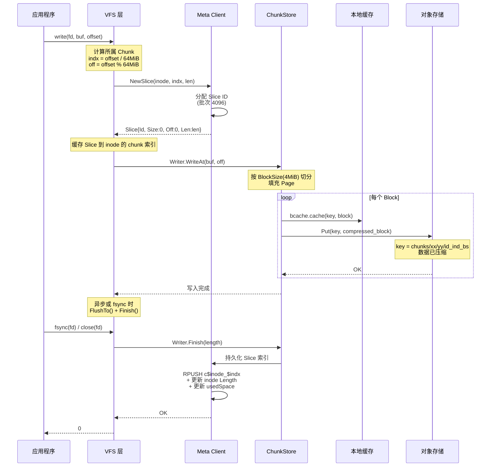
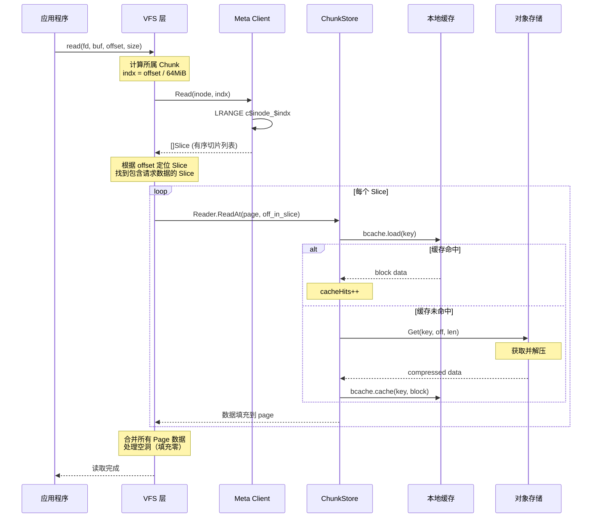
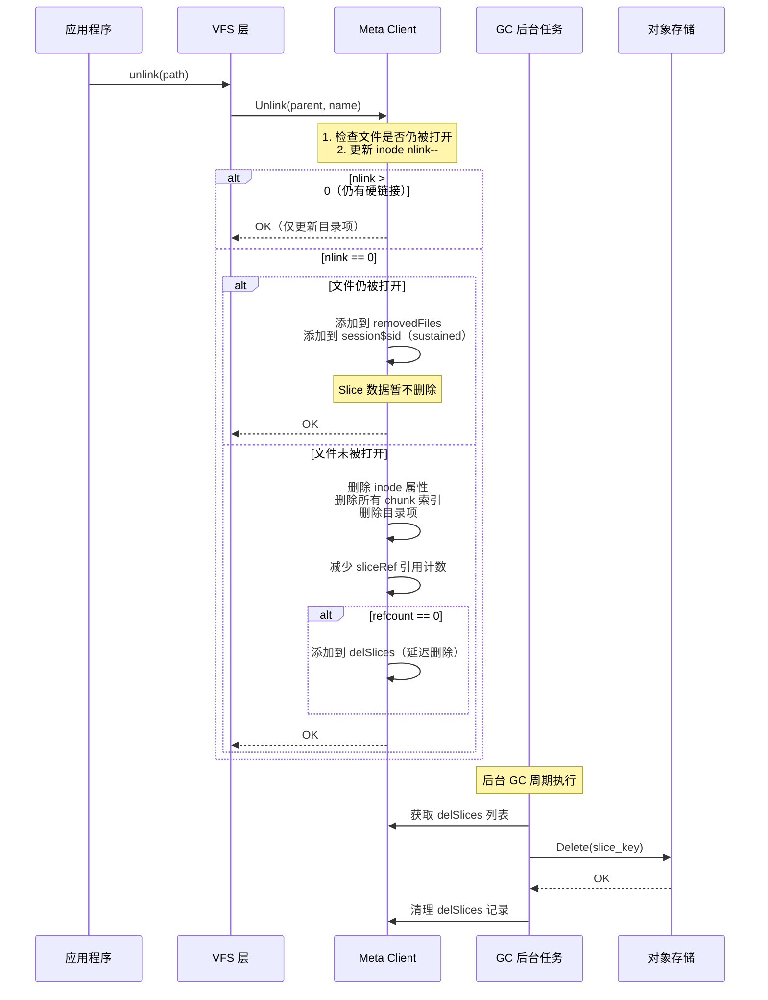
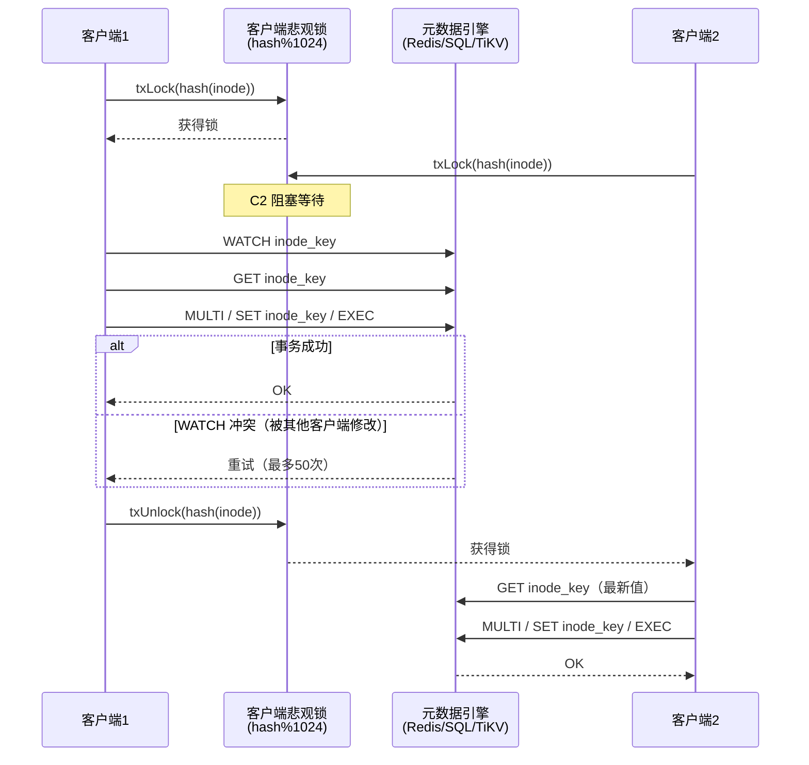

# JuiceFS 存储模型深度分析

---

## 目录

1. [架构总览](#1-架构总览)
2. [核心设计理念：元数据与数据分离](#2-核心设计理念元数据与数据分离)
3. [VFS 层：POSIX 接口适配](#3-vfs-层posix-接口适配)
4. [元数据引擎](#4-元数据引擎)
5. [数据存储引擎](#5-数据存储引擎)
6. [Chunk/Slice 数据模型](#6-chunkslice-数据模型)
7. [文件写入流程](#7-文件写入流程)
8. [文件读取流程](#8-文件读取流程)
9. [缓存架构](#9-缓存架构)
10. [压缩与加密](#10-压缩与加密)
11. [文件删除与垃圾回收](#11-文件删除与垃圾回收)
12. [一致性保证机制](#12-一致性保证机制)
13. [与 Lustre 的对比](#13-与-lustre-的对比)
14. [关键源码索引](#14-关键源码索引)

---

## 1. 架构总览

JuiceFS 是面向云原生环境的高性能 POSIX 文件系统，采用**元数据-数据分离**架构。其核心设计思想是：

- **元数据**存储在独立的数据库引擎中（Redis / SQL / TiKV）
- **数据**存储在对象存储中（S3 / OSS / Ceph 等 30+ 后端）
- **客户端**通过 FUSE 挂载，对上提供 POSIX 接口

```
┌─────────────────────────────────────────────────────────┐
│                     Application                         │
├─────────────────────────────────────────────────────────┤
│                   FUSE (Kernel)                         │
├─────────────────────────────────────────────────────────┤
│                  VFS Layer (pkg/vfs/)                   │
│         文件/目录/锁/xattr 操作 → POSIX 语义            │
├──────────────────┬──────────────────────────────────────┤
│   Meta Client    │        Chunk Store (pkg/chunk/)      │
│  (pkg/meta/)     │   ┌─────────────────────────────┐    │
│  ┌────────────┐  │   │   Page Cache (本地磁盘)      │    │
│  │ baseMeta   │  │   ├─────────────────────────────┤    │
│  │ (缓存/锁)  │  │   │   Compression / Encryption   │    │
│  ├────────────┤  │   ├─────────────────────────────┤    │
│  │ Redis/SQL/ │  │   │   Object Storage Client     │    │
│  │ TiKV 后端  │  │   │   (pkg/object/)             │    │
│  └────────────┘  │   └─────────────────────────────┘    │
├──────────────────┼──────────────────────────────────────┤
│   Redis / MySQL  │     S3 / OSS / Ceph / MinIO / ...   │
│   PostgreSQL /   │                                      │
│   TiKV / SQLite  │                                      │
└──────────────────┴──────────────────────────────────────┘
```

**关键文件位置：**

| 包 | 路径 | 职责 |
|---|---|---|
| `meta` | `pkg/meta/` | 元数据引擎（接口 + Redis/SQL/TiKV 后端） |
| `vfs` | `pkg/vfs/` | VFS 层，POSIX 操作实现 |
| `chunk` | `pkg/chunk/` | Chunk/Slice 数据管理、缓存、压缩 |
| `object` | `pkg/object/` | 对象存储抽象（30+ 后端） |
| `fuse` | `pkg/fuse/` | FUSE 内核通信 |
| `compress` | `pkg/compress/` | 压缩算法（LZ4 / Zstandard） |

---

## 2. 核心设计理念：元数据与数据分离

### 2.1 分离策略

JuiceFS 将文件系统信息分为两类：

| 类型 | 内容 | 存储位置 | 特点 |
|---|---|---|---|
| **元数据** | inode 属性、目录项、chunk 索引、xattr、锁 | Redis / SQL / TiKV | 低延迟、强一致、事务支持 |
| **数据** | 文件实际内容（Slice 对象） | S3 / OSS / Ceph 等 | 高吞吐、低成本、弹性扩展 |

### 2.2 核心常量

```go
// pkg/meta/base.go:48-50
const (
    inodeBatch   = 1 << 10  // Inode 批量分配：1024
    sliceIdBatch = 4 << 10  // Slice ID 批量分配：4096
    nlocks       = 1024     // 悲观锁槽数
)

// pkg/meta/base.go (在 interface.go 中定义)
const ChunkBits = 26
const ChunkSize = 1 << ChunkBits  // 64 MiB

// pkg/chunk/cached_store.go:40-41
const chunkSize = 1 << 26  // 64M（数据层 Chunk 大小）
const pageSize  = 1 << 16  // 64K（Page 大小）
```

### 2.3 Format 结构（卷格式）

```go
// pkg/meta/config.go:77-110
type Format struct {
    Name, UUID           string  // 卷名和 UUID
    Storage, Bucket      string  // 对象存储类型和桶名
    AccessKey, SecretKey string  // 访问凭证
    BlockSize            int     // Chunk 大小（默认 64MiB = 1<<26）
    Compression          string  // 压缩算法：none/lz4/zstd
    Shards               int     // 分片数
    HashPrefix           bool    // 对象键哈希前缀
    Capacity, Inodes     uint64  // 配额
    EncryptKey, EncryptAlgo string // 加密
    TrashDays            int     // 回收站保留天数
    MetaVersion          int     // 元数据格式版本
    DirStats             bool    // 目录统计
    EnableACL            bool    // 启用 ACL
}
```

`Format` 以 JSON 字符串存储在元数据引擎的 `setting` 键/行中。Secret Key 使用 AES-GCM（或国密 SM4-GCM）加密。

---

## 3. VFS 层：POSIX 接口适配

### 3.1 VFS 核心结构

VFS 层（`pkg/vfs/`）是 JuiceFS 的 POSIX 语义实现层，接收 FUSE 请求并转换为元数据和数据操作：

```go
// pkg/vfs/vfs.go:38-46
type Ino = meta.Ino    // inode 类型
type Attr = meta.Attr  // 属性类型

const (
    rootID      = 1              // 根目录 inode
    maxFileSize = meta.ChunkSize << 31  // 最大文件大小 = 64MiB * 2^31
)
```

### 3.2 VFS 操作映射

VFS 将 FUSE 操作映射为元数据操作和数据操作：

| FUSE 操作 | VFS 函数 | 元数据操作 | 数据操作 |
|---|---|---|---|
| `LOOKUP` | `Lookup()` | `Meta.Lookup()` | - |
| `CREATE` | `Create()` | `Meta.Create()` | - |
| `MKDIR` | `Mkdir()` | `Meta.Mkdir()` | - |
| `READ` | `Read()` | `Meta.Read()` → 获取 Slice 列表 | `ChunkStore.ReadAt()` |
| `WRITE` | `Write()` | `Meta.NewSlice()` → 分配 Slice ID | `ChunkStore.WriteAt()` |
| `UNLINK` | `Unlink()` | `Meta.Unlink()` | 延迟删除（引用计数） |
| `RENAME` | `Rename()` | `Meta.Rename()` | - |
| `SETATTR` | `SetAttr()` | `Meta.SetAttr()` | - |
| `GETXATTR` | `GetXattr()` | `Meta.GetXattr()` | - |
| `FLUSH` | `Flush()` | `Meta.Write()` → 持久化 Slice 索引 | `Writer.FlushTo()` + `Writer.Finish()` |

---

## 4. 元数据引擎

### 4.1 分层架构

```
Meta Interface (pkg/meta/interface.go)  ← VFS 调用的公共 API
       │
baseMeta (pkg/meta/base.go)             ← 通用逻辑：缓存、配额、统计、会话管理
       │
engine interface (base.go:74-165)        ← 内部抽象，每个后端必须实现
       │
  ┌────┼────┬────┐
  │    │    │    │
Redis SQL  TiKV  ...
```

### 4.2 核心数据结构

#### Inode 属性

```go
// pkg/meta/base.go:155-179
type Attr struct {
    Flags     uint8   // 不可变、追加、跳过回收站等
    Typ       uint8   // 文件类型：File(1), Directory(2), Symlink(3), ...
    Mode      uint16  // 权限位（12 bits）
    Uid       uint32
    Gid       uint32
    Rdev      uint32  // 设备号
    Atime     int64   // 访问时间（秒）
    Mtime     int64   // 修改时间
    Ctime     int64   // 变更时间
    Atimensec uint32
    Mtimensec uint32
    Ctimensec uint32
    Nlink     uint32  // 硬链接数（目录使用子目录计数）
    Length    uint64  // 文件长度（字节）
    Parent    Ino     // 父 inode（硬链接用，0 = 通过 parentKey 追踪）
    Full      bool    // 所有字段是否已填充
    KeepCache bool
    Tier      uint8   // 存储层级
}
```

#### 目录项

```go
// pkg/meta/base.go:319-324
type Entry struct {
    Inode Ino
    Name  []byte
    Attr  *Attr
}
```

#### Slice（数据切片描述）

```go
// pkg/meta/base.go:327-333
type Slice struct {
    Id   uint64  // 对象存储中的 Slice ID
    Size uint32  // Slice 对象的总大小
    Off  uint32  // 在 Slice 对象内的偏移
    Len  uint32  // 有效数据长度
}
```

Slice 在元数据中以 **24 字节** 二进制格式存储：`pos(4B) + id(8B) + size(4B) + off(4B) + len(4B)`。

### 4.3 Inode 分配机制

```go
// pkg/meta/base.go:1425-1477
func (m *baseMeta) nextInode() (Ino, error) {
    // 1. 检查 freeInodes 批次是否有可用 ID
    // 2. 检查 prefetched 批次
    // 3. 如果都耗尽，调用 allocateInodes()
    // 4. 批次消耗 ~90% 时触发预取（带 jitter 避免惊群）
}

func (m *baseMeta) allocateInodes() (freeID, error) {
    v, err := m.en.incrCounter("nextInode", inodeBatch)  // inodeBatch = 1024
    return freeID{next: uint64(v) - inodeBatch, maxid: uint64(v)}, nil
}
```

- Inode 以 **1024 为批次**分配
- Slice ID 以 **4096 为批次**分配
- 预取带随机 jitter 减少多客户端同时分配的冲突

### 4.4 悲观事务锁

```go
// pkg/meta/base.go:627-663
func (r *baseMeta) txLock(idx uint) {
    r.txlocks[idx%nlocks].Lock()  // nlocks = 1024
}

func (r *baseMeta) txBatchLock(inodes ...Ino) func() {
    // 排序去重后按序加锁，防止死锁
    // 单 inode：一个锁
    // rename（2 个 inode）：按排序加两个锁
}
```

这是**客户端侧悲观锁**机制。在开始数据库事务前，客户端根据 `hash(inode) % 1024` 获取本地互斥锁，串行化同一 inode 上的冲突操作，减少数据库层事务重启次数。

### 4.5 Redis 后端键模式

| 键模式 | Redis 类型 | 描述 |
|---|---|---|
| `i$inode` | String | Inode 属性（序列化 Attr） |
| `d$inode` | Hash | 目录项：`{name → {inode,type}}`（9 字节值） |
| `p$inode` | Hash | 硬链接父追踪：`{parent → count}` |
| `c$inode_$indx` | List | Chunk 切片列表：`[Slice{pos,id,size,off,len}]`（每项 24 字节） |
| `s$inode` | String | 符号链接目标 |
| `x$inode` | Hash | 扩展属性：`{name → value}` |
| `sliceRef` | Hash | Slice 引用计数：`{k$id_$size → refcount}` |
| `delfiles` | Sorted Set | 已删文件：`{inode:length → timestamp}` |
| `setting` | String | JSON 格式配置 |
| `nextInode` / `nextChunk` | String | ID 计数器 |

### 4.6 SQL 后端表结构

| 表 | 主键 | 关键字段 | 描述 |
|---|---|---|---|
| `jfs_setting` | `Name` | `Value varchar(4096)` | 卷格式配置 |
| `jfs_counter` | `Name` | `Value int64` | 计数器 |
| `jfs_node` | `Ino` | Type, Mode, Uid, Gid, Atime, Mtime, Nlink, Length 等 19 列 | Inode 属性 |
| `jfs_edge` | `Id` (auto) | Parent, Name(varbinary), Inode(idx), Type，`UNIQUE(Parent,Name)` | 目录项 |
| `jfs_chunk` | `Id` (auto) | Inode, Indx, `UNIQUE(Inode,Indx)`, Slices(blob) | Chunk 数据 |
| `jfs_sliceRef` | `Id` | Size, Refs(idx) | Slice 引用计数 |
| `jfs_xattr` | `Id` (auto) | Inode, Name, `UNIQUE(Inode,Name)`, Value(blob) | 扩展属性 |
| `jfs_session2` | `Sid` | Expire, Info(blob) | 会话 |
| `jfs_flock` / `jfs_plock` | `Id` (auto) | Inode, Sid, Owner, Records(blob) | 文件锁 |
| `jfs_delfile` | `Ino` | Length, Expire | 已删文件 |
| `jfs_dirStats` | `Ino` | DataLength, UsedSpace, UsedInodes | 目录统计 |

### 4.7 TiKV 后端键编码

TiKV 使用**二进制键编码**，所有 inode 相关键以 `A` 前缀分组：

| 键模式 | 编码 | 描述 |
|---|---|---|
| `A{inode_le}I` | `A` + 8 字节 LE inode + `I` | Inode 属性 |
| `A{inode_le}D{name}` | `A` + 8 字节 LE inode + `D` + name | 目录项 |
| `A{inode_le}C{indx_be}` | `A` + 8 字节 LE inode + `C` + 4 字节 BE indx | Chunk 切片 |
| `A{inode_le}X{name}` | `A` + 8 字节 LE inode + `X` + name | 扩展属性 |
| `K{id_le}{size_le}` | `K` + 8 字节 LE id + 4 字节 LE size | Slice 引用 |
| `C{name}` | `C` + name | 计数器 |

> inode 使用 Little-Endian，chunk index / session ID 使用 Big-Endian。`A` 前缀使同一 inode 的所有元数据在键空间中相邻，支持高效前缀扫描。

### 4.8 事务机制对比

| 方面 | Redis | SQL | TiKV/KV |
|---|---|---|---|
| **隔离级别** | WATCH 乐观并发 | DB 原生 RR / SERIALIZABLE | MVCC 乐观事务 |
| **客户端锁** | `txLock(hash % 1024)` | `txLock(hash % 1024)` | `txLock(hash % 1024)` |
| **最大重试** | 50 次 | 50 次 | 50 次 |
| **退避策略** | `rand % (i+1)²` ms | `i²` ms | `rand % (i+1)²` ms |
| **原子操作** | WATCH + MULTI/EXEC | BEGIN + COMMIT | KVTxn commit |
| **子后端** | redis, rediss, unix | mysql, postgres, sqlite | tikv, etcd, badger, foundationdb, mem |

---

## 5. 数据存储引擎

### 5.1 对象存储抽象

```go
// pkg/object/object.go
type ObjectStorage interface {
    Get(ctx context.Context, key string, off, limit int64) (io.ReadCloser, error)
    Put(ctx context.Context, key string, in io.Reader, opts ...Option) error
    Delete(ctx context.Context, key string, opts ...Option) error
    Head(ctx context.Context, key string) (Object, error)
    List(ctx context.Context, prefix, marker string, limit int64) ([]Object, error)
    // ...
}
```

支持 30+ 对象存储后端：S3、OSS、Ceph、MinIO、Azure Blob、GCS、Swift 等。

### 5.2 ChunkStore 接口

```go
// pkg/chunk/chunk.go:40-50
type ChunkStore interface {
    NewReader(id uint64, length int) Reader
    NewWriter(id uint64, tierID uint8) Writer
    Remove(id uint64, length int) error
    FillCache(id uint64, length uint32) error
    EvictCache(id uint64, length uint32) error
    CheckCache(id uint64, length uint32, handler func(bool, string, int)) error
    UsedMemory() int64
    UpdateLimit(upload, download int64)
    BlobStorage() object.ObjectStorage
}
```

### 5.3 对象键命名规则

Slice 在对象存储中的键由 `rSlice.key()` 生成（[cached_store.go:74-79](pkg/chunk/cached_store.go#L74-L79)）：

```go
// 无哈希前缀：
"chunks/{id/1000/1000}/{id/1000}/{id}_{blockIdx}_{blockSize}"

// 有哈希前缀（HashPrefix=true）：
"chunks/{id%256:02X}/{id/1000/1000}/{id}_{blockIdx}_{blockSize}"
```

**示例**：Slice ID=12345678, BlockSize=4MiB, blockIdx=3
- 无前缀：`chunks/12/12345/12345678_3_4194304`
- 有前缀：`chunks/0E/12/12345678_3_4194304`

一个 Slice 可能被切分为多个 Block（默认 BlockSize=4MiB），每个 Block 对应对象存储中的一个独立对象。

---

## 6. Chunk/Slice 数据模型

### 6.1 文件 → Chunk → Slice 映射

```
文件（逻辑视图）:
┌─────────────────────────────────────────────────────────────┐
│                      File (inode)                           │
│                     Length = N bytes                        │
├────────────┬────────────┬────────────┬──────────┬───────────┤
│  Chunk 0   │  Chunk 1   │  Chunk 2   │  Chunk 3 │    ...    │
│  0~64MiB   │ 64~128MiB  │ 128~192MiB │ 192~256M │           │
└────────────┴────────────┴────────────┴──────────┴───────────┘
     indx=0       indx=1       indx=2       indx=3

Chunk 内部（Slice 链）:
┌──────────────────────────────────────────────────┐
│                  Chunk (64 MiB)                   │
├──────┬─────────┬───────┬─────────┬───────┬───────┤
│Slice0│  Hole   │Slice1 │Slice2   │ Hole  │Slice3 │
│0~1MiB│1~3MiB   │3~7MiB │7~12MiB  │12~15M │15~20M │
└──────┴─────────┴───────┴─────────┴───────┴───────┘

Slice 对象在对象存储中:
┌──────────────────────────────────────┐
│     Slice Object (id=12345)          │
│  ┌──────┬──────────────────────┐     │
│  │ Off  │     Data              │     │
│  │ 0    │ [7MiB 有效数据]       │     │
│  │ 7MiB │ [5MiB 有效数据]       │     │
│  └──────┴──────────────────────┘     │
│  Size = 12MiB (对象总大小)            │
└──────────────────────────────────────┘
  引用: Slice{Id:12345, Size:12MiB, Off:0, Len:12MiB}
```

### 6.2 Slice 的含义

每个 `Slice` 结构体描述了文件中的一个数据段：

| 字段 | 含义 | 示例 |
|---|---|---|
| `Id` | 对象存储中的对象 ID | `12345` |
| `Size` | 对象的总大小 | `12582912`（12MiB） |
| `Off` | 在对象内的读取偏移 | `0` |
| `Len` | 有效数据长度 | `12582912` |
| `pos`（内部） | 在 Chunk 内的偏移 | `0` |

### 6.3 Slice 重叠管理

Slice 以**二叉搜索树**管理重叠（[meta/slice.go:21-29](pkg/meta/slice.go#L21-L29)）：

```go
// pkg/meta/slice.go:21-29
type slice struct {
    id    uint64
    size  uint32
    off   uint32
    len   uint32
    pos   uint32   // 在 chunk 内的位置
    left  *slice   // 左子树（较早的 slice）
    right *slice   // 右子树（较晚的 slice）
}
```

当新的写入覆盖已有 Slice 时：
- 旧 Slice 被"切分"（`cut()` 方法），仅保留未覆盖部分
- 新 Slice 插入到 BST 中
- `buildSlice()` 遍历 BST 生成有序的 `[]Slice`，空洞自动填充为零 Slice

### 6.4 Chunk 压缩（Compaction）

`compactChunk()` 函数合并同一 Chunk 内相邻且不重叠的 Slice，去除首尾空洞。这减少了元数据中的 Slice 数量，提升读取效率。

---

## 7. 文件写入流程

### 7.1 写入时序图



### 7.2 写入关键步骤

1. **Slice ID 分配**：客户端从 Meta 引擎获取一个全局唯一的 Slice ID
2. **数据写入**：按 BlockSize（默认 4MiB）切分为 Block，写入 Page Cache
3. **异步上传**：每个 Block 压缩后上传到对象存储
4. **元数据更新**：`fsync` 或 `close` 时，Slice 索引持久化到 Meta 引擎

### 7.3 wSlice 写入结构

```go
// pkg/chunk/cached_store.go:238-257
type wSlice struct {
    rSlice
    pages       [][]*Page    // 按 Block 索引组织的 Page 数组
    uploaded    int          // 已上传的字节数
    errors      chan error   // 上传错误通道
    uploadError error
    pendings    int          // 待上传 Block 数
    writeback   bool         // 写回模式
    tierID      uint8        // 存储层级
}
```

- `pages` 数组大小 = `chunkSize / blockSize` = 64MiB / 4MiB = 16 个槽位
- 每个 Block 可以有多个 Page（按 pageSize=64KiB 切分）
- 上传采用后台 goroutine 异步执行

### 7.4 VFS 写管道调用链

```
vfs.VFS.Write()              [pkg/vfs/vfs.go]
  → handle.writer.Write()    [pkg/vfs/writer.go:297]  按 64MiB Chunk 边界拆分
  → fileWriter.writeChunk()  [pkg/vfs/writer.go:260]  查找/创建 chunkWriter
  → chunkWriter.findWritableSlice()  [writer.go:160]  查找/创建 sliceWriter
  → sliceWriter.write()      [writer.go:127]           写入数据到 Chunk.Writer
  → sliceWriter.flushData()  [writer.go:106]           上传 Slice 到对象存储
  → chunkWriter.commitThread() [writer.go:182]         调用 meta.Write() 持久化索引
```

### 7.5 VFS 读管道调用链

```
vfs.VFS.Read()                [pkg/vfs/vfs.go]
  → handle.reader.Read()      [pkg/vfs/reader.go:626]  检查读缓冲区
  → fileReader.prepareRequests() [reader.go:561]       创建 sliceReader goroutine
  → sliceReader.run()          [reader.go:162]          调用 meta.Read() 获取 []Slice
  → dataReader.Read()          [reader.go:840]          并行读取各 Slice
  → dataReader.readSlice()     [reader.go:813]          从 ChunkStore 读取
  → cachedStore.rSlice.ReadAt() [cached_store.go:97]   本地缓存 → 对象存储
```

---

## 8. 文件读取流程

### 8.1 读取时序图



### 8.2 读取关键步骤

1. **获取 Slice 列表**：从 Meta 引擎读取 Chunk 的所有 Slice
2. **定位目标 Slice**：根据读取偏移找到包含数据的 Slice
3. **读取 Block**：每个 Slice 可能跨多个 Block
4. **缓存优先**：先查本地磁盘缓存，未命中再从对象存储读取
5. **空洞处理**：未覆盖的区域自动填充零

### 8.3 Seekable 读取优化

```go
// pkg/chunk/cached_store.go:154-159
if s.store.seekable &&
    (!s.store.conf.CacheEnabled() || (boff > 0 && len(p) <= blockSize/4)) {
    n, err = s.store.loadRange(ctx, key, page, boff)
    // 使用 HTTP Range 请求只读取需要的部分
}
```

当读取范围小于 Block 的 1/4 时，使用 HTTP Range 请求避免下载整个 Block。

---

## 9. 缓存架构

### 9.1 多级缓存

```
读取路径：
┌──────────────┐
│ Page Cache   │ ← 内存中，Page 对象复用池（pagePool, 128 个）
│ (内存)       │
└──────┬───────┘
       │ miss
┌──────▼───────┐
│ Block Cache  │ ← 本地磁盘缓存（可配置大小）
│ (磁盘)       │    读取时自动缓存
└──────┬───────┘
       │ miss
┌──────▼───────┐
│ Object Store │ ← 对象存储
│ (远程)       │    支持 Range GET
└──────────────┘

写入路径：
┌──────────────┐
│ Page Cache   │ ← WriteAt 填充 Page
│ (内存)       │
└──────┬───────┘
       │ 异步上传
┌──────▼───────┐
│ Block Cache  │ ← 同步写入（writeback 模式）
│ (磁盘)       │
└──────┬───────┘
       │ 异步上传
┌──────▼───────┐
│ Object Store │ ← Put 压缩后的数据
│ (远程)       │
└──────────────┘
```

### 9.2 缓存配置

| 参数 | 说明 | 默认值 |
|---|---|---|
| `--cache-size` | 本地缓存大小 | 0（禁用） |
| `--cache-dir` | 缓存目录 | `$HOME/.juicefs/cache` |
| `--free-space-ratio` | 缓存保留空间比例 | 0.1 |
| `--writeback` | 写回模式（异步上传） | 关 |
| `--cache-large-write` | 大写入也缓存 | 关 |
| `--os-cache` | 使用 OS 页缓存 | 开 |

### 9.3 Page 池

```go
// pkg/chunk/cached_store.go:211-234
var pagePool = make(chan *Page, 128)  // Page 对象复用池

func allocPage(sz int) *Page {
    if sz != pageSize {
        return NewOffPage(sz)
    }
    select {
    case p := <-pagePool:
        return p  // 复用 64KiB Page
    default:
        return NewOffPage(pageSize)
    }
}
```

---

## 10. 压缩与加密

### 10.1 压缩流程

```go
// pkg/chunk/cached_store.go:356-377
func (store *cachedStore) upload(ctx context.Context, key string, block *Page, s *wSlice) error {
    // 1. 分配压缩缓冲区
    bufSize := store.compressor.CompressBound(blen)

    // 2. 同步写入时缓存到本地磁盘
    if sync && (blen < store.conf.BlockSize || store.conf.CacheLargeWrite) {
        store.bcache.cache(key, block, false, false)
    }

    // 3. 压缩
    n, err := store.compressor.Compress(buf.Data, block.Data)
    buf.Data = buf.Data[:n]

    // 4. 上传压缩后的数据
    err = store.storage.Put(ctx, key, bytes.NewReader(buf.Data), ...)
}
```

支持的压缩算法（`pkg/compress/`）：
- **LZ4**：高压缩速度，中等压缩比
- **Zstandard (zstd)**：高压缩比，中等速度

压缩在 Block 级别进行（默认 4MiB），不是整个 Slice。

### 10.2 加密

JuiceFS 支持 AES-GCM（或 SM4-GCM）加密，在压缩之后、上传之前进行加密。密钥存储在 `Format` 的 `EncryptKey` 字段中。

---

## 11. 文件删除与垃圾回收

### 11.1 删除时序图



### 11.2 Slice 引用计数

```go
// Redis: sliceRef Hash
// key = "k{sliceId}_{size}", value = refcount

// 当文件删除时：
// 1. 遍历所有 chunk 的所有 slice
// 2. DECR sliceRef 中对应 key 的 refcount
// 3. 如果 refcount == 0，加入 delSlices Sorted Set
```

### 11.3 垃圾回收

JuiceFS 的 GC 命令（`juicefs gc`）负责清理：
1. **孤儿 Slice**：对象存储中存在但 `sliceRef` 中无记录的 Slice
2. **过期删除**：`delSlices` 中超过延迟时间的 Slice
3. **回收站清理**：`TrashDays` 天前的已删文件

---

## 12. 一致性保证机制

### 12.1 元数据一致性



### 12.2 多层一致性保障

| 层级 | 机制 | 说明 |
|---|---|---|
| **客户端悲观锁** | `txLock(hash % 1024)` | 1024 个本地互斥锁，减少跨客户端事务冲突 |
| **Redis WATCH** | 乐观并发控制 | WATCH 到 EXEC 期间若键被修改则事务失败重试 |
| **SQL 事务** | RR / SERIALIZABLE | PostgreSQL Repeatable Read / MySQL InnoDB 行锁 |
| **TiKV MVCC** | 乐观事务 + TSO | PD 提供全局时间戳，事务间无锁并发 |
| **重试机制** | 最多 50 次 + 二次退避 | `rand % (i+1)²` 毫秒，避免活锁 |
| **Slice 引用计数** | `sliceRef` Hash/表 | 删除时原子递减，refcount=0 才真正删除数据 |
| **fsync 语义** | Finish() 持久化 | Slice 索引在 fsync/close 时写入元数据引擎 |
| **会话心跳** | `doRefreshSession()` | 定期心跳检测，过期会话的锁和 sustained inode 被清理 |

### 12.3 会话管理

```go
// 会话心跳
type session struct {
    Sid       uint64
    Info      []byte    // 客户端信息 JSON
    Expire    int64     // 过期时间戳
}

// allSessions (Redis): Sorted Set {sid → expire_timestamp}
// 定期刷新过期时间，超过心跳间隔未刷新的会话被视为失效
// 失效会话的 sustained inodes 被释放，对应文件数据可被 GC
```

---

## 13. 与 Lustre 的对比

| 维度 | JuiceFS | Lustre |
|---|---|---|
| **架构** | 元数据-数据分离（云原生） | MDT（元数据）+ OST（数据）分离 |
| **元数据存储** | Redis / SQL / TiKV | MDT (ldiskfs/ext4) |
| **数据存储** | 对象存储 (S3/OSS/Ceph) | OST (ldiskfs/ext4) |
| **访问协议** | FUSE | FUSE + 原生 LDLM/PTLRPC |
| **Chunk 大小** | 64 MiB（可配置） | 条带宽度（默认 1MiB，最大 1GiB） |
| **数据分片** | Slice + Block（4MiB） | Stripe（RAID0 跨 OST 并行） |
| **并发模型** | 客户端缓存 + 对象存储 | 分布式锁 LDLM + 多 OST 并行 |
| **锁机制** | 客户端悲观锁 + 数据库事务 | LDLM（EXTENT/IBITS/INODE） |
| **压缩** | Block 级（LZ4/Zstd） | 无内置压缩 |
| **加密** | AES-GCM / SM4-GCM | 无内置加密 |
| **纠删码** | 无内置（依赖对象存储） | EC + FLR 镜像 |
| **部署** | 轻量级（单进程 + 云服务） | 重量级（MDS+OSS+LNET 集群） |
| **POSIX 完整度** | 完整（FUSE） | 完整（原生内核模块） |
| **适用场景** | 云环境、共享存储、AI/ML | HPC、超算、大文件 IO |

---

## 14. 关键源码索引

| 模块 | 文件 | 关键内容 |
|---|---|---|
| **VFS 层** | `pkg/vfs/vfs.go` | VFS 核心结构、FUSE 选项 |
| **VFS 文件操作** | `pkg/vfs/file.go` | Open、Read、Write、Truncate |
| **VFS 目录操作** | `pkg/vfs/dir.go` | Create、Mkdir、Unlink、Rename、Readdir |
| **元数据接口** | `pkg/meta/interface.go:386-556` | Meta 接口定义 |
| **元数据基础** | `pkg/meta/base.go:74-165` | engine 接口 |
| **元数据基础** | `pkg/meta/base.go:267-352` | baseMeta 结构 |
| **Inode 属性** | `pkg/meta/base.go:155-179` | Attr 结构 |
| **Slice 结构** | `pkg/meta/base.go:327-333` | Slice 结构 |
| **Slice 管理** | `pkg/meta/slice.go:21-155` | BST、buildSlice、compactChunk |
| **Inode 分配** | `pkg/meta/base.go:1425-1477` | 批量分配 + 预取 |
| **悲观锁** | `pkg/meta/base.go:627-663` | txLock、txBatchLock |
| **Redis 后端** | `pkg/meta/redis.go` | 键模式、WATCH 事务 |
| **Redis 键定义** | `pkg/meta/redis.go:57-88` | 完整键模式文档 |
| **Redis 事务** | `pkg/meta/redis.go:1123-1173` | txn() 实现 |
| **SQL 后端** | `pkg/meta/sql.go` | 表结构、xorm 事务 |
| **SQL 表定义** | `pkg/meta/sql.go:55-236` | 20+ 表结构 |
| **TiKV 后端** | `pkg/meta/tkv.go` | 二进制键编码、KV 事务 |
| **TiKV 键定义** | `pkg/meta/tkv.go:168-200` | 完整键模式 |
| **TiKV 子后端** | `pkg/meta/tkv_tikv.go`, `tkv_etcd.go`, `tkv_badger.go`, `tkv_fdb.go` | TiKV/etcd/Badger/FoundationDB |
| **Chunk 接口** | `pkg/chunk/chunk.go:26-50` | Reader、Writer、ChunkStore |
| **缓存存储** | `pkg/chunk/cached_store.go` | rSlice、wSlice、缓存逻辑 |
| **Slice 键生成** | `pkg/chunk/cached_store.go:74-79` | 对象键命名规则 |
| **读取逻辑** | `pkg/chunk/cached_store.go:97-180` | 多级缓存读取 |
| **写入逻辑** | `pkg/chunk/cached_store.go:238-310` | Page 切分与写入 |
| **上传逻辑** | `pkg/chunk/cached_store.go:356-399` | 压缩 + 上传 |
| **对象存储接口** | `pkg/object/object.go` | ObjectStorage 接口 |
| **压缩** | `pkg/compress/` | LZ4、Zstandard 实现 |
| **配置** | `pkg/meta/config.go:38-110` | Config、Format 结构 |
