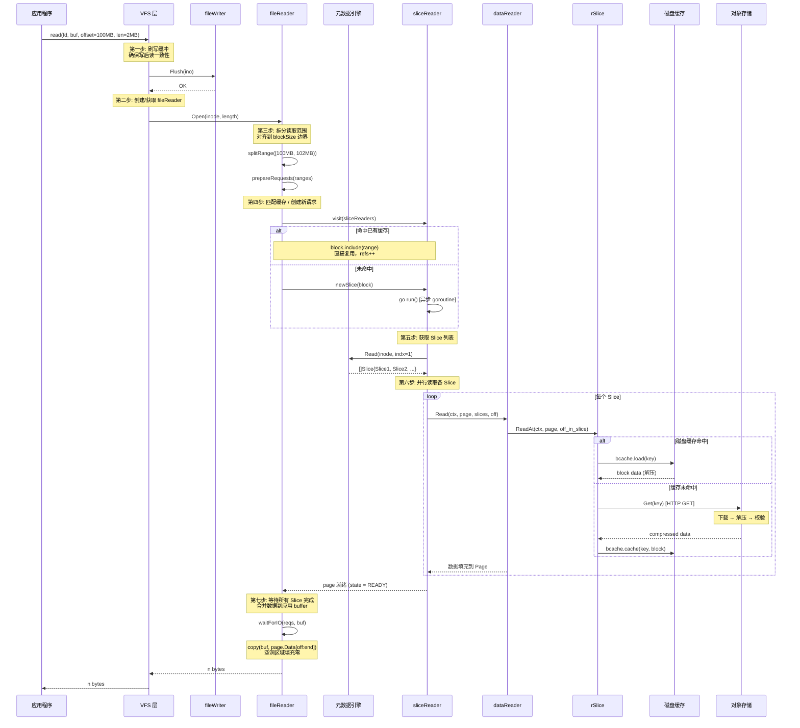

# JuiceFS 文件读取机制详解

---

## 目录

1. [读取全流程总览](#1-读取全流程总览)
2. [读取时序图](#2-读取时序图)
3. [读取管道四层架构](#3-读取管道四层架构)
4. [fileReader：文件级读取管理](#4-filereader文件级读取管理)
5. [sliceReader：块级读取缓存](#5-slicereader块级读取缓存)
6. [dataReader：Slice 并行读取](#6-datareaderslice-并行读取)
7. [rSlice：对象存储读取](#7-rslice对象存储读取)
8. [三级缓存架构](#8-三级缓存架构)
9. [预读（Readahead）机制](#9-预读readahead机制)
10. [空洞读取处理](#10-空洞读取处理)
11. [读取失败重试](#11-读取失败重试)
12. [与 Lustre 读取模型的对比](#12-与-lustre-读取模型的对比)
13. [关键源码索引](#13-关键源码索引)

---

## 1. 读取全流程总览

```
应用程序: read(fd, buf, offset=100MB, len=2MB)

第一步: 刷写缓冲
  VFS.Read() 先调用 writer.Flush(ino)
  确保该文件所有缓冲写入已提交到 ChunkStore

第二步: 定位 Chunk
  indx = 100MB / 64MB = 1        ← 第 1 个 Chunk
  off  = 100MB % 64MB = 36MB    ← Chunk 内偏移

第三步: 获取 Slice 列表
  meta.Read(inode, indx=1) → []Slice
  从元数据引擎读取 Chunk 的所有 Slice（24 字节/个，有序列表）

第四步: 匹配已有缓存 / 发起新读取
  遍历 fileReader 的 sliceReader 链表
  ├── 命中缓存 → 直接从内存 Page 返回
  └── 未命中 → 创建新 sliceReader，异步读取

第五步: 并行读取各 Slice
  每个 Slice 启动独立 goroutine
  → rSlice.ReadAt() → 磁盘缓存 → 对象存储
  → 解压 + 校验 → 填充 Page

第六步: 合并返回
  等待所有 Slice 读取完成
  按 offset 顺序将数据拷贝到应用 buffer
  空洞区域填充零
```

---

## 2. 读取时序图



---

## 3. 读取管道四层架构

```
┌──────────────────────────────────────────────────────────────┐
│                   VFS.Read() 入口                           │
│         校验 offset/size → Flush → Open fileReader           │
├──────────────────────────────────────────────────────────────┤
│                   fileReader (pkg/vfs/reader.go)             │
│   管理一个文件的所有 sliceReader，协调缓存命中/未命中       │
│   ├── splitRange()      按 blockSize 对齐拆分读取范围        │
│   ├── prepareRequests()  匹配缓存或创建新请求              │
│   ├── checkReadahead()  检测顺序读取模式，触发预读          │
│   ├── waitForIO()        等待所有 sliceReader 完成          │
│   └── cleanupRequests() 清理不再需要的 sliceReader          │
├──────────────────────────────────────────────────────────────┤
│                   sliceReader (pkg/vfs/reader.go:93-107)       │
│   管理一个 block 范围的读取状态（状态机驱动）                │
│   ├── NEW → BUSY → READY  正常读取路径                    │
│   ├── run()              调用 meta.Read + dataReader.Read    │
│   ├── invalidate()        写入后缓存失效                     │
│   └── done()             完成后广播通知等待者               │
├──────────────────────────────────────────────────────────────┤
│                   dataReader (pkg/vfs/reader.go)             │
│   并行读取一个 Chunk 内的多个 Slice                         │
│   ├── Read()             <=16 Slice: 全并行 goroutine       │
│   ├── readManySlices()   >16 Slice: 16 并发限制            │
│   └── readSlice()        单 Slice → ChunkStore.ReadAt      │
├──────────────────────────────────────────────────────────────┤
│                   rSlice + cachedStore (pkg/chunk/)          │
│   从存储后端读取 Block 数据                                │
│   ├── 磁盘缓存 (bcache)  首选，命中则跳过网络 I/O         │
│   ├── 内存 Page 池        singleflight 去重并发请求         │
│   └── 对象存储 (storage)  GET 请求，支持 Range            │
└──────────────────────────────────────────────────────────────┘
```

---

## 4. fileReader：文件级读取管理

### 4.1 核心结构

```go
// pkg/vfs/reader.go:284-301
type fileReader struct {
    inode    Ino
    length   uint64         // 文件长度
    err      syscall.Errno  // 粘性错误（与写入相同的 fail-fast 策略）
    tried    uint32         // 重试次数
    sessions [readSessions]session  // 预读会话追踪（2 个）
    slices   *sliceReader  // sliceReader 双向链表（按 block 排序）
    last     **sliceReader // 链表尾部（最近使用的）
}
```

### 4.2 Read() 主流程

`fileReader.Read()` （[reader.go:626-673](pkg/vfs/reader.go#L626-L673)）：

```go
func (f *fileReader) Read(ctx, offset, buf) (int, errno) {
    // 1. 背压检查：缓冲区使用超限时减速
    if f.r.readBufferUsed() > f.r.bufferSize {
        time.Sleep(10ms)  // 减速
    }

    // 2. 边界检查
    if offset >= f.length || size == 0 {
        return 0, 0
    }

    // 3. 触发尾部 32KB 块的预读
    f.readAhead(&lastblock)

    // 4. 按 blockSize 对齐拆分读取范围
    ranges := f.splitRange(block)

    // 5. 匹配已有 sliceReader 或创建新的
    reqs := f.prepareRequests(ranges)

    // 6. 检测是否为顺序读取，触发预读
    f.checkReadahead(block)

    // 7. 等待所有数据就绪，合并返回
    return f.waitForIO(ctx, reqs, buf)
}
```

### 4.3 范围拆分

```go
// splitRange() 将读取范围对齐到 blockSize (4MiB) 边界
// 例如: 读取 [100MB, 102MB)
//   → [100MB, 104MB) [104MB, 108MB)
```

拆分的原因是 sliceReader 以 block 为粒度缓存数据，对齐后可以更高效地复用缓存。

### 4.4 缓存匹配

`prepareRequests()` （[reader.go:561-586](pkg/vfs/reader.go#L561-L586)）：

```go
func (f *fileReader) prepareRequests(ranges []uint64) []*req {
    for each range {
        // 遍历已有 sliceReader 链表
        f.visit(func(s *sliceReader) bool {
            if s.state.valid() && s.block.include(&range) {
                // 完全包含 → 直接复用，不发起网络请求
                return false
            }
            return true
        })
        if !found {
            // 未命中 → 创建新 sliceReader，异步读取
            s := f.newSlice(&range)
            go s.run()
        }
    }
}
```

---

## 5. sliceReader：块级读取缓存

### 5.1 状态机

```
         run()
NEW ─────────→ BUSY ─────────→ READY
  ↑              │               │
  │         (invalidate)    (invalidate)
  │              ↓               ↓
  └──── REFRESH ←────       NEW (refs > 0)
  │                              │
  │                         INVALID (refs == 0)
  │                              │
  ↓                              ↓
BREAK ←──────────────────── 删除
```

| 状态 | 含义 |
|---|---|
| **NEW** | 已创建，尚未开始读取 |
| **BUSY** | 正在从 meta/ChunkStore 读取数据 |
| **REFRESH** | 读取过程中被失效，需要重新读取 |
| **READY** | 数据已就绪，可直接返回 |
| **INVALID** | 标记为删除，等待 refs 归零后清理 |
| **BREAK** | 读取被中断 |

### 5.2 run() — 异步读取核心

```go
// pkg/vfs/reader.go:162-232
func (s *sliceReader) run() {
    s.state = BUSY

    // 1. 从元数据引擎获取 Slice 列表
    err := f.r.m.Read(meta.Background(), inode, indx, &slices)
    if err == ENOENT {
        s.done(ENOENT, 0)  // 文件不存在
        return
    }

    // 2. 分配 Page 缓冲区
    p := s.page.Slice(0, int(need))

    // 3. 调用 dataReader 并行读取所有 Slice
    n = f.r.Read(ctx, p, slices, offset)

    // 4. 处理结果
    if n == int(need) {
        s.state = READY          // 成功
        s.file.tried = 0           // 重置重试计数
    } else {
        s.currentPos = 0           // 失败，从头开始
        f.r.m.InvalidateChunkCache(inode, indx)  // 失效元数据缓存
        s.done(EIO, retry_time(f.tried))  // 延迟重试
    }
}
```

### 5.3 invalidate() — 缓存失效

```go
// pkg/vfs/reader.go:234-249
func (s *sliceReader) invalidate() {
    switch s.state {
    case BUSY:
        s.state = REFRESH    // 丢弃当前结果，重新读取
    case READY:
        if s.refs > 0 {
            s.state = NEW     // 重新发起读取
            go s.run()
        } else {
            s.state = INVALID // 无人使用，直接删除
        }
    }
}
```

写入后，VFS 调用 `v.reader.Invalidate(ino, off, size)`，遍历所有重叠的 sliceReader 并失效。

---

## 6. dataReader：Slice 并行读取

### 6.1 Read() — 并行读取逻辑

```go
// pkg/vfs/reader.go:840-879
func (r *dataReader) Read(ctx, page, slices, offset) int {
    for i := 0; i < len(slices); i++ {
        if read < size && offset < pos+slices[i].Len {
            toread := min(size-read, int(pos+slices[i].Len-offset))
            // 每个 Slice 启动独立 goroutine 并行读取
            go func(s *meta.Slice, p *chunk.Page, off, pos uint32) {
                errs <- r.readSlice(ctx, s, p, int(off))
            }(&slices[i], page.Slice(read, toread), offset-pos, pos)
            waits++
        }
        pos += slices[i].Len
    }

    // 空洞区域填充零
    for read < size {
        buf[read] = 0
        read++
    }

    // 等待所有 goroutine 完成
    for waits > 0 {
        if e := <-errs; e != nil {
            err = e
        }
        waits--
    }
}
```

### 6.2 并发控制

```go
// pkg/vfs/reader.go:881-935
func (r *dataReader) readManySlices(ctx, page, slices, offset) int {
    concurrency := make(chan byte, 16)  // 最多 16 个并发
    for i := 0; i < len(slices); i++ {
        select {
        case concurrency <- 1:  // 获取并发槽位
            go readSlice(...)
            <-concurrency     // 完成后释放槽位
        case e := <-errs:      // 某个读取失败
            err = e
        }
    }
}
```

| Slice 数量 | 并发策略 |
|---|---|
| <= 16 | 全部并行（每个 Slice 一个 goroutine） |
| \> 16 | 最多 16 并发（`concurrency` channel 限流） |

---

## 7. rSlice：对象存储读取

### 7.1 三级读取路径

```go
// pkg/chunk/cached_store.go:97-180
func (s *rSlice) ReadAt(ctx, page, off) (n, err) {
    key := s.key(indx)  // 对象键

    // 1. 检查磁盘缓存
    if s.store.conf.CacheEnabled() {
        r, err := s.store.bcache.load(key)
        if err == nil {
            return r.ReadAt(p, boff)  // 缓存命中！
        }
    }

    // 2. 尝试 Range GET（小范围随机读取优化）
    if s.store.seekable && boff > 0 && len(p) <= blockSize/4 {
        n, err = s.store.loadRange(ctx, key, page, boff)
        if err == nil { return n, err }
    }

    // 3. 完整 Block 读取（singleflight 去重）
    block, err := s.store.group.Execute(key, func() (*Page, error) {
        tmp = NewOffPage(blockSize)
        err = s.store.load(ctx, key, tmp, true, false)
        return tmp, err
    })

    // 4. 下载后写入磁盘缓存
    copy(p, block.Data[boff:])
    return len(p), nil
}
```

### 7.2 对象键格式

```go
// pkg/chunk/cached_store.go:74-79
// 无哈希前缀:
"chunks/{sliceId/1000/1000}/{sliceId/1000}/{sliceId}_{blockIdx}_{blockSize}"

// 有哈希前缀:
"chunks/{sliceId%256:02X}/{sliceId/1000/1000}/{sliceId}_{blockIdx}_{blockSize}"
```

### 7.3 Range GET 优化

当读取范围小于 Block 的 1/4 时，使用 HTTP Range 请求避免下载整个 Block：

```go
// pkg/chunk/cached_store.go:154-159
if boff > 0 && len(p) <= blockSize/4 {
    n, err = s.store.loadRange(ctx, key, page, boff)
    // 仅下载 [off, off+len) 范围，不下载完整 Block
}
```

### 7.4 singleflight 去重

多个并发读取同一 Block 时，只有一个实际执行，其余等待结果：

```go
// pkg/chunk/cached_store.go:162
block, err := s.store.group.Execute(key, func() (*Page, error) {
    // 只有一个 goroutine 执行此函数
    err = s.store.load(ctx, key, tmp, ...)
    return tmp, err
})
```

---

## 8. 三级缓存架构

```
读取请求
    │
    ▼
┌──────────────────────────────────────────────────────┐
│ L1: 内存 Page 缓存（sliceReader 链表）               │
│                                                      │
│ 命中条件: sliceReader.state == READY                 │
│          && block.include(request_range)             │
│ 大小限制: bufferSize / readAheadTotal (80%)          │
│ 生命周期: 空闲后被 cleanupRequests() 删除           │
│ 失效时机: 写入后 invalidate() / 文件关闭             │
├──────────────────────────────────────────────────────┤
│ L2: 磁盘 Block 缓存 (bcache / raw/)                 │
│                                                      │
│ 命中条件: bcache.load(key) 成功                      │
│ 淘汰策略: none / 2-random (默认) / LRU               │
│ 校验机制: CRC32C per 32KiB (none/full/shrink/extend)  │
│ 大小限制: cache-size (用户配置)                       │
│ 写入模式: write-to-tmp + rename (原子性)             │
├──────────────────────────────────────────────────────┤
│ L3: 对象存储 (S3 / OSS / Ceph / ...)                │
│                                                      │
│ 访问方式: HTTP GET + Range GET                        │
│ 压缩格式: LZ4 / Zstandard                           │
│ 校验方式: CRC32C (checksum.go)                        │
│ 并发控制: MaxDownload (限速)                           │
│ 去重机制: singleflight (group.Execute)                 │
└──────────────────────────────────────────────────────┘
```

### 8.1 缓存未命中路径

```
miss → 检查 seekable → 小范围? → Range GET
                             → 大范围? → 完整 Block GET
                                        ↓
                              压缩解压 + CRC32C 校验
                                        ↓
                              写入磁盘缓存 (异步)
                                        ↓
                              返回数据给应用
```

---

## 9. 预读（Readahead）机制

### 9.1 会话检测

```go
// pkg/vfs/reader.go:277-282, 372-417
type session struct {
    lastOffset uint64   // 上次读取的偏移
    total      uint64   // 顺序读取的累计字节数
    readahead  uint64   // 当前预读窗口大小
    atime      time.Time // 最后访问时间
}
```

`fileReader` 维护 2 个读取会话（`readSessions = 2`），检测当前读取是否属于某个顺序会话：

```go
func (f *fileReader) guessSession(offset uint64) *session {
    for _, s := range f.sessions {
        // 在 (lastOffset, lastOffset+readahead+blockSize) 范围内
        if offset >= s.lastOffset &&
           offset <= s.lastOffset+s.readahead+f.r.blockSize {
            return &s
        }
    }
    return nil  // 随机读取
}
```

### 9.2 自适应窗口

```go
// pkg/vfs/reader.go:419-440
func (f *fileReader) checkReadahead(block *frange) {
    s := f.guessSession(block.off)
    if s != nil {
        s.total += block.len
        // 累计字节数超过当前窗口 → 窗口加倍
        if s.total > s.readahead {
            s.readahead *= 2
        }
    }
    // 累计字节数低于窗口的 1/4 → 窗口减半
    if s.total < s.readahead/4 {
        s.readahead /= 2
    }
}
```

```
预读窗口变化:
  初始: 4MiB (blockSize)
  顺序读取 4MiB+ → 8MiB
  顺序读取 8MiB+ → 16MiB
  顺序读取 16MiB+ → 32MiB
  ...
  最大: readAheadTotal / 2 (总缓冲的 80%)

  非顺序读取 → 窗口减半 → 最终重置为 blockSize
```

### 9.3 预读触发

```go
// pkg/vfs/reader.go:529-553
func (f *fileReader) readAhead(lastblock *frange) {
    s := f.guessSession(lastblock.off)
    if s == nil {
        return  // 非顺序读取，不预读
    }
    // 提交预读请求：从当前块末尾开始，读取 readahead 窗口的数据
    f.prepareRequests(future_ranges)
}
```

### 9.4 预读限制

| 条件 | 行为 |
|---|---|
| 缓冲区使用 > 80% readAheadTotal | 暂停预读 |
| 系统内存不足 | 暂停预读 |
| 非顺序读取（随机 I/O） | 窗口缩小，不触发预读 |
| 对齐到 block 边界的缓存命中 | 跳过已缓存部分 |

---

## 10. 空洞读取处理

当文件中存在未被任何 Slice 覆盖的区域（空洞）时：

```go
// pkg/vfs/reader.go:863-866
// 在 dataReader.Read() 中，Slice 读取完成后:
for read < size {
    buf[read] = 0   // 空洞区域填充零字节
    read++
}
```

**空洞来源**：
1. 文件使用 `fallocate(FALLOC_FL_PUNCH_HOLE)` 打洞
2. 文件被截断（`ftruncate` 到较大值后再写入较小区域）
3. 写入不连续（中间有空隙）

**空洞在 Slice 列表中的表现**：Slice 按 `Off` 排序后，相邻 Slice 之间如果有间隙，间隙就是空洞。

---

## 11. 读取失败重试

### 11.1 重试策略

```go
// pkg/vfs/reader.go:155-160
func retry_time(trycnt uint32) time.Duration {
    if trycnt < 30 {
        return time.Millisecond * time.Duration((trycnt-1)*300+1)  // 1ms, 301ms, 601ms, ...
    }
    return time.Second * 10  // 30 次后固定 10 秒
}
```

### 11.2 失败处理流程

```
sliceReader.run() 失败
  ↓
判断错误类型:
  ├── ENOENT → 立即失败（文件不存在）
  ├── 其他错误 → tried++
  │     ├── tried > maxRetries → EIO (永久失败)
  │     └── tried <= maxRetries → 延迟重试
  │           └── retry_time(tried) 后重新 run()
  └── 数据不完整 → InvalidateChunkCache() → 重试
```

### 11.3 Sticky Error

与写入相同，`fileReader.err` 是粘性错误。一旦某个 sliceReader 永久失败（超过 maxRetries），所有后续读取也返回 `EIO`：

```go
// pkg/vfs/reader.go:127
if err != 0 {
    f.err = err  // 设置粘性错误
}
```

---

## 12. 与 Lustre 读取模型的对比

| 维度 | JuiceFS | Lustre |
|---|---|---|
| **读取路径** | VFS → fileReader → sliceReader → rSlice → 对象存储 | VFS → llite → osc → OST → ldiskfs |
| **元数据获取** | `meta.Read()` → Redis LRange / SQL SELECT / TiKV scan | `MDS Getattr` → LDLM INODE 锁 + 返回 EA |
| **数据定位** | 算术计算 Chunk → Slice 列表 → 按偏移匹配 | LOV 条带计算 → OSC 直连 OST |
| **并行度** | Slice 级并行（goroutine，最多 16 并发） | 条带级并行（多 OSC 直连 OST） |
| **缓存层级** | 内存 Page → 磁盘 Block → 对象存储（3 级） | OSC Page Cache → OST 磁盘（2 级） |
| **预读** | 会话检测 + 自适应窗口 | OSC 客户端预读 + MDS RPC 预读 |
| **空洞处理** | Slice 间隙填充零 | Stripe 对象未分配则返回零 |
| **失效机制** | 写后主动 invalidate sliceReader | LDLM AST 回调 + LVB |
| **锁需求** | 无数据锁（元数据事务保证一致性） | LDLM EXTENT 锁保护并发读 |
| **网络** | HTTP GET（对象存储 API） | RDMA 直传（零拷贝） |
| **延迟** | 缓存命中 ~0ms，未命中 ~1-10ms | 缓存命中 ~0ms，RDMA ~100μs |

---

## 13. 关键源码索引

| 模块 | 文件 | 关键内容 |
|---|---|---|
| **VFS Read** | `pkg/vfs/vfs.go` | `VFS.Read()` 入口，调用 writer.Flush + reader.Read |
| **fileReader** | `pkg/vfs/reader.go:284-301` | `fileReader` 结构 |
| **fileReader.Read** | `pkg/vfs/reader.go:626-673` | Read 主流程（背压+预读+等待） |
| **fileReader.prepareRequests** | `pkg/vfs/reader.go:561-586` | 缓存匹配 + 新请求创建 |
| **fileReader.waitForIO** | `pkg/vfs/reader.go:592-624` | 等待数据就绪 + 合并 |
| **sliceReader** | `pkg/vfs/reader.go:93-107` | `sliceReader` 结构 + 状态机 |
| **sliceReader.run** | `pkg/vfs/reader.go:162-232` | 异步读取核心（meta.Read + dataReader.Read） |
| **sliceReader.invalidate** | `pkg/vfs/reader.go:234-249` | 缓存失效处理 |
| **sliceReader.done** | `pkg/vfs/reader.go:113-153` | 完成后状态转换 + 通知 |
| **dataReader.Read** | `pkg/vfs/reader.go:840-879` | 并行读取（<=16 全并行） |
| **dataReader.readManySlices** | `pkg/vfs/reader.go:881-935` | 并发限制（>16 用 channel 限流） |
| **dataReader.readSlice** | `pkg/vfs/reader.go:813-838` | 单 Slice 读取委托 |
| **预读会话检测** | `pkg/vfs/reader.go:372-417` | `guessSession()` |
| **自适应窗口** | `pkg/vfs/reader.go:419-440` | `checkReadahead()` |
| **预读触发** | `pkg/vfs/reader.go:529-553` | `readAhead()` |
| **rSlice.ReadAt** | `pkg/chunk/cached_store.go:97-180` | 三级缓存读取路径 |
| **磁盘缓存** | `pkg/chunk/disk_cache.go` | bcache + 原子写入 + CRC32C |
| **对象存储校验** | `pkg/object/checksum.go:55-61` | 流式 CRC32C 验证 |
