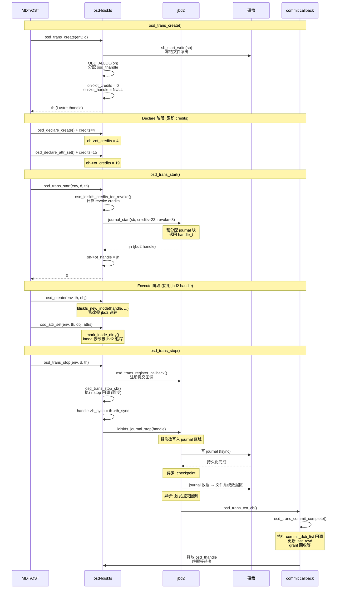
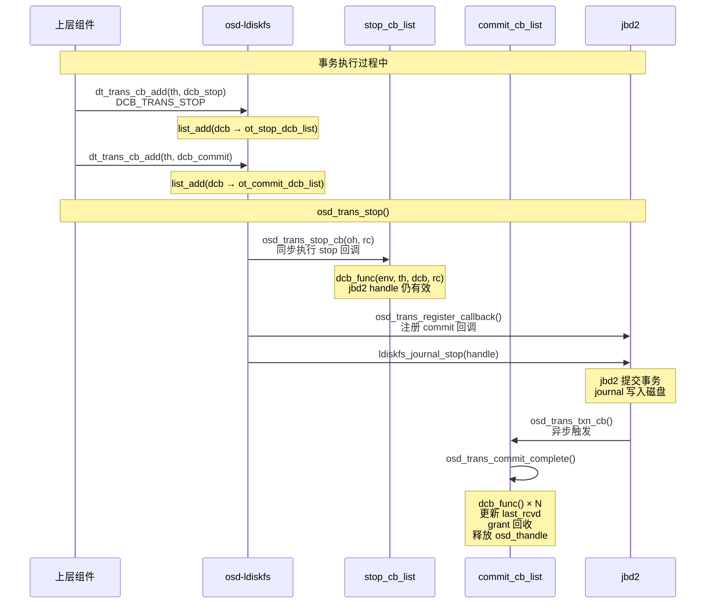

# jbd2 在 Lustre 中的作用分析

---

## 目录

1. [jbd2 是什么](#1-jbd2-是什么)
2. [jbd2 在 Lustre 存储栈中的位置](#2-jbd2-在-lustre-存储栈中的位置)
3. [osd-ldiskfs 对 jbd2 的封装](#3-osd-ldiskfs-对-jbd2-的封装)
4. [事务生命周期](#4-事务生命周期)
5. [Credit 机制](#5-credit-机制)
6. [操作到 jbd2 的映射](#6-操作到-jbd2-的映射)
7. [提交回调机制](#7-提交回调机制)
8. [崩溃恢复 (Journal Replay)](#8-崩溃恢复-journal-replay)
9. [jbd2 在 Lustre 中的 5 个角色](#9-jbd2-在-lustre-中的-5-个角色)
10. [关键源码索引](#10-关键源码索引)

---

## 1. jbd2 是什么

### 1.1 定义

```
jbd2 = Journaling Block Device 2

  ┌──────────────────────────────────────────────────────────────┐
  │  jbd2 不是数据库，是 Linux 内核的日志子系统                      │
  │                                                               │
  │  本质: 为块设备提供 Write-Ahead Logging (WAL) 能力             │
  │  位置: Linux 内核 fs/jbd2/ 目录                               │
  │  用户: ext4 文件系统 (以及 Lustre 的 ldiskfs 变体)             │
  │                                                               │
  │  提供的能力:                                                  │
  │    ├── 事务原子性 — 一组写操作要么全成功，要么全不生效            │
  │    ├── 崩溃一致性 — 断电/崩溃后通过 journal 重放恢复数据        │
  │    ├── WAL 日志 — 先写日志，再写数据                           │
  │    └── 并发控制 — 通过 handle 实现事务隔离                      │
  └──────────────────────────────────────────────────────────────┘
```

### 1.2 jbd2 核心概念

| 概念 | 说明 | 类比 |
|------|------|------|
| **handle_t** | jbd2 事务句柄，类似数据库连接 | 数据库事务 begin |
| **journal** | 磁盘上的日志区域，记录事务修改 | 数据库 redo log |
| **credits** | 预分配的 journal 块数量，限制事务大小 | 事务预分配空间 |
| **revoke** | 撤销记录，防止旧数据块被误用 | 类似 undo log |
| **checkpoint** | 将 journal 中的数据刷回文件系统 | 类似 checkpoint |
| **journal_start** | 开始事务，获取 handle | BEGIN TRANSACTION |
| **journal_stop** | 提交事务，释放 handle | COMMIT |

---

## 2. jbd2 在 Lustre 存储栈中的位置

### 2.1 存储栈全景

```
  ┌─────────────────────────────────────────────────────────────────┐
  │                        Lustre 组件层                             │
  │  MDT (元数据服务)        OST (对象存储服务)                      │
  │      │                         │                                │
  │      ▼                         ▼                                │
  │  ┌────────┐              ┌────────────┐                         │
  │  │  TGT   │              │    TGT     │  统一请求处理             │
  │  └───┬────┘              └─────┬──────┘                         │
  │      │                         │                                │
  │      ▼                         ▼                                │
  │  ┌────────┐              ┌────────────┐                         │
  │  │  MDT   │              │    OFD     │  业务逻辑               │
  │  └───┬────┘              └─────┬──────┘                         │
  │      │                         │                                │
  │      └────────┬────────────────┘                                │
  │               ▼                                                 │
  │  ┌─────────────────────────────────────────┐                    │
  │  │           DT 层 (dt_device)              │                    │
  │  │  osd_trans_create / start / stop        │  Lustre 抽象事务     │
  │  └──────────────────┬──────────────────────┘                    │
  │                     │                                            │
  └─────────────────────┼────────────────────────────────────────────┘
                        │
  ┌─────────────────────┼────────────────────────────────────────────┐
  │  Linux 内核         ▼                                            │
  │  ┌─────────────────────────────────────────┐                    │
  │  │        osd-ldiskfs (Lustre 改造版 ext4)  │                    │
  │  │  osd_trans_create()                     │                    │
  │  │    → sb_start_write() + 分配 osd_thandle │                    │
  │  │  osd_trans_start()                      │                    │
  │  │    → jbd2_journal_start(credits) ★      │                    │
  │  │  osd_write/create/destroy/attr_set()    │                    │
  │  │    → ldiskfs 操作 (被 jbd2 追踪)        │                    │
  │  │  osd_trans_stop()                       │                    │
  │  │    → jbd2_journal_stop() ★              │                    │
  │  └──────────────────┬──────────────────────┘                    │
  │                     │                                            │
  │  ┌──────────────────▼──────────────────────┐                    │
  │  │              jbd2 层                     │                    │
  │  │  journal_start → 记录修改 → journal_stop │                    │
  │  │  写入 journal 区域 → fsync → checkpoint  │                    │
  │  └──────────────────┬──────────────────────┘                    │
  │                     │                                            │
  │  ┌──────────────────▼──────────────────────┐                    │
  │  │           块设备 (/dev/sdX)              │                    │
  │  │  journal 区域 | 文件系统数据区 | 数据块   │                    │
  │  └─────────────────────────────────────────┘                    │
  └─────────────────────────────────────────────────────────────────┘
```

### 2.2 Lustre 为什么需要 jbd2

```
Lustre 选择 jbd2 而不是自己实现日志的原因:

  1. 成熟稳定
     ext4 + jbd2 在 Linux 中运行了 20+ 年
     经过亿级设备验证

  2. 不重复造轮子
     jbd2 已经提供了完整的事务 + WAL + 崩溃恢复
     Lustre 的 osd-ldiskfs 只需做薄封装

  3. 与文件系统深度集成
     jbd2 了解 ext4 的 inode、block bitmap、extent tree
     能精确追踪文件系统内部结构的修改

  4. 性能
     journal_start/stop 的开销很小 (微秒级)
     异步 checkpoint 不阻塞前台操作

  对比其他方案:
     SQLite: 独立进程，不适合内核模块
     自研 WAL: 工作量巨大，稳定性无法保证
     RocksDB: 需要 B+Tree 而非 LSM-Tree (元数据场景更适合原地更新)
```

---

## 3. osd-ldiskfs 对 jbd2 的封装

### 3.1 兼容层宏

```c
// osd_internal.h:1098-1138

// journal start (普通)
#define osd_journal_start_sb(sb, type, nblock) \
    ldiskfs_journal_start_sb(sb, type, nblock)

// journal start (带 revoke)
#define osd_journal_start_with_revoke(sb, type, nblock, revoke) \
    ldiskfs_journal_start_with_revoke(sb->s_root->d_inode, type, nblock, revoke)

// 事务大小上限 (jbd2 最大缓冲区的一半)
#define osd_transaction_size(dev) \
    (jbd2_journal_get_max_txn_bufs(osd_journal(dev)) / 2)

// buffer 访问 (兼容新旧内核)
#define osd_ldiskfs_journal_get_write_access(handle, sb, bh, flags) \
    ldiskfs_journal_get_write_access(handle, bh)

#define osd_ldiskfs_journal_get_create_access(handle, sb, bh) \
    ldiskfs_journal_get_create_access(handle, bh)
```

### 3.2 osd_thandle 结构体

```
osd_thandle 是 Lustre 事务和 jbd2 事务的桥梁:

  ┌──────────────────────────────────────────────────────────┐
  │ struct osd_thandle (osd_internal.h:433)                  │
  │                                                           │
  │  struct thandle ot_super;        ← Lustre dt 层事务基类    │
  │  handle_t     *ot_handle;        ← jbd2 事务句柄 ★         │
  │                                                           │
  │  // commit 回调 (jbd2 提交后异步执行)                      │
  │  struct list_head ot_commit_dcb_list;                     │
  │                                                           │
  │  // stop 回调 (journal_stop 前同步执行)                    │
  │  struct list_head ot_stop_dcb_list;                       │
  │                                                           │
  │  unsigned int ot_credits;        ← 累积的 jbd2 credits    │
  │  unsigned int oh_declared_ext;   ← 声明的 extent 块数      │
  │                                                           │
  │  // quota 相关                                            │
  │  unsigned short ot_id_cnt;                                 │
  │  struct lquota_trans *ot_quota_trans;                      │
  │                                                           │
  │  // jbd2 回调注册 (两种实现)                                │
  │  #ifdef HAVE_S_TXN_CB_MAP:                                │
  │    transaction_t  *ot_transaction;  ← jbd2 事务指针        │
  │    struct rb_node  ot_node;         ← rbtree 节点          │
  │  #else:                                                   │
  │    struct ldiskfs_journal_cb_entry ot_jcb; ← 经典回调      │
  │  #endif                                                   │
  └──────────────────────────────────────────────────────────┘
```

---

## 4. 事务生命周期

### 4.1 三阶段模型

```
Lustre 对 jbd2 事务的使用分三个阶段:

  ┌──────────────────────────────────────────────────────────────┐
  │ 阶段 1: osd_trans_create()                                    │
  │   ├── sb_start_write(sb)     冻结文件系统 (阻止 umount)        │
  │   ├── 分配 osd_thandle                                        │
  │   ├── oh->ot_credits = 0     credits 归零                     │
  │   └── 不调用 jbd2!         ← 仅 Lustre 层面初始化             │
  │                                                              │
  │ 阶段 2: Declare + Start                                     │
  │   ├── osd_declare_xxx()      声明要做的操作，累积 credits      │
  │   │   oh->ot_credits += credits                               │
  │   │                                                           │
  │   └── osd_trans_start()                                       │
  │       ├── osd_ldiskfs_credits_for_revoke()  计算 revoke 额度  │
  │       ├── osd_journal_start_with_revoke(sb, credits, revoke)  │
  │       │   ★ 这里才真正调用 jbd2!                               │
  │       └── oh->ot_handle = jh     保存 jbd2 handle             │
  │                                                              │
  │ 阶段 3: Execute + Stop                                      │
  │   ├── osd_write/create/destroy/attr_set()                    │
  │   │   使用 oh->ot_handle 进行文件系统操作                      │
  │   │   所有修改被 jbd2 追踪到 journal buffer                   │
  │   │                                                           │
  │   └── osd_trans_stop()                                        │
  │       ├── osd_trans_register_callback()  注册提交回调         │
  │       ├── osd_trans_stop_cb()             执行 stop 回调      │
  │       ├── ldiskfs_journal_stop(handle)    ★ jbd2 提交!        │
  │       └── osd_process_truncates()         延迟截断处理        │
  │                                                              │
  │ 异步: jbd2 提交完成后                                        │
  │   └── osd_trans_commit_complete()                              │
  │       ├── 执行 commit_dcb_list 中的回调                       │
  │       ├── 释放 osd_thandle                                    │
  │       └── 唤醒等待者                                          │
  └──────────────────────────────────────────────────────────────┘
```

### 4.2 完整事务时序



### 4.3 osd_trans_create 详解

```cpp
// osd_handler.c:2018-2073
osd_trans_create(env, d):
  // 1. 防止文件系统被 umount
  sb_start_write(sb);

  // 2. 分配 osd_thandle
  OBD_ALLOC_GFP(oh, sizeof(*oh), GFP_NOFS);

  // 3. 初始化
  th = &oh->ot_super;
  th->th_dev = d;
  oh->ot_credits = 0;          // credits 归零
  oh->ot_handle = NULL;        // jbd2 handle 为空 (还未启动)

  // 4. 初始化回调链表
  INIT_LIST_HEAD(&oh->ot_commit_dcb_list);  // 提交回调
  INIT_LIST_HEAD(&oh->ot_stop_dcb_list);    // 停止回调
  INIT_LIST_HEAD(&oh->ot_trunc_locks);      // 截断锁
  INIT_LIST_HEAD(&oh->ot_declare_list);     // 声明列表

  return th;
  // 注意: 此时还没有调用任何 jbd2 API!
```

### 4.4 osd_trans_start 详解

```cpp
// osd_handler.c:2152-2247
osd_trans_start(env, d, th):
  // 1. 前置钩子 (LFSCK 等)
  rc = dt_txn_hook_start(env, d, th);

  // 2. 声明 quota 操作 (至少需要 3 credits)
  osd_trans_declare_op(env, oh, OSD_OT_QUOTA, 3);

  // 3. 计算 revoke credits
  osd_ldiskfs_credits_for_revoke(dev, oh, &oh->ot_credits, &revoke);
  //   revoke = 需要撤销的旧数据块数量
  //   基于 LDISKFS_MAX_EXTENT_DEPTH * oh->oh_declared_ext

  // 4. ★ 启动 jbd2 事务 ★
  jh = osd_journal_start_with_revoke(osd_sb(dev),
                                      LDISKFS_HT_MISC,
                                      oh->ot_credits, revoke);
  //   → 内部调用 jbd2_journal_start()
  //   → 预分配 journal 块
  //   → 返回 handle_t

  // 5. 保存 jbd2 handle
  oh->ot_handle = jh;

  // 6. 更新计数器
  atomic_inc(&dev->od_commit_cb_in_flight);
  oti->oti_txns++;
```

### 4.5 osd_trans_stop 详解

```cpp
// osd_handler.c:2291-2370
osd_trans_stop(env, dt, th):

  // 1. 清理声明阶段的资源
  osd_tx_declaration_free(oh);
  list_splice(&oh->ot_trunc_locks, &truncates);

  if (oh->ot_handle != NULL) {
      // ---- 正常路径 (事务已启动) ----

      // 2. 注册提交回调到 jbd2
      osd_trans_register_callback(osd, oh);
      //   → 新内核: 插入 rbtree (s_txn_cb_map)
      //   → 旧内核: ldiskfs_journal_callback_add()

      // 3. 更新计数
      oti->oti_txns--;

      // 4. 前置钩子
      rc = dt_txn_hook_stop(env, th);

      // 5. 执行 stop 回调 (同步, handle 还有效)
      osd_trans_stop_cb(oh, rc);
      //   遍历 ot_stop_dcb_list 调用 dcb_func()

      // 6. 传播同步标志到 jbd2
      handle->h_sync = th->th_sync;

      // 7. 清空 handle (防止重复 stop)
      oh->ot_handle = NULL;

      // 8. ★ 提交 jbd2 事务 ★
      rc2 = ldiskfs_journal_stop(handle);
      //   → 写入 journal 到磁盘
      //   → fsync 确认持久化
      //   → 异步: 后续触发 osd_trans_commit_complete

      // 9. 处理延迟截断
      osd_process_truncates(env, &truncates);
  } else {
      // ---- 异常路径 (事务从未启动) ----
      osd_trans_stop_cb(oh, th->th_result);
      OBD_FREE_PTR(oh);
  }

  // 10. 收尾工作
  osd_trunc_unlock_all(env, &truncates);
  qsd_op_end(env, qsd, qtrans);   // quota 结束
  wait_event(iobuf->dr_wait, ...); // 等待直接 IO 完成
  sb_end_write(osd_sb(osd));       // 解除文件系统冻结
```

---

## 5. Credit 机制

### 5.1 什么是 Credit

```
Credit = 预分配的 journal 块数量

  jbd2 在 journal_start 时需要知道事务的最大规模:
    → 据此预分配 journal 空间
    → 避免运行时动态分配导致的死锁

  如果实际使用的 credits 超过预分配的:
    → jbd2 会返回错误 (断言失败)
    → 事务中止

  Lustre 的 Declare 阶段就是用来精确计算 credits:
    osd_declare_create()  → 累积 credits
    osd_declare_write()   → 累积 credits
    osd_declare_destroy() → 累积 credits
    osd_declare_attr_set()→ 累积 credits
```

### 5.2 Credit 计算表

```
// osd_handler.c:2881
osd_dto_credits_noquota[]:

  操作类型              credits    原因
  ──────────────────────────────────────────────────────
  DTO_INDEX_INSERT       16       索引树分裂 (extent depth)
  DTO_INDEX_DELETE        1       索引项合并
  DTO_INDEX_UPDATE       16       OI scrub 更新
  DTO_OBJECT_CREATE       4       inode + inode bits + groups + GDT
  DTO_OBJECT_DELETE       4       inode + inode bits + groups + GDT
  DTO_ATTR_SET_BASE       1       inode 修改
  DTO_XATTR_SET          14       DATA_TRANS_BLOCKS (ext3 xattr)
  DTO_WRITE_BASE          3       inode change during write
  DTO_WRITE_BLOCK        14       单个数据块写入
  DTO_ATTR_SET_CHOWN      0       chown 额外 credits (无 quota 时为 0)
```

### 5.3 Credit 累积过程

```
示例: 创建一个文件 (osd_create)

  osd_declare_create():
    → osd_trans_declare_op(OSD_OT_CREATE, 4)
    → osd_trans_declare_op(OSD_OT_REF_ADD, 1)   // OI 引用
    → osd_trans_declare_op(OSD_OT_INSERT, 16)    // OI 索引插入

  osd_declare_create() 内部:
    oh->ot_credits += osd_dto_credits_noquota[DTO_OBJECT_CREATE]  // +4
    oh->ot_credits += osd_dto_credits_noquota[DTO_INDEX_INSERT]   // +16
    oh->ot_credits += ACL credits                                   // +X

  最终: oh->ot_credits ≈ 21+X

  osd_trans_start():
    osd_ldiskfs_credits_for_revoke()  // +revoke credits
    journal_start(sb, credits, revoke)  // jbd2 预分配
```

### 5.4 Revoke 计算

```
Revoke 的作用: 告诉 jbd2 哪些旧数据块不再属于当前事务

  场景: 覆盖写入一个已存在的文件
    → 旧的数据块仍然在 journal 中引用
    → 需要写入 revoke 记录: "block X 已被新数据替代"
    → 防止崩溃恢复时误用旧数据

  osd_ldiskfs_credits_for_revoke():
    blocks = LDISKFS_MAX_EXTENT_DEPTH * oh->oh_declared_ext
    → 基于 extent tree 的最大深度 × 声明的 extent 数量

    新内核 (HAVE_LDISKFS_JOURNAL_ENSURE_CREDITS):
      *revoke += default_revoke_credits + blocks
      → 通过 osd_journal_start_with_revoke() 传入

    旧内核:
      jbsize = journal_blocksize - header_size
      records_per_block = jbsize / 8  (每条 revoke 记录 8 字节)
      *credits += (blocks + records_per_block - 1) / records_per_block
      → 直接加到 credits 中
```

---

## 6. 操作到 jbd2 的映射

### 6.1 两阶段模式

```
所有 osd 操作都遵循 Declare + Execute 两阶段:

  Declare 阶段 (osd_trans_start 之前):
    osd_declare_write()   → 累积 credits, 不接触 jbd2
    osd_declare_create()  → 累积 credits, 不接触 jbd2
    osd_declare_destroy() → 累积 credits, 不接触 jbd2
    osd_declare_attr_set()→ 累积 credits, 不接触 jbd2

  Execute 阶段 (osd_trans_start 之后, osd_trans_stop 之前):
    osd_write()   → 使用 oh->ot_handle 操作 ldiskfs
    osd_create()  → 使用 oh->ot_handle 操作 ldiskfs
    osd_destroy() → 使用 oh->ot_handle 操作 ldiskfs
    osd_attr_set()→ 使用 oh->ot_handle 操作 ldiskfs

  为什么要分两阶段:
    1. credits 必须在 journal_start 之前确定
    2. 先声明所有操作, 计算总 credits, 一次性启动 jbd2
    3. 避免在事务中途动态扩展导致死锁
```

### 6.2 各操作映射详情

```
osd_write (osd_io.c:2353):
  Declare: osd_declare_write()
    credits = extent_tree_depth * 3 + data_blocks * 3

  Execute:
    ├── 小 symlink: osd_ldiskfs_writelink()
    │   journal_get_write_access() → handle_dirty_metadata()
    │
    ├── 预分配写: osd_ldiskfs_write_fast()
    │   journal_get_write_access() → handle_dirty_metadata()
    │
    └── 普通写: osd_ldiskfs_write()
        __ldiskfs_bread(handle, ...)   读取数据块
        journal_get_write_access()     标记为可写
        handle_dirty_metadata()        标记为脏
        osd_dirty_inode()              标记 inode 脏

osd_create (osd_handler.c:4556):
  Declare: osd_declare_create()
    credits = DTO_OBJECT_CREATE(4) + DTO_INDEX_INSERT(16) + ACL

  Execute:
    __osd_create()  → ldiskfs_new_inode(handle, ...)
    osd_ea_fid_set() → 设置 FID 扩展属性
    __osd_oi_insert() → 插入 OI 索引

osd_destroy (osd_handler.c:4126):
  Declare: osd_declare_destroy()
    credits = DTO_OBJECT_DELETE(4) + DTO_INDEX_DELETE(1) + OI清理

  Execute:
    ldiskfs_orphan_del(handle, inode)  从 orphan list 移除
    osd_oi_delete()                    删除 OI 索引
    osd_dirty_inode()                  标记 inode 为 DESTROY 状态

osd_attr_set (osd_handler.c:3435):
  Declare: osd_declare_attr_set()
    credits = DTO_ATTR_SET_BASE(1) + DTO_XATTR_SET(14) + quota

  Execute:
    osd_inode_setattr()   → mark_inode_dirty()
    osd_quota_transfer()  → quota 调整
    osd_dirty_inode()     → 标记 inode 脏
```

---

## 7. 提交回调机制

### 7.1 两类回调

```
osd_trans_cb_add() (osd_handler.c:2398) 将回调分为两类:

  ┌──────────────────────────────────────────────────────────────┐
  │  ot_stop_dcb_list (DCB_TRANS_STOP 标志)                      │
  │  执行时机: journal_stop() 之前, jbd2 handle 仍有效           │
  │  执行方式: 同步, 在 osd_trans_stop_cb() 中                   │
  │  用途:   需要在事务提交前做最后处理                           │
  └──────────────────────────────────────────────────────────────┘

  ┌──────────────────────────────────────────────────────────────┐
  │  ot_commit_dcb_list (无 DCB_TRANS_STOP 标志)                 │
  │  执行时机: journal_stop() 之后, jbd2 事务已提交到磁盘        │
  │  执行方式: 异步, 在 osd_trans_commit_complete() 中            │
  │  用途:   更新 last_rcvd, grant 回收, OSP 同步等              │
  └──────────────────────────────────────────────────────────────┘
```

### 7.2 回调注册时序



### 7.3 回调注册方式 (两种内核实现)

```
新内核 (HAVE_S_TXN_CB_MAP):

  osd_trans_register_callback(osd, oh):
    将 oh 插入 sbi->s_txn_cb_map (rbtree)
    键: transaction_t 指针

  jbd2 提交完成后:
    ldiskfs 调用 sbi->s_txn_cb → osd_trans_txn_cb()
    → 在 rbtree 中查找该 transaction 的所有 osd_thandle
    → 逐个调用 osd_trans_commit_complete()

旧内核:

  osd_trans_register_callback(osd, oh):
    ldiskfs_journal_callback_add(oh->ot_handle,
                                  osd_trans_commit_cb,
                                  &oh->ot_jcb)

  jbd2 提交完成后:
    直接调用 osd_trans_commit_cb()
    → osd_trans_commit_complete()
```

---

## 8. 崩溃恢复 (Journal Replay)

### 8.1 jbd2 Journal Replay 过程

```
Lustre 不直接驱动 journal replay, 而是由 ldiskfs/ext4 在 mount 时自动完成:

  osd_mount() (osd_handler.c:8390):
    1. type = get_fs_type("ldiskfs")
    2. o->od_mnt = vfs_kern_mount(type, s_flags, dev, options)
       │
       ▼ 内核内部
       ldiskfs_fill_super()
         → journal_load()
           → 读取 journal 超级块
           → 发现需要 replay 的未完成事务
           → 逐个重放 journal 块
           → 恢复文件系统数据到一致状态
           → checkpoint (journal → 数据区)
       │
       ▼ 返回
    3. 验证 journal 特性:
       ldiskfs_has_feature_journal()  → 必须有
       ldiskfs_has_feature_fast_commit() → 必须没有 (Lustre 禁止)
```

### 8.2 Journal Replay 时序

```mermaid
sequenceDiagram
    participant LUSTRE as Lustre 启动
    participant OSD as osd_mount()
    participant VFS as vfs_kern_mount()
    participant LDISKFS as ldiskfs
    participant JBD2 as jbd2
    member DISK as 磁盘

    LUSTRE->>OSD: osd_mount()
    OSD->>VFS: vfs_kern_mount("ldiskfs", dev)
    VFS->>LDISKFS: ldiskfs_fill_super()

    LDISKFS->>DISK: 读取 superblock
    DISK-->>LDISKFS: superblock + journal 信息

    LDISKFS->>JBD2: journal_load()
    JBD2->>DISK: 读取 journal 超级块
    DISK-->>JBD2: journal 状态

    alt 存在未完成事务
        Note over JBD2: 发现需要 replay 的事务

        loop 每个未完成事务
            JBD2->>DISK: 读取 journal 块
            DISK-->>JBD2: 事务数据
            JBD2->>JBD2: 重放事务<br/>恢复文件系统数据
        end

        Note over JBD2: replay 完成

        JBD2->>DISK: checkpoint<br/>journal → 文件系统数据区
        DISK-->>JBD2: checkpoint 完成

        JBD2->>JBD2: 清理 journal<br/>标记事务为已提交
    else journal 干净
        Note over JBD2: 无需 replay
    end

    JBD2-->>LDISKFS: journal 就绪
    LDISKFS-->>VFS: mount 成功
    VFS-->>OSD: od_mnt (mount 句柄)
    OSD->>OSD: 验证 journal 特性<br/>禁止 fast_commit
    OSD-->>LUSTRE: mount 完成<br/>文件系统可用
```

### 8.3 unmount 时的清理

```cpp
// osd_handler.c:8357
osd_umount(env, o):
  // 1. 防止新的 mount/umount 并发
  atomic_inc(&osd_mount_seq);

  // 2. 刷新文件系统
  osd_sync(env, &o->od_dt_dev);
  //   → sync_fs(sb, 1) → 等待所有数据写入磁盘

  // 3. 等待所有 commit callback 完成
  wait_event(o->od_commit_cb_done,
             !atomic_read(&o->od_commit_cb_in_flight));
  //   → 确保没有异步回调还在运行

  // 4. 卸载文件系统
  mntput(o->od_mnt);
  //   → ldiskfs unmount
  //   → journal flush (所有 journal 数据 checkpoint)
  //   → journal 关闭
```

---

## 9. jbd2 在 Lustre 中的 5 个角色

### 9.1 角色总结

```
jbd2 在 Lustre 中扮演 5 个关键角色:

  ┌──────────────────────────────────────────────────────────────┐
  │ 角色 1: 元数据持久化保证                                      │
  │                                                              │
  │   MDT 上的所有元数据操作 (CREATE/UNLINK/RENAME/SETATTR/...)   │
  │   都通过 osd_trans_create/start/stop → jbd2 事务提交          │
  │   → 崩溃不丢元数据                                           │
  │                                                              │
  │   OST 上的对象操作 (create/destroy/setattr/...)               │
  │   同样通过 jbd2 保证                                          │
  └──────────────────────────────────────────────────────────────┘

  ┌──────────────────────────────────────────────────────────────┐
  │ 角色 2: 崩溃恢复基础                                         │
  │                                                              │
  │   MDT/OST 崩溃重启后                                         │
  │   ldiskfs mount 时 jbd2 自动 replay journal                  │
  │   → 元数据和对象数据恢复到一致状态                             │
  │   → 在此基础上, Lustre 再做 last_rcvd 恢复和 RPC 重放        │
  └──────────────────────────────────────────────────────────────┘

  ┌──────────────────────────────────────────────────────────────┐
  │ 角色 3: 事务原子性                                           │
  │                                                              │
  │   单个操作内的多个文件系统修改 (如创建文件 = 创建 inode +     │
  │   插入 OI 索引 + 设置 FID xattr)                              │
  │   通过同一个 jbd2 事务保证原子性                               │
  │   → 要么全部成功, 要么全部不生效                               │
  └──────────────────────────────────────────────────────────────┘

  ┌──────────────────────────────────────────────────────────────┐
  │ 角色 4: last_rcvd 的持久化基础                                │
  │                                                              │
  │   last_rcvd 的更新通过 dt_txn_commit_cb 注册到 jbd2           │
  │   jbd2 提交成功后 → 触发回调 → 写 last_rcvd                   │
  │   → last_rcvd 和文件系统数据在同一事务中保持一致                │
  └──────────────────────────────────────────────────────────────┘

  ┌──────────────────────────────────────────────────────────────┐
  │ 角色 5: 性能与资源控制                                        │
  │                                                              │
  │   Credit 机制限制单个事务的大小                                │
  │   osd_transaction_size() = jbd2 最大缓冲区 / 2               │
  │   → 防止单个事务占用过多 journal 空间                          │
  │   → 大操作被拆分为多个小事务                                   │
  └──────────────────────────────────────────────────────────────┘
```

### 9.2 与 Lustre 其他日志的关系

```
jbd2 不是 Lustre 中唯一的日志, 但是最底层的:

  ┌──────────────────────────────────────────────────────────┐
  │  应用层: libcfs CDEBUG/CERROR                            │
  │    (调试日志, 不参与数据持久化)                            │
  │                                                          │
  │  RPC 层: ptlrpc replay_list                              │
  │    (客户端内存中的重放队列, 断连恢复用)                    │
  │                                                          │
  │  OST↔MDS: llog                                           │
  │    (恢复日志, 存储在 dt_object 中, 依赖 jbd2 持久化)     │
  │                                                          │
  │  服务端: last_rcvd                                       │
  │    (RPC 级恢复状态, 依赖 jbd2 提交回调来更新)             │
  │                                                          │
  │  ═══════════════════════════════════════════             │
  │  底层: jbd2 journal  ← 所有持久化数据的最终保障            │
  │    (文件系统级别的 WAL, 不可绕过)                          │
  └──────────────────────────────────────────────────────────┘

  关系: llog 和 last_rcvd 本身也是文件系统中的文件
       它们的内容修改同样通过 jbd2 事务来保证持久化!
       → jbd2 是整个持久化体系的地基
```

---

## 10. 关键源码索引

| 模块 | 文件 | 关键内容 |
|------|------|---------|
| **osd_thandle 结构** | `lustre/osd-ldiskfs/osd_internal.h:433` | `struct osd_thandle` |
| **osd_op_type 枚举** | `lustre/osd-ldiskfs/osd_internal.h:406` | `enum osd_op_type` |
| **osd_thread_info** | `lustre/osd-ldiskfs/osd_internal.h:674` | `oti_txns`, `oti_declare_ops[]` |
| **jbd2 兼容宏** | `lustre/osd-ldiskfs/osd_internal.h:1098` | `osd_journal_start_*` |
| **事务大小** | `lustre/osd-ldiskfs/osd_internal.h:1137` | `osd_transaction_size()` |
| **trans_declare_op** | `lustre/osd-ldiskfs/osd_internal.h:1366` | `osd_trans_declare_op()` |
| **h_buffer_credits** | `lustre/osd-ldiskfs/osd_internal.h:1388` | 内核兼容宏 |
| **credit 表** | `lustre/osd-ldiskfs/osd_handler.c:2881` | `osd_dto_credits_noquota[]` |
| **trans_create** | `lustre/osd-ldiskfs/osd_handler.c:2018` | `osd_trans_create()` |
| **revoke 计算** | `lustre/osd-ldiskfs/osd_handler.c:2124` | `osd_ldiskfs_credits_for_revoke()` |
| **trans_start** | `lustre/osd-ldiskfs/osd_handler.c:2152` | `osd_trans_start()` |
| **stop 回调** | `lustre/osd-ldiskfs/osd_handler.c:2272` | `osd_trans_stop_cb()` |
| **trans_stop** | `lustre/osd-ldiskfs/osd_handler.c:2291` | `osd_trans_stop()` |
| **cb_add** | `lustre/osd-ldiskfs/osd_handler.c:2398` | `osd_trans_cb_add()` |
| **register callback** | `lustre/osd-ldiskfs/osd_handler.c:1902` | `osd_trans_register_callback()` |
| **commit complete** | `lustre/osd-ldiskfs/osd_handler.c:1872` | `osd_trans_commit_complete()` |
| **txn_cb** | `lustre/osd-ldiskfs/osd_handler.c:1991` | `osd_trans_txn_cb()` |
| **osd_mount** | `lustre/osd-ldiskfs/osd_handler.c:8390` | `osd_mount()` → `vfs_kern_mount()` |
| **osd_umount** | `lustre/osd-ldiskfs/osd_handler.c:8357` | `osd_umount()` → 等待回调 + mntput |
| **osd_write** | `lustre/osd-ldiskfs/osd_io.c:2353` | `osd_write()` |
| **declare_write** | `lustre/osd-ldiskfs/osd_io.c:1860` | `osd_declare_write()` |
| **osd_create** | `lustre/osd-ldiskfs/osd_handler.c:4556` | `osd_create()` |
| **declare_create** | `lustre/osd-ldiskfs/osd_handler.c:3998` | `osd_declare_create()` |
| **osd_destroy** | `lustre/osd-ldiskfs/osd_handler.c:4126` | `osd_destroy()` |
| **declare_destroy** | `lustre/osd-ldiskfs/osd_handler.c:4074` | `osd_declare_destroy()` |
| **osd_attr_set** | `lustre/osd-ldiskfs/osd_handler.c:3435` | `osd_attr_set()` |
| **declare_attr_set** | `lustre/osd-ldiskfs/osd_handler.c:3169` | `osd_declare_attr_set()` |
| **dt_trans_cb_add 注册** | `lustre/osd-ldiskfs/osd_handler.c:2961` | `.dt_trans_cb_add = osd_trans_cb_add` |
