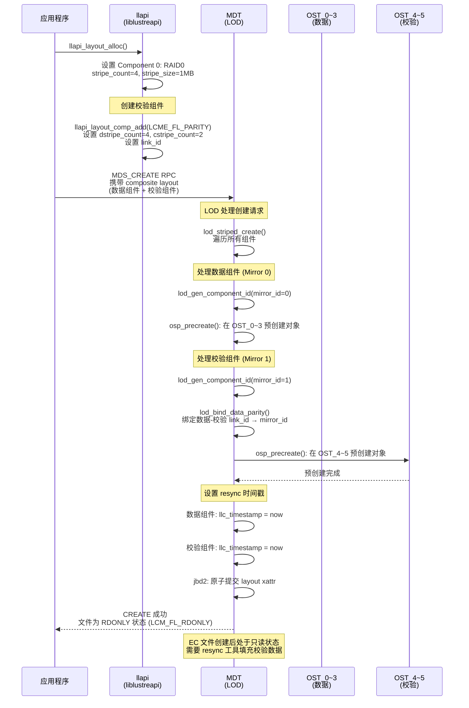
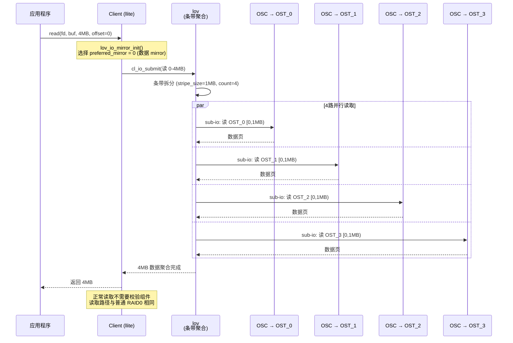
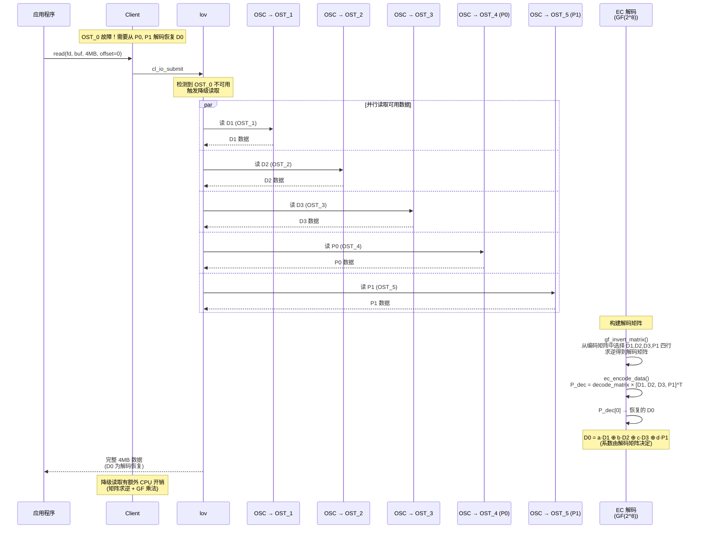
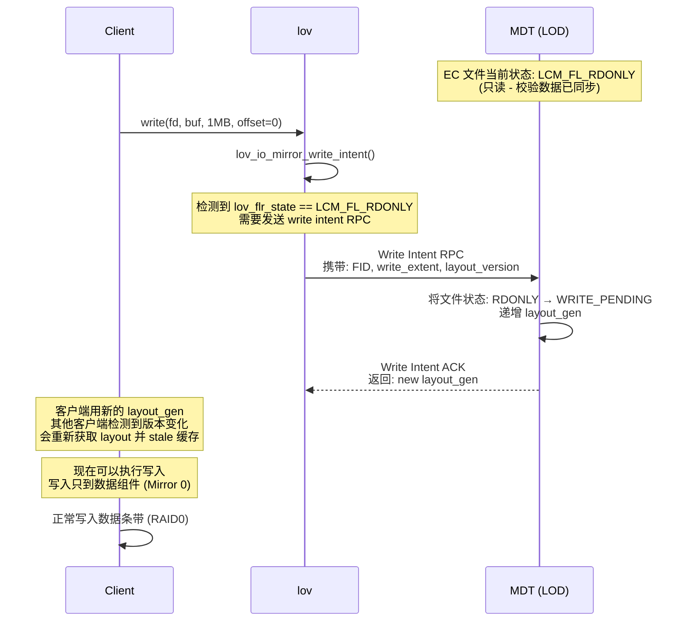
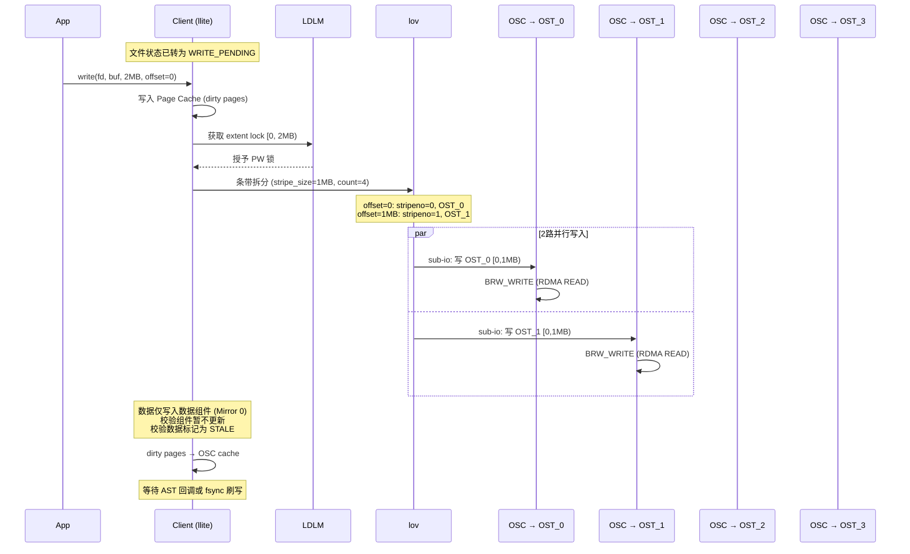
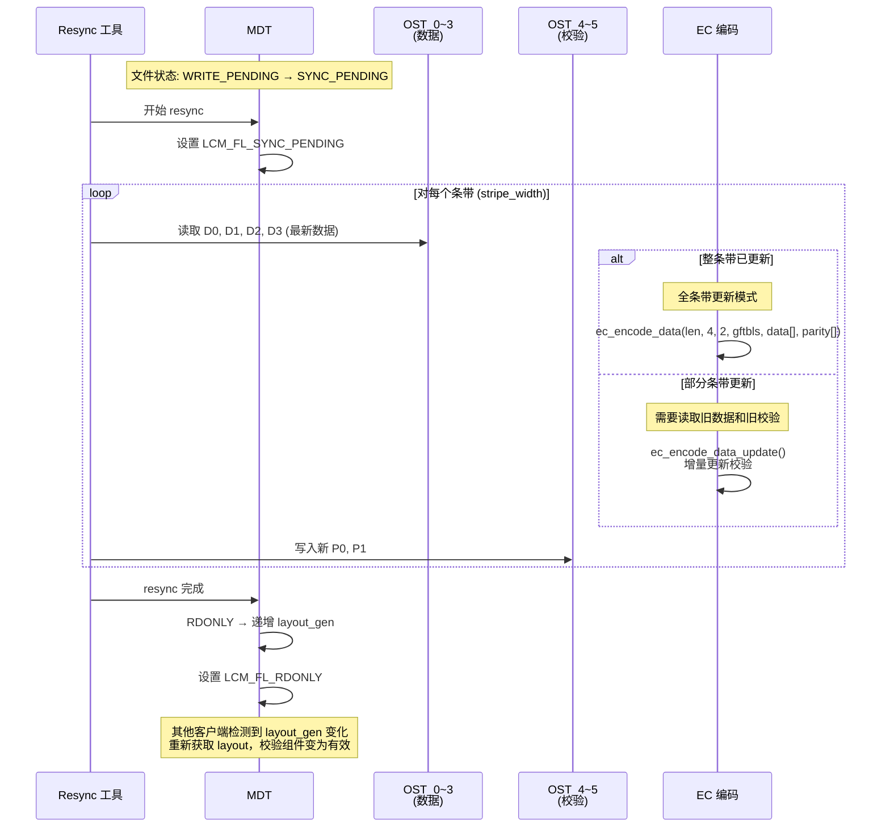

# Lustre EC（纠删码）实现深度分析

## 1. EC 架构总览

Lustre 的 EC（Erasure Coding）基于 **Reed-Solomon 编码**，使用 GF(2^8) 有限域运算。EC 在 Lustre 中作为 Composite Layout（复合布局）的一种组件类型存在，与 RAID0、FLR 镜像、PFL 渐进式布局共享统一的 `lov_comp_md_v1` 框架。

```
┌──────────────────────────────────────────────────────────────────────┐
│                    Lustre EC 架构全景                                │
│                                                                      │
│  ┌────────────────────────────────────────────────────────────────┐  │
│  │ Composite Layout (lov_comp_md_v1)                              │  │
│  │                                                                │  │
│  │  Mirror 0 (数据镜像/条带):                                     │  │
│  │  ┌─────────────────────────────────────────────────────┐       │  │
│  │  │ Component 0: RAID0 (数据条带, k 个 OST)             │       │  │
│  │  │ Component 1: RAID0 (数据条带, k 个 OST)   [PFL]    │       │  │
│  │  │ Component 2: MDT  (DOM 数据)            [PFL]    │       │  │
│  │  └─────────────────────────────────────────────────────┘       │  │
│  │                                                                │  │
│  │  Mirror 1 (EC 校验):                                          │  │
│  │  ┌─────────────────────────────────────────────────────┐       │  │
│  │  │ Component 0: PARITY (LCME_FL_PARITY, p 个 OST)      │       │  │
│  │  │   与 Mirror 0 的 Component 0 extent 对齐            │       │  │
│  │  │   lcme_dstripe_count = k, lcme_cstripe_count = p   │       │  │
│  │  │   llc_pattern = RAID0 | PARITY                      │       │  │
│  │  └─────────────────────────────────────────────────────┘       │  │
│  └────────────────────────────────────────────────────────────────┘  │
│                                                                      │
│  关键: EC 不作为独立文件存在，而是作为数据 mirror 的"校验 mirror"    │
│  数据组件与校验组件通过 mirror_link_id 双向绑定                      │
└──────────────────────────────────────────────────────────────────────┘
```

---

## 2. 编码数学基础

### 2.1 GF(2^8) 有限域

Lustre 的 EC 基于 GF(2^8) 有限域，使用不可约多项式 `x^8 + x^4 + x^3 + x^2 + 1`（即 `0x11D`）。每个字节为一个域元素（0-255），运算通过查表加速：

```c
// lustre/ec/ec_base.c:59-72
// GF(2^8) 乘法 - 使用预计算的 256×256 乘法表
unsigned char gf_mul(unsigned char a, unsigned char b)
{
    return gf_mul_table_base[b * 256 + a];
}

// GF(2^8) 求逆 - 使用预计算的逆元表
unsigned char gf_inv(unsigned char a)
{
    return gf_inv_table_base[a];
}
```

### 2.2 编码矩阵生成

Lustre 支持两种编码矩阵：

**Vandermonde 矩阵**（[ec_base.c:88-105](lustre/ec/ec_base.c#L88-L105)）：

```c
// 生成 [m x k] Vandermonde 矩阵
// 上部 k×k 为单位矩阵 I
// 下部 (m-k)×k 的元素为 2^{i*(j-k+1)}
void gf_gen_rs_matrix(unsigned char *a, int m, int k)
{
    memset(a, 0, k * m);
    for (i = 0; i < k; i++)
        a[k * i + i] = 1;         // 单位矩阵

    for (i = k; i < m; i++) {
        p = 1;
        for (j = 0; j < k; j++) {
            a[k * i + j] = p;     // Vandermonde 行
            p = gf_mul(p, gen);
        }
        gen = gf_mul(gen, 2);     // 生成元翻倍
    }
}
```

**Cauchy 矩阵**（[ec_base.c:107-123](lustre/ec/ec_base.c#L107-L123)）：

```c
// 生成 Cauchy 矩阵 - 保证任何子矩阵都可逆
// 下部元素为 1/(i ^ j) | i != j
void gf_gen_cauchy1_matrix(unsigned char *a, int m, int k)
{
    memset(a, 0, k * m);
    for (i = 0; i < k; i++)
        a[k * i + i] = 1;         // 单位矩阵

    p = &a[k * k];
    for (i = k; i < m; i++)
        for (j = 0; j < k; j++)
            *p++ = gf_inv(i ^ j);  // Cauchy 元素
}
```

### 2.3 编码流程

```
示例: 4+2 EC (k=4, p=2, m=6)

1. 生成编码矩阵 [6×4]:
   ┌                     ┐
   │ 1  0  0  0 │  ← 单位矩阵 (数据行)
   │ 0  1  0  0 │
   │ 0  0  1  0 │
   │ 0  0  0  1 │
   │ 1  1  1  1 │  ← 校验行 (P0 = D0⊕D1⊕D2⊕D3)
   │ 1  2  4  8 │  ← 校验行 (P1 = D0⊕2D1⊕4D2⊕8D3)
   └                     ┘

2. 编码过程 (对每个字节位置 i):
   P0[i] = D0[i] ⊕ D1[i] ⊕ D2[i] ⊕ D3[i]
   P1[i] = D0[i] ⊕ 2·D1[i] ⊕ 4·D2[i] ⊕ 8·D3[i]

3. 存储:
   OST_0: D0    OST_1: D1    OST_2: D2    OST_3: D3
   OST_4: P0    OST_5: P1

4. 任意 2 个 OST 故障 → 从剩余 4 个重建
```

### 2.4 SIMD 加速

Lustre EC 利用 x86 SIMD 指令集进行加速（[erasure_code.h](lustre/include/erasure_code.h)）：

| 版本 | 指令集 | 最小对齐 | 向量宽度 |
|------|--------|----------|----------|
| `_base` | 标量 C | — | 1 字节 |
| `_sse` | SSE4.1 | 16 字节 | 16 字节 |
| `_avx` | AVX | 32 字节 | 32 字节 |
| `_avx2` | AVX2 | 32 字节 | 32 字节 |

运行时自动选择最高可用指令集版本。

---

## 3. 数据结构与磁盘格式

### 3.1 Composite Layout 头部

EC 文件使用 Composite Layout（`lov_comp_md_v1`）存储，数据组件和校验组件分别属于不同的 mirror：

```c
// lustre/include/uapi/linux/lustre/lustre_user.h:1144-1160
struct lov_comp_md_v1 {
    __u32  lcm_magic;           // LOV_USER_MAGIC_COMP_V1
    __u32  lcm_size;            // 整体大小
    __u32  lcm_layout_gen;      // 布局版本号
    __u16  lcm_flags;           // LCM_FL_* (FLR 状态)
    __u16  lcm_entry_count;     // 组件总数 (数据+校验)
    __u16  lcm_mirror_count;    // 实际 mirror 数 - 1 (EC 文件 = 1)
    __u8   lcm_ec_count;        // 校验组件数量 (非 EC 文件为 0)
    __u8   lcm_padding3[1];
    struct lov_comp_md_entry_v1 lcm_entries[];  // 组件数组
};
```

### 3.2 组件条目（EC 关键字段）

```c
// lustre/include/uapi/linux/lustre/lustre_user.h:1079-1112
struct lov_comp_md_entry_v1 {
    __u32            lcme_id;        // 组件唯一 ID (含 mirror_id)
    __u32            lcme_flags;     // LCME_FL_XXX
    struct lu_extent lcme_extent;    // 文件范围 [start, end)
    __u32            lcme_offset;    // 组件 blob 在 v_comp 中的偏移
    __u32            lcme_size;      // 组件 blob 大小
    __u32            lcme_layout_gen;
    union {
        __u64        lcme_time_and_id;
        struct {
            __u64    lcme_timestamp:48;      // 快照时间戳
            __u16    lcme_mirror_link_id;    // 数据-校验绑定 ID
        };
    };
    __u8   lcme_dstripe_count;  // EC: 数据条带数 (k)
    __u8   lcme_cstripe_count;  // EC: 校验条带数 (p)
    __u8   lcme_compr_type;
    __u8   lcme_compr_lvl:4;
    __u8   lcme_compr_chunk_log_bits:4;
};
```

### 3.3 EC 参数限制

```c
// lustre/include/uapi/linux/lustre/lustre_user.h:887-889
#define LOV_EC_MAX_DATA_STRIPES   255   // 最大数据条带数 (k)
#define LOV_EC_MAX_CODING_STRIPES  15   // 最大校验条带数 (p)
// 最大 EC 组规模: 255 + 15 = 270 个 OST
```

校验组件要求精确的条带数，不允许自适应缩减（[lod_qos.c:379-392](lustre/lod/lod_qos.c#L379-L392)）：

```c
// 校验组件必须严格使用请求的条带数
static int lod_stripe_count_min(__u32 stripe_count, enum lod_uses_hint flags)
{
    if (flags & LCME_FL_PARITY)
        return stripe_count;  // 校验组件: 不允许缩减
    return stripe_count - (stripe_count / 4);  // 数据组件: 允许缩减 25%
}
```

### 3.4 EC 标志位

```c
// lustre/include/uapi/linux/lustre/lustre_user.h:1002
LCME_FL_PARITY = 0x00000080  // 标记此组件为 EC 校验组件

// lustre/include/uapi/linux/lustre/lustre_user.h:786
LOV_PATTERN_PARITY = 0x004    // 校验组件的 pattern 位

// 数据组件 pattern: LOV_PATTERN_RAID0 (0x001)
// 校验组件 pattern: LOV_PATTERN_RAID0 | LOV_PATTERN_PARITY (0x005)
```

### 3.5 磁盘布局示例

```
4+2 EC 文件的 Composite Layout:

lov_comp_md_v1:
├── lcm_magic = LOV_USER_MAGIC_COMP_V1
├── lcm_entry_count = 2
├── lcm_mirror_count = 1  (2 个 mirror: 数据 + 校验)
├── lcm_ec_count = 1      (1 个校验组件)
│
├── lcm_entries[0]:  (Mirror 0 - 数据组件)
│   ├── lcme_id = pflr_id(mirror_id=0, seqid=1)
│   ├── lcme_flags = LCME_FL_PREF_RW | LCME_FL_INIT
│   ├── lcme_extent = [0, +∞)
│   ├── lcme_mirror_link_id = 1  (绑定到校验组件)
│   ├── lcme_dstripe_count = 4
│   └── blob: lov_mds_md_v3 { stripe_count=4, stripe_size=1MB, OST_0~3 }
│
└── lcm_entries[1]:  (Mirror 1 - 校验组件)
    ├── lcme_id = pflr_id(mirror_id=1, seqid=1)
    ├── lcme_flags = LCME_FL_PARITY | LCME_FL_INIT
    ├── lcme_extent = [0, +∞)  ← 与数据组件 extent 对齐
    ├── lcme_mirror_link_id = 0  (绑定到数据组件)
    ├── lcme_dstripe_count = 4   (k=4)
    ├── lcme_cstripe_count = 2   (p=2)
    └── blob: lov_mds_md_v3 { stripe_count=2, stripe_size=1MB, OST_4~5 }
```

### 3.6 数据-校验绑定机制

数据组件与校验组件通过 `lcme_mirror_link_id` 双向绑定（[lod_object.c:6352-6405](lustre/lod/lod_object.c#L6352-L6405)）：

```c
// lod_bind_data_parity() - 创建时绑定
static int lod_bind_data_parity(struct lod_object *lo, int parity_index)
{
    // 用户通过 llapi 设置 LCME_FL_IS_LINK_ID 标志
    if (!(comp_parity->llc_flags & LCME_FL_IS_LINK_ID))
        RETURN(0);

    // 搜索 link_id 匹配的数据组件
    for (i = 0; i < lo->ldo_comp_cnt; i++) {
        if ((comp->llc_flags & LCME_FL_PARITY) ||       // 跳过校验组件
            !(comp->llc_flags & LCME_FL_IS_LINK_ID))   // 跳过无 link 的
            continue;
        if (comp->llc_mirror_link_id != comp_parity->llc_mirror_link_id)
            continue;

        // 用 mirror_id 替换 link_id 完成绑定
        comp_parity->llc_mirror_link_id = mirror_id_of(comp->llc_id);
        comp->llc_mirror_link_id = mirror_id_of(comp_parity->llc_id);
        comp_parity->llc_flags &= ~LCME_FL_IS_LINK_ID;
        comp->llc_flags &= ~LCME_FL_IS_LINK_ID;
    }
}
```

---

## 4. EC 文件创建流程



---

## 5. EC 读取流程

### 5.1 正常读取（无故障）

EC 文件正常读取时，只从**数据组件**（Mirror 0）读取，与普通 RAID0 条带文件完全一致：



### 5.2 降级读取（OST 故障恢复）

当数据 OST 故障时，Lustre 利用校验组件的 parity OST 通过**解码**恢复丢失数据：



### 5.3 解码矩阵计算

```
假设 4+2 EC，OST_0 (D0) 故障:

编码矩阵 (Vandermonde):
    ┌                     ┐
    │ 1  0  0  0 │  D0  ← 缺失
    │ 0  1  0  0 │  D1  ✓
    │ 0  0  1  0 │  D2  ✓
    │ 0  0  0  1 │  D3  ✓
    │ 1  1  1  1 │  P0
    │ 1  2  4  8 │  P1  ✓
    └                     ┘

选择可用行 [D1, D2, D3, P1] 构建子矩阵:
    ┌              ┐
    │ 0  1  0  0  │
    │ 0  0  1  0  │
    │ 0  0  0  1  │
    │ 1  2  4  8  │
    └              ┘

求逆: gf_invert_matrix(sub, dec_inv, 4)

恢复: D0 = dec_inv[0] · [D1, D2, D3, P1]^T
```

---

## 6. EC 写入流程

### 6.1 Write Intent 机制

EC 文件写入前需要通过 Write Intent RPC 通知 MDT，这会触发文件状态机转换：



### 6.2 文件状态机

EC 文件通过 `lcm_flags` 的低 4 位（`LCM_FL_FLR_MASK = 0xB`）管理状态：

```
┌─────────────┐    创建     ┌──────────────────┐
│  LCM_FL_NONE │ ──────────→ │  LCM_FL_RDONLY   │
│   (非 FLR)   │             │  (只读,校验已同步) │
└─────────────┘             └────────┬─────────┘
                                     │
                              写入 Intent
                                     │
                                     ▼
                            ┌──────────────────┐
                            │ LCM_FL_WRITE_     │
                            │ PENDING           │
                            │ (写入中,校验过期)  │
                            └────────┬─────────┘
                                     │
                              fsync/close
                              (触发 resync)
                                     │
                                     ▼
                            ┌──────────────────┐
                            │ LCM_FL_SYNC_      │
                            │ PENDING           │
                            │ (校验同步中)       │
                            └────────┬─────────┘
                                     │
                              resync 完成
                                     │
                                     ▼
                            ┌──────────────────┐
                            │ LCM_FL_RDONLY     │
                            │ (校验已同步)       │
                            └──────────────────┘
```

### 6.3 数据写入流程（仅数据条带）



### 6.4 校验更新（Resync）

数据写入完成后，校验数据需要通过 resync 过程更新。Lustre 提供两种校验更新模式：

**全条带更新**（Full Stripe Update）— 整个条带都被覆写时：

```
新数据完整覆盖 D0, D1, D2, D3:
  P0_new = D0_new ⊕ D1_new ⊕ D2_new ⊕ D3_new
  P1_new = D0_new ⊕ 2·D1_new ⊕ 4·D2_new ⊕ 8·D3_new

只需读取新数据，直接计算新校验
对应: ec_encode_data(len, k=4, p=2, gftbls, data[], coding[])
```

**部分条带更新**（Partial Stripe / Read-Modify-Write）— 只修改部分数据条带时：

```
只修改了 D1:
  需要读旧数据: D0_old, D2_old, D3_old
  计算 delta: ΔD1 = D1_new ⊕ D1_old
  更新校验:
    P0_new = P0_old ⊕ ΔD1
    P1_new = P1_old ⊕ 2·ΔD1

对应: ec_encode_data_update(len, k=4, p=2, vec_i=1, gftbls, delta_D1, coding[])
```



---

## 7. EC 核心编解码 API

### 7.1 初始化编码表

```c
// lustre/include/erasure_code.h:76
// 预计算 GF(2^8) 乘法查找表
// gftbls 大小: 32 * k * rows 字节
void ec_init_tables(int k, int rows, unsigned char *a, unsigned char *gftbls);

// 每个系数生成 32 字节查找表
// lustre/ec/ec_base.c:184-290
void gf_vect_mul_init(unsigned char c, unsigned char *tbl);
// 64-bit 优化: 生成 c, 2c, 4c, 8c 的组合查找表
// tbl[0..31] = {0, c, 2c, c⊕2c, 4c, ...}
```

### 7.2 全量编码

```c
// lustre/include/erasure_code.h:110
// 从 k 个源数据块生成 rows 个校验块
void ec_encode_data(int len, int k, int rows,
                    unsigned char *gftbls,
                    unsigned char **data,      // k 个源数据指针
                    unsigned char **coding);   // rows 个校验输出指针
```

### 7.3 增量更新（单源）

```c
// lustre/include/erasure_code.h:146
// 用单个源数据块更新 rows 个校验块 (部分条带更新)
void ec_encode_data_update(int len, int k, int rows,
                           int vec_i,              // 源数据索引 (0..k-1)
                           unsigned char *g_tbls,
                           unsigned char *data,    // 单个源数据指针
                           unsigned char **coding); // rows 个校验 I/O 指针
```

### 7.4 矩阵求逆（解码核心）

```c
// lustre/include/erasure_code.h:1003
// GF(2^8) 矩阵求逆 - 用于构建解码矩阵
int gf_invert_matrix(unsigned char *in, unsigned char *out, const int n);
// 返回 0 成功，非 0 表示奇异矩阵 (不可解码)
```

---

## 8. LOV 层 EC 集成

### 8.1 EC 组件识别

LOV 层在初始化 composite layout 时识别 EC 组件（[lov_internal.h](lustre/lov/lov_internal.h)）：

```c
// 判断组件是否为 EC 校验组件
static inline bool lsme_is_parity(const struct lov_stripe_md_entry *lsme)
{
    return lsme->lsme_flags & LCME_FL_PARITY;
}

// 从 LSM 判断
static inline bool lsm_entry_is_parity(const struct lov_stripe_md *lsm, int index)
{
    return lsme_is_parity(lsm->lsm_entries[index]);
}
```

### 8.2 Mirror 选择与 FLR 状态

EC 文件在 LOV 层通过 FLR（File Level Redundancy）框架管理 mirror 选择（[lov_io.c:217-313](lustre/lov/lov_io.c#L217-L313)）：

```c
// lov_io_mirror_write_intent() 中:
// RDONLY 状态写入 → 需要 write intent RPC
if (lov_flr_state(obj) == LCM_FL_RDONLY)
    io->ci_need_write_intent = 1;

// SYNC_PENDING 状态写入 (非 designated mirror) → 需要 write intent
if (lov_flr_state(obj) == LCM_FL_SYNC_PENDING &&
    io->ci_designated_mirror == 0)
    io->ci_need_write_intent = 1;

// WRITE_PENDING 状态 → 检查是否有重叠 mirror 需要 stale
LASSERT(lov_flr_state(obj) == LCM_FL_WRITE_PENDING);
```

### 8.3 Mirror 选择算法

```c
// lustre/lov/lov_object.c:765-804
// 首选 mirror 选择: hash(object) 实现客户端分散读取
seq = hash_long((unsigned long)lov, 8);
for (i = 0; i < comp->lo_mirror_count; i++) {
    unsigned int idx = (i + seq) % comp->lo_mirror_count;
    lre = lov_mirror_entry(lov, idx);
    if (lre->lre_stale || lre->lre_foreign || !lre->lre_valid)
        continue;
    // 选择 preference 最高的有效 mirror
}
```

---

## 9. LOD 层 EC 处理

### 9.1 校验组件 Pattern 设置

LOD 在处理 layout 时为校验组件设置 PARITY pattern 位（[lod_lov.c:1436-1438](lustre/lod/lod_lov.c#L1436-L1438)）：

```c
// 校验组件: pattern = RAID0 | PARITY
if (lod_comp->llc_flags & LCME_FL_PARITY)
    pattern |= LOV_PATTERN_PARITY;
```

### 9.2 Resync 时间戳管理

LOD 在写入完成时为 EC 关联的组件设置 resync 时间戳（[lod_object.c:8691-8742](lustre/lod/lod_object.c#L8691-L8742)）：

```c
// 数据组件: 设置当前时间
if (!(lod_comp->llc_flags & LCME_FL_PARITY)) {
    if (lod_comp->llc_flags & LCME_FL_NOSYNC)
        continue;
    lod_comp->llc_timestamp = ktime_get_real_seconds();
}

// 校验组件: 如果数据组件是 NOSYNC，继承其时间戳
if (lod_comp->llc_flags & LCME_FL_PARITY) {
    if (data_comp->llc_flags & LCME_FL_NOSYNC &&
        data_comp->llc_timestamp != 0)
        lod_comp->llc_timestamp = data_comp->llc_timestamp;
    else
        lod_comp->llc_timestamp = ktime_get_real_seconds();
}
```

---

## 10. 容错能力分析

### 10.1 容错度

| EC 配置 | 数据条带 (k) | 校验条带 (p) | 总 OST | 容忍故障 | 存储效率 |
|---------|-------------|-------------|--------|---------|---------|
| 2+1 | 2 | 1 | 3 | 1 | 66.7% |
| 4+2 | 4 | 2 | 6 | 2 | 66.7% |
| 6+3 | 6 | 3 | 9 | 3 | 66.7% |
| 8+4 | 8 | 4 | 12 | 4 | 66.7% |
| 4+1 | 4 | 1 | 5 | 1 | 80.0% |
| 8+2 | 8 | 2 | 10 | 2 | 80.0% |
| 12+4 | 12 | 4 | 16 | 4 | 75.0% |

**关键限制**: 可解码条件是 `p >= 故障数`，且剩余可用条带 >= k。

### 10.2 故障场景处理

| 故障场景 | 处理方式 | 影响 |
|----------|---------|------|
| **数据 OST 单点故障** | 降级读取 + 解码恢复 | 读性能下降 (需解码 + 多读 p 个 parity) |
| **校验 OST 单点故障** | 正常读取 (不受影响) | 容错度暂时降为 p-1 |
| **多个数据 OST 故障** | 降级读取 + 解码恢复 (需 ≤ p 个) | 恢复更慢，需更多 parity |
| **超过 p 个 OST 故障** | 数据不可恢复 | 返回 EIO |
| **网络分区 (OST 不可达)** | 同 OST 故障处理 | 取决于不可达 OST 数量 |

### 10.3 降级读取开销分析

```
正常读取:  读取 k 个数据 OST     → k 路 I/O
降级读取:  读取 (k-1) 个数据 + p 个校验 → (k-1+p) 路 I/O + CPU 解码

示例 4+2 EC, 1 个数据 OST 故障:
  正常: 4 路 I/O, 0 CPU 解码
  降级: 5 路 I/O (3 数据 + 2 校验), CPU: gf_invert_matrix + ec_encode_data

CPU 开销:
  - 矩阵求逆: O(k^3) GF 乘法 (每次降级读只需一次)
  - 解码: O(k × len) GF 乘法 (每字节)
  - 使用 SIMD 加速: AVX2 可达 ~20 GB/s/core
```

---

## 11. EC 与其他冗余机制对比

| 维度 | EC 纠删码 | FLR 镜像 (RAID1) | RAID0 (无冗余) |
|------|----------|-----------------|---------------|
| **存储效率** | k/(k+p)，如 66.7%~80% | 50% (2副本) | 100% |
| **容错度** | p 个 OST/镜像 | floor(mirror/2) | 0 |
| **写性能** | 需更新校验 (额外开销) | 并行写多副本 | 最优 |
| **读性能** | 正常同 RAID0，降级有 CPU 开销 | 可分散读取 | 最优 |
| **恢复带宽** | k 路 (最优恢复) | 1 路 (逐副本) | N/A |
| **实现复杂度** | 高 (GF 运算 + 状态机) | 中 (并行写入) | 低 |
| **Lustre 集成** | Composite Layout + FLR 状态机 | Composite Layout + FLR | 简单 RAID0 |

### 11.1 与 PFL（渐进式布局）的兼容

EC 可以与 PFL 结合使用，为不同文件范围设置不同的 EC 参数：

```
示例: 大文件 EC + PFL 布局

Mirror 0 (数据):
  Component 0: [0, 1GB)     RAID0, stripe_size=1MB,  count=4  (热数据, 小条带)
  Component 1: [1GB, 1TB)   RAID0, stripe_size=4MB,  count=8  (温数据, 大条带)
  Component 2: [1TB, +∞)    RAID0, stripe_size=16MB, count=16 (冷数据)

Mirror 1 (校验):
  Component 0: [0, 1GB)     PARITY, dstripe=4, cstripe=2  (2+1 EC)
  Component 1: [1GB, 1TB)   PARITY, dstripe=8, cstripe=3  (8+3 EC)
  Component 2: [1TB, +∞)    PARITY, dstripe=16, cstripe=4 (16+4 EC)
```

---

## 12. 客户端 EC 特性开关

### 12.1 默认禁用

Lustre 客户端的 EC 功能**默认禁用**（[llite_internal.h:862](lustre/llite/llite_internal.h#L862)）：

```c
unsigned int ll_enable_erasure_coding:1,
```

```c
// lustre/llite/llite_lib.c:230-231
/* erasure coding is disabled by default */
sbi->ll_enable_erasure_coding = 0;
```

### 12.2 Layout 拒绝机制

当 EC 禁用时，客户端会拒绝包含校验组件的 layout（[llite/file.c:2717-2731](lustre/llite/file.c#L2717-L2731)）：

```c
// 检查是否包含 EC 组件
if (lum->lmm_magic == LOV_USER_MAGIC_COMP_V1 &&
    !sbi->ll_enable_erasure_coding) {
    for (i = 0; i < comp_v1->lcm_entry_count; i++) {
        if (comp_v1->lcm_entries[i].lcme_flags & LCME_FL_PARITY) {
            CDEBUG(D_LAYOUT, "Rejecting EC layout: erasure coding disabled\n");
            RETURN(-EOPNOTSUPP);
        }
    }
}
```

### 12.3 运行时开关

通过 procfs 在运行时启用/禁用 EC：

```bash
# 启用 EC
echo 1 > /proc/fs/lustre/llite/*/enable_erasure_coding

# 禁用 EC
echo 0 > /proc/fs/lustre/llite/*/enable_erasure_coding
```

---

## 13. 用户 API

### 13.1 创建 EC 文件

通过 `liblustreapi` 的 composite layout API 创建 EC 文件（[liblustreapi_layout.c:2562-2680](lustre/utils/liblustreapi_layout.c#L2562-L2680)）：

```c
// lustre/utils/liblustreapi_layout.c
int llapi_layout_comp_add_ec(struct llapi_layout *layout,
                             uint32_t mirror_id,
                             uint64_t start, uint64_t end,
                             uint8_t dstripe_count,   // k: 数据条带数
                             uint8_t cstripe_count);  // p: 校验条带数
```

**创建步骤**：

```c
struct llapi_layout *layout = llapi_layout_alloc();

// 1. 设置数据组件
llapi_layout_comp_add(layout);
llapi_layout_stripe_count_set(layout, 4);
llapi_layout_stripe_size_set(layout, 1 * 1024 * 1024);

// 2. 添加 EC 校验组件
llapi_layout_comp_add_ec(layout, mirror_id=1,
                         start=0, end=LLAPI_LAYOUT_UNDEFINED,
                         dstripe_count=4, cstripe_count=2);

// 3. 创建文件
llapi_file_create_with_layout(layout, "/mnt/lustre/ec_file", ...);
```

### 13.2 查询 EC 参数

```c
// 获取数据条带数 (k)
int llapi_layout_ec_dstripe_count_get(layout, &dstripe_count);

// 获取校验条带数 (p)
int llapi_layout_ec_cstripe_count_get(layout, &cstripe_count);

// 获取 mirror link ID (数据-校验绑定关系)
int llapi_layout_comp_mirror_link_id_get(layout, &link_id);
```

---

## 14. 条带分组计算（ec_split_stripes）

当数据条带总数不能被 k 整除时，需要将数据条带分组为不同大小的 EC 编码单元（[liblustreapi_layout.c:3142-3176](lustre/utils/liblustreapi_layout.c#L3142-L3176)）：

```c
struct ec_split_comp {
    int esc_n0, esc_k0;  // n0 组, 每组 k0 个数据条带
    int esc_n1, esc_k1;  // n1 组, 每组 k1 个数据条带
};
```

**示例**: 15 个数据条带, k=7, p=2:
- 整除分组: 15 / 7 = 2 余 1 → 2 组 × 7 + 1 组 × 1
- `ec_split_stripes(15, 7, &sc)` → `n0=1, k0=7; n1=1, k1=8` 或其他最优拆分
- 每组独立进行 EC 编码

---

## 15. 各层 EC 感知度总结

| 层 | EC 感知程度 | 说明 |
|----|-----------|------|
| **ec/** | 完整编解码 | GF(2^8) 运算 + SIMD 优化，提供数学原语 |
| **LOD** | 服务端编排 | 数据-校验绑定、QoS 避免 degraded OST、精确条带数 |
| **LOV** | 组件识别 | `lsme_is_parity()` 标记、parity 条目解析 |
| **LLITE** | 特性开关 | 默认禁用，procfs 控制，拒绝含 parity 的 layout |
| **OFD** | 通用感知 | degraded 模式标记、对象预创建（不区分数据/校验） |
| **OSC** | 无 | 每个条带对象独立处理 |
| **MDT/MDD** | 无 | EC layout 管理完全委托给 LOD |

---

## 16. 关键源码索引

| EC 模块 | 关键文件 | 核心函数/结构 |
|---------|----------|---------------|
| GF(2^8) 运算 | `lustre/ec/ec_base.c` | `gf_mul()`, `gf_inv()`, `gf_vect_mul_init()` |
| 编码矩阵 | `lustre/ec/ec_base.c` | `gf_gen_rs_matrix()`, `gf_gen_cauchy1_matrix()` |
| 编解码 | `lustre/ec/ec_base.c` | `ec_encode_data_base()`, `ec_encode_data_update_base()` |
| 矩阵求逆 | `lustre/ec/ec_base.c` | `gf_invert_matrix()` |
| SIMD 接口 | `lustre/include/erasure_code.h` | `_sse/_avx/_avx2` 变体 |
| EC 参数限制 | `lustre/include/uapi/.../lustre_user.h` | `LOV_EC_MAX_DATA_STRIPES=255`, `LOV_EC_MAX_CODING_STRIPES=15` |
| 组件条目 | `lustre/include/uapi/.../lustre_user.h` | `lov_comp_md_entry_v1`, `lcme_dstripe/cstripe_count` |
| 标志定义 | `lustre/include/uapi/.../lustre_user.h` | `LCME_FL_PARITY`, `LOV_PATTERN_PARITY` |
| 状态机 | `lustre/include/uapi/.../lustre_user.h` | `LCM_FL_RDONLY/WRITE_PENDING/SYNC_PENDING` |
| LSM 识别 | `lustre/lov/lov_internal.h` | `lsme_is_parity()`, `lsm_entry_is_parity()` |
| LOV 初始化 | `lustre/lov/lov_object.c` | `lov_init_composite()` |
| Write Intent | `lustre/lov/lov_io.c` | `lov_io_mirror_write_intent()`, `lov_io_mirror_init()` |
| Mirror 选择 | `lustre/lov/lov_object.c` | preferred_mirror 选择算法 |
| LOD EC 处理 | `lustre/lod/lod_lov.c` | 校验组件 pattern 设置 |
| 数据-校验绑定 | `lustre/lod/lod_object.c` | `lod_bind_data_parity()` |
| QoS 条带数 | `lustre/lod/lod_qos.c` | `lod_stripe_count_min()` 校验精确条带数 |
| Resync 时间戳 | `lustre/lod/lod_object.c` | EC 组件时间戳管理 |
| 客户端开关 | `lustre/llite/llite_internal.h` | `ll_enable_erasure_coding` |
| EC layout 拒绝 | `lustre/llite/file.c` | EC 禁用时拒绝 parity layout |
| OFD degraded | `lustre/ofd/lproc_ofd.c` | `degraded_show/store()`, `OS_STATFS_DEGRADED` |
| 用户 API | `lustre/utils/liblustreapi_layout.c` | `llapi_layout_comp_add_ec()`, `ec_dstripe/cstripe_count_get()` |
| 条带分组 | `lustre/utils/liblustreapi_layout.c` | `ec_split_stripes()`, `struct ec_split_comp` |
| KUnit 测试 | `lustre/kunit/ec_test.c` | Cauchy EC 编码验证 (k=5, p=3) |
| 内核模块 | `lustre/ec/ec_kmod.c` | EC 符号导出 |
