# Lustre 数据一致性保障机制深度分析

## 1. 一致性保障全景

Lustre 从多个层面保障数据一致性：

```
┌─────────────────────────────────────────────────────────────────┐
│                   一致性保障层次                                 │
│                                                                 │
│  ┌─────────────────────────────────────────────────────────────┐ │
│  │ Layer 1: 传输一致性                                          │ │
│  │ CRC/Adler/T10 校验 + PTLRPC 重试 + RPC 幂等重放           │ │
│  ├─────────────────────────────────────────────────────────────┤ │
│  │ Layer 2: 锁一致性                                           │ │
│  │ LDLM 分布式锁 + Intent Lock + AST 回调 + LVB              │ │
│  ├─────────────────────────────────────────────────────────────┤ │
│  │ Layer 3: 元数据一致性                                       │ │
│  │ ldiskfs jbd2 事务 + 跨 MDT 两阶段提交 + FID 原子性         │
│  ├─────────────────────────────────────────────────────────────┤ │
│  │ Layer 4: 数据一致性                                         │
│  │ OSC 脏页缓存 + Grant 空间预约 + fsync/close 持久化        │ │
│  ├─────────────────────────────────────────────────────────────┤ │
│  │ Layer 5: 冗余一致性                                         │
│  │ FLR 镜像同步 + EC 纠删码 + LFSCK 自修复                   │
│  ├─────────────────────────────────────────────────────────────┤ │
│  │ Layer 6: 恢复一致性                                         │
│  │ last_rcvd 重放 + Changelog 审计 + Orphan 跟踪              │ │
│  └─────────────────────────────────────────────────────────────┘ │
└─────────────────────────────────────────────────────────────────┘
```

---

## 2. Layer 1: 传输一致性

### 2.1 校验和机制

Lustre 对所有 RPC 和数据传输使用校验和保护：

```c
// lustre/include/obd_cksum.h
enum cksum_types {
    OBD_CKSUM_ADLER,       // 默认: Adler-32
    OBD_CKSUM_CRC32,       // CRC-32
    OBD_CKSUM_CRC32C,      // CRC-32C (硬件加速)
    OBD_CKSUM_T10IP512,    // T10 DIF IP-512
    OBD_CKSUM_T10IP4K,     // T10 DIF IP-4K
    OBD_CKSUM_T10CRC512,   // T10 DIF CRC-512
    OBD_CKSUM_T10CRC4K,    // T10 DIF CRC-4K
};
```

校验覆盖范围：
- **RPC 头部**：ptlrpc 消息头自带校验
- **BRW 数据页**：每个 bulk transfer 页面独立校验
- **OSC 缓存页**：缓存页数据写入时计算并存储校验值

### 2.2 RPC 幂等重放（故障恢复一致性）

当客户端重连 MDT 后，可能重发已提交的 RPC。MDT 通过以下机制保证幂等：

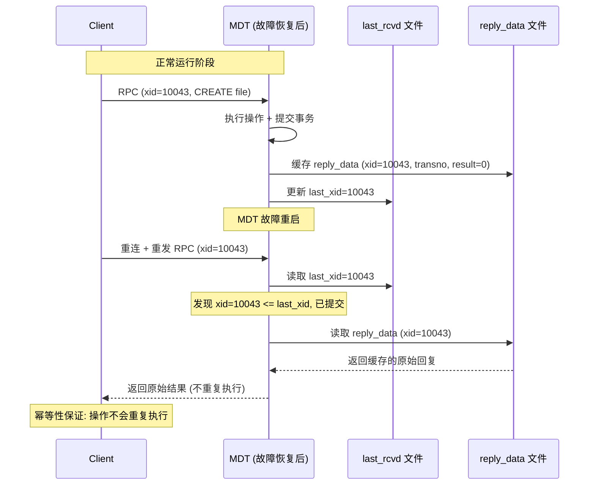

**VBR（Version-Based Replay）**：每个对象维护版本号。重放时对比版本号，不匹配则拒绝重放并重建客户端缓存。

### 2.3 PTLRPC 重试机制

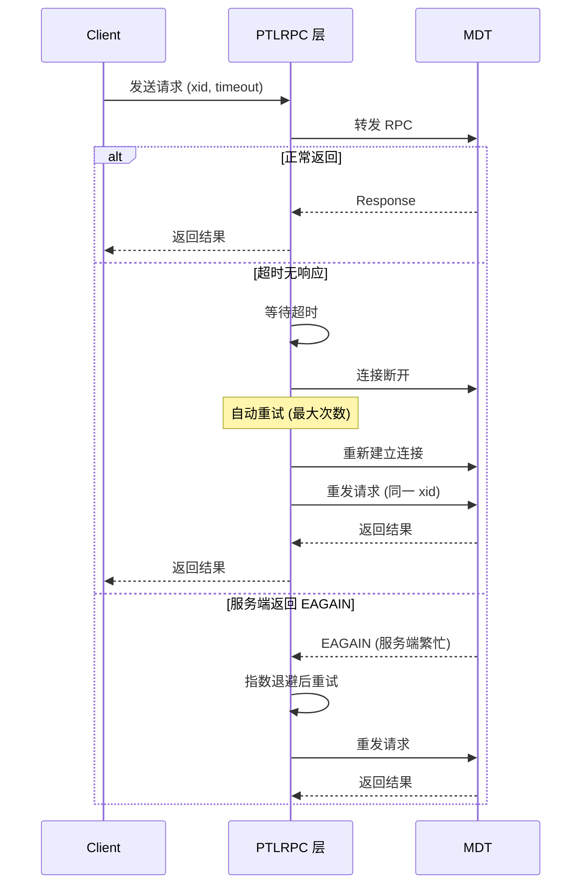

---

## 3. Layer 2: 锁一致性（LDLM）

### 3.1 LDLM 分布式锁概述

```c
// lustre/include/lustre_dlm.h:14-23
// 基于 VAX DLM，两大职责:
// 1. 提供锁机制保证所有 Lustre 节点间数据一致性
// 2. 允许客户端通过持锁来缓存受锁保护的状态
```

### 3.2 Intent Lock（意图锁）— 元数据一致性核心

Intent Lock 是 Lustre 最重要的锁一致性机制：**将锁获取和元数据操作原子化**。客户端发送 Intent 请求时，MDT 先处理锁请求，在同一个 RPC 中返回锁 + 操作结果。

| Intent 类型 | 操作 | 锁模式 | 作用 |
|------------|------|--------|------|
| `IT_CREAT` | 创建文件 | INODE(PW) + IBITS | 创建前检查重名 |
| `IT_OPEN` | 打开文件 | INODE + EXTENT | 返回最新属性 |
| `IT_GETATTR` | 获取属性 | IBITS | 返回最新 size/mtime |
| `IT_LAYOUT` | 获取布局 | IBITS | 返回最新条带布局 |
| `IT_READDIR` | 读目录 | INODE(PR) | 返回目录内容 |
| `IT_GETXATTR` | 获取 xattr | IBITS | 返回扩展属性 |

### 3.3 Intent Lock 流程时序

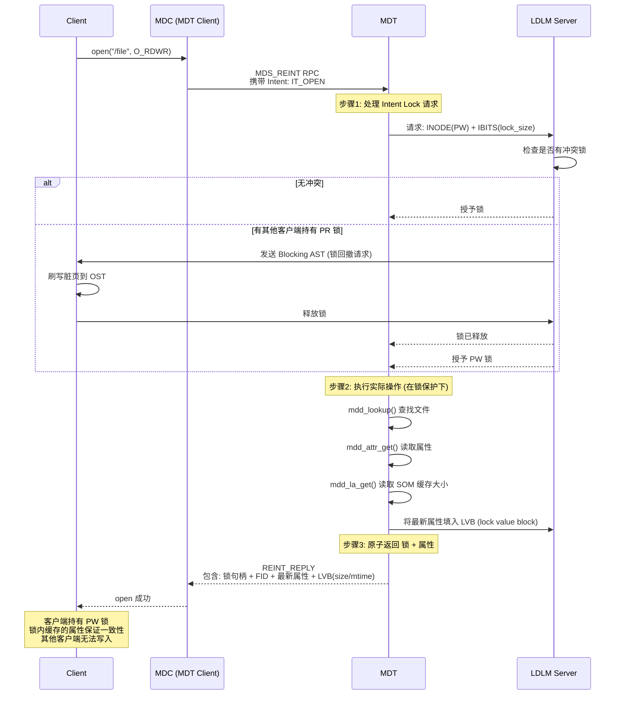

### 3.4 AST 回调（锁回收一致性）

当其他客户端需要访问已被锁保护的资源时，LDLM 通过 AST（Asynchronous Trap）回调通知当前客户端释放锁：

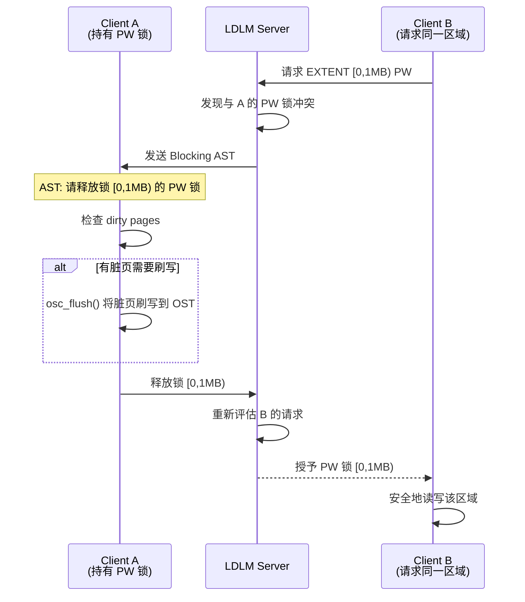

### 3.5 LVB（Lock Value Block）— 属性缓存一致性

LVB 携带在锁中返回，保证客户端看到**锁授予时刻**的最新属性：

```c
// lustre/include/uapi/linux/lustre/lustre_idl.h:1563
struct ost_lvb {
    __u64 lvb_size;       // 文件大小 (bytes)
    __s64 lvb_mtime;      // 修改时间
    __s64 lvb_atime;      // 访问时间
    __s64 lvb_ctime;      // 变更时间
    __u64 lvb_blocks;      // 分配的 512B 块数
    __u32 lvb_mtime_ns;   // 纳秒精度
    __u32 lvb_atime_ns;
    __u32 lvb_ctime_ns;
};
```

**关键点**：LVB 值在锁授予时从服务端获取，客户端持有锁期间属性不会过期，从而保证 `stat()` 返回一致的结果。

---

## 4. Layer 3: 元数据一致性

### 4.1 单 MDT 事务（jbd2）

MDT 使用 ldiskfs 的 jbd2 日志系统保证元数据操作的原子性：

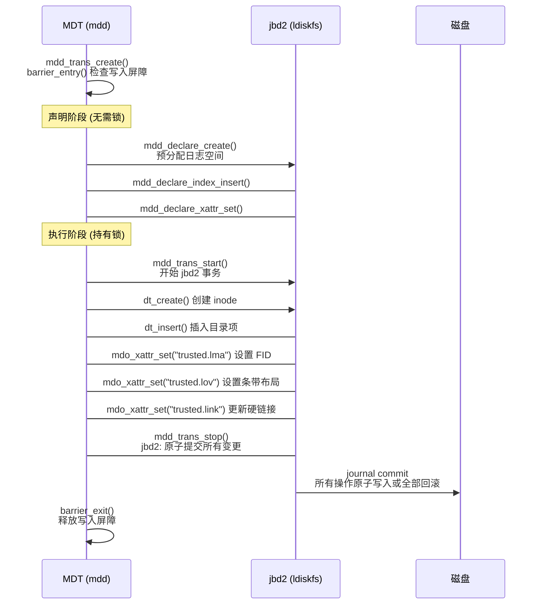

### 4.2 跨 MDT 事务（两阶段提交）

DNE 环境下的跨 MDT 操作（如跨 MDT rename）使用两阶段提交：

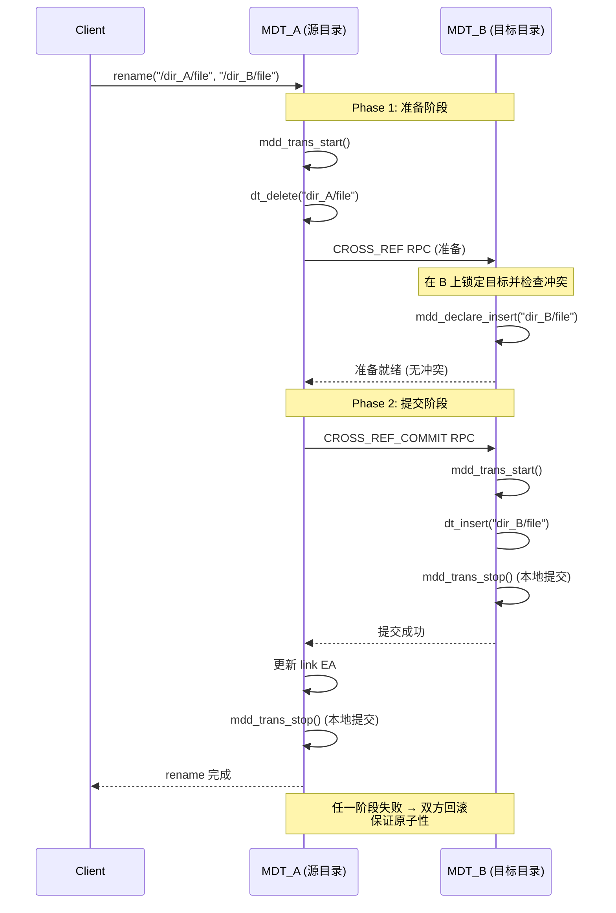

### 4.3 FID 唯一性

FID 的唯一性由 seq 分配器保证：

- 每个 seq 范围只分配给一个 MDT
- 客户端从已分配的 seq 范围内本地分配 OID，不会冲突
- seq 范围通过 LAST_ID 文件 + jbd2 事务持久化
- FID 永不重用

---

## 5. Layer 4: 数据一致性

### 5.1 OSC 客户端缓存一致性

客户端的 OSC 层缓存脏页，通过 LDLM 锁机制保证缓存一致性：

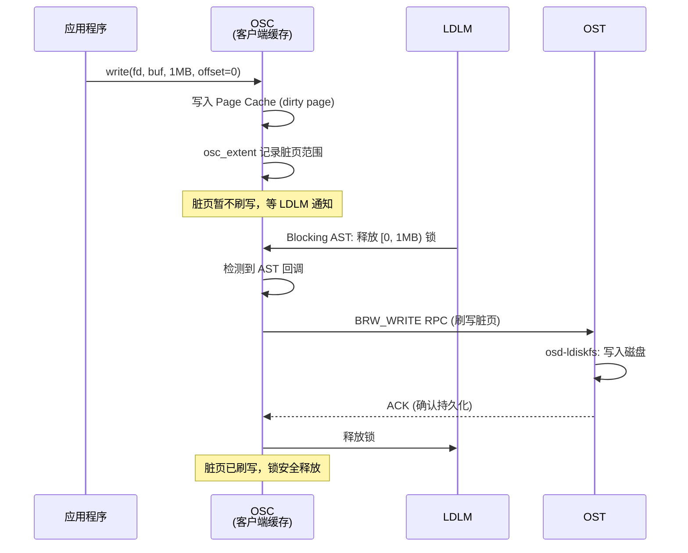

### 5.2 Grant 空间预约

Lustre 使用 Grant 机制预分配 OST 上的磁盘空间：

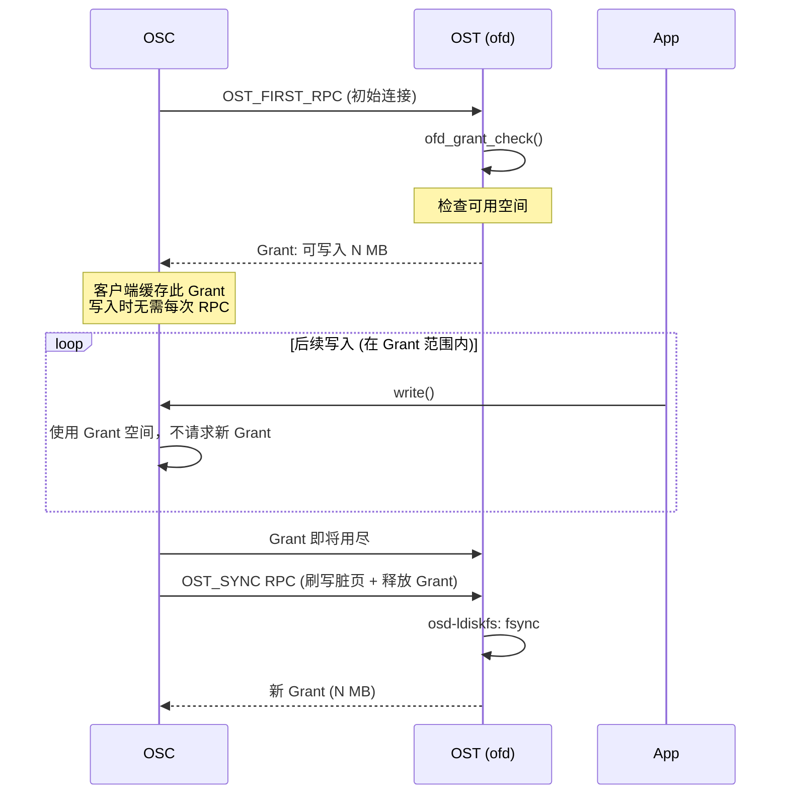

### 5.3 fsync/close 持久化保证

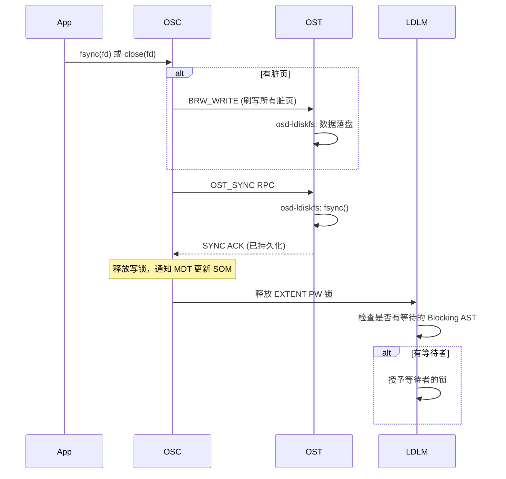

---

## 6. Layer 5: 冗余一致性

### 6.1 FLR（File Level Redundancy）镜像

FLR 通过多副本镜像提供数据冗余：

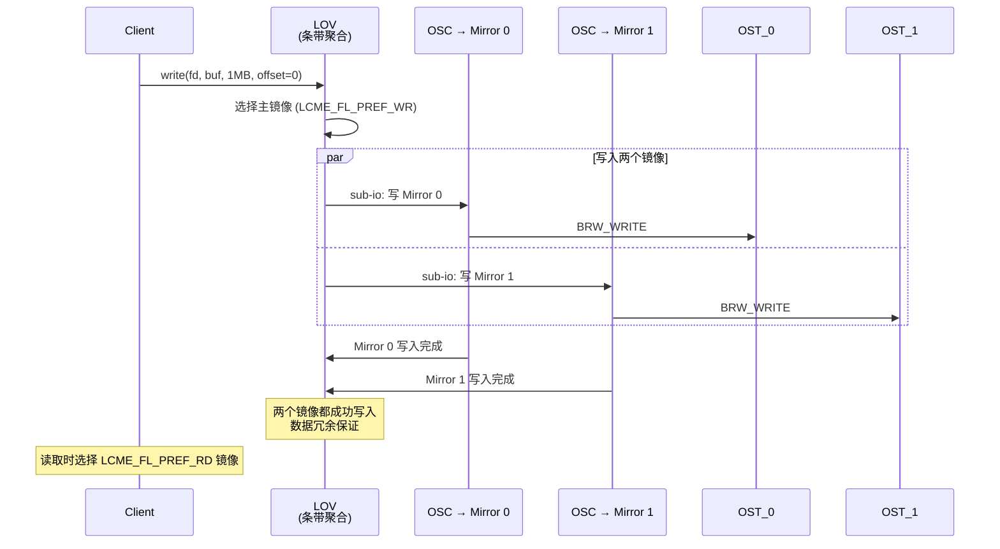

### 6.2 EC（Erasure Coding）纠删码

EC 通过 k+p 编码提供数据保护：

```
示例: 4+2 EC 配置 (k=4, p=2)
┌────────┬────────┬────────┬────────┬─────────┬─────────┐
│Data_0 │Data_1 │Data_2 │Data_3 │Parity_0│Parity_1 │
│OST_0  │OST_1  │OST_2  │OST_3  │OST_4   │OST_5   │
└────────┴────────┴────────┴────────┴─────────┴─────────┘
│←──── stripe_width = 6 × stripe_size ────→│

任意 2 个 OST 故障，数据仍可恢复
```

### 6.3 LFSCK 在线自修复

LFSCK（Lustre File System Check）在运行时检测和修复不一致：

| 检查类型 | 检测内容 | 修复操作 |
|----------|----------|----------|
| **Namespace LFSCK** | MDT inode 与 link EA 不一致 | 修复孤立 inode、重建 link EA |
| **Layout LFSCK** | LOV EA 与 OST 对象不匹配 | 修复 LOV EA hole、重建丢失的 OST 对象 |
| **DNE LFSCK** | LMV 条目与实际 MDT 不一致 | 修复分布式目录映射 |

---

## 7. Layer 6: 恢复一致性

### 7.1 MDT 故障恢复完整流程

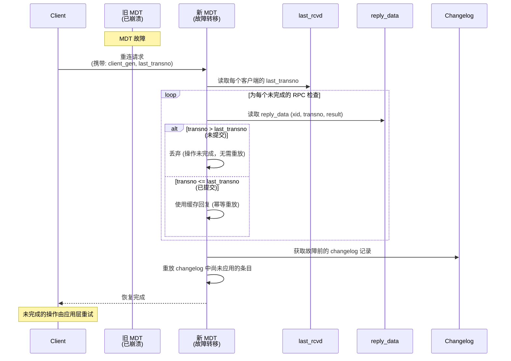

### 7.2 Orphan 机制

当文件被 unlink 但仍有客户端打开时，MDT 将其移入 PENDING 目录（orphan）：

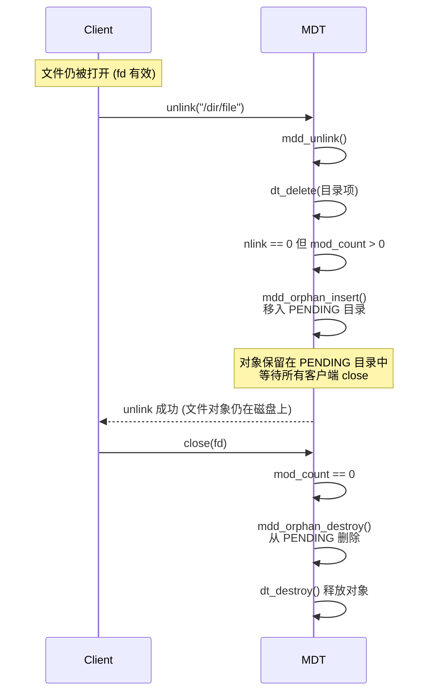

**崩溃恢复场景**：MDT 重启后扫描 PENDING 目录，对 `mod_count == 0` 的对象执行 `orphan_destroy()`。

---

## 8. 一致性保障策略总结

### 8.1 按操作类型的一致性保障

| 操作 | 锁机制 | 事务 | 持久化 | 冗余 |
|------|--------|------|--------|------|
| **create** | INODE(PW) + IBITS | jbd2 | sync | — |
| **open** | INODE + EXTENT + LVB | — | — | — |
| **read** | EXTENT(PR) | — | — | FLR/EC |
| **write** | EXTENT(PW) | — | fsync | FLR/EC |
| **stat** | IBITS + LVB | — | — | — |
| **unlink** | INODE(PW) + IBITS | jbd2 | sync | — |
| **rename** | INODE(PW) + PDO | jbd2 | sync | — |
| **setattr** | IBITS(UPDATE) | jbd2 | sync | — |
| **mkdir** | INODE(PW) + IBITS | jbd2 | sync | — |
| ** readdir** | INODE(PR) | — | — | — |

### 8.2 故障场景分析

| 故障场景 | 检测机制 | 恢复方式 |
|----------|----------|----------|
| **客户端崩溃** | MDT 检测断连 | 客户端重连，orphan 清理打开文件 |
| **MDT 崩溃** | OST 心跳超时 | last_rcvd + reply_data 重放 + changelog |
| **MDT 崩溃 + 数据丢失** | LFSCK 检测 | LFSCK 重建丢失的 MDT inode |
| **OST 崩溃** | OSS 心跳超时 | OST 重启后 OST 对象仍在 ldiskfs 中 |
| **OST 崩溃 + 数据丢失** | LFSCK Layout 检测 | LFSCK 修复 LOV EA hole |
| **网络分区** | PTLRPC 超时 | 锁超时释放 + 客户端重连重放 |
| **元数据损坏** | jbd2 journal replay | journal 回放修复 |
| **数据损坏** | T10/CRC 校验 | 检测到校验错误返回 EIO |

### 8.3 与其他系统的一致性机制对比

| 维度 | Lustre | 3FS | Doris |
|------|--------|-----|-------|
| **分布式锁** | LDLM (VAX DLM) | CoLockManager (per-chunk) | FE 全局锁 (无细粒度数据锁) |
| **事务** | jbd2 (本地) + 2PC (跨 MDT) | FDB SSI | FE BDB JE 两阶段提交 |
| **元数据持久化** | ldiskfs jbd2 journal | FDB 事务 | EditLog + Image 快照 |
| **数据持久化** | fsync + write barrier | Chain Replication 5步 ACK | BE 本地磁盘 + FE 路由 |
| **故障恢复** | RPC 重放 + Changelog | RPC 重试 + 幂等 (IDEM) | FE EditLog 回放 |
| **校验** | CRC32/Adler/T10 | MD5 per chunk | 无端到端校验 |
| **冗余** | FLR 镜像 + EC 纠删码 | Chain Replication (3副本) | Tablet 级 3 副本 |
| **自修复** | LFSCK 在线检查 | 无 | 无 (需人工介入) |

---

## 9. 关键源码索引

| 一致性机制 | 关键文件 | 核心函数/结构 |
|------------|----------|---------------|
| LDLM 锁 | `lustre/ldlm/ldlm_lock.c` | `ldlm_grant()`, `ldlm_enqueue()` |
| AST 回调 | `lustre/ldlm/ldlm_request.c` | `ldlm_blocking_ast()` |
| Intent Lock | `lustre/mdc/mdc_locks.c` | IT_OPEN, IT_CREAT, IT_GETATTR 处理 |
| jbd2 事务 | `lustre/mdd/mdd_trans.c` | `mdd_trans_create/start/stop()` |
| Orphan | `lustre/mdd/mdd_orphans.c` | `mdd_orphan_insert/delete/destroy()` |
| RPC 重放 | `lustre/mdt/mdt_recovery.c` | `mdt_req_from_lrd()`, VBR |
| SOM | `lustre/mdt/mdt_som.c` | `mdt_get_som()`, `mdt_lsom_update()` |
| 校验和 | `lustre/include/obd_cksum.h` | CRC32, CRC32C, T10 系列 |
| OSC 刷写 | `lustre/osc/osc_cache.c` | AST 回调触发 `osc_flush()` |
| LVB | `lustre/mdt/mdt_lvb.c` | `mdt_lvbo_fill()`, `mdt_dom_disk_lvbo_update()` |
| Changelog | `lustre/mdd/mdd_dir.c` | `mdd_changelog_store()`, `mdd_changelog_ns_store()` |
| LFSCK | `lustre/lfsck/` | Namespace, Layout, DNE 检查 |
| 写屏障 | `lustre/mdd/mdd_trans.c` | `barrier_entry()`, `barrier_exit()` |
| 跨 MDT | `lustre/mdt/mdt_handler.c` | CROSS_REF, CROSS_REF_COMMIT |
