# Lustre 元数据管理策略深度分析

## 1. 元数据架构总览

Lustre 将元数据管理和数据存储完全分离，MDT（Metadata Target）专门负责元数据操作。

```
┌─────────────────────────────────────────────────────────────┐
│                    元数据管理架构                             │
│                                                             │
│  ┌───────────────────────────────────────────────────────┐  │
│  │                   MDT (元数据目标)                     │  │
│  │                                                       │  │
│  │  ┌─────────┐   ┌─────────┐   ┌──────────────────┐   │  │
│  │  │  MDT    │   │  MDD    │   │    LOD            │   │  │
│  │  │ RPC入口 │──→│ MD设备  │──→│ LOV + LMV 管理    │   │  │
│  │  └─────────┘   └─────────┘   └──────────────────┘   │  │
│  │                      │                                │  │
│  │  ┌───────────────────────────────────────────────┐   │  │
│  │  │           osd-ldiskfs (后端存储)                │   │  │
│  │  │  每个 MDT inode = ldiskfs inode + xattrs      │   │  │
│  │  └───────────────────────────────────────────────┘   │  │
│  └───────────────────────────────────────────────────────┘  │
│                                                             │
│  ┌───────────────────────────────────────────────────────┐  │
│  │               辅助子系统                                │  │
│  │  FID: 全局唯一标识    LDLM: 分布式锁                   │  │
│  │  FLD: 位置索引         SOM: 缓存文件大小              │  │
│  │  Changelog: 变更日志   LFSCK: 一致性检查              │  │
│  └───────────────────────────────────────────────────────┘  │
└─────────────────────────────────────────────────────────────┘
```

### MDT 设备栈

```
┌──────────────────────────────────────────┐
│            MDT (mdt_handler.c)            │  ← RPC 入口分发 (portal 12)
├──────────────────────────────────────────┤
│         MDD (mdd_object.c, mdd_dir.c)     │  ← 元数据设备驱动
│    ├─ 目录操作: lookup, create, unlink    │
│    ├─ 属性操作: getattr, setattr          │
│    └─ xattr 操作: get, set, list, delete  │
├──────────────────────────────────────────┤
│          LOD (lod_lov.c, lod_dev.c)       │  ← LOV/LMV 管理
│    ├─ 文件创建时分配条带布局 (LOV)        │
│    ├─ 目录创建时设置分布式属性 (LMV)      │
│    └─ 条带化布局的加载和解析               │
├──────────────────────────────────────────┤
│        osd-ldiskfs (osd_handler.c)        │  ← ldiskfs 后端适配
│    ├─ FID → ldiskfs inode 映射 (OI)      │
│    ├─ xattr 读写 (LMA, LOV, LMV, SOM)   │
│    └─ 目录项管理                          │
├──────────────────────────────────────────┤
│            ldiskfs (扩展 ext4)            │  ← 本地文件系统
└──────────────────────────────────────────┘
```

---

## 2. 元数据的磁盘存储

### 2.1 每个 MDT 对象的磁盘布局

MDT 上的每个文件或目录对应一个 ldiskfs inode，元数据通过 **扩展属性（xattr）** 存储：

```
ldiskfs inode
├── i_mode, i_uid, i_gid, i_size     ← 标准 ext4 inode 属性
├── i_atime, i_mtime, i_ctime         ← 时间戳
├── i_nlink                           ← 硬链接计数
│
├── trusted.lma  ← Lustre Metadata Attributes (必须)
│   └── struct lustre_mdt_attrs
│       ├── lma_compat       (兼容特性位图)
│       ├── lma_incompat     (不兼容特性位图)
│       └── lma_self_fid     (本对象 FID)  ← 最关键！
│
├── trusted.fid  ← 父目录 FID
├── trusted.link ← 硬链接信息 (link_ea)
│   └── struct link_ea_header
│       ├── leh_magic = 0x11EAF1DF
│       ├── leh_reccount (硬链接数)
│       ├── leh_len (总大小)
│       └── entries[] (每条: parent_fid + name)
│
├── trusted.lov  ← 文件条带布局 (仅文件)
│   └── struct lov_mds_md_v1/v3
│       ├── lmm_pattern (RAID0/MDT/...)
│       ├── lmm_stripe_size, lmm_stripe_count
│       └── lmm_objects[] (每条带的 OST ID)
│
├── trusted.lmv  ← 分布式目录映射 (仅目录)
│   └── struct lmv_user_md_v1
│       ├── lum_stripe_count (MDT 分片数)
│       ├── lum_hash_type (FNV-1a / CRUSH)
│       └── lum_objects[] (每个 MDT 分片的 FID)
│
├── trusted.dmv  ← 默认 LMV (子目录继承)
├── trusted.som  ← Size-on-MDT 缓存属性
│   └── struct lustre_som_attrs
│       ├── lsa_size  (缓存的文件大小)
│       └── lsa_blocks (缓存的块数)
│
├── trusted.hsm  ← HSM 层级存储状态
├── system.posix_acl_access  ← POSIX ACL
└── system.posix_acl_default ← 默认 POSIX ACL
```

### 2.2 LMA 结构详解

LMA（Lustre Metadata Attributes）是每个 MDT 对象**必须**有的 xattr，自 Lustre 2.4 起为所有新创建对象自动设置：

```c
// lustre/include/uapi/linux/lustre/lustre_user.h:495
struct lustre_mdt_attrs {
    __u32 lma_compat;               // 兼容性特性标志
    __u32 lma_incompat;             // 不兼容特性标志
    struct lu_fid lma_self_fid;     // 本对象的 FID (最关键字段)
};
```

LMA 的核心作用：**ldiskfs 不原生支持 FID，LMA 在 inode 上记录了 FID，使得 Lustre 能通过 FID 定位任意对象**。

### 2.3 硬链接管理（Link EA）

Lustre 通过 `trusted.link` xattr 管理硬链接，而非依赖 inode 的 `i_nlink`：

```c
// lustre/include/uapi/linux/lustre/lustre_idl.h:3484
struct link_ea_header {
    __u32 leh_magic;           // 0x11EAF1DF
    __u32 leh_reccount;        // 硬链接计数
    __u64 leh_len;             // 总大小
    __u32 leh_overflow_time;   // 溢出时间戳
    __u32 leh_padding;
};

struct link_ea_entry {
    unsigned char lee_reclen[2];           // big-endian 记录长度
    unsigned char lee_parent_fid[16];      // 父目录 FID
    char lee_name[];                       // 文件名
};
```

Link EA 大小限制为 **4096 字节**（`MAX_LINKEA_SIZE`），每个 entry 约 26 字节 + 文件名长度。当硬链接过多超出限制时，`leh_overflow_time` 记录溢出发生时间，部分链接信息会丢失（通过 LFSCK 可修复）。

---

## 3. FID 标识符系统

### 3.1 FID 结构

```c
// lustre/include/uapi/linux/lustre/lustre_user.h:362
struct lu_fid {
    __u64 f_seq;   // 序列号 (同一 seq 的对象在同一 MDT/OST)
    __u32 f_oid;   // 对象号 (seq 内自增)
    __u32 f_ver;   // 版本号 (快照/独立子树)
};
```

### 3.2 FID 分配时序

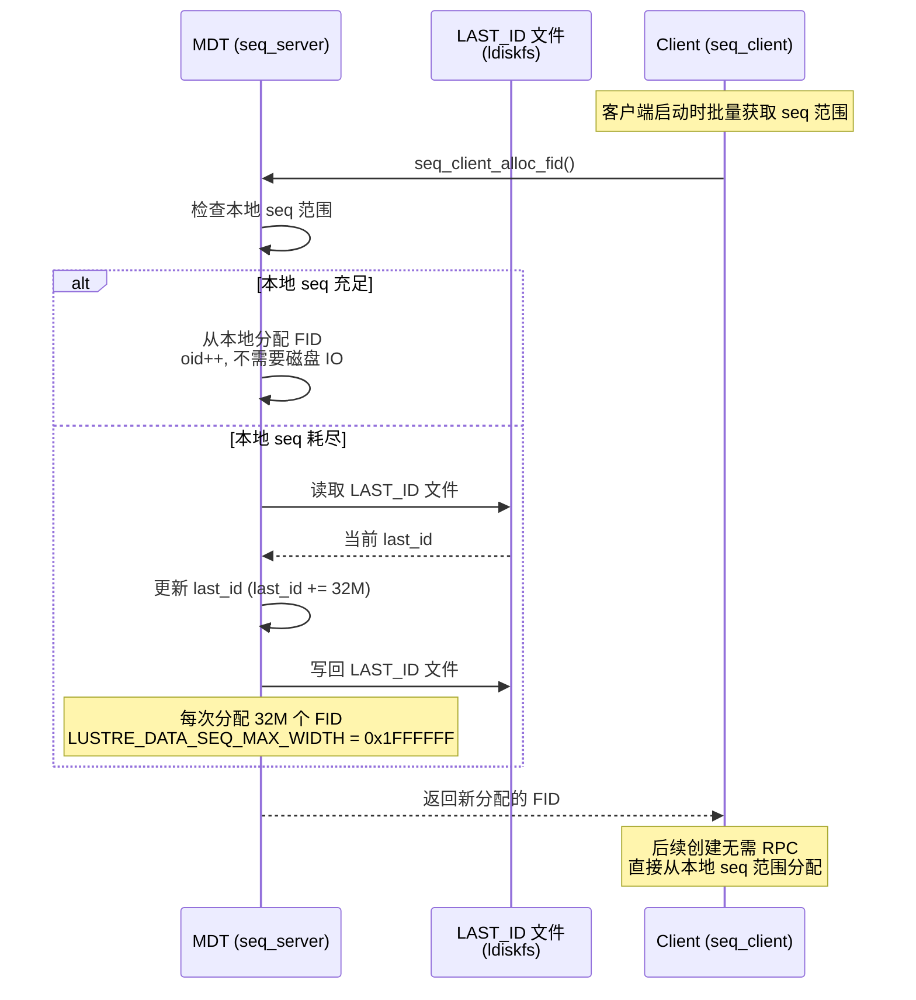

### 3.3 OI 索引：FID 到 ldiskfs inode 的映射

OST 上的每个对象也是 ldiskfs inode，通过 OI（Object Index）实现 FID → inode 的查找：

```
OI 桶布局 (.lustre/oi/oi.16.X):
┌─────────────────────────────────────────────┐
│  oi.16.0/                                   │
│  ├── key: FID(seq=0x200000400, oid=1)       │
│  │   val: osd_inode_id(ino=12345, gen=0)    │
│  ├── key: FID(seq=0x200000400, oid=2)       │
│  │   val: osd_inode_id(ino=12346, gen=0)    │
│  └── ...                                     │
│                                              │
│  OSD_OI_FID_OID_BITS = 6                     │
│  总共 64 个 hash 桶 (1 << 6)                  │
└─────────────────────────────────────────────┘
```

---

## 4. 目录操作

### 4.1 文件创建（open with O_CREAT）

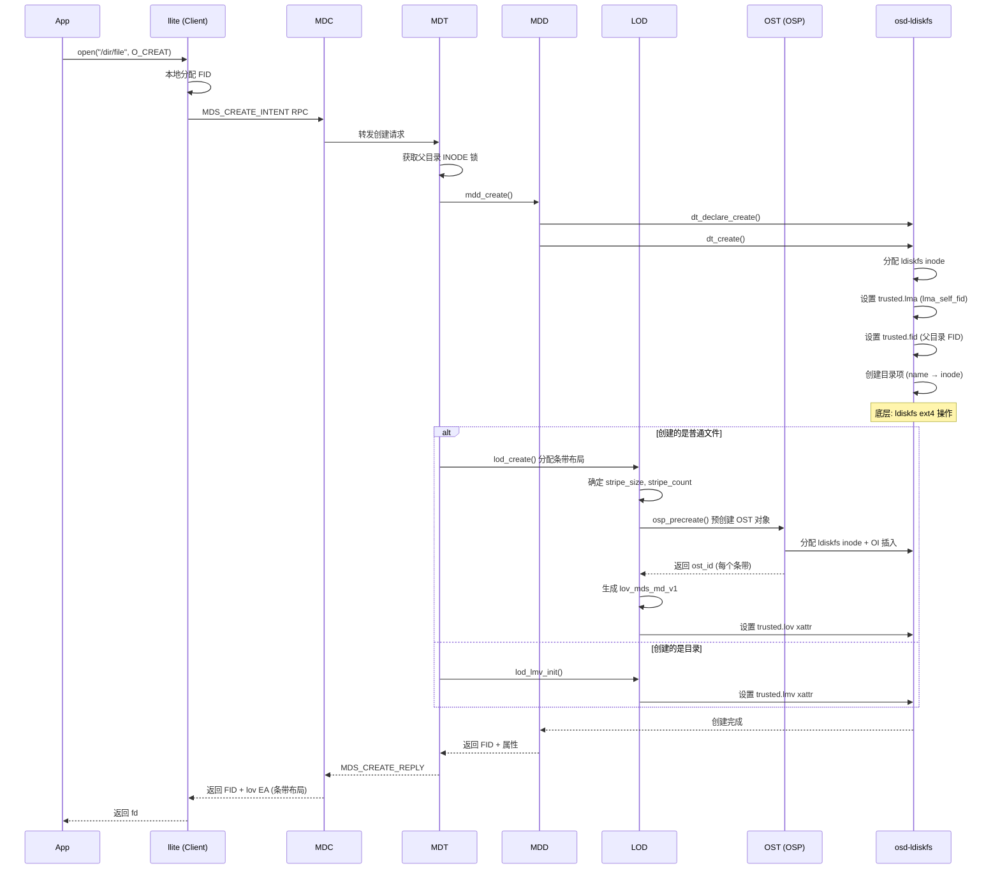

### 4.2 目录查找（lookup / stat）

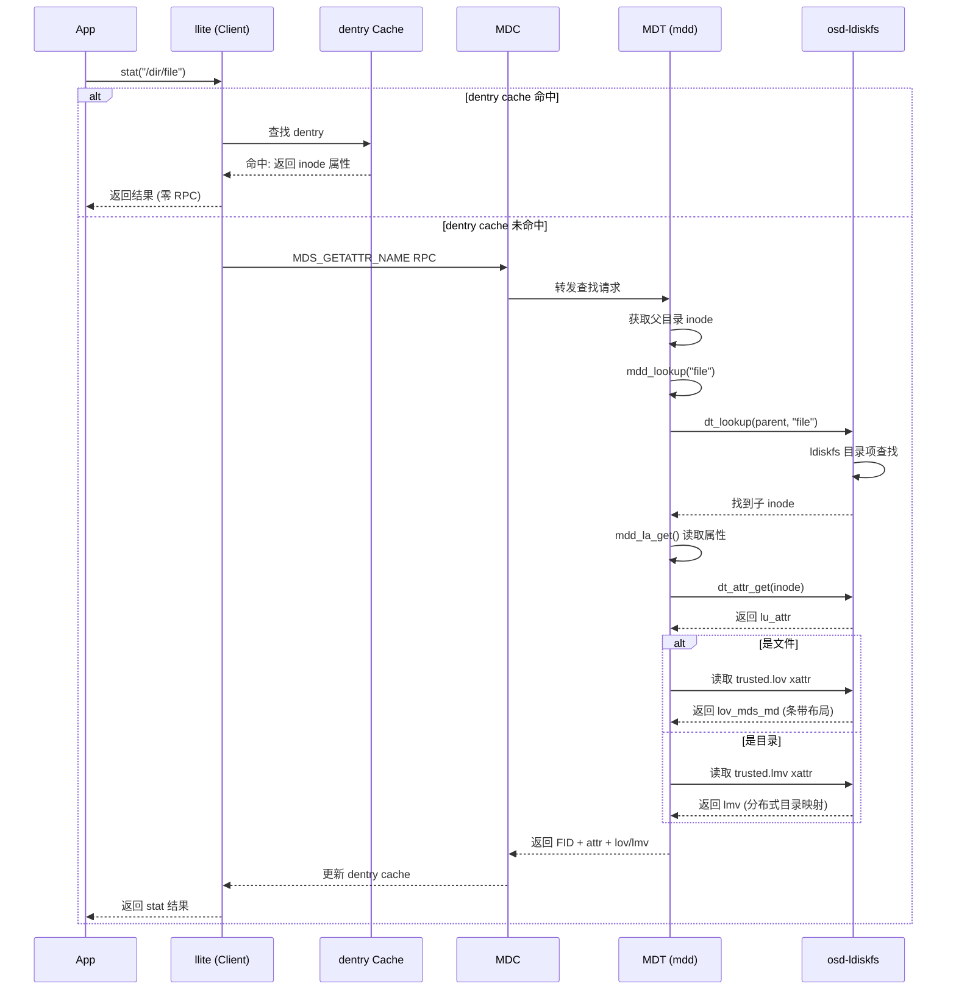

### 4.3 文件删除（unlink）

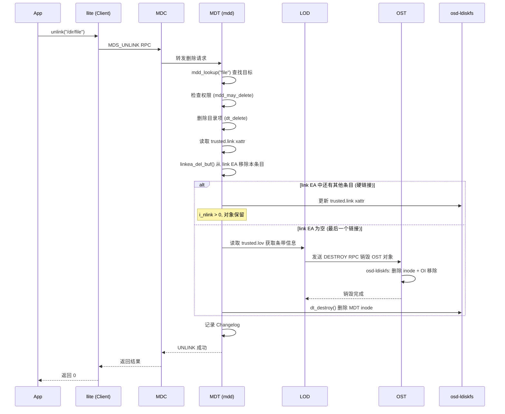

### 4.4 文件重命名（rename）

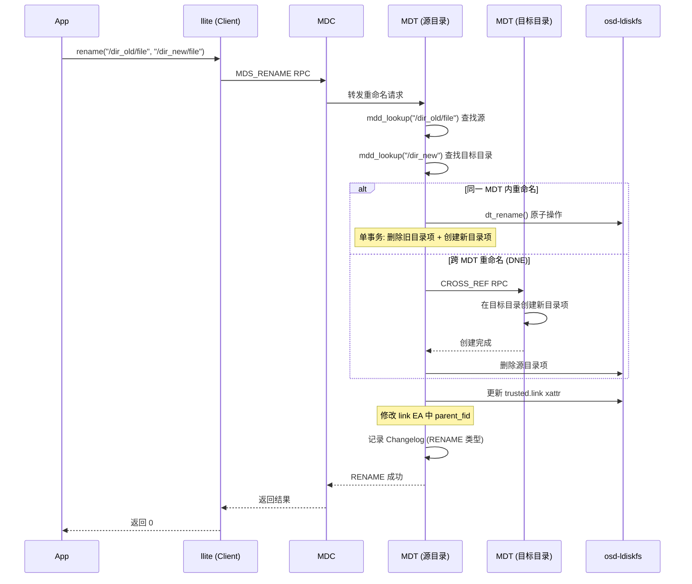

---

## 5. 条带布局管理（LOD）

### 5.1 LOV EA 创建时序

当 MDT 创建一个新文件时，LOD 负责为其分配条带布局：

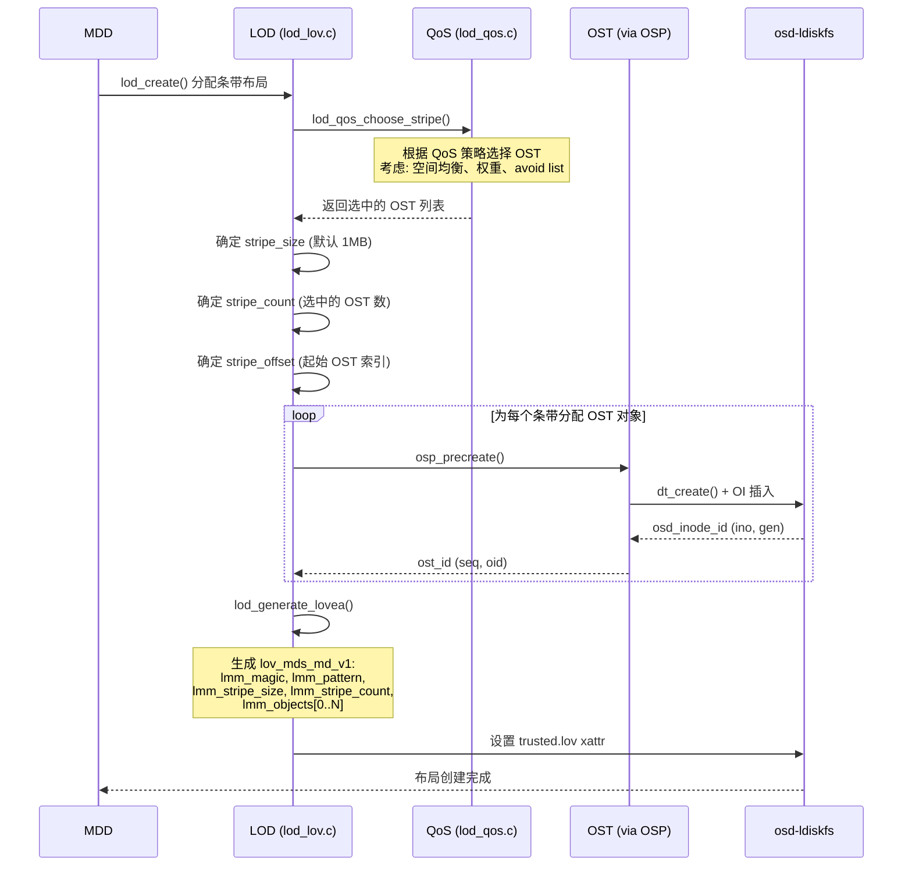

### 5.2 LOV EA 加载时序（getattr）

当客户端 stat 一个文件时，MDT 需要加载并返回条带信息：

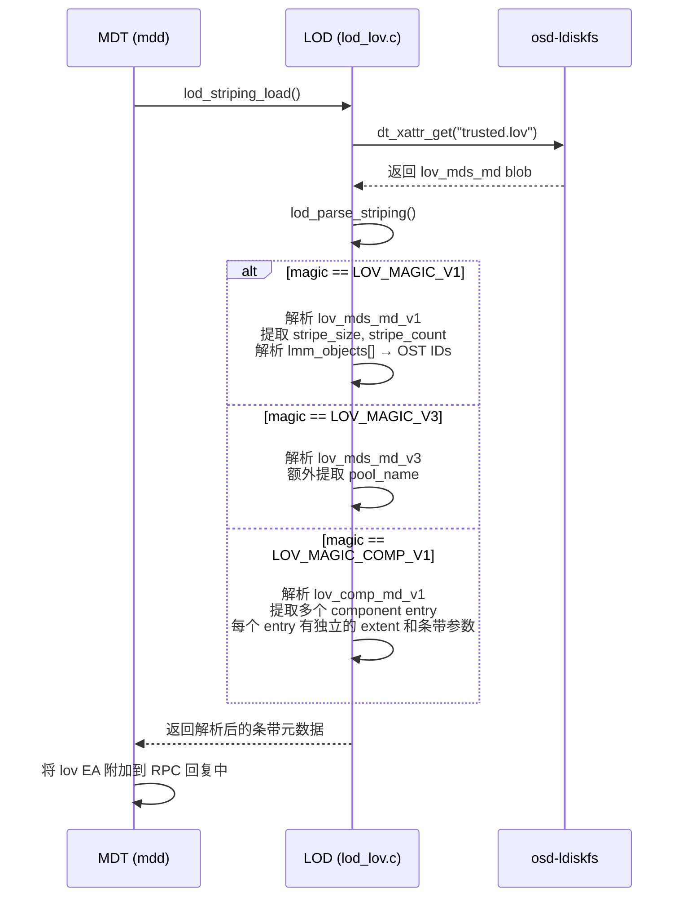

---

## 6. 分布式目录（LMV）

### 6.1 LMV 条带化目录

Lustre 2.x 通过 LMV（Logical Metadata Volume）将目录条带化到多个 MDT：

```
/stripe_dir/ (stripe_count=4, hash_type=FNV-1a)
├── trusted.lmv xattr:
│   ├── lum_magic = 0x0CD30CD0
│   ├── lum_stripe_count = 4
│   ├── lum_hash_type = LMV_HASH_TYPE_FNV_1A
│   └── lum_objects[]:
│       ├── [0]: FID → MDT_0 上的子目录 inode
│       ├── [1]: FID → MDT_1 上的子目录 inode
│       ├── [2]: FID → MDT_2 上的子目录 inode
│       └── [3]: FID → MDT_3 上的子目录 inode
│
├── file_a  → hash("file_a") % 4 = 2 → MDT_2
├── file_b  → hash("file_b") % 4 = 0 → MDT_0
├── file_c  → hash("file_c") % 4 = 3 → MDT_3
└── file_d  → hash("file_d") % 4 = 1 → MDT_1
```

### 6.2 LMV 条带目录创建时序

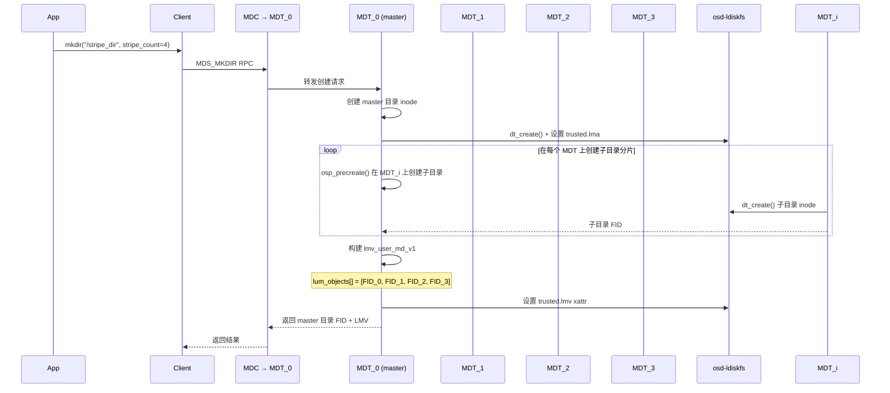

### 6.3 分布式目录查找时序

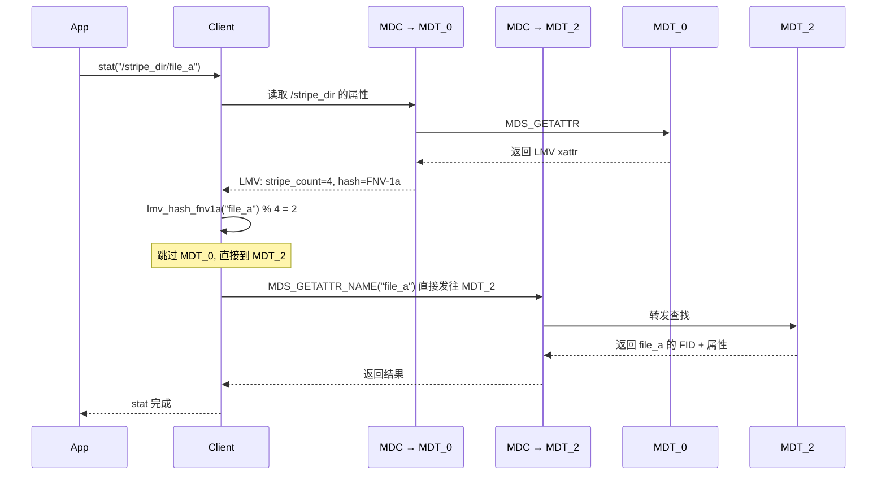

---

## 7. Size-on-MDT (SOM)

### 7.1 SOM 机制

为了避免每次 `stat()` 都要向 OST 查询文件大小，Lustre 在 MDT 上缓存文件大小（SOM）：

```c
// lustre/include/uapi/linux/lustre/lustre_user.h:557
struct lustre_som_attrs {
    __u16 lsa_valid;       // 有效性标志 (SOM_FL_STRICT/LAZY/STALE)
    __u16 lsa_reserved[3];
    __u64 lsa_size;        // 缓存的文件大小
    __u64 lsa_blocks;      // 缓存的块数
};
```

### 7.2 SOM 更新时序

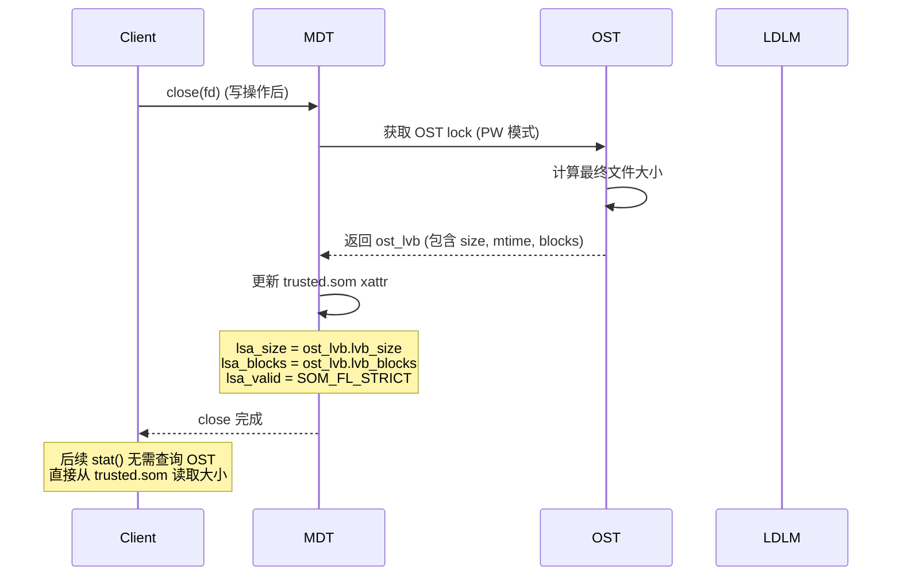

### 7.3 SOM 有效性标志

| 标志 | 值 | 含义 |
|------|-----|------|
| `SOM_FL_UNKNOWN` | 0 | 未知，需要从 OST 获取 |
| `SOM_FL_STRICT` | 1 | 严格正确（FLR 或 DoM 文件保证一致） |
| `SOM_FL_STALE` | 2 | 已过期（文件被打开写后变得不准确） |
| `SOM_FL_LAZY` | 4 | 近似值，需要 sync 才能保证最终一致 |

---

## 8. Changelog（变更日志）

### 8.1 Changelog 记录格式

每次元数据变更都会记录一条 Changelog：

```c
// lustre/include/uapi/linux/lustre/lustre_user.h:2080
struct changelog_rec {
    __u16 cr_namelen;       // 文件名长度
    __u16 cr_flags;         // 标志 (CLF_RENAME, CLF_JOBID, ...)
    __u32 cr_type;          // 操作类型
    __u64 cr_index;         // 日志记录序号
    __u64 cr_prev;          // 同一 fid 的上一条记录序号
    __u64 cr_time;          // 时间戳
    union {
        struct lu_fid cr_tfid;      // 目标 FID
        __u32 cr_markerflags;       // CL_MARK 标志
    };
    struct lu_fid cr_pfid;          // 父目录 FID
};
```

### 8.2 Changelog 记录类型

| 类型 | 说明 | 包含 cr_tfid | 包含 cr_pfid |
|------|------|:---:|:---:|
| `CL_CREATE` | 文件创建 | Y | Y |
| `CL_MKDIR` | 目录创建 | Y | Y |
| `CL_UNLINK` | 文件删除 | Y | Y |
| `CL_RMDIR` | 目录删除 | Y | Y |
| `CL_RENAME` | 重命名 | Y | Y (旧父) |
| `CL_SETATTR` | 属性修改 | Y | N |
| `CL_TRUNC` | 截断 | Y | N |
| `CL_HSM` | HSM 操作 | Y | Y |
| `CL_LAYOUT` | 布局变更 | Y | N |
| `CL_CLOSE` | 文件关闭 | Y | N |

### 8.3 元数据操作 → Changelog 记录时序

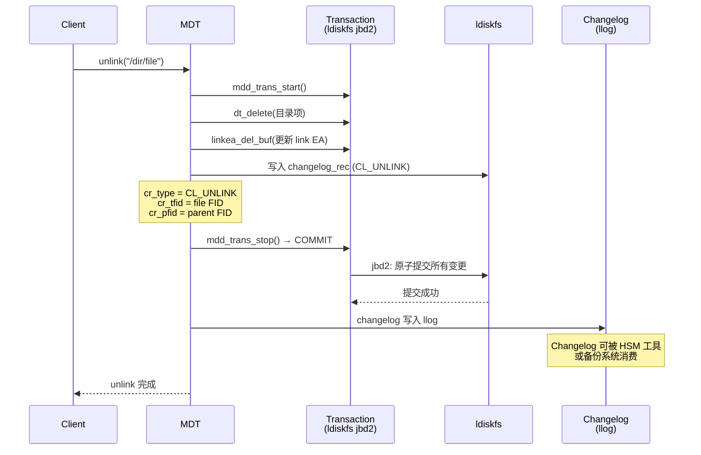

---

## 9. 事务模型

### 9.1 基于 ldiskfs (ext4) 的事务

Lustre 的 MDT 使用 ldiskfs 的 jbd2 日志系统保证元数据一致性：

```
一次元数据操作的事务边界:
┌──────────────────────────────────────────┐
│         jbd2 Transaction                  │
│                                           │
│  1. dt_declare_xxx()  → 预分配块         │
│  2. mdd_trans_start()  → 开始事务         │
│  3. dt_xattr_set()     → 设置 LMA        │
│  4. dt_insert()        → 插入目录项       │
│  5. dt_xattr_set()     → 设置 LOV EA     │
│  6. mdd_trans_stop()   → 提交/回滚        │
│                                           │
│  所有操作原子提交或全部回滚                  │
└──────────────────────────────────────────┘
```

### 9.2 跨 MDT 操作（DNE 分布式事务）

跨 MDT 的 rename 操作需要分布式事务协调：

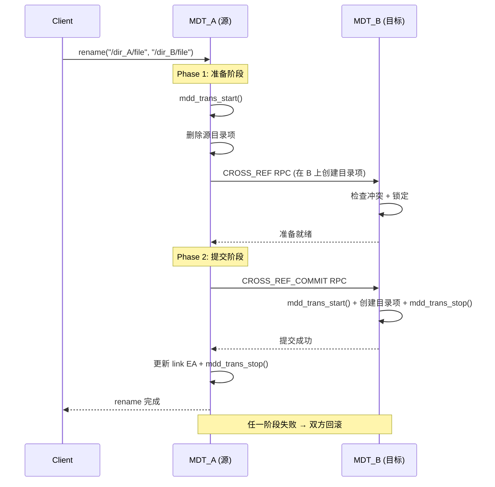

---

## 10. MDT 恢复机制

### 10.1 Last Recvd 文件

每个 MDT 维护一个 `last_rcvd` 文件，记录每个客户端的最后一个已提交事务 ID，用于恢复时判断哪些 RPC 需要重放：

```
.lustre/
└── last_rcvd
    ├── export for Client A: last_xid = 10042
    ├── export for Client B: last_xid = 5023
    └── ...
```

### 10.2 MDT 故障恢复时序

```mermaid
sequenceChart
    title MDT 故障恢复流程
    Client A--xMDT: RPC in-flight (xid=10043) 超时
    Client A->MDT: 重连
    MDT->MDT: 读取 last_rcvd
    Note over MDT: Client A: last_xid = 10042<br/>客户端 RPC xid=10043 未提交

    MDT->Client A: 发送最后已提交 xid
    Client A->MDT: 重放未提交的 RPC (xid=10043)
    MDT->MDT: mdt_reint_replay()
    MDT-->>Client A: 重放完成
    Note over MDT,Client A: 仅重放 last_xid 之后的请求<br/>确保幂等性
```

---

## 11. LFSCK（一致性检查和修复）

LFSCK（Lustre File System Check）是 Lustre 的在线一致性检查工具，可修复元数据损坏：

| 检查类型 | 功能 | 修复内容 |
|----------|------|----------|
| **Namespace LFSCK** | 检查 MDT inode 一致性 | 修复孤立 inode、link EA 不一致 |
| **Layout LFSCK** | 检查 LOV EA 与 OST 对象一致性 | 修复 LOV EA hole、丢失的 OST 对象 |
| **DNE LFSCK** | 检查分布式目录一致性 | 修复 LMV 条目与实际 MDT 的不一致 |

---

## 12. 元数据管理策略总结

### 12.1 策略对比

| 维度 | 策略 | 目的 |
|------|------|------|
| **标识** | FID (seq:oid:ver) | 全局唯一，客户端本地分配减少 RPC |
| **存储** | ldiskfs inode + xattrs | 利用成熟 ext4 生态 |
| **布局** | trusted.lov (LOV EA) | 文件→OST 对象映射 |
| **目录** | trusted.lmv (LMV EA) | 目录跨 MDT 条带化 |
| **硬链接** | trusted.link (Link EA) | 支持跨 MDT 硬链接，限 4KB |
| **文件大小** | trusted.som (SOM EA) | MDT 缓存文件大小，减少 stat RPC |
| **FID 查找** | trusted.lma (LMA EA) | 每个 inode 记录自己的 FID |
| **对象映射** | OI 索引 (FID→inode) | OST 上的 FID 到 ldiskfs inode 映射 |
| **一致性** | ldiskfs jbd2 事务 | 单 MDT 操作原子性 |
| **跨 MDT** | 两阶段提交 (CROSS_REF) | 跨 MDT 操作原子性 |
| **恢复** | last_rcvd + RPC 重放 | MDT 故障后恢复未提交操作 |
| **变更追踪** | Changelog (llog) | 记录所有元数据变更，供 HSM/备份消费 |
| **自修复** | LFSCK | 在线检查修复元数据不一致 |
| **QoS** | lod_qos (权重/空间均衡) | 智能选择 OST 分配条带 |

### 12.2 与其他系统的对比

| 维度 | Lustre | 3FS | Doris |
|------|--------|-----|-------|
| **元数据存储** | ldiskfs (ext4) + xattrs | FoundationDB (KV) | BDB JE (edit log) + Image |
| **标识系统** | FID (128-bit) | InodeId (自定义编码) | 表名+分区+tablet |
| **事务** | ldiskfs jbd2 | FDB SSI | FE BDB JE 两阶段提交 |
| **目录分布** | LMV (多 MDT 条带) | 无 (单点) | 无 (分区级) |
| **文件大小缓存** | SOM (MDT xattr) | 无 | 无 |
| **硬链接** | Link EA (4KB 限制) | 无 | 无 |
| **变更日志** | Changelog (llog) | 无 | Edit Log |

---

## 13. 关键源码索引

| 子系统 | 关键文件 | 核心内容 |
|--------|----------|----------|
| MDT 入口 | `lustre/mdt/mdt_handler.c` | RPC 分发 |
| 重放 | `lustre/mdt/mdt_reint.c` | create/unlink/rename 重放 |
| MDD 核心 | `lustre/mdd/mdd_object.c` | 对象属性操作 |
| MDD 目录 | `lustre/mdd/mdd_dir.c` | lookup/create/unlink |
| MDD 事务 | `lustre/mdd/mdd_trans.c` | 事务开始/提交/回滚 |
| MDD 权限 | `lustre/mdd/mdd_permission.c` | 权限检查 |
| SOM | `lustre/mdt/mdt_som.c` | Size-on-MDT |
| LVB | `lustre/mdt/mdt_lvb.c` | Lock Value Block |
| 恢复 | `lustre/mdt/mdt_recovery.c` | last_rcvd + 重放 |
| LOD | `lustre/lod/lod_lov.c` | 条带布局创建/解析 |
| LOD QoS | `lustre/lod/lod_qos.c` | OST 选择策略 |
| LOV 偏移 | `lustre/lov/lov_offset.c` | offset → stripe 映射 |
| Link EA | `lustre/obdclass/linkea.c` | 硬链接管理 |
| FID | `lustre/fid/fid_request.c` | FID 分配 |
| FID 存储 | `lustre/fid/fid_store.c` | LAST_ID 文件 |
| LMV | `lustre/include/lustre_lmv.h` | 分布式目录结构 |
| OI | `lustre/osd-ldiskfs/osd_oi.c` | FID → inode 索引 |
| Changelog | `lustre/mdd/mdd_changelog.c` | 变更日志记录 |
| xattr | `lustre/mdt/mdt_xattr.c` | 扩展属性处理 |
