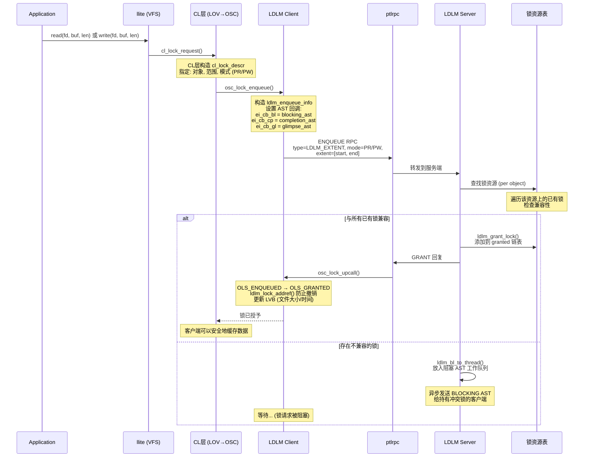
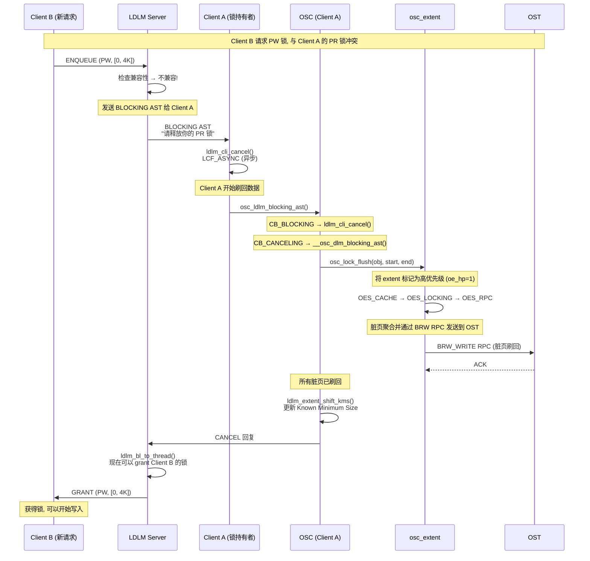
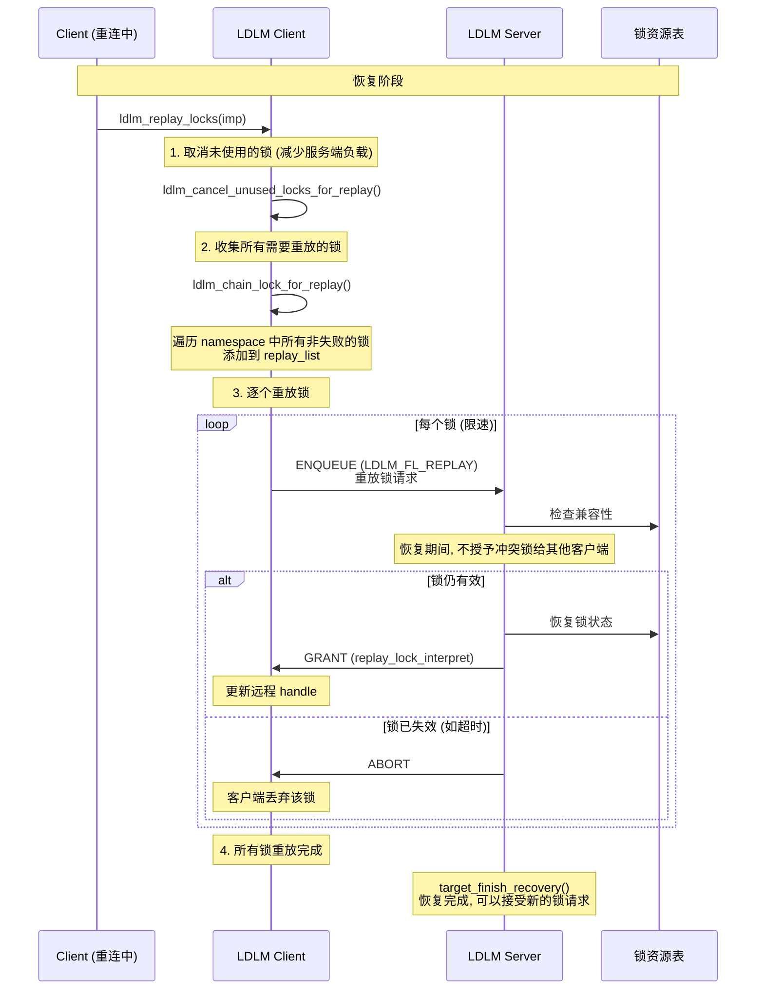

# Lustre 分布式锁 (LDLM) 分析

---

## 目录

1. [LDLM 概述与主要作用](#1-ldlm-概述与主要作用)
2. [锁类型与锁模式](#2-锁类型与锁模式)
3. [兼容性矩阵](#3-兼容性矩阵)
4. [锁请求与授予流程](#4-锁请求与授予流程)
5. [锁撤销 (Blocking AST)](#5-锁撤销-blocking-ast)
6. [锁与 IO 的交互](#6-锁与-io-的交互)
7. [锁恢复 (Replay)](#7-锁恢复-replay)
8. [CL 层锁封装](#8-cl-层锁封装)
9. [与 Ceph Capability 对比](#9-与-ceph-capability-对比)
10. [关键源码索引](#10-关键源码索引)

---

## 1. LDLM 概述与主要作用

### 1.1 LDLM 是什么

```
LDLM = Lustre Distributed Lock Manager
基于 VAX DLM 的分布式锁管理器

  ┌──────────────────────────────────────────────────────────────┐
  │  LDLM 的两大核心作用 (lustre_dlm.h:14-21)                    │
  │                                                              │
  │  作用 1: 数据一致性                                          │
  │    多客户端同时读写同一文件时                                  │
  │    通过锁控制并发访问，保证数据不损坏                          │
  │                                                              │
  │  作用 2: 客户端缓存                                          │
  │    客户端持有锁期间可以缓存数据                                │
  │    只有在有冲突的锁请求或 LRU 淘汰时才释放                    │
  │    → 这是 Lustre 高性能的关键: 客户端缓存 + 锁保护            │
  └──────────────────────────────────────────────────────────────┘
```

### 1.2 LDLM 在架构中的位置

```
  Client A                    MDT/OST                     Client B
  ────────                    ───────                     ────────
  ┌─────────┐              ┌────────────┐              ┌─────────┐
  │ llite   │              │  LDLM      │              │ llite   │
  │ VFS层   │              │  Server    │              │ VFS层   │
  └────┬────┘              │  (锁管理器) │              └────┬────┘
       │                   └──────┬─────┘                   │
  ┌────▼────┐                     │                  ┌────▼────┐
  │ CL层    │    ENQUEUE RPC      │     ENQUEUE RPC   │ CL层    │
  │ LOV/OSC│ ◄───────────────────►│◄────────────────── │ LOV/OSC│
  │ (客户端 │    GRANT/CANCEL      │    GRANT/CANCEL    │ (客户端 │
  │  锁)   │ ◄───────────────────►│◄────────────────── │  锁)   │
  └─────────┘                     │                  └─────────┘
                                  │
                          ┌───────▼───────┐
                          │  锁资源表     │
                          │  (namespace)  │
                          │  per object   │
                          └───────────────┘
```

### 1.3 LDLM 的三个主要角色

```
角色 1: 并发控制
  多客户端同时访问同一对象 → 锁保证串行化
  例: Client A 写 offset 0-4K, Client B 写 offset 4K-8K
      → PW 锁覆盖不同区域 → 并行写入
      → PW 锁重叠 → 一个等待另一个完成

角色 2: 客户端缓存保护
  持有 PR 锁 → 可以缓存读数据
  持有 PW 锁 → 可以缓存写数据 (dirty pages)
  释放锁前必须刷回数据
  → 避免每次 IO 都访问服务端

角色 3: 崩溃恢复
  客户端断连后，服务端知道它持有哪些锁
  恢复时客户端重放 (replay) 这些锁
  → 确保恢复期间不会有冲突的锁授予给其他客户端
```

---

## 2. 锁类型与锁模式

### 2.1 锁类型 (ldlm_type)

```c
// lustre_idl.h:2589
enum ldlm_type {
    LDLM_PLAIN   = 10,  // 普通锁 (用于特殊内部场景)
    LDLM_EXTENT  = 11,  // 范围锁 (文件 IO, 覆盖 [start, end] 字节范围)
    LDLM_FLOCK   = 12,  // POSIX flock (fcntl 锁)
    LDLM_IBITS   = 13,  // inode bits 锁 (元数据保护, 如 open/close)
};
```

### 2.2 锁模式 (ldlm_mode)

```c
// lustre_idl.h:2571
enum ldlm_mode {
    LCK_EX    = 1,    // 排他锁 (最严格, 只允许一个持有者)
    LCK_PW    = 2,    // 写意向锁 (Protect Write, 允许并发写不同区域)
    LCK_PR    = 4,    // 读锁 (Protect Read, 允许并发读)
    LCK_CW    = 8,    // 并发写锁 (Concurrent Write)
    LCK_CR    = 16,   // 并发读锁 (Concurrent Read)
    LCK_NL    = 32,   // 空锁 (Null, 不保护任何东西)
    LCK_GROUP = 64,   // 组锁 (用于多对象原子操作)
    LCK_COS   = 128,  // Commit-on-Share 锁 (事务提交后降级)
    LCK_TXN   = 256,  // 事务锁 (DNE 分布式事务中使用)
};
```

### 2.3 各模式在 Lustre 中的用途

```
  ┌──────────┬─────────────────────────────────────────────────────┐
  │ 模式      │ 用途                                                │
  ├──────────┼─────────────────────────────────────────────────────┤
  │ LCK_NL   │ 空锁, 无保护. 用于锁降级后的状态                       │
  ├──────────┼─────────────────────────────────────────────────────┤
  │ LCK_PR   │ 文件读锁 (OST). 持有者可以缓存文件数据                  │
  │          │ 多个 PR 可以共存 (并发读)                              │
  ├──────────┼─────────────────────────────────────────────────────┤
  │ LCK_PW   │ 文件写锁 (OST). 持有者可以缓存脏页                      │
  │          │ 不同区域的 PW 可以共存 (并发写不同区域)                 │
  │          │ 同一区域只能有一个 PW                                  │
  ├──────────┼─────────────────────────────────────────────────────┤
  │ LCK_EX   │ 排他锁. 唯一持有者, 最严格                              │
  │          │ 用于: unlink, truncate, setattr 等破坏性操作            │
  │          │       flock 的排他模式                                 │
  ├──────────┼─────────────────────────────────────────────────────┤
  │ LCK_CW   │ 并发写锁 (MDT). 允许多个客户端同时创建/写入              │
  │          │ 用于 MDT 上的并发文件创建                                │
  ├──────────┼─────────────────────────────────────────────────────┤
  │ LCK_CR   │ 并发读锁 (MDT). 允许多个客户端同时读取目录                │
  ├──────────┼─────────────────────────────────────────────────────┤
  │ LCK_COS  │ Commit-on-Share. 事务完成后 EX/PW 降级为此              │
  │          │ 允许其他事务在共享模式下继续使用                          │
  ├──────────┼─────────────────────────────────────────────────────┤
  │ LCK_GROUP│ 组锁. 多个对象的原子操作 (如 rename)                     │
  │          │ 要么全部锁定, 要么全部不锁                               │
  ├──────────┼─────────────────────────────────────────────────────┤
  │ LCK_TXN  │ 事务锁. DNE 分布式事务中 PW/EX 降级为此                  │
  │          │ 比 COS 更严格, 防止未提交事务被覆盖                      │
  └──────────┴─────────────────────────────────────────────────────┘
```

---

## 3. 兼容性矩阵

### 3.1 矩阵定义

```
// lustre_dlm.h:135-146

         NL   CR   CW   PR   PW   EX  GROUP  COS  TXN
  ──────────────────────────────────────────────────────────
  NL       1    1    1    1    1    1    1     1    1
  CR       1    1    1    1    1    0    0     0    1
  CW       1    1    1    0    0    0    0     0    0
  PR       1    1    0    1    0    0    0     0    1
  PW       1    1    0    0    0    0    0     0    0
  EX       1    0    0    0    0    0    0     0    0
  GROUP    1    0    0    0    0    0    1     0    0
  COS      1    0    0    0    0    0    0     1    0
  TXN      1    1    0    1    0    0    0     0    1

  1 = 兼容 (可以共存)
  0 = 不兼容 (不能共存, 需要等待或撤销)
```

### 3.2 关键语义解读

```
  读场景:
    Client A: PR (读)  ←→  Client B: PR (读)  → 兼容 ✓ 并发读
    Client A: PR (读)  ←→  Client B: PW (写)  → 不兼容 ✗ 读写互斥

  写场景:
    Client A: PW (写, 0-4K)  ←→  Client B: PW (写, 4K-8K)
    → PW 与 PW 本身不兼容, 但通过 EXTENT 范围判断:
       如果范围不重叠 → 服务端可能 grant
       如果范围重叠 → 撤销 A 的锁后再 grant B

  破坏性操作:
    Client A: EX (排他, truncate) ←→ 任何锁 → 不兼容
    → 必须撤销所有其他客户端的锁才能执行

  并发创建:
    Client A: CW (并发写, MDT)  ←→  Client B: CW (并发写, MDT)
    → 兼容 ✓ 多客户端可以同时创建不同文件
```

---

## 4. 锁请求与授予流程

### 4.1 锁请求时序



### 4.2 服务端锁授予逻辑

```
ldlm_handle_enqueue() (ldlm_lockd.c):

  1. 查找锁资源: ldlm_resource_find()
     → 按 (type, namespace, name) 查找
     → name = 对象标识 (FID for LDLM_EXTENT/IBITS)

  2. 检查是否已有匹配的锁: ldlm_lock_match()
     → 已有一个兼容且范围覆盖的锁 → 返回 ELDLM_LOCK_MATCHED

  3. 创建新锁: ldlm_lock_create()

  4. 兼容性检查:
     遍历该资源上所有已授予的锁
     对每个锁: lockmode_compat(exist_mode, new_mode)
     如果全兼容 → ldlm_grant_lock()
     如果有冲突 → ldlm_bl_to_thread() 发送 blocking AST

  5. ldlm_grant_lock():
     → 将锁从 converting 移到 granted 链表
     → 回复客户端 GRANT
```

---

## 5. 锁撤销 (Blocking AST)

### 5.1 撤销时序



### 5.2 撤销流程详解

```cpp
// osc_lock.c:522
osc_ldlm_blocking_ast(dlmlock, new, data, flag):

  if (flag == LDLM_CB_BLOCKING):
    // 第一次通知: "有人需要你的锁, 请准备释放"
    → ldlm_cli_cancel(&lockh, LCF_ASYNC)
    // 异步发送 cancel, 不阻塞当前线程

  if (flag == LDLM_CB_CANCELING):
    // 第二次通知: "你必须立即释放"
    → __osc_dlm_blocking_ast()

// osc_lock.c:405
__osc_dlm_blocking_ast():
  1. 获取 osc_object: dlmlock->l_ast_data
  2. 确定锁模式 (READ/WRITE)
  3. osc_lock_flush(obj, start, end, mode, discard)
     → osc_cache_writeback_range()
       → 标记 extent 为高优先级 (oe_hp)
       → osc_check_rpcs() 立即触发 writeback
     → osc_lock_discard_pages()
       → 丢弃缓存页
  4. ldlm_extent_shift_kms()
     → 重新计算 Known Minimum Size
  5. 清空 dlmlock->l_ast_data
```

---

## 6. 锁与 IO 的交互

### 6.1 锁保护缓存的核心模型

```
  ┌────────────────────────────────────────────────────────────┐
  │  锁与缓存的关系 (以文件读写为例)                             │
  │                                                             │
  │  Client A 持有 PW 锁 [0, 1MB]                              │
  │    → 可以安全地将 [0, 1MB] 的脏页缓存在本地                  │
  │    → 其他客户端请求重叠区域的锁时, 必须先刷回                 │
  │                                                             │
  │  Client B 持有 PR 锁 [1MB, 2MB]                            │
  │    → 可以安全地缓存 [1MB, 2MB] 的数据在本地                  │
  │    → 修改不会被写入 (只读缓存)                               │
  │                                                             │
  │  如果 Client C 请求 PW [0.5MB, 1.5MB]:                     │
  │    → 与 A 的 PW 冲突 → 撤销 A 的锁 → A 刷回脏页             │
  │    → 与 B 的 PR 冲突 → 撤销 B 的锁 → B 丢弃缓存             │
  │    → C 获得锁 → C 可以缓存 [0.5MB, 1.5MB]                  │
  └────────────────────────────────────────────────────────────┘
```

### 6.2 osc_extent 与 ldlm_lock 的关联

```
struct osc_extent:
  ...
  struct ldlm_lock *oe_dlmlock;  // 覆盖此 extent 的 DLM 锁

关联过程:

  1. 应用写入页面 → osc_queue_async_io()
  2. osc_extent_find() 查找/创建 osc_extent
  3. 从 IO 上下文获取 osc_lock:
     olck = osc_env_io(env)->oi_write_osclock;
     LASSERT(olck->ols_state == OLS_GRANTED);
  4. 将 DLM 锁关联到 extent:
     cur->oe_dlmlock = ldlm_lock_get(olck->ols_dlmlock);

约束:
  - 不同 DLM 锁覆盖的 extent 不能合并
  - 只有同一 DLM 锁的 extent 才能合并为更大的 IO
  - extent 的范围必须在 DLM 锁的范围之内
```

### 6.3 OSC Lock 状态机

```
struct osc_lock 状态转换:

  ┌──────────────┐     osc_lock_enqueue()     ┌──────────────┐
  │  OLS_NEW     │ ─────────────────────────→ │ OLS_ENQUEUED │
  │  (新建)       │                            │ (已发送请求)   │
  └──────────────┘                            └──────┬───────┘
                                                     │
                               osc_lock_upcall()  (服务端回复)
                                                     │
                     ┌─────────────────────────────┘
                     │
                     ▼
           ┌──────────────────────┐
           │ OLS_UPCALL_RECEIVED │  (收到 GRANT)
           └──────────┬───────────┘
                      │
           osc_lock_granted()
                      │
                      ▼
           ┌──────────────┐
           │ OLS_GRANTED  │  (锁已授予, 可用于 IO)
           │              │  ols_dlmlock != NULL
           │              │  ols_hold = true
           └──────────────┘
                      │
           osc_lock_cancel() 或 blocking_ast
                      │
                      ▼
           ┌──────────────┐
           │ OLS_CANCELLED│  (锁已撤销)
           └──────────────┘
```

---

## 7. 锁恢复 (Replay)

### 7.1 恢复概述

```
客户端断连重连后的锁恢复:

  ┌──────────────────────────────────────────────────────────────┐
  │  为什么要重放锁?                                             │
  │                                                              │
  │  场景: Client A 持有 PW 锁, 缓存了脏页                        │
  │       Client A 与 OST 断连                                    │
  │       OST 不知道 Client A 是否还活着                          │
  │       此时不能把锁给其他客户端 (数据可能还在 A 的缓存中)        │
  │                                                              │
  │  恢复流程:                                                   │
  │  1. Client A 重连 OST                                         │
  │  2. Client A 重放所有仍持有的锁                                │
  │  3. OST 确认: A 的锁仍然有效                                   │
  │  4. OST 在 A 恢复期间, 不会将冲突锁授予其他客户端              │
  │  5. A 的锁恢复完成 → 正常服务                                  │
  └──────────────────────────────────────────────────────────────┘
```

### 7.2 锁重放时序



---

## 8. CL 层锁封装

### 8.1 分层锁架构

```
CL (Cache Layer) 锁是对 LDLM 锁的面向对象封装:

  ┌─────────────────────────────────────────┐
  │           cl_lock                        │
  │  (CL 层统一锁接口)                        │
  │                                          │
  │  cll_descr: {obj, extent, mode}         │
  │                                          │
  │  cll_layers: 锁切片链表                  │
  │    ┌────────────────────────────┐        │
  │    │ cl_lock_slice (LOV层)     │        │
  │    │  → 条带化文件的多分量锁管理  │        │
  │    └─────────────┬──────────────┘        │
  │                  │                       │
  │    ┌─────────────▼──────────────┐        │
  │    │ cl_lock_slice (OSC层)     │        │
  │    │  → osc_lock (包裹 ldlm_lock)│       │
  │    │  → 实际与 LDLM 交互         │        │
  │    └────────────────────────────┘        │
  └─────────────────────────────────────────┘

  操作调用链:
    cl_lock_enqueue()  → LOV: lov_lock_enqueue()  → OSC: osc_lock_enqueue()
    cl_lock_cancel()   → LOV: lov_lock_cancel()   → OSC: osc_lock_cancel()
    cl_lock_release()  → cl_lock_cancel() + cl_lock_fini()
```

### 8.2 AST 回调链

```
LDLM 有 4 种 AST (Asynchronous System Trap) 回调:

  ┌──────────────────────────────────────────────────────────────┐
  │  回调类型        │ 注册位置         │ 作用                    │
  ├──────────────────────────────────────────────────────────────┤
  │  blocking_ast    │ ei_cb_bl         │ 服务端通知客户端释放锁    │
  │                  │ osc_ldlm_        │ → 触发数据刷回/缓存失效   │
  │                  │ blocking_ast      │                          │
  ├──────────────────────────────────────────────────────────────┤
  │  completion_ast  │ ei_cb_cp         │ 锁请求完成通知            │
  │                  │ ldlm_completion  │ → 唤醒等待的线程          │
  │                  │ _ast             │                          │
  ├──────────────────────────────────────────────────────────────┤
  │  glimpse_ast     │ ei_cb_gl         │ 服务端查询客户端缓存状态  │
  │                  │ osc_ldlm_        │ → 客户端返回文件大小/时间  │
  │                  │ glimpse_ast      │                          │
  ├──────────────────────────────────────────────────────────────┤
  │  weigh_ast       │ (内部使用)        │ 锁权重评估               │
  │                  │ osc_ldlm_        │ → LRU 淘汰时决定优先级    │
  │                  │ weigh_ast        │                          │
  └──────────────────────────────────────────────────────────────┘
```

### 8.3 LVB (Lock Value Block)

```
LVB = 附带在锁上的额外数据, 服务端在授予锁时返回

  对象存储 (OST) 上的 LVB (struct ost_lvb):
    ├── lvb_size     — 文件大小 (KMS: Known Minimum Size)
    ├── lvb_mtime    — 修改时间
    ├── lvb_atime    — 访问时间
    ├── lvb_ctime    — 元数据变更时间
    └── lvb_blocks   — 分配的块数

  用途:
    1. 客户端获得锁时, 同时获得最新的文件属性
       → 无需额外 RPC 获取文件大小
    2. Glimpse 操作: 服务端通过 glimpse_ast 查询客户端的缓存大小
       → 可以避免从磁盘读取文件属性

  更新时机:
    osc_lock_granted() → osc_lock_lvb_update()
    → 从 ldlm_lock 的 LVB 复制到 osc_object 的属性
```

---

## 9. 与 Ceph Capability 对比

| 维度 | Lustre LDLM | Ceph Capability |
|------|-------------|-----------------|
| **架构** | 分布式锁管理器 (VAX DLM 演化) | 客户端能力令牌 (MDS 签发) |
| **粒度** | 字节范围 (EXTENT) / inode bits | 整文件 (per inode) |
| **缓存模式** | 持锁期间可缓存, 丢锁时刷回 | Cap 有效期内可缓存, revoke 时刷回 |
| **并发读** | PR 锁, 多客户端兼容 | shared cap, 多客户端兼容 |
| **并发写** | PW 锁, 不同范围可共存 | exclusive cap, 单客户端 |
| **读升级写** | 需要重新请求锁 (PR→PW) | 需要 flush + 重新请求 cap |
| **冲突解决** | blocking AST → 撤销 → 重新授予 | revoke → flush → reissue |
| **恢复** | replay 所有锁 + LRU 取消 | reconnect + replay 请求 |
| **一致性保证** | 锁串行化访问 | Cap + FSCK 双层保证 |

---

## 10. 关键源码索引

| 模块 | 文件 | 关键内容 |
|------|------|---------|
| **LDLM 头文件** | `lustre/include/lustre_dlm.h:14` | LDLM 定义, 兼容性矩阵 |
| **兼容性矩阵** | `lustre/include/lustre_dlm.h:135` | lockmode_compat 表 |
| **兼容数组** | `lustre/ldlm/ldlm_lib.c:3446` | `lck_compat_array[]` |
| **锁模式** | `lustre/include/uapi/linux/lustre/lustre_idl.h:2571` | `enum ldlm_mode` |
| **锁类型** | `lustre/include/uapi/linux/lustre/lustre_idl.h:2589` | `enum ldlm_type` |
| **Extent 结构** | `lustre/include/uapi/linux/lustre/lustre_idl.h:2601` | `struct ldlm_extent` |
| **锁请求/回复** | `lustre/include/uapi/linux/lustre/lustre_idl.h:2692` | `struct ldlm_lock_desc` |
| **锁核心操作** | `lustre/ldlm/ldlm_lock.c` | `ldlm_lock_enqueue()`, `ldlm_grant_lock()` |
| **客户端入队** | `lustre/ldlm/ldlm_request.c` | `ldlm_cli_enqueue()`, `ldlm_cli_enqueue_fini()` |
| **Blocking AST** | `lustre/ldlm/ldlm_request.c` | `ldlm_blocking_ast()` |
| **锁重放** | `lustre/ldlm/ldlm_request.c:2905` | `__ldlm_replay_locks()` |
| **重放单个锁** | `lustre/ldlm/ldlm_request.c:2775` | `replay_one_lock()` |
| **重放结果处理** | `lustre/ldlm/ldlm_request.c:2722` | `replay_lock_interpret()` |
| **LRU 取消** | `lustre/ldlm/ldlm_request.c` | `ldlm_cancel_lru()` |
| **服务端处理** | `lustre/ldlm/ldlm_lockd.c` | `ldlm_handle_enqueue()`, `ldlm_bl_to_thread()` |
| **服务端 bl 回调** | `lustre/ldlm/ldlm_lockd.c` | `ldlm_handle_bl_callback()` |
| **Extent 处理** | `lustre/ldlm/ldlm_extent.c` | interval tree, KMS, extent 扩展 |
| **OSC lock 状态** | `lustre/include/lustre_osc.h:324` | `enum osc_lock_state` |
| **OSC lock 结构** | `lustre/include/lustre_osc.h:374` | `struct osc_lock` |
| **OSC lock 入队** | `lustre/osc/osc_lock.c:985` | `osc_lock_enqueue()` |
| **OSC lock 撤销** | `lustre/osc/osc_lock.c:1159` | `osc_lock_cancel()` |
| **OSC blocking_ast** | `lustre/osc/osc_lock.c:522` | `osc_ldlm_blocking_ast()` |
| **OSC flush** | `lustre/osc/osc_lock.c:347` | `osc_lock_flush()` |
| **OSC grant** | `lustre/osc/osc_lock.c:195` | `osc_lock_granted()` |
| **OSC upcall** | `lustre/osc/osc_lock.c:264` | `osc_lock_upcall()` |
| **OSC glimpse** | `lustre/osc/osc_lock.c:570` | `osc_ldlm_glimpse_ast()` |
| **Extent-DLM 关联** | `lustre/include/lustre_osc.h:951` | `oe_dlmlock` 字段 |
| **Extent 查找** | `lustre/osc/osc_cache.c:693` | `osc_extent_find()` (DLM lock 获取) |
| **CL lock 封装** | `lustre/include/cl_object.h:1131` | `struct cl_lock` |
| **CL lock 操作** | `lustre/obdclass/cl_lock.c:163` | `cl_lock_enqueue()` |
| **CL lock 释放** | `lustre/obdclass/cl_lock.c:241` | `cl_lock_release()` |
| **DLM flags** | `lustre/include/lustre_dlm_flags.h` | `LDLM_FL_HAS_INTENT` 等 |
